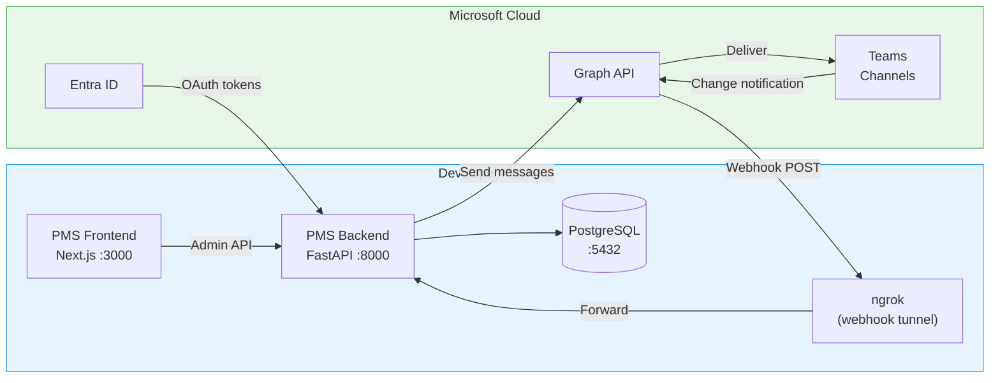

# Microsoft Teams Setup Guide for PMS Integration

**Document ID:** PMS-EXP-MSTEAMS-001
**Version:** 1.0
**Date:** 2026-03-10
**Applies To:** PMS project (all platforms)
**Prerequisites Level:** Intermediate

---

## Table of Contents

1. [Overview](#1-overview)
2. [Prerequisites](#2-prerequisites)
3. [Part A: Azure Entra ID App Registration](#3-part-a-azure-entra-id-app-registration)
4. [Part B: Install and Configure Microsoft Graph SDK](#4-part-b-install-and-configure-microsoft-graph-sdk)
5. [Part C: Integrate with PMS Backend](#5-part-c-integrate-with-pms-backend)
6. [Part D: Set Up Webhook Receiver for Listening](#6-part-d-set-up-webhook-receiver-for-listening)
7. [Part E: Integrate with PMS Frontend](#7-part-e-integrate-with-pms-frontend)
8. [Part F: Testing and Verification](#8-part-f-testing-and-verification)
9. [Troubleshooting](#9-troubleshooting)
10. [Reference Commands](#10-reference-commands)

---

## 1. Overview

This guide walks you through setting up bi-directional Microsoft Teams integration for the PMS. By the end, you will have:

- An Azure Entra ID app registration with Teams permissions
- A Python Graph API client that can send messages to Teams channels
- A webhook receiver that listens for new messages in Teams channels
- Adaptive Card templates for interactive clinical notifications
- A Next.js admin panel for managing Teams channel mappings



## 2. Prerequisites

### 2.1 Required Software

| Software | Minimum Version | Check Command |
|----------|----------------|---------------|
| Python | 3.11+ | `python --version` |
| Node.js | 18+ | `node --version` |
| PostgreSQL | 15+ | `psql --version` |
| Docker | 24+ | `docker --version` |
| ngrok | 3+ | `ngrok version` |
| Git | 2.40+ | `git --version` |

### 2.2 Required Accounts and Access

| Account | Purpose | How to Get |
|---------|---------|------------|
| **Microsoft 365 Developer** | Free M365 E5 sandbox tenant | [developer.microsoft.com/microsoft-365/dev-program](https://developer.microsoft.com/en-us/microsoft-365/dev-program) |
| **Azure Portal Access** | Create Entra ID app registration | Comes with M365 developer tenant |
| **ngrok Account** | Expose local webhook endpoint | [ngrok.com](https://ngrok.com) (free tier works) |

### 2.3 Verify PMS Services

Confirm the PMS backend, frontend, and database are running:

```bash
# Check PMS backend
curl -s http://localhost:8000/docs | head -5
# Expected: HTML for FastAPI Swagger UI

# Check PMS frontend
curl -s http://localhost:3000 | head -5
# Expected: HTML for Next.js app

# Check PostgreSQL
psql -h localhost -p 5432 -U pms -c "SELECT 1;"
# Expected: 1
```

**Checkpoint**: All three PMS services respond. If any fail, refer to the [Project Setup Guide](../config/project-setup.md) first.

## 3. Part A: Azure Entra ID App Registration

### Step 1: Create the App Registration

1. Go to [Azure Portal](https://portal.azure.com) → **Microsoft Entra ID** → **App registrations** → **New registration**
2. Fill in:
   - **Name**: `PMS Teams Integration`
   - **Supported account types**: "Accounts in this organizational directory only (Single tenant)"
   - **Redirect URI**: Leave blank (we use client credentials, not interactive sign-in)
3. Click **Register**
4. Copy these values from the **Overview** page:
   - **Application (client) ID** → save as `TEAMS_CLIENT_ID`
   - **Directory (tenant) ID** → save as `TEAMS_TENANT_ID`

### Step 2: Create a Client Secret

1. Go to **Certificates & secrets** → **New client secret**
2. Description: `PMS Backend`, Expires: 24 months
3. Click **Add**
4. Copy the **Value** immediately (it won't be shown again) → save as `TEAMS_CLIENT_SECRET`

### Step 3: Add API Permissions

1. Go to **API permissions** → **Add a permission** → **Microsoft Graph** → **Application permissions**
2. Add the following permissions:

| Permission | Purpose |
|------------|---------|
| `ChannelMessage.Send` | Send messages to Teams channels |
| `ChannelMessage.Read.All` | Read messages from Teams channels |
| `Channel.ReadBasic.All` | List channels in a team |
| `Team.ReadBasic.All` | List teams the app can access |
| `User.Read.All` | Resolve user display names in messages |

3. Click **Grant admin consent for [Tenant Name]** (requires Global Admin)
4. Verify all permissions show green checkmarks under "Status"

### Step 4: Create Teams and Channels for Testing

1. Open Microsoft Teams (web or desktop)
2. Create a team: **PMS Clinical Alerts** (Private)
3. Create channels:
   - `#lab-results` — Lab result notifications
   - `#prior-auth` — Prior authorization updates
   - `#care-coordination` — Care team discussions
   - `#prescriptions` — Medication refill requests
4. Get the Team ID and Channel IDs:

```bash
# Using Graph Explorer (https://developer.microsoft.com/graph/graph-explorer)
# Or via API:

# List teams (requires delegated permissions in Graph Explorer)
GET https://graph.microsoft.com/v1.0/groups?$filter=resourceProvisioningOptions/Any(x:x eq 'Team')&$select=id,displayName

# List channels for a team
GET https://graph.microsoft.com/v1.0/teams/{team-id}/channels?$select=id,displayName
```

5. Save the IDs:
   - `TEAMS_TEAM_ID` — Team ID for "PMS Clinical Alerts"
   - `TEAMS_CHANNEL_LAB` — Channel ID for `#lab-results`
   - `TEAMS_CHANNEL_PA` — Channel ID for `#prior-auth`
   - `TEAMS_CHANNEL_CARE` — Channel ID for `#care-coordination`
   - `TEAMS_CHANNEL_RX` — Channel ID for `#prescriptions`

**Checkpoint**: You have a registered Azure app with admin-consented permissions and know your team/channel IDs.

## 4. Part B: Install and Configure Microsoft Graph SDK

### Step 1: Install Python Dependencies

```bash
cd pms-backend

# Add Teams integration dependencies
pip install msgraph-sdk>=1.0.0 azure-identity>=1.15.0

# Or add to requirements.txt
echo "msgraph-sdk>=1.0.0" >> requirements.txt
echo "azure-identity>=1.15.0" >> requirements.txt
```

### Step 2: Configure Environment Variables

Add to your `.env` file:

```bash
# Microsoft Teams Integration
TEAMS_TENANT_ID=your-tenant-id-here
TEAMS_CLIENT_ID=your-client-id-here
TEAMS_CLIENT_SECRET=your-client-secret-here
TEAMS_TEAM_ID=your-team-id-here
TEAMS_CHANNEL_LAB=your-lab-channel-id
TEAMS_CHANNEL_PA=your-pa-channel-id
TEAMS_CHANNEL_CARE=your-care-channel-id
TEAMS_CHANNEL_RX=your-rx-channel-id
TEAMS_WEBHOOK_SECRET=generate-a-random-32-char-string
TEAMS_PHI_LEVEL=minimal
```

Generate the webhook secret:

```bash
python -c "import secrets; print(secrets.token_urlsafe(32))"
```

### Step 3: Create the Graph Client Module

Create `app/integrations/teams/graph_client.py`:

```python
"""Microsoft Graph API client for Teams integration."""

from azure.identity import ClientSecretCredential
from msgraph import GraphServiceClient
from msgraph.generated.models.chat_message import ChatMessage
from msgraph.generated.models.item_body import ItemBody
from msgraph.generated.models.body_type import BodyType

from app.core.config import settings


class TeamsGraphClient:
    """Wrapper around Microsoft Graph SDK for Teams operations."""

    def __init__(self):
        self._credential = ClientSecretCredential(
            tenant_id=settings.TEAMS_TENANT_ID,
            client_id=settings.TEAMS_CLIENT_ID,
            client_secret=settings.TEAMS_CLIENT_SECRET,
        )
        self._client = GraphServiceClient(
            credentials=self._credential,
            scopes=["https://graph.microsoft.com/.default"],
        )

    async def send_channel_message(
        self,
        team_id: str,
        channel_id: str,
        content: str,
        content_type: str = "html",
    ) -> ChatMessage:
        """Send a message to a Teams channel.

        Args:
            team_id: The team's ID.
            channel_id: The channel's ID.
            content: Message content (plain text or HTML).
            content_type: "text" or "html".

        Returns:
            The created ChatMessage object.
        """
        message = ChatMessage(
            body=ItemBody(
                content=content,
                content_type=BodyType.Html if content_type == "html" else BodyType.Text,
            )
        )
        result = await self._client.teams.by_team_id(team_id).channels.by_channel_id(
            channel_id
        ).messages.post(message)
        return result

    async def send_adaptive_card(
        self,
        team_id: str,
        channel_id: str,
        card_json: dict,
        summary: str = "PMS Notification",
    ) -> ChatMessage:
        """Send an Adaptive Card to a Teams channel.

        Args:
            team_id: The team's ID.
            channel_id: The channel's ID.
            card_json: Adaptive Card JSON payload.
            summary: Fallback text for notifications.

        Returns:
            The created ChatMessage object.
        """
        import json

        attachment_content = json.dumps(card_json)
        # Adaptive Cards are sent as attachments with contentType
        message = ChatMessage(
            body=ItemBody(
                content=f'<attachment id="card"></attachment>',
                content_type=BodyType.Html,
            ),
            attachments=[
                {
                    "id": "card",
                    "contentType": "application/vnd.microsoft.card.adaptive",
                    "content": attachment_content,
                }
            ],
        )
        result = await self._client.teams.by_team_id(team_id).channels.by_channel_id(
            channel_id
        ).messages.post(message)
        return result

    async def get_channel_messages(
        self,
        team_id: str,
        channel_id: str,
        top: int = 20,
    ) -> list:
        """Read recent messages from a Teams channel.

        Args:
            team_id: The team's ID.
            channel_id: The channel's ID.
            top: Number of messages to retrieve (max 50).

        Returns:
            List of ChatMessage objects.
        """
        result = await self._client.teams.by_team_id(team_id).channels.by_channel_id(
            channel_id
        ).messages.get()
        return result.value if result else []

    async def list_teams(self) -> list:
        """List all teams accessible to the app."""
        from msgraph.generated.groups.groups_request_builder import GroupsRequestBuilder

        query_params = GroupsRequestBuilder.GroupsRequestBuilderGetQueryParameters(
            filter="resourceProvisioningOptions/Any(x:x eq 'Team')",
            select=["id", "displayName"],
        )
        config = GroupsRequestBuilder.GroupsRequestBuilderGetRequestConfiguration(
            query_parameters=query_params,
        )
        result = await self._client.groups.get(request_configuration=config)
        return result.value if result else []

    async def list_channels(self, team_id: str) -> list:
        """List all channels in a team."""
        result = await self._client.teams.by_team_id(team_id).channels.get()
        return result.value if result else []


# Singleton instance
_client: TeamsGraphClient | None = None


def get_teams_client() -> TeamsGraphClient:
    """Get or create the Teams Graph client singleton."""
    global _client
    if _client is None:
        _client = TeamsGraphClient()
    return _client
```

### Step 4: Verify the Client Works

```bash
# Quick verification script
python -c "
import asyncio
from app.integrations.teams.graph_client import get_teams_client

async def test():
    client = get_teams_client()
    teams = await client.list_teams()
    for t in teams:
        print(f'Team: {t.display_name} ({t.id})')
        channels = await client.list_channels(t.id)
        for c in channels:
            print(f'  Channel: {c.display_name} ({c.id})')

asyncio.run(test())
"
```

**Checkpoint**: You can list teams and channels via the Graph API from your PMS backend.

## 5. Part C: Integrate with PMS Backend

### Step 1: Create the Message Router

Create `app/integrations/teams/message_router.py`:

```python
"""Routes PMS domain events to appropriate Teams channels."""

import logging
from typing import Optional

from app.core.config import settings
from app.integrations.teams.graph_client import get_teams_client
from app.integrations.teams.card_builder import build_card_for_event

logger = logging.getLogger(__name__)

# Event type → channel ID mapping
CHANNEL_MAP = {
    "lab_result": settings.TEAMS_CHANNEL_LAB,
    "lab_result_critical": settings.TEAMS_CHANNEL_LAB,
    "prior_auth_approved": settings.TEAMS_CHANNEL_PA,
    "prior_auth_denied": settings.TEAMS_CHANNEL_PA,
    "prior_auth_pending": settings.TEAMS_CHANNEL_PA,
    "prescription_refill": settings.TEAMS_CHANNEL_RX,
    "encounter_status": settings.TEAMS_CHANNEL_CARE,
    "care_coordination": settings.TEAMS_CHANNEL_CARE,
}


async def route_event(
    event_type: str,
    payload: dict,
    use_adaptive_card: bool = True,
) -> Optional[str]:
    """Route a PMS domain event to the appropriate Teams channel.

    Args:
        event_type: The type of PMS event (e.g., "lab_result_critical").
        payload: Event data (patient info, clinical data, etc.).
        use_adaptive_card: If True, send as Adaptive Card; else plain HTML.

    Returns:
        The message ID if sent successfully, None otherwise.
    """
    channel_id = CHANNEL_MAP.get(event_type)
    if not channel_id:
        logger.warning(f"No Teams channel mapped for event type: {event_type}")
        return None

    client = get_teams_client()
    team_id = settings.TEAMS_TEAM_ID

    try:
        if use_adaptive_card:
            card = build_card_for_event(event_type, payload)
            result = await client.send_adaptive_card(
                team_id=team_id,
                channel_id=channel_id,
                card_json=card,
                summary=f"PMS Alert: {event_type}",
            )
        else:
            html = _format_html_message(event_type, payload)
            result = await client.send_channel_message(
                team_id=team_id,
                channel_id=channel_id,
                content=html,
                content_type="html",
            )

        logger.info(
            f"Teams message sent: event={event_type}, "
            f"channel={channel_id}, message_id={result.id}"
        )
        return result.id

    except Exception as e:
        logger.error(f"Failed to send Teams message: {e}", exc_info=True)
        return None


def _format_html_message(event_type: str, payload: dict) -> str:
    """Format a simple HTML message for Teams."""
    patient = payload.get("patient_name", "Unknown")
    mrn = payload.get("mrn", "N/A")
    detail = payload.get("detail", "")

    return (
        f"<b>🔔 PMS Alert: {event_type.replace('_', ' ').title()}</b><br>"
        f"<b>Patient:</b> {patient} (MRN: {mrn})<br>"
        f"<b>Detail:</b> {detail}<br>"
        f"<small>Sent from PMS at {payload.get('timestamp', 'N/A')}</small>"
    )
```

### Step 2: Create the Adaptive Card Builder

Create `app/integrations/teams/card_builder.py`:

```python
"""Builds Adaptive Card JSON payloads for Teams messages."""


def build_card_for_event(event_type: str, payload: dict) -> dict:
    """Build an Adaptive Card based on event type.

    Args:
        event_type: PMS event type.
        payload: Event data.

    Returns:
        Adaptive Card JSON dict.
    """
    builders = {
        "lab_result_critical": _build_critical_lab_card,
        "prescription_refill": _build_refill_card,
        "prior_auth_approved": _build_pa_card,
        "prior_auth_denied": _build_pa_card,
        "prior_auth_pending": _build_pa_card,
    }

    builder = builders.get(event_type, _build_generic_card)
    return builder(event_type, payload)


def _build_critical_lab_card(event_type: str, payload: dict) -> dict:
    """Adaptive Card for critical lab results."""
    return {
        "$schema": "http://adaptivecards.io/schemas/adaptive-card.json",
        "type": "AdaptiveCard",
        "version": "1.5",
        "body": [
            {
                "type": "TextBlock",
                "text": "⚠️ CRITICAL LAB RESULT",
                "weight": "Bolder",
                "size": "Large",
                "color": "Attention",
            },
            {
                "type": "FactSet",
                "facts": [
                    {"title": "Patient", "value": payload.get("patient_name", "N/A")},
                    {"title": "MRN", "value": payload.get("mrn", "N/A")},
                    {"title": "Test", "value": payload.get("test_name", "N/A")},
                    {"title": "Result", "value": payload.get("result_value", "N/A")},
                    {"title": "Reference", "value": payload.get("reference_range", "N/A")},
                ],
            },
        ],
        "actions": [
            {
                "type": "Action.OpenUrl",
                "title": "View in PMS",
                "url": f"{payload.get('pms_base_url', 'http://localhost:3000')}/patients/{payload.get('patient_id', '')}/labs",
            },
            {
                "type": "Action.Submit",
                "title": "Acknowledge",
                "data": {
                    "action": "acknowledge",
                    "event_type": event_type,
                    "patient_id": payload.get("patient_id"),
                    "lab_result_id": payload.get("lab_result_id"),
                },
            },
        ],
    }


def _build_refill_card(event_type: str, payload: dict) -> dict:
    """Adaptive Card for medication refill requests."""
    return {
        "$schema": "http://adaptivecards.io/schemas/adaptive-card.json",
        "type": "AdaptiveCard",
        "version": "1.5",
        "body": [
            {
                "type": "TextBlock",
                "text": "💊 Medication Refill Request",
                "weight": "Bolder",
                "size": "Large",
            },
            {
                "type": "FactSet",
                "facts": [
                    {"title": "Patient", "value": payload.get("patient_name", "N/A")},
                    {"title": "MRN", "value": payload.get("mrn", "N/A")},
                    {"title": "Medication", "value": payload.get("medication", "N/A")},
                    {"title": "Dosage", "value": payload.get("dosage", "N/A")},
                    {"title": "Refills Remaining", "value": str(payload.get("refills_remaining", 0))},
                    {"title": "Last Filled", "value": payload.get("last_filled", "N/A")},
                ],
            },
        ],
        "actions": [
            {
                "type": "Action.Submit",
                "title": "✅ Approve",
                "style": "positive",
                "data": {
                    "action": "approve_refill",
                    "prescription_id": payload.get("prescription_id"),
                    "patient_id": payload.get("patient_id"),
                },
            },
            {
                "type": "Action.Submit",
                "title": "❌ Deny",
                "style": "destructive",
                "data": {
                    "action": "deny_refill",
                    "prescription_id": payload.get("prescription_id"),
                    "patient_id": payload.get("patient_id"),
                },
            },
            {
                "type": "Action.OpenUrl",
                "title": "View Patient",
                "url": f"{payload.get('pms_base_url', 'http://localhost:3000')}/patients/{payload.get('patient_id', '')}",
            },
        ],
    }


def _build_pa_card(event_type: str, payload: dict) -> dict:
    """Adaptive Card for prior authorization updates."""
    status_emoji = {
        "prior_auth_approved": "✅",
        "prior_auth_denied": "❌",
        "prior_auth_pending": "⏳",
    }
    emoji = status_emoji.get(event_type, "📋")
    status = event_type.replace("prior_auth_", "").upper()

    return {
        "$schema": "http://adaptivecards.io/schemas/adaptive-card.json",
        "type": "AdaptiveCard",
        "version": "1.5",
        "body": [
            {
                "type": "TextBlock",
                "text": f"{emoji} Prior Authorization: {status}",
                "weight": "Bolder",
                "size": "Large",
            },
            {
                "type": "FactSet",
                "facts": [
                    {"title": "Patient", "value": payload.get("patient_name", "N/A")},
                    {"title": "MRN", "value": payload.get("mrn", "N/A")},
                    {"title": "Service", "value": payload.get("service", "N/A")},
                    {"title": "Payer", "value": payload.get("payer", "N/A")},
                    {"title": "Auth #", "value": payload.get("auth_number", "N/A")},
                    {"title": "Status", "value": status},
                ],
            },
        ],
        "actions": [
            {
                "type": "Action.OpenUrl",
                "title": "View in PMS",
                "url": f"{payload.get('pms_base_url', 'http://localhost:3000')}/prior-auth/{payload.get('pa_id', '')}",
            },
        ],
    }


def _build_generic_card(event_type: str, payload: dict) -> dict:
    """Generic Adaptive Card for unmapped event types."""
    return {
        "$schema": "http://adaptivecards.io/schemas/adaptive-card.json",
        "type": "AdaptiveCard",
        "version": "1.5",
        "body": [
            {
                "type": "TextBlock",
                "text": f"PMS Notification: {event_type.replace('_', ' ').title()}",
                "weight": "Bolder",
                "size": "Medium",
            },
            {
                "type": "FactSet",
                "facts": [
                    {"title": k.replace("_", " ").title(), "value": str(v)}
                    for k, v in payload.items()
                    if k not in ("pms_base_url",)
                ],
            },
        ],
    }
```

### Step 3: Add Teams API Endpoints to FastAPI

Create `app/integrations/teams/router.py`:

```python
"""FastAPI router for Teams integration endpoints."""

import logging
from datetime import datetime

from fastapi import APIRouter, HTTPException, Request
from pydantic import BaseModel

from app.integrations.teams.graph_client import get_teams_client
from app.integrations.teams.message_router import route_event
from app.core.config import settings

logger = logging.getLogger(__name__)

router = APIRouter(prefix="/api/teams", tags=["teams"])


class SendMessageRequest(BaseModel):
    event_type: str
    payload: dict
    use_adaptive_card: bool = True


class WebhookValidation(BaseModel):
    validationToken: str | None = None


@router.post("/send")
async def send_teams_message(request: SendMessageRequest):
    """Send a message to the mapped Teams channel for an event type."""
    request.payload["timestamp"] = datetime.now().isoformat()
    message_id = await route_event(
        event_type=request.event_type,
        payload=request.payload,
        use_adaptive_card=request.use_adaptive_card,
    )
    if message_id is None:
        raise HTTPException(status_code=500, detail="Failed to send Teams message")
    return {"status": "sent", "message_id": message_id}


@router.post("/webhook")
async def teams_webhook(request: Request):
    """Receive change notifications from Microsoft Graph.

    Handles two cases:
    1. Validation: Graph sends a validationToken query param during subscription creation.
    2. Notification: Graph sends POST with notification payload.
    """
    # Handle subscription validation
    validation_token = request.query_params.get("validationToken")
    if validation_token:
        from fastapi.responses import PlainTextResponse
        return PlainTextResponse(content=validation_token)

    # Handle change notification
    body = await request.json()
    notifications = body.get("value", [])

    for notification in notifications:
        # Validate clientState
        client_state = notification.get("clientState")
        if client_state != settings.TEAMS_WEBHOOK_SECRET:
            logger.warning("Invalid clientState in webhook notification")
            continue

        resource = notification.get("resource", "")
        change_type = notification.get("changeType", "")

        logger.info(
            f"Teams webhook: changeType={change_type}, resource={resource}"
        )

        # Process the notification (e.g., new message in a monitored channel)
        if change_type == "created" and "/messages" in resource:
            await _process_inbound_message(notification)

    return {"status": "ok"}


async def _process_inbound_message(notification: dict):
    """Process an inbound message notification from Teams."""
    resource = notification.get("resource", "")
    # Resource format: teams('id')/channels('id')/messages('id')
    # For encrypted content, decrypt using the certificate
    # For non-encrypted, fetch the message via Graph API

    encrypted_content = notification.get("encryptedContent")
    if encrypted_content:
        logger.info("Received encrypted notification — decryption not yet implemented")
        return

    # Fetch the message content via Graph API
    # Extract IDs from resource path
    try:
        client = get_teams_client()
        # Parse resource to extract team_id, channel_id, message_id
        # Resource: teams('xxx')/channels('yyy')/messages('zzz')
        parts = resource.split("/")
        team_id = parts[0].split("'")[1] if "'" in parts[0] else None
        channel_id = parts[1].split("'")[1] if len(parts) > 1 and "'" in parts[1] else None

        if team_id and channel_id:
            messages = await client.get_channel_messages(team_id, channel_id, top=1)
            if messages:
                latest = messages[0]
                logger.info(
                    f"Inbound Teams message from {latest.from_property}: "
                    f"{latest.body.content[:100] if latest.body else '(empty)'}"
                )
                # TODO: Dispatch to PMS workflow based on message content
    except Exception as e:
        logger.error(f"Failed to process inbound message: {e}", exc_info=True)


@router.get("/channels")
async def list_channels():
    """List all accessible teams and their channels."""
    client = get_teams_client()
    teams = await client.list_teams()
    result = []
    for team in teams:
        channels = await client.list_channels(team.id)
        result.append({
            "team_id": team.id,
            "team_name": team.display_name,
            "channels": [
                {"channel_id": c.id, "channel_name": c.display_name}
                for c in channels
            ],
        })
    return result


@router.post("/subscribe")
async def create_subscription():
    """Create a Graph subscription for channel message notifications."""
    from datetime import timedelta
    import httpx

    # Graph subscriptions for teamwork resources require direct API call
    url = "https://graph.microsoft.com/v1.0/subscriptions"

    # Get access token
    from azure.identity import ClientSecretCredential
    credential = ClientSecretCredential(
        tenant_id=settings.TEAMS_TENANT_ID,
        client_id=settings.TEAMS_CLIENT_ID,
        client_secret=settings.TEAMS_CLIENT_SECRET,
    )
    token = credential.get_token("https://graph.microsoft.com/.default")

    webhook_url = f"{settings.TEAMS_WEBHOOK_BASE_URL}/api/teams/webhook"
    expiration = (datetime.utcnow() + timedelta(minutes=4230)).isoformat() + "Z"

    subscription_body = {
        "changeType": "created",
        "notificationUrl": webhook_url,
        "resource": f"/teams/{settings.TEAMS_TEAM_ID}/channels/{settings.TEAMS_CHANNEL_CARE}/messages",
        "expirationDateTime": expiration,
        "clientState": settings.TEAMS_WEBHOOK_SECRET,
    }

    async with httpx.AsyncClient() as http_client:
        response = await http_client.post(
            url,
            json=subscription_body,
            headers={
                "Authorization": f"Bearer {token.token}",
                "Content-Type": "application/json",
            },
        )

    if response.status_code in (200, 201):
        return response.json()
    else:
        raise HTTPException(
            status_code=response.status_code,
            detail=f"Failed to create subscription: {response.text}",
        )
```

### Step 4: Register the Router

In your main FastAPI app file (e.g., `app/main.py`), add:

```python
from app.integrations.teams.router import router as teams_router

app.include_router(teams_router)
```

**Checkpoint**: The `/api/teams/send`, `/api/teams/webhook`, `/api/teams/channels`, and `/api/teams/subscribe` endpoints are registered in the FastAPI app.

## 6. Part D: Set Up Webhook Receiver for Listening

### Step 1: Start ngrok Tunnel

```bash
# Start ngrok to expose your local webhook endpoint
ngrok http 8000

# Note the HTTPS forwarding URL, e.g.:
# Forwarding: https://abc123.ngrok-free.app -> http://localhost:8000
```

### Step 2: Configure Webhook Base URL

Add the ngrok URL to your `.env`:

```bash
TEAMS_WEBHOOK_BASE_URL=https://abc123.ngrok-free.app
```

### Step 3: Create a Subscription

```bash
# Create a Graph subscription to listen for new messages
curl -X POST http://localhost:8000/api/teams/subscribe

# Expected response:
# {
#   "id": "subscription-id",
#   "resource": "/teams/.../channels/.../messages",
#   "changeType": "created",
#   "expirationDateTime": "2026-03-13T..."
# }
```

### Step 4: Test the Listener

1. Post a message in the subscribed Teams channel (e.g., `#care-coordination`)
2. Watch the PMS backend logs for:
   ```
   INFO: Teams webhook: changeType=created, resource=teams('...')/channels('...')/messages('...')
   INFO: Inbound Teams message from User Name: Hello from Teams!
   ```

**Checkpoint**: Messages posted in Teams channels are received by your PMS backend webhook endpoint.

## 7. Part E: Integrate with PMS Frontend

### Step 1: Add Environment Variables

In `pms-frontend/.env.local`:

```bash
NEXT_PUBLIC_TEAMS_API_URL=http://localhost:8000/api/teams
```

### Step 2: Create Teams Admin Component

Create `src/components/admin/TeamsAdmin.tsx`:

```typescript
"use client";

import { useState, useEffect } from "react";

interface Channel {
  channel_id: string;
  channel_name: string;
}

interface Team {
  team_id: string;
  team_name: string;
  channels: Channel[];
}

export function TeamsAdmin() {
  const [teams, setTeams] = useState<Team[]>([]);
  const [loading, setLoading] = useState(true);
  const [testResult, setTestResult] = useState<string | null>(null);

  const apiUrl = process.env.NEXT_PUBLIC_TEAMS_API_URL || "http://localhost:8000/api/teams";

  useEffect(() => {
    fetchChannels();
  }, []);

  async function fetchChannels() {
    try {
      const res = await fetch(`${apiUrl}/channels`);
      const data = await res.json();
      setTeams(data);
    } catch (err) {
      console.error("Failed to fetch Teams channels:", err);
    } finally {
      setLoading(false);
    }
  }

  async function sendTestMessage(teamId: string, channelId: string) {
    try {
      const res = await fetch(`${apiUrl}/send`, {
        method: "POST",
        headers: { "Content-Type": "application/json" },
        body: JSON.stringify({
          event_type: "care_coordination",
          payload: {
            patient_name: "Test Patient",
            mrn: "TEST-001",
            detail: "This is a test message from PMS Admin Dashboard",
          },
          use_adaptive_card: false,
        }),
      });
      const data = await res.json();
      setTestResult(`Message sent! ID: ${data.message_id}`);
    } catch (err) {
      setTestResult(`Error: ${err}`);
    }
  }

  if (loading) return <div>Loading Teams channels...</div>;

  return (
    <div className="p-6">
      <h2 className="text-2xl font-bold mb-4">Teams Integration</h2>

      {testResult && (
        <div className="mb-4 p-3 bg-green-50 border border-green-200 rounded">
          {testResult}
        </div>
      )}

      {teams.map((team) => (
        <div key={team.team_id} className="mb-6 border rounded-lg p-4">
          <h3 className="text-lg font-semibold">{team.team_name}</h3>
          <ul className="mt-2 space-y-2">
            {team.channels.map((ch) => (
              <li key={ch.channel_id} className="flex items-center justify-between p-2 bg-gray-50 rounded">
                <span>#{ch.channel_name}</span>
                <button
                  onClick={() => sendTestMessage(team.team_id, ch.channel_id)}
                  className="px-3 py-1 text-sm bg-blue-500 text-white rounded hover:bg-blue-600"
                >
                  Send Test
                </button>
              </li>
            ))}
          </ul>
        </div>
      ))}
    </div>
  );
}
```

**Checkpoint**: The admin dashboard can list Teams channels and send test messages.

## 8. Part F: Testing and Verification

### Test 1: Authentication

```bash
# Verify Graph API authentication
curl -s http://localhost:8000/api/teams/channels | python -m json.tool

# Expected: JSON array with team names and channel lists
```

### Test 2: Send a Message

```bash
# Send a test message to the care coordination channel
curl -X POST http://localhost:8000/api/teams/send \
  -H "Content-Type: application/json" \
  -d '{
    "event_type": "care_coordination",
    "payload": {
      "patient_name": "Jane Smith",
      "mrn": "PMS-12345",
      "detail": "Patient discharged from ICU, transferred to general ward."
    },
    "use_adaptive_card": false
  }'

# Expected: {"status": "sent", "message_id": "..."}
# Verify: Check the #care-coordination channel in Teams for the message
```

### Test 3: Send an Adaptive Card

```bash
# Send a critical lab result Adaptive Card
curl -X POST http://localhost:8000/api/teams/send \
  -H "Content-Type: application/json" \
  -d '{
    "event_type": "lab_result_critical",
    "payload": {
      "patient_name": "John Doe",
      "mrn": "PMS-67890",
      "patient_id": "uuid-here",
      "test_name": "Potassium",
      "result_value": "6.8 mEq/L (CRITICAL HIGH)",
      "reference_range": "3.5-5.0 mEq/L",
      "lab_result_id": "lab-uuid-here",
      "pms_base_url": "http://localhost:3000"
    },
    "use_adaptive_card": true
  }'

# Verify: Interactive card appears in #lab-results with "View in PMS" and "Acknowledge" buttons
```

### Test 4: Webhook Listener

```bash
# 1. Ensure ngrok is running and subscription is active
curl -X POST http://localhost:8000/api/teams/subscribe

# 2. Post a message in the subscribed Teams channel
# 3. Check PMS backend logs:
#    INFO: Teams webhook: changeType=created, resource=teams('...')/channels('...')/messages('...')
```

### Test 5: End-to-End Verification

```bash
# Send a prescription refill card and verify it appears in Teams
curl -X POST http://localhost:8000/api/teams/send \
  -H "Content-Type: application/json" \
  -d '{
    "event_type": "prescription_refill",
    "payload": {
      "patient_name": "Maria Garcia",
      "mrn": "PMS-11111",
      "patient_id": "patient-uuid",
      "prescription_id": "rx-uuid",
      "medication": "Lisinopril 10mg",
      "dosage": "1 tablet daily",
      "refills_remaining": 2,
      "last_filled": "2026-02-15",
      "pms_base_url": "http://localhost:3000"
    },
    "use_adaptive_card": true
  }'

# Verify: Adaptive Card in #prescriptions with Approve/Deny buttons
```

**Checkpoint**: All five tests pass — you can send messages, send Adaptive Cards, and receive webhook notifications.

## 9. Troubleshooting

### 9.1 Authentication Failure: "AADSTS7000215: Invalid client secret"

**Symptoms**: 401 Unauthorized when calling Graph API.
**Cause**: Client secret expired or incorrect.
**Fix**:
1. Go to Azure Portal → App registrations → your app → Certificates & secrets
2. Check if the secret has expired
3. Create a new secret and update `TEAMS_CLIENT_SECRET` in `.env`
4. Restart the PMS backend

### 9.2 Permission Denied: "Insufficient privileges to complete the operation"

**Symptoms**: 403 Forbidden on Graph API calls.
**Cause**: API permissions not admin-consented.
**Fix**:
1. Go to Azure Portal → App registrations → API permissions
2. Verify all required permissions have green checkmarks
3. Click "Grant admin consent" if any are missing consent
4. Wait 5 minutes for permission propagation

### 9.3 Webhook Validation Fails

**Symptoms**: Subscription creation returns 400 with "Subscription validation request failed."
**Cause**: Microsoft cannot reach your webhook URL or the validation response is incorrect.
**Fix**:
1. Verify ngrok is running: `curl https://your-ngrok-url.ngrok-free.app/api/teams/webhook?validationToken=test`
2. The response should be plain text `test` (not JSON)
3. Check firewall rules — Microsoft IPs must reach your ngrok URL
4. Verify the webhook URL in `TEAMS_WEBHOOK_BASE_URL` matches the ngrok URL exactly

### 9.4 Messages Not Appearing in Teams

**Symptoms**: API returns 201 but no message in the channel.
**Cause**: Wrong team/channel ID, or the app doesn't have access to the channel.
**Fix**:
1. Verify IDs: `curl http://localhost:8000/api/teams/channels`
2. Compare channel IDs with your `.env` configuration
3. For private channels, ensure the app has been added to the channel

### 9.5 Rate Throttling (429 Too Many Requests)

**Symptoms**: Graph API returns HTTP 429 with `Retry-After` header.
**Cause**: Exceeded Microsoft Graph throttling limits.
**Fix**:
1. Read the `Retry-After` header value (seconds)
2. Implement exponential backoff in the Graph client
3. For bulk messages, batch operations and space requests apart
4. Monitor the `x-ms-resource-unit` response header to track consumption

### 9.6 Subscription Expiration

**Symptoms**: Webhook notifications stop arriving after a few hours/days.
**Cause**: Graph subscriptions have maximum lifetimes (60 min for encrypted, 4230 min for non-encrypted channel messages).
**Fix**:
1. Implement a background task to renew subscriptions before expiration
2. Handle `lifecycleEvent: reauthorizationRequired` notifications
3. Store subscription IDs and expiration times in PostgreSQL for tracking

## 10. Reference Commands

### Daily Development Workflow

```bash
# Start PMS services
docker compose up -d

# Start ngrok for webhook development
ngrok http 8000

# Update TEAMS_WEBHOOK_BASE_URL with new ngrok URL
# Re-create subscription (ngrok URL changes each restart on free tier)
curl -X POST http://localhost:8000/api/teams/subscribe

# Send a test message
curl -X POST http://localhost:8000/api/teams/send \
  -H "Content-Type: application/json" \
  -d '{"event_type": "care_coordination", "payload": {"detail": "Test"}, "use_adaptive_card": false}'
```

### Management Commands

```bash
# List accessible teams and channels
curl http://localhost:8000/api/teams/channels

# Check active subscriptions (via Graph API directly)
curl -H "Authorization: Bearer $TOKEN" \
  https://graph.microsoft.com/v1.0/subscriptions

# Renew a subscription
curl -X PATCH -H "Authorization: Bearer $TOKEN" \
  -H "Content-Type: application/json" \
  -d '{"expirationDateTime": "2026-03-15T00:00:00Z"}' \
  https://graph.microsoft.com/v1.0/subscriptions/{subscription-id}
```

### Useful URLs

| Resource | URL |
|----------|-----|
| Azure Portal | https://portal.azure.com |
| Graph Explorer | https://developer.microsoft.com/graph/graph-explorer |
| Adaptive Cards Designer | https://adaptivecards.io/designer/ |
| Graph API Reference | https://learn.microsoft.com/en-us/graph/api/overview |
| Teams API Reference | https://learn.microsoft.com/en-us/graph/api/resources/teams-api-overview |
| PMS Teams API (local) | http://localhost:8000/api/teams |
| PMS Admin Dashboard | http://localhost:3000/admin/teams |
| ngrok Dashboard | http://localhost:4040 |

## Next Steps

After completing this setup:

1. **Build real event triggers**: Connect PMS domain events (lab results, PA decisions) to the message router
2. **Follow the [Developer Tutorial](68-MSTeams-Developer-Tutorial.md)** to build your first end-to-end integration
3. **Configure production webhook URL**: Replace ngrok with a production HTTPS endpoint
4. **Set up subscription auto-renewal**: Implement background task for subscription lifecycle management
5. **Review PHI policies**: Configure appropriate `TEAMS_PHI_LEVEL` for your organization's HIPAA requirements

## Resources

- [Microsoft Graph API – Teams](https://learn.microsoft.com/en-us/graph/api/resources/teams-api-overview) — Official API reference
- [Microsoft Graph SDK for Python](https://github.com/microsoftgraph/msgraph-sdk-python) — GitHub repository
- [Adaptive Cards Documentation](https://adaptivecards.io/) — Card schema and designer
- [Microsoft 365 Developer Program](https://developer.microsoft.com/en-us/microsoft-365/dev-program) — Free E5 sandbox
- [PMS Project Setup Guide](../config/project-setup.md) — PMS environment setup
