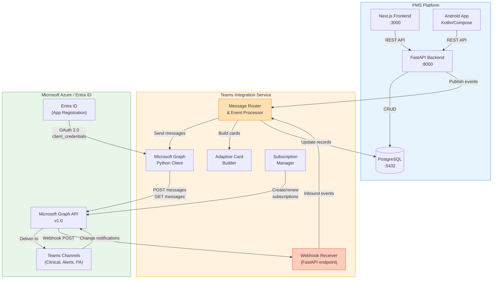

# Product Requirements Document: Microsoft Teams Integration into Patient Management System (PMS)

**Document ID:** PRD-PMS-MSTEAMS-001
**Version:** 1.0
**Date:** 2026-03-10
**Author:** Ammar (CEO, MPS Inc.)
**Status:** Draft

---

## 1. Executive Summary

**Microsoft Teams** is Microsoft's enterprise collaboration platform with over 320 million monthly active users. Its extensibility layer — built on Microsoft Graph API, Bot Framework, Webhooks, and Adaptive Cards — enables programmatic listening to channel messages, posting structured content, and receiving real-time change notifications. Teams is available across M365 Business, Enterprise, Education, and Government (GCC/GCC-High) SKUs, with HIPAA-eligible configurations and Business Associate Agreement (BAA) availability for healthcare organizations.

Integrating Teams into PMS enables **bi-directional clinical communication workflows**: the PMS backend can publish patient status updates, lab result alerts, prior authorization decisions, and care coordination summaries directly into designated Teams channels — and simultaneously listen for provider messages, approvals, and escalation requests that flow back into PMS workflows. This replaces fragmented communication (phone calls, faxes, pagers, personal messaging apps) with an auditable, HIPAA-compliant channel that clinical staff already use daily.

The integration leverages three complementary mechanisms: (1) **Microsoft Graph API** for reading/writing channel messages with application permissions, (2) **Graph Change Notifications (webhooks)** for real-time subscription to new messages, and (3) **Adaptive Cards** for rich, interactive message formats that let providers take actions (approve, reject, acknowledge) without leaving Teams. This is complementary to Experiment 64 (GWS CLI) which targets Google Workspace — together, they provide collaboration platform coverage for organizations standardized on either Microsoft or Google ecosystems.

## 2. Problem Statement

PMS faces three communication bottlenecks that Teams integration directly addresses:

1. **Fragmented clinical notifications**: When a lab result arrives, a prior authorization is approved, or a patient status changes, clinical staff must be actively using PMS to see the update. There is no push notification to the collaboration tool where providers spend most of their day. Critical updates get delayed, and staff resort to personal texting (a HIPAA violation risk).

2. **No structured feedback loop**: Providers frequently need to acknowledge, approve, or escalate clinical items (e.g., medication refill requests, referral approvals). Currently this requires logging into PMS, finding the item, and clicking through forms. If the provider is in a Teams meeting or Teams chat, context-switching to PMS adds friction and delays decisions.

3. **Care coordination silos**: Multi-disciplinary care teams (physician, nurse, pharmacist, social worker) discuss patient cases in Teams channels, but these discussions are disconnected from the patient record. Decisions made in Teams are not captured in PMS, creating documentation gaps and compliance risks.

These problems share a root cause: **PMS and the organization's primary collaboration platform operate as disconnected systems with no automated data flow between them**.

## 3. Proposed Solution

### 3.1 Architecture Overview

### 3.2 Deployment Model

- **Cloud-hybrid**: The PMS backend (self-hosted or cloud) communicates with Microsoft Graph API (cloud). No Microsoft infrastructure is self-hosted.
- **App Registration**: A single Azure Entra ID app registration provides OAuth 2.0 client credentials for server-to-server communication. No user sign-in is required for backend operations.
- **Docker**: The Teams integration service runs as a module within the existing PMS FastAPI backend container — no separate container required.
- **Network**: Outbound HTTPS to `graph.microsoft.com`; inbound HTTPS webhook endpoint exposed via reverse proxy (nginx/Caddy) with TLS termination.
- **HIPAA**: Microsoft 365 E3/E5 and Teams are HIPAA-eligible when the organization signs a Microsoft BAA. PHI transmitted via Graph API uses TLS 1.2+ in transit. Messages containing PHI are stored in Microsoft's HIPAA-compliant infrastructure. The PMS integration logs all PHI access for audit trails.

## 4. PMS Data Sources

The Teams integration interacts with the following PMS APIs:

| PMS API | Direction | Use Case |
|---------|-----------|----------|
| **Patient Records** (`/api/patients`) | Outbound | Include patient context (name, MRN, DOB) in Teams notifications. Receive patient-scoped commands from Teams. |
| **Encounter Records** (`/api/encounters`) | Outbound | Post encounter summaries, status changes, and discharge notifications to care team channels. |
| **Medication & Prescription** (`/api/prescriptions`) | Bi-directional | Send refill requests to provider channels as Adaptive Cards. Receive approve/deny responses back into PMS. |
| **Reporting** (`/api/reports`) | Outbound | Post daily/weekly operational reports (census, pending orders, overdue follow-ups) to management channels. |
| **Prior Authorization** (`/api/prior-auth`) | Bi-directional | Notify staff of PA status changes. Receive escalation requests from Teams into the PA workflow. |
| **Lab Results** (`/api/lab-results`) | Outbound | Push critical/abnormal lab result alerts to designated provider channels. |

## 5. Component/Module Definitions

### 5.1 Microsoft Graph Client (`teams_graph_client.py`)

- **Description**: Thin wrapper around `msgraph-sdk` (Microsoft's official Python SDK) handling authentication, token caching, and retry logic.
- **Input**: OAuth 2.0 client credentials (tenant ID, client ID, client secret).
- **Output**: Authenticated Graph API client instance with Teams.ReadWrite.All, ChannelMessage.Send, and ChannelMessage.Read.All permissions.
- **PMS APIs used**: None (infrastructure component).

### 5.2 Message Router (`teams_message_router.py`)

- **Description**: Central orchestrator that receives PMS domain events (new lab result, PA decision, encounter status change) and routes them to the appropriate Teams channel with the correct message format.
- **Input**: PMS domain events from the backend event bus.
- **Output**: Formatted messages (plain text or Adaptive Card JSON) sent to Teams via Graph Client.
- **PMS APIs used**: Patient Records, Encounter Records, Prescriptions, Lab Results.

### 5.3 Adaptive Card Builder (`teams_card_builder.py`)

- **Description**: Constructs Adaptive Card JSON payloads for interactive Teams messages. Cards include action buttons (Approve, Deny, Escalate) that post back to the PMS webhook endpoint.
- **Input**: Domain event data (patient info, prescription details, PA status).
- **Output**: Adaptive Card JSON conforming to Adaptive Cards schema v1.5.
- **PMS APIs used**: Patient Records, Prescriptions.

### 5.4 Webhook Receiver (`teams_webhook_receiver.py`)

- **Description**: FastAPI endpoint that receives Microsoft Graph change notifications when new messages are posted in subscribed Teams channels. Validates notification signatures, extracts message content, and dispatches to the Message Router for processing.
- **Input**: HTTP POST from Microsoft Graph with `clientState` validation token and encrypted resource data.
- **Output**: Parsed inbound messages dispatched to PMS workflows.
- **PMS APIs used**: Encounter Records (for care coordination messages), Prescriptions (for approval responses).

### 5.5 Subscription Manager (`teams_subscription_manager.py`)

- **Description**: Manages Microsoft Graph subscription lifecycle — creates subscriptions for channel message change notifications, handles renewal (subscriptions expire after 60 minutes for channel messages with encrypted content, or up to 4230 minutes without), and processes lifecycle notifications (reauthorization, missed notifications).
- **Input**: List of Teams channel IDs to monitor.
- **Output**: Active Graph subscriptions with automatic renewal via background task (APScheduler or Celery Beat).
- **PMS APIs used**: None (infrastructure component).

### 5.6 Teams Admin Dashboard (`teams_admin_panel.tsx`)

- **Description**: Next.js admin page for configuring Teams integration — map PMS event types to Teams channels, view message delivery status, manage subscriptions, and test connectivity.
- **Input**: Admin user interactions.
- **Output**: Configuration stored in PostgreSQL; real-time status display.
- **PMS APIs used**: All (for configuration mapping).

## 6. Non-Functional Requirements

### 6.1 Security and HIPAA Compliance

| Requirement | Implementation |
|-------------|---------------|
| **BAA** | Organization must have a signed Microsoft Business Associate Agreement covering M365/Teams |
| **App permissions** | Principle of least privilege — only `ChannelMessage.Send`, `ChannelMessage.Read.All`, `Channel.ReadBasic.All`, `Team.ReadBasic.All` |
| **Token security** | Client secret stored in environment variables (Docker secrets in production); token cached in memory only, never persisted to disk |
| **Webhook validation** | All inbound webhooks validated via `clientState` token and notification URL validation handshake |
| **PHI in messages** | Configurable PHI level: minimal (MRN + alert type), moderate (+ patient name), full (+ clinical details). Default: minimal |
| **Audit logging** | Every message sent/received logged with timestamp, channel, event type, and user context. Logs retained per HIPAA retention policy (6 years) |
| **Encryption in transit** | TLS 1.2+ enforced for all Graph API and webhook communications |
| **Data Loss Prevention** | Integrate with Microsoft Purview DLP policies to prevent PHI leakage to unauthorized channels |

### 6.2 Performance

| Metric | Target |
|--------|--------|
| Message delivery latency (PMS → Teams) | < 3 seconds |
| Webhook processing latency (Teams → PMS) | < 2 seconds |
| Throughput | 100 messages/minute sustained |
| Graph API rate limit headroom | Stay below 80% of tenant throttling limits |
| Subscription renewal reliability | 99.9% (no missed renewal windows) |

### 6.3 Infrastructure

| Component | Requirement |
|-----------|-------------|
| **Azure Entra ID** | App registration with admin-consented application permissions |
| **M365 License** | E3/E5 or Microsoft 365 Business Premium (for Teams and Graph API access) |
| **Network** | Outbound HTTPS to `graph.microsoft.com`, `login.microsoftonline.com`. Inbound HTTPS on webhook endpoint (public URL or ngrok for dev) |
| **Docker** | No additional container — integrated into `pms-backend` container |
| **Python dependencies** | `msgraph-sdk>=1.0.0`, `azure-identity>=1.15.0`, `httpx>=0.27.0` |
| **Background scheduler** | APScheduler or Celery Beat for subscription renewal and message retry |

## 7. Implementation Phases

### Phase 1: Foundation (Sprints 1–2)

- Azure Entra ID app registration and OAuth 2.0 client credentials flow
- Microsoft Graph Python SDK integration with token caching
- Basic send-message capability: post plain-text messages to a configured Teams channel
- FastAPI endpoint for webhook receiver with validation handshake
- Environment variable configuration and Docker integration
- Unit tests for authentication and message sending

### Phase 2: Core Integration (Sprints 3–4)

- Message Router with event-to-channel mapping (configurable per event type)
- Adaptive Card Builder for interactive messages (medication refill, PA decisions, lab alerts)
- Subscription Manager for channel message change notifications with auto-renewal
- Inbound message processing: parse provider responses from Adaptive Card actions
- Admin dashboard (Next.js) for channel mapping and integration status
- Integration tests with Microsoft Graph API sandbox

### Phase 3: Advanced Features (Sprints 5–6)

- PHI level configuration (minimal/moderate/full) with per-channel policies
- Batch reporting: daily census summaries, pending orders digest, overdue follow-ups
- Care coordination: bi-directional sync of care team discussions with encounter notes
- Android push notification bridge: Teams notification → PMS Android alert for offline providers
- Microsoft Purview DLP policy integration
- Performance optimization: message batching, webhook deduplication
- Load testing and production hardening

## 8. Success Metrics

| Metric | Target | Measurement Method |
|--------|--------|--------------------|
| Clinical notification delivery rate | > 99.5% | Graph API send success rate monitored via application logs |
| Provider response time (via Adaptive Cards) | < 30 minutes median (from < 2 hours baseline) | Timestamp delta between card sent and action received |
| PHI exposure incidents via Teams | 0 | Audit log review + DLP policy violation count |
| Staff satisfaction with notification workflow | > 4.0/5.0 | Quarterly survey |
| Reduction in phone/pager interruptions | > 40% | Pre/post implementation count |
| Webhook processing reliability | > 99.9% uptime | Endpoint monitoring (uptime check) |

## 9. Risks and Mitigations

| Risk | Impact | Mitigation |
|------|--------|------------|
| Microsoft Graph API rate throttling (tenant-wide limits) | Message delivery delays | Implement exponential backoff, message queuing, and batch sends during off-peak hours |
| Webhook endpoint downtime causes missed notifications | Provider misses critical alerts | Implement Graph subscription lifecycle notifications (missed notification handling), persist undelivered messages for retry |
| PHI leakage to wrong Teams channel | HIPAA violation | Channel allowlist in config, PHI level controls, DLP integration, mandatory security review for channel mapping changes |
| Azure Entra ID token/secret expiration | Integration outage | Automated secret rotation alerts, managed identity where possible, token refresh monitoring |
| Teams service outage (Microsoft-side) | No notifications delivered | Fallback to email notifications via Graph API (Mail.Send), in-app PMS alerts, SMS gateway |
| Subscription expiration (max 60 min for encrypted channel messages) | Gaps in listening | Background renewal task running every 30 minutes, lifecycle notification handler for reauthorization |
| Organization lacks M365 BAA | Cannot use Teams for PHI | Pre-implementation checklist requires BAA verification before go-live |

## 10. Dependencies

| Dependency | Type | Notes |
|------------|------|-------|
| **Microsoft Graph SDK for Python** (`msgraph-sdk`) | Library | v1.0+, official Microsoft-maintained SDK |
| **Azure Identity** (`azure-identity`) | Library | OAuth 2.0 client credentials provider |
| **Azure Entra ID** | Service | App registration with admin consent |
| **Microsoft 365 license** | License | E3/E5 or Business Premium with Teams |
| **Microsoft BAA** | Legal | Required before PHI transmission |
| **Public webhook URL** | Infrastructure | HTTPS endpoint reachable from Microsoft Graph notification service |
| **PMS Backend** | Internal | FastAPI backend running on :8000 |
| **PMS Database** | Internal | PostgreSQL :5432 for configuration, audit logs, message tracking |
| **Adaptive Cards Schema** | Standard | v1.5 for Teams-compatible card rendering |

## 11. Comparison with Existing Experiments

| Aspect | Exp 64: GWS CLI (Google Workspace) | Exp 68: MS Teams |
|--------|-------------------------------------|-------------------|
| **Platform** | Google Workspace (Docs, Gmail, Calendar, Sheets) | Microsoft Teams (Channels, Chat, Adaptive Cards) |
| **Primary use case** | Document generation, email, scheduling | Real-time clinical notifications, interactive approvals |
| **Communication model** | One-way push (PMS → Google) | Bi-directional (PMS ↔ Teams) with real-time listening |
| **Authentication** | Google OAuth 2.0 | Azure Entra ID OAuth 2.0 (client credentials) |
| **Real-time capability** | Limited (polling) | Native (Graph change notifications/webhooks) |
| **Interactive responses** | Not supported | Adaptive Cards with action buttons |
| **Healthcare adoption** | Common in smaller practices | Dominant in hospital systems and large health networks |
| **HIPAA readiness** | Google BAA available | Microsoft BAA available; GCC-High for federal |
| **Complementarity** | Organizations on Google Workspace | Organizations on Microsoft 365 — together they cover both ecosystems |

**Relationship to Experiment 55 (CrewAI)**: Teams integration can serve as a human-in-the-loop channel for CrewAI agent workflows — agents post decisions to Teams for provider review, and provider responses flow back as crew inputs.

**Relationship to Experiment 09 (MCP)**: An MCP Teams tool could expose Teams messaging as a tool available to any MCP-connected AI agent, enabling agents to notify providers via Teams as part of their workflow.

## 12. Research Sources

### Official Documentation
- [Microsoft Graph API – Teams Channel Messages](https://learn.microsoft.com/en-us/graph/api/chatmessage-post) — Core API for posting and reading channel messages
- [Microsoft Graph Change Notifications](https://learn.microsoft.com/en-us/graph/change-notifications-overview) — Subscription-based webhooks for real-time message monitoring
- [Microsoft Graph SDK for Python](https://learn.microsoft.com/en-us/graph/sdks/sdk-installation#install-the-microsoft-graph-python-sdk) — Official Python SDK installation and usage

### Architecture & Integration Patterns
- [Build Bots for Teams](https://learn.microsoft.com/en-us/microsoftteams/platform/bots/what-are-bots) — Bot Framework overview for Teams interaction patterns
- [Adaptive Cards for Teams](https://learn.microsoft.com/en-us/microsoftteams/platform/task-modules-and-cards/cards/cards-reference) — Card types and schema reference for interactive messages
- [Teams Webhooks and Connectors](https://learn.microsoft.com/en-us/microsoftteams/platform/webhooks-and-connectors/what-are-webhooks-and-connectors) — Incoming/outgoing webhook capabilities

### Security & Compliance
- [Microsoft 365 HIPAA Compliance](https://learn.microsoft.com/en-us/compliance/regulatory/offering-hipaa-hitech) — HIPAA/HITECH offering details and BAA availability
- [Microsoft Graph API Throttling](https://learn.microsoft.com/en-us/graph/throttling) — Rate limits and throttling guidance for Graph API calls

### Ecosystem & Adoption
- [Microsoft Teams for Healthcare](https://learn.microsoft.com/en-us/microsoftteams/expand-teams-across-your-org/healthcare/teams-in-hc) — Healthcare-specific Teams features and deployment guidance
- [Azure Entra ID Application Registration](https://learn.microsoft.com/en-us/entra/identity-platform/quickstart-register-app) — App registration and permission configuration

## 13. Appendix: Related Documents

- [MS Teams Setup Guide](68-MSTeams-PMS-Developer-Setup-Guide.md)
- [MS Teams Developer Tutorial](68-MSTeams-Developer-Tutorial.md)
- [Experiment 64: GWS CLI PMS Integration](64-PRD-GWSCLI-PMS-Integration.md) — Complementary Google Workspace integration
- [Experiment 09: MCP PMS Integration](09-PRD-MCP-PMS-Integration.md) — MCP tools could expose Teams as a tool
- [Experiment 55: CrewAI PMS Integration](55-PRD-CrewAI-PMS-Integration.md) — Agent workflows with Teams human-in-the-loop
