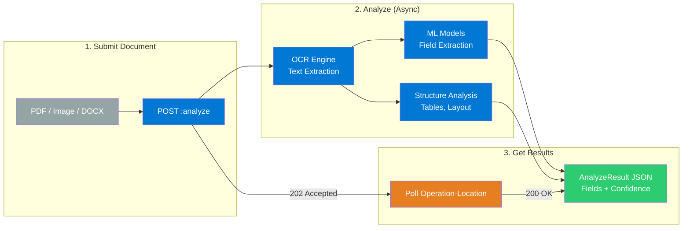
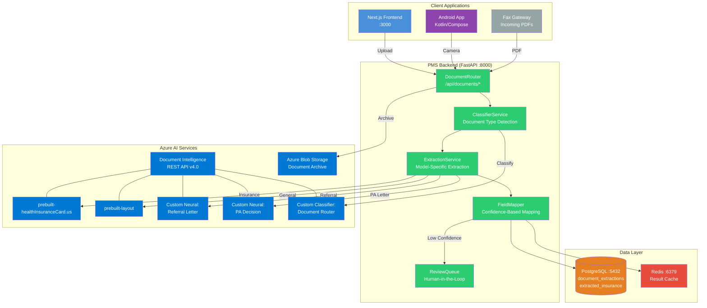

# Azure Document Intelligence Developer Onboarding Tutorial

**Welcome to the MPS PMS Azure Document Intelligence Integration Team**

This tutorial will take you from zero to building your first document extraction integration with the PMS. By the end, you will understand how Azure Document Intelligence works, have a running local environment connected to the Azure service, and have built and tested an insurance card extraction workflow end-to-end.

**Document ID:** PMS-EXP-AZUREDOCINTEL-002
**Version:** 1.0
**Date:** 2026-03-10
**Applies To:** PMS project (all platforms)
**Prerequisite:** [Azure Document Intelligence Setup Guide](69-AzureDocIntel-PMS-Developer-Setup-Guide.md)
**Estimated time:** 2-3 hours
**Difficulty:** Beginner-friendly

---

## What You Will Learn

1. How Azure Document Intelligence processes documents (OCR + ML extraction pipeline)
2. How the prebuilt health insurance card model extracts structured insurance data from card images
3. How to authenticate with Azure using API keys and the Python SDK
4. How to submit documents for analysis and poll for async results
5. How to map Azure's extraction response to PMS database schema
6. How to implement confidence-based human-in-the-loop review
7. How to build a custom neural model for healthcare document types (referral letters)
8. How to classify incoming documents and route them to the correct extraction model
9. HIPAA compliance requirements for cloud-based document processing with PHI
10. When to use Azure Document Intelligence vs. alternatives (Textract, Tesseract, Google Doc AI)

## Part 1: Understanding Azure Document Intelligence (15 min read)

### 1.1 What Problem Does Azure Document Intelligence Solve?

In a retina ophthalmology practice, staff handle hundreds of paper and scanned documents daily:

- **Insurance cards** at patient check-in — staff manually type member ID, group number, payer ID, and copay amounts into the PMS. This takes 3-5 minutes per patient and typos in member IDs cascade into claim denials.
- **Referral letters** from external providers arrive as faxed PDFs — staff must read 1-2 page letters, extract the referring physician name, diagnosis, requested procedure, and clinical history, then manually enter it into the encounter record.
- **Prior authorization decision letters** (approvals/denials) arrive as faxes — staff must read, classify the decision type, and update the PA status in the PMS. Delays here directly impact treatment scheduling.
- **Explanation of Benefits (EOB)** documents from payers — extracting payment amounts and denial reasons for claims reconciliation is entirely manual.

Azure Document Intelligence replaces this manual data entry with automated extraction. Staff photograph an insurance card with their phone, and within 3 seconds the PMS has the member ID, group number, copays, and Rx benefit details — at 99%+ accuracy for well-captured images.

### 1.2 How Azure Document Intelligence Works — The Key Pieces



**Stage 1 — Submit**: You POST a document (as bytes or a URL) to a model-specific endpoint. Azure returns `202 Accepted` with an `Operation-Location` URL for polling.

**Stage 2 — Analyze**: Azure runs OCR to extract raw text, then applies ML models to identify fields, tables, and document structure. For prebuilt models (insurance card, invoice), field extraction uses pre-trained models. For custom models, it uses your fine-tuned neural network.

**Stage 3 — Get Results**: You poll the `Operation-Location` URL until the status is `succeeded`. The response is a structured JSON (`AnalyzeResult`) containing extracted fields with confidence scores (0.0-1.0), bounding regions, and raw text.

### 1.3 How Azure Document Intelligence Fits with Other PMS Technologies

| Technology | Experiment | Relationship to Document Intelligence |
|------------|------------|---------------------------------------|
| Availity API | Exp 47 | Extracted insurance card data (member ID, payer ID) feeds eligibility verification |
| FHIR Prior Auth | Exp 48 | Extracted PA decision letters update PA status in the FHIR workflow |
| NextGen FHIR API | Exp 49 | Extracted referral data populates encounters for external provider import |
| FedEx API | Exp 65 | Extracted prescription data triggers shipment workflows |
| Kafka | Exp 38 | Document extraction events published to Kafka for async downstream processing |
| vLLM / Llama 4 | Exp 52/53 | Extracted text from clinical documents can feed LLM summarization pipelines |

### 1.4 Key Vocabulary

| Term | Meaning |
|------|---------|
| **AnalyzeResult** | The structured JSON response from Document Intelligence containing all extracted data |
| **Prebuilt Model** | Pre-trained model for common document types (insurance cards, invoices, receipts, IDs) |
| **Custom Neural Model** | Fine-tuned model trained on your labeled data for domain-specific documents |
| **Custom Template Model** | Position-anchored model for fixed-layout forms (e.g., CMS-1500 with standard layout) |
| **Custom Classifier** | ML model that classifies document type before routing to the correct extraction model |
| **Composed Model** | A single model ID that routes documents to the best-matching sub-model (up to 500) |
| **Confidence Score** | Float (0.0-1.0) indicating the model's certainty for each extracted field |
| **Bounding Region** | Polygon coordinates identifying where an extracted field appears on the page |
| **Add-On Capability** | Optional feature enabled per request: barcodes, key-value pairs, high-res, formulas |
| **Document Intelligence Studio** | Web-based tool for testing models, labeling training data, and training custom models |
| **Operation-Location** | URL returned by the async analyze API for polling the extraction result |
| **S0 Tier** | Standard pricing tier — $10/1,000 pages for prebuilt models, 15 TPS default |

### 1.5 Our Architecture



## Part 2: Environment Verification (15 min)

### 2.1 Checklist

1. **PMS backend is running**:
   ```bash
   curl -s http://localhost:8000/api/health | jq .status
   # Expected: "ok"
   ```

2. **PostgreSQL has extraction tables**:
   ```bash
   psql -h localhost -p 5432 -U pms_user -d pms \
     -c "\dt document_extractions" -c "\dt extracted_insurance"
   # Expected: Two tables listed
   ```

3. **Redis is running**:
   ```bash
   redis-cli ping
   # Expected: PONG
   ```

4. **Azure environment variables are set**:
   ```bash
   echo "Endpoint: ${AZURE_DOCINTEL_ENDPOINT:0:30}..."
   echo "Key: ${AZURE_DOCINTEL_API_KEY:0:8}..."
   # Expected: Non-empty values
   ```

5. **Python SDK is installed**:
   ```bash
   python -c "import azure.ai.documentintelligence; print('SDK OK')"
   # Expected: SDK OK
   ```

6. **Azure API is reachable**:
   ```bash
   curl -s -o /dev/null -w "%{http_code}" \
     "${AZURE_DOCINTEL_ENDPOINT}documentintelligence/documentModels?api-version=2024-11-30" \
     -H "Ocp-Apim-Subscription-Key: ${AZURE_DOCINTEL_API_KEY}"
   # Expected: 200
   ```

7. **Document endpoints are registered**:
   ```bash
   curl -s http://localhost:8000/openapi.json \
     | jq '.paths | keys[] | select(startswith("/api/documents"))'
   # Expected: List of /api/documents/* paths
   ```

### 2.2 Quick Test

Run a single insurance card extraction to confirm the full chain:

```bash
# Download sample insurance card
curl -sL "https://raw.githubusercontent.com/Azure-Samples/cognitive-services-REST-api-samples/master/curl/form-recognizer/rest-api/insurance.jpg" -o /tmp/test-insurance.jpg

# Extract via PMS API
curl -s -X POST "http://localhost:8000/api/documents/extract/insurance-card" \
  -F "file=@/tmp/test-insurance.jpg" \
  | jq '{confidence: .overall_confidence, memberId: .insurance_data.member_id.value, insurer: .insurance_data.insurer_name.value}'
```

If this returns extracted insurance data with a confidence score, your environment is ready.

## Part 3: Build Your First Integration (45 min)

### 3.1 What We Are Building

We will build an **Insurance Card Check-In Workflow** — the most common document extraction use case in the PMS. When a patient arrives for their appointment, front desk staff:

1. Photograph the patient's insurance card (front and back) using the web app or Android app
2. The PMS sends the image to Azure Document Intelligence
3. The system extracts member ID, group number, insurer, copays, and Rx benefit details
4. Staff review the extracted data (fields with confidence < 80% are flagged)
5. After approval, the data is saved to the patient's insurance record

### 3.2 Step 1: Create a Test Script

Create `backend/scripts/test_insurance_extraction.py` to test the extraction pipeline independently:

```python
"""Test insurance card extraction against Azure Document Intelligence."""

import os
import sys
import json
from pathlib import Path

# Add backend to path
sys.path.insert(0, str(Path(__file__).parent.parent))

from app.documents.client import DocIntelClient
from app.documents.extractors import extract_insurance_card

def main():
    # Read test image
    image_path = sys.argv[1] if len(sys.argv) > 1 else "/tmp/test-insurance.jpg"
    with open(image_path, "rb") as f:
        document_bytes = f.read()

    print(f"Analyzing: {image_path} ({len(document_bytes)} bytes)")

    # Initialize client
    client = DocIntelClient()

    # Extract insurance card data
    print("Sending to Azure Document Intelligence...")
    result = client.analyze_insurance_card(document_bytes)

    # Map to PMS schema
    insurance_data = extract_insurance_card(result)

    # Display results
    print("\n=== Extracted Insurance Card Data ===\n")

    fields = [
        ("Insurer", insurance_data.insurer_name),
        ("Member Name", insurance_data.member_name),
        ("Member ID", insurance_data.member_id),
        ("Group Number", insurance_data.group_number),
        ("Plan Type", insurance_data.plan_type),
        ("DOB", insurance_data.member_dob),
        ("Payer ID", insurance_data.payer_id),
        ("Rx BIN", insurance_data.rx_bin),
        ("Rx PCN", insurance_data.rx_pcn),
        ("Rx Group", insurance_data.rx_group),
        ("Copay (Office)", insurance_data.copay_office),
        ("Copay (Specialist)", insurance_data.copay_specialist),
        ("Copay (ER)", insurance_data.copay_er),
    ]

    for label, field in fields:
        if field:
            confidence_pct = f"{field.confidence * 100:.0f}%"
            review_flag = " ⚠ NEEDS REVIEW" if field.needs_review else ""
            print(f"  {label:20s}: {field.value or '—':30s} ({confidence_pct}){review_flag}")
        else:
            print(f"  {label:20s}: (not extracted)")

    # Summary
    extracted_fields = [f for _, f in fields if f is not None]
    avg_confidence = (
        sum(f.confidence for f in extracted_fields) / len(extracted_fields)
        if extracted_fields else 0.0
    )
    review_count = sum(1 for f in extracted_fields if f.needs_review)

    print(f"\n--- Summary ---")
    print(f"  Fields extracted: {len(extracted_fields)}/{len(fields)}")
    print(f"  Average confidence: {avg_confidence * 100:.1f}%")
    print(f"  Fields needing review: {review_count}")

if __name__ == "__main__":
    main()
```

Run it:

```bash
cd backend
python scripts/test_insurance_extraction.py /tmp/test-insurance.jpg
```

### 3.3 Step 2: Build the Full Service with Database Storage

Extend `backend/app/documents/service.py` to persist extraction results:

```python
async def extract_insurance_card(
    self, document_bytes: bytes, patient_id: UUID | None = None,
    user_id: UUID | None = None,
) -> InsuranceExtractionResponse:
    start = time.monotonic()

    # Call Azure Document Intelligence
    result = self.client.analyze_insurance_card(document_bytes)

    # Map to PMS schema
    insurance_data = extract_insurance_card_fields(result)

    # Calculate confidence metrics
    key_fields = [
        insurance_data.insurer_name, insurance_data.member_id,
        insurance_data.group_number, insurance_data.plan_type,
        insurance_data.member_name,
    ]
    valid_fields = [f for f in key_fields if f is not None]
    overall_confidence = (
        sum(f.confidence for f in valid_fields) / len(valid_fields)
        if valid_fields else 0.0
    )
    needs_review = any(f.needs_review for f in valid_fields)

    elapsed_ms = int((time.monotonic() - start) * 1000)

    # Store extraction record
    from app.models.document_extraction import DocumentExtraction, ExtractedInsurance

    extraction = DocumentExtraction(
        patient_id=patient_id,
        document_type="insurance_card",
        model_id="prebuilt-healthInsuranceCard.us",
        raw_result=result.as_dict(),
        extracted_fields={
            k: {"value": v.value, "confidence": v.confidence}
            for k, v in insurance_data.__dict__.items()
            if v is not None
        },
        overall_confidence=overall_confidence,
        needs_review=needs_review,
        processing_time_ms=elapsed_ms,
        api_version="2024-11-30",
        created_by=user_id,
    )
    self.db.add(extraction)
    await self.db.flush()

    # Store structured insurance record
    ins_record = ExtractedInsurance(
        extraction_id=extraction.id,
        patient_id=patient_id,
        insurer_name=_val(insurance_data.insurer_name),
        member_name=_val(insurance_data.member_name),
        member_id=_val(insurance_data.member_id),
        group_number=_val(insurance_data.group_number),
        plan_type=_val(insurance_data.plan_type),
        payer_id=_val(insurance_data.payer_id),
        rx_bin=_val(insurance_data.rx_bin),
        rx_pcn=_val(insurance_data.rx_pcn),
        rx_group=_val(insurance_data.rx_group),
    )
    self.db.add(ins_record)
    await self.db.commit()

    return InsuranceExtractionResponse(
        extraction_id=extraction.id,
        patient_id=patient_id,
        insurance_data=insurance_data,
        overall_confidence=overall_confidence,
        needs_review=needs_review,
        processing_time_ms=elapsed_ms,
    )

def _val(field) -> str | None:
    return field.value if field else None
```

### 3.4 Step 3: Build the Review and Approval Endpoint

Add to `backend/app/documents/router.py`:

```python
@router.post("/extractions/{extraction_id}/approve")
async def approve_extraction(
    extraction_id: UUID,
    corrections: dict | None = None,
    service: DocumentService = Depends(),
):
    """Staff approves (and optionally corrects) extracted data."""
    return await service.approve_extraction(extraction_id, corrections)
```

Add to `backend/app/documents/service.py`:

```python
async def approve_extraction(
    self, extraction_id: UUID, corrections: dict | None = None,
    user_id: UUID | None = None,
) -> dict:
    """Approve extracted insurance data and update patient record."""
    extraction = await self.db.get(DocumentExtraction, extraction_id)
    if not extraction:
        raise ValueError(f"Extraction {extraction_id} not found")

    # Apply corrections if provided
    if corrections:
        stmt = select(ExtractedInsurance).where(
            ExtractedInsurance.extraction_id == extraction_id
        )
        result = await self.db.execute(stmt)
        ins_record = result.scalar_one()

        for field_name, corrected_value in corrections.items():
            if hasattr(ins_record, field_name):
                setattr(ins_record, field_name, corrected_value)

    # Mark as approved
    extraction.needs_review = False
    extraction.reviewed_by = user_id
    extraction.reviewed_at = datetime.utcnow()

    await self.db.commit()

    return {"status": "approved", "extraction_id": str(extraction_id)}
```

### 3.5 Step 4: Test the Complete Workflow

**Step 4a: Extract insurance card data**

```bash
curl -s -X POST "http://localhost:8000/api/documents/extract/insurance-card" \
  -F "file=@/tmp/test-insurance.jpg" \
  -G -d "patient_id=00000000-0000-0000-0000-000000000001" \
  | jq '{id: .extraction_id, confidence: .overall_confidence, review: .needs_review,
         memberId: .insurance_data.member_id.value, insurer: .insurance_data.insurer_name.value}'
```

**Step 4b: Check database records**

```bash
psql -h localhost -p 5432 -U pms_user -d pms \
  -c "SELECT id, document_type, overall_confidence, needs_review, processing_time_ms
      FROM document_extractions ORDER BY created_at DESC LIMIT 1;"

psql -h localhost -p 5432 -U pms_user -d pms \
  -c "SELECT insurer_name, member_id, group_number, plan_type, approved
      FROM extracted_insurance ORDER BY created_at DESC LIMIT 1;"
```

**Step 4c: Approve with corrections**

```bash
# Replace EXTRACTION_ID with the id from step 4a
curl -s -X POST "http://localhost:8000/api/documents/extractions/EXTRACTION_ID/approve" \
  -H "Content-Type: application/json" \
  -d '{"corrections": {"member_id": "CORRECTED123"}}' \
  | jq .
```

### 3.6 Step 5: Verify in the Frontend

1. Open `http://localhost:3000`
2. Navigate to a patient's check-in page
3. Click the "Scan Insurance Card" area
4. Upload the test insurance card image
5. Click "Extract Insurance Data"
6. Review the extracted fields — note confidence percentages and warning flags
7. Correct any flagged fields and click "Approve"
8. Navigate to the patient's insurance records to confirm the data was saved

## Part 4: Evaluating Strengths and Weaknesses (15 min)

### 4.1 Strengths

- **Healthcare-specific prebuilt model**: The `prebuilt-healthInsuranceCard.us` model extracts 20+ insurance fields out of the box — no training required
- **Custom neural models with minimal data**: Train accurate extractors for domain-specific documents (referral letters, PA forms) with as few as 5 labeled samples
- **HIPAA BAA included**: Azure's BAA covers Document Intelligence by default — no separate legal agreement needed
- **99%+ OCR accuracy**: For printed text in well-captured images, extraction accuracy is industry-leading
- **Document Intelligence Studio**: Web-based labeling and training tool eliminates the need for ML engineering skills
- **Async API with polling**: Non-blocking architecture handles multi-page documents without timeout issues
- **Composed model routing**: Single model ID can route across 500 sub-models for multi-form pipelines
- **Free tier available**: 500 pages/month on F0 for development and testing

### 4.2 Weaknesses

- **Cloud dependency**: Requires network connectivity to Azure; no fully offline option except disconnected containers (which require commitment pricing)
- **Async-only API**: No synchronous extraction option — even single-page insurance cards require submit + poll, adding 1-2 seconds of latency
- **Handwriting limited to Latin languages**: Handwritten text recognition works well for English but not for non-Latin scripts
- **Custom model training data effort**: While 5 samples is the minimum, production accuracy for diverse document formats (different payer EOBs) typically requires 50-100 labeled samples
- **No prebuilt CMS-1500 or UB-04 model**: Common healthcare claim forms require custom models
- **Pricing at scale**: At $10/1,000 pages for prebuilt models, a practice processing 500 documents/day would spend ~$150/month — not expensive, but worth budgeting
- **24-hour result retention**: Azure auto-deletes extraction results after 24 hours — you must store results in your own database immediately

### 4.3 When to Use Azure Document Intelligence vs Alternatives

| Scenario | Recommendation |
|----------|----------------|
| Insurance card extraction | **Azure** — prebuilt model with best healthcare coverage |
| Custom healthcare form training | **Azure** — custom neural models + Studio labeling tool |
| Fully offline/air-gapped deployment | **Tesseract** (open-source) or **Azure disconnected containers** |
| Multi-cloud / vendor-neutral | **Google Document AI** or **AWS Textract** (based on your cloud) |
| Budget-constrained simple OCR | **Tesseract** (free, self-hosted) — lower accuracy but zero cost |
| High-accuracy non-English documents | **ABBYY FineReader** — strongest multilingual accuracy |
| Need custom training + AWS ecosystem | **Azure** — AWS Textract does not support custom training |

### 4.4 HIPAA / Healthcare Considerations

| Area | Requirement |
|------|-------------|
| **BAA** | Azure HIPAA BAA included in Microsoft Product Terms by default |
| **Encryption in transit** | TLS 1.2+ for all API calls (enforced by Azure) |
| **Encryption at rest** | AES-256; customer-managed keys (CMK) available via Azure Key Vault |
| **Data retention** | Azure auto-deletes analysis results after 24 hours; store in PostgreSQL immediately |
| **Data residency** | Document Intelligence resource stays in the deployed Azure region — no cross-region data transfer |
| **PHI in extracted data** | Extracted insurance fields (member name, DOB, member ID) are PHI — encrypt at rest in PostgreSQL |
| **Audit logging** | Log every document upload: user_id, patient_id, document_type, timestamp, model_id |
| **Access control** | Role-based: only `front_desk`, `medical_records`, `billing`, `admin` can run extractions |
| **Training data** | Custom model training data resides in **your** Azure Blob Storage — under your control |
| **Network isolation** | Use Azure Private Endpoints to prevent public internet access to the resource |

## Part 5: Debugging Common Issues (15 min read)

### Issue 1: Low Confidence on Insurance Card Extraction

**Symptom**: Multiple fields return confidence < 60%.

**Cause**: Poor image quality — blurry capture, glare, partial card visibility, low lighting.

**Fix**:
1. Add image quality validation before submission: check resolution (minimum 640x480), file size (minimum 50KB)
2. Prompt the user to recapture if the image appears blurry
3. Use the `highResolution` add-on for small-print cards: add `"features": ["ocrHighResolution"]` to the analyze request
4. Test the same image in Document Intelligence Studio to confirm it's an image quality issue

### Issue 2: Fields Extracted from Wrong Card Side

**Symptom**: Member ID extracted from the back of the card instead of the front, or Rx fields missing.

**Cause**: Insurance cards have different data on front and back. The model processes all pages/images but may not associate fields correctly with card sides.

**Fix**:
1. Submit front and back as separate images in a 2-page PDF (the model handles multi-page input)
2. Alternatively, submit front and back as separate API calls and merge results
3. Train staff to always capture both sides

### Issue 3: Operation-Location Polling Returns 404

**Symptom**: Polling the `Operation-Location` URL returns `404 Not Found`.

**Cause**: The operation ID expires after 24 hours, or the URL was truncated.

**Fix**:
1. Poll immediately after submission — do not store and retry hours later
2. Ensure the full `Operation-Location` URL is captured (it can be 200+ characters)
3. The Python SDK handles polling internally via `poller.result()` — prefer it over manual polling

### Issue 4: Custom Model Returns Empty Results

**Symptom**: Custom neural model returns `documents: []` for a document it should extract.

**Cause**: The document doesn't match the training data distribution, or the model needs more training samples.

**Fix**:
1. Test the same document in Document Intelligence Studio to inspect what the model sees
2. Add the problematic document to the training set, label it, and retrain
3. If the document layout is very different from training data, consider a separate custom model for that variant
4. Ensure the document is in a supported format (PDF, JPEG, PNG — not WEBP)

### Issue 5: SDK Version Mismatch

**Symptom**: `AttributeError: 'DocumentIntelligenceClient' has no attribute 'begin_analyze_document'`

**Cause**: Using the old `azure-ai-formrecognizer` SDK instead of the new `azure-ai-documentintelligence` SDK.

**Fix**:
```bash
# Remove old SDK
pip uninstall azure-ai-formrecognizer

# Install current SDK
pip install "azure-ai-documentintelligence>=1.0.0"
```

The new SDK uses `DocumentIntelligenceClient` (not `DocumentAnalysisClient`) and `begin_analyze_document` (not `begin_analyze_document_from_url`).

## Part 6: Practice Exercise (45 min)

### Option A: General Document OCR with Table Extraction

Build a workflow for extracting text and tables from faxed referral letters:

1. Create a `POST /api/documents/extract/referral` endpoint
2. Use the `prebuilt-layout` model to extract text, tables, and structure
3. Parse the extracted text to identify: referring physician name, patient name, diagnosis, and requested procedure
4. Store the parsed referral data linked to the patient's encounter
5. Build a Next.js component showing the original document alongside extracted data

**Hints**:
- Use `result.paragraphs` for structured text blocks (titles, headers, body)
- Use `result.tables` for any tabular data (medication lists, lab results)
- String-match or regex can extract specific fields from layout text as a starting point before custom model training

### Option B: Document Classification Pipeline

Build a classifier that routes incoming documents to the correct extraction model:

1. Collect 5-10 sample documents for each type: insurance card, referral letter, PA decision, prescription fax
2. Use Document Intelligence Studio to label and train a custom classifier
3. Create a `POST /api/documents/classify` endpoint that classifies, then routes to the appropriate extractor
4. Return both the classification result and the extraction result in one response

**Hints**:
- Use `client.begin_classify_document(classifier_id, ...)` for classification
- Map classification results to model IDs: `{"insurance_card": "prebuilt-healthInsuranceCard.us", "referral": "custom-referral-v1"}`
- Add a confidence threshold — if classification confidence < 70%, flag for manual routing

### Option C: Batch Processing for Patient Intake

Build a batch processor for handling a stack of intake documents at once:

1. Create a `POST /api/documents/batch` endpoint accepting multiple files
2. Classify each document, then extract in parallel using `asyncio.gather()` with a semaphore (max 5 concurrent)
3. Group results by document type and return a summary
4. Build a Next.js "Batch Upload" page with drag-and-drop for multiple files and a progress indicator

**Hints**:
- Limit concurrency to stay within the 15 TPS rate limit
- Use the Azure Batch Analyze API for very large batches (10,000+ documents from Blob Storage)
- Show per-document status (processing, complete, needs review, error)

## Part 7: Development Workflow and Conventions

### 7.1 File Organization

```
backend/app/documents/
├── __init__.py
├── client.py              # DocIntelClient — Azure SDK wrapper
├── models.py              # Pydantic request/response models
├── extractors.py          # Model-specific field extraction logic
├── service.py             # DocumentService — business logic
├── router.py              # FastAPI router — /api/documents/*
└── tests/
    ├── test_client.py
    ├── test_extractors.py
    ├── test_service.py
    └── fixtures/
        ├── insurance_card_result.json    # Mock Azure response
        └── referral_letter_result.json

frontend/src/
├── lib/
│   └── documents-api.ts              # API client for document endpoints
└── components/documents/
    ├── InsuranceCardUpload.tsx        # Insurance card scan + review
    ├── DocumentUpload.tsx             # General document upload
    ├── ExtractionReview.tsx           # Side-by-side review component
    ├── ConfidenceIndicator.tsx        # Field confidence display
    └── DocumentClassification.tsx     # Classification result display
```

### 7.2 Naming Conventions

| Item | Convention | Example |
|------|-----------|---------|
| Python module | `snake_case` | `extractors.py` |
| Python class | `PascalCase` | `DocIntelClient`, `DocumentService` |
| Azure model ID | Kebab-case with prefix | `prebuilt-healthInsuranceCard.us`, `custom-referral-v1` |
| FastAPI endpoint | Hyphens in URL path | `POST /api/documents/extract/insurance-card` |
| Pydantic model | `PascalCase` | `InsuranceCardData`, `ExtractionResponse` |
| TypeScript file | `kebab-case` | `documents-api.ts` |
| React component | `PascalCase` | `InsuranceCardUpload.tsx` |
| Database table | `snake_case` plural | `document_extractions`, `extracted_insurance` |
| Environment variable | `SCREAMING_SNAKE_CASE` | `AZURE_DOCINTEL_ENDPOINT` |
| Custom model ID | `custom-{doctype}-v{n}` | `custom-referral-v1`, `custom-pa-decision-v2` |

### 7.3 PR Checklist

- [ ] Azure API credentials are in environment variables (not hardcoded)
- [ ] All extracted PHI fields are encrypted at rest in PostgreSQL
- [ ] Every extraction is logged with user_id, patient_id, document_type, and timestamp
- [ ] Confidence threshold (80%) is enforced — low-confidence fields flagged for review
- [ ] Unit tests mock Azure SDK responses (never call real Azure API in tests)
- [ ] Integration tests use the Azure free tier (F0) or a dedicated test resource
- [ ] No document bytes are logged or printed to stdout/stderr
- [ ] Original documents are archived to Blob Storage (not stored in PostgreSQL)
- [ ] Frontend never calls Azure API directly — all requests route through FastAPI

### 7.4 Security Reminders

1. **Never embed Azure credentials in frontend code** — all API calls go through FastAPI
2. **Encrypt extracted PHI at rest** — member IDs, names, DOBs are PHI
3. **Archive originals in Blob Storage with CMK** — not in PostgreSQL (avoid large binary blobs in the DB)
4. **Audit log every extraction** — who uploaded what, for which patient, at what time
5. **Role-based access** — only authorized roles can trigger document extraction
6. **Validate file types** — only accept PDF, JPEG, PNG, TIFF (reject executables, scripts)
7. **Azure auto-deletes results after 24 hours** — always store results in your database immediately
8. **Use Private Endpoints in production** — prevent public internet access to the Document Intelligence resource

## Part 8: Quick Reference Card

### Key Commands

```bash
# Extract insurance card via PMS
curl -s -X POST "http://localhost:8000/api/documents/extract/insurance-card" \
  -F "file=@/path/to/card.jpg" | jq .

# Extract text (OCR) via PMS
curl -s -X POST "http://localhost:8000/api/documents/extract/text" \
  -F "file=@/path/to/document.pdf" | jq .

# Extract layout (tables + structure)
curl -s -X POST "http://localhost:8000/api/documents/extract/layout" \
  -F "file=@/path/to/form.pdf" | jq .

# List Azure models
curl -s "${AZURE_DOCINTEL_ENDPOINT}documentintelligence/documentModels?api-version=2024-11-30" \
  -H "Ocp-Apim-Subscription-Key: ${AZURE_DOCINTEL_API_KEY}" | jq '.value[].modelId'

# Check recent extractions
psql -h localhost -p 5432 -U pms_user -d pms \
  -c "SELECT document_type, overall_confidence, needs_review, processing_time_ms
      FROM document_extractions ORDER BY created_at DESC LIMIT 5;"
```

### Key Files

| File | Purpose |
|------|---------|
| `backend/app/documents/client.py` | Azure SDK wrapper |
| `backend/app/documents/extractors.py` | Field extraction logic per model |
| `backend/app/documents/service.py` | Document processing business logic |
| `backend/app/documents/router.py` | FastAPI endpoints |
| `backend/app/documents/models.py` | Pydantic models |
| `frontend/src/lib/documents-api.ts` | Frontend API client |
| `frontend/src/components/documents/` | React document components |

### Key URLs

| Resource | URL |
|----------|-----|
| Azure Document Intelligence Docs | [https://learn.microsoft.com/en-us/azure/ai-services/document-intelligence/](https://learn.microsoft.com/en-us/azure/ai-services/document-intelligence/) |
| Document Intelligence Studio | [https://documentintelligence.ai.azure.com/](https://documentintelligence.ai.azure.com/) |
| PMS Documents API | `http://localhost:8000/api/documents/` |
| PMS API Docs | `http://localhost:8000/docs#/documents` |
| Python SDK Reference | [https://learn.microsoft.com/en-us/python/api/overview/azure/ai-documentintelligence-readme](https://learn.microsoft.com/en-us/python/api/overview/azure/ai-documentintelligence-readme) |
| Code Samples | [https://github.com/Azure-Samples/document-intelligence-code-samples](https://github.com/Azure-Samples/document-intelligence-code-samples) |

### Starter Template: New Extraction Endpoint

```python
from fastapi import APIRouter, Depends, UploadFile, File
from .service import DocumentService

router = APIRouter(prefix="/api/documents", tags=["documents"])

@router.post("/extract/your-document-type")
async def extract_your_type(
    file: UploadFile = File(...),
    service: DocumentService = Depends(),
):
    """Extract structured data from {your document type}."""
    document_bytes = await file.read()
    # 1. Call Azure Document Intelligence (prebuilt or custom model)
    # 2. Map extracted fields to PMS schema
    # 3. Apply confidence threshold
    # 4. Store in PostgreSQL
    # 5. Return structured response
    return await service.extract_your_type(document_bytes)
```

## Next Steps

1. Complete one of the [practice exercises](#part-6-practice-exercise-45-min) above
2. Test the insurance card model with real patient cards in [Document Intelligence Studio](https://documentintelligence.ai.azure.com/)
3. Start collecting labeled samples for custom models (referral letters, PA decisions, EOBs)
4. Review the [PRD](69-PRD-AzureDocIntel-PMS-Integration.md) for the full integration roadmap
5. Explore how extracted data feeds into [Availity eligibility checks (Exp 47)](47-PRD-AvailityAPI-PMS-Integration.md) and [FHIR PA submissions (Exp 48)](48-PRD-FHIRPriorAuth-PMS-Integration.md)
