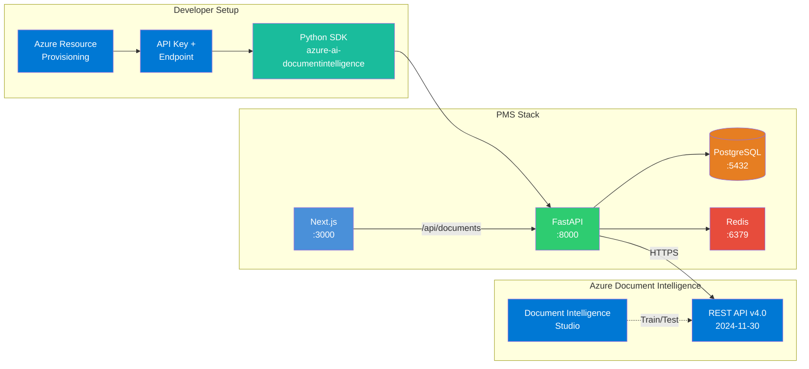

# Azure Document Intelligence Setup Guide for PMS Integration

**Document ID:** PMS-EXP-AZUREDOCINTEL-001
**Version:** 1.0
**Date:** 2026-03-10
**Applies To:** PMS project (all platforms)
**Prerequisites Level:** Intermediate

---

## Table of Contents

1. [Overview](#1-overview)
2. [Prerequisites](#2-prerequisites)
3. [Part A: Provision Azure Document Intelligence](#3-part-a-provision-azure-document-intelligence)
4. [Part B: Integrate with PMS Backend](#4-part-b-integrate-with-pms-backend)
5. [Part C: Integrate with PMS Frontend](#5-part-c-integrate-with-pms-frontend)
6. [Part D: Testing and Verification](#6-part-d-testing-and-verification)
7. [Troubleshooting](#7-troubleshooting)
8. [Reference Commands](#8-reference-commands)

---

## 1. Overview

This guide walks you through integrating Azure AI Document Intelligence with the PMS backend (FastAPI), frontend (Next.js), and database (PostgreSQL). By the end, you will have:

- An Azure Document Intelligence resource (S0 tier) with API credentials
- A `DocumentIntelligenceClient` Python module for the FastAPI backend
- Database tables for document extraction results and extracted insurance records
- FastAPI endpoints for insurance card extraction, document classification, and general OCR
- Next.js components for document upload, extraction review, and insurance card scanning
- End-to-end verification using the prebuilt health insurance card model



## 2. Prerequisites

### 2.1 Required Software

| Software | Minimum Version | Check Command |
|----------|-----------------|---------------|
| Python | 3.11+ | `python --version` |
| Node.js | 18+ | `node --version` |
| PostgreSQL | 15+ | `psql --version` |
| Redis | 7+ | `redis-cli --version` |
| Docker & Docker Compose | 24+ / 2.20+ | `docker --version && docker compose version` |
| Azure CLI | 2.60+ | `az --version` |
| Git | 2.40+ | `git --version` |

### 2.2 Installation of Prerequisites

Install the Azure Python SDK and Azure CLI (if not already present):

```bash
# Azure Document Intelligence SDK
pip install "azure-ai-documentintelligence>=1.0.0"

# Azure Identity (for Entra ID auth in production)
pip install "azure-identity>=1.15.0"

# Azure CLI (macOS)
brew install azure-cli

# Azure CLI (Linux)
curl -sL https://aka.ms/InstallAzureCLIDeb | sudo bash
```

For image preprocessing before OCR (optional):

```bash
pip install Pillow>=10.0
```

### 2.3 Verify PMS Services

Confirm the PMS backend, frontend, and database are running:

```bash
# Check FastAPI backend
curl -s http://localhost:8000/api/health | jq .
# Expected: {"status": "ok", ...}

# Check Next.js frontend
curl -s -o /dev/null -w "%{http_code}" http://localhost:3000
# Expected: 200

# Check PostgreSQL
psql -h localhost -p 5432 -U pms_user -d pms -c "SELECT 1;"
# Expected: 1

# Check Redis
redis-cli -h localhost -p 6379 ping
# Expected: PONG
```

**Checkpoint**: All four PMS services respond successfully. Azure CLI is installed.

## 3. Part A: Provision Azure Document Intelligence

### Step 1: Log in to Azure

```bash
az login
# Follow the browser prompt to authenticate

# Verify subscription
az account show --query "{name:name, id:id}" -o table
```

### Step 2: Create a Resource Group (if needed)

```bash
az group create \
  --name rg-pms-ai \
  --location eastus2
```

### Step 3: Create the Document Intelligence Resource

```bash
az cognitiveservices account create \
  --name pms-doc-intelligence \
  --resource-group rg-pms-ai \
  --kind FormRecognizer \
  --sku S0 \
  --location eastus2 \
  --custom-domain pms-doc-intelligence \
  --yes
```

> **Note**: The `--kind FormRecognizer` is the Azure resource kind for Document Intelligence (legacy naming in the API).

### Step 4: Retrieve API Key and Endpoint

```bash
# Get endpoint
az cognitiveservices account show \
  --name pms-doc-intelligence \
  --resource-group rg-pms-ai \
  --query properties.endpoint -o tsv

# Get API key
az cognitiveservices account keys list \
  --name pms-doc-intelligence \
  --resource-group rg-pms-ai \
  --query key1 -o tsv
```

### Step 5: Configure Environment Variables

Create or update your `.env` file (never commit this file):

```bash
# Azure Document Intelligence
AZURE_DOCINTEL_ENDPOINT=https://pms-doc-intelligence.cognitiveservices.azure.com/
AZURE_DOCINTEL_API_KEY=your_api_key_here
```

For Docker Compose, add to your `docker-compose.yml` environment section:

```yaml
services:
  backend:
    environment:
      - AZURE_DOCINTEL_ENDPOINT=${AZURE_DOCINTEL_ENDPOINT}
      - AZURE_DOCINTEL_API_KEY=${AZURE_DOCINTEL_API_KEY}
```

### Step 6: Verify Connectivity

Test the API with a simple read model call:

```bash
# Get API key and endpoint from env
ENDPOINT="${AZURE_DOCINTEL_ENDPOINT}"
KEY="${AZURE_DOCINTEL_API_KEY}"

# Analyze a sample document (using a public sample URL)
curl -s -X POST "${ENDPOINT}documentintelligence/documentModels/prebuilt-read:analyze?api-version=2024-11-30" \
  -H "Ocp-Apim-Subscription-Key: ${KEY}" \
  -H "Content-Type: application/json" \
  -d '{"urlSource": "https://raw.githubusercontent.com/Azure-Samples/cognitive-services-REST-api-samples/master/curl/form-recognizer/rest-api/read.png"}' \
  -i 2>&1 | grep -E "^HTTP|Operation-Location"
```

Expected:
```
HTTP/2 202
Operation-Location: https://pms-doc-intelligence.cognitiveservices.azure.com/documentintelligence/documentModels/prebuilt-read/analyzeResults/...
```

A `202 Accepted` response with an `Operation-Location` header confirms the resource is provisioned and accessible.

### Step 7: Open Document Intelligence Studio

1. Navigate to [https://documentintelligence.ai.azure.com/](https://documentintelligence.ai.azure.com/)
2. Sign in with your Azure account
3. Select your subscription and the `pms-doc-intelligence` resource
4. Test the **Health Insurance Card** prebuilt model with a sample image

**Checkpoint**: Azure Document Intelligence resource is provisioned (S0 tier), API key and endpoint are configured, connectivity is verified with a 202 response, and Document Intelligence Studio is accessible.

## 4. Part B: Integrate with PMS Backend

### Step 1: Create the Document Intelligence Module

```bash
mkdir -p backend/app/documents
touch backend/app/documents/__init__.py
touch backend/app/documents/client.py
touch backend/app/documents/models.py
touch backend/app/documents/extractors.py
touch backend/app/documents/service.py
touch backend/app/documents/router.py
```

### Step 2: Implement the Document Intelligence Client

`backend/app/documents/client.py`:

```python
import os
from azure.core.credentials import AzureKeyCredential
from azure.ai.documentintelligence import DocumentIntelligenceClient
from azure.ai.documentintelligence.models import (
    AnalyzeDocumentRequest,
    AnalyzeResult,
    ContentFormat,
)

class DocIntelClient:
    """Wrapper around Azure Document Intelligence SDK."""

    def __init__(self):
        self.endpoint = os.environ["AZURE_DOCINTEL_ENDPOINT"]
        self.credential = AzureKeyCredential(os.environ["AZURE_DOCINTEL_API_KEY"])
        self._client = DocumentIntelligenceClient(
            endpoint=self.endpoint,
            credential=self.credential,
        )

    def analyze_document(self, model_id: str, document_bytes: bytes) -> AnalyzeResult:
        """Analyze a document using a specified model."""
        poller = self._client.begin_analyze_document(
            model_id=model_id,
            analyze_request=AnalyzeDocumentRequest(bytes_source=document_bytes),
            content_type="application/octet-stream",
        )
        return poller.result()

    def analyze_insurance_card(self, document_bytes: bytes) -> AnalyzeResult:
        """Extract structured data from a US health insurance card."""
        return self.analyze_document("prebuilt-healthInsuranceCard.us", document_bytes)

    def analyze_layout(self, document_bytes: bytes) -> AnalyzeResult:
        """Extract text, tables, and structure from any document."""
        return self.analyze_document("prebuilt-layout", document_bytes)

    def analyze_with_read(self, document_bytes: bytes) -> AnalyzeResult:
        """Extract text using the read (OCR) model."""
        return self.analyze_document("prebuilt-read", document_bytes)

    def classify_document(self, classifier_id: str, document_bytes: bytes):
        """Classify a document using a custom classifier model."""
        poller = self._client.begin_classify_document(
            classifier_id=classifier_id,
            classify_request=AnalyzeDocumentRequest(bytes_source=document_bytes),
            content_type="application/octet-stream",
        )
        return poller.result()
```

### Step 3: Define Pydantic Models

`backend/app/documents/models.py`:

```python
from pydantic import BaseModel, Field
from uuid import UUID
from datetime import date, datetime
from typing import Optional
from enum import Enum

class DocumentType(str, Enum):
    INSURANCE_CARD = "insurance_card"
    REFERRAL_LETTER = "referral_letter"
    PA_DECISION = "pa_decision"
    EOB = "eob"
    PRESCRIPTION_FAX = "prescription_fax"
    CMS_1500 = "cms_1500"
    OTHER = "other"

class ExtractedField(BaseModel):
    name: str
    value: str | None
    confidence: float
    needs_review: bool = False  # True if confidence < 0.80

class InsuranceCardData(BaseModel):
    insurer_name: ExtractedField | None = None
    member_name: ExtractedField | None = None
    member_id: ExtractedField | None = None
    group_number: ExtractedField | None = None
    plan_type: ExtractedField | None = None
    member_dob: ExtractedField | None = None
    payer_id: ExtractedField | None = None
    rx_bin: ExtractedField | None = None
    rx_pcn: ExtractedField | None = None
    rx_group: ExtractedField | None = None
    copay_office: ExtractedField | None = None
    copay_specialist: ExtractedField | None = None
    copay_er: ExtractedField | None = None
    claims_address: ExtractedField | None = None
    claims_phone: ExtractedField | None = None

class DocumentUploadResponse(BaseModel):
    extraction_id: UUID
    document_type: DocumentType
    fields: list[ExtractedField]
    overall_confidence: float
    needs_review: bool
    processing_time_ms: int

class InsuranceExtractionResponse(BaseModel):
    extraction_id: UUID
    patient_id: UUID | None = None
    insurance_data: InsuranceCardData
    overall_confidence: float
    needs_review: bool
    processing_time_ms: int

class ClassificationResult(BaseModel):
    document_type: DocumentType
    confidence: float
    model_id: str
```

### Step 4: Implement the Insurance Card Extractor

`backend/app/documents/extractors.py`:

```python
from azure.ai.documentintelligence.models import AnalyzeResult
from .models import InsuranceCardData, ExtractedField

CONFIDENCE_THRESHOLD = 0.80

def _extract_field(document, field_name: str) -> ExtractedField | None:
    """Extract a single field from a Document Intelligence result."""
    fields = document.get("fields", {})
    field = fields.get(field_name)
    if not field:
        return None

    value = field.get("valueString") or field.get("content") or ""
    confidence = field.get("confidence", 0.0)

    return ExtractedField(
        name=field_name,
        value=value,
        confidence=confidence,
        needs_review=confidence < CONFIDENCE_THRESHOLD,
    )

def extract_insurance_card(result: AnalyzeResult) -> InsuranceCardData:
    """Map Azure insurance card extraction result to PMS schema."""
    if not result.documents:
        return InsuranceCardData()

    doc = result.documents[0].as_dict()

    return InsuranceCardData(
        insurer_name=_extract_field(doc, "Insurer"),
        member_name=_extract_field(doc, "MemberName"),
        member_id=_extract_field(doc, "MemberId"),
        group_number=_extract_field(doc, "GroupNumber"),
        plan_type=_extract_field(doc, "PlanType"),
        member_dob=_extract_field(doc, "DateOfBirth"),
        payer_id=_extract_field(doc, "PayerId"),
        rx_bin=_extract_field(doc, "PrescriptionInfo.RxBIN"),
        rx_pcn=_extract_field(doc, "PrescriptionInfo.RxPCN"),
        rx_group=_extract_field(doc, "PrescriptionInfo.RxGrp"),
        copay_office=_extract_field(doc, "Copays.InNetwork.OfficeVisit"),
        copay_specialist=_extract_field(doc, "Copays.InNetwork.Specialist"),
        copay_er=_extract_field(doc, "Copays.InNetwork.EmergencyRoom"),
        claims_address=_extract_field(doc, "ClaimLookbackAddress"),
        claims_phone=_extract_field(doc, "ClaimLookbackPhoneNumber"),
    )
```

### Step 5: Implement the Document Service

`backend/app/documents/service.py`:

```python
import time
from uuid import UUID, uuid4
from sqlalchemy.ext.asyncio import AsyncSession

from .client import DocIntelClient
from .extractors import extract_insurance_card
from .models import (
    DocumentType, DocumentUploadResponse,
    InsuranceExtractionResponse, InsuranceCardData,
    ExtractedField,
)

class DocumentService:
    """Orchestrates document extraction workflows."""

    def __init__(self, db: AsyncSession, client: DocIntelClient):
        self.db = db
        self.client = client

    async def extract_insurance_card(
        self, document_bytes: bytes, patient_id: UUID | None = None
    ) -> InsuranceExtractionResponse:
        start = time.monotonic()

        # Call Azure Document Intelligence
        result = self.client.analyze_insurance_card(document_bytes)

        # Map to PMS schema
        insurance_data = extract_insurance_card(result)

        # Calculate overall confidence
        fields = [
            f for f in [
                insurance_data.insurer_name, insurance_data.member_id,
                insurance_data.group_number, insurance_data.plan_type,
                insurance_data.member_name,
            ] if f is not None
        ]
        overall_confidence = (
            sum(f.confidence for f in fields) / len(fields) if fields else 0.0
        )
        needs_review = any(f.needs_review for f in fields if f)

        elapsed_ms = int((time.monotonic() - start) * 1000)

        extraction_id = uuid4()

        # TODO: Store in document_extractions table
        # TODO: Store in extracted_insurance table

        return InsuranceExtractionResponse(
            extraction_id=extraction_id,
            patient_id=patient_id,
            insurance_data=insurance_data,
            overall_confidence=overall_confidence,
            needs_review=needs_review,
            processing_time_ms=elapsed_ms,
        )

    async def extract_text(self, document_bytes: bytes) -> dict:
        """General OCR text extraction using the read model."""
        start = time.monotonic()
        result = self.client.analyze_with_read(document_bytes)
        elapsed_ms = int((time.monotonic() - start) * 1000)

        pages = []
        for page in (result.pages or []):
            lines = []
            for line in (page.lines or []):
                lines.append({
                    "content": line.content,
                    "confidence": getattr(line, "confidence", None),
                })
            pages.append({"page_number": page.page_number, "lines": lines})

        return {
            "extraction_id": str(uuid4()),
            "pages": pages,
            "processing_time_ms": elapsed_ms,
        }

    async def extract_layout(self, document_bytes: bytes) -> dict:
        """Layout extraction with tables and structure."""
        start = time.monotonic()
        result = self.client.analyze_layout(document_bytes)
        elapsed_ms = int((time.monotonic() - start) * 1000)

        tables = []
        for table in (result.tables or []):
            cells = []
            for cell in (table.cells or []):
                cells.append({
                    "row": cell.row_index,
                    "col": cell.column_index,
                    "content": cell.content,
                })
            tables.append({
                "row_count": table.row_count,
                "column_count": table.column_count,
                "cells": cells,
            })

        return {
            "extraction_id": str(uuid4()),
            "content": result.content,
            "tables": tables,
            "processing_time_ms": elapsed_ms,
        }
```

### Step 6: Create the FastAPI Router

`backend/app/documents/router.py`:

```python
from fastapi import APIRouter, Depends, UploadFile, File, Query
from uuid import UUID
from .models import InsuranceExtractionResponse, DocumentUploadResponse
from .service import DocumentService

router = APIRouter(prefix="/api/documents", tags=["documents"])

@router.post("/extract/insurance-card", response_model=InsuranceExtractionResponse)
async def extract_insurance_card(
    file: UploadFile = File(...),
    patient_id: UUID | None = Query(None),
    service: DocumentService = Depends(),
):
    """Extract structured data from a US health insurance card image."""
    document_bytes = await file.read()
    return await service.extract_insurance_card(document_bytes, patient_id)

@router.post("/extract/text")
async def extract_text(
    file: UploadFile = File(...),
    service: DocumentService = Depends(),
):
    """Extract text from any document using OCR."""
    document_bytes = await file.read()
    return await service.extract_text(document_bytes)

@router.post("/extract/layout")
async def extract_layout(
    file: UploadFile = File(...),
    service: DocumentService = Depends(),
):
    """Extract text, tables, and structure from any document."""
    document_bytes = await file.read()
    return await service.extract_layout(document_bytes)

@router.get("/extractions/{extraction_id}")
async def get_extraction(
    extraction_id: UUID,
    service: DocumentService = Depends(),
):
    """Retrieve a stored extraction result."""
    return await service.get_extraction(extraction_id)
```

### Step 7: Create Database Tables

Create a migration file:

```python
"""Add document extraction tables."""

from alembic import op
import sqlalchemy as sa
from sqlalchemy.dialects.postgresql import UUID, JSONB

def upgrade():
    op.create_table(
        "document_extractions",
        sa.Column("id", UUID(as_uuid=True), primary_key=True,
                  server_default=sa.text("gen_random_uuid()")),
        sa.Column("patient_id", UUID(as_uuid=True),
                  sa.ForeignKey("patients.id"), nullable=True, index=True),
        sa.Column("document_type", sa.String(50), nullable=False),
        sa.Column("model_id", sa.String(200), nullable=False),
        sa.Column("source_filename", sa.String(500)),
        sa.Column("raw_result", JSONB),
        sa.Column("extracted_fields", JSONB),
        sa.Column("overall_confidence", sa.Float),
        sa.Column("needs_review", sa.Boolean, server_default="true"),
        sa.Column("reviewed_by", UUID(as_uuid=True),
                  sa.ForeignKey("users.id"), nullable=True),
        sa.Column("reviewed_at", sa.DateTime(timezone=True), nullable=True),
        sa.Column("processing_time_ms", sa.Integer),
        sa.Column("api_version", sa.String(20), server_default="2024-11-30"),
        sa.Column("created_by", UUID(as_uuid=True),
                  sa.ForeignKey("users.id"), nullable=False),
        sa.Column("created_at", sa.DateTime(timezone=True),
                  server_default=sa.text("NOW()")),
    )

    op.create_table(
        "extracted_insurance",
        sa.Column("id", UUID(as_uuid=True), primary_key=True,
                  server_default=sa.text("gen_random_uuid()")),
        sa.Column("extraction_id", UUID(as_uuid=True),
                  sa.ForeignKey("document_extractions.id"), nullable=False),
        sa.Column("patient_id", UUID(as_uuid=True),
                  sa.ForeignKey("patients.id"), nullable=True, index=True),
        sa.Column("insurer_name", sa.String(255)),
        sa.Column("member_name", sa.String(255)),
        sa.Column("member_id", sa.String(100)),
        sa.Column("group_number", sa.String(100)),
        sa.Column("plan_type", sa.String(50)),
        sa.Column("payer_id", sa.String(50)),
        sa.Column("rx_bin", sa.String(20)),
        sa.Column("rx_pcn", sa.String(20)),
        sa.Column("rx_group", sa.String(50)),
        sa.Column("copay_office_cents", sa.Integer),
        sa.Column("copay_specialist_cents", sa.Integer),
        sa.Column("copay_er_cents", sa.Integer),
        sa.Column("claims_phone", sa.String(20)),
        sa.Column("approved", sa.Boolean, server_default="false"),
        sa.Column("approved_by", UUID(as_uuid=True),
                  sa.ForeignKey("users.id"), nullable=True),
        sa.Column("approved_at", sa.DateTime(timezone=True), nullable=True),
        sa.Column("created_at", sa.DateTime(timezone=True),
                  server_default=sa.text("NOW()")),
    )

def downgrade():
    op.drop_table("extracted_insurance")
    op.drop_table("document_extractions")
```

Run the migration:

```bash
cd backend
alembic upgrade head
```

### Step 8: Mount the Router

In `backend/app/main.py`:

```python
from app.documents.router import router as documents_router

app.include_router(documents_router)
```

**Checkpoint**: FastAPI backend has the Document Intelligence client, extraction service, Pydantic models, database migration, and API router. Endpoints are accessible at `/api/documents/*`.

## 5. Part C: Integrate with PMS Frontend

### Step 1: Create the Document API Client

`frontend/src/lib/documents-api.ts`:

```typescript
import { apiClient } from './api-client';

export interface ExtractedField {
  name: string;
  value: string | null;
  confidence: number;
  needsReview: boolean;
}

export interface InsuranceCardData {
  insurerName: ExtractedField | null;
  memberName: ExtractedField | null;
  memberId: ExtractedField | null;
  groupNumber: ExtractedField | null;
  planType: ExtractedField | null;
  memberDob: ExtractedField | null;
  payerId: ExtractedField | null;
  rxBin: ExtractedField | null;
  rxPcn: ExtractedField | null;
  rxGroup: ExtractedField | null;
  copayOffice: ExtractedField | null;
  copaySpecialist: ExtractedField | null;
  copayEr: ExtractedField | null;
}

export interface InsuranceExtractionResponse {
  extractionId: string;
  patientId: string | null;
  insuranceData: InsuranceCardData;
  overallConfidence: number;
  needsReview: boolean;
  processingTimeMs: number;
}

export const documentsApi = {
  extractInsuranceCard: (file: File, patientId?: string) => {
    const formData = new FormData();
    formData.append('file', file);
    const params = patientId ? `?patient_id=${patientId}` : '';
    return apiClient.post<InsuranceExtractionResponse>(
      `/api/documents/extract/insurance-card${params}`,
      formData,
      { headers: { 'Content-Type': 'multipart/form-data' } }
    );
  },

  extractText: (file: File) => {
    const formData = new FormData();
    formData.append('file', file);
    return apiClient.post(`/api/documents/extract/text`, formData, {
      headers: { 'Content-Type': 'multipart/form-data' },
    });
  },

  extractLayout: (file: File) => {
    const formData = new FormData();
    formData.append('file', file);
    return apiClient.post(`/api/documents/extract/layout`, formData, {
      headers: { 'Content-Type': 'multipart/form-data' },
    });
  },
};
```

### Step 2: Create the Insurance Card Upload Component

`frontend/src/components/documents/InsuranceCardUpload.tsx`:

```tsx
'use client';

import { useState, useRef } from 'react';
import { documentsApi, InsuranceExtractionResponse, ExtractedField } from '@/lib/documents-api';

interface InsuranceCardUploadProps {
  patientId?: string;
  onComplete?: (data: InsuranceExtractionResponse) => void;
}

function FieldRow({ field, label }: { field: ExtractedField | null; label: string }) {
  if (!field) return null;
  const confidencePct = Math.round(field.confidence * 100);
  const color = field.needsReview ? 'text-amber-600' : 'text-green-600';

  return (
    <div className="flex items-center justify-between py-2 border-b">
      <div>
        <span className="text-sm text-gray-500">{label}</span>
        <p className="font-medium">{field.value || '—'}</p>
      </div>
      <div className={`text-sm font-mono ${color}`}>
        {confidencePct}%
        {field.needsReview && <span className="ml-1 text-amber-500" title="Needs review">⚠</span>}
      </div>
    </div>
  );
}

export function InsuranceCardUpload({ patientId, onComplete }: InsuranceCardUploadProps) {
  const [file, setFile] = useState<File | null>(null);
  const [preview, setPreview] = useState<string | null>(null);
  const [result, setResult] = useState<InsuranceExtractionResponse | null>(null);
  const [loading, setLoading] = useState(false);
  const [error, setError] = useState<string | null>(null);
  const inputRef = useRef<HTMLInputElement>(null);

  const handleFileChange = (e: React.ChangeEvent<HTMLInputElement>) => {
    const selected = e.target.files?.[0];
    if (!selected) return;
    setFile(selected);
    setPreview(URL.createObjectURL(selected));
    setResult(null);
    setError(null);
  };

  const handleExtract = async () => {
    if (!file) return;
    setLoading(true);
    setError(null);
    try {
      const response = await documentsApi.extractInsuranceCard(file, patientId);
      setResult(response);
      onComplete?.(response);
    } catch (err: any) {
      setError(err.message || 'Extraction failed');
    } finally {
      setLoading(false);
    }
  };

  return (
    <div className="space-y-4">
      <h3 className="text-lg font-semibold">Scan Insurance Card</h3>

      <div className="flex gap-4">
        {/* Upload area */}
        <div className="flex-1">
          <div
            onClick={() => inputRef.current?.click()}
            className="border-2 border-dashed rounded-lg p-6 text-center cursor-pointer
                       hover:border-blue-400 transition-colors"
          >
            {preview ? (
              
            ) : (
              <p className="text-gray-500">Click to upload or take a photo of the insurance card</p>
            )}
          </div>
          <input
            ref={inputRef}
            type="file"
            accept="image/*,.pdf"
            capture="environment"
            onChange={handleFileChange}
            className="hidden"
          />

          {file && !result && (
            <button
              onClick={handleExtract}
              disabled={loading}
              className="mt-3 w-full bg-blue-600 text-white py-2 rounded hover:bg-blue-700
                         disabled:opacity-50"
            >
              {loading ? 'Extracting...' : 'Extract Insurance Data'}
            </button>
          )}
        </div>

        {/* Results */}
        {result && (
          <div className="flex-1 border rounded-lg p-4">
            <div className="flex items-center justify-between mb-3">
              <h4 className="font-medium">Extracted Data</h4>
              <span className={`text-sm px-2 py-1 rounded ${
                result.needsReview ? 'bg-amber-100 text-amber-700' : 'bg-green-100 text-green-700'
              }`}>
                {result.needsReview ? 'Needs Review' : 'High Confidence'}
              </span>
            </div>

            <FieldRow field={result.insuranceData.insurerName} label="Insurer" />
            <FieldRow field={result.insuranceData.memberName} label="Member Name" />
            <FieldRow field={result.insuranceData.memberId} label="Member ID" />
            <FieldRow field={result.insuranceData.groupNumber} label="Group Number" />
            <FieldRow field={result.insuranceData.planType} label="Plan Type" />
            <FieldRow field={result.insuranceData.payerId} label="Payer ID" />
            <FieldRow field={result.insuranceData.rxBin} label="Rx BIN" />
            <FieldRow field={result.insuranceData.rxPcn} label="Rx PCN" />
            <FieldRow field={result.insuranceData.copayOffice} label="Copay (Office)" />
            <FieldRow field={result.insuranceData.copaySpecialist} label="Copay (Specialist)" />

            <p className="mt-3 text-xs text-gray-400">
              Processed in {result.processingTimeMs}ms
            </p>
          </div>
        )}
      </div>

      {error && (
        <div className="bg-red-50 text-red-700 p-3 rounded">{error}</div>
      )}
    </div>
  );
}
```

**Checkpoint**: Next.js frontend has the document API client, insurance card upload component with extraction review, and confidence indicators. All API calls route through the FastAPI backend.

## 6. Part D: Testing and Verification

### Test 1: Direct API Connectivity

```bash
ENDPOINT="${AZURE_DOCINTEL_ENDPOINT}"
KEY="${AZURE_DOCINTEL_API_KEY}"

# Submit an insurance card sample
OPERATION=$(curl -s -i -X POST \
  "${ENDPOINT}documentintelligence/documentModels/prebuilt-healthInsuranceCard.us:analyze?api-version=2024-11-30" \
  -H "Ocp-Apim-Subscription-Key: ${KEY}" \
  -H "Content-Type: application/json" \
  -d '{"urlSource": "https://raw.githubusercontent.com/Azure-Samples/cognitive-services-REST-api-samples/master/curl/form-recognizer/rest-api/insurance.jpg"}' \
  2>&1 | grep "Operation-Location" | cut -d' ' -f2 | tr -d '\r')

echo "Polling: ${OPERATION}"

# Wait and poll for result
sleep 5
curl -s "${OPERATION}" \
  -H "Ocp-Apim-Subscription-Key: ${KEY}" \
  | jq '.analyzeResult.documents[0].fields | keys'
```

Expected: A list of extracted field names like `Insurer`, `MemberId`, `GroupNumber`, etc.

### Test 2: Insurance Card Extraction via PMS Backend

```bash
# Download a sample insurance card image
curl -sL "https://raw.githubusercontent.com/Azure-Samples/cognitive-services-REST-api-samples/master/curl/form-recognizer/rest-api/insurance.jpg" -o /tmp/test-insurance.jpg

# Extract via PMS API
curl -s -X POST "http://localhost:8000/api/documents/extract/insurance-card" \
  -F "file=@/tmp/test-insurance.jpg" \
  | jq '{overallConfidence: .overall_confidence, needsReview: .needs_review, memberId: .insurance_data.member_id}'
```

Expected: Structured insurance data with confidence scores.

### Test 3: OCR Text Extraction

```bash
# Extract text from any document
curl -s -X POST "http://localhost:8000/api/documents/extract/text" \
  -F "file=@/tmp/test-document.pdf" \
  | jq '.pages[0].lines[:3]'
```

Expected: First 3 lines of extracted text with content and confidence.

### Test 4: Database Records

```bash
psql -h localhost -p 5432 -U pms_user -d pms -c \
  "SELECT id, document_type, model_id, overall_confidence, needs_review, processing_time_ms
   FROM document_extractions ORDER BY created_at DESC LIMIT 5;"
```

Expected: Recently created extraction records.

### Test 5: Frontend Smoke Test

1. Open `http://localhost:3000` in a browser
2. Navigate to a patient's check-in page
3. Click the "Scan Insurance Card" component
4. Upload a sample insurance card image
5. Click "Extract Insurance Data"
6. Verify extracted fields appear with confidence scores
7. Confirm fields below 80% confidence are flagged with a warning indicator

### Test 6: Document Intelligence Studio Verification

1. Open [https://documentintelligence.ai.azure.com/](https://documentintelligence.ai.azure.com/)
2. Select the `pms-doc-intelligence` resource
3. Choose "Health Insurance Card" from the prebuilt models
4. Upload the same test image
5. Compare Studio results with PMS API results — they should match

**Checkpoint**: All six tests pass — Azure API returns extracted data, PMS backend processes insurance cards correctly, database records persist, frontend renders extraction results, and Studio confirms accuracy.

## 7. Troubleshooting

### Authentication Fails with 401 Unauthorized

**Symptom**: `{"error": {"code": "401", "message": "Access denied due to invalid subscription key"}}`

**Solution**:
1. Verify `AZURE_DOCINTEL_API_KEY` matches the key from `az cognitiveservices account keys list`
2. Ensure the endpoint URL ends with a trailing `/`
3. Confirm the header name is `Ocp-Apim-Subscription-Key` (not `Authorization`)
4. If using Entra ID, ensure the service principal has `Cognitive Services User` role

### Analysis Returns Empty Documents Array

**Symptom**: `result.documents` is empty or `None`.

**Solution**:
1. Verify the input image is clear and well-lit (insurance card models need readable text)
2. Check file format — ensure it is JPEG, PNG, PDF, or TIFF (not WEBP or GIF)
3. Check file size — maximum is 500 MB, but very small images (< 50KB) may lack resolution
4. Use Document Intelligence Studio to test the same image and compare results

### Custom Subdomain Endpoint Not Working

**Symptom**: `{"error": {"code": "404", "message": "Resource not found"}}`

**Solution**:
1. The resource must be created with `--custom-domain` flag for Entra ID auth
2. Verify endpoint format: `https://<resource-name>.cognitiveservices.azure.com/`
3. Check that the resource name in the URL matches exactly (case-sensitive)

### Rate Limit Exceeded (429 Too Many Requests)

**Symptom**: `{"error": {"code": "429", "message": "Rate limit is exceeded"}}`

**Solution**:
1. Default limit is 15 TPS — batch processing or high check-in volumes may exceed this
2. Implement exponential backoff with jitter in the client
3. Request a TPS increase via Azure support for production workloads
4. Queue document processing requests and throttle submissions

### Extraction Accuracy Is Low

**Symptom**: Confidence scores consistently below 70% for insurance cards.

**Solution**:
1. Check image quality — phone-captured cards should be well-lit, flat, and in focus
2. Add image preprocessing: auto-crop, rotation correction, contrast enhancement (Pillow)
3. Ensure both front and back of the card are captured if fields span both sides
4. Use the `prebuilt-layout` model as fallback for unusual card formats

### Polling Times Out

**Symptom**: `poller.result()` raises a timeout error.

**Solution**:
1. Analysis is async — complex documents may take 10-30 seconds
2. Increase the SDK polling timeout: `poller.result(timeout=60)`
3. For batch processing, use the Batch Analyze API instead of individual requests
4. Check Azure service health dashboard for regional outages

## 8. Reference Commands

### Daily Development Workflow

```bash
# Start all PMS services
docker compose up -d

# Run backend with hot reload
cd backend && uvicorn app.main:app --reload --port 8000

# Run frontend with hot reload
cd frontend && npm run dev

# Quick insurance card extraction test
curl -s -X POST "http://localhost:8000/api/documents/extract/insurance-card" \
  -F "file=@/tmp/test-insurance.jpg" | jq .overall_confidence

# View recent extractions
psql -h localhost -p 5432 -U pms_user -d pms \
  -c "SELECT document_type, overall_confidence, needs_review, processing_time_ms, created_at
      FROM document_extractions ORDER BY created_at DESC LIMIT 10;"
```

### Azure Resource Management

```bash
# Check resource status
az cognitiveservices account show \
  --name pms-doc-intelligence \
  --resource-group rg-pms-ai \
  --query "{name:name, sku:sku.name, endpoint:properties.endpoint}" -o table

# Rotate API key
az cognitiveservices account keys regenerate \
  --name pms-doc-intelligence \
  --resource-group rg-pms-ai \
  --key-name key1

# List available models
curl -s "${AZURE_DOCINTEL_ENDPOINT}documentintelligence/documentModels?api-version=2024-11-30" \
  -H "Ocp-Apim-Subscription-Key: ${AZURE_DOCINTEL_API_KEY}" \
  | jq '.value[].modelId'

# Check usage metrics
az monitor metrics list \
  --resource "/subscriptions/$(az account show --query id -o tsv)/resourceGroups/rg-pms-ai/providers/Microsoft.CognitiveServices/accounts/pms-doc-intelligence" \
  --metric "TotalTransactions" \
  --interval PT1H \
  --output table
```

### Monitoring

```bash
# Count extractions by document type
psql -h localhost -p 5432 -U pms_user -d pms \
  -c "SELECT document_type, COUNT(*), AVG(overall_confidence)::numeric(4,2) as avg_confidence,
      AVG(processing_time_ms) as avg_ms
      FROM document_extractions GROUP BY document_type ORDER BY count DESC;"

# Count fields needing review
psql -h localhost -p 5432 -U pms_user -d pms \
  -c "SELECT needs_review, COUNT(*) FROM document_extractions
      WHERE created_at >= CURRENT_DATE GROUP BY needs_review;"
```

### Useful URLs

| Resource | URL |
|----------|-----|
| Azure Document Intelligence Docs | [https://learn.microsoft.com/en-us/azure/ai-services/document-intelligence/](https://learn.microsoft.com/en-us/azure/ai-services/document-intelligence/) |
| Document Intelligence Studio | [https://documentintelligence.ai.azure.com/](https://documentintelligence.ai.azure.com/) |
| Azure Portal | [https://portal.azure.com](https://portal.azure.com) |
| PMS Documents API | [http://localhost:8000/api/documents/](http://localhost:8000/api/documents/) |
| PMS API Docs | [http://localhost:8000/docs#/documents](http://localhost:8000/docs#/documents) |
| Python SDK Reference | [https://learn.microsoft.com/en-us/python/api/overview/azure/ai-documentintelligence-readme](https://learn.microsoft.com/en-us/python/api/overview/azure/ai-documentintelligence-readme) |

## Next Steps

1. Complete the [Azure Document Intelligence Developer Tutorial](69-AzureDocIntel-Developer-Tutorial.md) to build your first end-to-end extraction workflow
2. Test the health insurance card model with real patient insurance cards in Document Intelligence Studio
3. Start collecting labeled training data for custom models (referral letters, PA decisions)
4. Review the [PRD](69-PRD-AzureDocIntel-PMS-Integration.md) for the full integration roadmap

## Resources

- **Official Documentation**: [Azure Document Intelligence](https://learn.microsoft.com/en-us/azure/ai-services/document-intelligence/)
- **Model Catalog**: [Document Processing Models](https://learn.microsoft.com/en-us/azure/ai-services/document-intelligence/model-overview?view=doc-intel-4.0.0)
- **Python SDK**: [azure-ai-documentintelligence on PyPI](https://pypi.org/project/azure-ai-documentintelligence/)
- **Code Samples**: [Azure-Samples/document-intelligence-code-samples](https://github.com/Azure-Samples/document-intelligence-code-samples)
- **Studio**: [Document Intelligence Studio](https://documentintelligence.ai.azure.com/)
- **PMS PRD**: [Azure Document Intelligence PRD](69-PRD-AzureDocIntel-PMS-Integration.md)
- **PMS Tutorial**: [Azure Document Intelligence Developer Tutorial](69-AzureDocIntel-Developer-Tutorial.md)
