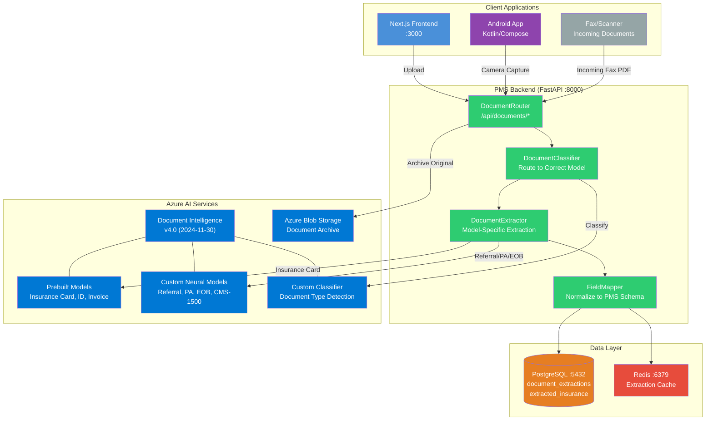

# Product Requirements Document: Azure Document Intelligence Integration into Patient Management System (PMS)

**Document ID:** PRD-PMS-AZUREDOCINTEL-001
**Version:** 1.0
**Date:** 2026-03-10
**Author:** Ammar (CEO, MPS Inc.)
**Status:** Draft

---

## 1. Executive Summary

Azure AI Document Intelligence (formerly Azure Form Recognizer) is a cloud-based Azure AI service that uses machine learning and OCR to extract structured information — text, tables, key-value pairs, selection marks, and document structure — from unstructured and semi-structured documents including PDFs, scanned images, and Office files. Part of Azure AI Foundry Tools, it operates as a managed REST API with SDKs for Python, JavaScript, .NET, and Java, requiring no ML infrastructure to deploy or manage.

Integrating Azure Document Intelligence into the PMS automates the extraction of critical clinical and administrative data from paper and scanned documents that currently require manual data entry. Health insurance cards, referral letters, prior authorization forms, Explanation of Benefits (EOB) documents, and prescription faxes arrive daily as images, PDFs, and faxes. Staff spend 3-5 minutes per document manually transcribing information into the PMS — member IDs, group numbers, diagnoses, medication lists, and coverage details. This integration replaces that manual transcription with automated extraction at 99%+ accuracy, reducing intake time and data entry errors.

Azure Document Intelligence is particularly compelling for the PMS because of its **prebuilt health insurance card model** (`prebuilt-healthInsuranceCard.us`), which extracts insurer name, member ID, group number, plan type, copay amounts, Rx benefit details (BIN, PCN), and dependent information directly from a phone-captured image or scan. For document types without prebuilt models (referral letters, CMS-1500 forms, EOBs, prior auth decisions), Azure supports **custom neural models** trainable with as few as 5 labeled samples, and **custom classifiers** that automatically route documents to the correct extraction model.

## 2. Problem Statement

The PMS faces several document processing bottlenecks in daily clinical operations:

1. **Manual insurance card data entry**: Front desk staff manually type insurance card information into the PMS during patient check-in. This takes 3-5 minutes per patient and introduces transcription errors in member IDs, group numbers, and payer IDs — errors that cascade into claim denials and delayed reimbursement.

2. **Referral letter processing delay**: Referral letters from external providers arrive as faxed PDFs. Staff must read each letter, identify the referring physician, diagnosis, requested procedure, and relevant clinical history, then manually enter this data. Backlogs of 20-30 referrals per day create 24-48 hour processing delays.

3. **Prior authorization document handling**: PA decision letters (approvals, denials, requests for additional information) arrive as faxes or scanned PDFs. Staff must read, classify, and manually update the PA status in the PMS, then file the document. Misclassification or delays directly impact treatment scheduling.

4. **EOB reconciliation**: Explanation of Benefits documents arrive from payers in various formats. Extracting payment amounts, adjustment codes, and denial reasons for reconciliation against submitted claims is entirely manual.

5. **No structured data from faxed prescriptions**: Prescriptions received via fax require manual transcription of medication name, dosage, frequency, and prescriber information.

6. **Audit trail gaps**: Paper and scanned documents lack structured, searchable metadata. Compliance audits require staff to manually locate and review physical documents or unindexed PDFs.

## 3. Proposed Solution

### 3.1 Architecture Overview

### 3.2 Deployment Model

- **Cloud-based (Azure)**: Document Intelligence runs as a managed Azure AI service. No infrastructure to deploy or manage. The PMS backend calls the REST API via the Python SDK.
- **Azure region**: Deploy the Document Intelligence resource in the same Azure region as the PMS backend (e.g., `eastus2`) to minimize latency and maintain data residency.
- **HIPAA BAA**: Microsoft's HIPAA BAA is included in Azure Product Terms by default — no separate contract required. All PHI processed by Document Intelligence is covered.
- **Data lifecycle**: Input documents are encrypted in transit (TLS) and at rest (AES-256). Analyze results are stored by Azure for 24 hours, then auto-deleted. Original documents are archived in Azure Blob Storage with customer-managed encryption keys.
- **Disconnected container option**: For maximum PHI isolation, Document Intelligence Read and Layout models can run in Docker containers on-premises (requires Azure commitment tier pricing).
- **Credential management**: API keys stored in Docker secrets / environment variables. For production, use Microsoft Entra ID (Azure AD) with service principal authentication and Managed Identity.

## 4. PMS Data Sources

| PMS API | Endpoint | Integration Use |
|---------|----------|-----------------|
| **Patient Records API** | `/api/patients` | Auto-populate patient demographics from extracted insurance card (name, DOB, address) and ID documents |
| **Encounter Records API** | `/api/encounters` | Link extracted referral data to the relevant encounter; attach extracted document metadata |
| **Medication & Prescription API** | `/api/prescriptions` | Create prescription records from extracted faxed prescription data (medication, dosage, prescriber) |
| **Reporting API** | `/api/reports` | Document processing metrics: extraction accuracy, processing time, volume by document type |

Additionally, the integration creates new endpoints:

| New PMS API | Endpoint | Purpose |
|-------------|----------|---------|
| **Document Upload API** | `POST /api/documents/upload` | Receive document uploads (file or camera capture) |
| **Insurance Extraction API** | `POST /api/documents/extract/insurance-card` | Extract and return structured insurance card data |
| **Document Classification API** | `POST /api/documents/classify` | Classify document type and route to correct extractor |
| **Extraction Results API** | `GET /api/documents/{id}/results` | Retrieve stored extraction results |

## 5. Component/Module Definitions

### 5.1 DocumentIntelligenceClient

- **Description**: Wrapper around the Azure Python SDK (`azure-ai-documentintelligence`) handling authentication, model selection, and async polling for analysis results.
- **Input**: Document bytes (PDF, JPEG, PNG), model ID
- **Output**: Structured `AnalyzeResult` with extracted fields, confidence scores, and bounding regions
- **PMS APIs used**: None (internal infrastructure component)

### 5.2 DocumentClassifier

- **Description**: Uses a custom Azure classifier model to identify incoming document types (insurance card, referral letter, PA decision, EOB, prescription fax, CMS-1500) and routes to the appropriate extraction model.
- **Input**: Document bytes
- **Output**: Document type classification with confidence score
- **PMS APIs used**: None (routing component)

### 5.3 InsuranceCardExtractor

- **Description**: Extracts structured insurance data using the `prebuilt-healthInsuranceCard.us` model. Maps extracted fields to PMS insurance record schema.
- **Input**: Insurance card image (front and/or back)
- **Output**: Structured insurance record (insurer, member ID, group number, plan type, copays, Rx details)
- **PMS APIs used**: Patient Records API (auto-populate insurance information)

### 5.4 ReferralExtractor

- **Description**: Extracts structured referral data using a custom neural model trained on ophthalmology referral letters. Maps referring physician, diagnosis, requested procedure, and clinical history.
- **Input**: Referral letter PDF
- **Output**: Structured referral record linked to patient and encounter
- **PMS APIs used**: Patient Records API, Encounter Records API

### 5.5 PADecisionExtractor

- **Description**: Extracts prior authorization decision data (approval/denial, authorization number, valid dates, approved procedures, denial reason codes) from PA decision letters.
- **Input**: PA decision letter PDF
- **Output**: PA status update with authorization details
- **PMS APIs used**: Encounter Records API (update PA status)

### 5.6 PrescriptionExtractor

- **Description**: Extracts prescription data from faxed prescriptions using a custom neural model. Maps medication name, dosage, frequency, quantity, refills, and prescriber information.
- **Input**: Faxed prescription PDF/image
- **Output**: Structured prescription record
- **PMS APIs used**: Medication & Prescription API

### 5.7 FieldMapper

- **Description**: Normalizes extracted fields from Azure's JSON response to PMS database schema. Handles field-level confidence thresholds — fields below 80% confidence are flagged for human review.
- **Input**: Raw `AnalyzeResult` JSON
- **Output**: PMS-schema-normalized records with confidence flags
- **PMS APIs used**: All (depending on document type)

### 5.8 DocumentReviewQueue (Frontend)

- **Description**: Next.js component showing extracted document data alongside the original document image. Staff can verify, correct, and approve extracted fields before they are committed to the PMS.
- **Input**: Extraction results with confidence scores, original document image
- **Output**: Staff-approved data committed to PMS records
- **PMS APIs used**: All (via FastAPI backend proxy)

### 5.9 InsuranceCardScanner (Android)

- **Description**: Jetpack Compose camera screen for capturing insurance card images (front and back). Uploads to FastAPI, displays extracted data for staff review.
- **Input**: Camera capture (JPEG)
- **Output**: Structured insurance data displayed for review/approval
- **PMS APIs used**: Patient Records API (via FastAPI backend)

## 6. Non-Functional Requirements

### 6.1 Security and HIPAA Compliance

| Requirement | Implementation |
|-------------|----------------|
| BAA coverage | Azure HIPAA BAA included by default in Microsoft Product Terms |
| Encryption in transit | TLS 1.2+ for all API calls to Document Intelligence (enforced by Azure) |
| Encryption at rest | AES-256 for documents in Azure Blob Storage; customer-managed keys (CMK) via Azure Key Vault |
| Data retention | Azure auto-deletes analysis results after 24 hours; original documents archived in Blob Storage with retention policy |
| PHI minimization | Extracted data stored in PostgreSQL with field-level encryption for PII/PHI fields |
| Credential management | Azure API key in Docker secrets; production uses Managed Identity (no key storage needed) |
| Audit logging | Every document upload and extraction logged: user_id, patient_id, document_type, timestamp, model_id, confidence_score |
| Access control | Role-based: `front_desk`, `medical_records`, `billing`, `physician`, `admin` roles |
| Network isolation | Azure Private Endpoint for Document Intelligence resource (VNet integration) |
| Data residency | Document Intelligence resource in same Azure region as PMS infrastructure |

### 6.2 Performance

| Metric | Target |
|--------|--------|
| Insurance card extraction latency | < 3s p95 (single page) |
| Multi-page document extraction | < 10s p95 (up to 10 pages) |
| Document classification | < 2s p95 |
| Extraction accuracy (prebuilt insurance) | > 95% field-level accuracy |
| Extraction accuracy (custom models) | > 90% field-level accuracy after training |
| Confidence threshold for auto-accept | >= 80% per field |
| Daily document volume | Up to 500 documents/day (initial) |
| Concurrent API calls | 15 TPS (default Azure limit, upgradable) |

### 6.3 Infrastructure

| Component | Requirement |
|-----------|-------------|
| Azure subscription | Standard (S0) Document Intelligence resource |
| Azure Blob Storage | For document archival and custom model training data |
| Python SDK | `azure-ai-documentintelligence>=1.0.0` |
| Runtime | Existing FastAPI Docker container |
| Database | PostgreSQL (existing) — 2 new tables: `document_extractions`, `extracted_insurance` |
| Cache | Redis (existing) — for extraction result caching |
| Custom model training | Document Intelligence Studio (web-based, no additional infrastructure) |
| Estimated monthly cost | ~$50-100/month at 500 docs/day (prebuilt at $10/1,000 pages) |

## 7. Implementation Phases

### Phase 1: Foundation — Insurance Card Extraction (Sprint 1-3)

- Provision Azure Document Intelligence resource (S0 tier, `eastus2`)
- Implement `DocumentIntelligenceClient` with API key authentication
- Implement `InsuranceCardExtractor` using `prebuilt-healthInsuranceCard.us`
- Create `document_extractions` and `extracted_insurance` PostgreSQL tables
- Build FastAPI endpoint `POST /api/documents/extract/insurance-card`
- Build Next.js `InsuranceCardUpload` component with side-by-side review UI
- Build Android `InsuranceCardScanner` camera capture screen
- Write unit tests with mock Azure responses
- **Deliverable**: Insurance card extraction working end-to-end with staff review

### Phase 2: Document Classification & Custom Models (Sprint 4-6)

- Collect and label training data for custom models (referral letters, PA decisions, EOBs)
- Train custom neural models in Document Intelligence Studio
- Implement `DocumentClassifier` using custom Azure classifier
- Implement `ReferralExtractor`, `PADecisionExtractor`, `PrescriptionExtractor`
- Build `FieldMapper` with confidence-based auto-accept/flag-for-review logic
- Build `DocumentReviewQueue` Next.js component for human-in-the-loop review
- Integrate with Encounter and Prescription APIs for automated data population
- **Deliverable**: Multi-document-type extraction pipeline with classification routing

### Phase 3: Advanced Features & Production Hardening (Sprint 7-9)

- Switch authentication to Managed Identity (Entra ID)
- Enable Azure Private Endpoint for network isolation
- Implement batch processing for bulk document ingestion (Batch Analyze API)
- Build document processing analytics dashboard (volume, accuracy, review rates)
- Implement composed models for multi-form routing
- Add customer-managed encryption keys (CMK) via Azure Key Vault
- Performance optimization: caching, async processing queue
- Penetration testing and HIPAA audit review
- **Deliverable**: Production-hardened document intelligence pipeline with monitoring

## 8. Success Metrics

| Metric | Target | Measurement Method |
|--------|--------|--------------------|
| Insurance card data entry time | < 30 seconds (from 3-5 minutes manual) | Application timing logs |
| Insurance field extraction accuracy | > 95% (member ID, group number, payer ID) | Comparison: extracted vs. staff-corrected values |
| Referral processing time | < 2 minutes (from 10-15 minutes manual) | Workflow timing logs |
| Document auto-accept rate | > 70% of fields accepted without human edit | `confidence >= 80%` acceptance rate |
| Daily document throughput | 500+ documents/day without manual bottleneck | Document extraction volume metrics |
| Claim denial rate from data entry errors | 50% reduction | Claims analytics pre/post comparison |
| Staff time saved on document processing | 20+ hours/week across practice | Time study comparison |
| HIPAA audit trail completeness | 100% of documents logged | Audit log completeness check |

## 9. Risks and Mitigations

| Risk | Impact | Mitigation |
|------|--------|------------|
| Insurance card image quality (phone capture) | Low extraction accuracy on blurry/dark photos | Add image quality check before submission; prompt user to retake; use `prebuilt-read` high-res add-on |
| Custom model accuracy below target | Referral/PA extraction requires manual correction | Start with 50+ training samples; retrain iteratively; use human-in-the-loop review queue |
| Azure rate limits (15 TPS default) | Document processing delays during peak check-in hours | Implement async processing queue; request TPS increase from Azure support |
| Azure service outage | No document extraction capability | Cache recent extraction results in Redis; manual fallback workflow; consider disconnected container for critical models |
| Cost overrun with high document volume | Monthly Azure bill exceeds budget | Monitor usage via Azure Cost Management; use `prebuilt-read` ($1.50/1K pages) for simple OCR; batch processing for efficiency |
| PHI exposure in Azure cloud | Regulatory compliance risk | Azure BAA covers PHI; use Private Endpoints; enable CMK; data residency in same region |
| Training data labeling effort | Custom model training requires domain expertise | Use Document Intelligence Studio auto-label feature; involve clinical staff in label review |
| Document format variability (different payer EOBs) | Single custom model may not generalize | Train per-payer custom models; use composed model for multi-payer routing |

## 10. Dependencies

| Dependency | Type | Notes |
|------------|------|-------|
| Azure subscription with Document Intelligence resource | External service | Standard (S0) tier, ~$10/1,000 pages for prebuilt models |
| `azure-ai-documentintelligence` Python SDK | Software dependency | v1.0.0+, targets REST API v4.0 (2024-11-30) |
| Azure Blob Storage account | External service | For document archival and custom model training data |
| Azure Key Vault (Phase 3) | External service | Customer-managed encryption keys |
| Document Intelligence Studio | External tool | Web-based custom model training and testing |
| PostgreSQL (existing) | Infrastructure | New tables for extraction results |
| Redis (existing) | Infrastructure | Extraction result caching |
| Labeled training data | Data asset | 50+ labeled samples per custom document type (referral, PA, EOB) |

## 11. Comparison with Existing Experiments

| Aspect | Azure Document Intelligence (Exp 69) | FHIR Prior Auth (Exp 48) | Availity API (Exp 47) | FedEx API (Exp 65) |
|--------|--------------------------------------|--------------------------|------------------------|---------------------|
| **Domain** | Document OCR & structured extraction | PA submission workflow | Insurance eligibility & claims | Physical shipping & logistics |
| **Data flow** | Paper/scan → structured data (ingest) | PMS → Payer (outbound PA) | PMS ↔ Payer (bidirectional) | PMS → FedEx (outbound shipment) |
| **Patient touchpoint** | Check-in (insurance card), referral intake | Treatment authorization | Coverage verification | Prescription delivery |
| **Complementary value** | Extracts insurance card data → feeds Availity eligibility check (Exp 47). Extracts PA decision letters → updates PA status tracked by FHIR PA (Exp 48). Extracts referral data → populates encounter for NextGen import (Exp 49). |

Azure Document Intelligence is the **document ingestion layer** that digitizes and structures paper-based clinical data. It feeds structured data into downstream systems: extracted insurance information flows into Availity eligibility checks (Exp 47), extracted PA decisions update the FHIR PA workflow (Exp 48), and extracted referral data populates encounters for follow-up. It transforms the PMS's paper bottleneck into a structured data pipeline.

## 12. Research Sources

### Official Documentation
- [Azure Document Intelligence Documentation](https://learn.microsoft.com/en-us/azure/ai-services/document-intelligence/) — Complete service documentation, model catalog, SDK guides
- [Document Processing Models Overview](https://learn.microsoft.com/en-us/azure/ai-services/document-intelligence/model-overview?view=doc-intel-4.0.0) — Full list of prebuilt and custom model types
- [Health Insurance Card Model](https://learn.microsoft.com/en-us/azure/ai-services/document-intelligence/prebuilt/health-insurance-card?view=doc-intel-4.0.0) — Extracted fields, schema, and usage for US insurance cards

### SDKs & Code Samples
- [Python SDK on PyPI](https://pypi.org/project/azure-ai-documentintelligence/) — `azure-ai-documentintelligence` package for Python 3.8+
- [Azure-Samples Code Repository](https://github.com/Azure-Samples/document-intelligence-code-samples) — Python, .NET, Java, JS code samples for all models

### Security & Compliance
- [Azure HIPAA Compliance](https://learn.microsoft.com/en-us/azure/compliance/offerings/offering-hipaa-us) — BAA coverage, compliance certification details
- [Data Privacy & Security for Document Intelligence](https://learn.microsoft.com/en-us/azure/ai-foundry/responsible-ai/document-intelligence/data-privacy-security?view=foundry-classic) — Data handling, encryption, retention policies

### Architecture & Integration
- [Automate Document Processing Architecture](https://learn.microsoft.com/en-us/azure/architecture/ai-ml/architecture/automate-document-processing-azure-ai-document-intelligence) — Reference architecture for document processing pipelines
- [Custom Model Training](https://learn.microsoft.com/en-us/azure/ai-services/document-intelligence/train/custom-model?view=doc-intel-4.0.0) — Neural and template model training with labeled data

### Pricing & Limits
- [Azure Document Intelligence Pricing](https://azure.microsoft.com/en-us/pricing/details/document-intelligence/) — Per-page pricing for all model tiers
- [Service Quotas and Limits](https://learn.microsoft.com/en-us/azure/ai-services/document-intelligence/service-limits?view=doc-intel-4.0.0) — TPS limits, file size limits, model limits

## 13. Appendix: Related Documents

- [Azure Document Intelligence Setup Guide](69-AzureDocIntel-PMS-Developer-Setup-Guide.md) — Installation, configuration, and verification
- [Azure Document Intelligence Developer Tutorial](69-AzureDocIntel-Developer-Tutorial.md) — Hands-on onboarding with end-to-end integration
- [Document Intelligence Studio](https://documentintelligence.ai.azure.com/) — Web-based testing and training tool
- [Availity API PRD (Exp 47)](47-PRD-AvailityAPI-PMS-Integration.md) — Multi-payer eligibility (complementary downstream)
- [FHIR Prior Auth PRD (Exp 48)](48-PRD-FHIRPriorAuth-PMS-Integration.md) — PA workflow (complementary downstream)
- [NextGen FHIR API PRD (Exp 49)](49-PRD-NextGenFHIRAPI-PMS-Integration.md) — Referral data import (complementary)
