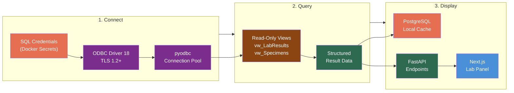
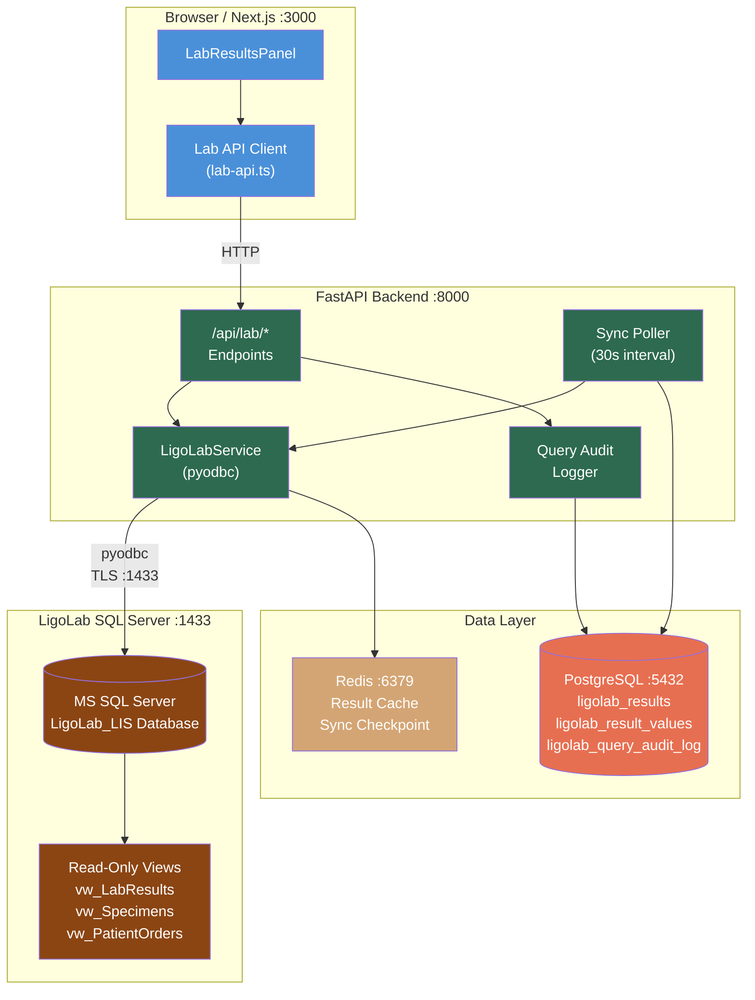

# LigoLab MS SQL Direct Connection Developer Onboarding Tutorial

**Welcome to the MPS PMS LigoLab Integration Team**

This tutorial will take you from zero to querying lab results directly from LigoLab's MS SQL Server database and displaying them in the PMS. By the end, you will understand how direct database integration works, have a running local environment with a LigoLab simulator, and have built and tested a lab result lookup and trending workflow end-to-end.

**Document ID:** PMS-EXP-LIGOLAB-002
**Version:** 1.0
**Date:** 2026-03-10
**Applies To:** PMS project (all platforms)
**Prerequisite:** [LigoLab Setup Guide](70-LigoLab-PMS-Developer-Setup-Guide.md)
**Estimated time:** 2-3 hours
**Difficulty:** Beginner-friendly

---

## What You Will Learn

1. What LigoLab LIS is and why direct SQL Server access is valuable for the PMS
2. How read-only MS SQL Server connections work with pyodbc and ODBC Driver 18
3. How to query lab results, specimens, and test catalogs from LigoLab's database views
4. How to build a patient lab result lookup with abnormal value detection
5. How to create time-series trending for monitoring chronic conditions (HbA1c for diabetic retinopathy)
6. How to implement a sync poller that detects new results every 30 seconds
7. How to cache LigoLab data in PostgreSQL for fast PMS queries
8. How HIPAA compliance is maintained with read-only access, TLS encryption, and audit logging
9. How direct SQL complements HL7 v2 messaging for different use cases
10. How to debug common MS SQL connection and query issues

## Part 1: Understanding LigoLab Direct SQL Integration (15 min read)

### 1.1 What Problem Does This Solve?

In the TRA ophthalmology practice, clinicians regularly need lab results to make treatment decisions:

- **Diabetic retinopathy patients** — HbA1c values determine disease progression and treatment urgency. An HbA1c of 7.2% (elevated) means closer monitoring; 9.0%+ means urgent referral to endocrinology.
- **Uveitis patients** — ESR, CRP, ANA, HLA-B27, toxoplasma, VDRL/FTA-ABS results guide the differential diagnosis and treatment plan.
- **Pre-surgical patients** — CBC, PT/INR, and metabolic panels must be reviewed before intravitreal injections or vitrectomy.
- **Genetic testing** — Inherited retinal disease panel results take 2-3 weeks and must be accessible when available.

Today, clinicians must leave the PMS, log into LigoLab's Web Connect portal, search for the patient, and manually review results. This adds 3-5 minutes per encounter and creates documentation gaps. A direct SQL connection lets the PMS query LigoLab's database and display results inline — no context switching, no manual transcription.

### 1.2 How Direct SQL Integration Works — The Key Pieces



**Three stages:**

1. **Connect** — The PMS backend uses pyodbc with Microsoft ODBC Driver 18 to establish a TLS-encrypted, read-only connection to LigoLab's MS SQL Server. Credentials are stored in Docker secrets. Connections are pooled for efficiency.
2. **Query** — Parameterized SQL queries execute against read-only views (`vw_LabResults`, `vw_Specimens`, `vw_PatientOrders`) provided by LigoLab. The PMS never writes to LigoLab's database.
3. **Display** — Results are returned via FastAPI endpoints, cached in PostgreSQL for fast subsequent lookups, and displayed in the Next.js lab panel with abnormal value highlighting.

### 1.3 How LigoLab Integration Fits with Other PMS Technologies

| Technology | Experiment | Relationship |
|------------|-----------|--------------|
| **HL7 v2 Interface** | (Traditional) | Complementary — HL7 for real-time orders/results push; SQL for historical queries and reporting |
| **NextGen FHIR API** | 49 | Different scope — NextGen imports external referral data; LigoLab provides in-house lab results |
| **Microsoft Teams** | 68 | Downstream — critical lab result alerts pushed to Teams when sync poller detects HH/LL flags |
| **Kafka** | 38 | Event bus — new results from sync poller published to `lab.results` topic |
| **Amazon Connect** | 51 | Patient calls about lab results can trigger LigoLab lookup |
| **Docker** | 39 | ODBC Driver 18 installed in FastAPI Docker container |
| **Availity API** | 47 | Lab CPT codes from LigoLab cross-referenced with Availity claims |

### 1.4 Key Vocabulary

| Term | Meaning |
|------|---------|
| **LIS** | Laboratory Information System — software managing lab orders, specimens, results, and billing |
| **MS SQL Server** | Microsoft's relational database; LigoLab's backend data store |
| **pyodbc** | Python library for ODBC database connections (MS SQL Server, PostgreSQL, etc.) |
| **ODBC Driver 18** | Microsoft's current ODBC driver for SQL Server on Linux/macOS/Windows |
| **Read-Only Replica** | SQL Server Always On secondary that accepts SELECT queries without impacting production writes |
| **MRN** | Medical Record Number — unique patient identifier linking PMS and LigoLab records |
| **Accession Number** | Unique identifier for a specimen in the lab; links order to results |
| **LOINC** | Logical Observation Identifiers Names and Codes — standard codes for lab tests (e.g., 4548-4 = HbA1c) |
| **Abnormal Flag** | Result indicator: N=Normal, H=High, L=Low, HH=Critical High, LL=Critical Low |
| **TDE** | Transparent Data Encryption — SQL Server feature encrypting data at rest |
| **Sync Poller** | Background task that periodically queries LigoLab for new/updated results |
| **ApplicationIntent=ReadOnly** | SQL Server connection string parameter routing to Always On readable secondary |

### 1.5 Our Architecture



## Part 2: Environment Verification (15 min)

### 2.1 Checklist

1. **ODBC Driver installed:**
   ```bash
   odbcinst -q -d | grep "ODBC Driver 18"
   # Expected: [ODBC Driver 18 for SQL Server]
   ```

2. **pyodbc installed:**
   ```bash
   pip show pyodbc | grep Version
   # Expected: Version: 5.x
   ```

3. **LigoLab simulator running:**
   ```bash
   docker ps | grep ligolab-mssql-sim
   # Expected: container running on port 1433
   ```

4. **SQL Server responsive:**
   ```bash
   docker exec ligolab-mssql-sim /opt/mssql-tools18/bin/sqlcmd \
     -S localhost -U pms_readonly -P "PmsRead_0nly!2026" -C \
     -d LigoLab_LIS -Q "SELECT COUNT(*) AS ResultCount FROM dbo.vw_LabResults" -W
   # Expected: ResultCount = 6
   ```

5. **FastAPI backend running:**
   ```bash
   curl -s http://localhost:8000/health | jq .status
   # Expected: "ok"
   ```

6. **PostgreSQL cache tables exist:**
   ```bash
   psql -h localhost -U pms -d pms_dev -c "\dt ligolab_*"
   # Expected: 3 tables
   ```

### 2.2 Quick Test

Test the full stack end-to-end:

```bash
curl -s http://localhost:8000/api/lab/connection/test | jq .
# Expected: {"status": "connected", "database": "LigoLab_LIS", ...}

curl -s http://localhost:8000/api/lab/results/MRN10001 | jq '.results[0].values[0]'
# Expected: HbA1c result with value "7.2" and abnormal_flag "H"
```

## Part 3: Build Your First Integration (45 min)

### 3.1 What We Are Building

A **diabetic retinopathy lab monitoring workflow** that:

1. Queries a patient's HbA1c history from LigoLab
2. Displays all results with abnormal highlighting
3. Charts HbA1c trending over time
4. Detects critical values and logs them
5. Caches results in PostgreSQL for fast subsequent access

### 3.2 Step 1: Add Historical Data to the Simulator

Add more HbA1c results for trending:

```bash
docker exec -i ligolab-mssql-sim /opt/mssql-tools18/bin/sqlcmd \
  -S localhost -U sa -P "Dev_P@ssw0rd123" -C -d LigoLab_LIS << 'EOSQL'

-- Add historical orders for Jane Smith (MRN10001) - quarterly HbA1c
INSERT INTO dbo.LabOrder (OrderNumber, PatientID, OrderingProvider, OrderDate, Status, ICD10Codes) VALUES
('ORD-2025-0010', 1, 'Dr. Chen', '2025-06-15 09:00:00', 'Resulted', 'E11.9,H35.30'),
('ORD-2025-0020', 1, 'Dr. Chen', '2025-09-20 09:00:00', 'Resulted', 'E11.9,H35.30'),
('ORD-2025-0030', 1, 'Dr. Chen', '2025-12-10 09:00:00', 'Resulted', 'E11.9,H35.30');

INSERT INTO dbo.Accession (AccessionNumber, OrderID, PatientID, CollectedDate, ReceivedDate, Status) VALUES
('ACC-2025-0010', 4, 1, '2025-06-15 09:30:00', '2025-06-15 11:00:00', 'Completed'),
('ACC-2025-0020', 5, 1, '2025-09-20 09:30:00', '2025-09-20 11:00:00', 'Completed'),
('ACC-2025-0030', 6, 1, '2025-12-10 09:30:00', '2025-12-10 11:00:00', 'Completed');

INSERT INTO dbo.LabResult (AccessionID, PatientID, OrderID, ResultStatus, ResultDate, VerifiedBy, VerifiedDate) VALUES
(4, 1, 4, 'F', '2025-06-16 06:00:00', 'Dr. Lab Tech', '2025-06-16 06:30:00'),
(5, 1, 5, 'F', '2025-09-21 06:00:00', 'Dr. Lab Tech', '2025-09-21 06:30:00'),
(6, 1, 6, 'F', '2025-12-11 06:00:00', 'Dr. Lab Tech', '2025-12-11 06:30:00');

-- HbA1c trending: 8.1 -> 7.8 -> 7.5 -> 7.2 (improving with treatment)
INSERT INTO dbo.ResultValue (ResultID, TestID, Value, Units, ReferenceRange, AbnormalFlag, ObservationDate) VALUES
(3, 1, '8.1', '%', '4.0-5.6', 'HH', '2025-06-16 06:00:00'),
(4, 1, '7.8', '%', '4.0-5.6', 'H',  '2025-09-21 06:00:00'),
(5, 1, '7.5', '%', '4.0-5.6', 'H',  '2025-12-11 06:00:00');
-- Note: 7.2% already exists from the seed data (Result 1)
GO
EOSQL
```

### 3.3 Step 2: Query the Trending Data

```bash
curl -s http://localhost:8000/api/lab/trending/MRN10001/HBA1C?days_back=730 | jq .
```

Expected:

```json
{
  "patient_mrn": "MRN10001",
  "test_code": "HBA1C",
  "data_points": 4,
  "series": [
    {"value": "8.1", "units": "%", "abnormalFlag": "HH", "date": "2025-06-16 06:00:00"},
    {"value": "7.8", "units": "%", "abnormalFlag": "H",  "date": "2025-09-21 06:00:00"},
    {"value": "7.5", "units": "%", "abnormalFlag": "H",  "date": "2025-12-11 06:00:00"},
    {"value": "7.2", "units": "%", "abnormalFlag": "H",  "date": "2026-03-02 06:00:00"}
  ]
}
```

The trending shows HbA1c improving from 8.1% (critical) to 7.2% (high but improving) over 9 months — exactly the kind of data a retina specialist needs when deciding whether to escalate diabetic retinopathy treatment.

### 3.4 Step 3: Build a Sync Poller

Create `backend/app/services/ligolab_poller.py`:

```python
"""Background sync poller for new LigoLab results."""

import asyncio
import logging
from datetime import datetime, timezone

import redis.asyncio as redis

from starlette.concurrency import run_in_threadpool
from app.services.ligolab_service import LigoLabService

logger = logging.getLogger(__name__)

SYNC_INTERVAL = 30  # seconds
CHECKPOINT_KEY = "ligolab:sync:last_timestamp"


class LigoLabPoller:
    """Polls LigoLab for new/updated results on a fixed interval."""

    def __init__(self) -> None:
        self.ligolab = LigoLabService()
        self.redis = redis.from_url("redis://localhost:6379")
        self._running = False

    async def start(self):
        """Start the polling loop."""
        self._running = True
        logger.info("LigoLab sync poller started (interval=%ds)", SYNC_INTERVAL)
        while self._running:
            try:
                await self._poll_once()
            except Exception as e:
                logger.error("Sync poller error: %s", e)
            await asyncio.sleep(SYNC_INTERVAL)

    async def stop(self):
        """Stop the polling loop."""
        self._running = False
        await self.redis.aclose()

    async def _poll_once(self):
        """Execute one polling cycle."""
        # Get last sync checkpoint
        checkpoint = await self.redis.get(CHECKPOINT_KEY)
        if checkpoint:
            since = checkpoint.decode()
        else:
            since = "2026-01-01 00:00:00"  # Initial sync window

        # Query LigoLab for new results
        new_results = await run_in_threadpool(
            self.ligolab.get_new_results_since, since
        )

        if new_results:
            logger.info("Sync poller found %d new/updated results", len(new_results))

            # Check for critical values
            critical = [
                r for r in new_results
                if r.get("abnormal_flag") in ("HH", "LL", "AA")
            ]
            if critical:
                logger.warning(
                    "CRITICAL results detected: %s",
                    [(r["patient_mrn"], r["test_name"], r["value"], r["abnormal_flag"]) for r in critical],
                )
                # TODO: Send notifications via WebSocket, Teams (Exp 68), push

            # TODO: Upsert results into PostgreSQL ligolab_results / ligolab_result_values

            # Update checkpoint to latest ModifiedDate
            latest = max(r["last_modified"] for r in new_results)
            await self.redis.set(CHECKPOINT_KEY, latest)
```

### 3.5 Step 4: Register the Poller with FastAPI Lifespan

Add to `backend/app/main.py`:

```python
from app.services.ligolab_poller import LigoLabPoller

poller = LigoLabPoller()

@asynccontextmanager
async def lifespan(app):
    # Start sync poller in background
    poller_task = asyncio.create_task(poller.start())
    yield
    await poller.stop()
    poller_task.cancel()
```

### 3.6 Step 5: Verify the Full Flow

```bash
# 1. Check connection
curl -s http://localhost:8000/api/lab/connection/test | jq .status
# Expected: "connected"

# 2. Get all results for Jane Smith
curl -s http://localhost:8000/api/lab/results/MRN10001 | jq '.result_count'
# Expected: 4 (or more with historical data)

# 3. Get HbA1c trending
curl -s http://localhost:8000/api/lab/trending/MRN10001/HBA1C | jq '.data_points'
# Expected: 4

# 4. Check critical results for Robert Johnson (uveitis workup)
curl -s http://localhost:8000/api/lab/results/MRN10002 | \
  jq '.results[].values[] | select(.abnormal_flag == "HH") | {test: .test_name, value: .value}'
# Expected: CRP = 28.5 [HH]

# 5. Check specimen status
curl -s http://localhost:8000/api/lab/specimens/MRN10001 | jq '.specimens[] | {accession: .accession_number, status: .specimen_status}'
# Expected: Completed and InProcess specimens

# 6. Verify sync checkpoint in Redis
redis-cli GET ligolab:sync:last_timestamp
# Expected: timestamp string (after poller has run)
```

**Checkpoint:** Full workflow operational — connection, results query, trending, critical detection, specimen tracking, and sync poller all working.

## Part 4: Evaluating Strengths and Weaknesses (15 min)

### 4.1 Strengths

- **Full historical access** — Query any patient's complete lab history, not just individual messages
- **No message parsing** — No HL7 segment parsing, MLLP framing, or ACK handling — just SQL queries
- **Flexible queries** — Ad-hoc reporting, trending, aggregations, and cross-patient analytics
- **Simple stack** — pyodbc is mature and well-documented; no custom protocol implementation
- **Fast bulk access** — Retrieve hundreds of results in a single query vs processing individual HL7 messages
- **Gap-filling** — If an HL7 message was missed, the SQL connection catches it on the next poll

### 4.2 Weaknesses

- **Read-only** — Cannot place lab orders via SQL; orders still require HL7 ORM or Web Connect portal
- **Schema dependency** — Views may change with LigoLab upgrades; no public schema documentation
- **No real-time push** — Polling interval (30s) introduces latency; HL7 ORU messages are pushed instantly
- **Requires LigoLab cooperation** — Read-only access must be explicitly provisioned; not all LigoLab deployments offer this
- **No async driver** — pyodbc is synchronous; must use thread pool wrapper for FastAPI async endpoints
- **Network dependency** — VPN/firewall must be maintained; SQL port 1433 must be accessible

### 4.3 When to Use Direct SQL vs Alternatives

| Scenario | Recommended Approach | Why |
|----------|---------------------|-----|
| Place new lab orders | HL7 v2 ORM or Web Connect | SQL connection is read-only |
| Receive new results in real-time | HL7 v2 ORU | Push-based, < 1s latency |
| View patient's full lab history | **Direct SQL** | Single query returns all history |
| Trend a test value over 2 years | **Direct SQL** | Efficient time-range query |
| Generate turnaround time reports | **Direct SQL** | Aggregate queries across all orders |
| Track specimen processing status | **Direct SQL** | Query vw_Specimens view |
| Detect missed/unreceived results | **Direct SQL** | Compare SQL results vs PMS cache |
| Bulk data migration/backfill | **Direct SQL** | Efficient bulk SELECT |
| Real-time critical result alerts | HL7 v2 ORU + Sync Poller | HL7 for primary; poller as backup |

### 4.4 HIPAA / Healthcare Considerations

| Concern | Assessment |
|---------|------------|
| **PHI in queries** | Every query accesses PHI (names, DOBs, lab values). Use parameterized queries; never log query parameters. |
| **Minimum necessary** | Read-only login with SELECT on specific views only — no access to billing details, full patient tables, or other modules unless needed. |
| **Encryption** | TLS 1.2+ enforced on SQL connection (`Encrypt=yes`). LigoLab uses TDE for data at rest. PMS caches encrypted in PostgreSQL (AES-256). |
| **Audit trail** | Every query logged in `ligolab_query_audit_log` with user, query type, patient MRN, row count, and execution time. |
| **BAA** | Business Associate Agreement required before database access is granted. |
| **Access control** | PMS roles restrict who can view lab data: physicians, nurses, lab techs. Reporting restricted to admin/manager. |
| **Data retention** | Cached results retained 7 years. Audit logs retained 7 years. Consistent with HIPAA requirements. |

## Part 5: Debugging Common Issues (15 min read)

### Issue 1: "Data source name not found" Error

**Symptom:** `pyodbc.InterfaceError: ('IM002', '... Data source name not found ...')`
**Cause:** ODBC Driver 18 not installed or not registered.
**Fix:** Run `odbcinst -q -d`. If driver not listed, reinstall per the setup guide Section 2.2. In Docker, ensure the Dockerfile includes the apt install commands.

### Issue 2: Connection Timeout

**Symptom:** `pyodbc.OperationalError: ('HYT00', '... Login timeout expired ...')`
**Cause:** SQL Server unreachable — wrong host, port, or firewall blocking.
**Fix:** Test TCP: `nc -z <host> 1433`. Check VPN status. Verify Docker port mapping: `docker port ligolab-mssql-sim`.

### Issue 3: "Login failed for user" Error

**Symptom:** `pyodbc.InterfaceError: ('28000', '... Login failed ...')`
**Cause:** Wrong credentials or user not created in SQL Server.
**Fix:** Verify env vars match the SQL login. For simulator, re-run the schema creation script. For production, contact LigoLab DBA.

### Issue 4: TLS Certificate Not Trusted

**Symptom:** `SSL Provider: The certificate chain was issued by an authority that is not trusted`
**Cause:** SQL Server's TLS certificate is self-signed (common in dev).
**Fix:** For dev: `TrustServerCertificate=yes`. For production: install the CA certificate and set `TrustServerCertificate=no`.

### Issue 5: Query Returns Empty Results

**Symptom:** API returns `{"results": []}` but data exists in LigoLab.
**Cause:** Patient MRN mismatch between PMS and LigoLab, or date range filter too narrow.
**Fix:** Query LigoLab directly to verify MRN: `SELECT * FROM dbo.vw_LabResults WHERE PatientMRN = 'MRN10001'`. Widen `days_back` parameter. Check MRN format (leading zeros, prefixes).

### Issue 6: Sync Poller Not Detecting New Results

**Symptom:** New results added to LigoLab but poller doesn't pick them up.
**Cause:** Checkpoint timestamp ahead of new data, or `ModifiedDate` column not updated.
**Fix:** Check Redis checkpoint: `redis-cli GET ligolab:sync:last_timestamp`. Reset: `redis-cli DEL ligolab:sync:last_timestamp`. Verify `ModifiedDate` updates on new result inserts.

## Part 6: Practice Exercise (45 min)

### Option A: Build a Uveitis Workup Dashboard

Create an endpoint that retrieves all inflammation-related labs for a uveitis patient in one call.

**Hints:**
1. Define a "Uveitis Panel" as: ESR, CRP, ANA, HLA-B27, Toxoplasma IgG, VDRL, FTA-ABS, QuantiFERON
2. Query `vw_LabResults` with `TestCode IN (...)` filter
3. Return results grouped by test with most recent value highlighted
4. Add a Next.js component that shows a traffic-light summary (all normal = green, any abnormal = yellow, any critical = red)
5. Add seed data to the simulator for Robert Johnson's full uveitis workup

### Option B: Build an Outstanding Orders Report

Create a reporting endpoint that shows orders with no results yet.

**Hints:**
1. Query `vw_PatientOrders` for orders where `Status NOT IN ('Resulted', 'Cancelled')`
2. Calculate days since order date
3. Flag orders exceeding expected turnaround time (from `TestCatalog.TurnaroundHours`)
4. Return sorted by urgency (Stat first, then oldest Routine)
5. Add a Next.js table with "overdue" highlighting

### Option C: Build a Billing Reconciliation Tool

Create an endpoint that cross-references LigoLab CPT codes with PMS encounter records.

**Hints:**
1. Join `vw_LabResults` (has CPT codes) with PMS `encounters` table (by date + patient)
2. Identify lab results without a matching PMS encounter (potential missed billing)
3. Identify PMS encounters without expected lab results (potential missing labs)
4. Return a discrepancy report with patient, date, test, and status
5. This demonstrates the gap-filling power of direct SQL access

## Part 7: Development Workflow and Conventions

### 7.1 File Organization

```
backend/
├── app/
│   ├── api/
│   │   └── routes/
│   │       └── lab.py                    # Lab query endpoints
│   ├── services/
│   │   ├── ligolab_service.py            # MS SQL query service
│   │   └── ligolab_poller.py             # Background sync poller
│   └── core/
│       └── config.py                     # MSSQL connection config
├── migrations/
│   └── ligolab_001_initial.sql           # PostgreSQL cache schema
└── tests/
    └── test_ligolab.py                   # Integration tests

frontend/
├── src/
│   ├── lib/
│   │   └── lab-api.ts                    # Lab API client
│   └── components/
│       └── lab/
│           └── LabResultsPanel.tsx        # Lab results UI
```

### 7.2 Naming Conventions

| Item | Convention | Example |
|------|-----------|---------|
| Python service class | `LigoLabService` | `LigoLabService`, `LigoLabPoller` |
| SQL views (LigoLab side) | `vw_` prefix, PascalCase | `vw_LabResults`, `vw_Specimens` |
| PostgreSQL tables (PMS cache) | `ligolab_` prefix, snake_case | `ligolab_results`, `ligolab_result_values` |
| API endpoints | `/api/lab/` prefix | `/api/lab/results/{mrn}` |
| TypeScript API functions | camelCase | `getPatientResults()` |
| React components | PascalCase | `LabResultsPanel` |
| Config variables | `LIGOLAB_MSSQL_` prefix | `LIGOLAB_MSSQL_HOST` |

### 7.3 PR Checklist

- [ ] All SQL queries use parameterized placeholders (`?`) — never string concatenation
- [ ] Connection string never logged or exposed in API responses
- [ ] All pyodbc calls wrapped in `run_in_threadpool()` for async compatibility
- [ ] Connections are closed in `finally` blocks (or using context managers)
- [ ] Query audit log entry created for every database access
- [ ] No write operations (INSERT/UPDATE/DELETE) against LigoLab database
- [ ] Abnormal flags correctly mapped (N, H, L, HH, LL, A, AA)
- [ ] Date range filters included in all queries to prevent unbounded result sets
- [ ] Redis cache used for frequently accessed patient results
- [ ] `TrustServerCertificate=no` in production connection strings

### 7.4 Security Reminders

1. **Never concatenate user input into SQL strings.** Always use parameterized queries (`cursor.execute("... WHERE MRN = ?", mrn)`).
2. **Never log SQL Server credentials.** Redact in all logging output.
3. **Never use `TrustServerCertificate=yes` in production.** Install proper CA certificates.
4. **Limit connection pool size** to avoid overwhelming LigoLab's read replica (5-10 connections max).
5. **Close connections** in `finally` blocks — leaked connections exhaust the pool.
6. **Encrypt cached data** in PostgreSQL using the existing AES-256 pattern.
7. **Audit every query** — the audit log is your evidence for HIPAA compliance reviews.

## Part 8: Quick Reference Card

### Key Commands

```bash
# Start LigoLab simulator
docker start ligolab-mssql-sim

# Test connection
curl -s http://localhost:8000/api/lab/connection/test | jq .

# Query patient results
curl -s http://localhost:8000/api/lab/results/MRN10001 | jq .

# Get trending data
curl -s http://localhost:8000/api/lab/trending/MRN10001/HBA1C | jq .

# Check specimens
curl -s http://localhost:8000/api/lab/specimens/MRN10001 | jq .

# Connect to simulator directly
docker exec -it ligolab-mssql-sim /opt/mssql-tools18/bin/sqlcmd \
  -S localhost -U pms_readonly -P "PmsRead_0nly!2026" -C -d LigoLab_LIS
```

### Key Files

| File | Purpose |
|------|---------|
| `backend/app/services/ligolab_service.py` | MS SQL query service (pyodbc) |
| `backend/app/services/ligolab_poller.py` | Background sync poller |
| `backend/app/api/routes/lab.py` | FastAPI lab endpoints |
| `frontend/src/lib/lab-api.ts` | TypeScript API client |
| `frontend/src/components/lab/LabResultsPanel.tsx` | Lab results UI |
| `migrations/ligolab_001_initial.sql` | PostgreSQL cache schema |

### Key URLs

| Resource | URL |
|----------|-----|
| LigoLab Website | https://www.ligolab.com/ |
| PMS Lab API Swagger | http://localhost:8000/docs#/lab |
| pyodbc Wiki | https://github.com/mkleehammer/pyodbc/wiki |
| LOINC Search | https://loinc.org/search/ |

### Common Test Codes

| Code | LOINC | Test | Clinical Use |
|------|-------|------|-------------|
| HBA1C | 4548-4 | Hemoglobin A1c | Diabetic retinopathy monitoring |
| ESR | 30341-2 | Sed Rate | Uveitis/inflammation workup |
| CRP | 1988-5 | C-Reactive Protein | Inflammation marker |
| CBC | 57021-8 | Complete Blood Count | Pre-surgical, general |
| CMP | 24323-8 | Comprehensive Metabolic | Kidney/liver function |
| ANA | 8061-4 | Antinuclear Antibodies | Autoimmune uveitis |
| GEN_IRD | 100746-7 | Inherited Retinal Disease Panel | Genetic testing |

## Next Steps

1. **Review the PRD** — [LigoLab PRD](70-PRD-LigoLab-PMS-Integration.md) for the full roadmap including Phase 2-3 features
2. **Contact LigoLab** — Request read-only database access and schema documentation for the production environment
3. **Implement PostgreSQL caching** — Store synced results for fast PMS queries without hitting LigoLab on every request
4. **Add Teams notifications** — [Experiment 68](68-PRD-MSTeams-PMS-Integration.md) for critical lab result alerts via Adaptive Cards
5. **Explore Kafka integration** — [Experiment 38](38-PRD-Kafka-PMS-Integration.md) to publish lab result events for downstream consumers
