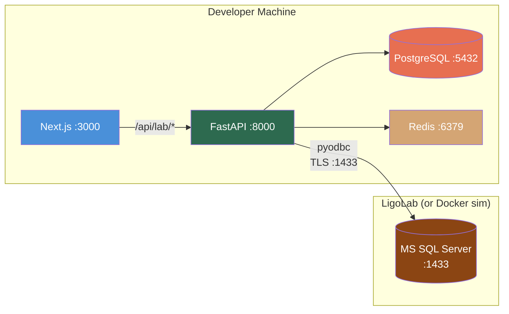

# LigoLab MS SQL Direct Connection Setup Guide for PMS Integration

**Document ID:** PMS-EXP-LIGOLAB-001
**Version:** 1.0
**Date:** 2026-03-10
**Applies To:** PMS project (all platforms)
**Prerequisites Level:** Intermediate

---

## Table of Contents

1. [Overview](#1-overview)
2. [Prerequisites](#2-prerequisites)
3. [Part A: Install MS ODBC Driver & pyodbc](#3-part-a-install-ms-odbc-driver--pyodbc)
4. [Part B: Integrate with PMS Backend](#4-part-b-integrate-with-pms-backend)
5. [Part C: Integrate with PMS Frontend](#5-part-c-integrate-with-pms-frontend)
6. [Part D: Testing and Verification](#6-part-d-testing-and-verification)
7. [Troubleshooting](#7-troubleshooting)
8. [Reference Commands](#8-reference-commands)

---

## 1. Overview

This guide walks you through setting up a read-only MS SQL Server connection from the PMS FastAPI backend to the LigoLab LIS database. By the end, you will have:

- Microsoft ODBC Driver 18 installed in your development environment and Docker container
- A `LigoLabService` Python class using pyodbc with TLS-encrypted connection pooling
- PostgreSQL tables for locally cached lab results and query audit logging
- A Result Sync Poller that detects new results every 30 seconds
- FastAPI endpoints for lab result queries, specimen tracking, and lab trending
- A Next.js Lab Results panel with abnormal value highlighting and trending charts
- End-to-end tests using a local MS SQL Server Docker container as a LigoLab simulator



## 2. Prerequisites

### 2.1 Required Software

| Software | Minimum Version | Check Command |
|----------|----------------|---------------|
| Python | 3.11+ | `python --version` |
| Node.js | 18+ | `node --version` |
| PostgreSQL | 15+ | `psql --version` |
| Redis | 7+ | `redis-cli --version` |
| Docker & Docker Compose | 24+ / 2.20+ | `docker --version && docker compose version` |
| ODBC Driver Manager | unixODBC 2.3+ | `odbcinst -j` |
| curl | any | `curl --version` |

### 2.2 Installation of Prerequisites

#### macOS

```bash
# Install unixODBC and MS ODBC Driver 18
brew install unixodbc
brew tap microsoft/mssql-release https://github.com/Microsoft/homebrew-mssql-release
brew update
HOMEBREW_ACCEPT_EULA=Y brew install msodbcsql18

# Verify
odbcinst -q -d
# Expected output includes: [ODBC Driver 18 for SQL Server]
```

#### Ubuntu/Debian (and Docker)

```bash
# Add Microsoft repository
curl https://packages.microsoft.com/keys/microsoft.asc | sudo tee /etc/apt/trusted.gpg.d/microsoft.asc
curl https://packages.microsoft.com/config/ubuntu/22.04/prod.list | sudo tee /etc/apt/sources.list.d/mssql-release.list

# Install
sudo apt-get update
sudo ACCEPT_EULA=Y apt-get install -y msodbcsql18 unixodbc-dev
```

#### Python dependencies

```bash
cd backend/
source .venv/bin/activate
pip install pyodbc
```

### 2.3 Verify PMS Services

```bash
# Backend health check
curl -s http://localhost:8000/health | jq .
# Expected: {"status": "ok"}

# Frontend
curl -s -o /dev/null -w "%{http_code}" http://localhost:3000
# Expected: 200

# PostgreSQL
psql -h localhost -U pms -d pms_dev -c "SELECT 1;"
# Expected: 1

# Redis
redis-cli ping
# Expected: PONG
```

**Checkpoint:** All PMS services running; ODBC Driver 18 installed and visible in `odbcinst -q -d`.

## 3. Part A: Install MS ODBC Driver & pyodbc

### Step 1: Start a Local MS SQL Server (Development Simulator)

For local development, run a SQL Server container that simulates LigoLab's database:

```bash
docker run -d \
  --name ligolab-mssql-sim \
  -e "ACCEPT_EULA=Y" \
  -e "MSSQL_SA_PASSWORD=Dev_P@ssw0rd123" \
  -p 1433:1433 \
  mcr.microsoft.com/mssql/server:2022-latest
```

Wait 10 seconds for startup, then verify:

```bash
docker exec ligolab-mssql-sim /opt/mssql-tools18/bin/sqlcmd \
  -S localhost -U sa -P "Dev_P@ssw0rd123" -C \
  -Q "SELECT @@VERSION" -W
```

### Step 2: Create Simulated LigoLab Schema

```bash
docker exec -i ligolab-mssql-sim /opt/mssql-tools18/bin/sqlcmd \
  -S localhost -U sa -P "Dev_P@ssw0rd123" -C << 'EOSQL'

-- Create LigoLab database
CREATE DATABASE LigoLab_LIS;
GO
USE LigoLab_LIS;
GO

-- Patients table
CREATE TABLE dbo.Patient (
    PatientID INT IDENTITY(1,1) PRIMARY KEY,
    MRN VARCHAR(30) NOT NULL UNIQUE,
    LastName VARCHAR(100) NOT NULL,
    FirstName VARCHAR(100) NOT NULL,
    DateOfBirth DATE,
    Sex CHAR(1),
    Address1 VARCHAR(200),
    City VARCHAR(100),
    State VARCHAR(2),
    ZipCode VARCHAR(10),
    Phone VARCHAR(20),
    CreatedDate DATETIME2 DEFAULT GETDATE(),
    ModifiedDate DATETIME2 DEFAULT GETDATE()
);

-- Test catalog
CREATE TABLE dbo.TestCatalog (
    TestID INT IDENTITY(1,1) PRIMARY KEY,
    TestCode VARCHAR(20) NOT NULL UNIQUE,
    TestName VARCHAR(200) NOT NULL,
    LOINCCode VARCHAR(20),
    CPTCode VARCHAR(10),
    Department VARCHAR(50),
    SpecimenType VARCHAR(50),
    TurnaroundHours INT,
    IsActive BIT DEFAULT 1
);

-- Lab orders
CREATE TABLE dbo.LabOrder (
    OrderID INT IDENTITY(1,1) PRIMARY KEY,
    OrderNumber VARCHAR(30) NOT NULL UNIQUE,
    PatientID INT NOT NULL REFERENCES dbo.Patient(PatientID),
    OrderingProvider VARCHAR(200),
    OrderDate DATETIME2 NOT NULL,
    Priority CHAR(1) DEFAULT 'R',  -- R=Routine, S=Stat
    Status VARCHAR(20) DEFAULT 'Ordered',  -- Ordered, Collected, InProcess, Resulted, Cancelled
    ICD10Codes VARCHAR(500),
    ClinicalNotes VARCHAR(1000),
    CreatedDate DATETIME2 DEFAULT GETDATE(),
    ModifiedDate DATETIME2 DEFAULT GETDATE()
);

-- Accessions (specimen tracking)
CREATE TABLE dbo.Accession (
    AccessionID INT IDENTITY(1,1) PRIMARY KEY,
    AccessionNumber VARCHAR(30) NOT NULL UNIQUE,
    OrderID INT NOT NULL REFERENCES dbo.LabOrder(OrderID),
    PatientID INT NOT NULL REFERENCES dbo.Patient(PatientID),
    CollectedDate DATETIME2,
    ReceivedDate DATETIME2,
    Status VARCHAR(20) DEFAULT 'Pending',  -- Pending, Received, InProcess, Completed
    CreatedDate DATETIME2 DEFAULT GETDATE(),
    ModifiedDate DATETIME2 DEFAULT GETDATE()
);

-- Lab results (report level)
CREATE TABLE dbo.LabResult (
    ResultID INT IDENTITY(1,1) PRIMARY KEY,
    AccessionID INT NOT NULL REFERENCES dbo.Accession(AccessionID),
    PatientID INT NOT NULL REFERENCES dbo.Patient(PatientID),
    OrderID INT REFERENCES dbo.LabOrder(OrderID),
    ResultStatus CHAR(1) DEFAULT 'F',  -- P=Preliminary, F=Final, C=Corrected, X=Cancelled
    ResultDate DATETIME2,
    VerifiedBy VARCHAR(200),
    VerifiedDate DATETIME2,
    CreatedDate DATETIME2 DEFAULT GETDATE(),
    ModifiedDate DATETIME2 DEFAULT GETDATE()
);

-- Result values (individual test results)
CREATE TABLE dbo.ResultValue (
    ValueID INT IDENTITY(1,1) PRIMARY KEY,
    ResultID INT NOT NULL REFERENCES dbo.LabResult(ResultID),
    TestID INT NOT NULL REFERENCES dbo.TestCatalog(TestID),
    Value VARCHAR(500),
    Units VARCHAR(30),
    ReferenceRange VARCHAR(100),
    AbnormalFlag VARCHAR(5),  -- N, H, L, HH, LL, A, AA
    ValueType VARCHAR(5) DEFAULT 'NM',  -- NM=Numeric, ST=String, TX=Text
    ObservationDate DATETIME2,
    CreatedDate DATETIME2 DEFAULT GETDATE(),
    ModifiedDate DATETIME2 DEFAULT GETDATE()
);

-- Read-only views for PMS integration
CREATE VIEW dbo.vw_LabResults AS
SELECT
    rv.ValueID,
    r.ResultID,
    r.ResultStatus,
    r.ResultDate,
    r.VerifiedBy,
    a.AccessionNumber,
    o.OrderNumber,
    o.OrderingProvider,
    p.MRN AS PatientMRN,
    p.LastName + ', ' + p.FirstName AS PatientName,
    p.DateOfBirth,
    t.TestCode,
    t.TestName,
    t.LOINCCode,
    t.CPTCode,
    t.Department,
    rv.Value,
    rv.Units,
    rv.ReferenceRange,
    rv.AbnormalFlag,
    rv.ValueType,
    rv.ObservationDate,
    rv.ModifiedDate AS LastModified
FROM dbo.ResultValue rv
JOIN dbo.LabResult r ON rv.ResultID = r.ResultID
JOIN dbo.Accession a ON r.AccessionID = a.AccessionID
JOIN dbo.LabOrder o ON r.OrderID = o.OrderID
JOIN dbo.Patient p ON r.PatientID = p.PatientID
JOIN dbo.TestCatalog t ON rv.TestID = t.TestID;
GO

CREATE VIEW dbo.vw_Specimens AS
SELECT
    a.AccessionID,
    a.AccessionNumber,
    a.Status AS SpecimenStatus,
    a.CollectedDate,
    a.ReceivedDate,
    o.OrderNumber,
    o.OrderDate,
    o.Status AS OrderStatus,
    p.MRN AS PatientMRN,
    p.LastName + ', ' + p.FirstName AS PatientName,
    a.ModifiedDate AS LastModified
FROM dbo.Accession a
JOIN dbo.LabOrder o ON a.OrderID = o.OrderID
JOIN dbo.Patient p ON a.PatientID = p.PatientID;
GO

CREATE VIEW dbo.vw_PatientOrders AS
SELECT
    o.OrderID,
    o.OrderNumber,
    o.OrderDate,
    o.Priority,
    o.Status,
    o.OrderingProvider,
    o.ICD10Codes,
    p.MRN AS PatientMRN,
    p.LastName + ', ' + p.FirstName AS PatientName,
    o.ModifiedDate AS LastModified
FROM dbo.LabOrder o
JOIN dbo.Patient p ON o.PatientID = p.PatientID;
GO

-- Create read-only login for PMS
CREATE LOGIN pms_readonly WITH PASSWORD = 'PmsRead_0nly!2026';
GO
USE LigoLab_LIS;
CREATE USER pms_readonly FOR LOGIN pms_readonly;
GRANT SELECT ON dbo.vw_LabResults TO pms_readonly;
GRANT SELECT ON dbo.vw_Specimens TO pms_readonly;
GRANT SELECT ON dbo.vw_PatientOrders TO pms_readonly;
GRANT SELECT ON dbo.TestCatalog TO pms_readonly;
GO

-- Seed test catalog with ophthalmology-relevant tests
INSERT INTO dbo.TestCatalog (TestCode, TestName, LOINCCode, CPTCode, Department, SpecimenType, TurnaroundHours) VALUES
('HBA1C',   'Hemoglobin A1c',                  '4548-4',  '83036', 'Chemistry',   'Blood', 24),
('CBC',     'Complete Blood Count with Diff',   '57021-8', '85025', 'Hematology',  'Blood', 4),
('CMP',     'Comprehensive Metabolic Panel',    '24323-8', '80053', 'Chemistry',   'Blood', 4),
('ESR',     'Erythrocyte Sedimentation Rate',   '30341-2', '85652', 'Hematology',  'Blood', 4),
('CRP',     'C-Reactive Protein',               '1988-5',  '86140', 'Chemistry',   'Blood', 6),
('LIPID',   'Lipid Panel',                      '57698-3', '80061', 'Chemistry',   'Blood', 6),
('PT_INR',  'Prothrombin Time / INR',           '5902-2',  '85610', 'Coagulation', 'Blood', 4),
('BMP',     'Basic Metabolic Panel',            '24320-4', '80048', 'Chemistry',   'Blood', 4),
('TSH',     'Thyroid Stimulating Hormone',      '3016-3',  '84443', 'Chemistry',   'Blood', 24),
('ACE',     'Angiotensin Converting Enzyme',    '2500-7',  '82164', 'Chemistry',   'Blood', 48),
('ANA',     'Antinuclear Antibodies',           '8061-4',  '86235', 'Immunology',  'Blood', 72),
('HLA_B27', 'HLA-B27 Antigen',                 '13303-3', '86812', 'Immunology',  'Blood', 72),
('TOXO_IGG','Toxoplasma IgG Antibody',         '5389-2',  '86777', 'Serology',    'Blood', 48),
('GEN_IRD', 'Inherited Retinal Disease Panel',  '100746-7','81479', 'Genetics',    'Blood', 336);
GO

-- Seed sample patient and results for testing
INSERT INTO dbo.Patient (MRN, LastName, FirstName, DateOfBirth, Sex) VALUES
('MRN10001', 'Smith',   'Jane',    '1980-01-15', 'F'),
('MRN10002', 'Johnson', 'Robert',  '1955-06-22', 'M'),
('MRN10003', 'Williams','Maria',   '1972-11-08', 'F');

INSERT INTO dbo.LabOrder (OrderNumber, PatientID, OrderingProvider, OrderDate, Status, ICD10Codes) VALUES
('ORD-2026-0001', 1, 'Dr. Chen',    '2026-03-01 09:00:00', 'Resulted', 'E11.9,H35.30'),
('ORD-2026-0002', 2, 'Dr. Patel',   '2026-03-05 10:30:00', 'Resulted', 'H20.9'),
('ORD-2026-0003', 1, 'Dr. Chen',    '2026-03-08 08:15:00', 'InProcess', 'E11.9');

INSERT INTO dbo.Accession (AccessionNumber, OrderID, PatientID, CollectedDate, ReceivedDate, Status) VALUES
('ACC-2026-0001', 1, 1, '2026-03-01 09:30:00', '2026-03-01 11:00:00', 'Completed'),
('ACC-2026-0002', 2, 2, '2026-03-05 11:00:00', '2026-03-05 13:00:00', 'Completed'),
('ACC-2026-0003', 3, 1, '2026-03-08 08:45:00', '2026-03-08 10:30:00', 'InProcess');

INSERT INTO dbo.LabResult (AccessionID, PatientID, OrderID, ResultStatus, ResultDate, VerifiedBy, VerifiedDate) VALUES
(1, 1, 1, 'F', '2026-03-02 06:00:00', 'Dr. Lab Tech', '2026-03-02 06:30:00'),
(2, 2, 2, 'F', '2026-03-06 14:00:00', 'Dr. Lab Tech', '2026-03-06 14:30:00');

-- Jane Smith: HbA1c = 7.2% (HIGH), CBC normal
INSERT INTO dbo.ResultValue (ResultID, TestID, Value, Units, ReferenceRange, AbnormalFlag, ObservationDate) VALUES
(1, 1, '7.2',  '%',       '4.0-5.6', 'H',  '2026-03-02 06:00:00'),
(1, 2, '6.5',  '10*3/uL', '4.5-11.0','N',  '2026-03-02 06:00:00'),
(1, 4, '12',   'mm/hr',   '0-20',    'N',  '2026-03-02 06:00:00');

-- Robert Johnson: ESR = 45 (HIGH), CRP = 28.5 (CRITICAL HIGH)
INSERT INTO dbo.ResultValue (ResultID, TestID, Value, Units, ReferenceRange, AbnormalFlag, ObservationDate) VALUES
(2, 4, '45',   'mm/hr',   '0-15',    'H',  '2026-03-06 14:00:00'),
(2, 5, '28.5', 'mg/L',    '0.0-3.0', 'HH', '2026-03-06 14:00:00'),
(2, 2, '11.8', '10*3/uL', '4.5-11.0','H',  '2026-03-06 14:00:00');
GO
EOSQL
```

### Step 3: Test the Connection with pyodbc

```bash
cd backend && source .venv/bin/activate
python -c "
import pyodbc

conn = pyodbc.connect(
    'DRIVER={ODBC Driver 18 for SQL Server};'
    'SERVER=localhost,1433;'
    'DATABASE=LigoLab_LIS;'
    'UID=pms_readonly;'
    'PWD=PmsRead_0nly!2026;'
    'Encrypt=yes;'
    'TrustServerCertificate=yes;'  # Only for local dev
)
cursor = conn.cursor()
cursor.execute('SELECT COUNT(*) FROM dbo.vw_LabResults')
print(f'Total results in LigoLab: {cursor.fetchone()[0]}')

cursor.execute('SELECT PatientMRN, TestName, Value, Units, AbnormalFlag FROM dbo.vw_LabResults')
for row in cursor.fetchall():
    flag = f' [{row.AbnormalFlag}]' if row.AbnormalFlag not in ('N', '') else ''
    print(f'  {row.PatientMRN}: {row.TestName} = {row.Value} {row.Units}{flag}')

conn.close()
"
```

Expected output:

```
Total results in LigoLab: 6
  MRN10001: Hemoglobin A1c = 7.2 % [H]
  MRN10001: Complete Blood Count with Diff = 6.5 10*3/uL
  MRN10001: Erythrocyte Sedimentation Rate = 12 mm/hr
  MRN10002: Erythrocyte Sedimentation Rate = 45 mm/hr [H]
  MRN10002: C-Reactive Protein = 28.5 mg/L [HH]
  MRN10002: Complete Blood Count with Diff = 11.8 10*3/uL [H]
```

**Checkpoint:** MS SQL Server running with simulated LigoLab schema, read-only user created, pyodbc connects and queries lab results successfully.

## 4. Part B: Integrate with PMS Backend

### Step 1: Create PostgreSQL Cache Schema

```sql
-- migrations/ligolab_001_initial.sql

-- Cached lab results from LigoLab
CREATE TABLE ligolab_results (
    id UUID PRIMARY KEY DEFAULT gen_random_uuid(),
    patient_id UUID REFERENCES patients(id),
    patient_mrn VARCHAR(30) NOT NULL,
    accession_number VARCHAR(30) NOT NULL,
    order_number VARCHAR(30),
    ordering_provider VARCHAR(200),
    result_status CHAR(1),            -- P, F, C, X
    result_date TIMESTAMPTZ,
    verified_by VARCHAR(200),
    ligolab_result_id INT NOT NULL,   -- FK to LigoLab ResultID
    synced_at TIMESTAMPTZ DEFAULT NOW(),
    UNIQUE(ligolab_result_id)
);

-- Cached result values
CREATE TABLE ligolab_result_values (
    id UUID PRIMARY KEY DEFAULT gen_random_uuid(),
    result_id UUID NOT NULL REFERENCES ligolab_results(id),
    test_code VARCHAR(20) NOT NULL,
    test_name VARCHAR(200),
    loinc_code VARCHAR(20),
    value TEXT,
    units VARCHAR(30),
    reference_range VARCHAR(100),
    abnormal_flag VARCHAR(5),
    value_type VARCHAR(5),
    observation_date TIMESTAMPTZ,
    ligolab_value_id INT NOT NULL,    -- FK to LigoLab ValueID
    UNIQUE(ligolab_value_id)
);

-- Query audit log
CREATE TABLE ligolab_query_audit_log (
    id UUID PRIMARY KEY DEFAULT gen_random_uuid(),
    user_id UUID,
    query_type VARCHAR(50) NOT NULL,  -- patient_results, specimen_status, trending, report, sync
    patient_mrn VARCHAR(30),
    row_count INT,
    execution_ms INT,
    created_at TIMESTAMPTZ DEFAULT NOW()
);

CREATE INDEX idx_ligolab_results_mrn ON ligolab_results(patient_mrn);
CREATE INDEX idx_ligolab_results_patient ON ligolab_results(patient_id);
CREATE INDEX idx_ligolab_results_synced ON ligolab_results(synced_at);
CREATE INDEX idx_ligolab_values_result ON ligolab_result_values(result_id);
CREATE INDEX idx_ligolab_values_abnormal ON ligolab_result_values(abnormal_flag)
    WHERE abnormal_flag NOT IN ('N', '');
CREATE INDEX idx_ligolab_audit_created ON ligolab_query_audit_log(created_at);
```

```bash
psql -h localhost -U pms -d pms_dev -f migrations/ligolab_001_initial.sql
```

### Step 2: Create the LigoLab Service

Create `backend/app/services/ligolab_service.py`:

```python
"""LigoLab LIS read-only MS SQL Server direct connection service."""

import logging
import time
from dataclasses import dataclass, field
from typing import Any

import pyodbc

from app.core.config import settings

logger = logging.getLogger(__name__)


@dataclass
class LabResultValue:
    """A single lab result value (one OBX-equivalent)."""
    test_code: str
    test_name: str
    loinc_code: str
    value: str
    units: str
    reference_range: str
    abnormal_flag: str  # N, H, L, HH, LL, A, AA
    observation_date: str


@dataclass
class LabResult:
    """A lab result report with values."""
    result_id: int
    accession_number: str
    order_number: str
    ordering_provider: str
    patient_mrn: str
    patient_name: str
    result_status: str  # P, F, C, X
    result_date: str
    verified_by: str
    values: list[LabResultValue] = field(default_factory=list)


@dataclass
class SpecimenStatus:
    """Specimen tracking information."""
    accession_number: str
    specimen_status: str
    collected_date: str
    received_date: str
    order_number: str
    order_date: str
    order_status: str
    patient_mrn: str
    patient_name: str


class LigoLabService:
    """Read-only query service for LigoLab MS SQL Server database."""

    def __init__(self) -> None:
        self._conn_str = (
            f"DRIVER={{ODBC Driver 18 for SQL Server}};"
            f"SERVER={settings.LIGOLAB_MSSQL_HOST},{settings.LIGOLAB_MSSQL_PORT};"
            f"DATABASE={settings.LIGOLAB_MSSQL_DATABASE};"
            f"UID={settings.LIGOLAB_MSSQL_USER};"
            f"PWD={settings.LIGOLAB_MSSQL_PASSWORD};"
            f"Encrypt=yes;"
            f"TrustServerCertificate={settings.LIGOLAB_MSSQL_TRUST_CERT};"
            f"ApplicationIntent=ReadOnly;"
            f"Connection Timeout=10;"
        )
        # Enable connection pooling
        pyodbc.pooling = True

    def _get_connection(self) -> pyodbc.Connection:
        """Get a pooled read-only connection."""
        conn = pyodbc.connect(self._conn_str, readonly=True)
        conn.timeout = 30  # Query timeout in seconds
        return conn

    def get_patient_results(
        self,
        patient_mrn: str,
        days_back: int = 365,
    ) -> list[LabResult]:
        """Get all lab results for a patient within a date range."""
        start = time.monotonic()
        conn = self._get_connection()
        try:
            cursor = conn.cursor()
            cursor.execute(
                """
                SELECT
                    ResultID, AccessionNumber, OrderNumber,
                    OrderingProvider, PatientMRN, PatientName,
                    ResultStatus, ResultDate, VerifiedBy,
                    TestCode, TestName, LOINCCode,
                    Value, Units, ReferenceRange,
                    AbnormalFlag, ObservationDate
                FROM dbo.vw_LabResults
                WHERE PatientMRN = ?
                  AND ObservationDate >= DATEADD(day, -?, GETDATE())
                ORDER BY ObservationDate DESC, TestName
                """,
                patient_mrn,
                days_back,
            )

            # Group rows by ResultID
            results_map: dict[int, LabResult] = {}
            row_count = 0
            for row in cursor.fetchall():
                row_count += 1
                rid = row.ResultID
                if rid not in results_map:
                    results_map[rid] = LabResult(
                        result_id=rid,
                        accession_number=row.AccessionNumber or "",
                        order_number=row.OrderNumber or "",
                        ordering_provider=row.OrderingProvider or "",
                        patient_mrn=row.PatientMRN or "",
                        patient_name=row.PatientName or "",
                        result_status=row.ResultStatus or "F",
                        result_date=str(row.ResultDate or ""),
                        verified_by=row.VerifiedBy or "",
                    )
                results_map[rid].values.append(
                    LabResultValue(
                        test_code=row.TestCode or "",
                        test_name=row.TestName or "",
                        loinc_code=row.LOINCCode or "",
                        value=row.Value or "",
                        units=row.Units or "",
                        reference_range=row.ReferenceRange or "",
                        abnormal_flag=row.AbnormalFlag or "N",
                        observation_date=str(row.ObservationDate or ""),
                    )
                )

            elapsed = int((time.monotonic() - start) * 1000)
            logger.info(
                "LigoLab query: patient=%s rows=%d time=%dms",
                patient_mrn, row_count, elapsed,
            )
            return list(results_map.values())

        finally:
            conn.close()

    def get_lab_trending(
        self,
        patient_mrn: str,
        test_code: str,
        days_back: int = 730,
    ) -> list[dict[str, Any]]:
        """Get time-series data for a specific test (e.g., HbA1c over 2 years)."""
        conn = self._get_connection()
        try:
            cursor = conn.cursor()
            cursor.execute(
                """
                SELECT Value, Units, AbnormalFlag, ObservationDate
                FROM dbo.vw_LabResults
                WHERE PatientMRN = ?
                  AND TestCode = ?
                  AND ObservationDate >= DATEADD(day, -?, GETDATE())
                ORDER BY ObservationDate ASC
                """,
                patient_mrn,
                test_code,
                days_back,
            )
            return [
                {
                    "value": row.Value,
                    "units": row.Units,
                    "abnormalFlag": row.AbnormalFlag or "N",
                    "date": str(row.ObservationDate),
                }
                for row in cursor.fetchall()
            ]
        finally:
            conn.close()

    def get_specimen_status(
        self,
        patient_mrn: str,
    ) -> list[SpecimenStatus]:
        """Get specimen tracking status for a patient's recent orders."""
        conn = self._get_connection()
        try:
            cursor = conn.cursor()
            cursor.execute(
                """
                SELECT
                    AccessionNumber, SpecimenStatus,
                    CollectedDate, ReceivedDate,
                    OrderNumber, OrderDate, OrderStatus,
                    PatientMRN, PatientName
                FROM dbo.vw_Specimens
                WHERE PatientMRN = ?
                ORDER BY OrderDate DESC
                """,
                patient_mrn,
            )
            return [
                SpecimenStatus(
                    accession_number=row.AccessionNumber or "",
                    specimen_status=row.SpecimenStatus or "",
                    collected_date=str(row.CollectedDate or ""),
                    received_date=str(row.ReceivedDate or ""),
                    order_number=row.OrderNumber or "",
                    order_date=str(row.OrderDate or ""),
                    order_status=row.OrderStatus or "",
                    patient_mrn=row.PatientMRN or "",
                    patient_name=row.PatientName or "",
                )
                for row in cursor.fetchall()
            ]
        finally:
            conn.close()

    def get_new_results_since(
        self,
        since_timestamp: str,
    ) -> list[dict[str, Any]]:
        """Get results modified since a given timestamp (for sync poller)."""
        conn = self._get_connection()
        try:
            cursor = conn.cursor()
            cursor.execute(
                """
                SELECT
                    ResultID, AccessionNumber, OrderNumber,
                    PatientMRN, PatientName, ResultStatus,
                    ResultDate, VerifiedBy,
                    TestCode, TestName, LOINCCode,
                    Value, Units, ReferenceRange,
                    AbnormalFlag, ObservationDate, LastModified
                FROM dbo.vw_LabResults
                WHERE LastModified > ?
                ORDER BY LastModified ASC
                """,
                since_timestamp,
            )
            return [
                {
                    "result_id": row.ResultID,
                    "accession_number": row.AccessionNumber,
                    "order_number": row.OrderNumber,
                    "patient_mrn": row.PatientMRN,
                    "patient_name": row.PatientName,
                    "result_status": row.ResultStatus,
                    "result_date": str(row.ResultDate),
                    "test_code": row.TestCode,
                    "test_name": row.TestName,
                    "value": row.Value,
                    "units": row.Units,
                    "reference_range": row.ReferenceRange,
                    "abnormal_flag": row.AbnormalFlag,
                    "observation_date": str(row.ObservationDate),
                    "last_modified": str(row.LastModified),
                }
                for row in cursor.fetchall()
            ]
        finally:
            conn.close()

    def test_connection(self) -> dict[str, Any]:
        """Test the connection to LigoLab MS SQL Server."""
        start = time.monotonic()
        try:
            conn = self._get_connection()
            cursor = conn.cursor()
            cursor.execute("SELECT @@VERSION AS Version, DB_NAME() AS DbName")
            row = cursor.fetchone()
            elapsed = int((time.monotonic() - start) * 1000)
            conn.close()
            return {
                "status": "connected",
                "database": row.DbName,
                "server_version": row.Version[:60],
                "latency_ms": elapsed,
            }
        except Exception as e:
            return {"status": "error", "error": str(e)}
```

### Step 3: Add Configuration

Add to `backend/app/core/config.py`:

```python
# LigoLab MS SQL Server Configuration
LIGOLAB_MSSQL_HOST: str = os.getenv("LIGOLAB_MSSQL_HOST", "localhost")
LIGOLAB_MSSQL_PORT: int = int(os.getenv("LIGOLAB_MSSQL_PORT", "1433"))
LIGOLAB_MSSQL_DATABASE: str = os.getenv("LIGOLAB_MSSQL_DATABASE", "LigoLab_LIS")
LIGOLAB_MSSQL_USER: str = os.getenv("LIGOLAB_MSSQL_USER", "pms_readonly")
LIGOLAB_MSSQL_PASSWORD: str = os.getenv("LIGOLAB_MSSQL_PASSWORD", "")
LIGOLAB_MSSQL_TRUST_CERT: str = os.getenv("LIGOLAB_MSSQL_TRUST_CERT", "no")  # "yes" only for local dev
```

### Step 4: Create FastAPI Endpoints

Create `backend/app/api/routes/lab.py`:

```python
"""Lab result query endpoints for LigoLab MS SQL direct connection."""

from fastapi import APIRouter, Query
from app.services.ligolab_service import LigoLabService

router = APIRouter(prefix="/api/lab", tags=["lab"])
ligolab = LigoLabService()


@router.get("/results/{patient_mrn}")
async def get_patient_results(
    patient_mrn: str,
    days_back: int = Query(365, ge=1, le=3650),
):
    """Get all lab results for a patient from LigoLab."""
    from starlette.concurrency import run_in_threadpool

    results = await run_in_threadpool(
        ligolab.get_patient_results, patient_mrn, days_back
    )
    return {
        "patient_mrn": patient_mrn,
        "result_count": len(results),
        "results": [
            {
                "accession_number": r.accession_number,
                "order_number": r.order_number,
                "ordering_provider": r.ordering_provider,
                "result_status": r.result_status,
                "result_date": r.result_date,
                "verified_by": r.verified_by,
                "values": [
                    {
                        "test_code": v.test_code,
                        "test_name": v.test_name,
                        "loinc_code": v.loinc_code,
                        "value": v.value,
                        "units": v.units,
                        "reference_range": v.reference_range,
                        "abnormal_flag": v.abnormal_flag,
                        "observation_date": v.observation_date,
                    }
                    for v in r.values
                ],
            }
            for r in results
        ],
    }


@router.get("/trending/{patient_mrn}/{test_code}")
async def get_lab_trending(
    patient_mrn: str,
    test_code: str,
    days_back: int = Query(730, ge=1, le=3650),
):
    """Get time-series trending data for a specific test."""
    from starlette.concurrency import run_in_threadpool

    data = await run_in_threadpool(
        ligolab.get_lab_trending, patient_mrn, test_code, days_back
    )
    return {
        "patient_mrn": patient_mrn,
        "test_code": test_code,
        "data_points": len(data),
        "series": data,
    }


@router.get("/specimens/{patient_mrn}")
async def get_specimen_status(patient_mrn: str):
    """Get specimen tracking status for a patient."""
    from starlette.concurrency import run_in_threadpool

    specimens = await run_in_threadpool(
        ligolab.get_specimen_status, patient_mrn
    )
    return {
        "patient_mrn": patient_mrn,
        "specimen_count": len(specimens),
        "specimens": [
            {
                "accession_number": s.accession_number,
                "specimen_status": s.specimen_status,
                "collected_date": s.collected_date,
                "received_date": s.received_date,
                "order_number": s.order_number,
                "order_status": s.order_status,
            }
            for s in specimens
        ],
    }


@router.get("/connection/test")
async def test_connection():
    """Test the MS SQL Server connection to LigoLab."""
    from starlette.concurrency import run_in_threadpool

    return await run_in_threadpool(ligolab.test_connection)
```

### Step 5: Register the Router

In `backend/app/main.py`:

```python
from app.api.routes.lab import router as lab_router
app.include_router(lab_router)
```

**Checkpoint:** FastAPI backend has `LigoLabService` with pyodbc connection pooling, lab query endpoints, and PostgreSQL cache schema. All synchronous pyodbc calls wrapped in `run_in_threadpool` for async FastAPI compatibility.

## 5. Part C: Integrate with PMS Frontend

### Step 1: Create the Lab API Client

Create `frontend/src/lib/lab-api.ts`:

```typescript
const API_BASE = process.env.NEXT_PUBLIC_API_URL || "http://localhost:8000";

export interface LabResultValue {
  testCode: string;
  testName: string;
  loincCode: string;
  value: string;
  units: string;
  referenceRange: string;
  abnormalFlag: string;
  observationDate: string;
}

export interface LabResult {
  accessionNumber: string;
  orderNumber: string;
  orderingProvider: string;
  resultStatus: string;
  resultDate: string;
  verifiedBy: string;
  values: LabResultValue[];
}

export interface TrendDataPoint {
  value: string;
  units: string;
  abnormalFlag: string;
  date: string;
}

export interface SpecimenInfo {
  accessionNumber: string;
  specimenStatus: string;
  collectedDate: string;
  receivedDate: string;
  orderNumber: string;
  orderStatus: string;
}

export async function getPatientResults(
  patientMrn: string,
  daysBack: number = 365
): Promise<LabResult[]> {
  const res = await fetch(
    `${API_BASE}/api/lab/results/${patientMrn}?days_back=${daysBack}`
  );
  const data = await res.json();
  return data.results || [];
}

export async function getLabTrending(
  patientMrn: string,
  testCode: string,
  daysBack: number = 730
): Promise<TrendDataPoint[]> {
  const res = await fetch(
    `${API_BASE}/api/lab/trending/${patientMrn}/${testCode}?days_back=${daysBack}`
  );
  const data = await res.json();
  return data.series || [];
}

export async function getSpecimenStatus(
  patientMrn: string
): Promise<SpecimenInfo[]> {
  const res = await fetch(`${API_BASE}/api/lab/specimens/${patientMrn}`);
  const data = await res.json();
  return data.specimens || [];
}

export async function testLigoLabConnection(): Promise<{
  status: string;
  database?: string;
  latencyMs?: number;
  error?: string;
}> {
  const res = await fetch(`${API_BASE}/api/lab/connection/test`);
  return res.json();
}
```

### Step 2: Create the Lab Results Panel

Create `frontend/src/components/lab/LabResultsPanel.tsx`:

```tsx
"use client";

import { useState, useEffect } from "react";
import {
  getPatientResults,
  type LabResult,
  type LabResultValue,
} from "@/lib/lab-api";

interface LabResultsPanelProps {
  patientMrn: string;
  patientName: string;
}

function AbnormalBadge({ flag }: { flag: string }) {
  if (!flag || flag === "N") return null;
  const styles: Record<string, string> = {
    H: "bg-yellow-100 text-yellow-800",
    L: "bg-yellow-100 text-yellow-800",
    HH: "bg-red-100 text-red-800 font-bold",
    LL: "bg-red-100 text-red-800 font-bold",
    A: "bg-orange-100 text-orange-800",
    AA: "bg-red-100 text-red-800 font-bold",
  };
  const labels: Record<string, string> = {
    H: "HIGH", L: "LOW", HH: "CRIT HIGH", LL: "CRIT LOW",
    A: "ABNL", AA: "CRITICAL",
  };
  return (
    <span className={`inline-block px-2 py-0.5 rounded text-xs ${styles[flag] || "bg-gray-100"}`}>
      {labels[flag] || flag}
    </span>
  );
}

export function LabResultsPanel({ patientMrn, patientName }: LabResultsPanelProps) {
  const [results, setResults] = useState<LabResult[]>([]);
  const [loading, setLoading] = useState(true);
  const [daysBack, setDaysBack] = useState(365);

  useEffect(() => {
    async function load() {
      setLoading(true);
      try {
        const data = await getPatientResults(patientMrn, daysBack);
        setResults(data);
      } finally {
        setLoading(false);
      }
    }
    load();
  }, [patientMrn, daysBack]);

  return (
    <div className="border rounded-lg p-4 bg-white shadow-sm">
      <div className="flex justify-between items-center mb-3">
        <h3 className="text-lg font-semibold">Lab Results — {patientName}</h3>
        <select
          value={daysBack}
          onChange={(e) => setDaysBack(Number(e.target.value))}
          className="border rounded px-2 py-1 text-sm"
        >
          <option value={90}>Last 90 days</option>
          <option value={365}>Last 12 months</option>
          <option value={730}>Last 2 years</option>
        </select>
      </div>

      {loading && <p className="text-gray-500 text-sm">Loading from LigoLab...</p>}
      {!loading && results.length === 0 && (
        <p className="text-gray-500 text-sm">No lab results found.</p>
      )}

      {results.map((result, idx) => (
        <div key={idx} className="mb-4 border-b pb-3 last:border-b-0">
          <div className="flex justify-between items-center mb-2">
            <div>
              <span className="text-sm font-medium">{result.accessionNumber}</span>
              <span className="text-xs text-gray-500 ml-2">
                {result.resultStatus === "F" ? "Final" : result.resultStatus === "P" ? "Preliminary" : "Corrected"}
              </span>
            </div>
            <span className="text-xs text-gray-500">{result.resultDate}</span>
          </div>
          <table className="w-full text-sm">
            <thead>
              <tr className="border-b text-gray-600">
                <th className="text-left py-1">Test</th>
                <th className="text-left py-1">Result</th>
                <th className="text-left py-1">Units</th>
                <th className="text-left py-1">Range</th>
                <th className="text-left py-1">Flag</th>
              </tr>
            </thead>
            <tbody>
              {result.values.map((v, i) => (
                <tr key={i} className="border-b last:border-b-0">
                  <td className="py-1">{v.testName}</td>
                  <td className="py-1 font-mono">{v.value}</td>
                  <td className="py-1 text-gray-500">{v.units}</td>
                  <td className="py-1 text-gray-500">{v.referenceRange}</td>
                  <td className="py-1"><AbnormalBadge flag={v.abnormalFlag} /></td>
                </tr>
              ))}
            </tbody>
          </table>
        </div>
      ))}
    </div>
  );
}
```

**Checkpoint:** Frontend has lab API client and `LabResultsPanel` component with abnormal highlighting and date range filtering.

## 6. Part D: Testing and Verification

### Test 1: Connection Health

```bash
curl -s http://localhost:8000/api/lab/connection/test | jq .
# Expected: {"status": "connected", "database": "LigoLab_LIS", "server_version": "...", "latency_ms": ...}
```

### Test 2: Patient Results Query

```bash
curl -s http://localhost:8000/api/lab/results/MRN10001 | jq '.results[].values[] | {test: .test_name, value: .value, flag: .abnormal_flag}'
# Expected: HbA1c=7.2 [H], CBC=6.5 [N], ESR=12 [N]
```

### Test 3: Critical Results

```bash
curl -s http://localhost:8000/api/lab/results/MRN10002 | jq '.results[].values[] | select(.abnormal_flag == "HH" or .abnormal_flag == "LL")'
# Expected: CRP=28.5 [HH]
```

### Test 4: Specimen Tracking

```bash
curl -s http://localhost:8000/api/lab/specimens/MRN10001 | jq '.specimens[] | {accession: .accession_number, status: .specimen_status}'
# Expected: ACC-2026-0001 Completed, ACC-2026-0003 InProcess
```

### Test 5: Lab Trending

```bash
curl -s http://localhost:8000/api/lab/trending/MRN10001/HBA1C | jq .
# Expected: series with HbA1c data points
```

### Test 6: PostgreSQL Cache Tables

```bash
psql -h localhost -U pms -d pms_dev -c "\dt ligolab_*"
# Expected: 3 tables (ligolab_results, ligolab_result_values, ligolab_query_audit_log)
```

**Checkpoint:** All six tests pass — connection works, results query returns structured data, critical values are flagged, specimens are tracked, trending returns time-series data, and PostgreSQL cache tables exist.

## 7. Troubleshooting

### ODBC Driver Not Found

**Symptom:** `pyodbc.InterfaceError: ('IM002', '[IM002] [unixODBC][Driver Manager]Data source name not found and no default driver specified')`

**Solution:**
1. Verify driver is installed: `odbcinst -q -d`
2. If `ODBC Driver 18 for SQL Server` is not listed, reinstall per Section 2.2
3. In Docker, ensure the Dockerfile includes the ODBC driver installation
4. Check driver name matches exactly: `{ODBC Driver 18 for SQL Server}`

### Connection Refused on Port 1433

**Symptom:** `pyodbc.OperationalError: ('08001', '[08001] [Microsoft][ODBC Driver 18 for SQL Server]TCP Provider: Error code 0x2749')`

**Solution:**
1. Verify SQL Server is running: `docker ps | grep mssql`
2. Check port mapping: `docker port ligolab-mssql-sim`
3. Test TCP connectivity: `nc -z localhost 1433`
4. If using VPN for production, verify tunnel is up

### TLS Certificate Error

**Symptom:** `SSL Provider: The certificate chain was issued by an authority that is not trusted`

**Solution:**
1. For local dev: Set `TrustServerCertificate=yes` in connection string
2. For production: **Never** use `TrustServerCertificate=yes` — install LigoLab's CA certificate
3. Ensure `Encrypt=yes` is always set (never disable encryption)

### Login Failed for 'pms_readonly'

**Symptom:** `Login failed for user 'pms_readonly'`

**Solution:**
1. Verify credentials in `.env` or Docker secrets
2. Check that the login exists on the SQL Server
3. For the simulator: re-run the schema creation script (Step 2)
4. For production: contact LigoLab to verify read-only access is provisioned

### Slow Queries / Timeouts

**Symptom:** Queries take > 10 seconds or timeout

**Solution:**
1. Add `WHERE` clause date filters to limit result sets
2. Ensure LigoLab views have appropriate indexes
3. If using Always On replica, verify it's caught up: `SELECT * FROM sys.dm_hadr_database_replica_states`
4. Reduce connection pool size if overwhelming the replica
5. Use Redis caching for frequently accessed patient results

## 8. Reference Commands

### Daily Development

```bash
# Start LigoLab simulator
docker start ligolab-mssql-sim

# Start backend
cd backend && source .venv/bin/activate && uvicorn app.main:app --reload --port 8000

# Start frontend
cd frontend && npm run dev

# Quick connection test
curl -s http://localhost:8000/api/lab/connection/test | jq .
```

### Database Management

```bash
# Connect to LigoLab simulator directly
docker exec -it ligolab-mssql-sim /opt/mssql-tools18/bin/sqlcmd \
  -S localhost -U sa -P "Dev_P@ssw0rd123" -C -d LigoLab_LIS

# Query as read-only user (same as PMS)
docker exec -it ligolab-mssql-sim /opt/mssql-tools18/bin/sqlcmd \
  -S localhost -U pms_readonly -P "PmsRead_0nly!2026" -C -d LigoLab_LIS

# View cached results in PostgreSQL
psql -h localhost -U pms -d pms_dev -c "SELECT * FROM ligolab_results ORDER BY synced_at DESC LIMIT 10;"

# View audit log
psql -h localhost -U pms -d pms_dev -c "SELECT query_type, patient_mrn, row_count, execution_ms, created_at FROM ligolab_query_audit_log ORDER BY created_at DESC LIMIT 10;"
```

### Useful URLs

| Resource | URL |
|----------|-----|
| LigoLab Website | https://www.ligolab.com/ |
| PMS Lab API Swagger | http://localhost:8000/docs#/lab |
| pyodbc Wiki | https://github.com/mkleehammer/pyodbc/wiki |
| MS ODBC Driver 18 Docs | https://learn.microsoft.com/en-us/sql/connect/odbc/microsoft-odbc-driver-for-sql-server |
| LOINC Code Search | https://loinc.org/search/ |

## Next Steps

1. Work through the [LigoLab Developer Tutorial](70-LigoLab-Developer-Tutorial.md) to build a complete lab query and trending workflow
2. Review the [LigoLab PRD](70-PRD-LigoLab-PMS-Integration.md) for the full integration roadmap
3. Contact LigoLab to provision read-only database access and obtain schema documentation

## Resources

- [LigoLab Official Website](https://www.ligolab.com/) — Platform overview
- [LigoLab Solutions](https://www.ligolab.com/solutions) — Module descriptions
- [LigoLab Interoperability](https://www.ligolab.com/post/ligolab-delivers-the-interoperability-needed-to-transform-medical-laboratories-into-thriving-businesses) — Integration capabilities
- [pyodbc Documentation](https://github.com/mkleehammer/pyodbc/wiki) — Python SQL Server driver
- [Microsoft ODBC Driver 18](https://learn.microsoft.com/en-us/sql/connect/odbc/microsoft-odbc-driver-for-sql-server) — Official ODBC driver
- [LOINC](https://loinc.org/) — Lab test code standard
