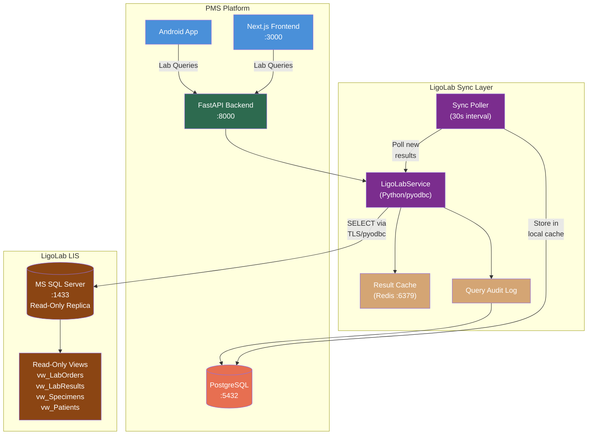

# Product Requirements Document: LigoLab MS SQL Direct Connection Integration into Patient Management System (PMS)

**Document ID:** PRD-PMS-LIGOLAB-001
**Version:** 1.0
**Date:** 2026-03-10
**Author:** Ammar (CEO, MPS Inc.)
**Status:** Draft

---

## 1. Executive Summary

LigoLab is an enterprise Laboratory Information System (LIS) and Revenue Cycle Management (RCM) platform founded in 2006, serving over 100 laboratory facilities nationwide. Built on an Enterprise Java stack with a **Microsoft SQL Server** backend database, it unifies anatomic pathology (AP), clinical pathology (CP), molecular diagnostics (MDx), microbiology, specimen tracking, and billing on a single shared database. LigoLab provides **read-only database access upon request**, enabling external systems to query lab data directly via SQL Server connections.

This integration establishes a **read-only MS SQL Server direct connection** from the PMS FastAPI backend to the LigoLab database, allowing the clinical team to query lab orders, results, specimen status, pathology reports, and billing data in near-real-time without relying on HL7 messaging or manual portal lookups. For the TRA ophthalmology practice, this means immediate access to HbA1c results for diabetic retinopathy monitoring, ESR/CRP for uveitis workups, genetic panel results for inherited retinal diseases, and pre-surgical lab clearance — all displayed directly in the PMS patient record.

The direct database approach complements (rather than replaces) traditional HL7 v2 interfaces. While HL7 is ideal for real-time event-driven messaging (order placement, result delivery), a direct SQL connection excels at **historical queries, reporting, gap-filling, and bulk data access** — retrieving a patient's complete lab history, running aggregate turnaround-time reports, or backfilling results that may have been missed by the HL7 interface. The connection uses a dedicated read-only SQL Server login with SELECT-only permissions on specific views, TLS 1.2+ encryption, and full HIPAA audit logging.

## 2. Problem Statement

The PMS currently has no way to access lab data from LigoLab. This creates multiple operational gaps:

1. **No historical lab data** — When a patient presents, clinicians cannot see their prior lab results within the PMS. Staff must log into LigoLab's Web Connect portal, look up the patient, and manually review results, adding 3-5 minutes per encounter.
2. **No trending capability** — Tracking a diabetic retinopathy patient's HbA1c over 12 months requires manually collecting results from multiple portal sessions. There is no automated way to chart lab values over time within the PMS.
3. **Missing results** — If an HL7 interface message is missed or garbled, the result never appears in the PMS. There is no reconciliation mechanism to detect and fill gaps.
4. **No lab reporting** — The PMS cannot generate reports on lab turnaround times, order volumes, critical result rates, or outstanding orders because it has no access to the underlying lab data.
5. **Specimen tracking blind spot** — Once a specimen leaves the clinic, there is no way to check its processing status in LigoLab without switching to the portal.
6. **Billing reconciliation gap** — Lab CPT codes and billing status in LigoLab cannot be cross-referenced with PMS encounter records for revenue cycle reconciliation.

## 3. Proposed Solution

### 3.1 Architecture Overview

### 3.2 Deployment Model

| Aspect | Decision |
|--------|----------|
| **Connection Type** | Read-only SQL Server connection via pyodbc + Microsoft ODBC Driver 18 |
| **Authentication** | Dedicated SQL Server login with SELECT-only permissions on specific views |
| **Encryption** | TLS 1.2+ enforced on SQL Server connection (`Encrypt=yes;TrustServerCertificate=no`) |
| **Network** | Site-to-site VPN or firewall-restricted TCP 1433 between PMS and LigoLab SQL Server |
| **Read Replica** | Prefer SQL Server Always On readable secondary (`ApplicationIntent=ReadOnly`) to isolate from production writes |
| **Sync Model** | Timestamp-based polling (30-second interval) for new/updated results; on-demand queries for patient lookups |
| **Local Cache** | New results synced to PostgreSQL `ligolab_*` tables for fast PMS queries; Redis for hot cache (5-min TTL) |
| **PHI Handling** | All data queried contains PHI; encrypted in transit (TLS) and at rest (AES-256 in PostgreSQL) |
| **BAA** | Business Associate Agreement required with LigoLab before database access is granted |
| **Docker** | Microsoft ODBC Driver 18 installed in FastAPI Docker container via apt |

## 4. PMS Data Sources

| PMS API | Integration Purpose |
|---------|-------------------|
| **Patient Records API** (`/api/patients`) | Match patients between PMS and LigoLab by MRN; display lab results within patient records |
| **Encounter Records API** (`/api/encounters`) | Link lab results to encounters for clinical context; show labs ordered during a specific visit |
| **Medication & Prescription API** (`/api/prescriptions`) | Cross-reference medications requiring lab monitoring (e.g., methotrexate → CBC, metformin → HbA1c) |
| **Reporting API** (`/api/reports`) | Aggregate lab turnaround times, order volumes, critical result rates, and outstanding orders |

## 5. Component/Module Definitions

### 5.1 LigoLab SQL Connection Manager

- **Description:** Manages the pyodbc connection pool to LigoLab's MS SQL Server. Handles connection lifecycle, automatic reconnection, and connection health monitoring. Uses `ApplicationIntent=ReadOnly` for Always On replica routing.
- **Input:** SQL Server host, port, database name, credentials (from Docker secrets)
- **Output:** Pooled database connections for query execution
- **PMS APIs:** None (infrastructure component)

### 5.2 Lab Result Query Service

- **Description:** Executes parameterized SQL queries against LigoLab views to retrieve lab results by patient MRN, date range, test code, or accession number. Returns structured result data with values, units, reference ranges, and abnormal flags.
- **Input:** Patient MRN, date range, test filters
- **Output:** Structured lab results (`LabResult` Pydantic models)
- **PMS APIs:** Patient Records API (MRN lookup), Encounter Records API (encounter linkage)

### 5.3 Result Sync Poller

- **Description:** Background task running on a 30-second interval that queries LigoLab for results modified since the last sync timestamp. New or updated results are stored in PostgreSQL `ligolab_results` / `ligolab_result_values` tables and trigger notifications for critical values.
- **Input:** Last sync timestamp (stored in Redis)
- **Output:** New results stored in PostgreSQL; critical result alerts dispatched
- **PMS APIs:** Patient Records API (patient matching), Encounter Records API (encounter linkage)

### 5.4 Specimen Tracking Service

- **Description:** Queries LigoLab specimen tables to show real-time specimen processing status (received, in-process, resulted, reported) within the PMS.
- **Input:** Patient MRN or accession number
- **Output:** Specimen status timeline with timestamps
- **PMS APIs:** Encounter Records API (link specimen to encounter)

### 5.5 Lab History & Trending Service

- **Description:** Retrieves a patient's complete lab history for a given test (e.g., all HbA1c values over 2 years) and formats it for time-series charting in the frontend.
- **Input:** Patient MRN, LOINC code, date range
- **Output:** Time-series data array `[{date, value, abnormalFlag}]`
- **PMS APIs:** Patient Records API (patient context)

### 5.6 Lab Reporting Engine

- **Description:** Runs aggregate queries against LigoLab data for operational reporting: turnaround times, order volumes by test/provider/month, critical result rates, and outstanding orders.
- **Input:** Report type, date range, filters
- **Output:** Aggregate report data for dashboard display
- **PMS APIs:** Reporting API (`/api/reports`)

### 5.7 Query Audit Logger

- **Description:** Logs every SQL query executed against LigoLab with timestamp, user ID, query hash (not full SQL — to avoid logging PHI filter values), row count returned, and execution time. Stored in `ligolab_query_audit_log`.
- **Input:** All SQL queries executed via LigoLabService
- **Output:** Immutable audit trail entries
- **PMS APIs:** All (cross-cutting concern)

## 6. Non-Functional Requirements

### 6.1 Security and HIPAA Compliance

| Requirement | Implementation |
|-------------|---------------|
| **Data in Transit** | TLS 1.2+ enforced on MS SQL connection (`Encrypt=yes`) |
| **Data at Rest** | LigoLab: SQL Server TDE; PMS: AES-256 on cached results in PostgreSQL |
| **Credential Storage** | SQL Server username/password in Docker secrets; never in code, env files, or logs |
| **Minimum Necessary** | Read-only login with SELECT on specific views only — no access to full tables, no write permissions |
| **Audit Logging** | Every query logged with user, timestamp, query type, row count, and execution time |
| **Access Control** | Lab results: `physician`, `nurse`, `lab_tech` roles; reporting: `admin`, `manager` roles |
| **BAA** | Signed Business Associate Agreement with LigoLab required |
| **Network Isolation** | VPN or firewall-restricted access; SQL Server port 1433 not exposed publicly |
| **PHI in Queries** | Patient MRN used as filter parameter — never logged in plaintext; parameterized queries prevent SQL injection |
| **Data Retention** | Cached results in PostgreSQL retained for 7 years; audit logs retained for 7 years |

### 6.2 Performance

| Metric | Target |
|--------|--------|
| Patient result lookup (cached) | < 200ms |
| Patient result lookup (live query) | < 2s |
| Result sync polling cycle | < 5s per cycle (30s interval) |
| Lab history trending query | < 3s for 2 years of data |
| Aggregate reporting query | < 10s for monthly summaries |
| Connection pool size | 5-10 connections (read-only) |
| Redis cache hit rate | > 80% for repeat patient lookups |

### 6.3 Infrastructure

| Component | Requirement |
|-----------|-------------|
| **ODBC Driver** | Microsoft ODBC Driver 18 for SQL Server installed in FastAPI Docker container |
| **Python Library** | `pyodbc` 5.x for SQL Server connectivity |
| **Docker** | Additional apt packages: `unixodbc-dev`, `msodbcsql18` |
| **PostgreSQL** | New tables: `ligolab_results`, `ligolab_result_values`, `ligolab_specimens`, `ligolab_query_audit_log` |
| **Redis** | Result cache with 5-minute TTL; sync checkpoint storage |
| **Network** | Outbound TCP 1433 to LigoLab SQL Server (VPN or firewall-restricted) |
| **Connection Pool** | pyodbc connection pooling with 5-10 connections |

## 7. Implementation Phases

### Phase 1: Foundation (Sprints 1-2)

- LigoLab BAA signed and read-only database access provisioned
- MS ODBC Driver 18 added to Docker container
- pyodbc connection manager with TLS, pooling, and health checks
- PostgreSQL schema for cached results and audit log
- Basic query service: lookup results by patient MRN
- Query audit logging for all database access
- Connection testing against LigoLab read replica

### Phase 2: Core Lab Queries (Sprints 3-4)

- Result Sync Poller (30-second interval for new/updated results)
- Lab Results display in Next.js patient view with abnormal highlighting
- Specimen tracking service and status timeline
- Lab history trending (time-series charts for HbA1c, CBC, etc.)
- Critical result detection and notification (WebSocket + push)
- Redis caching for hot patient lookups
- FastAPI endpoints for all lab query operations

### Phase 3: Reporting & Advanced (Sprints 5-6)

- Lab reporting engine: turnaround times, order volumes, critical result rates
- Next.js reporting dashboard with charts and drill-down
- Android lab results view with push notifications
- Billing reconciliation: cross-reference LigoLab CPT codes with PMS encounters
- Gap detection: identify patients with ordered-but-not-resulted labs
- Order set recommendations based on diagnosis (e.g., "Diabetic Retinopathy Panel")

## 8. Success Metrics

| Metric | Target | Measurement |
|--------|--------|-------------|
| Lab result availability | < 60s from LigoLab finalization to PMS display | Sync poller latency monitoring |
| Clinician portal logins eliminated | > 80% reduction in LigoLab Web Connect usage | Portal login audit vs PMS lab query volume |
| Result cache hit rate | > 80% for repeat patient lookups | Redis cache hit/miss ratio |
| Query response time (cached) | < 200ms p95 | FastAPI endpoint latency metrics |
| Historical lab coverage | 100% of patient results accessible in PMS | LigoLab result count vs PMS cached count |
| Critical result notification | < 2 min from result finalization to clinician alert | Sync poller timestamp vs notification delivery |
| Audit trail completeness | 100% of queries logged | Audit log entries vs total queries executed |
| Connection uptime | 99.5% (read-only, non-critical path) | Connection health check monitoring |

## 9. Risks and Mitigations

| Risk | Impact | Mitigation |
|------|--------|------------|
| LigoLab denies direct DB access | Integration cannot proceed | Engage LigoLab sales/support early; request read-only access as part of contract; fall back to HL7/FHIR if denied |
| Unknown database schema | Cannot write queries without schema knowledge | Request schema documentation from LigoLab; start with common LIS table patterns; build schema discovery queries |
| Schema changes break queries | Queries fail after LigoLab upgrades | Query against views (not base tables); LigoLab may provide stable view layer; pin to known view versions; add schema validation checks |
| Performance impact on LigoLab production | Read queries slow down lab operations | Use Always On read replica exclusively; limit connection pool size; avoid expensive joins; implement query timeout |
| VPN/network connectivity issues | Sync poller fails; queries timeout | Implement graceful degradation (serve from PostgreSQL cache); retry with backoff; alert on extended outages |
| PHI exposure through SQL queries | HIPAA violation | Parameterized queries only; never log query parameters; encrypt cached data; restrict to minimum necessary views |
| Stale cached data | Clinician sees outdated results | 30-second sync interval minimizes staleness; display "last synced" timestamp; allow manual refresh |

## 10. Dependencies

| Dependency | Type | Notes |
|------------|------|-------|
| LigoLab read-only DB access | External | Must be provisioned by LigoLab; requires BAA and contract amendment |
| LigoLab database schema documentation | Documentation | View definitions, column mappings, data types — obtained from LigoLab |
| Microsoft ODBC Driver 18 | System | Installed in Docker container via apt |
| `pyodbc` | Python library | `pip install pyodbc` |
| `SQLAlchemy` (optional) | Python library | For ORM-style queries if preferred over raw SQL |
| VPN or firewall rules | Infrastructure | TCP 1433 access to LigoLab SQL Server |
| Redis | Infrastructure | Already deployed; used for result caching and sync checkpoints |
| PostgreSQL | Infrastructure | Already deployed; new tables for cached results and audit log |
| SQL Server read replica (recommended) | Infrastructure | LigoLab provisions Always On readable secondary |

## 11. Comparison with Existing Experiments

### vs. HL7 v2 Interface (Traditional LIS Integration)

A direct SQL connection is **complementary** to HL7 v2 messaging, not a replacement. Each serves different use cases:

| Aspect | HL7 v2 Interface | MS SQL Direct Connection (Exp 70) |
|--------|-----------------|----------------------------------|
| **Direction** | Bidirectional (orders out, results in) | Read-only (query results from LigoLab) |
| **Best For** | Real-time order placement, event-driven result delivery | Historical queries, reporting, bulk data, gap-filling |
| **Latency** | Near-real-time (push-based) | 30-second polling interval (configurable) |
| **Ordering** | Can send ORM orders to LigoLab | Cannot place orders (read-only) |
| **Data Scope** | Individual messages (one order, one result) | Full database access (all history, all patients) |
| **Schema Knowledge** | Standardized HL7 segments (PID, OBR, OBX) | Requires LigoLab-specific schema documentation |
| **Setup Complexity** | MLLP server, message parsing, ACK handling | ODBC driver, SQL queries, connection pooling |

**Recommended combined approach:** Use HL7 v2 for real-time order placement and result delivery. Use MS SQL for historical lab lookups, trending, reporting, and reconciliation.

### vs. Experiment 49: NextGen FHIR API

NextGen FHIR imports clinical data from external referring providers. LigoLab SQL queries the clinic's own lab data. Entirely complementary — NextGen brings in outside records, LigoLab provides in-house lab results.

### vs. Experiment 68: Microsoft Teams

Teams provides the notification channel for critical lab results detected by the sync poller. When the poller finds a result with abnormal flags (HH, LL), it can dispatch a Teams Adaptive Card to the ordering provider.

## 12. Research Sources

### Official Documentation
- [LigoLab Solutions Overview](https://www.ligolab.com/solutions) — Platform modules, database architecture, deployment options
- [LigoLab Interoperability](https://www.ligolab.com/post/ligolab-delivers-the-interoperability-needed-to-transform-medical-laboratories-into-thriving-businesses) — Interface Engine capabilities, confirms read-only DB access availability
- [LigoLab API Services](https://www.ligolab.com/post/lis-system-and-lims-lab-management-platforms-are-there-reliable-api-services-for-lab-testing-data-management) — REST/FHIR/SQL access discussion

### MS SQL Server Connectivity
- [Microsoft ODBC Driver 18 for SQL Server](https://learn.microsoft.com/en-us/sql/connect/odbc/microsoft-odbc-driver-for-sql-server) — Official ODBC driver for Linux/Docker
- [pyodbc Documentation](https://github.com/mkleehammer/pyodbc/wiki) — Python MS SQL connectivity library
- [mssql-python (Microsoft)](https://github.com/microsoft/mssql-python) — New Microsoft Python driver (GA Nov 2025)

### Security & Compliance
- [LigoLab Enhanced Cybersecurity](https://www.ligolab.com/post/ligolabs-enhanced-cybersecurity-solutions-give-customers-added-protection-and-peace-of-mind) — MFA, encryption, audit logging
- [SQL Server TDE](https://learn.microsoft.com/en-us/sql/relational-databases/security/encryption/transparent-data-encryption) — Transparent Data Encryption for data at rest
- [SQL Server Always On Readable Secondaries](https://learn.microsoft.com/en-us/sql/database-engine/availability-groups/windows/active-secondaries-readable-secondary-replicas) — Read-only replica for external queries

### LIS Schema Patterns
- [Best LIS Systems 2026 Comparison](https://www.ligolab.com/industry-insights/best-lis-systems-in-2026-top-laboratory-information-systems-compared-for-clinical-pathology-and-outreach-labs) — LIS architecture and data model context

## 13. Appendix: Related Documents

- [LigoLab Setup Guide](70-LigoLab-PMS-Developer-Setup-Guide.md) — Developer environment setup for MS SQL connection
- [LigoLab Developer Tutorial](70-LigoLab-Developer-Tutorial.md) — Hands-on: build a lab result query and trending workflow end-to-end
- [NextGen FHIR API PRD (Experiment 49)](49-PRD-NextGenFHIRAPI-PMS-Integration.md) — External provider data import (complementary)
- [Microsoft Teams PRD (Experiment 68)](68-PRD-MSTeams-PMS-Integration.md) — Notification channel for critical results
- [Kafka PRD (Experiment 38)](38-PRD-Kafka-PMS-Integration.md) — Event streaming backbone for lab result events
