# Product Requirements Document: RingCentral API Integration into Patient Management System (PMS)

**Document ID:** PRD-PMS-RINGCENTRALAPI-001
**Version:** 1.0
**Date:** 2026-03-10
**Author:** Ammar (CEO, MPS Inc.)
**Status:** Draft

---

## 1. Executive Summary

RingCentral is a cloud communications platform providing voice calling, SMS/MMS, fax, video conferencing, and team messaging through a unified REST API. The platform serves over 400,000 businesses worldwide and offers HIPAA-compliant plans with Business Associate Agreement (BAA) support, HL7 standards compliance, and seven layers of built-in security including encryption in transit and at rest. RingCentral's developer ecosystem includes SDKs for Python, JavaScript, Java, C#, and PHP, plus OAuth 2.0 authentication, webhook subscriptions for real-time event notifications, and OpenAPI-compliant endpoint documentation.

Integrating the RingCentral API into the PMS enables automated patient communication workflows directly from clinical encounters — appointment reminders via SMS, prescription refill notifications, automated voice call routing with caller ID patient lookup, fax-based referral letter transmission, call recording for clinical documentation, and telehealth video visits. Staff currently manage these communications through disconnected systems: personal phones for patient calls, a standalone fax machine, manual text messages, and third-party video conferencing. This integration unifies all patient communication channels into the PMS, with every interaction logged, auditable, and linked to the patient record.

For an ophthalmology practice, RingCentral is particularly valuable because the specialty relies heavily on phone-based appointment scheduling (complex multi-visit injection series), fax-based referral workflows (referring optometrists send via fax), SMS-based medication adherence reminders (anti-VEGF injection schedules), and increasingly, telehealth video visits for post-operative follow-ups. RingCentral's HIPAA-compliant platform and BAA support make it the unified communications backbone needed to modernize these workflows while maintaining regulatory compliance.

## 2. Problem Statement

PMS clinical and administrative staff face several communication bottlenecks:

1. **Fragmented communication channels**: Patient calls come through a standard phone system with no integration to the PMS. Staff cannot see caller ID mapped to patient records, must manually log call notes, and have no way to route calls based on clinical context (e.g., urgent post-op calls vs. routine scheduling).

2. **Manual appointment reminders**: Staff spend 2-3 hours daily calling patients to confirm upcoming appointments. No-show rates average 15-20% for injection series appointments, costing the practice $200-400 per missed anti-VEGF injection slot.

3. **Fax-dependent referral workflow**: Referring optometrists send patient records via fax. Incoming faxes are printed, manually matched to patient records, and scanned back into the system — a process taking 5-10 minutes per referral with frequent misfiling.

4. **No call recording for clinical documentation**: Phone consultations with patients (e.g., post-op symptom triage) are not recorded. If a clinical decision is made over the phone, there is no auditable record — a malpractice risk and documentation gap.

5. **Disconnected telehealth**: Video visits use a separate platform (Zoom/Teams) with no integration to the PMS. Providers must manually copy visit notes from the video call into the patient encounter record.

6. **No medication adherence tracking**: Patients on monthly anti-VEGF injection series frequently miss appointments. There is no automated SMS reminder system tied to the prescription schedule, and no way to confirm patient intent to attend.

7. **After-hours communication gap**: Urgent patient calls after hours reach voicemail with no prioritization. A patient reporting vision changes post-injection receives the same response as a billing inquiry — no clinical triage capability.

## 3. Proposed Solution

### 3.1 Architecture Overview

```mermaid
flowchart TB
    subgraph PMS["PMS Application Stack"]
        FE["Next.js Frontend\n:3000"]
        BE["FastAPI Backend\n:8000"]
        DB[(PostgreSQL\n:5432)]
        REDIS["Redis Cache\n:6379"]
        ANDROID["Android App\nKotlin/Compose"]
    end

    subgraph RC["RingCentral Platform"]
        AUTH["OAuth 2.0\nJWT Auth"]
        VOICE["Voice API\nCall Control"]
        SMS["SMS/MMS API\nA2P Messaging"]
        FAX["Fax API\nProgrammatic Fax"]
        VIDEO["Video API\nBrowser-Based Meetings"]
        DATA["Data API\nCall Logs/Recordings"]
        WEBHOOK["Webhook Subscriptions\nReal-Time Events"]
        AI["Audio & Video AI\nTranscription/Sentiment"]
    end

    subgraph COMMS["PMS Communications Module"]
        SVC["CommsService\nFastAPI Router"]
        CLIENT["RingCentralClient\nPython SDK"]
        WHRECV["WebhookReceiver\nEvent Processor"]
        REMIND["ReminderScheduler\nAPScheduler"]
        CALLERID["CallerIDResolver\nPatient Lookup"]
    end

    FE -->|"POST /api/comms/*"| SVC
    ANDROID -->|"POST /api/comms/*"| SVC
    SVC --> CLIENT
    CLIENT -->|"OAuth 2.0"| AUTH
    CLIENT -->|"REST"| VOICE
    CLIENT -->|"REST"| SMS
    CLIENT -->|"REST"| FAX
    CLIENT -->|"REST"| VIDEO
    CLIENT -->|"REST"| DATA
    WEBHOOK -->|"HTTPS POST"| WHRECV
    WHRECV -->|"Inbound Events"| DB
    WHRECV -->|"Caller ID"| CALLERID
    CALLERID -->|"Patient Lookup"| DB
    REMIND -->|"Scheduled SMS"| CLIENT
    SVC --> DB
    CLIENT --> REDIS
    BE --> SVC
    AI -->|"Transcription"| DATA

    style FE fill:#4A90D9,color:#fff
    style BE fill:#4A90D9,color:#fff
    style DB fill:#2E7D32,color:#fff
    style REDIS fill:#D32F2F,color:#fff
    style ANDROID fill:#7B1FA2,color:#fff
    style AUTH fill:#FF6F00,color:#fff
    style VOICE fill:#FF6F00,color:#fff
    style SMS fill:#FF6F00,color:#fff
    style FAX fill:#FF6F00,color:#fff
    style VIDEO fill:#FF6F00,color:#fff
    style DATA fill:#FF6F00,color:#fff
    style WEBHOOK fill:#FF6F00,color:#fff
    style AI fill:#FF6F00,color:#fff
    style SVC fill:#00838F,color:#fff
    style CLIENT fill:#00838F,color:#fff
    style WHRECV fill:#00838F,color:#fff
    style REMIND fill:#00838F,color:#fff
    style CALLERID fill:#00838F,color:#fff
```

### 3.2 Deployment Model

- **Cloud-hosted SaaS**: RingCentral is a fully managed platform — no self-hosting. API calls go to `https://platform.ringcentral.com/restapi/v1.0/*` (production) or `https://platform.devtest.ringcentral.com/restapi/v1.0/*` (sandbox).
- **HIPAA-Compliant Plan Required**: RingCentral offers HIPAA-compliant plans with BAA support. The practice must subscribe to a RingEX plan ($20-35/user/month) with HIPAA add-on enabled and a signed BAA.
- **OAuth 2.0 Authentication**: JWT-based auth for server-to-server (backend), Authorization Code flow for user-interactive sessions (frontend/mobile).
- **Webhook Delivery**: RingCentral pushes events (inbound calls, SMS, voicemail) via HTTPS POST to the PMS backend. Requires a publicly accessible endpoint (ngrok for development, production domain for deployment).
- **Docker Integration**: The `RingCentralClient` runs within the existing PMS FastAPI container. Webhook receiver requires port exposure through the Docker network and reverse proxy (Nginx).
- **HIPAA Considerations**: All voice calls, SMS, fax, and video sessions are encrypted in transit (TLS) and at rest. Call recordings stored in RingCentral cloud are encrypted and access-controlled. PHI de-identification required for any data exposed to non-BAA-covered systems. Seven layers of security include network, platform, application, data, user, admin, and compliance layers.

## 4. PMS Data Sources

- **Patient Records API (`/api/patients`)**: Maps phone numbers to patient records for caller ID resolution. Provides patient addresses for fax delivery, phone numbers for SMS reminders, and email for video visit invitations.
- **Encounter Records API (`/api/encounters`)**: Links call recordings and video visit sessions to specific patient encounters. Triggers post-encounter follow-up SMS (e.g., post-op care instructions). Stores call notes as encounter timeline entries.
- **Medication & Prescription API (`/api/prescriptions`)**: Drives medication adherence SMS reminders based on injection schedules. Triggers refill notification calls when prescriptions near expiry. Provides medication context for clinical triage calls.
- **Reporting API (`/api/reports`)**: Aggregates communication metrics — call volume, SMS delivery rates, no-show reduction, average hold times. Links communication costs to patient encounters and departments.

## 5. Component/Module Definitions

### 5.1 RingCentralClient

**Description**: Python SDK wrapper providing typed async methods for all RingCentral API operations with OAuth token management.

- **Input**: PMS communication requests (patient ID, message content, call destination, fax document)
- **Output**: Message delivery confirmations, call session IDs, fax transmission receipts, video meeting URLs
- **Key Methods**: `send_sms()`, `initiate_call()`, `send_fax()`, `create_video_meeting()`, `get_call_log()`, `get_recording()`, `subscribe_webhook()`

### 5.2 WebhookReceiver

**Description**: FastAPI endpoint handling inbound RingCentral webhook events for real-time call and message processing.

- **Input**: HTTPS POST from RingCentral with event payloads (inbound call, SMS received, voicemail, fax received)
- **Output**: Event processing → patient lookup, call routing decisions, fax-to-patient matching, encounter timeline updates
- **PMS APIs Used**: Patient Records API (caller ID resolution), Encounter Records API (timeline updates)

### 5.3 CallerIDResolver

**Description**: Service that matches incoming phone numbers to patient records for screen-pop caller identification.

- **Input**: Inbound phone number from RingCentral call event
- **Output**: Patient record (name, MRN, upcoming appointments, recent encounters, active medications)
- **PMS APIs Used**: Patient Records API (`/api/patients?phone={number}`)

### 5.4 ReminderScheduler

**Description**: Background task (APScheduler) that sends automated SMS appointment reminders based on upcoming appointment schedules.

- **Input**: Upcoming appointments from PMS scheduling data
- **Output**: SMS reminders sent at configured intervals (48hr, 24hr, 2hr before appointment)
- **Scheduling**: Runs daily at 7:00 AM to queue that day's reminders; 2-hour reminders triggered by interval scheduler
- **PMS APIs Used**: Patient Records API, Encounter Records API

### 5.5 FaxIngestService

**Description**: Processes inbound faxes received via RingCentral, extracts metadata, and routes to appropriate patient records.

- **Input**: Fax received webhook event with PDF attachment
- **Output**: Fax document stored in PostgreSQL, matched to patient record (via OCR/manual matching), flagged for staff review
- **PMS APIs Used**: Patient Records API (patient matching), Encounter Records API (referral attachment)

### 5.6 CommsService (FastAPI Router)

**Description**: REST API router exposing unified communication operations to the PMS frontend and Android app.

- **Endpoints**:
  - `POST /api/comms/sms` — Send SMS to patient
  - `POST /api/comms/sms/bulk` — Bulk SMS for appointment reminders
  - `POST /api/comms/call` — Initiate outbound call (RingOut)
  - `POST /api/comms/fax` — Send fax to referral source
  - `POST /api/comms/video/meeting` — Create video visit link
  - `GET /api/comms/calls/log` — Call history with recordings
  - `GET /api/comms/calls/{id}/recording` — Download call recording
  - `GET /api/comms/fax/inbox` — Inbound fax queue
  - `GET /api/comms/sms/history/{patient_id}` — SMS conversation history
  - `POST /api/comms/webhooks/ringcentral` — Webhook receiver endpoint
- **PMS APIs Used**: All four PMS APIs

### 5.7 Communications Dashboard (Next.js)

**Description**: Unified communications panel in the PMS frontend showing call log, SMS conversations, fax inbox, and video visit scheduling.

- **Features**: Caller ID patient screen-pop, click-to-call from patient records, SMS compose with template selection, fax inbox with patient matching, video visit link generation
- **PMS APIs Used**: Patient Records (display), Encounter Records (link)

### 5.8 TranscriptionService

**Description**: Processes call recordings through RingCentral's Audio AI Speech-to-Text API, producing speaker-diarized transcripts with timestamps that are linked to patient encounters.

- **Input**: Call recording ID (from `comms_call_log`), patient ID, encounter ID
- **Output**: Structured transcript with speaker labels ("Provider" / "Patient"), word-level timestamps, confidence scores, stored in `comms_transcriptions` table
- **Key Methods**: `transcribe_recording()`, `get_transcript()`, `generate_encounter_note()`
- **API**: `POST /ai/audio/v1/async/speech-to-text` (async with webhook callback)
- **PMS APIs Used**: Encounter Records API (attach transcript as encounter note)

### 5.9 CallAnalyticsService

**Description**: Aggregates communication statistics from RingCentral's Business Analytics API and local PMS data to produce operational dashboards and trend reports.

- **Input**: Date range, grouping parameters (by user, department, day/week/month)
- **Output**: Aggregated metrics — call volume, average duration, SMS delivery rates, no-show correlation, recording transcription coverage
- **Key Methods**: `get_call_volume_stats()`, `get_sms_delivery_stats()`, `get_no_show_correlation()`, `get_recording_coverage()`
- **APIs**: `POST /analytics/calls/v1/accounts/~/aggregation/fetch`, `POST /analytics/calls/v1/accounts/~/timeline/fetch`, local PostgreSQL aggregation
- **PMS APIs Used**: Reporting API (write analytics), Encounter Records API (no-show correlation)

### 5.10 Android Communications Module

**Description**: Patient-facing communication features in the PMS Android app — appointment reminder display, SMS opt-in/out, video visit join button.

- **Features**: Push notification for appointment reminders, one-tap video visit join, SMS conversation view
- **PMS APIs Used**: Patient Records, Encounter Records

## 6. Non-Functional Requirements

### 6.1 Security and HIPAA Compliance

| Requirement | Implementation |
|---|---|
| BAA Execution | Signed Business Associate Agreement with RingCentral required before go-live |
| Encryption in Transit | TLS 1.2+ enforced on all API calls and webhook deliveries |
| Encryption at Rest | Call recordings and fax documents encrypted by RingCentral; local copies in PMS use AES-256-GCM |
| PHI in SMS | SMS messages containing PHI limited to appointment dates/times — no diagnoses, medications, or lab results in SMS |
| Call Recording Consent | Two-party consent notification played at call start (state-dependent); consent flag stored in `comms_call_log` |
| Audit Logging | Every API call logged with timestamp, user, action, patient ID, and de-identified payload |
| Access Control | RBAC: clinical staff can access call recordings; front desk can send SMS/initiate calls; admin manages configuration |
| Data Retention | Call recordings retained 7 years (HIPAA); SMS logs retained 7 years; fax documents retained per records policy |
| Webhook Security | Webhook payloads validated via RingCentral verification token; HTTPS-only endpoint |
| Video Visit Security | End-to-end encryption on video sessions; waiting room enabled; host controls for recording |

### 6.2 Performance

| Metric | Target |
|---|---|
| SMS delivery latency | < 5 seconds from send to carrier delivery |
| Caller ID resolution | < 500ms patient lookup from phone number |
| Webhook event processing | < 1 second from receipt to database write |
| Call recording retrieval | < 3 seconds for playback initiation |
| Transcription processing | < 2 minutes for a 10-minute call |
| Analytics aggregation query | < 5 seconds for 30-day rollup |
| Sentiment analysis processing | < 3 minutes per call recording |
| Fax transmission | < 2 minutes for standard 5-page document |
| Video meeting creation | < 2 seconds to generate join URL |
| Reminder scheduler throughput | 500 SMS/hour (within rate limits) |
| Dashboard load time | < 1.5 seconds for call log with 100 entries |

### 6.3 Infrastructure

| Component | Requirement |
|---|---|
| RingCentral Plan | RingEX Advanced ($25/user/month) with HIPAA add-on |
| Users/Extensions | 2 sandbox extensions ($10/month dev); production extensions per staff count |
| SMS Quota | 200 SMS/extension/month included; bulk SMS requires High Volume SMS add-on |
| API Rate Limits | Varies by endpoint — typically 10-60 requests/minute per endpoint category |
| Webhook Endpoint | Publicly accessible HTTPS URL (ngrok for dev, production domain for prod) |
| PMS Backend | Existing FastAPI container — no new services |
| Redis | Cache OAuth tokens (1-hour TTL), patient phone lookups (5-minute TTL) |
| PostgreSQL | New tables: `comms_call_log`, `comms_sms_log`, `comms_fax_inbox`, `comms_recordings`, `comms_transcriptions`, `comms_call_analytics`, `comms_audit_log` |

## 7. Implementation Phases

### Phase 1: Foundation (Sprints 1-2)

- RingCentral account setup with HIPAA add-on and BAA execution
- OAuth 2.0 JWT authentication with token caching in Redis
- `RingCentralClient` Python SDK wrapper with typed methods
- `CommsService` FastAPI router: SMS send, call initiation (RingOut), call log retrieval
- Webhook receiver endpoint with event validation and routing
- `CallerIDResolver` for inbound call patient matching
- HIPAA audit logging for all communication actions
- PostgreSQL schema for communication tables
- Sandbox testing with watermarked calls and messages

### Phase 2: Core Integration (Sprints 3-4)

- `ReminderScheduler` for automated appointment SMS reminders (48hr, 24hr, 2hr)
- Fax API integration: send referral letters, receive and queue inbound faxes
- `FaxIngestService` for inbound fax processing and patient matching
- Call recording retrieval and playback linked to patient encounters
- Communications Dashboard (Next.js): call log, SMS compose, fax inbox
- Click-to-call from patient record detail pages
- SMS conversation history per patient
- Patient opt-in/opt-out management for SMS reminders

### Phase 3: Voice Recording Evaluation, Auto-Transcription & Analytics (Sprints 5-6)

- **TranscriptionService** with RingCentral Audio AI Speech-to-Text (`POST /ai/audio/v1/async/speech-to-text`):
  - Async transcription with webhook callback for completed recordings
  - Speaker diarization (provider vs. patient) with `audioType: "CallCenter"`
  - Word-level timestamps and per-utterance confidence scores
  - Punctuation and voice activity detection enabled
  - Transcript stored in `comms_transcriptions` table linked to call log and encounter
  - Auto-generated encounter notes from transcripts using extractive summarization
- **Interaction Analytics** via `POST /ai/insights/v1/async/analyze-interaction`:
  - Sentiment analysis (positive/negative/neutral) per speaker per call
  - Emotion detection for patient satisfaction monitoring
  - Results stored in `comms_call_analytics` table
- **CallAnalyticsService** with RingCentral Business Analytics API:
  - `POST /analytics/calls/v1/accounts/~/aggregation/fetch` — aggregate call volume, duration, and result metrics
  - `POST /analytics/calls/v1/accounts/~/timeline/fetch` — time-series trends (hourly/daily/weekly/monthly)
  - SMS delivery analytics via Message Store API export
  - No-show correlation: cross-reference SMS reminder delivery with appointment attendance
  - Recording transcription coverage rate tracking
- **Analytics Dashboard** (Next.js):
  - Call volume trends by day/week/month with chart visualization
  - SMS delivery success/failure rates
  - Average call duration by department/provider
  - No-show rate trend correlated with reminder SMS delivery
  - Transcription coverage percentage
  - Patient sentiment trends from interaction analytics
- **Recording Evaluation Workflow**:
  - Quality scoring: transcription confidence as proxy for call audio quality
  - Recording completeness audit: flag calls without recordings
  - Storage analytics: recording size, retention status, archive eligibility
- Video API integration for telehealth visits with waiting room and recording
- Android app: appointment reminder push notifications, video visit join, SMS view
- After-hours IVR configuration with clinical triage routing
- Bulk SMS campaigns for injection series recall (patients overdue for treatment)
- Integration with Microsoft Teams (Experiment 68) for internal clinical escalation

## 8. Success Metrics

| Metric | Target | Measurement Method |
|---|---|---|
| No-show rate reduction | < 10% (from 15-20% baseline) | PMS appointment attendance tracking |
| Appointment reminder delivery rate | > 98% SMS delivery | RingCentral delivery receipts |
| Manual reminder calls eliminated | > 90% reduction | Staff time survey (before/after) |
| Caller ID resolution rate | > 85% of inbound calls matched to patients | CallerIDResolver match rate |
| Fax processing time | < 2 min from receipt to patient queue (from 5-10 min manual) | FaxIngestService timestamps |
| Call recording coverage | 100% of clinical phone consultations recorded | comms_call_log recording_url not null |
| Transcription coverage | > 95% of recordings auto-transcribed | comms_transcriptions count / comms_call_log with recordings |
| Transcription accuracy | > 85% average confidence score | comms_transcriptions avg(confidence_score) |
| Encounter note auto-generation | > 80% of transcribed calls produce draft notes | encounter notes linked to transcription_id |
| SMS response rate (confirmations) | > 60% of patients reply to reminders | SMS conversation analysis |
| Average hold time | < 45 seconds | RingCentral call queue analytics |
| Analytics dashboard adoption | > 90% of managers use weekly | Dashboard access logs |
| Patient sentiment positive rate | > 75% of calls scored positive/neutral | comms_call_analytics sentiment data |

## 9. Risks and Mitigations

| Risk | Impact | Mitigation |
|---|---|---|
| SMS rate limits (200/ext/month) | Cannot send reminders to all patients | High Volume SMS add-on for bulk messaging; prioritize injection series patients |
| Webhook delivery failures | Missed inbound call/fax events | RingCentral retries failed webhooks; dead letter queue in PostgreSQL; daily reconciliation job |
| Two-party consent compliance | Legal liability for call recording in two-party consent states | State-based consent logic: auto-play recording disclaimer; patient consent flag in comms_call_log |
| RingCentral outage | No phone/SMS/fax capability | Graceful degradation: queue outbound messages in PostgreSQL; retry on recovery; display outage banner in PMS UI |
| PHI in SMS | HIPAA violation if clinical details sent via SMS | Message templates enforce PHI-free content; no diagnoses, lab results, or medication names in SMS — only dates/times and generic instructions |
| OAuth token expiry | API calls fail mid-workflow | Token refresh logic with 5-minute pre-expiry renewal; Redis TTL tracking |
| API rate limiting | Bulk SMS or call log queries throttled | Exponential backoff with jitter; queue-based rate limiter for bulk operations |
| Call recording storage costs | Growing storage requirements | 90-day hot storage in RingCentral; archive to PMS PostgreSQL (encrypted BYTEA) for 7-year retention |
| Patient opt-out non-compliance | TCPA violation for SMS to opted-out patients | Opt-out tracking in `patient_comms_preferences` table; hard block on SMS send to opted-out numbers |

## 10. Dependencies

| Dependency | Type | Notes |
|---|---|---|
| RingCentral RingEX Plan | Service | Advanced plan ($25/user/month) with HIPAA add-on |
| RingCentral BAA | Legal | Must be executed before any PHI-related communication |
| RingCentral REST API | External API | `https://platform.ringcentral.com/restapi/v1.0/*` |
| RingCentral Python SDK | Library | `ringcentral` PyPI package |
| OAuth 2.0 (JWT flow) | Authentication | Server-to-server auth for backend operations |
| Webhook Public Endpoint | Infrastructure | HTTPS-accessible URL for event delivery |
| Redis (existing) | Infrastructure | Token caching, phone number lookup cache |
| PostgreSQL (existing) | Infrastructure | New tables for call logs, SMS, fax, recordings, audit |
| APScheduler | Python Library | Reminder scheduling and batch SMS |
| ngrok (development) | Tool | Webhook tunnel for local development |
| MS Teams Integration (Exp. 68) | Internal | Clinical escalation from phone triage to Teams channel |
| Amazon Connect (Exp. 51) | Comparison | Alternative contact center approach — see Section 11 |

## 11. Comparison with Existing Experiments

### vs. Amazon Connect Health (Experiment 51)

Amazon Connect Health is a full **contact center platform** with AI-powered agents for patient verification, appointment scheduling, and ambient clinical documentation at $99/user/month. RingCentral is a **unified communications platform** providing voice, SMS, fax, and video APIs that integrate into the PMS as communication primitives rather than a managed contact center experience.

**Key differences**:
- **Amazon Connect**: Managed IVR, AI agents, queue routing — more automation, less developer control
- **RingCentral**: API-first communication primitives — more flexibility, custom integration, lower per-user cost
- **Complementary use**: RingCentral handles day-to-day staff-to-patient communications (calls, SMS, fax); Amazon Connect could handle high-volume patient intake and after-hours AI-powered triage

### vs. Microsoft Teams (Experiment 68)

Teams handles **internal clinical collaboration** (provider-to-provider messaging, clinical alerts). RingCentral handles **external patient communication** (patient calls, SMS reminders, fax referrals). They are complementary:
- **Inbound patient call** → RingCentral (caller ID, recording, routing)
- **Clinical escalation** → Teams (Adaptive Card to on-call provider)
- **Post-encounter follow-up** → RingCentral SMS to patient

### vs. ElevenLabs (Experiment 30)

ElevenLabs provides **AI voice synthesis and speech-to-text**. RingCentral provides the **telephony infrastructure** to deliver those AI-generated voice outputs to patients. They could integrate: ElevenLabs generates a clinical readback audio → RingCentral delivers it as an automated voice call to the patient.

## 12. Research Sources

### Official Documentation
- [RingCentral Developer Portal — API Products](https://developers.ringcentral.com/api-products) — Complete list of API capabilities (Voice, SMS, Fax, Video, AI, Webhooks)
- [RingCentral API Reference](https://developers.ringcentral.com/api-reference) — Full REST endpoint documentation
- [RingCentral Authentication Guide](https://developers.ringcentral.com/guide/authentication) — OAuth 2.0 flows (JWT, Authorization Code)
- [RingCentral Voice API Guide](https://developers.ringcentral.com/guide/voice) — Call control, RingOut, WebRTC, call recording, call log
- [RingCentral Webhook Guide](https://developers.ringcentral.com/guide/notifications/webhooks/creating-webhooks) — Webhook subscription creation and event types

### Healthcare & Compliance
- [RingCentral for Healthcare](https://developers.ringcentral.com/solutions/healthcare) — HIPAA compliance, EHR integration, telehealth capabilities
- [RingCentral HIPAA Compliance](https://support.ringcentral.com/article-v2/RingCentral-HIPAA-Compliance.html?brand=RC_US&product=RingEX&language=en_US) — BAA program, encryption, security layers
- [RingCentral HIPAA-Compliant VoIP Guide](https://www.ringcentral.com/us/en/blog/hipaa-compliant-voip/) — Healthcare VoIP security requirements

### AI & Analytics
- [RingCentral Audio & Video AI APIs](https://developers.ringcentral.com/ai-api) — Speech-to-text, speaker diarization, interaction analytics
- [Speech-to-Text Developer Guide](https://developers.ringcentral.com/guide/ai/speech-to-text) — Async transcription API with webhook callbacks
- [Speaker Diarization Guide](https://developers.ringcentral.com/guide/ai/speaker-diarization) — Multi-speaker identification in call recordings
- [Interaction Analytics Guide](https://developers.ringcentral.com/guide/ai/interaction-analytics) — Sentiment and emotion detection
- [RingSense / AI Conversation Expert](https://developers.ringcentral.com/guide/ai/ringsense) — AI-generated summaries, action items, highlights
- [Business Analytics API](https://developers.ringcentral.com/guide/analytics) — Aggregate and timeline call/SMS analytics
- [Conversation Summaries Guide](https://developers.ringcentral.com/guide/ai/text-summary) — Abstractive and extractive summarization

### Pricing & Ecosystem
- [RingCentral Developer Pricing](https://developers.ringcentral.com/pricing) — Sandbox ($10/mo) and production plan pricing
- [RingCentral Plans & Pricing](https://www.ringcentral.com/office/plansandpricing.html) — RingEX Core/Advanced/Ultra tiers ($20-35/user/month)
- [RingCentral API Samples (GitHub)](https://github.com/ringcentral/ringcentral-api-docs) — Official developer documentation repository

## 13. Appendix: Related Documents

- [RingCentral API Setup Guide](71-RingCentralAPI-PMS-Developer-Setup-Guide.md) — Developer environment setup and PMS integration configuration
- [RingCentral API Developer Tutorial](71-RingCentralAPI-Developer-Tutorial.md) — Hands-on onboarding tutorial for building patient communication integrations
- [PRD: Microsoft Teams PMS Integration](68-PRD-MSTeams-PMS-Integration.md) — Complementary internal clinical collaboration
- [PRD: Amazon Connect Health PMS Integration](51-PRD-AmazonConnectHealth-PMS-Integration.md) — Alternative contact center approach
- [PRD: ElevenLabs PMS Integration](30-PRD-ElevenLabs-PMS-Integration.md) — AI voice synthesis (complementary)
- [RingCentral Developer Portal](https://developers.ringcentral.com/) — Official documentation
