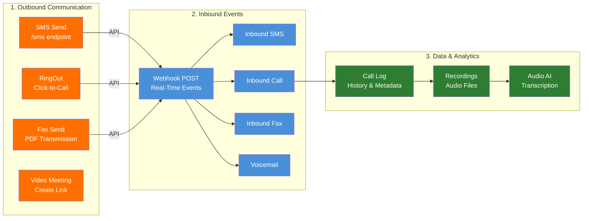
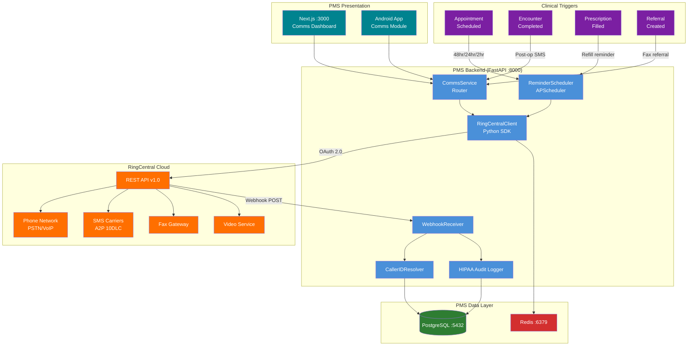

# RingCentral API Developer Onboarding Tutorial

**Welcome to the MPS PMS RingCentral API Integration Team**

This tutorial will take you from zero to building your first patient communication integration with the PMS. By the end, you will understand how RingCentral's REST API works, have a running local environment, and have built and tested a custom appointment reminder and call logging workflow end-to-end.

**Document ID:** PMS-EXP-RINGCENTRALAPI-002
**Version:** 1.0
**Date:** 2026-03-10
**Applies To:** PMS project (all platforms)
**Prerequisite:** [RingCentral API Setup Guide](71-RingCentralAPI-PMS-Developer-Setup-Guide.md)
**Estimated time:** 2-3 hours
**Difficulty:** Beginner-friendly

---

## What You Will Learn

1. What RingCentral is and why the PMS needs a unified communications integration
2. How the RingCentral REST API is structured (endpoints, OAuth 2.0, webhooks)
3. How to send SMS appointment reminders programmatically
4. How to initiate outbound calls (RingOut) from patient records
5. How to receive and process inbound call and SMS events via webhooks
6. How caller ID resolution maps phone numbers to patient records
7. How to retrieve and play call recordings linked to encounters
8. How to auto-transcribe call recordings with RingCentral Audio AI (speech-to-text, speaker diarization)
9. How to generate encounter notes from call transcripts
10. How to analyze call sentiment and emotion using Interaction Analytics
11. How to build communication statistics dashboards (call volume, SMS delivery, no-show correlation)
12. How to send and receive faxes for referral workflows
13. How RingCentral complements Teams (internal) and Amazon Connect (contact center)
14. HIPAA security requirements for healthcare telephony integrations

## Part 1: Understanding RingCentral (15 min read)

### 1.1 What Problem Does RingCentral Solve?

The PMS manages patient records, encounters, prescriptions, and reports — but communication with patients happens through disconnected channels. Staff call patients on regular phone lines, send SMS from personal devices, receive faxes on standalone machines, and conduct video visits on separate platforms. None of these interactions are linked to the patient record.

This creates real problems:
- **No-shows cost money**: An ophthalmology practice loses $200-400 per missed anti-VEGF injection appointment. Without automated SMS reminders tied to the scheduling system, staff spend hours making manual confirmation calls.
- **Lost documentation**: When a patient calls about post-op symptoms and a clinical decision is made over the phone, there's no recording. If complications arise, the practice has no auditable record of the conversation.
- **Fax chaos**: A referring optometrist sends a patient record via fax. It prints on a machine across the office, sits in a tray, and eventually someone manually matches it to a patient. 5-10 minutes per fax, with a real chance of misfiling.
- **No caller context**: When a patient calls, the receptionist answers blind — they don't know the patient's name, upcoming appointments, or medication history until they ask and look it up manually.

RingCentral solves this by providing a **unified communications API** — voice, SMS, fax, and video through one platform, one set of credentials, and one webhook stream. Every call, text, fax, and video visit is programmatically linked to the patient record in the PMS.

### 1.2 How RingCentral Works — The Key Pieces



**Concept 1: REST API with OAuth 2.0** — All operations go through `https://platform.ringcentral.com/restapi/v1.0/`. Authentication uses JWT (server-to-server) or Authorization Code (user-interactive). Every call, text, and fax is an API operation that returns structured JSON.

**Concept 2: Webhooks** — RingCentral pushes real-time events to your endpoint. Instead of polling for new calls or messages, you subscribe to event types (telephony sessions, message store changes, voicemail) and RingCentral POSTs events as they happen. This is how caller ID resolution works in real-time.

**Concept 3: Call Log & Recordings** — Every call is logged with metadata (from, to, duration, direction, result) and optionally recorded. Recordings are stored in RingCentral's cloud and accessible via API for playback or download. The call log serves as the authoritative call history.

**Concept 4: Audio AI & Transcription** — RingCentral's Audio AI provides async speech-to-text transcription (`POST /ai/audio/v1/async/speech-to-text`) that converts call recordings into speaker-diarized transcripts with word-level timestamps and confidence scores. Transcripts are delivered via webhook callback. This enables auto-generated encounter notes from phone consultations.

**Concept 5: Interaction Analytics & Sentiment** — The Interaction Analytics API (`POST /ai/insights/v1/async/analyze-interaction`) analyzes call recordings for sentiment (positive/negative/neutral) and emotion detection. Combined with the Business Analytics API (`POST /analytics/calls/v1/accounts/~/aggregation/fetch`), this provides operational dashboards: call volume trends, SMS delivery rates, recording coverage, and patient satisfaction signals.

### 1.3 How RingCentral Fits with Other PMS Technologies

| Technology | Layer | Relationship to RingCentral |
|---|---|---|
| MS Teams (Exp. 68) | Internal Messaging | Complementary — Teams for provider-to-provider; RingCentral for patient-facing calls/SMS |
| Amazon Connect (Exp. 51) | Contact Center | Alternative for high-volume IVR; RingCentral better for API-first integration |
| ElevenLabs (Exp. 30) | Voice AI (TTS/STT) | Integration — ElevenLabs generates voice content, RingCentral delivers it by phone |
| Speechmatics Flow (Exp. 33) | Conversational AI | Integration — Speechmatics provides real-time voice agents, RingCentral provides telephony transport |
| n8n (Exp. 34) | Workflow Automation | Integration — n8n triggers SMS/fax workflows based on PMS events |
| Kafka (Exp. 38) | Event Streaming | Integration — communication events published to Kafka topics for analytics |
| WebSocket (Exp. 37) | Real-Time UI | Integration — inbound call alerts pushed to dashboard via WebSocket |
| FHIR Prior Auth (Exp. 48) | PA Workflow | Upstream — PA status changes trigger SMS/fax notifications via RingCentral |

### 1.4 Key Vocabulary

| Term | Meaning |
|---|---|
| RingEX | RingCentral's business communications product line (voice, messaging, video) |
| RingOut | API to initiate a two-legged outbound call (connect caller and recipient) |
| Extension | A user or phone line in a RingCentral account — each has its own number and features |
| JWT Auth | JSON Web Token authentication flow for server-to-server API access without user interaction |
| 10DLC | "10-Digit Long Code" — US regulatory requirement for business SMS (Application-to-Person messaging) |
| A2P | "Application-to-Person" messaging — programmatic SMS from a business to a consumer |
| Webhook | HTTPS callback URL where RingCentral POSTs real-time events (calls, SMS, fax) |
| Call Log | Searchable record of all calls made/received on an account with duration, result, and recording links |
| Event Filter | A URI pattern specifying which events a webhook subscription should receive |
| Caller ID | Phone number of an incoming caller — used to match to patient records in the PMS |
| IVR | Interactive Voice Response — automated phone menu system for call routing |
| BAA | Business Associate Agreement — legal requirement for HIPAA-covered services |
| Speech-to-Text | RingCentral Audio AI API that converts call recordings into speaker-diarized transcripts with timestamps |
| Speaker Diarization | AI identification of different speakers in a recording — labels each utterance with a speaker ID |
| Interaction Analytics | AI analysis of call recordings for sentiment (positive/negative/neutral) and emotion detection |
| Business Analytics | RingCentral API for aggregated call statistics — volume, duration, direction, result by time period |
| Utterance | A single segment of speech from one speaker — includes text, start/end timestamps, and confidence score |

### 1.5 Our Architecture



## Part 2: Environment Verification (15 min)

### 2.1 Checklist

1. **PMS Backend running**:
   ```bash
   curl -s http://localhost:8000/docs | grep -c "swagger"
   # Expected: 1 or more
   ```

2. **PostgreSQL accessible**:
   ```bash
   psql -U pms_user -d pms_db -c "SELECT COUNT(*) FROM comms_call_log;"
   # Expected: 0 (empty table after migration)
   ```

3. **Redis available**:
   ```bash
   redis-cli ping
   # Expected: PONG
   ```

4. **RingCentral credentials configured**:
   ```bash
   echo $RC_CLIENT_ID | head -c 8
   # Expected: First 8 characters of your client ID
   ```

5. **RingCentral API reachable**:
   ```bash
   python -c "
   from ringcentral import SDK
   sdk = SDK('$RC_CLIENT_ID','$RC_CLIENT_SECRET','$RC_SERVER_URL')
   sdk.platform().login(jwt='$RC_JWT_TOKEN')
   print('Connected')
   "
   # Expected: Connected
   ```

6. **ngrok running** (for webhooks):
   ```bash
   curl -s http://localhost:4040/api/tunnels | python -m json.tool | grep public_url
   # Expected: Shows ngrok HTTPS URL
   ```

### 2.2 Quick Test

Send a test SMS through the full PMS stack:

```bash
curl -s -X POST http://localhost:8000/api/comms/sms \
  -H "Authorization: Bearer $PMS_TOKEN" \
  -H "Content-Type: application/json" \
  -d '{
    "patient_id": "test-patient-uuid",
    "to_number": "+1YOUR_SANDBOX_NUMBER",
    "message_text": "PMS test: this is a connectivity verification."
  }' | python -m json.tool

# Expected: {"message_id": "...", "status": "Queued"}
```

If you get a JSON response with a `message_id`, your full stack (PMS → RingCentral API → SMS) is working.

## Part 3: Build Your First Integration (45 min)

### 3.1 What We Are Building

We'll build an **Appointment Reminder Pipeline** — the highest-value communication integration:

1. Query upcoming appointments from the PMS scheduling data
2. Send SMS reminders at configurable intervals (48hr, 24hr, 2hr)
3. Process patient reply confirmations ("YES") via inbound SMS webhook
4. Log all communication to the patient record with HIPAA audit trail
5. Display reminder status in the Communications Dashboard

### 3.2 Step 1: Create SMS Reminder Templates

```python
# app/services/sms_templates.py

"""
SMS templates for patient communications.
HIPAA Rule: No PHI (diagnoses, medications, lab results) in SMS content.
Use appointment dates/times and generic instructions only.
"""

TEMPLATES = {
    "appt_reminder_48h": {
        "id": "appt_reminder_48h",
        "text": (
            "Texas Retina Associates: You have an appointment on {date} at {time}. "
            "Reply YES to confirm or CHANGE to reschedule. Reply STOP to opt out."
        ),
        "requires": ["date", "time"],
    },
    "appt_reminder_24h": {
        "id": "appt_reminder_24h",
        "text": (
            "Reminder: Your appointment tomorrow {date} at {time}. "
            "Please arrive 15 min early. Reply YES to confirm."
        ),
        "requires": ["date", "time"],
    },
    "appt_reminder_2h": {
        "id": "appt_reminder_2h",
        "text": (
            "Your appointment is in 2 hours at {time}. "
            "See you soon! Text us if you need to cancel."
        ),
        "requires": ["time"],
    },
    "post_visit": {
        "id": "post_visit",
        "text": (
            "Thank you for visiting Texas Retina Associates today. "
            "If you have any concerns, call us at (555) 123-4567. "
            "Your next visit: {next_date}."
        ),
        "requires": ["next_date"],
    },
    "rx_refill_reminder": {
        "id": "rx_refill_reminder",
        "text": (
            "Texas Retina Associates: Your prescription is due for refill. "
            "Please call (555) 123-4567 to arrange pickup or delivery."
        ),
        "requires": [],
    },
}


def render_template(template_id: str, **kwargs) -> str:
    """Render an SMS template with the given parameters."""
    template = TEMPLATES.get(template_id)
    if not template:
        raise ValueError(f"Unknown template: {template_id}")

    missing = [k for k in template["requires"] if k not in kwargs]
    if missing:
        raise ValueError(f"Missing template parameters: {missing}")

    return template["text"].format(**kwargs)
```

### 3.3 Step 2: Build the Reminder Endpoint

```python
# Add to app/api/routes/comms.py

from app.services.sms_templates import render_template, TEMPLATES


class SendReminderRequest(BaseModel):
    patient_id: str
    to_number: str
    template_id: str
    template_params: dict = {}


@router.post("/sms/reminder")
async def send_appointment_reminder(
    request: SendReminderRequest,
    db=Depends(get_db),
    current_user=Depends(get_current_user),
):
    """Send a templated SMS reminder to a patient."""
    # Verify patient opt-in
    prefs = await db.execute(
        "SELECT sms_reminder_opt_in FROM patient_comms_preferences WHERE patient_id = $1",
        [request.patient_id],
    )
    pref_row = prefs.first()
    if pref_row and not pref_row.sms_reminder_opt_in:
        return {"status": "skipped", "reason": "Patient opted out of reminders"}

    # Render template (no PHI in content)
    message_text = render_template(request.template_id, **request.template_params)

    # Send via RingCentral
    client = RingCentralClient()
    result = client.send_sms(
        from_number="+1YOUR_RC_NUMBER",
        to_number=request.to_number,
        text=message_text,
    )

    # Log
    await db.execute(
        """INSERT INTO comms_sms_log
           (ringcentral_message_id, patient_id, direction, from_number,
            to_number, message_text, delivery_status, template_id)
           VALUES ($1,$2,$3,$4,$5,$6,$7,$8)""",
        [
            result.message_id, request.patient_id, "outbound",
            result.from_number, result.to_number, message_text,
            result.delivery_status, request.template_id,
        ],
    )

    await log_comms_action(
        db=db, user_id=current_user.id, action="send_reminder",
        resource_type="sms_reminder", resource_id=result.message_id,
        patient_id=request.patient_id,
    )
    await db.commit()

    return {
        "message_id": result.message_id,
        "status": result.delivery_status,
        "template": request.template_id,
    }
```

### 3.4 Step 3: Handle Inbound SMS Confirmations

Add confirmation processing to the webhook receiver:

```python
# Add to the webhook handler in app/api/routes/comms.py

async def process_inbound_sms(message_data: dict, db):
    """Process an inbound SMS — check for appointment confirmations."""
    from_number = message_data.get("from", {}).get("phoneNumber", "")
    text = message_data.get("subject", "").strip().upper()

    # Resolve patient from phone number
    resolver = CallerIDResolver()
    patient = await resolver.resolve(from_number, db)
    await resolver.close()

    if not patient:
        return  # Unknown number — log but don't process

    # Log inbound SMS
    await db.execute(
        """INSERT INTO comms_sms_log
           (ringcentral_message_id, patient_id, direction, from_number,
            to_number, message_text, delivery_status)
           VALUES ($1,$2,$3,$4,$5,$6,$7)""",
        [
            str(message_data.get("id", "")),
            patient["patient_id"],
            "inbound",
            from_number,
            message_data.get("to", [{}])[0].get("phoneNumber", ""),
            message_data.get("subject", ""),
            "Received",
        ],
    )

    # Handle confirmation keywords
    if text in ("YES", "Y", "CONFIRM"):
        # Mark upcoming appointment as confirmed
        await db.execute(
            """UPDATE appointments SET status = 'confirmed'
               WHERE patient_id = $1
                 AND appointment_date > NOW()
                 AND status = 'scheduled'
               ORDER BY appointment_date ASC
               LIMIT 1""",
            [patient["patient_id"]],
        )

    elif text in ("STOP", "UNSUBSCRIBE"):
        # Opt-out patient from SMS
        await db.execute(
            """INSERT INTO patient_comms_preferences (patient_id, sms_opt_in, sms_reminder_opt_in)
               VALUES ($1, FALSE, FALSE)
               ON CONFLICT (patient_id) DO UPDATE SET
                 sms_opt_in = FALSE, sms_reminder_opt_in = FALSE""",
            [patient["patient_id"]],
        )

    elif text in ("CHANGE", "RESCHEDULE"):
        # Flag for staff follow-up
        await db.execute(
            """INSERT INTO comms_sms_log
               (patient_id, direction, from_number, to_number,
                message_text, delivery_status, template_id)
               VALUES ($1,$2,$3,$4,$5,$6,$7)""",
            [
                patient["patient_id"], "system", "", "",
                f"RESCHEDULE REQUEST from {patient['name']}", "Action Required",
                "reschedule_flag",
            ],
        )

    await db.commit()
```

### 3.5 Step 4: Click-to-Call from Patient Record

Create a specialized endpoint for click-to-call with caller ID context:

```python
@router.post("/call/patient/{patient_id}")
async def click_to_call_patient(
    patient_id: str,
    db=Depends(get_db),
    current_user=Depends(get_current_user),
):
    """One-click call to a patient with automatic logging."""
    # Get patient phone number
    result = await db.execute(
        "SELECT phone, first_name, last_name FROM patients WHERE id = $1",
        [patient_id],
    )
    patient = result.first()
    if not patient or not patient.phone:
        raise HTTPException(status_code=404, detail="Patient phone not found")

    # Get staff member's extension phone
    staff_phone = "+1YOUR_RC_NUMBER"  # In production, map from current_user

    client = RingCentralClient()
    call = client.initiate_call(
        from_number=staff_phone,
        to_number=patient.phone,
    )

    # Log call with patient context
    await db.execute(
        """INSERT INTO comms_call_log
           (ringcentral_call_id, patient_id, direction, from_number,
            to_number, status, call_notes, created_by)
           VALUES ($1,$2,$3,$4,$5,$6,$7,$8)""",
        [
            call.session_id, patient_id, "outbound",
            staff_phone, patient.phone, call.status,
            f"Click-to-call: {patient.first_name} {patient.last_name}",
            current_user.id,
        ],
    )

    await log_comms_action(
        db=db, user_id=current_user.id, action="click_to_call",
        resource_type="call", resource_id=call.session_id,
        patient_id=patient_id,
    )
    await db.commit()

    return {
        "session_id": call.session_id,
        "status": call.status,
        "patient_name": f"{patient.first_name} {patient.last_name}",
    }
```

### 3.6 Step 5: Test the Complete Workflow

```bash
# 1. Send a 48-hour appointment reminder
curl -s -X POST http://localhost:8000/api/comms/sms/reminder \
  -H "Authorization: Bearer $PMS_TOKEN" \
  -H "Content-Type: application/json" \
  -d '{
    "patient_id": "pat-001",
    "to_number": "+1555XXXXXXX",
    "template_id": "appt_reminder_48h",
    "template_params": {
      "date": "March 12",
      "time": "10:00 AM"
    }
  }' | python -m json.tool
# Expected: {"message_id": "...", "status": "Queued", "template": "appt_reminder_48h"}

# 2. Click-to-call a patient
curl -s -X POST http://localhost:8000/api/comms/call/patient/pat-001 \
  -H "Authorization: Bearer $PMS_TOKEN" | python -m json.tool
# Expected: {"session_id": "...", "status": "InProgress", "patient_name": "..."}

# 3. Check call log
curl -s http://localhost:8000/api/comms/calls/log \
  -H "Authorization: Bearer $PMS_TOKEN" | python -m json.tool
# Expected: JSON array of call records

# 4. Check SMS history for patient
curl -s http://localhost:8000/api/comms/sms/history/pat-001 \
  -H "Authorization: Bearer $PMS_TOKEN" | python -m json.tool
# Expected: {"patient_id": "pat-001", "messages": [...]}

# 5. Verify audit trail
psql -U pms_user -d pms_db -c \
  "SELECT action, resource_type, resource_id, patient_id, timestamp
   FROM comms_audit_log ORDER BY timestamp DESC LIMIT 10;"
```

**Checkpoint**: You have built an appointment reminder pipeline with templated SMS, a click-to-call endpoint, inbound SMS confirmation processing, HIPAA audit logging, and call history tracking — all integrated with RingCentral's REST API.

## Part 4: Evaluating Strengths and Weaknesses (15 min)

### 4.1 Strengths

- **Unified platform**: Voice, SMS, fax, video, and team messaging through one API and one set of credentials — eliminates integration complexity of separate Twilio (SMS), fax.plus (fax), and Zoom (video) accounts
- **HIPAA-compliant**: BAA available, seven-layer security, encryption in transit and at rest, ISO 27001 certified — one of few unified comms platforms purpose-built for healthcare
- **Webhook-driven**: Real-time event delivery for incoming calls, SMS, and fax — no polling required (unlike OnTime 360, Experiment 67)
- **Rich call control**: RingOut, call forwarding, warm transfer, conferencing, IVR — full PBX capability via API
- **Call recording**: Automatic or on-demand recording with API access for playback and download — critical for clinical documentation
- **Official Python SDK**: Maintained first-party SDK (`pip install ringcentral`) with authentication management built in
- **EHR pre-integrations**: Existing connectors for Epic, Oracle Health, Allscripts — could accelerate future EHR interoperability
- **Sandbox environment**: Watermarked sandbox with 250 voice minutes and 50 SMS/extension/month for development

### 4.2 Weaknesses

- **SMS rate limits**: 200 SMS/extension/month on standard plans; bulk messaging requires separate High Volume SMS registration and pricing
- **10DLC registration required**: US A2P business SMS requires The Campaign Registry (TCR) approval — 2-4 week process before production SMS works
- **Per-user pricing**: $20-35/user/month adds up for practices with many staff; Twilio's pay-per-use model may be cheaper for low-volume use
- **Fax API limitations**: Fax resolution and delivery reliability depend on receiving equipment; no guaranteed delivery to all fax machines
- **Video API maturity**: RingCentral Video is less mature than Zoom or Teams for advanced telehealth features (virtual backgrounds, breakout rooms)
- **Webhook URL management**: Webhook URLs must be publicly accessible; ngrok is fragile for development; production requires proper DNS and TLS
- **SDK documentation gaps**: Python SDK documentation is less comprehensive than Twilio's — community examples are sparse
- **Rate limiting complexity**: Different rate limits per endpoint category (10-60 req/min) — requires careful throttling

### 4.3 When to Use RingCentral vs Alternatives

| Scenario | Best Choice | Why |
|---|---|---|
| Unified voice + SMS + fax + video for a clinic | **RingCentral** | Single platform, HIPAA BAA, all channels unified |
| High-volume SMS campaigns (10K+ messages) | **Twilio** | Pay-per-message pricing, no per-user fee, better bulk SMS APIs |
| AI-powered contact center with IVR | **Amazon Connect (Exp. 51)** | Managed AI agents, better for high-call-volume centers |
| Provider-to-provider messaging | **MS Teams (Exp. 68)** | Teams Adaptive Cards, clinical channels, EHR integration |
| Voice AI / text-to-speech calls | **ElevenLabs (Exp. 30) + RingCentral** | ElevenLabs generates voice, RingCentral delivers via phone |
| Budget-conscious SMS only | **Twilio** | $0.0079/SMS vs. RingCentral's per-user subscription |
| Enterprise PBX replacement | **RingCentral** | Full phone system with API control — replaces hardware PBX |

### 4.4 HIPAA / Healthcare Considerations

| Requirement | RingCentral Status | PMS Mitigation |
|---|---|---|
| BAA availability | Yes — sign via RingCentral admin portal | Must be executed before go-live |
| Encryption in transit | TLS 1.2+ enforced | Verify all API calls use HTTPS |
| Encryption at rest | AES-256 for recordings and data | Store local copies with AES-256-GCM in PostgreSQL |
| SMS PHI policy | SMS content is not encrypted end-to-end | PHI-free SMS templates — dates/times only, no diagnoses |
| Call recording consent | Must comply with state laws | Auto-play consent prompt; store consent flag in DB |
| Audit trail | Call log and recording access tracked | PMS adds patient-linked audit in comms_audit_log |
| Access control | Role-based extension permissions | PMS RBAC: only clinical staff access recordings |
| Data retention | Configurable in RingCentral admin | 7-year retention for HIPAA compliance |
| Fax security | Encrypted transmission | Fax content stored encrypted in PMS; verify recipient number before send |

**Critical**: SMS is the highest-risk channel for HIPAA. Never include diagnoses, medication names, lab results, or any clinical information in SMS text. Use appointment dates/times, generic instructions, and practice contact numbers only.

## Part 5: Debugging Common Issues (15 min read)

### Issue 1: "JWT auth fails with 'invalid_grant'"

**Symptoms**: `OAuthException: invalid_grant` when calling `platform.login(jwt=...)`.

**Cause**: JWT token has expired or was generated for a different app.

**Fix**: Go to Developer Console → Your App → Credentials → JWT Credentials. Click "Generate New JWT". Copy the new token and update `RC_JWT_TOKEN` in your `.env`. JWT tokens can expire — always regenerate before debugging auth issues.

### Issue 2: "SMS sends return 'Queued' but patient never receives"

**Symptoms**: API returns `"status": "Queued"` but no SMS arrives on the recipient's phone.

**Cause**: In sandbox, SMS are watermarked and sent only between sandbox numbers. In production, 10DLC registration may be incomplete.

**Fix**:
- Sandbox: Send to/from sandbox-assigned phone numbers only
- Production: Check TCR registration status in RingCentral admin. Registration takes 2-4 weeks. SMS fails silently if not registered.
- Check the message status in RingCentral Developer Console → Message Store

### Issue 3: "Webhook subscription creation returns 400 Bad Request"

**Symptoms**: `subscribe_webhook()` fails with 400 error.

**Cause**: Invalid event filter URI or webhook URL not reachable by RingCentral.

**Fix**:
1. Verify event filter URIs are correct (e.g., `/restapi/v1.0/account/~/extension/~/message-store`)
2. Ensure webhook URL is publicly accessible — test with `curl https://your-url/api/comms/webhooks/ringcentral`
3. The webhook endpoint must return 200 with the `Validation-Token` header during subscription creation
4. Check ngrok tunnel is running and forwarding to port 8000

### Issue 4: "Call recordings return 404"

**Symptoms**: `get_recording()` returns 404 for a completed call.

**Cause**: Recording isn't ready yet (processing takes 1-5 min after call ends) or recording isn't enabled.

**Fix**:
1. Wait 5 minutes after call completion and retry
2. Verify call recording is enabled in account settings (Admin Portal → Phone System → Call Recording)
3. Check the call log entry has a `recording` field — if absent, the call wasn't recorded
4. In sandbox, recordings are watermarked but functional

### Issue 5: "CallerIDResolver returns null for known patients"

**Symptoms**: Inbound call webhook fires but patient lookup returns no match.

**Cause**: Phone number format mismatch between RingCentral (E.164: `+12125551234`) and PMS database (`(212) 555-1234`).

**Fix**: Normalize phone numbers in the resolver. Strip all formatting and ensure both sides use E.164 or a consistent format:
```python
# Normalize: "(212) 555-1234" → "+12125551234"
normalized = re.sub(r'[^\d]', '', phone_number)
if len(normalized) == 10:
    normalized = f"+1{normalized}"
elif len(normalized) == 11 and normalized.startswith("1"):
    normalized = f"+{normalized}"
```

### Issue 6: "Rate limit exceeded on call log queries"

**Symptoms**: `429 Too Many Requests` when polling call log.

**Cause**: Call log endpoint has a rate limit of ~10 requests/minute.

**Fix**: Cache call log responses in Redis (TTL: 60 seconds). Only poll for new entries when the dashboard is actively viewed. Use the `dateFrom` parameter to limit query scope.

## Part 6: Practice Exercise (45 min)

### Option A: Call Recording Transcription & Encounter Note Pipeline

Build an end-to-end transcription workflow:

1. Query `comms_call_log` for calls with `recording_url IS NOT NULL` that have no entry in `comms_transcriptions`
2. For each, submit the recording to RingCentral Audio AI for transcription (`POST /ai/audio/v1/async/speech-to-text`)
3. Handle the async webhook callback — parse utterances, store the transcript with speaker labels
4. Generate a structured encounter note from the transcript and link it to the encounter
5. Build a "Transcription Queue" view in Next.js showing pending/completed transcriptions with confidence scores

**Hints**:
- Use `audioType: "CallCenter"` for 2-speaker (provider + patient) calls
- Enable `enableSpeakerDiarization`, `enablePunctuation`, and `enableVoiceActivityDetection`
- Map `speakerId` to "Provider" / "Patient" based on call direction (outbound = Speaker 1 is provider)
- Store raw utterances as JSONB for playback-synced transcript display
- Transcription takes 1-3 minutes per recording — poll or use webhook

### Option B: Communication Analytics Dashboard

Build a comprehensive analytics dashboard:

1. Create a `build_daily_stats` scheduled job (APScheduler, runs at midnight) that aggregates:
   - Call volume (inbound/outbound), average duration, recording coverage
   - SMS delivery success/failure rates
   - Transcription completion rate and average confidence
   - Sentiment distribution from `comms_call_analytics`
2. Augment with RingCentral Business Analytics API data (`POST /analytics/calls/v1/accounts/~/aggregation/fetch`)
3. Build a no-show correlation analysis: compare no-show rates for patients who received SMS reminders vs. those who didn't
4. Create a Next.js `CommsAnalyticsDashboard` component with stat cards and trend indicators
5. Add a CSV export endpoint for monthly reporting

**Hints**:
- Use `comms_stats_daily` table with `ON CONFLICT (stat_date) DO UPDATE` for idempotent rebuilds
- The Business Analytics API requires the "Analytics" permission on your RingCentral app
- For time-series charts, use the Timeline API with `interval: "Day"` or `"Week"`
- No-show correlation query joins `appointments` with `comms_sms_log` filtered by `template_id LIKE 'appt_reminder%'`

### Option C: Sentiment-Driven Patient Satisfaction Monitoring

Build a patient sentiment analysis pipeline:

1. After each call recording is transcribed, submit it for Interaction Analytics (`POST /ai/insights/v1/async/analyze-interaction`)
2. Parse the response for sentiment (positive/negative/neutral) and emotion data per speaker
3. Store results in `comms_call_analytics` linked to the call and patient
4. Build a "Patient Satisfaction" view that shows:
   - Per-patient sentiment history across all calls
   - Provider-level sentiment trends
   - Alerts for calls flagged as negative sentiment (trigger staff follow-up)
5. Integrate with the no-show correlation: do patients with negative call sentiment have higher no-show rates?

**Hints**:
- Set `insights: ["All"]` to get sentiment, emotion, and topic detection
- The emotion detection identifies specific emotions (frustration, satisfaction, confusion)
- Build a simple alert: if sentiment = "negative" and patient has an upcoming appointment, flag for provider review
- Store per-speaker emotions as JSONB for granular analysis

## Part 7: Development Workflow and Conventions

### 7.1 File Organization

```
app/
├── api/
│   └── routes/
│       └── comms.py                   # CommsService FastAPI router (SMS, voice, fax, video, transcription, analytics)
├── models/
│   └── comms.py                       # SQLAlchemy models for comms tables
├── services/
│   ├── ringcentral_client.py          # RingCentral SDK wrapper (REST + Audio AI + Analytics APIs)
│   ├── caller_id_resolver.py          # Phone → patient lookup
│   ├── reminder_scheduler.py          # Appointment SMS scheduler
│   ├── sms_templates.py               # PHI-free SMS templates
│   ├── fax_ingest_service.py          # Inbound fax processing
│   ├── transcription_service.py       # Auto-transcription via Audio AI + encounter note generation
│   ├── call_analytics_service.py      # Call volume, SMS delivery, sentiment, no-show correlation stats
│   └── comms_audit.py                 # HIPAA audit logging
└── tests/
    ├── test_comms.py                  # Communication integration tests
    ├── test_transcription.py          # Transcription service tests (mocked Audio AI)
    └── test_analytics.py             # Analytics service tests

frontend/src/
├── lib/
│   └── comms-api.ts                   # TypeScript API client (+ transcription + analytics methods)
├── components/
│   └── comms/
│       ├── CommsDashboard.tsx          # Main communications panel
│       ├── CallLog.tsx                 # Call history with recording playback
│       ├── SMSCompose.tsx             # SMS compose with templates
│       ├── FaxInbox.tsx               # Inbound fax queue
│       ├── ClickToCall.tsx            # Patient record call button
│       ├── TranscriptViewer.tsx       # Call transcript display + encounter note generation
│       └── CommsAnalyticsDashboard.tsx # Communication statistics dashboard
└── app/
    └── communications/
        └── page.tsx                    # /communications route (comms + analytics)
```

### 7.2 Naming Conventions

| Item | Convention | Example |
|---|---|---|
| RingCentral API paths | RingCentral's format | `/restapi/v1.0/account/~/extension/~/sms` |
| PMS Python variables | snake_case | `call_session_id`, `sms_status` |
| PMS TypeScript variables | camelCase | `callSessionId`, `smsStatus` |
| Database columns | snake_case | `ringcentral_call_id`, `delivery_status` |
| Pydantic models | PascalCase | `SMSMessage`, `CallSession`, `FaxMessage` |
| FastAPI endpoints | kebab-case paths | `/api/comms/sms/reminder` |
| Environment variables | UPPER_SNAKE_CASE with `RC_` prefix | `RC_CLIENT_ID`, `RC_JWT_TOKEN` |
| SMS templates | snake_case IDs | `appt_reminder_48h`, `post_visit` |

### 7.3 PR Checklist

- [ ] PHI in SMS: No patient names, diagnoses, medications, or lab results in SMS message text
- [ ] Opt-out compliance: Check `patient_comms_preferences` before sending SMS
- [ ] Consent for recording: Calls that will be recorded include consent notification
- [ ] Audit logging: Every RingCentral API call logged to `comms_audit_log` with patient_id
- [ ] Error handling: API failures degrade gracefully (no 500s from RingCentral outages)
- [ ] Rate limit awareness: New endpoints estimated for API rate limit impact
- [ ] Webhook security: Inbound webhooks validate RingCentral origin
- [ ] Template review: New SMS templates reviewed for PHI-free content
- [ ] Transcription privacy: Transcripts may contain PHI — access restricted to clinical staff roles
- [ ] Transcription audit: Every transcript access logged to `comms_audit_log`
- [ ] Sentiment data: Sentiment scores are operational metrics, not clinical data — do not expose to patients
- [ ] Tests: Unit tests for client methods; integration tests for CommsService endpoints
- [ ] Secrets: No API credentials in source code — environment variables or Docker secrets only

### 7.4 Security Reminders

1. **Never include PHI in SMS** — appointment dates/times only, no diagnoses or medications
2. **Validate webhook origin** — check RingCentral signature/validation token
3. **Encrypt call recordings** — store local copies with AES-256-GCM in PostgreSQL
4. **Rotate JWT tokens** — regenerate quarterly in RingCentral Developer Console
5. **Enforce call recording consent** — auto-play disclaimer per state two-party consent laws
6. **Log all access to recordings** — every playback/download recorded in audit log
7. **Respect opt-outs** — immediately honor STOP keywords; maintain preference table
8. **Use HTTPS only** — RingCentral API and webhooks must use TLS

## Part 8: Quick Reference Card

### Key Commands

```bash
# Authenticate
python -c "from ringcentral import SDK; s=SDK('$RC_CLIENT_ID','$RC_CLIENT_SECRET','$RC_SERVER_URL'); s.platform().login(jwt='$RC_JWT_TOKEN'); print('OK')"

# Send SMS
curl -X POST http://localhost:8000/api/comms/sms \
  -H "Authorization: Bearer $PMS_TOKEN" -H "Content-Type: application/json" \
  -d '{"patient_id":"p1","to_number":"+1555XXX","message_text":"Test"}'

# Initiate call
curl -X POST http://localhost:8000/api/comms/call \
  -H "Authorization: Bearer $PMS_TOKEN" -H "Content-Type: application/json" \
  -d '{"from_number":"+1RC_NUM","to_number":"+1PATIENT"}'

# Get call log
curl http://localhost:8000/api/comms/calls/log -H "Authorization: Bearer $PMS_TOKEN"

# Transcribe a call recording
curl -X POST http://localhost:8000/api/comms/calls/CALL_ID/transcribe \
  -H "Authorization: Bearer $PMS_TOKEN" -H "Content-Type: application/json" -d '{}'

# Get transcript
curl http://localhost:8000/api/comms/calls/CALL_ID/transcript -H "Authorization: Bearer $PMS_TOKEN"

# Get analytics dashboard (30 days)
curl http://localhost:8000/api/comms/analytics/dashboard?days=30 -H "Authorization: Bearer $PMS_TOKEN"

# Start ngrok
ngrok http 8000
```

### Key Files

| File | Purpose |
|---|---|
| `app/services/ringcentral_client.py` | RingCentral SDK wrapper |
| `app/services/caller_id_resolver.py` | Phone → patient lookup |
| `app/services/reminder_scheduler.py` | Appointment SMS scheduler |
| `app/services/sms_templates.py` | PHI-free message templates |
| `app/api/routes/comms.py` | FastAPI communication endpoints |
| `app/services/comms_audit.py` | HIPAA audit logger |
| `app/services/transcription_service.py` | Audio AI transcription + encounter notes |
| `app/services/call_analytics_service.py` | Communication statistics aggregation |
| `frontend/src/lib/comms-api.ts` | TypeScript API client (+ transcription + analytics) |
| `frontend/src/components/comms/CommsDashboard.tsx` | Dashboard component |
| `frontend/src/components/comms/TranscriptViewer.tsx` | Call transcript display |
| `frontend/src/components/comms/CommsAnalyticsDashboard.tsx` | Analytics stat cards |

### Key URLs

| Resource | URL |
|---|---|
| RingCentral Developer Portal | `https://developers.ringcentral.com/` |
| Developer Console | `https://developers.ringcentral.com/my-account.html` |
| API Reference | `https://developers.ringcentral.com/api-reference` |
| Sandbox API | `https://platform.devtest.ringcentral.com/restapi/v1.0/` |
| Production API | `https://platform.ringcentral.com/restapi/v1.0/` |
| Speech-to-Text Guide | `https://developers.ringcentral.com/guide/ai/speech-to-text` |
| Business Analytics Guide | `https://developers.ringcentral.com/guide/analytics` |
| Interaction Analytics Guide | `https://developers.ringcentral.com/guide/ai/interaction-analytics` |
| PMS Comms Dashboard | `http://localhost:3000/communications` |
| PMS Comms API | `http://localhost:8000/api/comms/` |
| PMS Analytics API | `http://localhost:8000/api/comms/analytics/dashboard` |
| ngrok Dashboard | `http://localhost:4040/` |

### Starter Template: New Communication Endpoint

```python
@router.post("/sms/{template_id}")
async def send_templated_sms(
    template_id: str,
    patient_id: str,
    to_number: str,
    template_params: dict = {},
    db=Depends(get_db),
    current_user=Depends(get_current_user),
):
    # Check opt-in
    prefs = await db.execute(
        "SELECT sms_opt_in FROM patient_comms_preferences WHERE patient_id = $1",
        [patient_id],
    )
    if (row := prefs.first()) and not row.sms_opt_in:
        raise HTTPException(403, "Patient opted out")

    # Render PHI-free template
    text = render_template(template_id, **template_params)

    # Send
    client = RingCentralClient()
    result = client.send_sms("+1RC_NUMBER", to_number, text)

    # Audit log
    await log_comms_action(db=db, user_id=current_user.id, action="send_sms",
        resource_type="sms", resource_id=result.message_id, patient_id=patient_id)
    await db.commit()
    return {"message_id": result.message_id, "status": result.delivery_status}
```

## Next Steps

1. Review the [PRD: RingCentral API PMS Integration](71-PRD-RingCentralAPI-PMS-Integration.md) for full requirements and success metrics
2. Build the transcription pipeline (Practice Exercise Option A) — auto-transcribe all call recordings and generate encounter notes
3. Deploy the analytics dashboard (Practice Exercise Option B) — track call volume, SMS delivery, and no-show correlation
4. Set up sentiment monitoring (Practice Exercise Option C) — flag negative patient interactions for staff follow-up
5. Register for A2P 10DLC SMS compliance (2-4 week approval process)
6. Integrate with [Microsoft Teams (Experiment 68)](68-PRD-MSTeams-PMS-Integration.md) for clinical escalation when negative sentiment is detected
