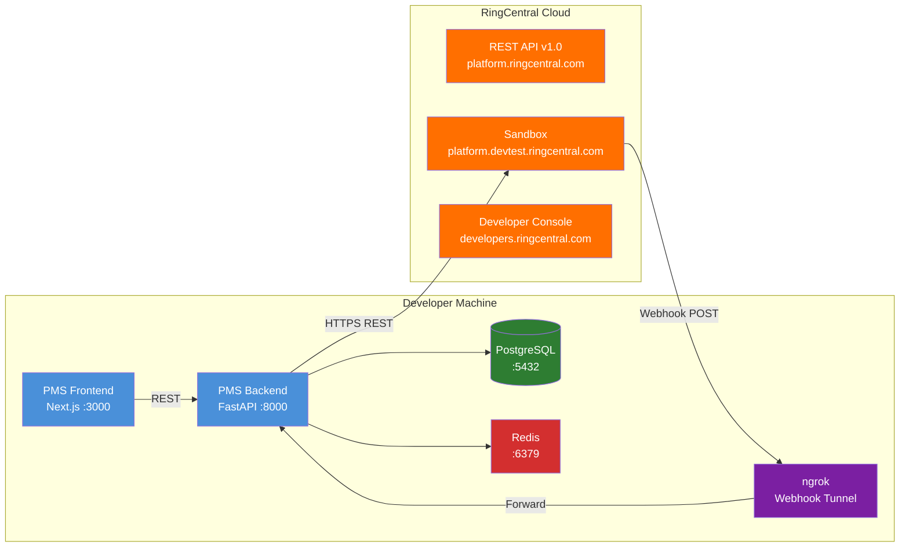

# RingCentral API Setup Guide for PMS Integration

**Document ID:** PMS-EXP-RINGCENTRALAPI-001
**Version:** 1.0
**Date:** 2026-03-10
**Applies To:** PMS project (all platforms)
**Prerequisites Level:** Intermediate

---

## Table of Contents

1. [Overview](#1-overview)
2. [Prerequisites](#2-prerequisites)
3. [Part A: RingCentral Account Setup and OAuth Configuration](#3-part-a-ringcentral-account-setup-and-oauth-configuration)
4. [Part B: Integrate with PMS Backend](#4-part-b-integrate-with-pms-backend)
5. [Part C: Integrate with PMS Frontend](#5-part-c-integrate-with-pms-frontend)
6. [Part D: Testing and Verification](#6-part-d-testing-and-verification)
7. [Troubleshooting](#7-troubleshooting)
8. [Reference Commands](#8-reference-commands)

---

## 1. Overview

This guide walks you through connecting RingCentral's REST API to the PMS backend (FastAPI), frontend (Next.js), and Android app. By the end, you will have:

- A RingCentral sandbox account with OAuth 2.0 credentials
- A `RingCentralClient` Python SDK wrapper integrated into FastAPI
- A `CommsService` FastAPI router with SMS, voice, fax, and video endpoints
- Webhook subscriptions receiving inbound call and SMS events
- A `CallerIDResolver` matching phone numbers to patient records
- A `ReminderScheduler` sending automated appointment SMS reminders
- A `TranscriptionService` for auto-transcribing call recordings via RingCentral Audio AI
- A `CallAnalyticsService` for call volume, SMS delivery, and communication statistics
- A Next.js Communications Dashboard with call log, SMS compose, fax inbox, transcripts, and analytics
- HIPAA audit logging for all communication operations



## 2. Prerequisites

### 2.1 Required Software

| Software | Minimum Version | Check Command |
|---|---|---|
| Python | 3.11+ | `python --version` |
| Node.js | 18+ | `node --version` |
| PostgreSQL | 15+ | `psql --version` |
| Redis | 7+ | `redis-cli --version` |
| Docker | 24+ | `docker --version` |
| ngrok | 3+ | `ngrok --version` |
| Git | 2.40+ | `git --version` |

### 2.2 Installation of Prerequisites

```bash
# Install RingCentral Python SDK
pip install ringcentral pydantic apscheduler

# Install ngrok (macOS)
brew install ngrok

# Verify installations
python -c "from ringcentral import SDK; print('RingCentral SDK loaded')"
ngrok --version
```

### 2.3 Verify PMS Services

```bash
# Check FastAPI backend
curl -s http://localhost:8000/docs | head -5
# Expected: HTML for Swagger UI

# Check PostgreSQL
psql -U pms_user -d pms_db -c "SELECT 1;"
# Expected: 1

# Check Redis
redis-cli ping
# Expected: PONG

# Check Next.js frontend
curl -s -o /dev/null -w "%{http_code}" http://localhost:3000
# Expected: 200
```

## 3. Part A: RingCentral Account Setup and OAuth Configuration

### Step 1: Create RingCentral Developer Account

1. Navigate to [https://developers.ringcentral.com/](https://developers.ringcentral.com/)
2. Click **Create Free Account** or sign in with existing RingCentral credentials
3. This creates both a Developer Console account and a sandbox environment

### Step 2: Create an Application in Developer Console

1. In the [Developer Console](https://developers.ringcentral.com/my-account.html), click **Create App**
2. Configure the application:

| Setting | Value |
|---|---|
| App Name | `PMS Communications` |
| App Type | `REST API App` |
| Platform Type | `Server/Bot` (for backend JWT auth) |
| Permissions | Read Accounts, Read Call Log, Read Messages, Send Messages, Read Presence, RingOut, Fax, Video, Webhook Subscriptions |

3. Note the generated **Client ID** and **Client Secret**

### Step 3: Generate JWT Credentials

For server-to-server authentication (no user interaction):

1. In Developer Console → Your App → **Credentials** tab
2. Under **JWT Credentials**, click **Generate JWT**
3. Copy the JWT token — this is used for backend authentication

### Step 4: Configure Environment Variables

```bash
# .env (DO NOT commit this file)
RC_CLIENT_ID=your-client-id
RC_CLIENT_SECRET=your-client-secret
RC_JWT_TOKEN=your-jwt-token
RC_SERVER_URL=https://platform.devtest.ringcentral.com  # Sandbox
# RC_SERVER_URL=https://platform.ringcentral.com  # Production
RC_WEBHOOK_URL=https://your-ngrok-url.ngrok-free.app/api/comms/webhooks/ringcentral
```

For Docker deployments:

```bash
echo "your-client-id" | docker secret create rc_client_id -
echo "your-client-secret" | docker secret create rc_client_secret -
echo "your-jwt-token" | docker secret create rc_jwt_token -
```

### Step 5: Start ngrok Webhook Tunnel

```bash
# Start ngrok tunnel for webhook development
ngrok http 8000

# Note the HTTPS URL, e.g.: https://abc123.ngrok-free.app
# Update RC_WEBHOOK_URL in .env with this URL + /api/comms/webhooks/ringcentral
```

### Step 6: Verify Sandbox Access

```python
# test_rc_connection.py
from ringcentral import SDK

sdk = SDK(
    client_id="your-client-id",
    client_secret="your-client-secret",
    server="https://platform.devtest.ringcentral.com"
)
platform = sdk.platform()
platform.login(jwt="your-jwt-token")

# Get account info
response = platform.get("/restapi/v1.0/account/~/extension/~")
print(response.json()["name"])
# Expected: Your sandbox extension name
```

**Checkpoint**: You have a RingCentral developer account, a REST API app with JWT credentials, environment variables configured, ngrok tunnel running, and successful sandbox API connectivity verified.

## 4. Part B: Integrate with PMS Backend

### Step 1: Create PostgreSQL Schema

```sql
-- migrations/comms_tables.sql

-- Call log linked to patient records
CREATE TABLE comms_call_log (
    id UUID PRIMARY KEY DEFAULT gen_random_uuid(),
    ringcentral_call_id VARCHAR(100) UNIQUE,
    patient_id UUID REFERENCES patients(id),
    encounter_id UUID REFERENCES encounters(id),
    direction VARCHAR(10) NOT NULL CHECK (direction IN ('inbound', 'outbound')),
    from_number VARCHAR(20) NOT NULL,
    to_number VARCHAR(20) NOT NULL,
    status VARCHAR(20) NOT NULL,
    duration_seconds INT DEFAULT 0,
    recording_url TEXT,
    recording_data BYTEA, -- AES-256-GCM encrypted local copy
    call_notes TEXT,
    consent_recorded BOOLEAN DEFAULT FALSE,
    created_at TIMESTAMPTZ DEFAULT NOW(),
    ended_at TIMESTAMPTZ,
    created_by UUID REFERENCES users(id)
);

-- SMS message log
CREATE TABLE comms_sms_log (
    id UUID PRIMARY KEY DEFAULT gen_random_uuid(),
    ringcentral_message_id VARCHAR(100),
    patient_id UUID REFERENCES patients(id),
    direction VARCHAR(10) NOT NULL CHECK (direction IN ('inbound', 'outbound')),
    from_number VARCHAR(20) NOT NULL,
    to_number VARCHAR(20) NOT NULL,
    message_text TEXT NOT NULL,
    message_type VARCHAR(10) DEFAULT 'sms' CHECK (message_type IN ('sms', 'mms')),
    delivery_status VARCHAR(20),
    template_id VARCHAR(50),
    created_at TIMESTAMPTZ DEFAULT NOW()
);

-- Inbound fax queue
CREATE TABLE comms_fax_inbox (
    id UUID PRIMARY KEY DEFAULT gen_random_uuid(),
    ringcentral_message_id VARCHAR(100) UNIQUE,
    from_number VARCHAR(20),
    to_number VARCHAR(20),
    page_count INT,
    fax_document BYTEA, -- AES-256-GCM encrypted PDF
    patient_id UUID REFERENCES patients(id), -- NULL until matched
    status VARCHAR(20) DEFAULT 'pending' CHECK (status IN ('pending', 'matched', 'filed', 'rejected')),
    matched_by UUID REFERENCES users(id),
    received_at TIMESTAMPTZ DEFAULT NOW(),
    processed_at TIMESTAMPTZ
);

-- Patient communication preferences
CREATE TABLE patient_comms_preferences (
    patient_id UUID PRIMARY KEY REFERENCES patients(id),
    sms_opt_in BOOLEAN DEFAULT TRUE,
    sms_reminder_opt_in BOOLEAN DEFAULT TRUE,
    preferred_phone VARCHAR(20),
    preferred_contact_time VARCHAR(20) DEFAULT 'any',
    language VARCHAR(10) DEFAULT 'en',
    updated_at TIMESTAMPTZ DEFAULT NOW()
);

-- HIPAA audit log for communications
CREATE TABLE comms_audit_log (
    id BIGSERIAL PRIMARY KEY,
    timestamp TIMESTAMPTZ DEFAULT NOW(),
    user_id UUID,
    action VARCHAR(50) NOT NULL,
    resource_type VARCHAR(30) NOT NULL,
    resource_id VARCHAR(100),
    patient_id UUID,
    request_summary JSONB,
    response_status INT,
    ip_address INET
);

-- Call recording transcriptions (from RingCentral Audio AI)
CREATE TABLE comms_transcriptions (
    id UUID PRIMARY KEY DEFAULT gen_random_uuid(),
    call_log_id UUID NOT NULL REFERENCES comms_call_log(id),
    patient_id UUID REFERENCES patients(id),
    encounter_id UUID REFERENCES encounters(id),
    transcript_text TEXT NOT NULL,             -- full transcript with speaker labels
    utterances JSONB,                          -- [{speakerId, text, start, end, confidence}]
    speaker_count INT DEFAULT 2,
    overall_confidence DECIMAL(4, 3),          -- 0.000–1.000
    duration_seconds INT,
    language_code VARCHAR(10) DEFAULT 'en-US',
    ringcentral_job_id VARCHAR(100),           -- async transcription job ID
    status VARCHAR(20) DEFAULT 'pending'
        CHECK (status IN ('pending', 'processing', 'completed', 'failed')),
    encounter_note_generated BOOLEAN DEFAULT FALSE,
    created_at TIMESTAMPTZ DEFAULT NOW(),
    completed_at TIMESTAMPTZ
);

-- Call analytics (sentiment, emotion, aggregate stats)
CREATE TABLE comms_call_analytics (
    id UUID PRIMARY KEY DEFAULT gen_random_uuid(),
    call_log_id UUID REFERENCES comms_call_log(id),
    transcription_id UUID REFERENCES comms_transcriptions(id),
    patient_id UUID REFERENCES patients(id),
    sentiment VARCHAR(20)                      -- 'positive', 'negative', 'neutral', 'mixed'
        CHECK (sentiment IN ('positive', 'negative', 'neutral', 'mixed')),
    sentiment_score DECIMAL(4, 3),             -- -1.000 to 1.000
    emotions JSONB,                            -- [{emotion, confidence, speakerId}]
    call_quality_score DECIMAL(4, 3),          -- transcript confidence as proxy
    recording_size_bytes BIGINT,
    ringcentral_insights_job_id VARCHAR(100),
    created_at TIMESTAMPTZ DEFAULT NOW()
);

-- Daily/weekly/monthly aggregate communication statistics
CREATE TABLE comms_stats_daily (
    id BIGSERIAL PRIMARY KEY,
    stat_date DATE NOT NULL,
    total_calls INT DEFAULT 0,
    inbound_calls INT DEFAULT 0,
    outbound_calls INT DEFAULT 0,
    avg_call_duration_seconds INT DEFAULT 0,
    total_sms_sent INT DEFAULT 0,
    total_sms_received INT DEFAULT 0,
    sms_delivery_success_rate DECIMAL(5, 2),   -- percentage
    total_faxes_received INT DEFAULT 0,
    total_recordings INT DEFAULT 0,
    total_transcriptions INT DEFAULT 0,
    avg_transcription_confidence DECIMAL(4, 3),
    positive_sentiment_count INT DEFAULT 0,
    negative_sentiment_count INT DEFAULT 0,
    neutral_sentiment_count INT DEFAULT 0,
    appointments_confirmed_via_sms INT DEFAULT 0,
    no_shows_with_reminder INT DEFAULT 0,
    no_shows_without_reminder INT DEFAULT 0,
    created_at TIMESTAMPTZ DEFAULT NOW(),
    UNIQUE(stat_date)
);

-- Indexes
CREATE INDEX idx_comms_call_patient ON comms_call_log(patient_id);
CREATE INDEX idx_comms_call_number ON comms_call_log(from_number);
CREATE INDEX idx_comms_sms_patient ON comms_sms_log(patient_id);
CREATE INDEX idx_comms_fax_status ON comms_fax_inbox(status);
CREATE INDEX idx_comms_audit_timestamp ON comms_audit_log(timestamp);
CREATE INDEX idx_comms_audit_patient ON comms_audit_log(patient_id);
CREATE INDEX idx_comms_transcription_call ON comms_transcriptions(call_log_id);
CREATE INDEX idx_comms_transcription_patient ON comms_transcriptions(patient_id);
CREATE INDEX idx_comms_transcription_status ON comms_transcriptions(status);
CREATE INDEX idx_comms_analytics_call ON comms_call_analytics(call_log_id);
CREATE INDEX idx_comms_analytics_sentiment ON comms_call_analytics(sentiment);
CREATE INDEX idx_comms_stats_date ON comms_stats_daily(stat_date);
```

### Step 2: RingCentral Client Wrapper

```python
# app/services/ringcentral_client.py

from ringcentral import SDK
from pydantic import BaseModel, Field
from typing import Optional
from datetime import datetime
from app.core.config import settings
import json


class SMSMessage(BaseModel):
    message_id: str
    from_number: str
    to_number: str
    text: str
    delivery_status: str
    created_at: datetime


class CallSession(BaseModel):
    session_id: str
    from_number: str
    to_number: str
    status: str
    direction: str


class FaxMessage(BaseModel):
    message_id: str
    from_number: str
    to_number: str
    page_count: int
    status: str


class RingCentralClient:
    """Wrapper around RingCentral Python SDK with PMS-specific methods."""

    def __init__(self):
        self.sdk = SDK(
            client_id=settings.RC_CLIENT_ID,
            client_secret=settings.RC_CLIENT_SECRET,
            server=settings.RC_SERVER_URL,
        )
        self.platform = self.sdk.platform()
        self._authenticated = False

    def _ensure_auth(self):
        """Authenticate if not already authenticated or token expired."""
        if not self._authenticated or not self.platform.logged_in():
            self.platform.login(jwt=settings.RC_JWT_TOKEN)
            self._authenticated = True

    def send_sms(self, from_number: str, to_number: str, text: str) -> SMSMessage:
        """Send an SMS message to a patient."""
        self._ensure_auth()
        response = self.platform.post(
            "/restapi/v1.0/account/~/extension/~/sms",
            {
                "from": {"phoneNumber": from_number},
                "to": [{"phoneNumber": to_number}],
                "text": text,
            },
        )
        data = response.json()
        return SMSMessage(
            message_id=str(data["id"]),
            from_number=from_number,
            to_number=to_number,
            text=text,
            delivery_status=data.get("messageStatus", "Queued"),
            created_at=datetime.utcnow(),
        )

    def initiate_call(self, from_number: str, to_number: str) -> CallSession:
        """Initiate an outbound call via RingOut."""
        self._ensure_auth()
        response = self.platform.post(
            "/restapi/v1.0/account/~/extension/~/ring-out",
            {
                "from": {"phoneNumber": from_number},
                "to": {"phoneNumber": to_number},
                "playPrompt": True,  # Play "Please hold" prompt
            },
        )
        data = response.json()
        return CallSession(
            session_id=str(data["id"]),
            from_number=from_number,
            to_number=to_number,
            status=data["status"]["callStatus"],
            direction="outbound",
        )

    def send_fax(
        self, to_number: str, pdf_bytes: bytes, cover_text: str = ""
    ) -> FaxMessage:
        """Send a fax document (PDF) to a referral source."""
        self._ensure_auth()
        # Multipart request: JSON metadata + PDF attachment
        body = {
            "to": [{"phoneNumber": to_number}],
            "faxResolution": "High",
            "coverPageText": cover_text,
        }
        attachment = ("document.pdf", pdf_bytes, "application/pdf")
        response = self.platform.post(
            "/restapi/v1.0/account/~/extension/~/fax",
            body,
            files=[attachment],
        )
        data = response.json()
        return FaxMessage(
            message_id=str(data["id"]),
            from_number=data.get("from", {}).get("phoneNumber", ""),
            to_number=to_number,
            page_count=data.get("pgCnt", 0),
            status=data.get("messageStatus", "Queued"),
        )

    def create_video_meeting(self, topic: str) -> dict:
        """Create a RingCentral Video meeting for a telehealth visit."""
        self._ensure_auth()
        response = self.platform.post(
            "/restapi/v1.0/account/~/extension/~/video/conference",
            {"name": topic, "type": "Scheduled"},
        )
        data = response.json()
        return {
            "meeting_id": data.get("id"),
            "join_url": data.get("joinUri") or data.get("session", {}).get("joinUri"),
            "host_url": data.get("hostUri"),
            "topic": topic,
        }

    def get_call_log(
        self, date_from: str = None, date_to: str = None, per_page: int = 100
    ) -> list[dict]:
        """Retrieve call log records."""
        self._ensure_auth()
        params = {"perPage": per_page, "view": "Detailed"}
        if date_from:
            params["dateFrom"] = date_from
        if date_to:
            params["dateTo"] = date_to
        response = self.platform.get(
            "/restapi/v1.0/account/~/extension/~/call-log", params
        )
        return response.json().get("records", [])

    def get_recording(self, recording_id: str) -> bytes:
        """Download a call recording as audio data."""
        self._ensure_auth()
        response = self.platform.get(
            f"/restapi/v1.0/account/~/recording/{recording_id}/content"
        )
        return response.response().content

    def subscribe_webhook(self, webhook_url: str, event_filters: list[str]) -> dict:
        """Create a webhook subscription for real-time events."""
        self._ensure_auth()
        response = self.platform.post(
            "/restapi/v1.0/subscription",
            {
                "eventFilters": event_filters,
                "deliveryMode": {
                    "transportType": "WebHook",
                    "address": webhook_url,
                },
                "expiresIn": 604800,  # 7 days
            },
        )
        return response.json()

    def get_sms_history(self, phone_number: str = None, per_page: int = 50) -> list[dict]:
        """Retrieve SMS message history."""
        self._ensure_auth()
        params = {"messageType": "SMS", "perPage": per_page}
        if phone_number:
            params["phoneNumber"] = phone_number
        response = self.platform.get(
            "/restapi/v1.0/account/~/extension/~/message-store", params
        )
        return response.json().get("records", [])

    # --- Audio AI: Transcription & Analytics ---

    def transcribe_recording(
        self, content_uri: str, webhook_url: str, audio_type: str = "CallCenter"
    ) -> dict:
        """
        Submit a call recording for async transcription via RingCentral Audio AI.

        Args:
            content_uri: URL to the recording audio file (from call log recording.contentUri)
            webhook_url: URL where RingCentral will POST the completed transcript
            audio_type: "CallCenter" (2-3 speakers) or "Meeting" (4-6 speakers)

        Returns:
            dict with jobId for tracking the async transcription
        """
        self._ensure_auth()
        response = self.platform.post(
            f"/ai/audio/v1/async/speech-to-text?webhook={webhook_url}",
            {
                "contentUri": content_uri,
                "encoding": "Mpeg",
                "languageCode": "en-US",
                "source": "RingCentral",
                "audioType": audio_type,
                "enablePunctuation": True,
                "enableSpeakerDiarization": True,
                "enableVoiceActivityDetection": True,
            },
        )
        return response.json()

    def analyze_interaction(self, content_uri: str, webhook_url: str) -> dict:
        """
        Submit a recording for sentiment/emotion analysis via Interaction Analytics.

        Returns:
            dict with jobId for tracking the async analysis
        """
        self._ensure_auth()
        response = self.platform.post(
            f"/ai/insights/v1/async/analyze-interaction?webhook={webhook_url}",
            {
                "contentUri": content_uri,
                "encoding": "Mpeg",
                "languageCode": "en-US",
                "source": "RingCentral",
                "audioType": "CallCenter",
                "insights": ["All"],
            },
        )
        return response.json()

    def get_call_analytics_aggregate(
        self,
        date_from: str,
        date_to: str,
        group_by: str = "Users",
    ) -> dict:
        """
        Fetch aggregated call statistics from RingCentral Business Analytics API.

        Args:
            date_from: ISO 8601 start date (e.g., "2026-03-01T00:00:00Z")
            date_to: ISO 8601 end date
            group_by: "Users", "Departments", "CallQueues", etc.

        Returns:
            dict with counters (call counts) and timers (durations)
        """
        self._ensure_auth()
        response = self.platform.post(
            "/analytics/calls/v1/accounts/~/aggregation/fetch",
            {
                "grouping": {"groupBy": group_by},
                "timeSettings": {
                    "timeRange": {"timeFrom": date_from, "timeTo": date_to}
                },
                "responseOptions": {
                    "counters": {
                        "allCalls": {"aggregationType": "Sum"},
                        "callsByDirection": {"aggregationType": "Sum"},
                        "callsByResult": {"aggregationType": "Sum"},
                    },
                    "timers": {
                        "allCallsDuration": {"aggregationType": "Sum"},
                        "callsDurationByDirection": {"aggregationType": "Sum"},
                    },
                },
            },
        )
        return response.json()

    def get_call_analytics_timeline(
        self,
        date_from: str,
        date_to: str,
        interval: str = "Day",
    ) -> dict:
        """
        Fetch time-series call statistics (hourly/daily/weekly/monthly).

        Args:
            interval: "Hour", "Day", "Week", or "Month"
        """
        self._ensure_auth()
        response = self.platform.post(
            f"/analytics/calls/v1/accounts/~/timeline/fetch?interval={interval}",
            {
                "timeSettings": {
                    "timeRange": {"timeFrom": date_from, "timeTo": date_to}
                },
                "responseOptions": {
                    "counters": {
                        "allCalls": {"aggregationType": "Sum"},
                        "callsByDirection": {"aggregationType": "Sum"},
                    },
                    "timers": {
                        "allCallsDuration": {"aggregationType": "Sum"},
                    },
                },
            },
        )
        return response.json()
```

### Step 3: CallerID Resolver

```python
# app/services/caller_id_resolver.py

from app.db.session import get_db
import redis.asyncio as redis
from app.core.config import settings
import json


class CallerIDResolver:
    """Match incoming phone numbers to PMS patient records."""

    def __init__(self):
        self.redis = redis.from_url(settings.REDIS_URL)
        self.cache_ttl = 300  # 5 minutes

    async def resolve(self, phone_number: str, db) -> dict | None:
        """
        Look up a phone number and return patient info.
        Checks Redis cache first, then PostgreSQL.
        """
        # Normalize phone number (strip country code formatting)
        normalized = phone_number.replace("+1", "").replace("-", "").replace(" ", "")
        if len(normalized) == 10:
            normalized = f"+1{normalized}"

        # Check Redis cache
        cache_key = f"caller_id:{normalized}"
        cached = await self.redis.get(cache_key)
        if cached:
            return json.loads(cached)

        # Query PostgreSQL for patient with matching phone
        result = await db.execute(
            """SELECT id, first_name, last_name, phone, mrn,
                      date_of_birth
               FROM patients
               WHERE phone = $1 OR mobile_phone = $1
               LIMIT 1""",
            [normalized],
        )
        row = result.first()

        if not row:
            return None

        patient_info = {
            "patient_id": str(row.id),
            "name": f"{row.first_name} {row.last_name}",
            "mrn": row.mrn,
            "phone": normalized,
            "dob": str(row.date_of_birth) if row.date_of_birth else None,
        }

        # Cache result
        await self.redis.set(cache_key, json.dumps(patient_info), ex=self.cache_ttl)

        return patient_info

    async def close(self):
        await self.redis.close()
```

### Step 4: CommsService FastAPI Router

```python
# app/api/routes/comms.py

from fastapi import APIRouter, Depends, HTTPException, Request
from pydantic import BaseModel
from typing import Optional
from datetime import datetime
from app.services.ringcentral_client import RingCentralClient
from app.services.caller_id_resolver import CallerIDResolver
from app.services.comms_audit import log_comms_action
from app.db.session import get_db
from app.api.deps import get_current_user

router = APIRouter(prefix="/api/comms", tags=["communications"])


class SendSMSRequest(BaseModel):
    patient_id: str
    to_number: str
    message_text: str
    template_id: Optional[str] = None


class InitiateCallRequest(BaseModel):
    patient_id: Optional[str] = None
    to_number: str
    from_number: str


class SendFaxRequest(BaseModel):
    to_number: str
    document_base64: str  # Base64-encoded PDF
    cover_text: Optional[str] = ""
    patient_id: Optional[str] = None


class CreateVideoMeetingRequest(BaseModel):
    patient_id: str
    encounter_id: Optional[str] = None
    topic: str = "Telehealth Visit"


# --- SMS Endpoints ---

@router.post("/sms")
async def send_sms(
    request: SendSMSRequest,
    db=Depends(get_db),
    current_user=Depends(get_current_user),
):
    """Send an SMS message to a patient."""
    # Check patient opt-in
    prefs = await db.execute(
        "SELECT sms_opt_in FROM patient_comms_preferences WHERE patient_id = $1",
        [request.patient_id],
    )
    pref_row = prefs.first()
    if pref_row and not pref_row.sms_opt_in:
        raise HTTPException(status_code=403, detail="Patient has opted out of SMS")

    client = RingCentralClient()
    result = client.send_sms(
        from_number="+1YOUR_RC_NUMBER",  # Configured in env
        to_number=request.to_number,
        text=request.message_text,
    )

    # Log to database
    await db.execute(
        """INSERT INTO comms_sms_log
           (ringcentral_message_id, patient_id, direction, from_number,
            to_number, message_text, delivery_status, template_id)
           VALUES ($1,$2,$3,$4,$5,$6,$7,$8)""",
        [
            result.message_id, request.patient_id, "outbound",
            result.from_number, result.to_number, request.message_text,
            result.delivery_status, request.template_id,
        ],
    )

    await log_comms_action(
        db=db, user_id=current_user.id, action="send_sms",
        resource_type="sms", resource_id=result.message_id,
        patient_id=request.patient_id,
    )
    await db.commit()

    return {"message_id": result.message_id, "status": result.delivery_status}


@router.get("/sms/history/{patient_id}")
async def get_sms_history(
    patient_id: str,
    db=Depends(get_db),
    current_user=Depends(get_current_user),
):
    """Get SMS conversation history for a patient."""
    result = await db.execute(
        """SELECT direction, from_number, to_number, message_text,
                  delivery_status, created_at
           FROM comms_sms_log
           WHERE patient_id = $1
           ORDER BY created_at DESC
           LIMIT 50""",
        [patient_id],
    )
    rows = result.fetchall()
    return {
        "patient_id": patient_id,
        "messages": [
            {
                "direction": r.direction,
                "from": r.from_number,
                "to": r.to_number,
                "text": r.message_text,
                "status": r.delivery_status,
                "timestamp": r.created_at.isoformat(),
            }
            for r in rows
        ],
    }


# --- Voice Endpoints ---

@router.post("/call")
async def initiate_call(
    request: InitiateCallRequest,
    db=Depends(get_db),
    current_user=Depends(get_current_user),
):
    """Initiate an outbound call via RingOut."""
    client = RingCentralClient()
    result = client.initiate_call(
        from_number=request.from_number,
        to_number=request.to_number,
    )

    await db.execute(
        """INSERT INTO comms_call_log
           (ringcentral_call_id, patient_id, direction, from_number,
            to_number, status, created_by)
           VALUES ($1,$2,$3,$4,$5,$6,$7)""",
        [
            result.session_id, request.patient_id, "outbound",
            request.from_number, request.to_number, result.status,
            current_user.id,
        ],
    )

    await log_comms_action(
        db=db, user_id=current_user.id, action="initiate_call",
        resource_type="call", resource_id=result.session_id,
        patient_id=request.patient_id,
    )
    await db.commit()

    return {"session_id": result.session_id, "status": result.status}


@router.get("/calls/log")
async def get_call_log(
    date_from: Optional[str] = None,
    date_to: Optional[str] = None,
    current_user=Depends(get_current_user),
):
    """Get call history from RingCentral."""
    client = RingCentralClient()
    records = client.get_call_log(date_from=date_from, date_to=date_to)
    return {"records": records}


@router.get("/calls/{call_id}/recording")
async def get_call_recording(
    call_id: str,
    db=Depends(get_db),
    current_user=Depends(get_current_user),
):
    """Download a call recording."""
    # Look up recording URL from local log
    result = await db.execute(
        "SELECT recording_url FROM comms_call_log WHERE ringcentral_call_id = $1",
        [call_id],
    )
    row = result.first()
    if not row or not row.recording_url:
        raise HTTPException(status_code=404, detail="Recording not found")

    client = RingCentralClient()
    recording_data = client.get_recording(call_id)

    await log_comms_action(
        db=db, user_id=current_user.id, action="access_recording",
        resource_type="recording", resource_id=call_id,
    )
    await db.commit()

    from fastapi.responses import Response
    return Response(content=recording_data, media_type="audio/mpeg")


# --- Fax Endpoints ---

@router.post("/fax")
async def send_fax(
    request: SendFaxRequest,
    db=Depends(get_db),
    current_user=Depends(get_current_user),
):
    """Send a fax document to a referral source."""
    import base64
    pdf_bytes = base64.b64decode(request.document_base64)

    client = RingCentralClient()
    result = client.send_fax(
        to_number=request.to_number,
        pdf_bytes=pdf_bytes,
        cover_text=request.cover_text or "",
    )

    await log_comms_action(
        db=db, user_id=current_user.id, action="send_fax",
        resource_type="fax", resource_id=result.message_id,
        patient_id=request.patient_id,
    )
    await db.commit()

    return {
        "message_id": result.message_id,
        "page_count": result.page_count,
        "status": result.status,
    }


@router.get("/fax/inbox")
async def get_fax_inbox(
    status: Optional[str] = "pending",
    db=Depends(get_db),
    current_user=Depends(get_current_user),
):
    """List inbound faxes in the queue."""
    result = await db.execute(
        """SELECT id, from_number, page_count, patient_id, status, received_at
           FROM comms_fax_inbox
           WHERE status = $1
           ORDER BY received_at DESC
           LIMIT 50""",
        [status],
    )
    rows = result.fetchall()
    return {
        "faxes": [
            {
                "id": str(r.id),
                "from_number": r.from_number,
                "page_count": r.page_count,
                "patient_id": str(r.patient_id) if r.patient_id else None,
                "status": r.status,
                "received_at": r.received_at.isoformat(),
            }
            for r in rows
        ]
    }


# --- Video Endpoints ---

@router.post("/video/meeting")
async def create_video_meeting(
    request: CreateVideoMeetingRequest,
    db=Depends(get_db),
    current_user=Depends(get_current_user),
):
    """Create a telehealth video meeting."""
    client = RingCentralClient()
    meeting = client.create_video_meeting(topic=request.topic)

    await log_comms_action(
        db=db, user_id=current_user.id, action="create_video_meeting",
        resource_type="video", resource_id=meeting.get("meeting_id"),
        patient_id=request.patient_id,
    )
    await db.commit()

    return meeting


# --- Webhook Endpoint ---

@router.post("/webhooks/ringcentral")
async def ringcentral_webhook(request: Request, db=Depends(get_db)):
    """Receive webhook events from RingCentral."""
    body = await request.json()

    # Handle validation token (subscription creation verification)
    validation_token = request.headers.get("Validation-Token")
    if validation_token:
        from fastapi.responses import Response
        return Response(
            content="",
            headers={"Validation-Token": validation_token},
            status_code=200,
        )

    # Process event
    event = body.get("event", "")
    event_body = body.get("body", {})

    if "/telephony/sessions" in event:
        # Inbound/outbound call event
        caller_number = event_body.get("parties", [{}])[0].get("from", {}).get("phoneNumber", "")
        resolver = CallerIDResolver()
        patient = await resolver.resolve(caller_number, db)

        if patient:
            await db.execute(
                """INSERT INTO comms_call_log
                   (ringcentral_call_id, patient_id, direction, from_number,
                    to_number, status)
                   VALUES ($1,$2,$3,$4,$5,$6)
                   ON CONFLICT (ringcentral_call_id) DO UPDATE SET status = $6""",
                [
                    event_body.get("sessionId", ""),
                    patient["patient_id"],
                    "inbound",
                    caller_number,
                    event_body.get("parties", [{}])[0].get("to", {}).get("phoneNumber", ""),
                    event_body.get("parties", [{}])[0].get("status", {}).get("code", ""),
                ],
            )
            await db.commit()

        await resolver.close()

    elif "/message-store" in event:
        # Inbound SMS event
        for msg in event_body.get("changes", []):
            if msg.get("type") == "SMS":
                # Process inbound SMS — match to patient, log
                pass

    return {"status": "ok"}
```

### Step 5: Reminder Scheduler

```python
# app/services/reminder_scheduler.py

from apscheduler.schedulers.asyncio import AsyncIOScheduler
from app.services.ringcentral_client import RingCentralClient
from app.db.session import async_session
import logging
from datetime import datetime, timedelta

logger = logging.getLogger(__name__)

scheduler = AsyncIOScheduler()

SMS_TEMPLATES = {
    "reminder_48h": (
        "Reminder: You have an appointment at Texas Retina Associates "
        "on {date} at {time}. Reply YES to confirm or call us to reschedule."
    ),
    "reminder_24h": (
        "Your appointment is tomorrow, {date} at {time}. "
        "Please arrive 15 minutes early. Reply YES to confirm."
    ),
    "reminder_2h": (
        "Your appointment today at {time} is in 2 hours. "
        "We look forward to seeing you."
    ),
}


async def send_appointment_reminders(hours_before: int = 48):
    """Send SMS reminders for appointments N hours from now."""
    async with async_session() as db:
        target_time = datetime.utcnow() + timedelta(hours=hours_before)
        window_start = target_time - timedelta(minutes=30)
        window_end = target_time + timedelta(minutes=30)

        # Query upcoming appointments with opted-in patients
        result = await db.execute(
            """SELECT a.id, a.appointment_date, a.appointment_time,
                      p.id as patient_id, p.phone, p.first_name
               FROM appointments a
               JOIN patients p ON a.patient_id = p.id
               LEFT JOIN patient_comms_preferences pcp ON p.id = pcp.patient_id
               WHERE a.appointment_date BETWEEN $1 AND $2
                 AND (pcp.sms_reminder_opt_in IS NULL OR pcp.sms_reminder_opt_in = TRUE)
                 AND a.status = 'scheduled'""",
            [window_start, window_end],
        )
        appointments = result.fetchall()

        if not appointments:
            return

        client = RingCentralClient()
        template_key = f"reminder_{hours_before}h"
        template = SMS_TEMPLATES.get(template_key, SMS_TEMPLATES["reminder_48h"])

        for appt in appointments:
            try:
                message = template.format(
                    date=appt.appointment_date.strftime("%B %d"),
                    time=appt.appointment_time.strftime("%I:%M %p"),
                )

                client.send_sms(
                    from_number="+1YOUR_RC_NUMBER",
                    to_number=appt.phone,
                    text=message,
                )

                # Log the reminder
                await db.execute(
                    """INSERT INTO comms_sms_log
                       (patient_id, direction, from_number, to_number,
                        message_text, delivery_status, template_id)
                       VALUES ($1,$2,$3,$4,$5,$6,$7)""",
                    [
                        str(appt.patient_id), "outbound",
                        "+1YOUR_RC_NUMBER", appt.phone,
                        message, "Queued", template_key,
                    ],
                )

                logger.info(f"Sent {template_key} reminder to patient {appt.patient_id}")

            except Exception as e:
                logger.error(f"Failed to send reminder to {appt.patient_id}: {e}")

        await db.commit()


def start_reminder_scheduler():
    """Start the appointment reminder scheduler."""
    # 48-hour reminders at 7:00 AM daily
    scheduler.add_job(
        send_appointment_reminders,
        "cron", hour=7, minute=0,
        kwargs={"hours_before": 48},
        id="reminder_48h",
    )
    # 24-hour reminders at 7:00 AM daily
    scheduler.add_job(
        send_appointment_reminders,
        "cron", hour=7, minute=0,
        kwargs={"hours_before": 24},
        id="reminder_24h",
    )
    # 2-hour reminders every 30 minutes
    scheduler.add_job(
        send_appointment_reminders,
        "interval", minutes=30,
        kwargs={"hours_before": 2},
        id="reminder_2h",
    )
    scheduler.start()
    logger.info("Appointment reminder scheduler started")
```

### Step 6: HIPAA Audit Logger

```python
# app/services/comms_audit.py

from datetime import datetime


async def log_comms_action(
    db,
    user_id: str,
    action: str,
    resource_type: str,
    resource_id: str,
    patient_id: str = None,
    request_summary: dict = None,
    response_status: int = 200,
    ip_address: str = None,
):
    """Log a communication operation to the HIPAA audit trail."""
    await db.execute(
        """INSERT INTO comms_audit_log
           (user_id, action, resource_type, resource_id, patient_id,
            request_summary, response_status, ip_address, timestamp)
           VALUES ($1,$2,$3,$4,$5,$6,$7,$8,$9)""",
        [
            user_id, action, resource_type, resource_id, patient_id,
            request_summary, response_status, ip_address,
            datetime.utcnow(),
        ],
    )
```

### Step 7: Transcription Service

```python
# app/services/transcription_service.py

"""Auto-transcription of call recordings via RingCentral Audio AI."""

import logging
from datetime import datetime
from uuid import UUID

logger = logging.getLogger(__name__)


class TranscriptionService:
    """Manages async transcription of call recordings and encounter note generation."""

    def __init__(self, db, rc_client):
        self.db = db
        self.rc_client = rc_client

    async def submit_transcription(
        self,
        call_log_id: UUID,
        recording_content_uri: str,
        webhook_url: str,
        patient_id: UUID = None,
        encounter_id: UUID = None,
    ) -> dict:
        """
        Submit a call recording for async transcription.

        1. Create a pending transcription record in PostgreSQL
        2. Call RingCentral Audio AI Speech-to-Text API
        3. Return the job ID for tracking
        """
        # Submit to RingCentral AI
        result = self.rc_client.transcribe_recording(
            content_uri=recording_content_uri,
            webhook_url=webhook_url,
            audio_type="CallCenter",
        )
        job_id = result.get("jobId", "")

        # Create pending transcription record
        await self.db.execute(
            """INSERT INTO comms_transcriptions
               (call_log_id, patient_id, encounter_id, transcript_text,
                ringcentral_job_id, status)
               VALUES ($1, $2, $3, '', $4, 'processing')""",
            [str(call_log_id), str(patient_id) if patient_id else None,
             str(encounter_id) if encounter_id else None, job_id],
        )
        await self.db.commit()

        logger.info("Transcription submitted for call %s, job %s", call_log_id, job_id)
        return {"job_id": job_id, "status": "processing"}

    async def process_transcription_callback(self, webhook_data: dict) -> None:
        """
        Handle the async transcription webhook callback from RingCentral.

        Parses utterances, calculates confidence, and stores the transcript.
        """
        job_id = webhook_data.get("jobId", "")
        status = webhook_data.get("status", "")

        if status != "Completed":
            await self.db.execute(
                "UPDATE comms_transcriptions SET status = 'failed' WHERE ringcentral_job_id = $1",
                [job_id],
            )
            await self.db.commit()
            logger.error("Transcription failed for job %s: %s", job_id, status)
            return

        # Extract transcript data
        utterances = webhook_data.get("response", {}).get("utterances", [])
        overall_confidence = webhook_data.get("response", {}).get("confidence", 0.0)
        speaker_ids = set()

        # Build full transcript text with speaker labels
        transcript_lines = []
        for utt in utterances:
            speaker = utt.get("speakerId", "Unknown")
            speaker_ids.add(speaker)
            text = utt.get("text", "")
            transcript_lines.append(f"[Speaker {speaker}]: {text}")

        full_transcript = "\n".join(transcript_lines)
        duration = 0
        if utterances:
            duration = int(utterances[-1].get("end", 0))

        # Update transcription record
        await self.db.execute(
            """UPDATE comms_transcriptions SET
               transcript_text = $1, utterances = $2::jsonb,
               speaker_count = $3, overall_confidence = $4,
               duration_seconds = $5, status = 'completed',
               completed_at = $6
               WHERE ringcentral_job_id = $7""",
            [
                full_transcript, str(utterances), len(speaker_ids),
                overall_confidence, duration, datetime.utcnow(), job_id,
            ],
        )
        await self.db.commit()
        logger.info("Transcription completed for job %s (%.1f%% confidence)",
                     job_id, overall_confidence * 100)

    async def generate_encounter_note(self, transcription_id: UUID) -> str:
        """
        Generate a structured encounter note from a completed transcript.

        Extracts key information: chief complaint, assessment, plan, follow-up.
        Returns the note text and links it to the encounter.
        """
        row = await self.db.execute(
            "SELECT transcript_text, encounter_id FROM comms_transcriptions WHERE id = $1",
            [str(transcription_id)],
        )
        record = row.first()
        if not record or not record.transcript_text:
            raise ValueError("No transcript found")

        # Build structured note from transcript
        note = (
            f"## Phone Consultation Note\n\n"
            f"**Source:** Auto-transcribed call recording\n"
            f"**Transcription ID:** {transcription_id}\n\n"
            f"### Transcript\n\n{record.transcript_text}\n\n"
            f"---\n*Auto-generated from call recording. "
            f"Review and edit before finalizing.*"
        )

        # Mark as generated
        await self.db.execute(
            "UPDATE comms_transcriptions SET encounter_note_generated = TRUE WHERE id = $1",
            [str(transcription_id)],
        )
        await self.db.commit()
        return note

    async def get_transcript(self, call_log_id: UUID) -> dict | None:
        """Retrieve the transcription for a specific call."""
        row = await self.db.execute(
            """SELECT id, transcript_text, utterances, speaker_count,
                      overall_confidence, status, completed_at
               FROM comms_transcriptions WHERE call_log_id = $1
               ORDER BY created_at DESC LIMIT 1""",
            [str(call_log_id)],
        )
        record = row.first()
        if not record:
            return None
        return {
            "id": str(record.id),
            "transcript_text": record.transcript_text,
            "utterances": record.utterances,
            "speaker_count": record.speaker_count,
            "overall_confidence": float(record.overall_confidence) if record.overall_confidence else None,
            "status": record.status,
            "completed_at": record.completed_at.isoformat() if record.completed_at else None,
        }
```

### Step 8: Call Analytics Service

```python
# app/services/call_analytics_service.py

"""Communication statistics and analytics from RingCentral + local PMS data."""

import logging
from datetime import date, datetime, timedelta

logger = logging.getLogger(__name__)


class CallAnalyticsService:
    """Aggregates call, SMS, and transcription statistics for operational dashboards."""

    def __init__(self, db, rc_client=None):
        self.db = db
        self.rc_client = rc_client

    async def get_call_volume_stats(
        self, date_from: date, date_to: date
    ) -> dict:
        """Get call volume breakdown from local PMS data."""
        row = await self.db.execute(
            """SELECT
                 COUNT(*) AS total_calls,
                 COUNT(*) FILTER (WHERE direction = 'inbound') AS inbound,
                 COUNT(*) FILTER (WHERE direction = 'outbound') AS outbound,
                 AVG(duration_seconds) AS avg_duration,
                 COUNT(*) FILTER (WHERE recording_url IS NOT NULL) AS with_recording,
                 COUNT(*) FILTER (WHERE recording_url IS NULL) AS without_recording
               FROM comms_call_log
               WHERE created_at >= $1 AND created_at < $2""",
            [date_from.isoformat(), (date_to + timedelta(days=1)).isoformat()],
        )
        r = row.first()
        return {
            "period": {"from": date_from.isoformat(), "to": date_to.isoformat()},
            "total_calls": r.total_calls or 0,
            "inbound_calls": r.inbound or 0,
            "outbound_calls": r.outbound or 0,
            "avg_duration_seconds": round(float(r.avg_duration or 0), 1),
            "recording_coverage_pct": round(
                (r.with_recording / r.total_calls * 100) if r.total_calls else 0, 1
            ),
        }

    async def get_sms_delivery_stats(
        self, date_from: date, date_to: date
    ) -> dict:
        """Get SMS delivery success/failure breakdown."""
        row = await self.db.execute(
            """SELECT
                 COUNT(*) AS total_sent,
                 COUNT(*) FILTER (WHERE delivery_status = 'Delivered') AS delivered,
                 COUNT(*) FILTER (WHERE delivery_status IN ('DeliveryFailed', 'SendingFailed')) AS failed,
                 COUNT(*) FILTER (WHERE delivery_status = 'Queued') AS queued,
                 COUNT(*) FILTER (WHERE direction = 'inbound') AS received
               FROM comms_sms_log
               WHERE created_at >= $1 AND created_at < $2""",
            [date_from.isoformat(), (date_to + timedelta(days=1)).isoformat()],
        )
        r = row.first()
        total = r.total_sent or 0
        return {
            "period": {"from": date_from.isoformat(), "to": date_to.isoformat()},
            "total_sent": total,
            "delivered": r.delivered or 0,
            "failed": r.failed or 0,
            "queued": r.queued or 0,
            "received_inbound": r.received or 0,
            "delivery_rate_pct": round(
                (r.delivered / total * 100) if total else 0, 1
            ),
        }

    async def get_transcription_stats(
        self, date_from: date, date_to: date
    ) -> dict:
        """Get transcription coverage and quality metrics."""
        row = await self.db.execute(
            """SELECT
                 COUNT(*) AS total,
                 COUNT(*) FILTER (WHERE status = 'completed') AS completed,
                 COUNT(*) FILTER (WHERE status = 'failed') AS failed,
                 AVG(overall_confidence) FILTER (WHERE status = 'completed') AS avg_confidence,
                 COUNT(*) FILTER (WHERE encounter_note_generated = TRUE) AS notes_generated
               FROM comms_transcriptions
               WHERE created_at >= $1 AND created_at < $2""",
            [date_from.isoformat(), (date_to + timedelta(days=1)).isoformat()],
        )
        r = row.first()
        return {
            "period": {"from": date_from.isoformat(), "to": date_to.isoformat()},
            "total_submitted": r.total or 0,
            "completed": r.completed or 0,
            "failed": r.failed or 0,
            "avg_confidence_pct": round(float(r.avg_confidence or 0) * 100, 1),
            "encounter_notes_generated": r.notes_generated or 0,
        }

    async def get_sentiment_stats(
        self, date_from: date, date_to: date
    ) -> dict:
        """Get patient sentiment breakdown from interaction analytics."""
        row = await self.db.execute(
            """SELECT
                 COUNT(*) AS total,
                 COUNT(*) FILTER (WHERE sentiment = 'positive') AS positive,
                 COUNT(*) FILTER (WHERE sentiment = 'negative') AS negative,
                 COUNT(*) FILTER (WHERE sentiment = 'neutral') AS neutral,
                 COUNT(*) FILTER (WHERE sentiment = 'mixed') AS mixed
               FROM comms_call_analytics
               WHERE created_at >= $1 AND created_at < $2""",
            [date_from.isoformat(), (date_to + timedelta(days=1)).isoformat()],
        )
        r = row.first()
        total = r.total or 0
        return {
            "period": {"from": date_from.isoformat(), "to": date_to.isoformat()},
            "total_analyzed": total,
            "positive": r.positive or 0,
            "negative": r.negative or 0,
            "neutral": r.neutral or 0,
            "mixed": r.mixed or 0,
            "positive_rate_pct": round(
                (r.positive / total * 100) if total else 0, 1
            ),
        }

    async def get_no_show_correlation(
        self, date_from: date, date_to: date
    ) -> dict:
        """Correlate no-show rates with SMS reminder delivery."""
        row = await self.db.execute(
            """SELECT
                 COUNT(*) FILTER (WHERE a.status = 'no_show' AND s.id IS NOT NULL) AS no_show_with_reminder,
                 COUNT(*) FILTER (WHERE a.status = 'no_show' AND s.id IS NULL) AS no_show_without_reminder,
                 COUNT(*) FILTER (WHERE a.status = 'completed' AND s.id IS NOT NULL) AS attended_with_reminder,
                 COUNT(*) FILTER (WHERE a.status = 'completed' AND s.id IS NULL) AS attended_without_reminder
               FROM appointments a
               LEFT JOIN comms_sms_log s ON s.patient_id = a.patient_id
                 AND s.template_id LIKE 'appt_reminder%%'
                 AND s.created_at BETWEEN a.appointment_date - INTERVAL '3 days' AND a.appointment_date
               WHERE a.appointment_date >= $1 AND a.appointment_date < $2""",
            [date_from.isoformat(), (date_to + timedelta(days=1)).isoformat()],
        )
        r = row.first()
        with_reminder = (r.no_show_with_reminder or 0) + (r.attended_with_reminder or 0)
        without_reminder = (r.no_show_without_reminder or 0) + (r.attended_without_reminder or 0)
        return {
            "period": {"from": date_from.isoformat(), "to": date_to.isoformat()},
            "no_show_rate_with_reminder_pct": round(
                (r.no_show_with_reminder / with_reminder * 100) if with_reminder else 0, 1
            ),
            "no_show_rate_without_reminder_pct": round(
                (r.no_show_without_reminder / without_reminder * 100) if without_reminder else 0, 1
            ),
            "attended_with_reminder": r.attended_with_reminder or 0,
            "attended_without_reminder": r.attended_without_reminder or 0,
        }

    async def build_daily_stats(self, stat_date: date) -> None:
        """Build aggregate stats for a single day and store in comms_stats_daily."""
        calls = await self.get_call_volume_stats(stat_date, stat_date)
        sms = await self.get_sms_delivery_stats(stat_date, stat_date)
        trans = await self.get_transcription_stats(stat_date, stat_date)
        sent = await self.get_sentiment_stats(stat_date, stat_date)

        await self.db.execute(
            """INSERT INTO comms_stats_daily
               (stat_date, total_calls, inbound_calls, outbound_calls,
                avg_call_duration_seconds, total_sms_sent, total_sms_received,
                sms_delivery_success_rate, total_transcriptions,
                avg_transcription_confidence, positive_sentiment_count,
                negative_sentiment_count, neutral_sentiment_count)
               VALUES ($1,$2,$3,$4,$5,$6,$7,$8,$9,$10,$11,$12,$13)
               ON CONFLICT (stat_date) DO UPDATE SET
                 total_calls = EXCLUDED.total_calls,
                 inbound_calls = EXCLUDED.inbound_calls,
                 outbound_calls = EXCLUDED.outbound_calls,
                 avg_call_duration_seconds = EXCLUDED.avg_call_duration_seconds,
                 total_sms_sent = EXCLUDED.total_sms_sent,
                 total_sms_received = EXCLUDED.total_sms_received,
                 sms_delivery_success_rate = EXCLUDED.sms_delivery_success_rate,
                 total_transcriptions = EXCLUDED.total_transcriptions,
                 avg_transcription_confidence = EXCLUDED.avg_transcription_confidence,
                 positive_sentiment_count = EXCLUDED.positive_sentiment_count,
                 negative_sentiment_count = EXCLUDED.negative_sentiment_count,
                 neutral_sentiment_count = EXCLUDED.neutral_sentiment_count""",
            [
                stat_date.isoformat(),
                calls["total_calls"], calls["inbound_calls"], calls["outbound_calls"],
                int(calls["avg_duration_seconds"]),
                sms["total_sent"], sms["received_inbound"],
                sms["delivery_rate_pct"],
                trans["completed"],
                trans["avg_confidence_pct"] / 100 if trans["avg_confidence_pct"] else 0,
                sent["positive"], sent["negative"], sent["neutral"],
            ],
        )
        await self.db.commit()
        logger.info("Daily stats built for %s", stat_date)
```

### Step 9: Transcription & Analytics API Endpoints

Add these endpoints to the CommsService router (`app/api/routes/comms.py`):

```python
# --- Transcription Endpoints ---

@router.post("/calls/{call_id}/transcribe")
async def transcribe_call_recording(
    call_id: str,
    encounter_id: str = None,
    db=Depends(get_db),
    current_user=Depends(get_current_user),
):
    """Submit a call recording for auto-transcription."""
    # Get recording URL from call log
    row = await db.execute(
        "SELECT recording_url, patient_id FROM comms_call_log WHERE ringcentral_call_id = $1",
        [call_id],
    )
    record = row.first()
    if not record or not record.recording_url:
        raise HTTPException(status_code=404, detail="Recording not found for this call")

    client = RingCentralClient()
    svc = TranscriptionService(db, client)
    webhook_url = f"{settings.BASE_URL}/api/comms/webhooks/transcription"

    result = await svc.submit_transcription(
        call_log_id=record.id if hasattr(record, 'id') else call_id,
        recording_content_uri=record.recording_url,
        webhook_url=webhook_url,
        patient_id=record.patient_id,
        encounter_id=encounter_id,
    )

    await log_comms_action(
        db=db, user_id=current_user.id, action="submit_transcription",
        resource_type="transcription", resource_id=result["job_id"],
        patient_id=str(record.patient_id) if record.patient_id else None,
    )
    return result


@router.get("/calls/{call_id}/transcript")
async def get_call_transcript(
    call_id: str,
    db=Depends(get_db),
    current_user=Depends(get_current_user),
):
    """Retrieve the transcript for a call recording."""
    client = RingCentralClient()
    svc = TranscriptionService(db, client)
    transcript = await svc.get_transcript(call_id)
    if not transcript:
        raise HTTPException(status_code=404, detail="No transcript found for this call")

    await log_comms_action(
        db=db, user_id=current_user.id, action="view_transcript",
        resource_type="transcription", resource_id=transcript["id"],
    )
    return transcript


@router.post("/transcriptions/{transcription_id}/generate-note")
async def generate_encounter_note_from_transcript(
    transcription_id: str,
    db=Depends(get_db),
    current_user=Depends(get_current_user),
):
    """Generate a draft encounter note from a completed transcript."""
    client = RingCentralClient()
    svc = TranscriptionService(db, client)
    note = await svc.generate_encounter_note(transcription_id)
    return {"note": note, "status": "generated"}


@router.post("/webhooks/transcription")
async def transcription_webhook(request: Request, db=Depends(get_db)):
    """Receive async transcription completion callback from RingCentral AI."""
    body = await request.json()
    client = RingCentralClient()
    svc = TranscriptionService(db, client)
    await svc.process_transcription_callback(body)
    return {"status": "ok"}


# --- Analytics Endpoints ---

@router.get("/analytics/calls")
async def get_call_analytics(
    date_from: str,  # ISO format: 2026-03-01
    date_to: str,
    db=Depends(get_db),
    current_user=Depends(get_current_user),
):
    """Get call volume statistics for a date range."""
    svc = CallAnalyticsService(db)
    return await svc.get_call_volume_stats(
        date.fromisoformat(date_from), date.fromisoformat(date_to)
    )


@router.get("/analytics/sms")
async def get_sms_analytics(
    date_from: str,
    date_to: str,
    db=Depends(get_db),
    current_user=Depends(get_current_user),
):
    """Get SMS delivery statistics for a date range."""
    svc = CallAnalyticsService(db)
    return await svc.get_sms_delivery_stats(
        date.fromisoformat(date_from), date.fromisoformat(date_to)
    )


@router.get("/analytics/transcriptions")
async def get_transcription_analytics(
    date_from: str,
    date_to: str,
    db=Depends(get_db),
    current_user=Depends(get_current_user),
):
    """Get transcription coverage and quality metrics."""
    svc = CallAnalyticsService(db)
    return await svc.get_transcription_stats(
        date.fromisoformat(date_from), date.fromisoformat(date_to)
    )


@router.get("/analytics/sentiment")
async def get_sentiment_analytics(
    date_from: str,
    date_to: str,
    db=Depends(get_db),
    current_user=Depends(get_current_user),
):
    """Get patient sentiment breakdown from call analytics."""
    svc = CallAnalyticsService(db)
    return await svc.get_sentiment_stats(
        date.fromisoformat(date_from), date.fromisoformat(date_to)
    )


@router.get("/analytics/no-show-correlation")
async def get_no_show_correlation(
    date_from: str,
    date_to: str,
    db=Depends(get_db),
    current_user=Depends(get_current_user),
):
    """Correlate no-show rates with SMS reminder delivery."""
    svc = CallAnalyticsService(db)
    return await svc.get_no_show_correlation(
        date.fromisoformat(date_from), date.fromisoformat(date_to)
    )


@router.get("/analytics/dashboard")
async def get_analytics_dashboard(
    days: int = 30,
    db=Depends(get_db),
    current_user=Depends(get_current_user),
):
    """Get a complete analytics dashboard summary for the last N days."""
    end = date.today()
    start = end - timedelta(days=days)
    svc = CallAnalyticsService(db)

    return {
        "period": {"from": start.isoformat(), "to": end.isoformat(), "days": days},
        "calls": await svc.get_call_volume_stats(start, end),
        "sms": await svc.get_sms_delivery_stats(start, end),
        "transcriptions": await svc.get_transcription_stats(start, end),
        "sentiment": await svc.get_sentiment_stats(start, end),
        "no_show_correlation": await svc.get_no_show_correlation(start, end),
    }
```

**Checkpoint**: The PMS backend has a `RingCentralClient` SDK wrapper, `CallerIDResolver`, `CommsService` router with 10+ endpoints (SMS, voice, fax, video, webhook, transcription, analytics), `ReminderScheduler`, `TranscriptionService` with async Audio AI transcription and encounter note generation, `CallAnalyticsService` with call volume/SMS delivery/transcription/sentiment statistics and no-show correlation, and HIPAA audit logging — all connected to the RingCentral REST API via OAuth 2.0.

## 5. Part C: Integrate with PMS Frontend

### Step 1: Environment Variables

```bash
# .env.local (Next.js)
NEXT_PUBLIC_COMMS_API_URL=http://localhost:8000/api/comms
```

### Step 2: Communications API Client

```typescript
// src/lib/comms-api.ts

export interface SMSHistoryEntry {
  direction: "inbound" | "outbound";
  from: string;
  to: string;
  text: string;
  status: string;
  timestamp: string;
}

export interface CallLogEntry {
  id: string;
  direction: "inbound" | "outbound";
  from: { phoneNumber: string; name?: string };
  to: { phoneNumber: string; name?: string };
  duration: number;
  result: string;
  startTime: string;
  recording?: { id: string; contentUri: string };
}

export interface FaxInboxEntry {
  id: string;
  from_number: string;
  page_count: number;
  patient_id: string | null;
  status: string;
  received_at: string;
}

const BASE = process.env.NEXT_PUBLIC_COMMS_API_URL;

async function fetchWithAuth(url: string, options: RequestInit = {}) {
  const token = localStorage.getItem("auth_token");
  const res = await fetch(url, {
    ...options,
    headers: {
      "Content-Type": "application/json",
      Authorization: `Bearer ${token}`,
      ...options.headers,
    },
  });
  if (!res.ok) throw new Error(`Comms API error: ${res.status}`);
  return res.json();
}

export const commsApi = {
  // SMS
  sendSMS: (patientId: string, toNumber: string, text: string) =>
    fetchWithAuth(`${BASE}/sms`, {
      method: "POST",
      body: JSON.stringify({
        patient_id: patientId,
        to_number: toNumber,
        message_text: text,
      }),
    }),

  getSMSHistory: (patientId: string): Promise<{ messages: SMSHistoryEntry[] }> =>
    fetchWithAuth(`${BASE}/sms/history/${patientId}`),

  // Voice
  initiateCall: (fromNumber: string, toNumber: string, patientId?: string) =>
    fetchWithAuth(`${BASE}/call`, {
      method: "POST",
      body: JSON.stringify({
        from_number: fromNumber,
        to_number: toNumber,
        patient_id: patientId,
      }),
    }),

  getCallLog: (dateFrom?: string, dateTo?: string): Promise<{ records: CallLogEntry[] }> =>
    fetchWithAuth(`${BASE}/calls/log?${new URLSearchParams({ ...(dateFrom && { date_from: dateFrom }), ...(dateTo && { date_to: dateTo }) })}`),

  // Fax
  sendFax: (toNumber: string, documentBase64: string, coverText?: string) =>
    fetchWithAuth(`${BASE}/fax`, {
      method: "POST",
      body: JSON.stringify({
        to_number: toNumber,
        document_base64: documentBase64,
        cover_text: coverText,
      }),
    }),

  getFaxInbox: (status?: string): Promise<{ faxes: FaxInboxEntry[] }> =>
    fetchWithAuth(`${BASE}/fax/inbox?status=${status || "pending"}`),

  // Video
  createVideoMeeting: (patientId: string, topic?: string) =>
    fetchWithAuth(`${BASE}/video/meeting`, {
      method: "POST",
      body: JSON.stringify({
        patient_id: patientId,
        topic: topic || "Telehealth Visit",
      }),
    }),

  // Transcription
  transcribeCall: (callId: string, encounterId?: string) =>
    fetchWithAuth(`${BASE}/calls/${callId}/transcribe`, {
      method: "POST",
      body: JSON.stringify({ encounter_id: encounterId }),
    }),

  getTranscript: (callId: string): Promise<TranscriptResult | null> =>
    fetchWithAuth(`${BASE}/calls/${callId}/transcript`).catch(() => null),

  generateEncounterNote: (transcriptionId: string) =>
    fetchWithAuth(`${BASE}/transcriptions/${transcriptionId}/generate-note`, {
      method: "POST",
    }),

  // Analytics
  getAnalyticsDashboard: (days: number = 30): Promise<AnalyticsDashboard> =>
    fetchWithAuth(`${BASE}/analytics/dashboard?days=${days}`),

  getCallAnalytics: (dateFrom: string, dateTo: string) =>
    fetchWithAuth(`${BASE}/analytics/calls?date_from=${dateFrom}&date_to=${dateTo}`),

  getSmsAnalytics: (dateFrom: string, dateTo: string) =>
    fetchWithAuth(`${BASE}/analytics/sms?date_from=${dateFrom}&date_to=${dateTo}`),

  getSentimentAnalytics: (dateFrom: string, dateTo: string) =>
    fetchWithAuth(`${BASE}/analytics/sentiment?date_from=${dateFrom}&date_to=${dateTo}`),

  getNoShowCorrelation: (dateFrom: string, dateTo: string) =>
    fetchWithAuth(`${BASE}/analytics/no-show-correlation?date_from=${dateFrom}&date_to=${dateTo}`),
};

export interface TranscriptResult {
  id: string;
  transcript_text: string;
  utterances: Array<{
    speakerId: string;
    text: string;
    start: number;
    end: number;
    confidence: number;
  }>;
  speaker_count: number;
  overall_confidence: number | null;
  status: string;
  completed_at: string | null;
}

export interface AnalyticsDashboard {
  period: { from: string; to: string; days: number };
  calls: {
    total_calls: number;
    inbound_calls: number;
    outbound_calls: number;
    avg_duration_seconds: number;
    recording_coverage_pct: number;
  };
  sms: {
    total_sent: number;
    delivered: number;
    failed: number;
    delivery_rate_pct: number;
    received_inbound: number;
  };
  transcriptions: {
    total_submitted: number;
    completed: number;
    failed: number;
    avg_confidence_pct: number;
    encounter_notes_generated: number;
  };
  sentiment: {
    total_analyzed: number;
    positive: number;
    negative: number;
    neutral: number;
    positive_rate_pct: number;
  };
  no_show_correlation: {
    no_show_rate_with_reminder_pct: number;
    no_show_rate_without_reminder_pct: number;
  };
}
```

### Step 3: Communications Dashboard Component

```tsx
// src/components/comms/CommsDashboard.tsx

"use client";

import { useEffect, useState } from "react";
import { commsApi, CallLogEntry, FaxInboxEntry } from "@/lib/comms-api";

export function CommsDashboard() {
  const [callLog, setCallLog] = useState<CallLogEntry[]>([]);
  const [faxInbox, setFaxInbox] = useState<FaxInboxEntry[]>([]);
  const [activeTab, setActiveTab] = useState<"calls" | "fax" | "sms">("calls");
  const [loading, setLoading] = useState(true);

  useEffect(() => {
    async function loadData() {
      try {
        const [callRes, faxRes] = await Promise.all([
          commsApi.getCallLog(),
          commsApi.getFaxInbox(),
        ]);
        setCallLog(callRes.records || []);
        setFaxInbox(faxRes.faxes || []);
      } catch (err) {
        console.error("Failed to load comms data:", err);
      } finally {
        setLoading(false);
      }
    }
    loadData();
  }, []);

  if (loading) return <div className="p-4">Loading communications...</div>;

  return (
    <div className="bg-white rounded-lg shadow">
      {/* Tab Navigation */}
      <div className="border-b flex">
        {(["calls", "fax", "sms"] as const).map((tab) => (
          <button
            key={tab}
            onClick={() => setActiveTab(tab)}
            className={`px-6 py-3 text-sm font-medium capitalize ${
              activeTab === tab
                ? "border-b-2 border-blue-600 text-blue-600"
                : "text-gray-500 hover:text-gray-700"
            }`}
          >
            {tab === "calls" ? "Call Log" : tab === "fax" ? "Fax Inbox" : "SMS"}
            {tab === "fax" && faxInbox.length > 0 && (
              <span className="ml-2 bg-red-100 text-red-800 text-xs px-2 py-0.5 rounded-full">
                {faxInbox.length}
              </span>
            )}
          </button>
        ))}
      </div>

      {/* Call Log Tab */}
      {activeTab === "calls" && (
        <div className="p-4">
          <table className="w-full text-sm">
            <thead>
              <tr className="text-left text-gray-500 border-b">
                <th className="pb-2">Direction</th>
                <th className="pb-2">Number</th>
                <th className="pb-2">Duration</th>
                <th className="pb-2">Result</th>
                <th className="pb-2">Time</th>
                <th className="pb-2">Recording</th>
              </tr>
            </thead>
            <tbody>
              {callLog.map((call, i) => (
                <tr key={i} className="border-b hover:bg-gray-50">
                  <td className="py-2">
                    <span className={`text-xs px-2 py-1 rounded ${
                      call.direction === "inbound"
                        ? "bg-green-100 text-green-800"
                        : "bg-blue-100 text-blue-800"
                    }`}>
                      {call.direction}
                    </span>
                  </td>
                  <td className="py-2">
                    {call.direction === "inbound"
                      ? call.from?.phoneNumber
                      : call.to?.phoneNumber}
                  </td>
                  <td className="py-2">{Math.floor(call.duration / 60)}:{(call.duration % 60).toString().padStart(2, "0")}</td>
                  <td className="py-2">{call.result}</td>
                  <td className="py-2">{new Date(call.startTime).toLocaleString()}</td>
                  <td className="py-2">
                    {call.recording && (
                      <button className="text-blue-600 hover:underline text-xs">
                        Play
                      </button>
                    )}
                  </td>
                </tr>
              ))}
            </tbody>
          </table>
        </div>
      )}

      {/* Fax Inbox Tab */}
      {activeTab === "fax" && (
        <div className="p-4 space-y-3">
          {faxInbox.map((fax) => (
            <div key={fax.id} className="border rounded p-3 flex justify-between items-center">
              <div>
                <span className="font-medium">From: {fax.from_number}</span>
                <span className="ml-3 text-sm text-gray-500">{fax.page_count} pages</span>
                <div className="text-xs text-gray-400 mt-1">
                  {new Date(fax.received_at).toLocaleString()}
                </div>
              </div>
              <div className="flex gap-2">
                <span className={`text-xs px-2 py-1 rounded ${
                  fax.status === "pending"
                    ? "bg-yellow-100 text-yellow-800"
                    : "bg-green-100 text-green-800"
                }`}>
                  {fax.status}
                </span>
                <button className="text-sm text-blue-600 hover:underline">
                  {fax.patient_id ? "View" : "Match Patient"}
                </button>
              </div>
            </div>
          ))}
        </div>
      )}

      {/* SMS Tab placeholder */}
      {activeTab === "sms" && (
        <div className="p-4 text-gray-500">
          Select a patient to view SMS conversation history.
        </div>
      )}
    </div>
  );
}
```

### Step 4: Transcript Viewer Component

```tsx
// src/components/comms/TranscriptViewer.tsx

"use client";

import { useEffect, useState } from "react";
import { commsApi, TranscriptResult } from "@/lib/comms-api";

interface TranscriptViewerProps {
  callId: string;
  encounterId?: string;
}

export function TranscriptViewer({ callId, encounterId }: TranscriptViewerProps) {
  const [transcript, setTranscript] = useState<TranscriptResult | null>(null);
  const [loading, setLoading] = useState(false);
  const [transcribing, setTranscribing] = useState(false);
  const [noteGenerated, setNoteGenerated] = useState(false);

  useEffect(() => {
    loadTranscript();
  }, [callId]);

  async function loadTranscript() {
    setLoading(true);
    const result = await commsApi.getTranscript(callId);
    setTranscript(result);
    setLoading(false);
  }

  async function handleTranscribe() {
    setTranscribing(true);
    await commsApi.transcribeCall(callId, encounterId);
    // Poll for completion
    const poll = setInterval(async () => {
      const result = await commsApi.getTranscript(callId);
      if (result && result.status === "completed") {
        setTranscript(result);
        setTranscribing(false);
        clearInterval(poll);
      } else if (result && result.status === "failed") {
        setTranscribing(false);
        clearInterval(poll);
      }
    }, 5000);
  }

  async function handleGenerateNote() {
    if (!transcript) return;
    await commsApi.generateEncounterNote(transcript.id);
    setNoteGenerated(true);
  }

  if (loading) return <div className="text-sm text-gray-500">Loading transcript...</div>;

  if (!transcript || transcript.status === "pending") {
    return (
      <button
        onClick={handleTranscribe}
        disabled={transcribing}
        className="px-3 py-1 text-sm bg-indigo-600 text-white rounded hover:bg-indigo-700 disabled:opacity-50"
      >
        {transcribing ? "Transcribing..." : "Transcribe Recording"}
      </button>
    );
  }

  if (transcript.status === "processing") {
    return <div className="text-sm text-amber-600">Transcription in progress...</div>;
  }

  return (
    <div className="border rounded-lg p-4 space-y-3 bg-gray-50">
      <div className="flex items-center justify-between">
        <h4 className="text-sm font-semibold">Call Transcript</h4>
        <div className="flex items-center gap-2">
          <span className="text-xs text-gray-500">
            Confidence: {transcript.overall_confidence
              ? `${(transcript.overall_confidence * 100).toFixed(0)}%`
              : "N/A"}
          </span>
          <span className="text-xs text-gray-400">
            {transcript.speaker_count} speakers
          </span>
        </div>
      </div>

      <div className="max-h-64 overflow-y-auto text-sm space-y-1 font-mono">
        {transcript.utterances?.map((utt, i) => (
          <div key={i} className="flex gap-2">
            <span className={`font-semibold min-w-[90px] ${
              utt.speakerId === "1" ? "text-blue-600" : "text-green-600"
            }`}>
              Speaker {utt.speakerId}:
            </span>
            <span>{utt.text}</span>
          </div>
        ))}
      </div>

      <div className="flex gap-2 pt-2 border-t">
        <button
          onClick={handleGenerateNote}
          disabled={noteGenerated}
          className="px-3 py-1 text-xs bg-emerald-600 text-white rounded hover:bg-emerald-700 disabled:opacity-50"
        >
          {noteGenerated ? "Note Generated" : "Generate Encounter Note"}
        </button>
      </div>
    </div>
  );
}
```

### Step 5: Analytics Dashboard Component

```tsx
// src/components/comms/CommsAnalyticsDashboard.tsx

"use client";

import { useEffect, useState } from "react";
import { commsApi, AnalyticsDashboard } from "@/lib/comms-api";

export function CommsAnalyticsDashboard() {
  const [data, setData] = useState<AnalyticsDashboard | null>(null);
  const [days, setDays] = useState(30);
  const [loading, setLoading] = useState(true);

  useEffect(() => {
    loadDashboard();
  }, [days]);

  async function loadDashboard() {
    setLoading(true);
    const result = await commsApi.getAnalyticsDashboard(days);
    setData(result);
    setLoading(false);
  }

  if (loading || !data) {
    return <div className="p-4 text-gray-500">Loading analytics...</div>;
  }

  return (
    <div className="space-y-6">
      {/* Period selector */}
      <div className="flex items-center gap-2">
        <span className="text-sm font-medium">Period:</span>
        {[7, 14, 30, 90].map((d) => (
          <button
            key={d}
            onClick={() => setDays(d)}
            className={`px-3 py-1 text-sm rounded ${
              days === d ? "bg-blue-600 text-white" : "bg-gray-100 text-gray-700 hover:bg-gray-200"
            }`}
          >
            {d}d
          </button>
        ))}
      </div>

      {/* Call Volume */}
      <div className="grid grid-cols-2 md:grid-cols-5 gap-4">
        <StatCard label="Total Calls" value={data.calls.total_calls} />
        <StatCard label="Inbound" value={data.calls.inbound_calls} />
        <StatCard label="Outbound" value={data.calls.outbound_calls} />
        <StatCard label="Avg Duration" value={`${Math.round(data.calls.avg_duration_seconds / 60)}m`} />
        <StatCard label="Recording Coverage" value={`${data.calls.recording_coverage_pct}%`}
          color={data.calls.recording_coverage_pct >= 95 ? "green" : "amber"} />
      </div>

      {/* SMS Stats */}
      <div className="grid grid-cols-2 md:grid-cols-4 gap-4">
        <StatCard label="SMS Sent" value={data.sms.total_sent} />
        <StatCard label="Delivered" value={data.sms.delivered} />
        <StatCard label="Delivery Rate" value={`${data.sms.delivery_rate_pct}%`}
          color={data.sms.delivery_rate_pct >= 95 ? "green" : "amber"} />
        <StatCard label="SMS Received" value={data.sms.received_inbound} />
      </div>

      {/* Transcription Stats */}
      <div className="grid grid-cols-2 md:grid-cols-4 gap-4">
        <StatCard label="Transcriptions" value={data.transcriptions.completed} />
        <StatCard label="Failed" value={data.transcriptions.failed}
          color={data.transcriptions.failed > 0 ? "red" : "green"} />
        <StatCard label="Avg Confidence" value={`${data.transcriptions.avg_confidence_pct}%`}
          color={data.transcriptions.avg_confidence_pct >= 85 ? "green" : "amber"} />
        <StatCard label="Notes Generated" value={data.transcriptions.encounter_notes_generated} />
      </div>

      {/* Sentiment */}
      <div className="grid grid-cols-2 md:grid-cols-4 gap-4">
        <StatCard label="Positive Calls" value={data.sentiment.positive} color="green" />
        <StatCard label="Neutral Calls" value={data.sentiment.neutral} />
        <StatCard label="Negative Calls" value={data.sentiment.negative} color="red" />
        <StatCard label="Positive Rate" value={`${data.sentiment.positive_rate_pct}%`}
          color={data.sentiment.positive_rate_pct >= 75 ? "green" : "amber"} />
      </div>

      {/* No-Show Correlation */}
      <div className="bg-white border rounded-lg p-4">
        <h3 className="text-sm font-semibold mb-3">No-Show Rate: SMS Reminder Impact</h3>
        <div className="grid grid-cols-2 gap-4">
          <div className="text-center">
            <div className="text-2xl font-bold text-green-600">
              {data.no_show_correlation.no_show_rate_with_reminder_pct}%
            </div>
            <div className="text-xs text-gray-500">With SMS Reminder</div>
          </div>
          <div className="text-center">
            <div className="text-2xl font-bold text-red-600">
              {data.no_show_correlation.no_show_rate_without_reminder_pct}%
            </div>
            <div className="text-xs text-gray-500">Without SMS Reminder</div>
          </div>
        </div>
      </div>
    </div>
  );
}

function StatCard({
  label,
  value,
  color = "default",
}: {
  label: string;
  value: string | number;
  color?: "default" | "green" | "amber" | "red";
}) {
  const colorClasses = {
    default: "text-gray-900",
    green: "text-green-600",
    amber: "text-amber-600",
    red: "text-red-600",
  };
  return (
    <div className="bg-white border rounded-lg p-3">
      <div className={`text-xl font-bold ${colorClasses[color]}`}>{value}</div>
      <div className="text-xs text-gray-500">{label}</div>
    </div>
  );
}
```

### Step 6: Add Routes

```tsx
// src/app/communications/page.tsx

import { CommsDashboard } from "@/components/comms/CommsDashboard";
import { CommsAnalyticsDashboard } from "@/components/comms/CommsAnalyticsDashboard";

export default function CommunicationsPage() {
  return (
    <main className="min-h-screen bg-gray-50">
      <div className="max-w-7xl mx-auto py-6">
        <h1 className="text-2xl font-bold mb-6 px-4">
          Patient Communications
        </h1>
        <CommsDashboard />

        <h2 className="text-xl font-bold mt-8 mb-4 px-4">
          Communication Analytics
        </h2>
        <div className="px-4">
          <CommsAnalyticsDashboard />
        </div>
      </div>
    </main>
  );
}
```

**Checkpoint**: The PMS frontend has a `commsApi` TypeScript client with transcription and analytics methods, `CommsDashboard` with call log/fax inbox/SMS tabs, `TranscriptViewer` for viewing and triggering call transcriptions with encounter note generation, `CommsAnalyticsDashboard` with call volume/SMS delivery/transcription quality/sentiment stats and no-show correlation, and a `/communications` route — all connected to the backend `CommsService`.

## 6. Part D: Testing and Verification

### Step 1: Verify OAuth Authentication

```bash
python -c "
from ringcentral import SDK
sdk = SDK('$RC_CLIENT_ID', '$RC_CLIENT_SECRET', '$RC_SERVER_URL')
p = sdk.platform()
p.login(jwt='$RC_JWT_TOKEN')
print('Auth OK:', p.logged_in())
info = p.get('/restapi/v1.0/account/~/extension/~').json()
print('Extension:', info['name'], '|', info['extensionNumber'])
"
# Expected: Auth OK: True, Extension: <your name> | <ext number>
```

### Step 2: Test SMS Sending (Sandbox)

```bash
curl -s -X POST http://localhost:8000/api/comms/sms \
  -H "Authorization: Bearer $PMS_TOKEN" \
  -H "Content-Type: application/json" \
  -d '{
    "patient_id": "test-patient-uuid",
    "to_number": "+1YOUR_SANDBOX_NUMBER",
    "message_text": "Reminder: Your appointment is tomorrow at 10:00 AM."
  }' | python -m json.tool

# Expected: {"message_id": "...", "status": "Queued"}
# Note: Sandbox SMS are watermarked and may not deliver to real phones
```

### Step 3: Test Call Initiation (Sandbox)

```bash
curl -s -X POST http://localhost:8000/api/comms/call \
  -H "Authorization: Bearer $PMS_TOKEN" \
  -H "Content-Type: application/json" \
  -d '{
    "from_number": "+1YOUR_RC_NUMBER",
    "to_number": "+1YOUR_SANDBOX_NUMBER"
  }' | python -m json.tool

# Expected: {"session_id": "...", "status": "InProgress"}
```

### Step 4: Test Webhook Delivery

```bash
# Verify ngrok is forwarding
curl -s http://localhost:4040/api/tunnels | python -m json.tool
# Expected: Shows active tunnel to localhost:8000

# Send a test SMS to your sandbox number to trigger inbound webhook
# Check PMS logs for webhook receipt
```

### Step 5: Verify Audit Logging

```bash
psql -U pms_user -d pms_db -c \
  "SELECT action, resource_type, resource_id, timestamp
   FROM comms_audit_log ORDER BY timestamp DESC LIMIT 5;"

# Expected: Rows showing send_sms, initiate_call actions
```

### Step 6: Test Transcription

```bash
# Submit a call recording for transcription (replace CALL_ID with a real call ID)
curl -s -X POST http://localhost:8000/api/comms/calls/CALL_ID/transcribe \
  -H "Authorization: Bearer $PMS_TOKEN" \
  -H "Content-Type: application/json" \
  -d '{}' | python -m json.tool

# Expected: {"job_id": "...", "status": "processing"}

# Check transcript status (after webhook callback completes, ~1-2 min)
curl -s http://localhost:8000/api/comms/calls/CALL_ID/transcript \
  -H "Authorization: Bearer $PMS_TOKEN" | python -m json.tool

# Expected: {"id": "...", "transcript_text": "[Speaker 1]: ...", "status": "completed"}
```

### Step 7: Test Analytics Dashboard

```bash
# Get 30-day analytics dashboard
curl -s http://localhost:8000/api/comms/analytics/dashboard?days=30 \
  -H "Authorization: Bearer $PMS_TOKEN" | python -m json.tool

# Expected: JSON with calls, sms, transcriptions, sentiment, no_show_correlation sections

# Get call analytics for specific date range
curl -s "http://localhost:8000/api/comms/analytics/calls?date_from=2026-03-01&date_to=2026-03-11" \
  -H "Authorization: Bearer $PMS_TOKEN" | python -m json.tool

# Expected: {"total_calls": N, "inbound_calls": N, "outbound_calls": N, ...}
```

### Step 8: Test Frontend

1. Navigate to `http://localhost:3000/communications`
2. Verify the Communications Dashboard renders with Call Log, Fax Inbox, and SMS tabs
3. Check call log populates with recent calls from RingCentral
4. Click a call recording — verify the "Transcribe Recording" button appears
5. Scroll down to "Communication Analytics" — verify stat cards render with call volume, SMS, transcription, and sentiment data
6. Toggle the period selector (7d, 14d, 30d, 90d) and verify data updates

**Checkpoint**: OAuth authentication works, SMS and call endpoints respond correctly, webhooks are forwarded via ngrok, transcription submits and returns results, analytics dashboard returns aggregate stats, audit logging captures all actions, and the frontend dashboard renders with transcripts and analytics.

## 7. Troubleshooting

### OAuth Authentication Failure

**Symptoms**: `401 Unauthorized` or "JWT token is invalid" error.

**Solution**:
1. Verify JWT token hasn't expired — regenerate in Developer Console if needed
2. Confirm Client ID and Client Secret match the app in Developer Console
3. Check `RC_SERVER_URL` matches environment (sandbox vs. production)
4. Ensure the app has the required permissions (Read Messages, Send Messages, etc.)

### SMS Not Delivering

**Symptoms**: SMS shows "Queued" but never delivers.

**Solution**:
1. In sandbox, SMS are watermarked and may not reach real phones — use sandbox phone numbers
2. Check 10DLC registration status (required for A2P SMS in production)
3. Verify SMS quota: 50/extension/month in sandbox, 200/extension/month in production
4. Check the "from" number is a valid RingCentral number assigned to your extension

### Webhook Not Receiving Events

**Symptoms**: No webhook POSTs arriving at the PMS backend.

**Solution**:
1. Verify ngrok is running: `curl http://localhost:4040/api/tunnels`
2. Check the webhook subscription was created successfully (check RingCentral Developer Console → Webhooks)
3. Ensure the webhook URL in the subscription matches your current ngrok URL (ngrok URLs change on restart)
4. Check firewall isn't blocking inbound HTTPS on the ngrok tunnel
5. Verify the webhook endpoint returns 200 and the `Validation-Token` header during subscription creation

### Call Recording Not Available

**Symptoms**: `recording_url` is null in call log entries.

**Solution**:
1. Call recording must be enabled in RingCentral account settings (not just API)
2. Recordings may take 1-5 minutes to process after the call ends
3. In sandbox, recording quality is watermarked but should still be accessible
4. Check account-level permissions: Admin → Phone System → Call Recording

### Transcription Returns Empty or Low Confidence

**Symptoms**: Transcript text is empty or `overall_confidence` is below 0.5.

**Solution**:
1. Check audio quality — recordings with high background noise produce poor transcripts
2. Verify the recording format is supported (Mpeg, Wav). Use `encoding: "Mpeg"` for standard call recordings
3. Ensure `enableSpeakerDiarization` is `true` for multi-party calls
4. Currently only `en-US` is supported — non-English calls will fail or produce garbage
5. Very short recordings (< 5 seconds) may return empty transcripts

### Transcription Webhook Not Firing

**Symptoms**: Transcription is submitted but the callback webhook never arrives.

**Solution**:
1. Verify your webhook URL is publicly accessible (ngrok must be running)
2. Check that the webhook URL passed to `transcribe_recording()` matches your `/api/comms/webhooks/transcription` endpoint
3. RingCentral AI webhooks use a different delivery mechanism than event webhooks — they POST directly to the URL without subscription
4. Check RingCentral Developer Console → App → Logs for failed webhook delivery attempts

### Analytics API Returns 403 Forbidden

**Symptoms**: Business Analytics API calls return `403` status.

**Solution**:
1. The Business Analytics API requires the **"Analytics"** permission on your RingCentral app — add it in Developer Console → App → Permissions
2. Analytics data is only available for the last 180 days
3. Some grouping options (e.g., by department) require specific account-level features enabled

### Rate Limiting (429 Errors)

**Symptoms**: `429 Too Many Requests` on API calls.

**Solution**:
1. RingCentral rate limits vary by endpoint (10-60 req/min typical)
2. Add exponential backoff with jitter to the `RingCentralClient`
3. Cache frequently accessed data (call log, account info) in Redis
4. For bulk SMS, use the High Volume SMS API instead of individual sends
5. Check `X-Rate-Limit-*` response headers for current limits

### Port Conflicts with ngrok

**Symptoms**: ngrok tunnel shows errors or webhook URL is inaccessible.

**Solution**:
1. Kill existing ngrok processes: `pkill ngrok`
2. Restart: `ngrok http 8000`
3. Update `RC_WEBHOOK_URL` in `.env` with the new URL
4. Re-create webhook subscription (old URL is now invalid)

## 8. Reference Commands

### Daily Development Workflow

```bash
# Start services
docker compose up -d postgres redis
uvicorn app.main:app --reload --port 8000
cd frontend && npm run dev

# Start ngrok for webhooks
ngrok http 8000

# Test API auth
python -c "
from ringcentral import SDK
sdk = SDK('$RC_CLIENT_ID','$RC_CLIENT_SECRET','$RC_SERVER_URL')
sdk.platform().login(jwt='$RC_JWT_TOKEN')
print('OK')
"

# Send test SMS
curl -s -X POST http://localhost:8000/api/comms/sms \
  -H "Authorization: Bearer $PMS_TOKEN" \
  -H "Content-Type: application/json" \
  -d '{"patient_id":"test","to_number":"+1555XXXXXXX","message_text":"Test"}'

# Check audit log
psql -U pms_user -d pms_db -c "SELECT * FROM comms_audit_log ORDER BY timestamp DESC LIMIT 10;"
```

### RingCentral Management

| Action | Location |
|---|---|
| Create/manage apps | [Developer Console](https://developers.ringcentral.com/my-account.html) |
| Generate JWT tokens | Developer Console → App → Credentials |
| View webhook subscriptions | Developer Console → App → Webhooks |
| Check API usage | Developer Console → App → Analytics |
| Account settings | [RingCentral Admin Portal](https://service.ringcentral.com/) |
| Enable call recording | Admin Portal → Phone System → Call Recording |

### Useful URLs

| Resource | URL |
|---|---|
| RingCentral Developer Portal | `https://developers.ringcentral.com/` |
| API Reference | `https://developers.ringcentral.com/api-reference` |
| API Explorer | `https://developers.ringcentral.com/api-reference/explorer` |
| Developer Console | `https://developers.ringcentral.com/my-account.html` |
| Sandbox Base URL | `https://platform.devtest.ringcentral.com/restapi/v1.0/` |
| Production Base URL | `https://platform.ringcentral.com/restapi/v1.0/` |
| Python SDK (GitHub) | `https://github.com/ringcentral/ringcentral-python` |
| PMS Comms Dashboard | `http://localhost:3000/communications` |
| PMS Comms API | `http://localhost:8000/api/comms/` |
| ngrok Dashboard | `http://localhost:4040/` |

## Next Steps

1. Complete the [RingCentral API Developer Tutorial](71-RingCentralAPI-Developer-Tutorial.md) for a hands-on integration walkthrough
2. Set up High Volume SMS for bulk appointment reminders
3. Configure after-hours IVR with clinical triage routing
4. Integrate with [Microsoft Teams (Experiment 68)](68-PRD-MSTeams-PMS-Integration.md) for internal clinical escalation
5. Build the Android app communication module with push notifications

## Resources

- [RingCentral Developer Portal](https://developers.ringcentral.com/) — Main developer hub
- [RingCentral API Products](https://developers.ringcentral.com/api-products) — All API capabilities
- [RingCentral API Reference](https://developers.ringcentral.com/api-reference) — Full endpoint documentation
- [RingCentral Python SDK](https://github.com/ringcentral/ringcentral-python) — Official Python SDK
- [RingCentral for Healthcare](https://developers.ringcentral.com/solutions/healthcare) — Healthcare-specific features
- [RingCentral HIPAA Guide](https://support.ringcentral.com/article-v2/RingCentral-HIPAA-Compliance.html?brand=RC_US&product=RingEX&language=en_US) — HIPAA compliance details
- [Speech-to-Text API Guide](https://developers.ringcentral.com/guide/ai/speech-to-text) — Async transcription with speaker diarization
- [Speaker Diarization Guide](https://developers.ringcentral.com/guide/ai/speaker-diarization) — Multi-speaker identification
- [Interaction Analytics Guide](https://developers.ringcentral.com/guide/ai/interaction-analytics) — Sentiment and emotion analysis
- [Business Analytics API Guide](https://developers.ringcentral.com/guide/analytics) — Aggregate and timeline call statistics
- [PRD: RingCentral API PMS Integration](71-PRD-RingCentralAPI-PMS-Integration.md) — Product requirements document
