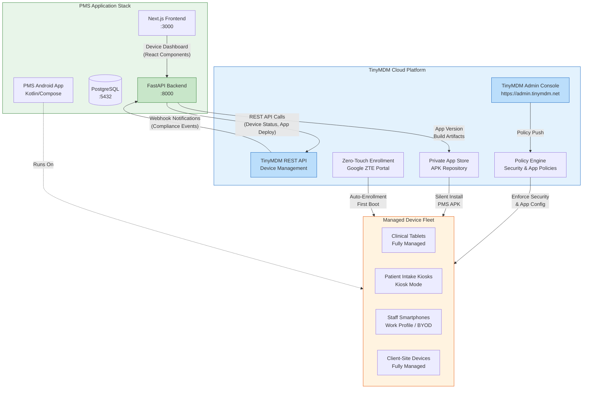

# Product Requirements Document: TinyMDM Integration into Patient Management System (PMS)

**Document ID:** PRD-PMS-TINYMDM-001
**Version:** 1.0
**Date:** 2026-03-10
**Author:** Ammar (CEO, MPS Inc.)
**Status:** Draft

---

## 1. Executive Summary

TinyMDM is a cloud-based Android Mobile Device Management (MDM) solution developed by Ars Nova Systems (France), designed to give IT administrators centralized control over enterprise Android device fleets. The platform provides app management (silent install/uninstall, private APK deployment, Play Store app whitelisting), kiosk mode (single-app and multi-app lockdown), security policy enforcement, zero-touch enrollment, remote wipe, location tracking, and a REST API for programmatic device management. TinyMDM is an official Android Enterprise Silver Partner, certified ISO/IEC 27001:2022, and supports Samsung Knox integration for enhanced hardware-level security on Samsung devices.

Integrating TinyMDM into the MPS Patient Management System enables centralized management of Android devices distributed to clinical staff and clients. MPS deploys a custom PMS Android app (Kotlin/Jetpack Compose) to tablets and smartphones used by ophthalmology staff for patient intake, encounter documentation, prescription management, and dermatoscopic image capture. Currently, app distribution relies on manual APK sideloading or Play Store internal testing tracks, with no centralized visibility into which devices run which app version, no ability to enforce security policies remotely, and no mechanism to lock devices into the PMS app in clinical settings. TinyMDM provides the missing device lifecycle management layer — from initial zero-touch enrollment through ongoing app updates to end-of-life remote wipe.

For MPS, TinyMDM is particularly valuable because the PMS Android app handles Protected Health Information (PHI) — patient demographics, encounter notes, medication records, and clinical images. Every device running the PMS app must enforce encryption at rest, screen lock policies, and app-level access controls. TinyMDM's kiosk mode ensures clinical tablets are locked to the PMS app (preventing staff from installing unauthorized apps that could leak PHI), while its silent app update capability ensures all devices run the latest security-patched version without requiring staff intervention. The REST API enables the PMS backend to query device compliance status, trigger app deployments, and maintain an audit trail of device management actions — all essential for HIPAA compliance.

## 2. Problem Statement

MPS clinical operations face several device management challenges:

1. **Unmanaged app distribution**: The PMS Android app is distributed via manual APK sideloading or Google Play internal testing tracks. There is no centralized dashboard showing which devices run which version, leading to version fragmentation — some devices may run outdated versions with known bugs or security vulnerabilities.

2. **No device compliance enforcement**: Devices used in clinical settings must enforce encryption, screen lock, and app restrictions per HIPAA requirements. Currently, compliance depends on staff following written policies with no technical enforcement. A lost unlocked device with cached patient data is a reportable HIPAA breach.

3. **Manual device provisioning**: Setting up a new clinical tablet requires 15-20 minutes of manual configuration — installing the PMS app, configuring Wi-Fi, setting screen lock policies, disabling unnecessary apps. This does not scale as MPS deploys devices to additional clinic locations and client sites.

4. **No remote management capability**: If a device is lost, stolen, or malfunctions, IT cannot remotely lock, wipe, or diagnose it. Staff must physically retrieve the device or wait for the next clinic visit.

5. **Client-distributed device oversight gap**: MPS distributes devices to client clinics (ophthalmology practices) that operate independently. MPS has no visibility into whether these devices remain compliant, whether the app is updated, or whether unauthorized apps have been installed alongside the PMS app.

6. **No audit trail for device lifecycle**: HIPAA requires documentation of how PHI-capable devices are provisioned, managed, and decommissioned. There is currently no automated audit trail for device management actions.

7. **Kiosk requirement for shared devices**: Clinical waiting room tablets used for patient intake must be locked to the PMS patient-facing module. Without kiosk mode, patients could access other apps, browse the internet, or inadvertently access clinical data.

## 3. Proposed Solution

### 3.1 Architecture Overview

### 3.2 Deployment Model

TinyMDM is a **cloud-hosted SaaS platform** — no self-hosting is required. All device management data is stored on TinyMDM's ISO 27001-certified infrastructure hosted in France (EU).

**Deployment characteristics:**
- **SaaS model**: Admin console at `admin.tinymdm.net`, REST API at TinyMDM API endpoints
- **Agent on devices**: TinyMDM agent app is installed on each managed Android device during enrollment
- **Integration via REST API**: PMS backend (FastAPI) communicates with TinyMDM REST API using API key authentication
- **No PHI in TinyMDM**: TinyMDM manages device configuration and app deployment only — no patient data flows through TinyMDM. PHI remains exclusively in the PMS stack (FastAPI ↔ PostgreSQL)
- **HIPAA compliance approach**: TinyMDM enforces device-level security policies (encryption, screen lock, app restrictions) that protect PHI stored on the device, but TinyMDM itself does not process or store PHI. A Business Associate Agreement (BAA) should be negotiated if TinyMDM's remote view or location tracking features could expose device screens containing PHI
- **Data residency**: TinyMDM data centers are in France; evaluate data residency requirements for US healthcare deployments

## 4. PMS Data Sources

TinyMDM integration touches PMS data indirectly — it manages the devices that access PMS data, not the data itself.

| PMS API | Relevance to TinyMDM Integration |
|---------|----------------------------------|
| **Patient Records API** (`/api/patients`) | Not directly accessed. TinyMDM ensures devices accessing this API are compliant (encrypted, screen-locked, authorized app version). |
| **Encounter Records API** (`/api/encounters`) | Not directly accessed. Device compliance status could be checked before allowing encounter creation from a device. |
| **Reporting API** (`/api/reports`) | Device fleet reports (version distribution, compliance rates, enrollment status) are surfaced through a new `/api/devices` endpoint that aggregates TinyMDM API data. |
| **New: Device Management API** (`/api/devices`) | New PMS API endpoint that proxies TinyMDM REST API calls, caches device status in PostgreSQL, and provides device compliance data to the frontend dashboard. |

## 5. Component/Module Definitions

### 5.1 TinyMDM API Client (`pms-backend/services/tinymdm_client.py`)

- **Description**: Python wrapper around TinyMDM REST API with authentication, rate limiting, and error handling
- **Input**: API key credentials, device identifiers, policy configurations
- **Output**: Device status, enrollment data, compliance reports
- **PMS APIs used**: None (external API client)

### 5.2 Device Management Service (`pms-backend/services/device_service.py`)

- **Description**: Business logic layer that orchestrates device lifecycle operations — enrollment tracking, compliance monitoring, app deployment triggers, and audit logging
- **Input**: Device events from TinyMDM webhooks, admin commands from frontend
- **Output**: Device records in PostgreSQL, compliance alerts, audit log entries
- **PMS APIs used**: `/api/devices` (new), `/api/reports`

### 5.3 Device Compliance Monitor (`pms-backend/tasks/compliance_monitor.py`)

- **Description**: Scheduled task (APScheduler) that polls TinyMDM API for device compliance status, flags non-compliant devices, and optionally blocks PMS API access from non-compliant devices
- **Input**: TinyMDM device list with policy compliance status
- **Output**: Compliance status updates in PostgreSQL, alert notifications
- **PMS APIs used**: `/api/devices`

### 5.4 App Deployment Pipeline (`pms-backend/services/app_deployer.py`)

- **Description**: Automates PMS Android app deployment through TinyMDM — uploads new APK versions to TinyMDM private app store, triggers silent install on target device groups, and tracks rollout progress
- **Input**: APK build artifacts (from CI/CD), target device group, rollout strategy
- **Output**: Deployment status, per-device install confirmation
- **PMS APIs used**: `/api/devices`

### 5.5 Device Dashboard (Next.js Frontend)

- **Description**: Admin dashboard page in the PMS frontend showing device fleet overview — enrollment status, app versions, compliance status, location (if enabled), and remote action buttons (lock, wipe, push update)
- **Input**: Device data from `/api/devices` endpoint
- **Output**: Interactive dashboard with device list, compliance charts, and action controls
- **PMS APIs used**: `/api/devices`

### 5.6 Device Enrollment Configuration

- **Description**: Pre-configured TinyMDM enrollment profiles for each device category — clinical tablets (fully managed + kiosk), staff smartphones (work profile / BYOD), client-site devices (fully managed), and patient intake kiosks (single-app kiosk mode)
- **Input**: Device category selection during enrollment
- **Output**: Enrolled device with correct policy, app set, and restrictions applied

## 6. Non-Functional Requirements

### 6.1 Security and HIPAA Compliance

| Requirement | Implementation |
|-------------|---------------|
| **Device encryption** | TinyMDM enforces Android encryption at rest on all enrolled devices (mandatory during enrollment for Android 7+) |
| **Screen lock policy** | Minimum 6-digit PIN or biometric required; auto-lock after 2 minutes of inactivity |
| **App restrictions** | Only whitelisted apps allowed on fully managed devices; kiosk mode for patient-facing tablets |
| **Remote wipe** | Immediate remote wipe capability for lost/stolen devices via TinyMDM console or API |
| **PHI isolation** | TinyMDM manages device policies only — no PHI transits TinyMDM infrastructure. PMS app stores PHI in encrypted local storage synced to PostgreSQL |
| **Audit logging** | All device management actions (enrollment, policy change, wipe, app install) logged in PostgreSQL with timestamp, actor, and action details |
| **BAA consideration** | Negotiate BAA with TinyMDM if remote view feature is used (screen contents may contain PHI) |
| **Network security** | TinyMDM API communication over TLS 1.2+; API key stored in environment variables, never in code |
| **ISO 27001** | TinyMDM is certified ISO/IEC 27001:2022 for its entire operations including hosting |

### 6.2 Performance

| Metric | Target |
|--------|--------|
| Device status sync latency | < 5 minutes (polling interval) |
| App deployment initiation | < 30 seconds from API call to device notification |
| Dashboard load time | < 2 seconds for fleet of up to 500 devices |
| Compliance check execution | < 10 seconds for full fleet scan |
| API response time (TinyMDM) | < 500ms per request |

### 6.3 Infrastructure

| Requirement | Details |
|-------------|---------|
| **TinyMDM subscription** | Professional plan (~$2.40/device/month) for API access and all features |
| **No additional servers** | TinyMDM is fully cloud-hosted; integration code runs within existing PMS backend |
| **Database additions** | New PostgreSQL tables: `devices`, `device_compliance_logs`, `device_audit_logs`, `app_deployments` |
| **CI/CD integration** | APK upload to TinyMDM private app store as post-build step in Android CI pipeline |
| **Network requirements** | Outbound HTTPS from PMS backend to TinyMDM API; managed devices need internet access for policy sync |

## 7. Implementation Phases

### Phase 1: Foundation (Sprints 1-2, ~4 weeks)

- Set up TinyMDM account and configure organization structure (device groups for clinic tablets, staff phones, client devices, kiosks)
- Implement TinyMDM REST API client in Python with authentication, error handling, and retry logic
- Create PostgreSQL schema for device tracking tables
- Enroll 3-5 test devices using QR code enrollment method
- Configure base security policy (encryption, screen lock, app whitelist)
- Create `/api/devices` endpoint with basic CRUD operations

### Phase 2: Core Integration (Sprints 3-4, ~4 weeks)

- Implement kiosk mode profiles for patient intake tablets (single-app PMS)
- Build app deployment pipeline — upload APK to TinyMDM, trigger silent install, track rollout
- Implement compliance monitoring scheduled task with alerting
- Build Next.js Device Dashboard with fleet overview, device details, and compliance status
- Configure zero-touch enrollment for new device provisioning
- Set up webhook receiver for real-time device event notifications

### Phase 3: Advanced Features (Sprints 5-6, ~4 weeks)

- Implement conditional PMS API access — block API requests from non-compliant devices (device token validation)
- Build automated app update pipeline integrated with Android CI/CD (GitHub Actions → TinyMDM)
- Add device location tracking dashboard (opt-in, with privacy policy)
- Implement client-site device management workflows (remote diagnostics, app version enforcement)
- Build device lifecycle reports for HIPAA audit documentation
- Configure Samsung Knox integration for Samsung device fleet (hardware-backed security)

## 8. Success Metrics

| Metric | Target | Measurement Method |
|--------|--------|--------------------|
| Device enrollment coverage | 100% of MPS-distributed devices enrolled within 30 days | TinyMDM device count vs. inventory list |
| App version compliance | 95%+ devices on latest PMS app version within 48 hours of release | TinyMDM API app version report |
| Device policy compliance | 98%+ devices passing all security policies at any time | Compliance monitor dashboard |
| Provisioning time | < 5 minutes from unboxing to fully configured device (zero-touch) | Timed enrollment tests |
| Incident response time | < 15 minutes to remotely lock/wipe a reported lost device | Incident response drill |
| Manual IT effort reduction | 80% reduction in device setup and management time | IT time tracking before/after |
| HIPAA audit readiness | Complete device lifecycle audit trail available on demand | Audit documentation review |

## 9. Risks and Mitigations

| Risk | Impact | Mitigation |
|------|--------|------------|
| **TinyMDM service outage** | Devices continue operating with last-synced policies, but no remote management | Implement local policy cache; critical actions (wipe) have 24h SLA from TinyMDM |
| **API rate limiting** | Large fleet operations (mass app update) may be throttled | Implement batch operations with exponential backoff; stagger rollouts |
| **Data residency concerns** | TinyMDM servers in France; US healthcare may require US data residency | Evaluate — TinyMDM manages device config, not PHI; document in HIPAA risk assessment |
| **Vendor lock-in** | Migration to another MDM requires re-enrolling all devices | Abstract MDM operations behind PMS service layer; maintain device inventory in PostgreSQL |
| **Staff resistance to device lockdown** | Clinical staff may resist kiosk mode or app restrictions | Phased rollout with staff training; configure work profile (BYOD) for personal devices |
| **Android version fragmentation** | Older Android devices may not support all TinyMDM features | Set minimum Android 10 requirement for new enrollments; inventory existing devices |
| **BAA negotiation** | TinyMDM may not offer BAA, limiting remote view feature use | Disable remote view feature if BAA unavailable; use alternative remote support tools |
| **Network dependency** | Devices without internet cannot sync policies or receive updates | Configure offline grace period; alert on devices not synced for >24 hours |

## 10. Dependencies

| Dependency | Type | Notes |
|------------|------|-------|
| **TinyMDM Professional subscription** | Service | Required for REST API access; ~$2.40/device/month |
| **TinyMDM REST API** | API | Device management endpoints; API key authentication |
| **Google Zero-Touch Enrollment portal** | Service | Required for zero-touch enrollment; devices must be purchased from authorized reseller |
| **Android Enterprise** | Platform | Required for work profile and fully managed device modes |
| **PMS Backend (FastAPI)** | Internal | Hosts TinyMDM API client, device service, and compliance monitor |
| **PostgreSQL** | Internal | Stores device records, compliance logs, audit trail |
| **PMS Android App** | Internal | The app being managed and distributed via TinyMDM |
| **Android CI/CD pipeline** | Internal | Produces APK artifacts for TinyMDM deployment |
| **Samsung Knox** (optional) | Platform | Enhanced hardware security for Samsung devices |

## 11. Comparison with Existing Experiments

| Aspect | TinyMDM (Exp 72) | RingCentral API (Exp 71) | OnTime 360 API (Exp 67) |
|--------|-------------------|--------------------------|-------------------------|
| **Category** | Device management & security | Unified communications | Courier/delivery logistics |
| **Primary value** | Secure app distribution, device compliance | Patient communication (SMS, voice, fax, video) | Specimen/supply delivery tracking |
| **PHI exposure** | Indirect — manages devices that access PHI | Direct — messages may contain PHI | Indirect — delivery metadata only |
| **Integration pattern** | REST API + scheduled polling + webhooks | REST API + webhooks + SDK | REST API + webhooks |
| **HIPAA relevance** | Device-level security enforcement | Communication channel compliance | Chain of custody documentation |
| **Complementary?** | Yes — TinyMDM secures the devices that run the PMS app used for RingCentral calls and OnTime tracking | Yes — RingCentral runs on TinyMDM-managed devices | Yes — OnTime tracking app deployed via TinyMDM |

TinyMDM is foundational infrastructure that supports all other PMS experiments. Every Android-based integration (RingCentral for calls, Azure Document Intelligence for document scanning, patient intake forms) runs on devices that TinyMDM manages. TinyMDM does not compete with other experiments — it secures and manages the hardware layer they depend on.

## 12. Research Sources

### Official Documentation
- [TinyMDM Official Website](https://www.tinymdm.net/) — Product overview, feature descriptions, and pricing
- [TinyMDM REST API Documentation](https://www.tinymdm.net/mobile-device-management/api/) — API endpoints for programmatic device management
- [TinyMDM Features Overview](https://www.tinymdm.net/features/) — Complete feature list including kiosk mode, app management, security

### Security & Compliance
- [TinyMDM ISO 27001 Certification](https://www.tinymdm.net/tinymdm-achieves-iso-27001-certification/) — ISO/IEC 27001:2022 certification details
- [TinyMDM Data Security](https://www.tinymdm.net/data-security/) — Data protection and information security practices
- [TinyMDM Android Encryption](https://www.tinymdm.net/android-encryption-mdm/) — Device encryption enforcement documentation

### Enrollment & Deployment
- [TinyMDM Enrollment Methods](https://www.tinymdm.net/features/enrollment-methods/) — QR code, zero-touch, and Knox Mobile Enrollment options
- [TinyMDM Zero-Touch Setup](https://www.tinymdm.net/how-to/setup-zero-touch-enrollment/) — Zero-touch enrollment configuration guide
- [TinyMDM Kiosk Mode](https://www.tinymdm.net/features/kiosk-mode/) — Single-app and multi-app kiosk mode documentation

### Ecosystem & Adoption
- [TinyMDM on Samsung Knox](https://www.samsungknox.com/en/partner-solutions/tinymdm) — Samsung Knox partnership and integration details
- [TinyMDM G2 Reviews](https://www.g2.com/products/tinymdm/reviews) — User reviews and ratings for market validation

## 13. Appendix: Related Documents

- [TinyMDM Setup Guide](72-TinyMDM-PMS-Developer-Setup-Guide.md) — Step-by-step developer setup for TinyMDM PMS integration
- [TinyMDM Developer Tutorial](72-TinyMDM-Developer-Tutorial.md) — Hands-on onboarding tutorial for building TinyMDM integrations
- [TinyMDM Official Documentation](https://www.tinymdm.net/help-resources/) — Help resources and knowledge base
- [TinyMDM API Reference](https://www.tinymdm.net/mobile-device-management/api/) — REST API documentation
