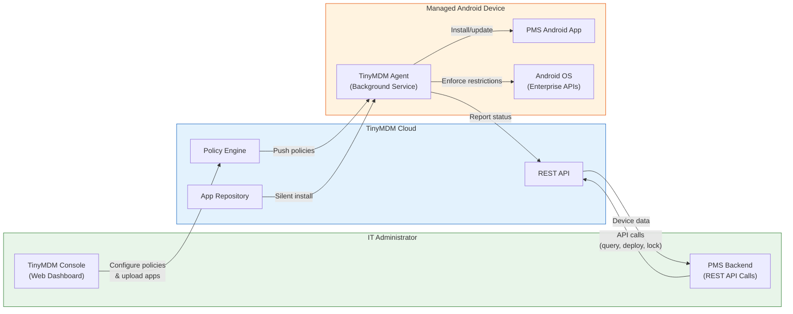
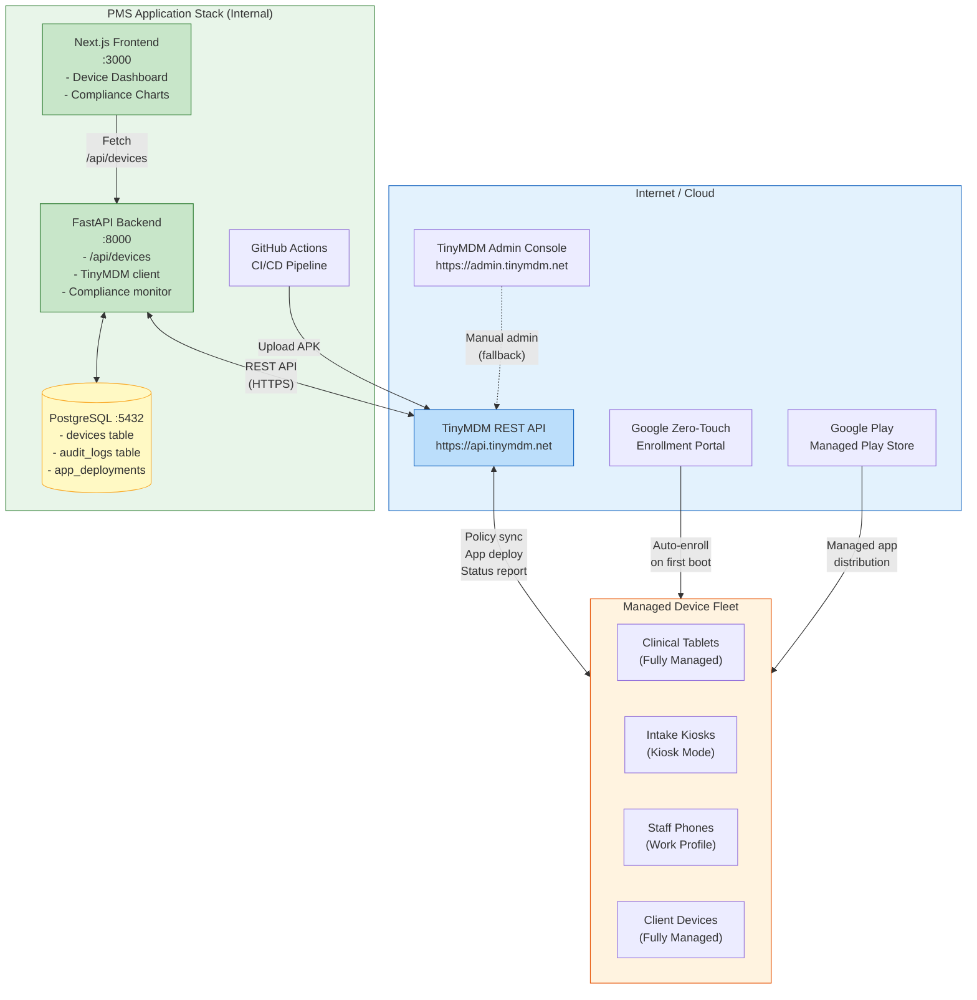

# TinyMDM Developer Onboarding Tutorial

**Welcome to the MPS PMS TinyMDM Integration Team**

This tutorial will take you from zero to building your first TinyMDM integration with the PMS. By the end, you will understand how TinyMDM works, have a running local environment, and have built and tested a custom device management integration end-to-end.

**Document ID:** PMS-EXP-TINYMDM-002
**Version:** 1.0
**Date:** 2026-03-10
**Applies To:** PMS project (all platforms)
**Prerequisite:** [TinyMDM Setup Guide](72-TinyMDM-PMS-Developer-Setup-Guide.md)
**Estimated time:** 2-3 hours
**Difficulty:** Beginner-friendly

---

## What You Will Learn

1. What Mobile Device Management (MDM) is and why MPS needs it for managing clinical Android devices
2. How TinyMDM's architecture works — cloud console, REST API, device agent, and policy engine
3. How TinyMDM fits into the PMS stack alongside FastAPI, Next.js, PostgreSQL, and the Android app
4. How to enroll an Android device into TinyMDM using QR code enrollment
5. How to use the TinyMDM REST API to query devices, push policies, and trigger app installations
6. How to build a PMS backend service that syncs device data and enforces compliance
7. How to deploy the PMS Android APK silently to managed devices
8. How to configure kiosk mode for patient intake tablets
9. How to build compliance monitoring with automated alerting
10. HIPAA security considerations for managing PHI-capable devices

---

## Part 1: Understanding TinyMDM (15 min read)

### 1.1 What Problem Does TinyMDM Solve?

MPS distributes Android tablets and smartphones to clinical staff and client ophthalmology practices. These devices run the PMS Android app, which handles Protected Health Information (PHI) — patient records, encounter notes, medication data, and clinical images.

**Without MDM (current state):**
- New devices require 15-20 minutes of manual setup (installing PMS app, configuring Wi-Fi, setting policies)
- No way to know which devices run which PMS app version — version fragmentation leads to bugs and support overhead
- Lost or stolen devices with cached patient data cannot be remotely wiped — a HIPAA breach waiting to happen
- Patient intake tablets in waiting rooms can be used to browse the internet or access other apps
- Client-site devices operate with zero visibility — MPS cannot verify compliance remotely
- No audit trail for device lifecycle events (who enrolled it, what was installed, when it was last seen)

**With TinyMDM:**
- Zero-touch enrollment: new devices auto-configure on first boot
- Silent app deployment: push PMS app updates to all devices simultaneously
- Kiosk mode: lock patient intake tablets to the PMS app only
- Remote lock/wipe: immediately secure a lost device
- Compliance monitoring: verify all devices enforce encryption, screen lock, and app restrictions
- Full audit trail: every device action logged for HIPAA documentation

### 1.2 How TinyMDM Works — The Key Pieces



**Three key concepts:**

1. **Policy Engine**: You define security policies (encryption required, screen lock, app whitelist) and assign them to device groups. The policy engine pushes these to devices automatically.

2. **Device Agent**: A background service on each Android device that receives policy updates, enforces restrictions through Android Enterprise APIs, and reports device status back to the cloud.

3. **REST API**: Programmatic access to everything — query device lists, trigger app installs, lock/wipe devices, read compliance status. This is how the PMS backend integrates with TinyMDM.

### 1.3 How TinyMDM Fits with Other PMS Technologies

| Technology | Experiment | Relationship to TinyMDM |
|------------|-----------|------------------------|
| RingCentral API | Exp 71 | RingCentral calls/SMS run on TinyMDM-managed staff phones — TinyMDM ensures the phone is encrypted and the RingCentral app is installed |
| Azure Document Intelligence | Exp 69 | Document scanning happens on TinyMDM-managed tablets — TinyMDM ensures the camera is available and the app is up-to-date |
| LigoLab LIS | Exp 70 | Lab results viewed on TinyMDM-managed clinical tablets — TinyMDM enforces screen lock so unattended tablets don't expose lab data |
| MS Teams | Exp 68 | Teams notifications on TinyMDM-managed staff phones — TinyMDM manages the work profile that isolates Teams from personal apps |
| OnTime 360 | Exp 67 | Delivery tracking on TinyMDM-managed courier devices — TinyMDM provides location tracking and kiosk mode for delivery tablets |

TinyMDM is the **device infrastructure layer** — it manages the hardware that runs all other PMS integrations.

### 1.4 Key Vocabulary

| Term | Meaning |
|------|---------|
| **MDM** | Mobile Device Management — centralized management of mobile device fleets |
| **Android Enterprise** | Google's framework for managing Android devices in business contexts; TinyMDM uses this under the hood |
| **Fully Managed Device** | A device entirely controlled by the organization — all apps, settings, and policies managed centrally |
| **Work Profile** | A containerized partition on a personal device (BYOD) that separates work apps/data from personal |
| **Kiosk Mode** | Locks a device to one or more specific apps — users cannot exit to the home screen or access settings |
| **Zero-Touch Enrollment (ZTE)** | Devices auto-enroll into MDM on first boot — no manual QR code scanning needed |
| **Silent Install** | Installing or updating an app on a device without requiring user interaction or approval |
| **Device Policy Controller (DPC)** | The agent app (TinyMDM) that enforces policies via Android Enterprise APIs on the device |
| **APK** | Android Package Kit — the file format for distributing Android apps; TinyMDM hosts private APKs |
| **Compliance Policy** | A set of rules (encryption required, screen lock, app whitelist) that a device must meet to be considered compliant |
| **Remote Wipe** | Factory-resetting a device remotely — erases all data including cached PHI |
| **BAA** | Business Associate Agreement — a HIPAA requirement for vendors that may access PHI |

### 1.5 Our Architecture



---

## Part 2: Environment Verification (15 min)

### 2.1 Checklist

Verify each of the following before proceeding:

1. **PMS Backend running:**
```bash
curl -s http://localhost:8000/health
# Expected: {"status": "healthy"}
```

2. **PMS Frontend running:**
```bash
curl -s -o /dev/null -w "%{http_code}" http://localhost:3000
# Expected: 200
```

3. **PostgreSQL accessible:**
```bash
psql -U pms -d pms_db -c "SELECT COUNT(*) FROM devices;"
# Expected: count (0 if fresh setup)
```

4. **TinyMDM API key configured:**
```bash
echo $TINYMDM_API_KEY | head -c 8
# Expected: First 8 characters of your API key (not empty)
```

5. **TinyMDM API reachable:**
```bash
curl -s -o /dev/null -w "%{http_code}" \
  -H "Authorization: Bearer $TINYMDM_API_KEY" \
  "$TINYMDM_API_BASE_URL/devices"
# Expected: 200
```

6. **Test Android device available:**
   - Physical Android device (Android 10+) factory-reset and ready for enrollment
   - OR enrolled device from the Setup Guide

### 2.2 Quick Test

Run the full stack test — sync devices from TinyMDM and verify they appear in the PMS:

```bash
# Sync devices
curl -s -X POST http://localhost:8000/api/devices/sync | python -m json.tool
# Expected: {"synced_devices": N}  (N >= 1 if you have enrolled devices)

# List devices in PMS
curl -s http://localhost:8000/api/devices/ | python -m json.tool
# Expected: JSON array of device objects

# Open frontend dashboard
open http://localhost:3000/admin/devices
# Expected: Device Management page with your devices listed
```

If all checks pass, your environment is ready.

---

## Part 3: Build Your First Integration (45 min)

### 3.1 What We Are Building

We will build an **Automated App Deployment Pipeline** that:

1. Accepts a new PMS APK version via a REST endpoint
2. Uploads it to TinyMDM's private app store
3. Triggers silent installation on a target device group
4. Tracks deployment progress per device
5. Logs the deployment in the PMS audit trail

This is the core workflow MPS needs — when a new PMS Android app version is built by CI/CD, it should automatically deploy to all managed devices without manual intervention.

### 3.2 Create the Deployment Service

```python
# pms-backend/services/app_deployer.py

import logging
from datetime import datetime, timezone
from sqlalchemy.ext.asyncio import AsyncSession

from pms.services.tinymdm_client import TinyMDMClient
from pms.models.device import AppDeployment, DeviceAuditLog, DeviceGroup

logger = logging.getLogger(__name__)


class AppDeployer:
    """Manages PMS Android app deployments via TinyMDM."""

    def __init__(self, tinymdm: TinyMDMClient):
        self.tinymdm = tinymdm

    async def deploy_to_group(
        self,
        session: AsyncSession,
        apk_version: str,
        target_group: DeviceGroup,
        initiated_by: str = "ci-pipeline",
    ) -> AppDeployment:
        """Deploy a new app version to all devices in a group."""

        # 1. Get devices in the target group
        devices = await self.tinymdm.list_devices(group_id=target_group.value)
        total = len(devices)
        logger.info(f"Deploying v{apk_version} to {total} devices in {target_group.value}")

        # 2. Create deployment record
        deployment = AppDeployment(
            app_version=apk_version,
            target_group=target_group,
            total_devices=str(total),
            installed_count="0",
            status="in_progress",
            initiated_by=initiated_by,
        )
        session.add(deployment)
        await session.flush()

        # 3. Trigger silent install on each device
        installed = 0
        for device in devices:
            try:
                await self.tinymdm.install_app(
                    device_id=device["id"],
                    app_id="com.mps.pms",
                )
                installed += 1

                # Audit log per device
                log = DeviceAuditLog(
                    device_id=device["id"],
                    action="app_install_triggered",
                    actor=initiated_by,
                    details=f"PMS app v{apk_version} install triggered",
                )
                session.add(log)

            except Exception as e:
                logger.error(f"Failed to deploy to device {device['id']}: {e}")

        # 4. Update deployment record
        deployment.installed_count = str(installed)
        if installed == total:
            deployment.status = "completed"
            deployment.completed_at = datetime.now(timezone.utc)
        elif installed > 0:
            deployment.status = "partial"
        else:
            deployment.status = "failed"

        await session.commit()
        logger.info(
            f"Deployment v{apk_version}: {installed}/{total} devices triggered "
            f"(status: {deployment.status})"
        )
        return deployment
```

### 3.3 Create the Deployment API Endpoint

```python
# Add to pms-backend/routers/devices.py

from pms.services.app_deployer import AppDeployer
from pms.models.device import DeviceGroup

app_deployer = AppDeployer(tinymdm)


@router.post("/deploy")
async def deploy_app(
    version: str,
    group: str = "PMS-Clinical-Tablets",
    session: AsyncSession = Depends(get_session),
):
    """Deploy a new PMS app version to a device group.

    This endpoint is called by CI/CD after a successful Android build.
    """
    try:
        target_group = DeviceGroup(group)
    except ValueError:
        raise HTTPException(
            status_code=400,
            detail=f"Invalid group: {group}. Valid groups: {[g.value for g in DeviceGroup]}",
        )

    deployment = await app_deployer.deploy_to_group(
        session=session,
        apk_version=version,
        target_group=target_group,
        initiated_by="api",
    )

    return {
        "deployment_id": str(deployment.id),
        "version": deployment.app_version,
        "target_group": deployment.target_group.value,
        "total_devices": deployment.total_devices,
        "installed_count": deployment.installed_count,
        "status": deployment.status,
    }


@router.get("/deployments")
async def list_deployments(session: AsyncSession = Depends(get_session)):
    """List all app deployments."""
    result = await session.execute(
        session.query(AppDeployment).order_by(AppDeployment.created_at.desc()).limit(20)
    )
    return result.scalars().all()
```

### 3.4 Test the Deployment Pipeline

```bash
# Deploy PMS app v2.1.0 to clinical tablets
curl -s -X POST "http://localhost:8000/api/devices/deploy?version=2.1.0&group=PMS-Clinical-Tablets" \
  | python -m json.tool

# Expected response:
# {
#   "deployment_id": "uuid-here",
#   "version": "2.1.0",
#   "target_group": "PMS-Clinical-Tablets",
#   "total_devices": "3",
#   "installed_count": "3",
#   "status": "completed"
# }

# List deployment history
curl -s http://localhost:8000/api/devices/deployments | python -m json.tool
```

### 3.5 Add Deployment Status to Frontend

```tsx
// Add to pms-frontend/app/admin/devices/page.tsx

interface Deployment {
  deployment_id: string;
  version: string;
  target_group: string;
  total_devices: string;
  installed_count: string;
  status: string;
  created_at: string;
}

// Add deployment history section to the dashboard:
const [deployments, setDeployments] = useState<Deployment[]>([]);

useEffect(() => {
  fetch(`${API_BASE}/api/devices/deployments`)
    .then((res) => res.json())
    .then(setDeployments);
}, []);

// Render deployment history table:
// <h2>Recent Deployments</h2>
// <table>
//   <thead><tr><th>Version</th><th>Group</th><th>Progress</th><th>Status</th></tr></thead>
//   <tbody>
//     {deployments.map(d => (
//       <tr key={d.deployment_id}>
//         <td>{d.version}</td>
//         <td>{d.target_group}</td>
//         <td>{d.installed_count}/{d.total_devices}</td>
//         <td>{d.status}</td>
//       </tr>
//     ))}
//   </tbody>
// </table>
```

### 3.6 Add CI/CD Integration

Add this step to your GitHub Actions Android build workflow:

```yaml
# .github/workflows/android-build.yml (add after build step)

  - name: Deploy to TinyMDM
    if: github.ref == 'refs/heads/main'
    run: |
      # Upload APK to TinyMDM (via PMS backend)
      curl -s -X POST \
        "${{ secrets.PMS_BACKEND_URL }}/api/devices/deploy?version=${{ env.APP_VERSION }}&group=PMS-Clinical-Tablets" \
        -H "Authorization: Bearer ${{ secrets.PMS_API_TOKEN }}"
```

**Checkpoint:** You have built a complete app deployment pipeline — from API endpoint to TinyMDM silent install to frontend status tracking to CI/CD integration.

---

## Part 4: Evaluating Strengths and Weaknesses (15 min)

### 4.1 Strengths

- **Simplicity**: TinyMDM is designed to be simple. The admin console is intuitive, the API is straightforward, and the documentation is clear. Unlike enterprise MDM solutions (VMware Workspace ONE, Microsoft Intune), TinyMDM doesn't overwhelm with features MPS doesn't need.
- **Android-first**: Purpose-built for Android, not a cross-platform MDM trying to manage iOS/Windows/macOS too. Deep Android Enterprise integration, Samsung Knox support, and full kiosk mode capabilities.
- **Affordable**: Starting at ~$2.40/device/month (Professional plan), TinyMDM is significantly cheaper than enterprise alternatives ($5-15/device/month for Intune, Workspace ONE).
- **REST API**: Full programmatic access enables PMS backend integration without relying on the admin console for day-to-day operations.
- **ISO 27001 certified**: Provides a compliance baseline that supports HIPAA security requirements.
- **Zero-touch enrollment**: New devices auto-configure on first boot — critical for scaling device deployments to client sites.
- **Private APK support**: Can deploy apps outside of Google Play — essential for MPS's private healthcare app.

### 4.2 Weaknesses

- **Android-only**: No iOS or Windows support. If MPS ever needs to manage iPads or Windows tablets, a different MDM will be needed for those platforms.
- **Smaller vendor**: TinyMDM (Ars Nova Systems) is a small French company compared to VMware, Microsoft, or Google. Evaluate vendor risk for long-term dependency.
- **No explicit HIPAA certification**: TinyMDM has ISO 27001 but does not explicitly advertise HIPAA compliance or BAA availability. This requires direct negotiation.
- **EU data residency**: Data stored in France — may require additional evaluation for US healthcare data residency requirements (though TinyMDM manages device config, not PHI).
- **API documentation depth**: The REST API documentation is functional but less comprehensive than enterprise alternatives. Some endpoints may require trial-and-error.
- **Limited advanced analytics**: Fleet-wide analytics and reporting are basic compared to enterprise MDM dashboards.

### 4.3 When to Use TinyMDM vs Alternatives

| Scenario | Recommendation |
|----------|---------------|
| Android-only fleet, < 500 devices | **TinyMDM** — best simplicity/cost ratio |
| Mixed Android + iOS fleet | **Hexnode** or **Scalefusion** — cross-platform support |
| Enterprise with 1000+ devices | **VMware Workspace ONE** or **Microsoft Intune** — enterprise scale |
| Need explicit HIPAA BAA from vendor | **Microsoft Intune** — established BAA process |
| Budget-conscious, Android kiosk focus | **TinyMDM** — purpose-built for this use case |
| Already using Microsoft 365 | **Microsoft Intune** — bundled licensing |
| Samsung device fleet | **TinyMDM** — strong Samsung Knox integration |

### 4.4 HIPAA / Healthcare Considerations

| HIPAA Requirement | TinyMDM Coverage | Gap / Action Needed |
|-------------------|-------------------|---------------------|
| **Encryption at rest** | Enforces Android device encryption on enrollment | Covered |
| **Access controls** | Screen lock policies, app restrictions, kiosk mode | Covered |
| **Audit controls** | Device management actions logged | Supplement with PMS-side audit logging |
| **Transmission security** | TLS for all API and device communication | Covered |
| **Device disposition** | Remote wipe capability for decommissioned/lost devices | Covered |
| **Business Associate Agreement** | Not explicitly offered | Negotiate BAA before production use |
| **Data residency** | Servers in France (EU) | Evaluate if US data residency required — note: TinyMDM stores device config, not PHI |
| **Breach notification** | ISO 27001 requires incident response | Verify TinyMDM's breach notification timeline |
| **Minimum necessary** | TinyMDM only accesses device metadata, not PHI | Covered by design |

**Key recommendation**: Disable TinyMDM's remote view feature unless a BAA is in place, as screen contents may display PHI.

---

## Part 5: Debugging Common Issues (15 min read)

### Issue 1: Device Shows "Pending" in TinyMDM Console

**Symptom:** Device enrolled but status stuck on "Pending" for hours.

**Cause:** The TinyMDM agent on the device cannot reach TinyMDM servers — usually a network issue.

**Fix:**
1. Check device Wi-Fi connection
2. Verify no proxy or firewall blocking `*.tinymdm.net`
3. Open TinyMDM agent on device → Settings → Force Sync
4. If persists, check Android battery optimization — ensure TinyMDM agent is excluded

### Issue 2: App Install Succeeds via API but App Not on Device

**Symptom:** API returns 200 for install command but the app never appears on the device.

**Cause:** Device may be offline, or the device's managed Google Play is not synced.

**Fix:**
1. Check device last seen time in TinyMDM console
2. Verify device has internet access
3. Force a Google Play sync: Settings → Apps → Google Play Store → Force Stop → Reopen
4. Check device storage — insufficient space silently fails
5. View TinyMDM logs: Console → Device → Logs

### Issue 3: Kiosk Mode Exited Unexpectedly

**Symptom:** Patient intake tablet shows Android home screen instead of PMS kiosk.

**Cause:** Android system update may have interrupted kiosk mode, or the PMS app crashed.

**Fix:**
1. Check if PMS app crashed: TinyMDM Console → Device → App Status
2. Force policy re-sync from TinyMDM Console
3. If the PMS app crashes repeatedly in kiosk mode, check app logs (logcat)
4. Verify the kiosk policy still has the correct app selected

### Issue 4: Compliance Monitor Reports False Positives

**Symptom:** Devices reported as non-compliant when they appear to meet all policies.

**Cause:** Stale data — the local PMS database hasn't synced with TinyMDM recently.

**Fix:**
1. Trigger a manual sync: `curl -X POST http://localhost:8000/api/devices/sync`
2. Check the compliance monitor scheduling — ensure it's running every 5 minutes
3. Verify the compliance criteria in your code match the TinyMDM policy definitions
4. Check TinyMDM API response for the specific compliance violations reported

### Issue 5: API Rate Limiting During Bulk Operations

**Symptom:** `429 Too Many Requests` errors when deploying to many devices simultaneously.

**Cause:** TinyMDM API has rate limits — bulk operations exceed the per-minute threshold.

**Fix:**
1. Implement exponential backoff in the TinyMDM client
2. Add a delay between per-device API calls (e.g., 200ms)
3. Use batch endpoints if available (check TinyMDM API docs)
4. Stagger deployments by device group instead of deploying to all groups simultaneously

### Issue 6: Zero-Touch Enrollment Not Triggering

**Symptom:** New device boots to normal Android setup instead of TinyMDM enrollment.

**Cause:** Device not registered in Google Zero-Touch Enrollment portal, or purchased from non-authorized reseller.

**Fix:**
1. Verify the device IMEI is registered in the [Google Zero-Touch Portal](https://partner.android.com/zerotouch)
2. Confirm the device was purchased from a Google-authorized reseller
3. Check that the ZTE configuration points to TinyMDM as the DPC
4. As a fallback, use QR code enrollment

---

## Part 6: Practice Exercise (45 min)

### Option A: Build a Device Health Dashboard Widget

Build a React component that shows a real-time device health overview on the PMS main dashboard:

- Green/yellow/red indicators for each device group
- Count of devices per compliance status
- Last sync timestamp
- Auto-refresh every 60 seconds

**Hints:**
1. Create a new component at `pms-frontend/components/DeviceHealthWidget.tsx`
2. Use the `/api/devices/compliance/summary` endpoint
3. Use `setInterval` for auto-refresh (remember to clear on unmount)
4. Color thresholds: green > 95% compliant, yellow > 80%, red < 80%

### Option B: Build an App Version Drift Detector

Create a backend service that identifies devices running outdated PMS app versions:

- Compare each device's app version against the latest deployed version
- Generate a report of outdated devices grouped by how many versions behind
- Send a Slack/email alert if any device is more than 2 versions behind

**Hints:**
1. Create `pms-backend/services/version_drift.py`
2. Use the `/api/devices` endpoint to get all device app versions
3. Use semantic versioning comparison (`packaging.version.parse`)
4. Store the latest version in a config table or environment variable

### Option C: Build a Device Enrollment Onboarding Flow

Create a Next.js page that generates device enrollment instructions for different scenarios:

- Select device type (clinical tablet, kiosk, staff phone, client device)
- Display the correct TinyMDM enrollment QR code (fetched from API)
- Show step-by-step setup instructions specific to the selected device type
- Print-friendly layout for inclusion in device packaging

**Hints:**
1. Create `pms-frontend/app/admin/devices/enroll/page.tsx`
2. Use a step wizard component (multi-step form)
3. Fetch QR code from TinyMDM API or embed as static image
4. Use `@media print` CSS for print layout

---

## Part 7: Development Workflow and Conventions

### 7.1 File Organization

```
pms-backend/
├── services/
│   ├── tinymdm_client.py       # TinyMDM REST API client
│   ├── device_service.py        # Device management business logic
│   └── app_deployer.py          # App deployment pipeline
├── routers/
│   └── devices.py               # /api/devices endpoints
├── models/
│   └── device.py                # Device, DeviceAuditLog, AppDeployment models
├── tasks/
│   └── compliance_monitor.py    # Scheduled compliance checking
└── tests/
    └── test_devices.py          # Device management tests

pms-frontend/
├── lib/api/
│   └── devices.ts               # Device API client functions
├── app/admin/devices/
│   ├── page.tsx                 # Device dashboard page
│   └── enroll/
│       └── page.tsx             # Device enrollment page
└── components/
    └── DeviceHealthWidget.tsx    # Reusable device health component
```

### 7.2 Naming Conventions

| Item | Convention | Example |
|------|-----------|---------|
| TinyMDM API client methods | `snake_case`, verb-first | `list_devices()`, `lock_device()` |
| API endpoints | REST conventions, `/api/devices/` prefix | `POST /api/devices/{id}/lock` |
| Database models | PascalCase, singular | `Device`, `DeviceAuditLog` |
| Database tables | snake_case, plural | `devices`, `device_audit_logs` |
| Frontend API functions | camelCase, `fetch`/`create`/`update` prefix | `fetchDevices()`, `lockDevice()` |
| TypeScript interfaces | PascalCase, singular | `Device`, `ComplianceSummary` |
| Device groups | `PMS-{Category}-{Type}` | `PMS-Clinical-Tablets` |
| Environment variables | `TINYMDM_` prefix, SCREAMING_SNAKE | `TINYMDM_API_KEY` |

### 7.3 PR Checklist

When submitting a PR that involves TinyMDM integration:

- [ ] TinyMDM API key is read from environment variables (never hardcoded)
- [ ] All TinyMDM API calls use the `TinyMDMClient` wrapper (not raw `httpx`)
- [ ] Device management actions are logged in `DeviceAuditLog`
- [ ] API endpoints validate device group names against `DeviceGroup` enum
- [ ] Error handling includes TinyMDM API errors (401, 404, 429, 500)
- [ ] No PHI is sent to TinyMDM API (device metadata only)
- [ ] New database migrations run cleanly (`alembic upgrade head`)
- [ ] Frontend device pages are accessible only to admin users
- [ ] Destructive actions (wipe, lock) require confirmation in the UI

### 7.4 Security Reminders

1. **Never send PHI to TinyMDM** — TinyMDM manages device configuration only. Patient names, MRNs, diagnoses, and medications must never appear in TinyMDM API calls, device names, or group descriptions.
2. **API key rotation** — Rotate the TinyMDM API key quarterly. Update in environment variables and secrets management.
3. **Remote view caution** — TinyMDM's remote view feature shows the device screen in real-time. If the PMS app is displaying patient data, remote view exposes PHI. Disable unless BAA is in place.
4. **Audit everything** — Every device management action (enroll, lock, wipe, deploy) must create a `DeviceAuditLog` entry for HIPAA compliance.
5. **Principle of least privilege** — Use TinyMDM API keys with minimal required permissions. Don't use an admin-level key for the compliance monitoring task.
6. **Device decommissioning** — When retiring a device, always perform a remote wipe through TinyMDM before physically disposing of the device. Log the wipe action.

---

## Part 8: Quick Reference Card

### Key Commands

```bash
# Sync devices from TinyMDM
curl -X POST http://localhost:8000/api/devices/sync

# List all devices
curl http://localhost:8000/api/devices/

# Get compliance summary
curl http://localhost:8000/api/devices/compliance/summary

# Deploy app to clinical tablets
curl -X POST "http://localhost:8000/api/devices/deploy?version=2.1.0&group=PMS-Clinical-Tablets"

# Lock a device
curl -X POST http://localhost:8000/api/devices/{id}/lock

# Wipe a device
curl -X POST http://localhost:8000/api/devices/{id}/wipe

# List deployment history
curl http://localhost:8000/api/devices/deployments
```

### Key Files

| File | Purpose |
|------|---------|
| `pms-backend/services/tinymdm_client.py` | TinyMDM REST API client |
| `pms-backend/routers/devices.py` | Device management API endpoints |
| `pms-backend/models/device.py` | Database models |
| `pms-backend/tasks/compliance_monitor.py` | Scheduled compliance checker |
| `pms-backend/services/app_deployer.py` | App deployment pipeline |
| `pms-frontend/app/admin/devices/page.tsx` | Device dashboard UI |
| `pms-frontend/lib/api/devices.ts` | Frontend API client |
| `.env` | TinyMDM API credentials |

### Key URLs

| Resource | URL |
|----------|-----|
| TinyMDM Admin Console | https://admin.tinymdm.net |
| TinyMDM API Docs | https://www.tinymdm.net/mobile-device-management/api/ |
| PMS Device Dashboard | http://localhost:3000/admin/devices |
| PMS Device API | http://localhost:8000/api/devices/ |
| Google ZTE Portal | https://partner.android.com/zerotouch |
| Android Enterprise Docs | https://developer.android.com/work |

### Starter Template: New Device Group Policy

```python
# Template for adding a new device group to TinyMDM integration

# 1. Add to DeviceGroup enum (models/device.py)
class DeviceGroup(str, enum.Enum):
    # ... existing groups ...
    NEW_GROUP = "PMS-New-Group"

# 2. Create group in TinyMDM console
#    Devices → Groups → Add Group → "PMS-New-Group"

# 3. Configure security policy for the group
#    Policies → Security → Select "PMS-New-Group" → Set policies

# 4. Assign PMS app to the group
#    Apps → Private Apps → "MPS PMS" → Add group "PMS-New-Group"

# 5. Test enrollment with one device in the new group
```

---

## Next Steps

1. **Complete the [Setup Guide](72-TinyMDM-PMS-Developer-Setup-Guide.md)** if you haven't already — enroll your first test device
2. **Review the [PRD](72-PRD-TinyMDM-PMS-Integration.md)** for the full scope of Phase 2 and Phase 3 features
3. **Set up zero-touch enrollment** for automated device provisioning — follow [TinyMDM ZTE guide](https://www.tinymdm.net/how-to/setup-zero-touch-enrollment/)
4. **Integrate with Android CI/CD** — add APK upload to GitHub Actions build pipeline
5. **Build compliance alerting** — connect the compliance monitor to Slack/email notifications (see [MS Teams experiment](68-PRD-MSTeams-PMS-Integration.md) for Teams integration patterns)
