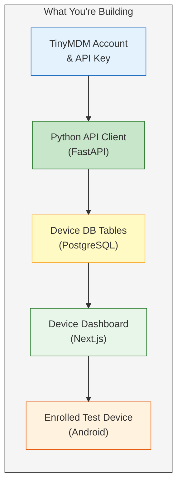

# TinyMDM Setup Guide for PMS Integration

**Document ID:** PMS-EXP-TINYMDM-001
**Version:** 1.0
**Date:** 2026-03-10
**Applies To:** PMS project (all platforms)
**Prerequisites Level:** Intermediate

---

## Table of Contents

1. [Overview](#1-overview)
2. [Prerequisites](#2-prerequisites)
3. [Part A: Set Up TinyMDM Account and API Access](#3-part-a-set-up-tinymdm-account-and-api-access)
4. [Part B: Integrate with PMS Backend](#4-part-b-integrate-with-pms-backend)
5. [Part C: Integrate with PMS Frontend](#5-part-c-integrate-with-pms-frontend)
6. [Part D: Testing and Verification](#6-part-d-testing-and-verification)
7. [Troubleshooting](#7-troubleshooting)
8. [Reference Commands](#8-reference-commands)

---

## 1. Overview

This guide walks you through integrating TinyMDM with the PMS to enable centralized Android device management — enrolling clinical tablets, deploying the PMS Android app silently, enforcing security policies, and monitoring device compliance from the PMS admin dashboard.

**By the end of this guide, you will have:**
- A TinyMDM account with API credentials configured
- Device groups for clinical tablets, patient intake kiosks, staff phones, and client-site devices
- A Python API client integrated into the PMS FastAPI backend
- PostgreSQL tables for device tracking and audit logging
- A Next.js device management dashboard
- At least one test device enrolled and managed



## 2. Prerequisites

### 2.1 Required Software

| Software | Minimum Version | Check Command |
|----------|----------------|---------------|
| Python | 3.11+ | `python --version` |
| Node.js | 18+ | `node --version` |
| PostgreSQL | 15+ | `psql --version` |
| Docker | 24+ | `docker --version` |
| Android device or emulator | Android 10+ | Settings → About Phone |
| Git | 2.40+ | `git --version` |
| curl | 7.0+ | `curl --version` |

### 2.2 Installation of Prerequisites

**TinyMDM-specific requirements:**

1. **An Android device for testing** — Physical device recommended (emulators have limited MDM support). Factory reset the device if it was previously enrolled in another MDM.

2. **Google account for Android Enterprise** — Required for managed Google Play integration. Use a dedicated service account, not a personal Gmail.

3. **`httpx` Python library** (for async API calls):
```bash
pip install httpx
```

4. **`apscheduler` Python library** (for compliance monitoring):
```bash
pip install apscheduler
```

### 2.3 Verify PMS Services

Before proceeding, confirm all PMS services are running:

```bash
# Check PMS backend
curl -s http://localhost:8000/health | python -m json.tool
# Expected: {"status": "healthy"}

# Check PMS frontend
curl -s -o /dev/null -w "%{http_code}" http://localhost:3000
# Expected: 200

# Check PostgreSQL
psql -U pms -d pms_db -c "SELECT 1;"
# Expected: 1
```

**Checkpoint:** All three PMS services (backend :8000, frontend :3000, PostgreSQL :5432) are running and responsive.

---

## 3. Part A: Set Up TinyMDM Account and API Access

### Step 1: Create TinyMDM Account

1. Navigate to [https://www.tinymdm.net/](https://www.tinymdm.net/)
2. Click **Free Trial** (30-day trial includes all features including API access)
3. Complete registration with your MPS organization email
4. Verify your email and log in to the admin console at `https://admin.tinymdm.net`

### Step 2: Configure Organization Structure

1. In the TinyMDM admin console, navigate to **Devices → Groups**
2. Create the following device groups:

| Group Name | Description | Policy Type |
|------------|-------------|-------------|
| `PMS-Clinical-Tablets` | Clinic examination room tablets | Fully Managed |
| `PMS-Intake-Kiosks` | Patient waiting room intake tablets | Kiosk Mode (Single App) |
| `PMS-Staff-Phones` | Staff personal devices with PMS work profile | Work Profile (BYOD) |
| `PMS-Client-Devices` | Devices distributed to client clinics | Fully Managed |

### Step 3: Generate API Key

1. In the admin console, navigate to **Settings → API**
2. Click **Generate API Key**
3. Copy the API key — you will need it in the next section
4. Note the API base URL displayed on the page

### Step 4: Configure Security Policies

For each device group, configure the base security policy:

1. Navigate to **Policies → Security**
2. Set the following for all groups:

| Setting | Value |
|---------|-------|
| Require device encryption | Enabled |
| Minimum password length | 6 digits |
| Password type | PIN or Biometric |
| Auto-lock timeout | 2 minutes |
| Camera (on kiosk devices) | Disabled |
| USB debugging | Disabled |
| Factory reset protection | Enabled |
| Unknown sources | Disabled |

3. For `PMS-Intake-Kiosks` group, additionally configure:
   - **Kiosk mode**: Single App
   - **Kiosk app**: (will be set after uploading PMS APK)
   - **Navigation bar**: Hidden
   - **Status bar**: Hidden
   - **Exit kiosk password**: Set a secure admin PIN

### Step 5: Upload PMS Android App

1. Navigate to **Apps → Private Apps**
2. Click **Upload APK**
3. Upload the latest PMS Android app APK (`pms-android-release.apk`)
4. Set app name: `MPS Patient Management System`
5. Assign the app to all four device groups
6. Enable **Auto-update** for the app

### Step 6: Configure Environment Variables

Add TinyMDM credentials to your PMS backend environment:

```bash
# Add to your .env file (NEVER commit this file)
TINYMDM_API_KEY=your_api_key_here
TINYMDM_API_BASE_URL=https://www.tinymdm.net/api/v1
TINYMDM_ORG_ID=your_organization_id
```

**Checkpoint:** You have a TinyMDM account with 4 device groups, security policies configured, the PMS APK uploaded, and API credentials stored in `.env`.

---

## 4. Part B: Integrate with PMS Backend

### Step 1: Create TinyMDM API Client

Create the API client module:

```python
# pms-backend/services/tinymdm_client.py

import httpx
from typing import Any
from pms.config import settings

class TinyMDMClient:
    """Async client for TinyMDM REST API."""

    def __init__(self):
        self.base_url = settings.TINYMDM_API_BASE_URL
        self.headers = {
            "Authorization": f"Bearer {settings.TINYMDM_API_KEY}",
            "Content-Type": "application/json",
        }
        self._client = httpx.AsyncClient(
            base_url=self.base_url,
            headers=self.headers,
            timeout=30.0,
        )

    async def list_devices(self, group_id: str | None = None) -> list[dict[str, Any]]:
        """List all enrolled devices, optionally filtered by group."""
        params = {}
        if group_id:
            params["group_id"] = group_id
        response = await self._client.get("/devices", params=params)
        response.raise_for_status()
        return response.json()

    async def get_device(self, device_id: str) -> dict[str, Any]:
        """Get details for a specific device."""
        response = await self._client.get(f"/devices/{device_id}")
        response.raise_for_status()
        return response.json()

    async def lock_device(self, device_id: str, message: str = "") -> dict[str, Any]:
        """Remotely lock a device with optional message."""
        payload = {"action": "lock"}
        if message:
            payload["message"] = message
        response = await self._client.post(
            f"/devices/{device_id}/actions", json=payload
        )
        response.raise_for_status()
        return response.json()

    async def wipe_device(self, device_id: str) -> dict[str, Any]:
        """Remotely wipe a device (factory reset)."""
        response = await self._client.post(
            f"/devices/{device_id}/actions", json={"action": "wipe"}
        )
        response.raise_for_status()
        return response.json()

    async def install_app(
        self, device_id: str, app_id: str
    ) -> dict[str, Any]:
        """Trigger silent app install on a device."""
        response = await self._client.post(
            f"/devices/{device_id}/apps",
            json={"app_id": app_id, "action": "install"},
        )
        response.raise_for_status()
        return response.json()

    async def list_groups(self) -> list[dict[str, Any]]:
        """List all device groups."""
        response = await self._client.get("/groups")
        response.raise_for_status()
        return response.json()

    async def get_device_compliance(self, device_id: str) -> dict[str, Any]:
        """Get compliance status for a device."""
        response = await self._client.get(f"/devices/{device_id}/compliance")
        response.raise_for_status()
        return response.json()

    async def close(self):
        await self._client.aclose()
```

### Step 2: Create Database Schema

Create the Alembic migration for device management tables:

```bash
cd pms-backend
alembic revision --autogenerate -m "add device management tables"
```

Add the following models:

```python
# pms-backend/models/device.py

from sqlalchemy import Column, String, DateTime, Boolean, Enum, ForeignKey, Text, JSON
from sqlalchemy.dialects.postgresql import UUID
from sqlalchemy.sql import func
import uuid
import enum

from pms.database import Base


class DeviceStatus(str, enum.Enum):
    ENROLLED = "enrolled"
    ACTIVE = "active"
    NON_COMPLIANT = "non_compliant"
    LOST = "lost"
    WIPED = "wiped"
    RETIRED = "retired"


class DeviceGroup(str, enum.Enum):
    CLINICAL_TABLET = "PMS-Clinical-Tablets"
    INTAKE_KIOSK = "PMS-Intake-Kiosks"
    STAFF_PHONE = "PMS-Staff-Phones"
    CLIENT_DEVICE = "PMS-Client-Devices"


class Device(Base):
    __tablename__ = "devices"

    id = Column(UUID(as_uuid=True), primary_key=True, default=uuid.uuid4)
    tinymdm_device_id = Column(String(255), unique=True, nullable=False, index=True)
    device_name = Column(String(255))
    serial_number = Column(String(255), unique=True)
    model = Column(String(255))
    android_version = Column(String(50))
    group_name = Column(Enum(DeviceGroup), nullable=False)
    status = Column(Enum(DeviceStatus), default=DeviceStatus.ENROLLED)
    pms_app_version = Column(String(50))
    is_encrypted = Column(Boolean, default=False)
    is_compliant = Column(Boolean, default=True)
    last_sync_at = Column(DateTime(timezone=True))
    enrolled_at = Column(DateTime(timezone=True), server_default=func.now())
    metadata_json = Column(JSON, default={})
    created_at = Column(DateTime(timezone=True), server_default=func.now())
    updated_at = Column(DateTime(timezone=True), onupdate=func.now())


class DeviceAuditLog(Base):
    __tablename__ = "device_audit_logs"

    id = Column(UUID(as_uuid=True), primary_key=True, default=uuid.uuid4)
    device_id = Column(UUID(as_uuid=True), ForeignKey("devices.id"), nullable=False)
    action = Column(String(100), nullable=False)  # e.g., "enrolled", "locked", "wiped", "app_installed"
    actor = Column(String(255))  # User or "system"
    details = Column(Text)
    created_at = Column(DateTime(timezone=True), server_default=func.now())


class AppDeployment(Base):
    __tablename__ = "app_deployments"

    id = Column(UUID(as_uuid=True), primary_key=True, default=uuid.uuid4)
    app_version = Column(String(50), nullable=False)
    target_group = Column(Enum(DeviceGroup))
    total_devices = Column(String(10))
    installed_count = Column(String(10), default="0")
    status = Column(String(50), default="pending")  # pending, in_progress, completed, failed
    initiated_by = Column(String(255))
    created_at = Column(DateTime(timezone=True), server_default=func.now())
    completed_at = Column(DateTime(timezone=True))
```

Run the migration:

```bash
alembic upgrade head
```

### Step 3: Create Device Management API Router

```python
# pms-backend/routers/devices.py

from fastapi import APIRouter, Depends, HTTPException
from sqlalchemy.ext.asyncio import AsyncSession
from typing import Optional

from pms.database import get_session
from pms.services.tinymdm_client import TinyMDMClient
from pms.models.device import Device, DeviceAuditLog, DeviceStatus

router = APIRouter(prefix="/api/devices", tags=["devices"])
tinymdm = TinyMDMClient()


@router.get("/")
async def list_devices(
    group: Optional[str] = None,
    status: Optional[DeviceStatus] = None,
    session: AsyncSession = Depends(get_session),
):
    """List all managed devices with optional filters."""
    query = session.query(Device)
    if group:
        query = query.filter(Device.group_name == group)
    if status:
        query = query.filter(Device.status == status)
    devices = await session.execute(query)
    return devices.scalars().all()


@router.get("/{device_id}")
async def get_device(device_id: str, session: AsyncSession = Depends(get_session)):
    """Get device details including live status from TinyMDM."""
    device = await session.get(Device, device_id)
    if not device:
        raise HTTPException(status_code=404, detail="Device not found")
    # Fetch live status from TinyMDM
    live_status = await tinymdm.get_device(device.tinymdm_device_id)
    return {"device": device, "live_status": live_status}


@router.post("/{device_id}/lock")
async def lock_device(
    device_id: str,
    message: str = "Device locked by PMS administrator",
    session: AsyncSession = Depends(get_session),
):
    """Remotely lock a device."""
    device = await session.get(Device, device_id)
    if not device:
        raise HTTPException(status_code=404, detail="Device not found")
    result = await tinymdm.lock_device(device.tinymdm_device_id, message)
    # Audit log
    log = DeviceAuditLog(
        device_id=device.id, action="locked", actor="admin", details=message
    )
    session.add(log)
    await session.commit()
    return result


@router.post("/{device_id}/wipe")
async def wipe_device(device_id: str, session: AsyncSession = Depends(get_session)):
    """Remotely wipe a device (factory reset). Use with caution."""
    device = await session.get(Device, device_id)
    if not device:
        raise HTTPException(status_code=404, detail="Device not found")
    result = await tinymdm.wipe_device(device.tinymdm_device_id)
    device.status = DeviceStatus.WIPED
    log = DeviceAuditLog(
        device_id=device.id, action="wiped", actor="admin", details="Remote wipe initiated"
    )
    session.add(log)
    await session.commit()
    return result


@router.get("/compliance/summary")
async def compliance_summary(session: AsyncSession = Depends(get_session)):
    """Get fleet-wide compliance summary."""
    total = await session.execute(
        session.query(Device).filter(Device.status != DeviceStatus.RETIRED)
    )
    compliant = await session.execute(
        session.query(Device).filter(
            Device.is_compliant == True, Device.status == DeviceStatus.ACTIVE
        )
    )
    return {
        "total_devices": len(total.scalars().all()),
        "compliant_devices": len(compliant.scalars().all()),
        "compliance_rate": "calculated_percentage",
    }


@router.post("/sync")
async def sync_devices(session: AsyncSession = Depends(get_session)):
    """Sync device data from TinyMDM to local database."""
    remote_devices = await tinymdm.list_devices()
    synced = 0
    for rd in remote_devices:
        # Upsert device record
        device = await session.execute(
            session.query(Device).filter(
                Device.tinymdm_device_id == rd["id"]
            )
        )
        device = device.scalar_one_or_none()
        if device:
            device.pms_app_version = rd.get("app_version")
            device.is_encrypted = rd.get("encrypted", False)
            device.is_compliant = rd.get("compliant", True)
            device.last_sync_at = rd.get("last_seen")
        else:
            new_device = Device(
                tinymdm_device_id=rd["id"],
                device_name=rd.get("name"),
                serial_number=rd.get("serial"),
                model=rd.get("model"),
                android_version=rd.get("os_version"),
                group_name=rd.get("group", "PMS-Clinical-Tablets"),
                pms_app_version=rd.get("app_version"),
                is_encrypted=rd.get("encrypted", False),
            )
            session.add(new_device)
        synced += 1
    await session.commit()
    return {"synced_devices": synced}
```

### Step 4: Register the Router

Add the devices router to your FastAPI app:

```python
# In pms-backend/main.py, add:
from pms.routers.devices import router as devices_router

app.include_router(devices_router)
```

### Step 5: Create Compliance Monitor Task

```python
# pms-backend/tasks/compliance_monitor.py

import logging
from apscheduler.schedulers.asyncio import AsyncIOScheduler
from pms.services.tinymdm_client import TinyMDMClient
from pms.database import async_session_factory

logger = logging.getLogger(__name__)
scheduler = AsyncIOScheduler()
tinymdm = TinyMDMClient()


async def check_compliance():
    """Poll TinyMDM for device compliance and update local records."""
    async with async_session_factory() as session:
        devices = await tinymdm.list_devices()
        non_compliant = []
        for device in devices:
            compliance = await tinymdm.get_device_compliance(device["id"])
            if not compliance.get("compliant", True):
                non_compliant.append(device)
                logger.warning(
                    f"Device {device['name']} ({device['serial']}) is non-compliant: "
                    f"{compliance.get('violations', [])}"
                )
        if non_compliant:
            logger.warning(f"{len(non_compliant)} non-compliant devices detected")
        else:
            logger.info(f"All {len(devices)} devices are compliant")


def start_compliance_monitor():
    """Start the compliance monitoring scheduler."""
    scheduler.add_job(check_compliance, "interval", minutes=5, id="compliance_check")
    scheduler.start()
    logger.info("Compliance monitor started (5-minute interval)")
```

**Checkpoint:** PMS backend has a TinyMDM API client, database models, REST API endpoints at `/api/devices`, and a compliance monitoring task.

---

## 5. Part C: Integrate with PMS Frontend

### Step 1: Add Environment Variables

```bash
# Add to pms-frontend/.env.local
NEXT_PUBLIC_API_BASE_URL=http://localhost:8000
```

### Step 2: Create Device API Client

```typescript
// pms-frontend/lib/api/devices.ts

const API_BASE = process.env.NEXT_PUBLIC_API_BASE_URL;

export interface Device {
  id: string;
  tinymdm_device_id: string;
  device_name: string;
  serial_number: string;
  model: string;
  android_version: string;
  group_name: string;
  status: string;
  pms_app_version: string;
  is_encrypted: boolean;
  is_compliant: boolean;
  last_sync_at: string;
  enrolled_at: string;
}

export interface ComplianceSummary {
  total_devices: number;
  compliant_devices: number;
  compliance_rate: number;
}

export async function fetchDevices(group?: string): Promise<Device[]> {
  const params = group ? `?group=${group}` : "";
  const res = await fetch(`${API_BASE}/api/devices${params}`);
  if (!res.ok) throw new Error("Failed to fetch devices");
  return res.json();
}

export async function fetchDevice(id: string): Promise<Device> {
  const res = await fetch(`${API_BASE}/api/devices/${id}`);
  if (!res.ok) throw new Error("Failed to fetch device");
  return res.json();
}

export async function lockDevice(id: string, message?: string): Promise<void> {
  const res = await fetch(`${API_BASE}/api/devices/${id}/lock`, {
    method: "POST",
    headers: { "Content-Type": "application/json" },
    body: JSON.stringify({ message }),
  });
  if (!res.ok) throw new Error("Failed to lock device");
}

export async function fetchComplianceSummary(): Promise<ComplianceSummary> {
  const res = await fetch(`${API_BASE}/api/devices/compliance/summary`);
  if (!res.ok) throw new Error("Failed to fetch compliance summary");
  return res.json();
}

export async function syncDevices(): Promise<{ synced_devices: number }> {
  const res = await fetch(`${API_BASE}/api/devices/sync`, { method: "POST" });
  if (!res.ok) throw new Error("Failed to sync devices");
  return res.json();
}
```

### Step 3: Create Device Dashboard Page

```tsx
// pms-frontend/app/admin/devices/page.tsx

"use client";

import { useEffect, useState } from "react";
import {
  fetchDevices,
  fetchComplianceSummary,
  syncDevices,
  lockDevice,
  Device,
  ComplianceSummary,
} from "@/lib/api/devices";

export default function DeviceDashboard() {
  const [devices, setDevices] = useState<Device[]>([]);
  const [compliance, setCompliance] = useState<ComplianceSummary | null>(null);
  const [loading, setLoading] = useState(true);
  const [syncing, setSyncing] = useState(false);

  const loadData = async () => {
    setLoading(true);
    const [deviceList, complianceData] = await Promise.all([
      fetchDevices(),
      fetchComplianceSummary(),
    ]);
    setDevices(deviceList);
    setCompliance(complianceData);
    setLoading(false);
  };

  useEffect(() => {
    loadData();
  }, []);

  const handleSync = async () => {
    setSyncing(true);
    await syncDevices();
    await loadData();
    setSyncing(false);
  };

  const handleLock = async (deviceId: string) => {
    if (confirm("Are you sure you want to lock this device?")) {
      await lockDevice(deviceId);
      await loadData();
    }
  };

  if (loading) return <div>Loading device fleet...</div>;

  return (
    <div className="p-6">
      <div className="flex justify-between items-center mb-6">
        <h1 className="text-2xl font-bold">Device Management</h1>
        <button
          onClick={handleSync}
          disabled={syncing}
          className="px-4 py-2 bg-blue-600 text-white rounded hover:bg-blue-700"
        >
          {syncing ? "Syncing..." : "Sync Devices"}
        </button>
      </div>

      {/* Compliance Summary Cards */}
      {compliance && (
        <div className="grid grid-cols-3 gap-4 mb-6">
          <div className="bg-white rounded-lg shadow p-4">
            <p className="text-sm text-gray-500">Total Devices</p>
            <p className="text-3xl font-bold">{compliance.total_devices}</p>
          </div>
          <div className="bg-white rounded-lg shadow p-4">
            <p className="text-sm text-gray-500">Compliant</p>
            <p className="text-3xl font-bold text-green-600">
              {compliance.compliant_devices}
            </p>
          </div>
          <div className="bg-white rounded-lg shadow p-4">
            <p className="text-sm text-gray-500">Compliance Rate</p>
            <p className="text-3xl font-bold">
              {compliance.compliance_rate}%
            </p>
          </div>
        </div>
      )}

      {/* Device Table */}
      <div className="bg-white rounded-lg shadow overflow-hidden">
        <table className="min-w-full divide-y divide-gray-200">
          <thead className="bg-gray-50">
            <tr>
              <th className="px-6 py-3 text-left text-xs font-medium text-gray-500 uppercase">Device</th>
              <th className="px-6 py-3 text-left text-xs font-medium text-gray-500 uppercase">Group</th>
              <th className="px-6 py-3 text-left text-xs font-medium text-gray-500 uppercase">App Version</th>
              <th className="px-6 py-3 text-left text-xs font-medium text-gray-500 uppercase">Status</th>
              <th className="px-6 py-3 text-left text-xs font-medium text-gray-500 uppercase">Compliant</th>
              <th className="px-6 py-3 text-left text-xs font-medium text-gray-500 uppercase">Actions</th>
            </tr>
          </thead>
          <tbody className="divide-y divide-gray-200">
            {devices.map((device) => (
              <tr key={device.id}>
                <td className="px-6 py-4">
                  <div className="font-medium">{device.device_name}</div>
                  <div className="text-sm text-gray-500">{device.model} — {device.serial_number}</div>
                </td>
                <td className="px-6 py-4 text-sm">{device.group_name}</td>
                <td className="px-6 py-4 text-sm">{device.pms_app_version || "N/A"}</td>
                <td className="px-6 py-4">
                  <span className={`px-2 py-1 text-xs rounded-full ${
                    device.status === "active" ? "bg-green-100 text-green-800" :
                    device.status === "non_compliant" ? "bg-red-100 text-red-800" :
                    "bg-gray-100 text-gray-800"
                  }`}>
                    {device.status}
                  </span>
                </td>
                <td className="px-6 py-4">
                  {device.is_compliant ? (
                    <span className="text-green-600">Yes</span>
                  ) : (
                    <span className="text-red-600 font-bold">No</span>
                  )}
                </td>
                <td className="px-6 py-4">
                  <button
                    onClick={() => handleLock(device.id)}
                    className="text-sm text-red-600 hover:text-red-800 mr-3"
                  >
                    Lock
                  </button>
                </td>
              </tr>
            ))}
          </tbody>
        </table>
      </div>
    </div>
  );
}
```

### Step 4: Add Navigation Link

Add the device management link to your admin navigation:

```tsx
// In your admin layout or navigation component, add:
<Link href="/admin/devices" className="nav-link">
  Device Management
</Link>
```

**Checkpoint:** PMS frontend has a Device Management dashboard at `/admin/devices` with compliance summary cards, device table, sync button, and lock action.

---

## 6. Part D: Testing and Verification

### 6.1 Enroll a Test Device

1. In TinyMDM admin console, navigate to **Devices → Enroll**
2. Select **QR Code** enrollment method
3. Select the `PMS-Clinical-Tablets` group
4. Generate the QR code

On the Android test device:
1. Factory reset the device (Settings → System → Reset → Erase all data)
2. During initial setup, tap the screen 6 times on the Welcome screen to trigger QR code enrollment
3. Connect to Wi-Fi
4. Scan the TinyMDM QR code
5. Follow the on-screen prompts to complete enrollment

### 6.2 Verify API Connectivity

```bash
# Test TinyMDM API connection
curl -s -H "Authorization: Bearer $TINYMDM_API_KEY" \
  "$TINYMDM_API_BASE_URL/devices" | python -m json.tool

# Expected: JSON array of enrolled devices
```

### 6.3 Verify PMS Backend Endpoints

```bash
# Sync devices from TinyMDM to PMS database
curl -s -X POST http://localhost:8000/api/devices/sync | python -m json.tool
# Expected: {"synced_devices": 1}

# List devices
curl -s http://localhost:8000/api/devices/ | python -m json.tool
# Expected: JSON array with your test device

# Get compliance summary
curl -s http://localhost:8000/api/devices/compliance/summary | python -m json.tool
# Expected: {"total_devices": 1, "compliant_devices": 1, "compliance_rate": 100}
```

### 6.4 Verify App Deployment

```bash
# Trigger PMS app install on test device
curl -s -X POST http://localhost:8000/api/devices/{device_id}/install \
  -H "Content-Type: application/json" \
  -d '{"app_id": "com.mps.pms"}' | python -m json.tool
# Expected: {"status": "install_triggered"}
```

Verify on the device that the PMS app was silently installed.

### 6.5 Verify Frontend Dashboard

1. Open `http://localhost:3000/admin/devices`
2. Verify the compliance summary cards show correct numbers
3. Verify the device table shows your enrolled test device
4. Click **Sync Devices** and verify the count updates
5. Click **Lock** on the test device and verify the device locks

**Checkpoint:** End-to-end integration verified — device enrolled, API connected, backend endpoints working, frontend dashboard displaying data, and remote lock functioning.

---

## 7. Troubleshooting

### API Authentication Failure

**Symptom:** `401 Unauthorized` from TinyMDM API

**Solution:**
1. Verify the API key in `.env` matches the key in TinyMDM admin console
2. Check that the API key has not expired
3. Ensure the `Authorization` header format is correct: `Bearer {api_key}`
4. Regenerate the API key if needed

### Device Enrollment Fails

**Symptom:** QR code scan does not start enrollment process

**Solution:**
1. Ensure the device is factory reset (not just cleared)
2. Verify the device runs Android 10 or higher
3. Check that Wi-Fi is connected during enrollment
4. Ensure Google Play Services is up to date
5. Try NFC enrollment or manual enrollment as alternatives

### Devices Not Syncing to PMS Database

**Symptom:** `/api/devices/sync` returns `{"synced_devices": 0}` despite enrolled devices

**Solution:**
1. Check TinyMDM API key permissions — ensure it has read access to devices
2. Verify `TINYMDM_API_BASE_URL` is correct (check for trailing slashes)
3. Test the TinyMDM API directly with curl to isolate the issue
4. Check PMS backend logs for HTTP error details

### Kiosk Mode Not Activating

**Symptom:** Device shows normal Android home screen instead of PMS app kiosk

**Solution:**
1. Verify the device is in the `PMS-Intake-Kiosks` group
2. Check that the kiosk policy has the PMS app selected as the kiosk app
3. Ensure the PMS app is installed on the device before activating kiosk mode
4. Force a policy refresh: TinyMDM console → Device → Sync Policy

### Silent Install Not Working

**Symptom:** App install command succeeds but app doesn't appear on device

**Solution:**
1. Verify the device has sufficient storage space
2. Check that the APK is compatible with the device's Android version and architecture
3. Ensure the device is online and has synced policies recently
4. Check TinyMDM console for installation error details

### Port Conflicts

**Symptom:** PMS backend fails to start on port 8000

**Solution:**
```bash
# Check what's using port 8000
lsof -i :8000
# Kill the process or change the PMS backend port in .env
```

---

## 8. Reference Commands

### Daily Development Workflow

```bash
# Start PMS services
docker compose up -d

# Check device fleet status
curl -s http://localhost:8000/api/devices/ | python -m json.tool

# Sync devices from TinyMDM
curl -s -X POST http://localhost:8000/api/devices/sync | python -m json.tool

# Check compliance
curl -s http://localhost:8000/api/devices/compliance/summary | python -m json.tool
```

### Device Management Commands

```bash
# Lock a device
curl -s -X POST http://localhost:8000/api/devices/{id}/lock \
  -H "Content-Type: application/json" \
  -d '{"message": "Locked by admin"}'

# Wipe a device (CAUTION: factory reset)
curl -s -X POST http://localhost:8000/api/devices/{id}/wipe

# Deploy app update
curl -s -X POST http://localhost:8000/api/devices/{id}/install \
  -H "Content-Type: application/json" \
  -d '{"app_id": "com.mps.pms"}'
```

### Useful URLs

| Resource | URL |
|----------|-----|
| TinyMDM Admin Console | https://admin.tinymdm.net |
| TinyMDM API Docs | https://www.tinymdm.net/mobile-device-management/api/ |
| TinyMDM Help Resources | https://www.tinymdm.net/help-resources/ |
| PMS Device Dashboard | http://localhost:3000/admin/devices |
| PMS Device API | http://localhost:8000/api/devices/ |

---

## Next Steps

After completing this setup guide:

1. **Enroll additional devices** — Use zero-touch enrollment for bulk device provisioning
2. **Follow the [TinyMDM Developer Tutorial](72-TinyMDM-Developer-Tutorial.md)** — Build a complete app deployment pipeline and compliance dashboard
3. **Configure CI/CD integration** — Add APK upload to TinyMDM as a post-build step in GitHub Actions
4. **Set up compliance alerts** — Configure email/Slack notifications for non-compliant devices
5. **Review the [PRD](72-PRD-TinyMDM-PMS-Integration.md)** — Understand the full scope of the TinyMDM integration

## Resources

- [TinyMDM Official Documentation](https://www.tinymdm.net/help-resources/)
- [TinyMDM REST API Reference](https://www.tinymdm.net/mobile-device-management/api/)
- [TinyMDM Feature Overview](https://www.tinymdm.net/features/)
- [Android Enterprise Developer Guide](https://developer.android.com/work)
- [Google Zero-Touch Enrollment](https://www.android.com/intl/en_us/enterprise/management/zero-touch/)
- [TinyMDM Kiosk Mode Guide](https://www.tinymdm.net/features/kiosk-mode/)
