# Product Requirements Document: pVerify Integration into Patient Management System (PMS)

**Document ID:** PRD-PMS-PVERIFY-001
**Version:** 1.0
**Date:** 2026-03-11
**Author:** Ammar (CEO, MPS Inc.)
**Status:** Draft

---

## 1. Executive Summary

pVerify is a cloud-based, HIPAA-compliant SaaS platform specializing in real-time patient insurance eligibility and benefits verification. Founded in 2006 and recently acquired by DoseSpot, pVerify connects to **1,500+ healthcare payers** — the largest payer list in the industry — covering both EDI and non-EDI payers including vision payers and California IPAs that no other clearinghouse supports. The platform provides 140+ REST API endpoints for eligibility verification, claim status inquiry, prior authorization (Fast-PASS ePA), and patient cost estimation.

Integrating pVerify into the PMS eliminates the manual, error-prone process of verifying patient insurance eligibility before encounters. Front desk staff currently spend 5-15 minutes per patient calling payers or navigating multiple payer portals to confirm coverage, benefits, copays, and deductibles. With pVerify, eligibility verification becomes a single API call returning structured JSON with coverage status, copay amounts, deductible balances, and plan details — enabling real-time verification at check-in, batch verification for next-day schedules, and automated prior authorization submission.

The integration delivers three immediate outcomes: (1) reduced claim denials by catching eligibility gaps before service delivery, (2) improved patient transparency through real-time out-of-pocket cost estimates at check-in, and (3) accelerated revenue cycle by automating the front-end verification bottleneck that currently delays 30-40% of encounters.

## 2. Problem Statement

The PMS currently has no automated mechanism for verifying patient insurance eligibility prior to encounters. This creates several operational bottlenecks in clinical workflows:

- **Manual verification burden**: Front desk staff must manually check eligibility through individual payer portals or phone calls, consuming 5-15 minutes per patient and delaying check-in queues.
- **Claim denials from eligibility gaps**: Without pre-encounter verification, claims are submitted for patients with inactive coverage, exhausted benefits, or incorrect plan details — resulting in denials, rework, and revenue loss.
- **No cost transparency**: Patients cannot receive accurate out-of-pocket cost estimates at check-in because copay, coinsurance, and deductible information is not readily available in the PMS.
- **Prior authorization delays**: PA requirements are discovered after services are rendered rather than before, causing retroactive PA submissions and potential denials.
- **Batch verification gaps**: There is no automated way to verify eligibility for all patients on tomorrow's schedule, forcing reactive rather than proactive verification workflows.

While the PMS has existing experiments for prior authorization (Experiments 43-44 with CMS PA Dataset and Payer Policies, and Experiment 47 with Availity API), there is no dedicated real-time eligibility verification integration. pVerify's 1,500+ payer coverage (vs. Availity's narrower EDI-only network) and specialized eligibility API make it the ideal complement to the existing PA workflow.

## 3. Proposed Solution

### 3.1 Architecture Overview

```mermaid
flowchart TB
    subgraph PMS["PMS Platform"]
        subgraph BE["Backend (FastAPI :8000)"]
            ELIG["EligibilityService"]
            BATCH["BatchVerificationWorker"]
            COST["CostEstimatorService"]
            CLAIM["ClaimStatusService"]
        end

        subgraph FE["Frontend (Next.js :3000)"]
            CHECKIN["Check-In Panel"]
            SCHEDULE["Schedule Verification View"]
            ESTIMATE["Cost Estimator Widget"]
            DASHBOARD["Eligibility Dashboard"]
        end

        subgraph DB["PostgreSQL :5432"]
            ELIGTBL["eligibility_results"]
            CACHETBL["payer_cache"]
            AUDITTBL["verification_audit_log"]
        end

        subgraph AND["Android App"]
            MOBCHECK["Mobile Check-In"]
            MOBELIG["Eligibility Status"]
        end
    end

    subgraph PVERIFY["pVerify Cloud (api.pverify.com)"]
        TOKEN["OAuth Token Service"]
        ELIGAPI["Eligibility API"]
        CLAIMAPI["Claim Status API"]
        BATCHAPI["Batch Eligibility API"]
        ESTAPI["Patient Estimator API"]
    end

    CHECKIN --> ELIG
    SCHEDULE --> BATCH
    ESTIMATE --> COST
    DASHBOARD --> CLAIM

    ELIG --> TOKEN
    ELIG --> ELIGAPI
    BATCH --> TOKEN
    BATCH --> BATCHAPI
    COST --> ESTAPI
    CLAIM --> CLAIMAPI

    ELIG --> ELIGTBL
    BATCH --> ELIGTBL
    ELIG --> AUDITTBL
    BATCH --> CACHETBL

    MOBCHECK --> ELIG
    MOBELIG --> ELIG

    style PMS fill:#f0f4ff,stroke:#4a90d9,color:#000
    style BE fill:#e8f5e9,stroke:#4caf50,color:#000
    style FE fill:#fff3e0,stroke:#ff9800,color:#000
    style DB fill:#fce4ec,stroke:#e91e63,color:#000
    style PVERIFY fill:#e3f2fd,stroke:#2196f3,color:#000
    style AND fill:#f3e5f5,stroke:#9c27b0,color:#000
```

### 3.2 Deployment Model

pVerify is a **cloud-hosted SaaS API** — no self-hosting is required. The integration consists of a Python client module within the FastAPI backend that communicates with `api.pverify.com` over HTTPS.

- **Authentication**: OAuth 2.0 token-based (client credentials or username/password grant). Tokens are cached with TTL management.
- **HIPAA compliance**: pVerify is HIPAA-compliant and SOC 2 Type II certified. All data in transit uses TLS. The PMS stores only eligibility response summaries in PostgreSQL — no raw PHI from pVerify responses is cached beyond the verification result.
- **Docker**: The integration runs within the existing `pms-backend` container. No additional containers are needed. Environment variables store pVerify credentials (never committed to source control).
- **Rate limiting**: API calls are throttled per the pVerify plan tier. The BatchVerificationWorker uses configurable concurrency limits to stay within rate limits.

## 4. PMS Data Sources

The pVerify integration interacts with the following PMS APIs and data:

| PMS API | Interaction | Purpose |
|---------|-------------|---------|
| **Patient Records API** (`/api/patients`) | Read patient demographics, insurance info, subscriber ID, DOB | Populate pVerify eligibility request with patient and subscriber data |
| **Encounter Records API** (`/api/encounters`) | Read upcoming encounters; write eligibility status to encounter | Trigger pre-encounter verification; attach eligibility result to encounter |
| **Medication & Prescription API** (`/api/prescriptions`) | Read prescribed medications and CPT/HCPCS codes | Feed service codes into eligibility inquiry for benefit-specific verification |
| **Reporting API** (`/api/reports`) | Write eligibility metrics (denial rates, batch success rates) | Power the Eligibility Dashboard with verification analytics |

## 5. Component/Module Definitions

### 5.1 pVerifyClient

**Description**: Low-level async HTTP client wrapping the pVerify REST API with OAuth token management, retry logic, and structured error handling.

- **Input**: pVerify credentials (client ID/secret or username/password), API endpoint parameters
- **Output**: Typed Python dataclass responses (EligibilityResult, ClaimStatus, etc.)
- **PMS APIs used**: None (infrastructure layer)

### 5.2 EligibilityService

**Description**: Business logic layer that orchestrates eligibility verification by combining PMS patient data with pVerify API calls. Supports real-time single-patient verification and returns structured eligibility summaries.

- **Input**: Patient ID (from PMS), encounter ID (optional), service codes (optional)
- **Output**: EligibilityResult with coverage status, copay, deductible remaining, coinsurance, plan details, and payer-specific notes
- **PMS APIs used**: Patient Records API (read demographics/insurance), Encounter Records API (write eligibility status)

### 5.3 BatchVerificationWorker

**Description**: Background worker that verifies eligibility for all patients on tomorrow's schedule. Runs nightly via APScheduler or on-demand trigger. Uses pVerify's batch API for efficiency.

- **Input**: Date range for schedule lookup
- **Output**: Batch verification report with per-patient eligibility status, flagging inactive coverage and high-deductible plans
- **PMS APIs used**: Encounter Records API (read scheduled encounters), Patient Records API (read demographics), Reporting API (write batch results)

### 5.4 CostEstimatorService

**Description**: Calculates patient out-of-pocket cost estimates using pVerify's Patient Estimator API combined with CPT codes from the encounter.

- **Input**: Patient ID, list of CPT/HCPCS codes for planned services
- **Output**: Estimated copay, coinsurance, deductible applied, total patient responsibility
- **PMS APIs used**: Patient Records API (read insurance), Prescription API (read service codes)

### 5.5 ClaimStatusService

**Description**: Queries pVerify's Claim Status API to track submitted claims and surface processing updates, rejections, and payment details.

- **Input**: Claim reference ID or patient ID + date range
- **Output**: Claim status (accepted, rejected, pending), rejection codes, payment amounts
- **PMS APIs used**: Reporting API (write claim status updates)

## 6. Non-Functional Requirements

### 6.1 Security and HIPAA Compliance

| Requirement | Implementation |
|-------------|---------------|
| **Credential storage** | pVerify API credentials stored in environment variables or secrets manager (AWS Secrets Manager / HashiCorp Vault). Never committed to source control. |
| **Data in transit** | All pVerify API calls over HTTPS/TLS 1.2+. PMS backend enforces TLS for all outbound HTTP. |
| **Data at rest** | Eligibility results stored in PostgreSQL with AES-256 encryption. Only summary fields cached — no raw X12 270/271 responses persisted. |
| **Access control** | Eligibility verification endpoints require authenticated PMS user with `eligibility:read` or `eligibility:write` role. |
| **Audit logging** | Every pVerify API call logged to `verification_audit_log` table: timestamp, user ID, patient ID, payer code, response status, response time. |
| **PHI minimization** | pVerify requests include only minimum necessary data: subscriber name, DOB, member ID, payer code, NPI. No clinical data sent. |
| **Token security** | OAuth tokens cached in-memory with TTL; never persisted to disk or logged. Token refresh handled automatically. |

### 6.2 Performance

| Metric | Target |
|--------|--------|
| Single eligibility check latency | < 3 seconds (p95) |
| Batch verification throughput | 200 patients/hour |
| Token refresh overhead | < 500ms |
| Cache hit rate (payer metadata) | > 80% |
| API availability | 99.9% (SLA from pVerify) |

### 6.3 Infrastructure

- **No additional containers**: pVerify client runs within existing `pms-backend` Docker container
- **Dependencies**: `httpx` (async HTTP), `pydantic` (response models), `apscheduler` (batch scheduling)
- **Database**: 3 new PostgreSQL tables (`eligibility_results`, `payer_cache`, `verification_audit_log`)
- **Memory**: Token cache and payer metadata cache require ~10MB additional RAM
- **Network**: Outbound HTTPS to `api.pverify.com` (port 443)

## 7. Implementation Phases

### Phase 1: Foundation (Sprint 1-2, ~4 weeks)

- Implement `pVerifyClient` with OAuth token management and retry logic
- Create PostgreSQL schema for eligibility results and audit log
- Build `EligibilityService` with single-patient real-time verification
- Add `/api/eligibility/verify` FastAPI endpoint
- Write unit tests with mocked pVerify responses
- Set up pVerify demo/sandbox credentials

### Phase 2: Core Integration (Sprint 3-4, ~4 weeks)

- Build `BatchVerificationWorker` with APScheduler nightly job
- Implement `CostEstimatorService` with patient out-of-pocket calculation
- Create Next.js Check-In Panel with eligibility status display
- Build Schedule Verification View showing next-day batch results
- Add Cost Estimator Widget to encounter creation flow
- Integration tests against pVerify sandbox

### Phase 3: Advanced Features (Sprint 5-6, ~4 weeks)

- Implement `ClaimStatusService` for post-submission claim tracking
- Build Eligibility Dashboard with verification analytics and denial trends
- Add Android mobile check-in with eligibility display
- Implement payer metadata caching for frequently queried payers
- Connect eligibility results to existing PA workflow (Experiments 43-44)
- Performance optimization and production load testing

## 8. Success Metrics

| Metric | Target | Measurement Method |
|--------|--------|-------------------|
| Pre-encounter eligibility verification rate | > 95% of scheduled encounters | `eligibility_results` count / scheduled encounters |
| Eligibility-related claim denial reduction | 40% reduction from baseline | Compare denial codes pre/post implementation |
| Average check-in time | Reduce by 3-5 minutes | Time from patient arrival to encounter start |
| Batch verification success rate | > 98% of batch requests complete | BatchVerificationWorker completion logs |
| Patient cost estimate accuracy | Within 15% of actual EOB | Compare estimates to final adjudication |
| Staff satisfaction (manual verification eliminated) | > 80% report time savings | Staff survey at 30/60/90 days |

## 9. Risks and Mitigations

| Risk | Impact | Mitigation |
|------|--------|------------|
| pVerify API downtime | Eligibility checks fail, check-in delays | Implement circuit breaker with graceful degradation — show "verification pending" status, allow manual override |
| Non-EDI payer slow response | Some payers take 10-30 seconds | Async processing with webhook callback; show loading state in UI; batch these payers in overnight run |
| Rate limit exceeded | API calls throttled or blocked | Implement request queuing with configurable concurrency; use batch API for bulk operations; cache results for 24 hours |
| Incorrect eligibility data | Wrong copay/deductible shown to patient | Display pVerify confidence indicators; require staff review for low-confidence results; never auto-bill from estimates |
| pVerify pricing tier exceeded | Unexpected cost increase | Monitor transaction counts via dashboard; alert at 80% of tier limit; auto-pause non-critical batch jobs at 95% |
| Payer code mapping errors | Wrong payer queried for patient | Build payer code lookup table from pVerify's payer list API; validate payer codes during patient insurance entry |

## 10. Dependencies

| Dependency | Type | Notes |
|------------|------|-------|
| pVerify API account | External service | Standard or Enterprise tier; demo credentials for development |
| pVerify OAuth credentials | Authentication | Client ID + secret or username + password |
| `httpx` Python library | Backend dependency | Async HTTP client for pVerify API calls |
| `pydantic` v2 | Backend dependency | Response model validation |
| `apscheduler` | Backend dependency | Batch verification scheduling |
| PostgreSQL 15+ | Infrastructure | Existing PMS database; 3 new tables |
| PMS Patient Records API | Internal API | Patient demographics and insurance data |
| PMS Encounter Records API | Internal API | Schedule data and encounter linkage |
| NPI number | Configuration | Provider NPI required for eligibility requests |
| Payer code mapping | Configuration | Map PMS insurance entries to pVerify payer codes |

## 11. Comparison with Existing Experiments

### pVerify vs. Availity API (Experiment 47)

| Dimension | pVerify (Exp 73) | Availity API (Exp 47) |
|-----------|-----------------|----------------------|
| **Primary focus** | Eligibility verification + cost estimation | Prior authorization + claims management |
| **Payer coverage** | 1,500+ payers (EDI + non-EDI) | ~700 payers (EDI only) |
| **Non-EDI support** | Yes (unique differentiator — vision, CA IPAs) | No |
| **Batch eligibility** | Unlimited batch included | Available in higher tiers |
| **Prior authorization** | Fast-PASS ePA (AI-powered) | Full PA workflow with clinical documents |
| **Drop-in UI** | JavaScript widget for embedding | Portal-based UI |
| **Complementarity** | **High** — pVerify handles pre-encounter eligibility; Availity handles PA submission and claims. They cover different stages of the revenue cycle. |

**Recommendation**: Use pVerify as the primary eligibility verification layer (pre-encounter) and Availity as the PA and claims management layer (post-encounter). The `EligibilityService` output feeds into the existing PA workflow to flag services requiring prior authorization before they are rendered.

### Connection to Azure Document Intelligence (Experiment 69)

pVerify complements Azure Document Intelligence by providing structured, API-verified eligibility data to cross-reference against OCR-extracted insurance card fields. When a patient's insurance card is scanned via Experiment 69, the extracted member ID and payer can be validated against pVerify's eligibility API to confirm active coverage.

## 12. Research Sources

### Official Documentation
- [pVerify API Developers Page](https://pverify.com/api-developers/) — API overview, integration models, and developer resources
- [pVerify API Reference (docs.pverify.io)](https://docs.pverify.io/) — Endpoint documentation, request/response schemas, claim status API
- [pVerify Public Postman Workspace](https://www.postman.com/pverify/pverify-s-public-workspace/collection/u6q5dba/pverify-api-documentation) — Interactive API collection with test endpoints

### Product & Features
- [pVerify Core Eligibility Solutions](https://pverify.com/solutions/core-eligibility-verification/) — Real-time and batch eligibility features
- [pVerify Fast-PASS Prior Authorization](https://www.pverify.com/instant-prior-authorization-solution/) — AI-powered ePA submission
- [pVerify Patient Estimator](https://www.pverify.com/patient-estimator/) — Out-of-pocket cost estimation widget
- [pVerify Payer List](https://pverify.com/payer-list/) — Full payer directory (1,500+)

### Security & Compliance
- [pVerify SOC 2 Compliance Announcement](https://www.pverify.com/pverify-announces-successful-soc2-compliance-examination/) — SOC 2 Type II certification details

### Ecosystem & Integration
- [pVerify FHIR Integration Guide (Mindbowser)](https://www.mindbowser.com/integrating-pverify-with-fhir-guide/) — FHIR CoverageEligibilityRequest mapping
- [pVerify Pricing](https://pverify.com/pricing/) — Plan tiers and transaction limits

## 13. Appendix: Related Documents

- [pVerify Setup Guide](73-pVerify-PMS-Developer-Setup-Guide.md) — Developer environment setup, API client implementation, and PMS integration
- [pVerify Developer Tutorial](73-pVerify-Developer-Tutorial.md) — Hands-on onboarding: build your first eligibility verification workflow
- [Availity API PRD (Experiment 47)](47-PRD-AvailityAPI-PMS-Integration.md) — Complementary PA and claims management integration
- [Azure Document Intelligence PRD (Experiment 69)](69-PRD-AzureDocIntel-PMS-Integration.md) — Insurance card OCR for eligibility cross-validation
- [CMS PA Dataset (Experiment 43)](43-PRD-CMSPADataset-PMS-Integration.md) — Prior authorization requirement dataset
- [pVerify Official API Docs](https://docs.pverify.io/)
