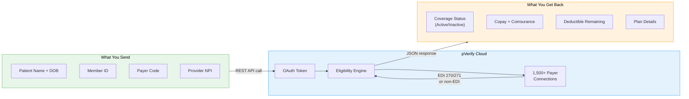
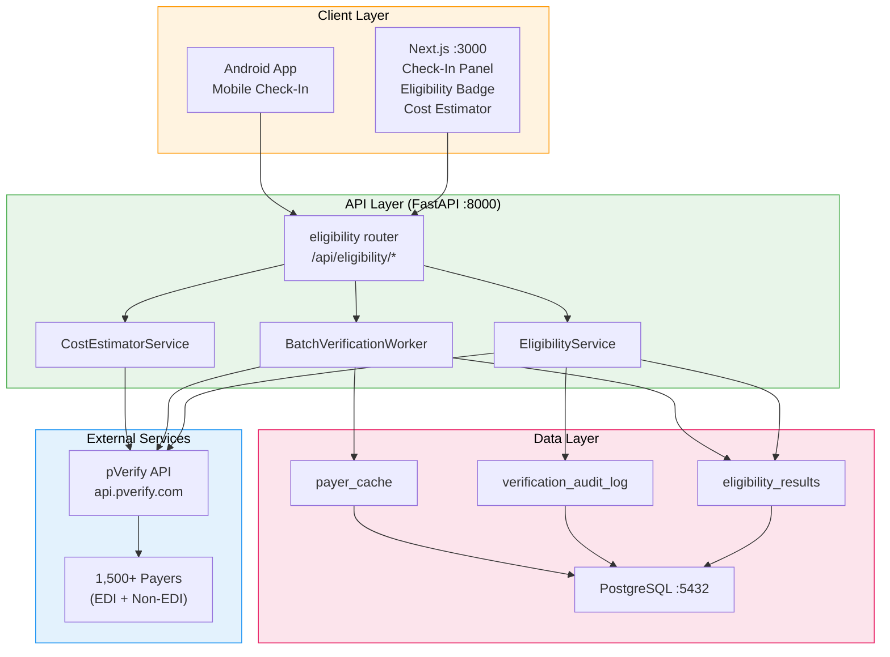

# pVerify Developer Onboarding Tutorial

**Welcome to the MPS PMS pVerify Integration Team**

This tutorial will take you from zero to building your first pVerify integration with the PMS. By the end, you will understand how real-time insurance eligibility verification works, have a running local environment, and have built and tested a custom eligibility workflow end-to-end.

**Document ID:** PMS-EXP-PVERIFY-002
**Version:** 1.0
**Date:** 2026-03-11
**Applies To:** PMS project (all platforms)
**Prerequisite:** [pVerify Setup Guide](73-pVerify-PMS-Developer-Setup-Guide.md)
**Estimated time:** 2-3 hours
**Difficulty:** Beginner-friendly

---

## What You Will Learn

1. What insurance eligibility verification is and why it matters in clinical workflows
2. How pVerify's API works — OAuth authentication, request/response structure, payer codes
3. How pVerify fits into the PMS architecture alongside other experiments
4. How to perform a real-time eligibility check for a patient
5. How to parse and store eligibility results in PostgreSQL
6. How to build a batch verification workflow for next-day schedules
7. How to display eligibility status in the Next.js frontend
8. How to handle errors, non-EDI payers, and edge cases
9. How to integrate eligibility data with the prior authorization workflow
10. HIPAA security considerations for eligibility data handling

## Part 1: Understanding pVerify (15 min read)

### 1.1 What Problem Does pVerify Solve?

Every time a patient arrives for an appointment, front desk staff must confirm that the patient's insurance is active, determine copay amounts, check deductible status, and verify that the planned services are covered. Without automation, this involves:

- Logging into individual payer portals (each payer has a different system)
- Calling payer phone lines and waiting on hold
- Manually entering patient data and transcribing results
- Repeating this for every patient, every visit

This takes **5-15 minutes per patient** and is the #1 bottleneck in the check-in process. When verification is skipped or done incorrectly, claims are denied — costing the practice revenue and rework.

**pVerify solves this** by providing a single REST API that connects to 1,500+ payers. One API call replaces the manual process. The PMS sends patient demographics and insurance details, and pVerify returns structured JSON with coverage status, copay amounts, deductible balances, and plan details in under 3 seconds.

### 1.2 How pVerify Works — The Key Pieces



Three main concepts:

1. **Authentication**: pVerify uses OAuth 2.0 client credentials. You exchange your Client ID + Secret for a time-limited bearer token, then include that token in all API calls.

2. **Eligibility Request**: You send patient demographics (name, DOB, member ID), the payer code (pVerify assigns a unique code to each of 1,500+ payers), and provider NPI. The API determines coverage status by querying the payer's system via EDI 270/271 transactions or, for non-EDI payers, via AI + manual verification.

3. **Eligibility Response**: pVerify returns structured JSON with coverage status, plan details, copay/coinsurance/deductible amounts, and any limitations or notes. The response is parsed and stored in PostgreSQL for display in the PMS.

### 1.3 How pVerify Fits with Other PMS Technologies

| Experiment | Relationship to pVerify | When to Use Together |
|------------|------------------------|---------------------|
| **47 — Availity API** | Complementary — Availity handles PA submission and claims; pVerify handles pre-encounter eligibility | pVerify flags PA requirements → Availity submits the PA |
| **43 — CMS PA Dataset** | Feeds into — pVerify identifies plan type → CMS dataset determines if PA is required for specific CPT codes | After eligibility check, cross-reference service codes against PA requirements |
| **44 — Payer Policies** | Feeds into — pVerify identifies the payer → Payer Policies provides payer-specific PA rules | Use payer code from eligibility result to look up payer-specific policies |
| **69 — Azure Doc Intel** | Cross-validation — OCR extracts insurance card data → pVerify validates it's active | Insurance card upload triggers pVerify eligibility check to confirm coverage |
| **51 — Amazon Connect** | Upstream — IVR collects insurance info before appointment → pVerify verifies in real-time during the call | Connect IVR triggers eligibility check as part of automated pre-visit workflow |

### 1.4 Key Vocabulary

| Term | Meaning |
|------|---------|
| **Eligibility** | Whether a patient's insurance plan is currently active and covers the requested service |
| **EDI 270/271** | ANSI X12 electronic data interchange format for eligibility inquiry (270) and response (271) |
| **Payer Code** | pVerify's unique identifier for each insurance company/plan (e.g., "00001" = Aetna) |
| **NPI** | National Provider Identifier — 10-digit number assigned to healthcare providers |
| **Subscriber** | The person who holds the insurance policy (may be the patient or a family member) |
| **Dependent** | A person covered under someone else's insurance policy (e.g., child on parent's plan) |
| **Copay** | Fixed dollar amount the patient pays per visit (e.g., $30 for office visit) |
| **Coinsurance** | Percentage of costs the patient pays after deductible (e.g., 20%) |
| **Deductible** | Amount the patient must pay out-of-pocket before insurance kicks in (e.g., $1,500/year) |
| **OOP Max** | Out-of-pocket maximum — yearly cap on patient's total spending; insurance pays 100% after this |
| **Service Code** | Category of healthcare service (e.g., "30" = health benefit plan coverage) |
| **Non-EDI Payer** | Insurance company not connected electronically — pVerify uses AI + manual verification |

### 1.5 Our Architecture



## Part 2: Environment Verification (15 min)

### 2.1 Checklist

1. **PMS backend is running:**
   ```bash
   curl -s http://localhost:8000/health
   # Expected: {"status": "healthy"}
   ```

2. **PMS frontend is running:**
   ```bash
   curl -s -o /dev/null -w "%{http_code}" http://localhost:3000
   # Expected: 200
   ```

3. **PostgreSQL is accessible:**
   ```bash
   psql -h localhost -p 5432 -U pms -d pms_db -c "SELECT 1;"
   # Expected: 1
   ```

4. **pVerify credentials are configured:**
   ```bash
   grep PVERIFY .env
   # Expected: PVERIFY_BASE_URL, PVERIFY_CLIENT_ID, PVERIFY_CLIENT_SECRET visible
   ```

5. **Eligibility tables exist:**
   ```bash
   psql -h localhost -p 5432 -U pms -d pms_db -c "\dt eligibility*"
   # Expected: eligibility_results table listed
   ```

6. **pVerify token endpoint reachable:**
   ```bash
   curl -s -o /dev/null -w "%{http_code}" -X POST https://api.pverify.com/Token \
     -H "Content-Type: application/x-www-form-urlencoded" \
     -d "Client_Id=${PVERIFY_CLIENT_ID}&client_secret=${PVERIFY_CLIENT_SECRET}&grant_type=client_credentials"
   # Expected: 200
   ```

### 2.2 Quick Test

Run a direct eligibility API test to confirm the full stack works:

```bash
# Get a PMS auth token
PMS_TOKEN=$(curl -s -X POST http://localhost:8000/api/auth/login \
  -H "Content-Type: application/json" \
  -d '{"username": "admin", "password": "admin"}' | python -c "import sys,json; print(json.load(sys.stdin)['access_token'])")

# Verify eligibility for a test patient
curl -X POST http://localhost:8000/api/eligibility/verify \
  -H "Authorization: Bearer ${PMS_TOKEN}" \
  -H "Content-Type: application/json" \
  -d '{"patient_id": "00000000-0000-0000-0000-000000000001"}'
```

If you get a JSON response with `eligibility_status`, the integration is working.

## Part 3: Build Your First Integration (45 min)

### 3.1 What We Are Building

We will build a **Patient Check-In Eligibility Workflow** that:

1. Accepts a patient ID at check-in
2. Calls pVerify to verify active coverage
3. Displays the eligibility result with copay and deductible info
4. Flags inactive coverage or high deductibles for staff attention
5. Logs the verification to the HIPAA audit trail

### 3.2 Step 1: Create the Eligibility Data Model

Create `app/models/eligibility.py`:

```python
"""SQLAlchemy models for eligibility verification."""

import uuid
from datetime import datetime

from sqlalchemy import Column, DateTime, ForeignKey, Integer, Numeric, String, Text
from sqlalchemy.dialects.postgresql import JSONB, UUID, INET

from app.db.base import Base


class EligibilityResult(Base):
    __tablename__ = "eligibility_results"

    id = Column(UUID(as_uuid=True), primary_key=True, default=uuid.uuid4)
    patient_id = Column(UUID(as_uuid=True), ForeignKey("patients.id"), nullable=False)
    encounter_id = Column(UUID(as_uuid=True), ForeignKey("encounters.id"))
    payer_code = Column(String(20), nullable=False)
    payer_name = Column(String(200))
    subscriber_id = Column(String(50))
    eligibility_status = Column(String(20), nullable=False)
    plan_name = Column(String(200))
    plan_type = Column(String(50))
    copay_amount = Column(Numeric(10, 2))
    coinsurance_pct = Column(Numeric(5, 2))
    deductible_total = Column(Numeric(10, 2))
    deductible_remaining = Column(Numeric(10, 2))
    out_of_pocket_max = Column(Numeric(10, 2))
    out_of_pocket_remaining = Column(Numeric(10, 2))
    coverage_start_date = Column(DateTime)
    coverage_end_date = Column(DateTime)
    raw_response = Column(JSONB)
    verified_at = Column(DateTime, nullable=False, default=datetime.utcnow)
    verified_by = Column(UUID(as_uuid=True), ForeignKey("users.id"))
    created_at = Column(DateTime, nullable=False, default=datetime.utcnow)
    updated_at = Column(DateTime, nullable=False, default=datetime.utcnow, onupdate=datetime.utcnow)


class VerificationAuditLog(Base):
    __tablename__ = "verification_audit_log"

    id = Column(UUID(as_uuid=True), primary_key=True, default=uuid.uuid4)
    user_id = Column(UUID(as_uuid=True), ForeignKey("users.id"), nullable=False)
    patient_id = Column(UUID(as_uuid=True), nullable=False)
    action = Column(String(50), nullable=False)
    payer_code = Column(String(20))
    request_payload = Column(JSONB)
    response_status = Column(String(20))
    response_time_ms = Column(Integer)
    error_message = Column(Text)
    ip_address = Column(INET)
    created_at = Column(DateTime, nullable=False, default=datetime.utcnow)
```

**Checkpoint**: The data model defines the database structure for storing eligibility results and audit logs.

### 3.3 Step 2: Implement the pVerify Client Token Manager

The `PVerifyClient` class (from the Setup Guide) handles OAuth automatically. Let's verify it works by writing a standalone test:

```python
# test_pverify_token.py — run manually to verify credentials
import asyncio
from app.services.pverify_client import PVerifyClient


async def main():
    client = PVerifyClient()
    token = await client._get_token()
    print(f"Token acquired: {token[:20]}...")
    print("Token length:", len(token))
    await client.close()


asyncio.run(main())
```

Run it:

```bash
python test_pverify_token.py
# Expected: Token acquired: eyJ...
```

**Checkpoint**: OAuth token acquisition works. The client can authenticate with pVerify.

### 3.4 Step 3: Build the Verification Endpoint

The `/api/eligibility/verify` endpoint (from the Setup Guide) handles the API layer. Let's test it with a curl command:

```bash
curl -X POST http://localhost:8000/api/eligibility/verify \
  -H "Authorization: Bearer ${PMS_TOKEN}" \
  -H "Content-Type: application/json" \
  -d '{
    "patient_id": "00000000-0000-0000-0000-000000000001",
    "service_codes": ["30"]
  }' | python -m json.tool
```

Examine the response fields:

```json
{
  "id": "a1b2c3d4-...",
  "patient_id": "00000000-0000-0000-0000-000000000001",
  "eligibility_status": "active",
  "payer_name": "Aetna",
  "plan_name": "Aetna Choice POS II",
  "plan_type": "PPO",
  "copay_amount": 30.0,
  "coinsurance_pct": 20.0,
  "deductible_total": 1500.0,
  "deductible_remaining": 750.0,
  "out_of_pocket_max": 6000.0,
  "out_of_pocket_remaining": 4200.0,
  "verified_at": "2026-03-11T10:30:00Z"
}
```

**Checkpoint**: The eligibility verification endpoint returns structured coverage data from pVerify.

### 3.5 Step 4: Add the Check-In UI Component

The `EligibilityBadge` component (from the Setup Guide) provides a one-click verification button. Let's extend it with alert logic for staff:

Create `src/components/eligibility/EligibilityAlert.tsx`:

```tsx
"use client";

import { EligibilityResult } from "@/lib/api/eligibility";

interface EligibilityAlertProps {
  result: EligibilityResult;
}

export function EligibilityAlert({ result }: EligibilityAlertProps) {
  const alerts: { type: "warning" | "error"; message: string }[] = [];

  if (result.eligibility_status === "inactive") {
    alerts.push({
      type: "error",
      message: "INACTIVE COVERAGE — Verify insurance with patient before proceeding",
    });
  }

  if (result.deductible_remaining != null && result.deductible_total != null) {
    const pctRemaining = result.deductible_remaining / result.deductible_total;
    if (pctRemaining > 0.8) {
      alerts.push({
        type: "warning",
        message: `High deductible: $${result.deductible_remaining.toFixed(2)} of $${result.deductible_total.toFixed(2)} remaining — patient may have significant out-of-pocket costs`,
      });
    }
  }

  if (result.eligibility_status === "unknown") {
    alerts.push({
      type: "warning",
      message: "Eligibility could not be confirmed — may be a non-EDI payer. Manual verification recommended.",
    });
  }

  if (alerts.length === 0) return null;

  return (
    <div className="space-y-2 mt-2">
      {alerts.map((alert, i) => (
        <div
          key={i}
          className={`px-3 py-2 rounded text-sm ${
            alert.type === "error"
              ? "bg-red-50 border border-red-200 text-red-800"
              : "bg-yellow-50 border border-yellow-200 text-yellow-800"
          }`}
        >
          {alert.message}
        </div>
      ))}
    </div>
  );
}
```

**Checkpoint**: The frontend displays eligibility status with contextual alerts for inactive coverage and high deductibles.

### 3.6 Step 5: Verify the Audit Trail

After running a verification, check that the audit log was populated:

```bash
psql -h localhost -p 5432 -U pms -d pms_db -c \
  "SELECT user_id, patient_id, action, response_status, response_time_ms, created_at
   FROM verification_audit_log
   ORDER BY created_at DESC LIMIT 5;"
```

Expected output:

```
 user_id | patient_id | action           | response_status | response_time_ms | created_at
---------+------------+------------------+-----------------+------------------+--------------------
 admin   | 00000...01 | eligibility_check| active          | 1842             | 2026-03-11 10:30:00
```

**Checkpoint**: Every eligibility verification is logged with user, patient, status, and response time for HIPAA compliance.

## Part 4: Evaluating Strengths and Weaknesses (15 min)

### 4.1 Strengths

- **Largest payer coverage**: 1,500+ payers including non-EDI payers (vision, CA IPAs) that no other clearinghouse covers
- **Simple REST API**: Clean JSON request/response — no X12 parsing required. The API abstracts away the complexity of EDI 270/271 transactions
- **Batch processing**: Unlimited batch eligibility included at no extra cost — verify entire next-day schedules in one job
- **Drop-in UI**: Pre-built JavaScript widget for rapid prototyping before custom UI is built
- **SOC 2 Type II + HIPAA**: Enterprise security compliance already handled by pVerify
- **Fast-PASS ePA**: AI-powered prior authorization submission available as an add-on, complementing Availity
- **Patient Estimator**: Out-of-pocket cost calculation using real eligibility data and CPT codes

### 4.2 Weaknesses

- **Non-EDI payer latency**: Some payers take 10-30 seconds (vs. 1-3 seconds for EDI payers). This requires async handling in the UI.
- **No open-source SDK for Python**: Only a .NET NuGet package exists. Python integration requires building a custom HTTP client (which we did).
- **Pricing tiers**: Transaction limits vary by plan. High-volume practices may need Enterprise tier ($200-900/month) plus implementation costs ($5K-30K for API integration).
- **No standalone sandbox**: Testing uses demo credentials against production-like endpoints, not a fully isolated sandbox.
- **Response schema varies by payer**: Some payers return more fields than others. The response parser must handle missing/null fields gracefully.
- **DoseSpot acquisition**: pVerify was recently acquired by DoseSpot — potential changes to pricing, API, or product direction.

### 4.3 When to Use pVerify vs Alternatives

| Scenario | Best Choice | Why |
|----------|-------------|-----|
| **Real-time eligibility at check-in** | **pVerify** | Fastest integration, broadest payer coverage, simple REST API |
| **PA submission with clinical documents** | **Availity (Exp 47)** | Full PA workflow with document attachment and status tracking |
| **Enterprise with existing Optum stack** | **Optum/Change Healthcare** | Tight integration with existing enterprise systems |
| **Developer-first, minimal overhead** | **Stedi** | Clean JSON-first API, developer-focused documentation |
| **Non-EDI payers (vision, CA IPAs)** | **pVerify** | Only platform that covers non-EDI payers |
| **Combined eligibility + claims + PA** | **pVerify + Availity** | Use both: pVerify for eligibility, Availity for PA/claims |

### 4.4 HIPAA / Healthcare Considerations

| Area | Assessment |
|------|-----------|
| **BAA available** | Yes — pVerify signs BAAs with healthcare customers |
| **SOC 2 Type II** | Certified (audited by Bernard Robinson & Company) |
| **Data in transit** | TLS 1.2+ for all API communication |
| **Data at rest** | Encrypted databases and disks on pVerify's infrastructure |
| **PHI exposure** | Minimal — only name, DOB, member ID, payer code sent. No clinical data transmitted. |
| **Audit trail** | PMS logs every verification request/response with user, patient, timestamp |
| **Access control** | PMS role-based: only `eligibility:read`/`eligibility:write` roles can access endpoints |
| **Data retention** | Raw responses stored encrypted in PostgreSQL. Configurable retention period for compliance. |

## Part 5: Debugging Common Issues (15 min read)

### Issue 1: "Invalid payerCode" Error

**Symptoms**: pVerify returns `transactionStatus: "Failed"` with message about invalid payer code.

**Cause**: The payer code stored in the PMS patient record doesn't match pVerify's payer directory. Payer codes are pVerify-specific identifiers, not standard payer IDs.

**Fix**: Look up the correct code at [pverify.com/payer-list](https://pverify.com/payer-list/). Build a mapping table in PostgreSQL that maps your PMS insurance company names to pVerify payer codes. Consider syncing this periodically via pVerify's payer list API.

### Issue 2: Token Expires Mid-Batch

**Symptoms**: Batch verification fails partway through with 401 errors.

**Cause**: The OAuth token expired during a long-running batch job. Default token TTL is 1 hour.

**Fix**: The `PVerifyClient._get_token()` method checks token expiry with a 60-second buffer and auto-refreshes. If you're seeing this, ensure you're reusing the same `PVerifyClient` instance across the batch (don't create a new instance per request) so the token cache is shared.

### Issue 3: Duplicate Verifications

**Symptoms**: Multiple `eligibility_results` rows for the same patient on the same day.

**Cause**: Staff clicks "Verify" multiple times, or both batch and manual verification run for the same patient.

**Fix**: Add a deduplication check before calling pVerify — if a verification exists for this patient within the last 24 hours with status "active", return the cached result. Add a `UNIQUE` constraint on `(patient_id, DATE(verified_at))` if you want database-level protection.

### Issue 4: Missing Fields in Response

**Symptoms**: `copay_amount` or `deductible_remaining` is null even though the patient has active coverage.

**Cause**: Not all payers return all benefit fields. Some return only eligibility status without financial details.

**Fix**: The `_safe_decimal()` parser handles null gracefully. In the UI, show "N/A" for missing fields rather than $0. Consider showing a "Limited data available — contact payer for details" note.

### Issue 5: Slow Response for Specific Payers

**Symptoms**: Eligibility checks for certain payers take 15-30 seconds while others return in 1-2 seconds.

**Cause**: Non-EDI payers require pVerify's AI + human verification layer, which is inherently slower.

**Fix**: Check `payer_cache.is_edi` for the payer. For non-EDI payers:
1. Show a loading spinner with "This payer may take up to 30 seconds"
2. Increase the HTTP timeout to 45 seconds for non-EDI payers
3. Prioritize these patients in the nightly batch verification so results are cached before check-in

## Part 6: Practice Exercise (45 min)

### Option A: Batch Verification for Tomorrow's Schedule

Build a `BatchVerificationWorker` that:
1. Queries the PMS for all encounters scheduled for tomorrow
2. For each patient, checks if a recent (< 24h) eligibility result exists
3. If not, calls pVerify to verify eligibility
4. Generates a summary report: total patients, active, inactive, unknown, errors
5. Flags patients with inactive coverage for staff follow-up

**Hints**:
- Use `apscheduler` to run the job at 8 PM nightly
- Process patients with configurable concurrency (start with 5 concurrent)
- Log each verification to the audit trail
- Store the batch summary in a `batch_verification_runs` table

### Option B: Cost Estimator Widget

Build a cost estimation feature that:
1. Takes a patient ID and list of CPT codes (planned services)
2. Retrieves the patient's eligibility data (from cache or live call)
3. Calculates estimated patient responsibility (copay + coinsurance after deductible)
4. Displays the estimate in a Next.js component
5. Allows the estimate to be printed or emailed to the patient

**Hints**:
- Use pVerify's Patient Estimator API if available on your plan
- Fall back to local calculation using: `patient_cost = copay + (service_cost * coinsurance_pct)` after deductible
- The estimate should clearly state it's an estimate, not a guarantee

### Option C: Insurance Card Verification Pipeline

Build a workflow that connects Azure Document Intelligence (Experiment 69) with pVerify:
1. Patient uploads a photo of their insurance card
2. Azure Doc Intel extracts: member ID, group number, payer name, subscriber name
3. Map the extracted payer name to a pVerify payer code
4. Call pVerify to verify the extracted data is valid and coverage is active
5. Display side-by-side: what the card says vs. what pVerify confirms

**Hints**:
- Use the `prebuilt-healthInsuranceCard.us` model from Azure Doc Intel
- Build a fuzzy-match function to map extracted payer names to pVerify payer codes
- Flag discrepancies between card data and pVerify response for staff review

## Part 7: Development Workflow and Conventions

### 7.1 File Organization

```
app/
├── api/
│   └── routes/
│       └── eligibility.py        # FastAPI router for eligibility endpoints
├── models/
│   └── eligibility.py            # SQLAlchemy models (EligibilityResult, AuditLog)
├── services/
│   ├── pverify_client.py         # Low-level pVerify HTTP client
│   ├── eligibility_service.py    # Business logic layer
│   └── batch_verification.py     # Batch worker (Phase 2)
└── core/
    └── config.py                 # PVERIFY_* settings

src/
├── components/
│   └── eligibility/
│       ├── EligibilityBadge.tsx   # Status display component
│       └── EligibilityAlert.tsx   # Alert component for staff
└── lib/
    └── api/
        └── eligibility.ts         # TypeScript API client
```

### 7.2 Naming Conventions

| Item | Convention | Example |
|------|-----------|---------|
| Python modules | snake_case | `pverify_client.py`, `eligibility_service.py` |
| Python classes | PascalCase | `PVerifyClient`, `EligibilityService` |
| FastAPI routes | `/api/eligibility/*` | `/api/eligibility/verify` |
| DB tables | snake_case, plural | `eligibility_results`, `verification_audit_log` |
| TypeScript files | camelCase | `eligibility.ts` |
| React components | PascalCase | `EligibilityBadge.tsx` |
| Environment vars | SCREAMING_SNAKE | `PVERIFY_CLIENT_ID` |

### 7.3 PR Checklist

- [ ] pVerify credentials are in `.env` (never committed)
- [ ] New API endpoints have authentication (`Depends(get_current_user)`)
- [ ] All pVerify API calls are logged to `verification_audit_log`
- [ ] Error responses don't leak pVerify internals (no raw stack traces)
- [ ] PHI fields are not logged at DEBUG level
- [ ] Response parsing handles null/missing fields gracefully
- [ ] Integration tests use mocked pVerify responses (no live API calls in CI)
- [ ] New database tables have appropriate indexes
- [ ] Frontend components handle loading, error, and empty states

### 7.4 Security Reminders

1. **Never log PHI**: Patient name, DOB, and member ID must not appear in application logs. Log only patient UUID and payer code.
2. **Credential rotation**: Rotate pVerify client secrets quarterly. Use a secrets manager in production.
3. **Token security**: OAuth tokens are stored in-memory only. Never persist tokens to disk, database, or browser localStorage.
4. **Minimum necessary**: Send only the fields pVerify requires. Don't include clinical data, diagnosis codes, or medication lists in eligibility requests.
5. **Audit everything**: Every verification request must create a `verification_audit_log` entry, even failed ones.
6. **Access control**: Only users with `eligibility:read` or `eligibility:write` roles can access eligibility endpoints.

## Part 8: Quick Reference Card

### Key Commands

```bash
# Verify single patient eligibility
curl -X POST http://localhost:8000/api/eligibility/verify \
  -H "Authorization: Bearer ${TOKEN}" \
  -H "Content-Type: application/json" \
  -d '{"patient_id": "UUID"}'

# Get latest eligibility for patient
curl http://localhost:8000/api/eligibility/patient/{patient_id}/latest \
  -H "Authorization: Bearer ${TOKEN}"

# Run tests
pytest tests/test_eligibility.py -v

# Check audit log
psql -c "SELECT * FROM verification_audit_log ORDER BY created_at DESC LIMIT 10;"
```

### Key Files

| File | Purpose |
|------|---------|
| `app/services/pverify_client.py` | HTTP client with OAuth + retry |
| `app/services/eligibility_service.py` | Business logic orchestration |
| `app/api/routes/eligibility.py` | FastAPI endpoints |
| `app/models/eligibility.py` | SQLAlchemy models |
| `src/lib/api/eligibility.ts` | Frontend API client |
| `src/components/eligibility/EligibilityBadge.tsx` | Status display |
| `.env` | pVerify credentials (never commit) |

### Key URLs

| Resource | URL |
|----------|-----|
| pVerify API Docs | https://docs.pverify.io/ |
| pVerify Postman | https://postman.pverify.com/ |
| pVerify Payer List | https://pverify.com/payer-list/ |
| PMS Eligibility API | http://localhost:8000/api/eligibility/verify |
| PMS OpenAPI Docs | http://localhost:8000/docs#/eligibility |

### Starter Template: Eligibility Check

```python
from app.services.pverify_client import PVerifyClient

async def quick_eligibility_check():
    client = PVerifyClient()
    try:
        result = await client.check_eligibility(
            payer_code="00001",           # Aetna
            provider_npi="1234567890",
            provider_last_name="Smith",
            subscriber_first_name="Jane",
            subscriber_last_name="Doe",
            subscriber_dob="05/20/1990",
            subscriber_member_id="W987654321",
            date_of_service="03/11/2026",
            service_codes=["30"],         # Health benefit
        )
        print(f"Status: {result['eligibilityStatus']}")
        print(f"Payer: {result.get('payerName')}")
        print(f"Plan: {result.get('planName')}")
    finally:
        await client.close()
```

## Next Steps

1. **Build the batch verifier**: Implement the `BatchVerificationWorker` from Practice Exercise Option A to automate next-day schedule verification
2. **Connect to PA workflow**: Wire pVerify eligibility results into the Availity PA submission flow (Experiment 47) to auto-flag services requiring prior authorization
3. **Add cost estimation**: Build the `CostEstimatorService` to show patients their expected out-of-pocket costs at check-in
4. **Insurance card cross-validation**: Connect Azure Document Intelligence (Experiment 69) to validate OCR-extracted insurance data against pVerify
5. **Review the [pVerify PRD](73-PRD-pVerify-PMS-Integration.md)** for the full Phase 2 and Phase 3 feature roadmap
