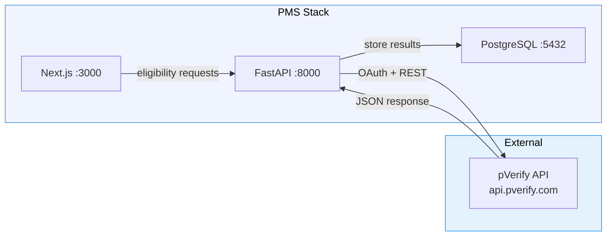

# pVerify Setup Guide for PMS Integration

**Document ID:** PMS-EXP-PVERIFY-001
**Version:** 1.0
**Date:** 2026-03-11
**Applies To:** PMS project (all platforms)
**Prerequisites Level:** Intermediate

---

## Table of Contents

1. [Overview](#1-overview)
2. [Prerequisites](#2-prerequisites)
3. [Part A: Configure pVerify API Access](#3-part-a-configure-pverify-api-access)
4. [Part B: Integrate with PMS Backend](#4-part-b-integrate-with-pms-backend)
5. [Part C: Integrate with PMS Frontend](#5-part-c-integrate-with-pms-frontend)
6. [Part D: Testing and Verification](#6-part-d-testing-and-verification)
7. [Troubleshooting](#7-troubleshooting)
8. [Reference Commands](#8-reference-commands)

---

## 1. Overview

This guide walks you through integrating pVerify's real-time insurance eligibility verification API into the PMS. By the end, you will have:

- A configured pVerify API client with OAuth token management
- FastAPI endpoints for single and batch eligibility verification
- PostgreSQL tables for storing eligibility results and audit logs
- A Next.js eligibility status component in the patient check-in flow
- Working integration tests against the pVerify demo environment



## 2. Prerequisites

### 2.1 Required Software

| Software | Minimum Version | Check Command |
|----------|----------------|---------------|
| Python | 3.11+ | `python --version` |
| Node.js | 18+ | `node --version` |
| PostgreSQL | 15+ | `psql --version` |
| Docker | 24+ | `docker --version` |
| httpx | 0.27+ | `pip show httpx` |
| pydantic | 2.0+ | `pip show pydantic` |

### 2.2 Installation of Prerequisites

Install the Python dependencies required for the pVerify client:

```bash
# From the PMS backend directory
pip install httpx pydantic apscheduler tenacity
```

Add to `requirements.txt`:

```
httpx>=0.27.0
pydantic>=2.0
apscheduler>=3.10
tenacity>=8.2
```

### 2.3 Verify PMS Services

Confirm all PMS services are running before proceeding:

```bash
# Backend health check
curl -s http://localhost:8000/health | python -m json.tool

# Frontend
curl -s -o /dev/null -w "%{http_code}" http://localhost:3000

# PostgreSQL
psql -h localhost -p 5432 -U pms -d pms_db -c "SELECT 1;"
```

All three should return successful responses.

## 3. Part A: Configure pVerify API Access

### Step 1: Obtain pVerify Credentials

1. Register for a pVerify developer account at [pverify.com](https://pverify.com)
2. Navigate to **API Settings** in your pVerify dashboard
3. Generate a **Client ID** and **Client Secret** for OAuth client credentials flow
4. Note your assigned **username** (for demo: `pverify_demo`)

### Step 2: Configure Environment Variables

Create or update your `.env` file in the backend directory:

```bash
# pVerify API Configuration
PVERIFY_BASE_URL=https://api.pverify.com
PVERIFY_CLIENT_ID=your_client_id_here
PVERIFY_CLIENT_SECRET=your_client_secret_here
PVERIFY_USERNAME=your_username_here
PVERIFY_PASSWORD=your_password_here

# For demo/testing (use demo credentials)
# PVERIFY_USERNAME=pverify_demo
# PVERIFY_PASSWORD=pverify@949
```

> **HIPAA Note**: Never commit `.env` files. Ensure `.env` is in `.gitignore`. In production, use a secrets manager (AWS Secrets Manager, HashiCorp Vault).

### Step 3: Verify API Connectivity

Test the OAuth token endpoint:

```bash
curl -X POST https://api.pverify.com/Token \
  -H "Content-Type: application/x-www-form-urlencoded" \
  -d "Client_Id=${PVERIFY_CLIENT_ID}&client_secret=${PVERIFY_CLIENT_SECRET}&grant_type=client_credentials"
```

Expected response:

```json
{
  "access_token": "eyJ...",
  "token_type": "bearer",
  "expires_in": 3600
}
```

**Checkpoint**: You have pVerify credentials configured and can obtain an OAuth token from the API.

## 4. Part B: Integrate with PMS Backend

### Step 1: Create the Database Schema

Create the migration file `alembic/versions/xxxx_add_pverify_tables.py` or run directly:

```sql
-- eligibility_results: stores verification outcomes
CREATE TABLE eligibility_results (
    id UUID PRIMARY KEY DEFAULT gen_random_uuid(),
    patient_id UUID NOT NULL REFERENCES patients(id),
    encounter_id UUID REFERENCES encounters(id),
    payer_code VARCHAR(20) NOT NULL,
    payer_name VARCHAR(200),
    subscriber_id VARCHAR(50),
    eligibility_status VARCHAR(20) NOT NULL,  -- 'active', 'inactive', 'unknown'
    plan_name VARCHAR(200),
    plan_type VARCHAR(50),  -- 'HMO', 'PPO', 'EPO', etc.
    copay_amount DECIMAL(10, 2),
    coinsurance_pct DECIMAL(5, 2),
    deductible_total DECIMAL(10, 2),
    deductible_remaining DECIMAL(10, 2),
    out_of_pocket_max DECIMAL(10, 2),
    out_of_pocket_remaining DECIMAL(10, 2),
    coverage_start_date DATE,
    coverage_end_date DATE,
    raw_response JSONB,  -- full pVerify response (encrypted at rest)
    verified_at TIMESTAMPTZ NOT NULL DEFAULT NOW(),
    verified_by UUID REFERENCES users(id),
    created_at TIMESTAMPTZ NOT NULL DEFAULT NOW(),
    updated_at TIMESTAMPTZ NOT NULL DEFAULT NOW()
);

CREATE INDEX idx_eligibility_patient ON eligibility_results(patient_id);
CREATE INDEX idx_eligibility_encounter ON eligibility_results(encounter_id);
CREATE INDEX idx_eligibility_verified_at ON eligibility_results(verified_at);

-- payer_cache: caches payer metadata to reduce API calls
CREATE TABLE payer_cache (
    payer_code VARCHAR(20) PRIMARY KEY,
    payer_name VARCHAR(200) NOT NULL,
    is_edi BOOLEAN DEFAULT true,
    supports_batch BOOLEAN DEFAULT true,
    avg_response_ms INTEGER,
    last_verified_at TIMESTAMPTZ,
    updated_at TIMESTAMPTZ NOT NULL DEFAULT NOW()
);

-- verification_audit_log: HIPAA audit trail
CREATE TABLE verification_audit_log (
    id UUID PRIMARY KEY DEFAULT gen_random_uuid(),
    user_id UUID NOT NULL REFERENCES users(id),
    patient_id UUID NOT NULL,
    action VARCHAR(50) NOT NULL,  -- 'eligibility_check', 'batch_verify', 'claim_status'
    payer_code VARCHAR(20),
    request_payload JSONB,  -- PHI-minimized request summary
    response_status VARCHAR(20),
    response_time_ms INTEGER,
    error_message TEXT,
    ip_address INET,
    created_at TIMESTAMPTZ NOT NULL DEFAULT NOW()
);

CREATE INDEX idx_audit_user ON verification_audit_log(user_id);
CREATE INDEX idx_audit_patient ON verification_audit_log(patient_id);
CREATE INDEX idx_audit_created ON verification_audit_log(created_at);
```

### Step 2: Implement the pVerify Client

Create `app/services/pverify_client.py`:

```python
"""pVerify API client with OAuth token management and retry logic."""

import time
from dataclasses import dataclass

import httpx
from tenacity import retry, stop_after_attempt, wait_exponential

from app.core.config import settings


@dataclass
class TokenInfo:
    access_token: str
    expires_at: float


class PVerifyClient:
    """Async HTTP client for the pVerify REST API."""

    def __init__(self):
        self.base_url = settings.PVERIFY_BASE_URL
        self.client_id = settings.PVERIFY_CLIENT_ID
        self.client_secret = settings.PVERIFY_CLIENT_SECRET
        self.username = settings.PVERIFY_USERNAME
        self._token: TokenInfo | None = None
        self._http = httpx.AsyncClient(
            base_url=self.base_url,
            timeout=30.0,
        )

    async def _get_token(self) -> str:
        """Obtain or refresh OAuth token."""
        if self._token and time.time() < self._token.expires_at - 60:
            return self._token.access_token

        response = await self._http.post(
            "/Token",
            data={
                "Client_Id": self.client_id,
                "client_secret": self.client_secret,
                "grant_type": "client_credentials",
            },
            headers={"Content-Type": "application/x-www-form-urlencoded"},
        )
        response.raise_for_status()
        data = response.json()

        self._token = TokenInfo(
            access_token=data["access_token"],
            expires_at=time.time() + data.get("expires_in", 3600),
        )
        return self._token.access_token

    async def _headers(self) -> dict:
        token = await self._get_token()
        return {
            "Authorization": f"Bearer {token}",
            "Client-User-Name": self.username,
            "Content-Type": "application/json",
        }

    @retry(stop=stop_after_attempt(3), wait=wait_exponential(min=1, max=10))
    async def check_eligibility(
        self,
        payer_code: str,
        provider_npi: str,
        provider_last_name: str,
        subscriber_first_name: str,
        subscriber_last_name: str,
        subscriber_dob: str,
        subscriber_member_id: str,
        date_of_service: str,
        service_codes: list[str] | None = None,
    ) -> dict:
        """
        Perform a real-time eligibility check via EligibilitySummary API.

        Args:
            payer_code: pVerify payer code (e.g., "00001" for Aetna)
            provider_npi: 10-digit NPI number
            provider_last_name: Rendering provider last name
            subscriber_first_name: Patient/subscriber first name
            subscriber_last_name: Patient/subscriber last name
            subscriber_dob: Date of birth (MM/DD/YYYY)
            subscriber_member_id: Insurance member ID
            date_of_service: Service date (MM/DD/YYYY)
            service_codes: Optional list of service type codes (e.g., ["30"] for health benefit)

        Returns:
            dict: Parsed eligibility response with coverage details
        """
        payload = {
            "payerCode": payer_code,
            "provider": {
                "npi": provider_npi,
                "lastName": provider_last_name,
            },
            "subscriber": {
                "firstName": subscriber_first_name,
                "lastName": subscriber_last_name,
                "dob": subscriber_dob,
                "memberID": subscriber_member_id,
            },
            "dateOfService": date_of_service,
        }
        if service_codes:
            payload["serviceCodes"] = service_codes

        headers = await self._headers()
        response = await self._http.post(
            "/API/EligibilitySummary",
            json=payload,
            headers=headers,
        )
        response.raise_for_status()
        return response.json()

    @retry(stop=stop_after_attempt(3), wait=wait_exponential(min=1, max=10))
    async def check_claim_status(
        self,
        payer_code: str,
        provider_npi: str,
        subscriber_member_id: str,
        claim_number: str | None = None,
        date_of_service: str | None = None,
    ) -> dict:
        """Query claim status via pVerify Claim Status API."""
        payload = {
            "payerCode": payer_code,
            "providerNPI": provider_npi,
            "subscriberMemberID": subscriber_member_id,
        }
        if claim_number:
            payload["claimNumber"] = claim_number
        if date_of_service:
            payload["dateOfService"] = date_of_service

        headers = await self._headers()
        response = await self._http.post(
            "/API/ClaimStatus",
            json=payload,
            headers=headers,
        )
        response.raise_for_status()
        return response.json()

    async def close(self):
        """Close the HTTP client."""
        await self._http.aclose()
```

### Step 3: Implement the Eligibility Service

Create `app/services/eligibility_service.py`:

```python
"""Business logic for patient eligibility verification."""

import logging
from datetime import date, datetime
from uuid import UUID

from sqlalchemy.ext.asyncio import AsyncSession

from app.models.eligibility import EligibilityResult, VerificationAuditLog
from app.services.pverify_client import PVerifyClient

logger = logging.getLogger(__name__)


class EligibilityService:
    """Orchestrates eligibility verification using PMS data + pVerify API."""

    def __init__(self, db: AsyncSession, pverify: PVerifyClient):
        self.db = db
        self.pverify = pverify

    async def verify_patient_eligibility(
        self,
        patient_id: UUID,
        encounter_id: UUID | None,
        user_id: UUID,
        service_codes: list[str] | None = None,
    ) -> EligibilityResult:
        """
        Verify a patient's insurance eligibility and store the result.

        1. Load patient demographics and insurance info from PMS
        2. Call pVerify EligibilitySummary API
        3. Parse and store the result
        4. Log the verification to audit trail
        """
        # 1. Load patient data (assumes Patient model has insurance fields)
        patient = await self._get_patient(patient_id)

        # 2. Call pVerify
        start_time = datetime.utcnow()
        try:
            response = await self.pverify.check_eligibility(
                payer_code=patient.insurance_payer_code,
                provider_npi=patient.provider_npi,
                provider_last_name=patient.provider_last_name,
                subscriber_first_name=patient.first_name,
                subscriber_last_name=patient.last_name,
                subscriber_dob=patient.date_of_birth.strftime("%m/%d/%Y"),
                subscriber_member_id=patient.insurance_member_id,
                date_of_service=date.today().strftime("%m/%d/%Y"),
                service_codes=service_codes,
            )
            elapsed_ms = int((datetime.utcnow() - start_time).total_seconds() * 1000)

            # 3. Parse response into EligibilityResult
            result = self._parse_eligibility_response(
                response, patient_id, encounter_id
            )
            result.verified_by = user_id
            self.db.add(result)

            # 4. Audit log
            audit = VerificationAuditLog(
                user_id=user_id,
                patient_id=patient_id,
                action="eligibility_check",
                payer_code=patient.insurance_payer_code,
                response_status=result.eligibility_status,
                response_time_ms=elapsed_ms,
            )
            self.db.add(audit)
            await self.db.commit()
            await self.db.refresh(result)

            logger.info(
                "Eligibility verified for patient %s: %s (%dms)",
                patient_id, result.eligibility_status, elapsed_ms,
            )
            return result

        except Exception as e:
            elapsed_ms = int((datetime.utcnow() - start_time).total_seconds() * 1000)
            audit = VerificationAuditLog(
                user_id=user_id,
                patient_id=patient_id,
                action="eligibility_check",
                payer_code=patient.insurance_payer_code,
                response_status="error",
                response_time_ms=elapsed_ms,
                error_message=str(e),
            )
            self.db.add(audit)
            await self.db.commit()
            raise

    def _parse_eligibility_response(
        self, response: dict, patient_id: UUID, encounter_id: UUID | None
    ) -> EligibilityResult:
        """Parse pVerify JSON response into EligibilityResult model."""
        # Map pVerify eligibilityStatus to our status enum
        pv_status = response.get("eligibilityStatus", "").lower()
        if "active" in pv_status:
            status = "active"
        elif "inactive" in pv_status:
            status = "inactive"
        else:
            status = "unknown"

        return EligibilityResult(
            patient_id=patient_id,
            encounter_id=encounter_id,
            payer_code=response.get("payerCode", ""),
            payer_name=response.get("payerName", ""),
            subscriber_id=response.get("subscriberID", ""),
            eligibility_status=status,
            plan_name=response.get("planName", ""),
            plan_type=response.get("planType", ""),
            copay_amount=self._safe_decimal(response.get("copayAmount")),
            coinsurance_pct=self._safe_decimal(response.get("coinsurancePct")),
            deductible_total=self._safe_decimal(response.get("deductibleTotal")),
            deductible_remaining=self._safe_decimal(response.get("deductibleRemaining")),
            out_of_pocket_max=self._safe_decimal(response.get("outOfPocketMax")),
            out_of_pocket_remaining=self._safe_decimal(response.get("outOfPocketRemaining")),
            raw_response=response,
        )

    @staticmethod
    def _safe_decimal(value) -> float | None:
        if value is None:
            return None
        try:
            return float(str(value).replace("$", "").replace(",", ""))
        except (ValueError, TypeError):
            return None

    async def _get_patient(self, patient_id: UUID):
        """Load patient from database. Placeholder for actual Patient query."""
        from app.models.patient import Patient
        result = await self.db.get(Patient, patient_id)
        if not result:
            raise ValueError(f"Patient {patient_id} not found")
        return result
```

### Step 4: Create FastAPI Router

Create `app/api/routes/eligibility.py`:

```python
"""Eligibility verification API endpoints."""

from uuid import UUID

from fastapi import APIRouter, Depends, HTTPException
from pydantic import BaseModel
from sqlalchemy.ext.asyncio import AsyncSession

from app.core.deps import get_current_user, get_db
from app.services.eligibility_service import EligibilityService
from app.services.pverify_client import PVerifyClient

router = APIRouter(prefix="/api/eligibility", tags=["eligibility"])


class EligibilityRequest(BaseModel):
    patient_id: UUID
    encounter_id: UUID | None = None
    service_codes: list[str] | None = None


class EligibilityResponse(BaseModel):
    id: UUID
    patient_id: UUID
    eligibility_status: str
    payer_name: str | None
    plan_name: str | None
    plan_type: str | None
    copay_amount: float | None
    coinsurance_pct: float | None
    deductible_total: float | None
    deductible_remaining: float | None
    out_of_pocket_max: float | None
    out_of_pocket_remaining: float | None
    verified_at: str


@router.post("/verify", response_model=EligibilityResponse)
async def verify_eligibility(
    request: EligibilityRequest,
    db: AsyncSession = Depends(get_db),
    current_user=Depends(get_current_user),
):
    """Verify a patient's insurance eligibility in real time."""
    pverify = PVerifyClient()
    service = EligibilityService(db, pverify)
    try:
        result = await service.verify_patient_eligibility(
            patient_id=request.patient_id,
            encounter_id=request.encounter_id,
            user_id=current_user.id,
            service_codes=request.service_codes,
        )
        return EligibilityResponse(
            id=result.id,
            patient_id=result.patient_id,
            eligibility_status=result.eligibility_status,
            payer_name=result.payer_name,
            plan_name=result.plan_name,
            plan_type=result.plan_type,
            copay_amount=result.copay_amount,
            coinsurance_pct=result.coinsurance_pct,
            deductible_total=result.deductible_total,
            deductible_remaining=result.deductible_remaining,
            out_of_pocket_max=result.out_of_pocket_max,
            out_of_pocket_remaining=result.out_of_pocket_remaining,
            verified_at=result.verified_at.isoformat(),
        )
    except ValueError as e:
        raise HTTPException(status_code=404, detail=str(e))
    except Exception as e:
        raise HTTPException(status_code=502, detail=f"pVerify API error: {e}")
    finally:
        await pverify.close()


@router.get("/patient/{patient_id}/latest", response_model=EligibilityResponse | None)
async def get_latest_eligibility(
    patient_id: UUID,
    db: AsyncSession = Depends(get_db),
    current_user=Depends(get_current_user),
):
    """Get the most recent eligibility result for a patient."""
    from sqlalchemy import select
    from app.models.eligibility import EligibilityResult

    stmt = (
        select(EligibilityResult)
        .where(EligibilityResult.patient_id == patient_id)
        .order_by(EligibilityResult.verified_at.desc())
        .limit(1)
    )
    result = await db.execute(stmt)
    row = result.scalar_one_or_none()
    if not row:
        return None
    return EligibilityResponse(
        id=row.id,
        patient_id=row.patient_id,
        eligibility_status=row.eligibility_status,
        payer_name=row.payer_name,
        plan_name=row.plan_name,
        plan_type=row.plan_type,
        copay_amount=row.copay_amount,
        coinsurance_pct=row.coinsurance_pct,
        deductible_total=row.deductible_total,
        deductible_remaining=row.deductible_remaining,
        out_of_pocket_max=row.out_of_pocket_max,
        out_of_pocket_remaining=row.out_of_pocket_remaining,
        verified_at=row.verified_at.isoformat(),
    )
```

### Step 5: Register the Router

Add to your FastAPI app initialization (`app/main.py` or equivalent):

```python
from app.api.routes.eligibility import router as eligibility_router

app.include_router(eligibility_router)
```

### Step 6: Add Configuration Settings

Update `app/core/config.py`:

```python
class Settings(BaseSettings):
    # ... existing settings ...

    # pVerify API
    PVERIFY_BASE_URL: str = "https://api.pverify.com"
    PVERIFY_CLIENT_ID: str = ""
    PVERIFY_CLIENT_SECRET: str = ""
    PVERIFY_USERNAME: str = ""
    PVERIFY_PASSWORD: str = ""
```

**Checkpoint**: The PMS backend has a pVerify client, eligibility service, database schema, and API endpoints configured. The `/api/eligibility/verify` endpoint accepts a patient ID and returns structured eligibility data.

## 5. Part C: Integrate with PMS Frontend

### Step 1: Add Environment Variable

In the Next.js `.env.local`:

```
NEXT_PUBLIC_API_URL=http://localhost:8000
```

### Step 2: Create the Eligibility API Client

Create `src/lib/api/eligibility.ts`:

```typescript
export interface EligibilityResult {
  id: string;
  patient_id: string;
  eligibility_status: "active" | "inactive" | "unknown";
  payer_name: string | null;
  plan_name: string | null;
  plan_type: string | null;
  copay_amount: number | null;
  coinsurance_pct: number | null;
  deductible_total: number | null;
  deductible_remaining: number | null;
  out_of_pocket_max: number | null;
  out_of_pocket_remaining: number | null;
  verified_at: string;
}

const API_URL = process.env.NEXT_PUBLIC_API_URL;

export async function verifyEligibility(
  patientId: string,
  encounterId?: string,
  serviceCodes?: string[]
): Promise<EligibilityResult> {
  const response = await fetch(`${API_URL}/api/eligibility/verify`, {
    method: "POST",
    headers: { "Content-Type": "application/json" },
    credentials: "include",
    body: JSON.stringify({
      patient_id: patientId,
      encounter_id: encounterId,
      service_codes: serviceCodes,
    }),
  });
  if (!response.ok) {
    throw new Error(`Eligibility check failed: ${response.statusText}`);
  }
  return response.json();
}

export async function getLatestEligibility(
  patientId: string
): Promise<EligibilityResult | null> {
  const response = await fetch(
    `${API_URL}/api/eligibility/patient/${patientId}/latest`,
    { credentials: "include" }
  );
  if (!response.ok) return null;
  return response.json();
}
```

### Step 3: Create the Eligibility Status Component

Create `src/components/eligibility/EligibilityBadge.tsx`:

```tsx
"use client";

import { useState } from "react";
import { EligibilityResult, verifyEligibility, getLatestEligibility } from "@/lib/api/eligibility";

interface EligibilityBadgeProps {
  patientId: string;
  encounterId?: string;
}

const STATUS_STYLES = {
  active: "bg-green-100 text-green-800 border-green-300",
  inactive: "bg-red-100 text-red-800 border-red-300",
  unknown: "bg-yellow-100 text-yellow-800 border-yellow-300",
} as const;

export function EligibilityBadge({ patientId, encounterId }: EligibilityBadgeProps) {
  const [result, setResult] = useState<EligibilityResult | null>(null);
  const [loading, setLoading] = useState(false);
  const [error, setError] = useState<string | null>(null);

  async function handleVerify() {
    setLoading(true);
    setError(null);
    try {
      const data = await verifyEligibility(patientId, encounterId);
      setResult(data);
    } catch (err) {
      setError(err instanceof Error ? err.message : "Verification failed");
    } finally {
      setLoading(false);
    }
  }

  if (!result) {
    return (
      <div className="flex items-center gap-2">
        <button
          onClick={handleVerify}
          disabled={loading}
          className="px-3 py-1 text-sm font-medium bg-blue-600 text-white rounded hover:bg-blue-700 disabled:opacity-50"
        >
          {loading ? "Verifying..." : "Verify Eligibility"}
        </button>
        {error && <span className="text-sm text-red-600">{error}</span>}
      </div>
    );
  }

  const statusStyle = STATUS_STYLES[result.eligibility_status] ?? STATUS_STYLES.unknown;

  return (
    <div className="border rounded-lg p-4 space-y-3">
      <div className="flex items-center justify-between">
        <span className={`px-2 py-1 text-xs font-semibold rounded border ${statusStyle}`}>
          {result.eligibility_status.toUpperCase()}
        </span>
        <span className="text-xs text-gray-500">
          Verified: {new Date(result.verified_at).toLocaleString()}
        </span>
      </div>

      {result.payer_name && (
        <div className="text-sm">
          <span className="font-medium">{result.payer_name}</span>
          {result.plan_name && <span className="text-gray-500"> — {result.plan_name}</span>}
          {result.plan_type && <span className="text-gray-400"> ({result.plan_type})</span>}
        </div>
      )}

      <div className="grid grid-cols-2 gap-2 text-sm">
        {result.copay_amount != null && (
          <div>
            <span className="text-gray-500">Copay:</span>{" "}
            <span className="font-medium">${result.copay_amount.toFixed(2)}</span>
          </div>
        )}
        {result.coinsurance_pct != null && (
          <div>
            <span className="text-gray-500">Coinsurance:</span>{" "}
            <span className="font-medium">{result.coinsurance_pct}%</span>
          </div>
        )}
        {result.deductible_remaining != null && (
          <div>
            <span className="text-gray-500">Deductible remaining:</span>{" "}
            <span className="font-medium">${result.deductible_remaining.toFixed(2)}</span>
          </div>
        )}
        {result.out_of_pocket_remaining != null && (
          <div>
            <span className="text-gray-500">OOP remaining:</span>{" "}
            <span className="font-medium">${result.out_of_pocket_remaining.toFixed(2)}</span>
          </div>
        )}
      </div>

      <button
        onClick={handleVerify}
        disabled={loading}
        className="text-xs text-blue-600 hover:underline disabled:opacity-50"
      >
        {loading ? "Re-verifying..." : "Re-verify"}
      </button>
    </div>
  );
}
```

### Step 4: Add to Patient Check-In Page

In your patient check-in or encounter view component:

```tsx
import { EligibilityBadge } from "@/components/eligibility/EligibilityBadge";

// Inside the check-in form:
<EligibilityBadge patientId={patient.id} encounterId={encounter?.id} />
```

**Checkpoint**: The Next.js frontend has an API client, an `EligibilityBadge` component, and is wired into the patient check-in flow to display real-time eligibility status.

## 6. Part D: Testing and Verification

### Step 1: Backend Health Check

```bash
# Verify the eligibility endpoint is registered
curl -s http://localhost:8000/openapi.json | python -m json.tool | grep eligibility
```

Expected: `/api/eligibility/verify` and `/api/eligibility/patient/{patient_id}/latest` listed.

### Step 2: Test Token Acquisition

```bash
curl -X POST https://api.pverify.com/Token \
  -H "Content-Type: application/x-www-form-urlencoded" \
  -d "Client_Id=${PVERIFY_CLIENT_ID}&client_secret=${PVERIFY_CLIENT_SECRET}&grant_type=client_credentials"
```

Expected: 200 OK with `access_token` in response.

### Step 3: Test Eligibility Verification

```bash
# Using demo credentials against pVerify test endpoint
curl -X POST http://localhost:8000/api/eligibility/verify \
  -H "Content-Type: application/json" \
  -H "Authorization: Bearer ${PMS_AUTH_TOKEN}" \
  -d '{
    "patient_id": "00000000-0000-0000-0000-000000000001",
    "service_codes": ["30"]
  }'
```

Expected response:

```json
{
  "id": "uuid-here",
  "patient_id": "00000000-0000-0000-0000-000000000001",
  "eligibility_status": "active",
  "payer_name": "Aetna",
  "plan_name": "Aetna Choice POS II",
  "copay_amount": 30.00,
  "deductible_remaining": 750.00,
  "verified_at": "2026-03-11T10:30:00Z"
}
```

### Step 4: Verify Audit Logging

```bash
psql -h localhost -p 5432 -U pms -d pms_db -c \
  "SELECT action, payer_code, response_status, response_time_ms FROM verification_audit_log ORDER BY created_at DESC LIMIT 5;"
```

### Step 5: Integration Test

Create `tests/test_eligibility.py`:

```python
import pytest
from unittest.mock import AsyncMock, patch

from app.services.pverify_client import PVerifyClient


@pytest.mark.asyncio
async def test_eligibility_check_returns_active():
    """Test that a valid eligibility check returns active status."""
    mock_response = {
        "eligibilityStatus": "Active Coverage",
        "payerCode": "00001",
        "payerName": "Aetna",
        "planName": "Aetna Choice POS II",
        "planType": "PPO",
        "copayAmount": "30.00",
        "deductibleTotal": "1500.00",
        "deductibleRemaining": "750.00",
    }

    with patch.object(PVerifyClient, "check_eligibility", new_callable=AsyncMock) as mock:
        mock.return_value = mock_response
        client = PVerifyClient()
        result = await client.check_eligibility(
            payer_code="00001",
            provider_npi="1234567890",
            provider_last_name="Smith",
            subscriber_first_name="John",
            subscriber_last_name="Doe",
            subscriber_dob="01/15/1985",
            subscriber_member_id="W123456789",
            date_of_service="03/11/2026",
        )
        assert result["eligibilityStatus"] == "Active Coverage"
        assert result["payerName"] == "Aetna"
```

**Checkpoint**: All endpoints return expected responses, audit logs are recording, and integration tests pass with mocked pVerify responses.

## 7. Troubleshooting

### OAuth Token Failure (401 Unauthorized)

**Symptoms**: `check_eligibility` raises `httpx.HTTPStatusError` with status 401.

**Cause**: Expired or invalid credentials, or incorrect grant type.

**Fix**:
1. Verify credentials in `.env` are correct
2. Test token endpoint directly with `curl`
3. Check if client credentials flow is enabled for your pVerify account (some accounts use username/password only)
4. Ensure `Client_Id` uses underscore (not camelCase) in the token request

### Payer Code Not Found (Invalid payerCode)

**Symptoms**: pVerify returns `"transactionStatus": "Failed"` with message about invalid payer.

**Cause**: The payer code in PMS doesn't match pVerify's payer directory.

**Fix**:
1. Look up the correct payer code at [pverify.com/payer-list](https://pverify.com/payer-list/)
2. Build a payer code mapping table in PostgreSQL
3. Use pVerify's payer list API to sync codes periodically

### Slow Response from Non-EDI Payers

**Symptoms**: Eligibility check takes 10-30 seconds for certain payers.

**Cause**: Non-EDI payers require pVerify's AI + manual verification layer, which is slower than EDI-connected payers.

**Fix**:
1. Flag non-EDI payers in `payer_cache` table
2. For non-EDI payers, show a "Verification in progress" status and use async polling
3. Prioritize non-EDI patients in the nightly batch verification

### Port 443 Blocked (Connection Timeout)

**Symptoms**: `httpx.ConnectTimeout` when calling pVerify API.

**Cause**: Firewall or Docker network blocks outbound HTTPS.

**Fix**:
1. Test connectivity: `curl -v https://api.pverify.com/Token`
2. In Docker, ensure the container has outbound network access
3. Check corporate proxy settings — may need `HTTPS_PROXY` env var

### Database Migration Errors

**Symptoms**: Tables not created or column type mismatches.

**Fix**:
1. Run `alembic upgrade head` to apply migrations
2. Verify table existence: `\dt eligibility_results` in psql
3. Check for UUID extension: `CREATE EXTENSION IF NOT EXISTS "pgcrypto";`

## 8. Reference Commands

### Daily Development Workflow

```bash
# Start PMS services
docker compose up -d

# Run eligibility integration tests
pytest tests/test_eligibility.py -v

# Check audit log for recent verifications
psql -c "SELECT * FROM verification_audit_log ORDER BY created_at DESC LIMIT 10;"

# View pVerify API response times
psql -c "SELECT AVG(response_time_ms), MAX(response_time_ms), COUNT(*) FROM verification_audit_log WHERE created_at > NOW() - INTERVAL '24 hours';"
```

### Management Commands

```bash
# Trigger batch verification for tomorrow's schedule
curl -X POST http://localhost:8000/api/eligibility/batch/tomorrow \
  -H "Authorization: Bearer ${PMS_AUTH_TOKEN}"

# Refresh payer cache from pVerify
curl -X POST http://localhost:8000/api/eligibility/payers/sync \
  -H "Authorization: Bearer ${PMS_AUTH_TOKEN}"

# View eligibility verification statistics
curl http://localhost:8000/api/eligibility/stats \
  -H "Authorization: Bearer ${PMS_AUTH_TOKEN}"
```

### Useful URLs

| Resource | URL |
|----------|-----|
| pVerify API Docs | https://docs.pverify.io/ |
| pVerify Postman Collection | https://postman.pverify.com/ |
| pVerify Payer List | https://pverify.com/payer-list/ |
| PMS Eligibility Endpoint | http://localhost:8000/api/eligibility/verify |
| PMS Eligibility OpenAPI | http://localhost:8000/docs#/eligibility |

## Next Steps

After completing this setup guide:

1. Work through the [pVerify Developer Tutorial](73-pVerify-Developer-Tutorial.md) to build your first end-to-end eligibility workflow
2. Review the [pVerify PRD](73-PRD-pVerify-PMS-Integration.md) for the full feature scope and implementation phases
3. Explore the [Availity API Setup Guide](47-AvailityAPI-PMS-Developer-Setup-Guide.md) for complementary PA integration

## Resources

- [pVerify Official API Documentation](https://docs.pverify.io/)
- [pVerify Public Postman Workspace](https://www.postman.com/pverify/pverify-s-public-workspace/collection/u6q5dba/pverify-api-documentation)
- [pVerify Payer List](https://pverify.com/payer-list/)
- [pVerify Pricing](https://pverify.com/pricing/)
- [pVerify SOC 2 Compliance](https://www.pverify.com/pverify-announces-successful-soc2-compliance-examination/)
- [pVerify FHIR Integration Guide](https://www.mindbowser.com/integrating-pverify-with-fhir-guide/)
