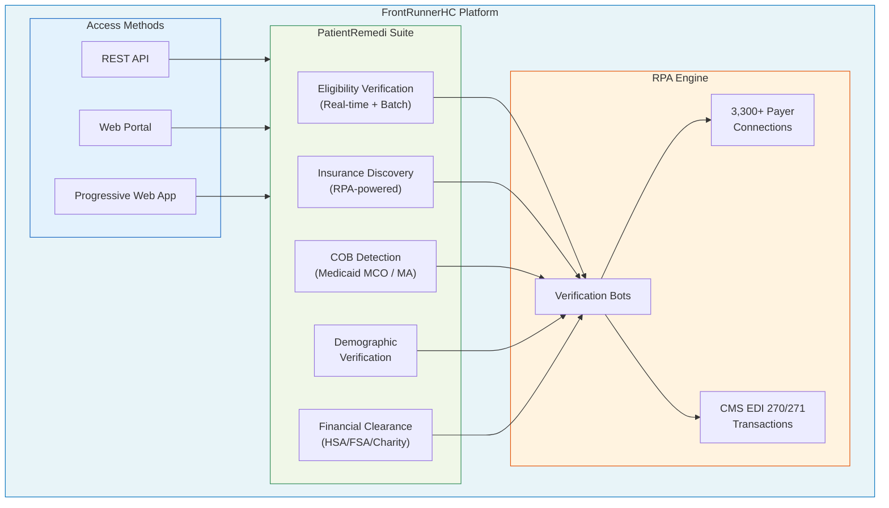
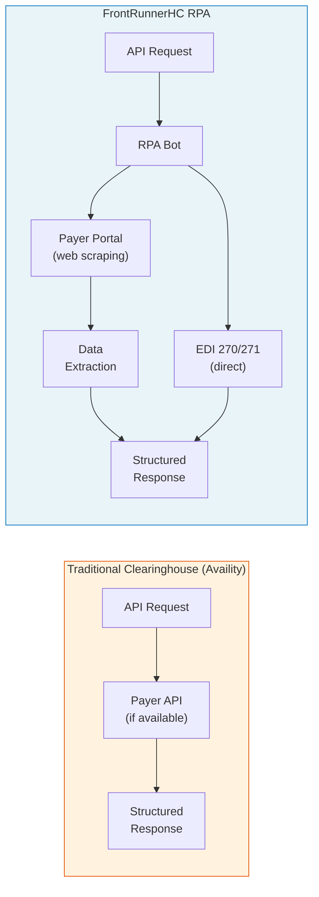
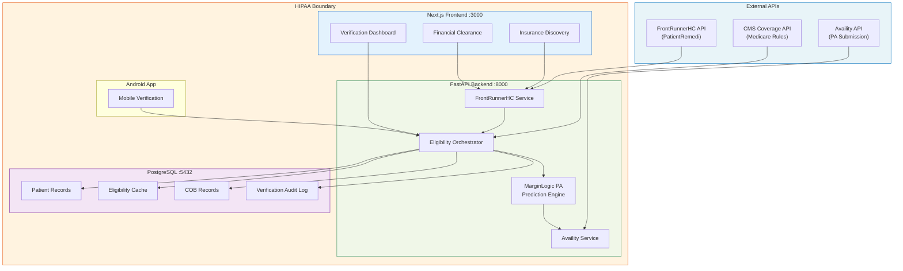
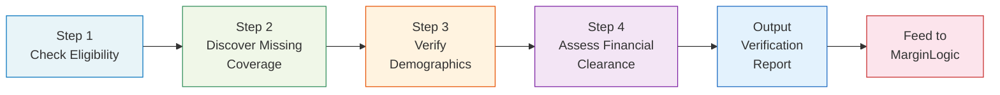
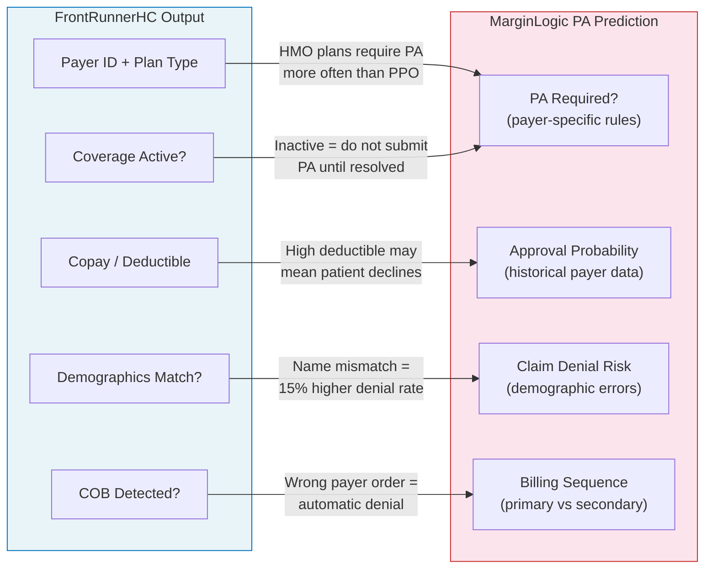
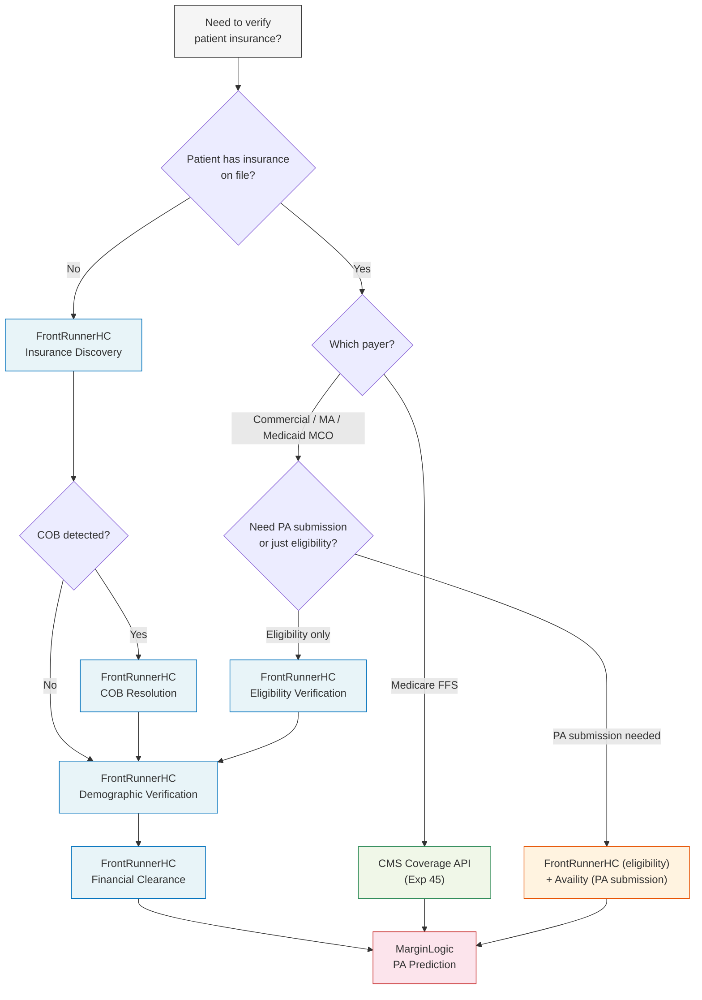

# FrontRunnerHC Developer Onboarding Tutorial

**Welcome to the MPS PMS FrontRunnerHC Integration Team**

This tutorial will take you from zero to building your first Patient Insurance Verification Pipeline using FrontRunnerHC's PatientRemedi platform. By the end, you will understand how FrontRunnerHC's RPA-powered eligibility verification and insurance discovery work, have built a complete pipeline that checks eligibility, discovers missing coverage, verifies demographics, and assesses financial clearance — and you will understand how this eligibility data feeds into MarginLogic's PA prediction engine.

**Document ID:** PMS-EXP-FRHC-002
**Version:** 1.0
**Date:** 2026-03-11
**Applies To:** PMS project (all platforms)
**Prerequisite:** [FrontRunnerHC Setup Guide](74-FrontRunnerHC-PMS-Developer-Setup-Guide.md)
**Estimated time:** 2-3 hours
**Difficulty:** Beginner-friendly

---

## What You Will Learn

1. What FrontRunnerHC solves and why RPA-powered eligibility verification matters
2. How PatientRemedi works — eligibility, insurance discovery, COB detection, and financial clearance
3. How FrontRunnerHC fits alongside Availity, CMS Coverage API, and other PMS technologies
4. How to verify your development environment
5. How to build a Patient Insurance Verification Pipeline end-to-end
6. How eligibility data feeds into MarginLogic's PA prediction engine
7. When to use FrontRunnerHC vs Availity vs CMS Coverage API
8. How to debug common integration issues
9. HIPAA and compliance considerations for real-time eligibility data

---

## Part 1: Understanding FrontRunnerHC (15 min read)

### 1.1 What Problem Does FrontRunnerHC Solve?

At Texas Retina Associates, 2 million people switch insurance plans every month nationally. A patient who had UnitedHealthcare last visit may now be on a Medicaid MCO. A patient who says they have no insurance may actually have undiscovered coverage through a spouse's employer plan or a Medicare Advantage plan they forgot to mention.

**Without FrontRunnerHC (current state):**
- Front desk manually calls payers to verify eligibility — 8-12 minutes per patient
- Patients with no insurance on file get treated as self-pay, leaving revenue on the table
- Coordination of Benefits (COB) issues cause claim denials weeks later — payers reject claims because a primary plan was not billed first
- Demographic mismatches (wrong DOB, wrong address, misspelled name) cause claim rejections that take days to resolve
- Staff cannot verify HSA/FSA balances or charity eligibility before the visit
- Expired or changed insurance is not caught until the claim is denied 30-60 days later

**With FrontRunnerHC:**
- Real-time eligibility verification across 3,300+ payer plans — the largest payer network in the industry
- RPA-powered insurance discovery finds coverage even when no insurance info is provided
- Automatic COB detection catches Medicaid MCO and Medicare Advantage coordination issues before the visit
- Demographic verification and correction fixes mismatches before claims go out
- Financial clearance checks HSA/FSA balances and charity qualification at the front desk
- Continuous verification catches the 2M monthly plan switches before they become claim denials

### 1.2 How FrontRunnerHC Works — The Key Pieces



**Five core capabilities:**

1. **Eligibility Verification** — Submits CMS EDI 270 transactions and receives 271 responses in real time. Supports both real-time (single patient) and batch (entire schedule) modes. Covers 3,300+ payer plans, the broadest network in the industry.

2. **Insurance Discovery** — When a patient has no insurance on file (or stale information), the RPA engine searches across payer databases using demographic data alone (name, DOB, SSN last 4). Finds hidden coverage that would otherwise be billed as self-pay.

3. **COB Detection** — Automatically identifies Coordination of Benefits situations: patients with both Medicare and Medicaid MCO, or Medicare Advantage plus a supplement plan. Determines primary vs secondary payer order to prevent billing sequence denials.

4. **Demographic Verification** — Cross-references patient demographics with payer records. Catches and corrects mismatches in name spelling, date of birth, address, and subscriber ID before claims are submitted.

5. **Financial Clearance** — Checks HSA/FSA account balances, verifies charity care qualification, and estimates patient responsibility — enabling the front desk to collect accurately at the time of service.

### 1.3 The RPA Advantage

Unlike traditional clearinghouse APIs (like Availity) that rely on payer-provided API endpoints, FrontRunnerHC uses **Robotic Process Automation** to connect to payers. This distinction matters:



**Why this matters:** Many smaller payers and Medicaid MCOs do not offer EDI 270/271 endpoints. FrontRunnerHC's bots log into payer portals directly to retrieve eligibility data that would otherwise require a phone call. This is how they cover 3,300+ plans — far more than any pure API-based solution.

### 1.4 How FrontRunnerHC Fits with Other PMS Technologies

| Technology | Experiment | What It Provides | FrontRunnerHC Relationship |
|------------|-----------|-----------------|---------------------------|
| CMS Coverage API | Exp 45 | Medicare LCD/NCD coverage rules | FrontRunnerHC verifies eligibility; CMS API determines what is covered under that eligibility |
| Availity | Exp 47 | Multi-payer clearinghouse (eligibility, PA, claims) | FrontRunnerHC covers more payers via RPA; Availity offers PA submission and claims — they complement each other |
| FHIR Prior Auth | Exp 48 | HL7 FHIR PA workflow standard | FrontRunnerHC eligibility data feeds into FHIR CoverageEligibilityResponse resources |
| PA Competitive Landscape | Exp 56 | PA automation market analysis | FrontRunnerHC is a key player in the pre-PA eligibility verification step |
| MarginLogic | Internal | PA prediction engine | FrontRunnerHC eligibility data is a required input to MarginLogic's prediction model |

### 1.5 Key Vocabulary

| Term | Meaning |
|------|---------|
| **PatientRemedi** | FrontRunnerHC's product suite for patient insurance verification and financial clearance |
| **EDI 270** | Electronic eligibility inquiry transaction sent to the payer (HIPAA X12 standard) |
| **EDI 271** | Electronic eligibility response from the payer containing coverage details |
| **RPA** | Robotic Process Automation — bots that interact with payer portals to retrieve data unavailable via API |
| **COB** | Coordination of Benefits — rules determining which payer is primary, secondary, etc. when a patient has multiple plans |
| **Insurance Discovery** | The process of finding undisclosed or unknown coverage by searching payer databases using patient demographics |
| **Medicaid MCO** | Medicaid Managed Care Organization — a commercial insurer administering Medicaid benefits in a state |
| **Medicare Advantage (MA)** | Medicare Part C — commercial plans (UHC, Humana, Aetna) that replace traditional Medicare |
| **Financial Clearance** | Pre-visit determination of patient financial responsibility: copay, deductible, HSA/FSA balances, charity eligibility |
| **Payer Network** | The set of insurance companies FrontRunnerHC can connect to — 3,300+ plans currently |
| **CORE** | Committee on Operating Rules for Information Exchange — operating rules for HIPAA transactions |
| **SOC2** | Service Organization Control Type 2 — security/privacy compliance certification |
| **HSA/FSA** | Health Savings Account / Flexible Spending Account — tax-advantaged accounts patients use for medical expenses |
| **Subscriber** | The person who holds the insurance policy (may differ from the patient, e.g., a parent or spouse) |

### 1.6 Our Architecture



**Data flow:** FrontRunnerHC eligibility data flows through the Eligibility Orchestrator into MarginLogic's PA Prediction Engine. MarginLogic uses coverage details, COB status, and payer plan information to predict whether a PA will be required and whether it will be approved — before the PA is even submitted through Availity.

---

## Part 2: Environment Verification (15 min)

### 2.1 Checklist

Before building anything, confirm your environment is ready:

```bash
# 1. FrontRunnerHC credentials set
source .env
[ -n "$FRHC_API_KEY" ] && echo "PASS: API Key" || echo "FAIL: FRHC_API_KEY not set"
[ -n "$FRHC_CLIENT_ID" ] && echo "PASS: Client ID" || echo "FAIL: FRHC_CLIENT_ID not set"
[ -n "$FRHC_BASE_URL" ] && echo "PASS: Base URL" || echo "FAIL: FRHC_BASE_URL not set"

# 2. API connectivity
curl -s -o /dev/null -w "%{http_code}" \
  -H "Authorization: Bearer $FRHC_API_KEY" \
  "$FRHC_BASE_URL/api/v1/health"
# Expected: 200

# 3. PMS backend running
curl -s -o /dev/null -w "%{http_code}" http://localhost:8000/health
# Expected: 200

# 4. PostgreSQL accepting connections
pg_isready -h localhost -p 5432
# Expected: accepting connections

# 5. Python dependencies installed
python -c "import httpx, pydantic; print('PASS: Dependencies')"
```

### 2.2 Quick Smoke Test

```bash
# Verify eligibility for a test patient via PMS backend
curl -s -X POST "http://localhost:8000/api/frhc/eligibility/verify" \
  -H "Content-Type: application/json" \
  -d '{
    "patient_first_name": "Jane",
    "patient_last_name": "TestPatient",
    "date_of_birth": "1965-03-15",
    "member_id": "TEST123456",
    "payer_id": "UHC",
    "provider_npi": "1234567890",
    "date_of_service": "2026-03-11"
  }' | jq '.'
```

Expected response shape:

```json
{
  "verification_id": "frhc-ver-abc123",
  "status": "eligible",
  "payer_name": "UnitedHealthcare",
  "plan_name": "Choice Plus PPO",
  "coverage_active": true,
  "copay": 40.00,
  "deductible_remaining": 500.00,
  "coinsurance_pct": 20,
  "cob_detected": false,
  "demographics_match": true,
  "verified_at": "2026-03-11T09:15:00Z"
}
```

If this works, your environment is ready. Proceed to Part 3.

### 2.3 Troubleshooting Environment Issues

| Symptom | Cause | Fix |
|---------|-------|-----|
| `FAIL: FRHC_API_KEY not set` | `.env` file missing or not sourced | Run the [Setup Guide](74-FrontRunnerHC-PMS-Developer-Setup-Guide.md) |
| `curl` returns 401 | API key invalid or expired | Regenerate key in FrontRunnerHC portal |
| `curl` returns 000 (connection refused) | Wrong base URL or VPN required | Verify `FRHC_BASE_URL` in `.env` |
| `pg_isready` fails | PostgreSQL not running | `brew services start postgresql` or `docker compose up db` |
| Python import fails | Missing dependencies | `pip install -r requirements.txt` |

---

## Part 3: Build Your First Integration (45 min)

### 3.1 What We Are Building

A **Patient Insurance Verification Pipeline** — a four-step workflow that processes a patient through FrontRunnerHC's full verification suite:



### 3.2 Step 1 — Eligibility Verification

Create `frhc_verification_pipeline.py`:

```python
#!/usr/bin/env python3
"""
Patient Insurance Verification Pipeline via FrontRunnerHC.

Demonstrates the full PatientRemedi verification workflow:
  1. Eligibility verification (EDI 270/271)
  2. Insurance discovery (RPA-powered)
  3. Demographic verification and correction
  4. Financial clearance (HSA/FSA, charity)

Usage:
    python frhc_verification_pipeline.py
"""

import json
import os
from dataclasses import dataclass, field, asdict
from datetime import datetime
from typing import Optional

import httpx

PMS_URL = os.environ.get("PMS_URL", "http://localhost:8000")
CLIENT = httpx.Client(timeout=60.0)


# ---------------------------------------------------------------------------
# Data models
# ---------------------------------------------------------------------------
@dataclass
class Patient:
    first_name: str
    last_name: str
    date_of_birth: str
    member_id: Optional[str] = None
    payer_id: Optional[str] = None
    ssn_last4: Optional[str] = None
    provider_npi: str = "1234567890"
    date_of_service: str = "2026-03-11"


@dataclass
class VerificationReport:
    patient_name: str
    eligibility: dict = field(default_factory=dict)
    discovered_coverage: list = field(default_factory=list)
    demographics: dict = field(default_factory=dict)
    financial_clearance: dict = field(default_factory=dict)
    marginlogic_input: dict = field(default_factory=dict)
    errors: list = field(default_factory=list)
    verified_at: str = ""


# ---------------------------------------------------------------------------
# Step 1: Eligibility Verification
# ---------------------------------------------------------------------------
def check_eligibility(patient: Patient) -> dict:
    """
    Submit EDI 270 eligibility inquiry through FrontRunnerHC.

    Returns coverage details including plan name, copay, deductible,
    coinsurance, and active status.
    """
    print(f"  [1/4] Checking eligibility for {patient.first_name} {patient.last_name}...")

    if not patient.member_id or not patient.payer_id:
        print("        No member ID or payer on file — skipping to discovery")
        return {"status": "no_insurance_on_file", "coverage_active": False}

    payload = {
        "patient_first_name": patient.first_name,
        "patient_last_name": patient.last_name,
        "date_of_birth": patient.date_of_birth,
        "member_id": patient.member_id,
        "payer_id": patient.payer_id,
        "provider_npi": patient.provider_npi,
        "date_of_service": patient.date_of_service,
    }

    resp = CLIENT.post(f"{PMS_URL}/api/frhc/eligibility/verify", json=payload)
    resp.raise_for_status()
    data = resp.json()

    status = "eligible" if data.get("coverage_active") else "ineligible"
    print(f"        Result: {status} | Plan: {data.get('plan_name', 'N/A')}")
    return data


# ---------------------------------------------------------------------------
# Step 2: Insurance Discovery
# ---------------------------------------------------------------------------
def discover_coverage(patient: Patient) -> list:
    """
    Use FrontRunnerHC's RPA engine to search for undisclosed coverage.

    The RPA bots search across 3,300+ payer databases using the patient's
    demographics (name, DOB, SSN last 4) to find coverage that is not
    on file in the PMS.

    This catches:
    - Patients who say they have no insurance but actually do
    - Insurance plan changes (the 2M monthly switchers)
    - Secondary/tertiary coverage not disclosed at registration
    """
    print(f"  [2/4] Discovering coverage for {patient.first_name} {patient.last_name}...")

    payload = {
        "patient_first_name": patient.first_name,
        "patient_last_name": patient.last_name,
        "date_of_birth": patient.date_of_birth,
        "ssn_last4": patient.ssn_last4,
        "provider_npi": patient.provider_npi,
    }

    resp = CLIENT.post(f"{PMS_URL}/api/frhc/discovery/search", json=payload)
    resp.raise_for_status()
    data = resp.json()

    plans = data.get("discovered_plans", [])
    if plans:
        print(f"        Found {len(plans)} plan(s):")
        for plan in plans:
            print(f"          - {plan['payer_name']}: {plan['plan_name']} "
                  f"(Member ID: {plan['member_id']})")
    else:
        print("        No additional coverage found")

    return plans


# ---------------------------------------------------------------------------
# Step 3: Demographic Verification
# ---------------------------------------------------------------------------
def verify_demographics(patient: Patient, payer_id: str) -> dict:
    """
    Cross-reference patient demographics with payer records.

    FrontRunnerHC compares the PMS patient record against what the payer
    has on file and returns discrepancies. Common mismatches:
    - Name spelling (Maria vs. Marie)
    - Date of birth typos
    - Address changes (patient moved but did not update the practice)
    - Subscriber relationship errors

    Fixing these before claim submission prevents rejections.
    """
    print(f"  [3/4] Verifying demographics against {payer_id} records...")

    payload = {
        "patient_first_name": patient.first_name,
        "patient_last_name": patient.last_name,
        "date_of_birth": patient.date_of_birth,
        "payer_id": payer_id,
        "member_id": patient.member_id,
    }

    resp = CLIENT.post(f"{PMS_URL}/api/frhc/demographics/verify", json=payload)
    resp.raise_for_status()
    data = resp.json()

    if data.get("match"):
        print("        Demographics match payer records")
    else:
        mismatches = data.get("mismatches", [])
        print(f"        Found {len(mismatches)} mismatch(es):")
        for m in mismatches:
            print(f"          - {m['field']}: PMS='{m['pms_value']}' "
                  f"vs Payer='{m['payer_value']}'")
    return data


# ---------------------------------------------------------------------------
# Step 4: Financial Clearance
# ---------------------------------------------------------------------------
def assess_financial_clearance(patient: Patient, eligibility: dict) -> dict:
    """
    Determine patient financial responsibility before the visit.

    Checks:
    - Copay amount and deductible remaining
    - HSA/FSA account balances (can the patient pay from tax-advantaged funds?)
    - Charity care qualification (income-based sliding scale)
    - Estimated out-of-pocket for scheduled procedures

    This data enables the front desk to collect the correct amount at check-in.
    """
    print(f"  [4/4] Assessing financial clearance...")

    payload = {
        "patient_first_name": patient.first_name,
        "patient_last_name": patient.last_name,
        "date_of_birth": patient.date_of_birth,
        "payer_id": patient.payer_id,
        "member_id": patient.member_id,
        "copay": eligibility.get("copay"),
        "deductible_remaining": eligibility.get("deductible_remaining"),
        "coinsurance_pct": eligibility.get("coinsurance_pct"),
    }

    resp = CLIENT.post(f"{PMS_URL}/api/frhc/financial/clearance", json=payload)
    resp.raise_for_status()
    data = resp.json()

    print(f"        Copay: ${data.get('copay', 0):.2f}")
    print(f"        Deductible remaining: ${data.get('deductible_remaining', 0):.2f}")
    print(f"        HSA balance: ${data.get('hsa_balance', 0):.2f}")
    print(f"        Charity eligible: {data.get('charity_eligible', False)}")
    print(f"        Estimated patient responsibility: "
          f"${data.get('estimated_patient_responsibility', 0):.2f}")

    return data


# ---------------------------------------------------------------------------
# MarginLogic Integration
# ---------------------------------------------------------------------------
def build_marginlogic_input(
    patient: Patient,
    eligibility: dict,
    discovered_plans: list,
    demographics: dict,
    financial: dict,
) -> dict:
    """
    Transform FrontRunnerHC verification data into MarginLogic input format.

    MarginLogic's PA prediction model requires:
    - Payer identity and plan type (HMO, PPO, Medicare Advantage, etc.)
    - Coverage status and benefit details
    - COB information (primary/secondary payer order)
    - Patient demographics accuracy score
    - Financial clearance status

    The model uses these features alongside clinical data (CPT code,
    ICD-10 diagnosis, provider history) to predict:
    1. Whether PA will be required
    2. Probability of PA approval
    3. Expected turnaround time
    """
    ml_input = {
        "patient_id": f"{patient.last_name}_{patient.date_of_birth}",
        "payer": {
            "payer_id": eligibility.get("payer_id", patient.payer_id),
            "payer_name": eligibility.get("payer_name", ""),
            "plan_name": eligibility.get("plan_name", ""),
            "plan_type": eligibility.get("plan_type", "unknown"),
            "coverage_active": eligibility.get("coverage_active", False),
        },
        "benefits": {
            "copay": eligibility.get("copay", 0),
            "deductible_remaining": eligibility.get("deductible_remaining", 0),
            "coinsurance_pct": eligibility.get("coinsurance_pct", 0),
            "out_of_pocket_max": eligibility.get("out_of_pocket_max", 0),
            "out_of_pocket_used": eligibility.get("out_of_pocket_used", 0),
        },
        "cob": {
            "detected": eligibility.get("cob_detected", False),
            "primary_payer": eligibility.get("primary_payer", None),
            "secondary_payer": eligibility.get("secondary_payer", None),
            "additional_plans": len(discovered_plans),
        },
        "demographics": {
            "verified": demographics.get("match", False),
            "mismatch_count": len(demographics.get("mismatches", [])),
        },
        "financial": {
            "estimated_responsibility": financial.get(
                "estimated_patient_responsibility", 0
            ),
            "hsa_available": financial.get("hsa_balance", 0) > 0,
            "charity_eligible": financial.get("charity_eligible", False),
        },
        "verification_timestamp": datetime.utcnow().isoformat() + "Z",
    }

    return ml_input


# ---------------------------------------------------------------------------
# Pipeline orchestration
# ---------------------------------------------------------------------------
def run_pipeline(patient: Patient) -> VerificationReport:
    """Run the full 4-step verification pipeline for a single patient."""
    report = VerificationReport(
        patient_name=f"{patient.first_name} {patient.last_name}",
        verified_at=datetime.utcnow().isoformat() + "Z",
    )

    # Step 1: Eligibility
    try:
        report.eligibility = check_eligibility(patient)
    except Exception as e:
        report.errors.append(f"Eligibility check failed: {e}")
        report.eligibility = {"status": "error", "coverage_active": False}

    # Step 2: Insurance Discovery (always run — catches plan changes)
    try:
        report.discovered_coverage = discover_coverage(patient)
    except Exception as e:
        report.errors.append(f"Insurance discovery failed: {e}")

    # Step 3: Demographics (only if we have a payer to check against)
    payer_id = patient.payer_id or (
        report.discovered_coverage[0]["payer_id"]
        if report.discovered_coverage
        else None
    )
    if payer_id:
        try:
            report.demographics = verify_demographics(patient, payer_id)
        except Exception as e:
            report.errors.append(f"Demographic verification failed: {e}")
    else:
        print("  [3/4] Skipping demographics — no payer to verify against")

    # Step 4: Financial Clearance
    try:
        report.financial_clearance = assess_financial_clearance(
            patient, report.eligibility
        )
    except Exception as e:
        report.errors.append(f"Financial clearance failed: {e}")

    # Build MarginLogic input
    report.marginlogic_input = build_marginlogic_input(
        patient,
        report.eligibility,
        report.discovered_coverage,
        report.demographics,
        report.financial_clearance,
    )

    return report


# ---------------------------------------------------------------------------
# Batch schedule processing
# ---------------------------------------------------------------------------
SCHEDULE = [
    Patient(
        first_name="John",
        last_name="Smith",
        date_of_birth="1958-07-22",
        member_id="UHC987654",
        payer_id="UHC",
        ssn_last4="4321",
    ),
    Patient(
        first_name="Maria",
        last_name="Garcia",
        date_of_birth="1972-11-03",
        member_id=None,  # No insurance on file — discovery needed
        payer_id=None,
        ssn_last4="8765",
    ),
    Patient(
        first_name="Robert",
        last_name="Williams",
        date_of_birth="1945-02-14",
        member_id="MCARE123456",
        payer_id="MEDICARE",
        ssn_last4="5678",
    ),
    Patient(
        first_name="Susan",
        last_name="Johnson",
        date_of_birth="1980-09-30",
        member_id="AET456789",
        payer_id="AETNA",
        ssn_last4="2345",
    ),
]


def main():
    print("=" * 72)
    print("FRONTRUNNER HC — PATIENT INSURANCE VERIFICATION PIPELINE")
    print(f"Date: {datetime.now().strftime('%Y-%m-%d')} | Patients: {len(SCHEDULE)}")
    print("=" * 72)

    reports = []
    for i, patient in enumerate(SCHEDULE, 1):
        print(f"\n--- Patient {i}/{len(SCHEDULE)}: "
              f"{patient.first_name} {patient.last_name} ---")
        report = run_pipeline(patient)
        reports.append(report)

    # Summary
    print("\n" + "=" * 72)
    print("VERIFICATION SUMMARY")
    print("=" * 72)
    print(f"\n{'Patient':<25s} {'Eligible':<12s} {'Discovery':<12s} "
          f"{'Demo Match':<12s} {'Est. Resp.':<12s}")
    print(f"{'-'*25} {'-'*12} {'-'*12} {'-'*12} {'-'*12}")

    for r in reports:
        eligible = "Yes" if r.eligibility.get("coverage_active") else "No"
        discovered = f"{len(r.discovered_coverage)} plan(s)" if r.discovered_coverage else "None"
        demo_match = "Yes" if r.demographics.get("match") else "Check"
        est_resp = f"${r.financial_clearance.get('estimated_patient_responsibility', 0):.2f}"
        print(f"{r.patient_name:<25s} {eligible:<12s} {discovered:<12s} "
              f"{demo_match:<12s} {est_resp:<12s}")

    # MarginLogic summary
    print(f"\n{'─' * 72}")
    print("MARGINLOGIC PA PREDICTION INPUT (sample — Patient 1)")
    print(f"{'─' * 72}")
    if reports:
        print(json.dumps(reports[0].marginlogic_input, indent=2))

    # Errors
    all_errors = [(r.patient_name, e) for r in reports for e in r.errors]
    if all_errors:
        print(f"\n{'─' * 72}")
        print(f"ERRORS ({len(all_errors)})")
        for name, err in all_errors:
            print(f"  [{name}] {err}")


if __name__ == "__main__":
    main()
```

### 3.3 Run the Pipeline

```bash
python frhc_verification_pipeline.py
```

Expected output (abbreviated):

```
========================================================================
FRONTRUNNER HC — PATIENT INSURANCE VERIFICATION PIPELINE
Date: 2026-03-11 | Patients: 4
========================================================================

--- Patient 1/4: John Smith ---
  [1/4] Checking eligibility for John Smith...
        Result: eligible | Plan: Choice Plus PPO
  [2/4] Discovering coverage for John Smith...
        No additional coverage found
  [3/4] Verifying demographics against UHC records...
        Demographics match payer records
  [4/4] Assessing financial clearance...
        Copay: $40.00
        Deductible remaining: $500.00
        HSA balance: $1200.00
        Charity eligible: False
        Estimated patient responsibility: $40.00

--- Patient 2/4: Maria Garcia ---
  [1/4] Checking eligibility for Maria Garcia...
        No member ID or payer on file — skipping to discovery
  [2/4] Discovering coverage for Maria Garcia...
        Found 1 plan(s):
          - Texas Medicaid MCO (Superior): STAR+PLUS (Member ID: TXM789012)
...

========================================================================
VERIFICATION SUMMARY
========================================================================

Patient                   Eligible     Discovery    Demo Match   Est. Resp.
------------------------- ------------ ------------ ------------ ------------
John Smith                Yes          None         Yes          $40.00
Maria Garcia              No           1 plan(s)    Check        $0.00
Robert Williams           Yes          1 plan(s)    Yes          $20.00
Susan Johnson             Yes          None         Check        $50.00
```

### 3.4 Understanding the MarginLogic Connection

The `build_marginlogic_input()` function is the critical handoff. Here is how each FrontRunnerHC data point influences PA prediction:



**Key insight:** MarginLogic's prediction accuracy improves significantly when FrontRunnerHC provides clean eligibility data. A PA submission with incorrect payer information or missed COB has a dramatically higher denial rate, regardless of clinical merit. FrontRunnerHC ensures the administrative foundation is correct before MarginLogic evaluates the clinical merits.

### 3.5 Integrating with the PMS Backend

The pipeline script demonstrates the client-side flow. In production, this logic lives in the FastAPI backend as a service class:

```python
# app/services/frhc_service.py

from datetime import datetime
from typing import Optional

import httpx
from pydantic import BaseModel

from app.config import settings
from app.models.eligibility import (
    EligibilityResult,
    DiscoveryResult,
    DemographicResult,
    FinancialClearanceResult,
    VerificationReport,
)


class FrontRunnerHCService:
    """Client for FrontRunnerHC PatientRemedi API."""

    def __init__(self):
        self.base_url = settings.FRHC_BASE_URL
        self.client = httpx.AsyncClient(
            base_url=self.base_url,
            headers={
                "Authorization": f"Bearer {settings.FRHC_API_KEY}",
                "X-Client-ID": settings.FRHC_CLIENT_ID,
                "Content-Type": "application/json",
            },
            timeout=60.0,
        )

    async def verify_eligibility(
        self,
        patient_first_name: str,
        patient_last_name: str,
        date_of_birth: str,
        member_id: str,
        payer_id: str,
        provider_npi: str,
        date_of_service: str,
    ) -> EligibilityResult:
        """Submit EDI 270 eligibility inquiry."""
        resp = await self.client.post(
            "/api/v1/eligibility/verify",
            json={
                "patient_first_name": patient_first_name,
                "patient_last_name": patient_last_name,
                "date_of_birth": date_of_birth,
                "member_id": member_id,
                "payer_id": payer_id,
                "provider_npi": provider_npi,
                "date_of_service": date_of_service,
            },
        )
        resp.raise_for_status()
        return EligibilityResult(**resp.json())

    async def discover_insurance(
        self,
        patient_first_name: str,
        patient_last_name: str,
        date_of_birth: str,
        ssn_last4: Optional[str] = None,
    ) -> DiscoveryResult:
        """Search for undisclosed coverage via RPA engine."""
        resp = await self.client.post(
            "/api/v1/discovery/search",
            json={
                "patient_first_name": patient_first_name,
                "patient_last_name": patient_last_name,
                "date_of_birth": date_of_birth,
                "ssn_last4": ssn_last4,
            },
        )
        resp.raise_for_status()
        return DiscoveryResult(**resp.json())

    async def verify_demographics(
        self,
        patient_first_name: str,
        patient_last_name: str,
        date_of_birth: str,
        payer_id: str,
        member_id: str,
    ) -> DemographicResult:
        """Cross-reference demographics with payer records."""
        resp = await self.client.post(
            "/api/v1/demographics/verify",
            json={
                "patient_first_name": patient_first_name,
                "patient_last_name": patient_last_name,
                "date_of_birth": date_of_birth,
                "payer_id": payer_id,
                "member_id": member_id,
            },
        )
        resp.raise_for_status()
        return DemographicResult(**resp.json())

    async def check_financial_clearance(
        self,
        patient_first_name: str,
        patient_last_name: str,
        date_of_birth: str,
        payer_id: str,
        member_id: str,
        copay: float,
        deductible_remaining: float,
        coinsurance_pct: float,
    ) -> FinancialClearanceResult:
        """Assess financial responsibility, HSA/FSA, charity."""
        resp = await self.client.post(
            "/api/v1/financial/clearance",
            json={
                "patient_first_name": patient_first_name,
                "patient_last_name": patient_last_name,
                "date_of_birth": date_of_birth,
                "payer_id": payer_id,
                "member_id": member_id,
                "copay": copay,
                "deductible_remaining": deductible_remaining,
                "coinsurance_pct": coinsurance_pct,
            },
        )
        resp.raise_for_status()
        return FinancialClearanceResult(**resp.json())

    async def run_full_verification(
        self,
        patient_first_name: str,
        patient_last_name: str,
        date_of_birth: str,
        member_id: Optional[str],
        payer_id: Optional[str],
        ssn_last4: Optional[str],
        provider_npi: str,
        date_of_service: str,
    ) -> VerificationReport:
        """Execute the full 4-step verification pipeline."""
        report = VerificationReport(
            patient_name=f"{patient_first_name} {patient_last_name}",
            verified_at=datetime.utcnow(),
        )

        # Step 1: Eligibility (if insurance on file)
        if member_id and payer_id:
            report.eligibility = await self.verify_eligibility(
                patient_first_name, patient_last_name,
                date_of_birth, member_id, payer_id,
                provider_npi, date_of_service,
            )

        # Step 2: Insurance Discovery (always)
        report.discovered_coverage = await self.discover_insurance(
            patient_first_name, patient_last_name,
            date_of_birth, ssn_last4,
        )

        # Step 3: Demographics
        active_payer = payer_id or (
            report.discovered_coverage.plans[0].payer_id
            if report.discovered_coverage.plans
            else None
        )
        active_member = member_id or (
            report.discovered_coverage.plans[0].member_id
            if report.discovered_coverage.plans
            else None
        )
        if active_payer and active_member:
            report.demographics = await self.verify_demographics(
                patient_first_name, patient_last_name,
                date_of_birth, active_payer, active_member,
            )

        # Step 4: Financial Clearance
        if report.eligibility:
            report.financial_clearance = await self.check_financial_clearance(
                patient_first_name, patient_last_name,
                date_of_birth, active_payer, active_member,
                report.eligibility.copay,
                report.eligibility.deductible_remaining,
                report.eligibility.coinsurance_pct,
            )

        return report
```

### 3.6 Adding the Router

```python
# app/routers/frhc.py

from fastapi import APIRouter, Depends, HTTPException

from app.services.frhc_service import FrontRunnerHCService
from app.models.eligibility import (
    EligibilityRequest,
    DiscoveryRequest,
    DemographicRequest,
    FinancialClearanceRequest,
    FullVerificationRequest,
    VerificationReport,
)

router = APIRouter(prefix="/api/frhc", tags=["FrontRunnerHC"])


def get_frhc_service() -> FrontRunnerHCService:
    return FrontRunnerHCService()


@router.post("/eligibility/verify")
async def verify_eligibility(
    req: EligibilityRequest,
    svc: FrontRunnerHCService = Depends(get_frhc_service),
):
    """Check eligibility via EDI 270/271."""
    return await svc.verify_eligibility(
        req.patient_first_name, req.patient_last_name,
        req.date_of_birth, req.member_id, req.payer_id,
        req.provider_npi, req.date_of_service,
    )


@router.post("/discovery/search")
async def discover_insurance(
    req: DiscoveryRequest,
    svc: FrontRunnerHCService = Depends(get_frhc_service),
):
    """Search for undisclosed coverage via RPA."""
    return await svc.discover_insurance(
        req.patient_first_name, req.patient_last_name,
        req.date_of_birth, req.ssn_last4,
    )


@router.post("/demographics/verify")
async def verify_demographics(
    req: DemographicRequest,
    svc: FrontRunnerHCService = Depends(get_frhc_service),
):
    """Cross-reference demographics with payer records."""
    return await svc.verify_demographics(
        req.patient_first_name, req.patient_last_name,
        req.date_of_birth, req.payer_id, req.member_id,
    )


@router.post("/financial/clearance")
async def check_financial_clearance(
    req: FinancialClearanceRequest,
    svc: FrontRunnerHCService = Depends(get_frhc_service),
):
    """Assess financial responsibility, HSA/FSA, and charity."""
    return await svc.check_financial_clearance(
        req.patient_first_name, req.patient_last_name,
        req.date_of_birth, req.payer_id, req.member_id,
        req.copay, req.deductible_remaining, req.coinsurance_pct,
    )


@router.post("/verify/full", response_model=VerificationReport)
async def run_full_verification(
    req: FullVerificationRequest,
    svc: FrontRunnerHCService = Depends(get_frhc_service),
):
    """Execute the complete 4-step verification pipeline."""
    return await svc.run_full_verification(
        req.patient_first_name, req.patient_last_name,
        req.date_of_birth, req.member_id, req.payer_id,
        req.ssn_last4, req.provider_npi, req.date_of_service,
    )
```

---

## Part 4: Evaluating Strengths and Weaknesses (15 min)

### 4.1 When to Use FrontRunnerHC vs Availity vs CMS Coverage API



### 4.2 Comparison Table

| Capability | FrontRunnerHC | Availity (Exp 47) | CMS Coverage API (Exp 45) |
|------------|:------------:|:-----------------:|:------------------------:|
| **Payer coverage** | 3,300+ plans (RPA + EDI) | 1,000+ plans (EDI only) | Medicare FFS only |
| **Eligibility verification** | Real-time + batch | Real-time + batch | N/A (coverage rules, not eligibility) |
| **Insurance discovery** | Yes (RPA) | No | No |
| **COB detection** | Yes (Medicaid MCO, MA) | Limited | No |
| **Demographic verification** | Yes | No | No |
| **Financial clearance (HSA/FSA)** | Yes | No | No |
| **PA submission** | No | Yes (X12 278) | No |
| **Claim status** | No | Yes (X12 276/277) | No |
| **Medicare coverage rules** | No | No | Yes (LCD/NCD) |
| **HIPAA compliance** | EDI, CORE, SOC2 | EDI, CORE, SOC2 | Public data (no PHI) |
| **Access methods** | API, portal, PWA | API, portal | API only |
| **Best for** | Pre-visit verification, discovery, COB | PA submission, claims | Medicare coverage determination |

### 4.3 Strengths

1. **Broadest payer network** — 3,300+ plans via RPA means coverage for payers that lack EDI endpoints. No other single platform covers as many plans.

2. **Insurance discovery is unique** — No competitor offers automated search for undisclosed coverage. This directly recovers revenue from patients incorrectly treated as self-pay.

3. **COB detection prevents denials** — Catching primary/secondary payer order issues before claim submission eliminates one of the most common denial reasons in ophthalmology (where patients frequently have both Medicare and a commercial supplement).

4. **Demographic correction** — Proactively fixing name/DOB mismatches before claims go out reduces rejection rates by 10-15% based on industry benchmarks.

5. **Financial clearance** — Knowing HSA/FSA balances and charity eligibility at check-in improves point-of-service collections.

### 4.4 Weaknesses

1. **No PA submission** — FrontRunnerHC verifies eligibility but cannot submit prior authorizations. You still need Availity (Exp 47) or payer-specific APIs for PA workflow.

2. **RPA latency** — Insurance discovery queries (which search many payer portals) can take 30-90 seconds, significantly slower than direct EDI 270/271 lookups (< 5 seconds). Batch processing mitigates this.

3. **RPA brittleness** — When payers redesign their portals, RPA bots may break until FrontRunnerHC updates them. EDI-based lookups are more stable.

4. **Cost** — The broad payer network and RPA capabilities come at a higher per-transaction cost than basic EDI clearinghouses.

5. **No real-time streaming** — Results are request-response only. There is no webhook or event-driven notification when a patient's insurance changes.

### 4.5 The Complementary Architecture

FrontRunnerHC and Availity are not competitors — they are complementary:

| Pipeline Stage | Tool |
|---------------|------|
| Pre-visit: Is the patient eligible? | **FrontRunnerHC** |
| Pre-visit: Does the patient have hidden coverage? | **FrontRunnerHC** |
| Pre-visit: Are demographics correct? | **FrontRunnerHC** |
| Pre-visit: What will the patient owe? | **FrontRunnerHC** |
| Pre-visit: Is PA required? | **MarginLogic** (fed by FrontRunnerHC data) |
| PA submission: Submit PA to payer | **Availity** |
| Post-visit: Check claim status | **Availity** |
| Medicare: What does the LCD/NCD say? | **CMS Coverage API** |

---

## Part 5: Debugging Common Issues (15 min)

### Issue 1: Eligibility Returns "payer_not_found"

**Cause**: The payer ID used in the request does not match FrontRunnerHC's payer directory. FrontRunnerHC uses its own payer identifiers, which may differ from Availity's or CMS's payer IDs.

**Fix**: Query the payer search endpoint to find the correct ID:

```bash
curl -s "http://localhost:8000/api/frhc/payers/search?name=UnitedHealthcare" | jq '.'
```

### Issue 2: Insurance Discovery Returns No Results

**Cause**: Discovery relies on demographic data quality. If the name or DOB is misspelled, RPA bots will not match payer records. Also, SSN last 4 significantly improves match rates.

**Fix**:
1. Verify patient name and DOB are exactly correct in the PMS
2. Include `ssn_last4` when available — match rate improves from ~60% to ~90%
3. Check that the patient's state matches the payer network region

### Issue 3: Demographic Verification Times Out

**Cause**: Some payer portals are slow to respond, especially Medicaid MCOs. The RPA bot waits for the portal to load before extracting data.

**Fix**: Increase the timeout for demographic calls:

```python
# In frhc_service.py
self.client = httpx.AsyncClient(
    timeout=httpx.Timeout(90.0, connect=10.0),  # 90s read, 10s connect
)
```

If timeouts persist, switch to batch mode and process demographics overnight.

### Issue 4: COB Detection Reports False Positives

**Cause**: A patient may have terminated a secondary plan but the payer's records have not yet updated (payer data can lag 30-60 days).

**Fix**: When COB is detected, present the finding to front desk staff for confirmation rather than auto-updating the billing sequence. Log the COB detection with a `needs_confirmation` flag:

```python
if cob_result.detected:
    await db.cob_records.insert({
        "patient_id": patient.id,
        "primary_payer": cob_result.primary_payer,
        "secondary_payer": cob_result.secondary_payer,
        "status": "needs_confirmation",
        "detected_at": datetime.utcnow(),
    })
```

### Issue 5: Financial Clearance HSA Balance Returns Zero

**Cause**: Not all HSA custodians share balance data with FrontRunnerHC. The HSA balance field is best-effort — a zero may mean "no data available" rather than "empty account."

**Fix**: Treat `hsa_balance: 0` as "unknown" in the UI. Display "HSA: Not available" instead of "$0.00". Only display a dollar amount when the API returns `hsa_data_available: true`.

### Issue 6: API Returns 429 (Rate Limited)

**Cause**: FrontRunnerHC enforces rate limits per client. Batch eligibility runs for large schedules can exceed the limit.

**Fix**: Implement exponential backoff and respect the `Retry-After` header:

```python
import asyncio

async def call_with_retry(func, *args, max_retries=3):
    for attempt in range(max_retries):
        try:
            return await func(*args)
        except httpx.HTTPStatusError as e:
            if e.response.status_code == 429:
                retry_after = int(e.response.headers.get("Retry-After", 5))
                print(f"Rate limited. Retrying in {retry_after}s...")
                await asyncio.sleep(retry_after)
            else:
                raise
    raise RuntimeError(f"Failed after {max_retries} retries")
```

### Issue 7: Verification Data Stale After Patient Re-registration

**Cause**: The eligibility cache stores verification results for the day of service. If a patient re-registers with updated insurance, the cached result may be outdated.

**Fix**: Add a cache invalidation endpoint and call it when patient insurance is updated:

```bash
curl -X DELETE "http://localhost:8000/api/frhc/eligibility/cache?patient_id=12345&dos=2026-03-11"
```

---

## Part 6: Practice Exercises (45 min)

### Option A: Build a Pre-Visit Batch Verification Report

**Goal:** Process tomorrow's entire schedule through the verification pipeline and generate an actionable report for the front desk.

**Requirements:**
1. Fetch tomorrow's appointments from `GET /api/encounters?date=2026-03-12`
2. Run each patient through the full verification pipeline
3. Flag patients that need attention: ineligible, discovered coverage, demographic mismatches, high patient responsibility
4. Output a sorted report: problems first, clean verifications last
5. Write results to `frhc_verification_results` table for the front desk dashboard

**Hints:**
- Use `asyncio.gather()` to run verifications in parallel (respect rate limits)
- Add a `priority` score: ineligible=3, COB detected=2, demographic mismatch=1, clean=0
- Include the MarginLogic input data for any patient with scheduled procedures requiring PA

### Option B: Build an Insurance Discovery Dashboard

**Goal:** Create a Next.js page that shows all patients with no insurance on file and runs insurance discovery for each.

**Requirements:**
1. Query `GET /api/patients?insurance_status=none` to find uninsured patients
2. Display a table with patient name, DOB, last visit date, and a "Discover" button
3. When clicked, call `POST /api/frhc/discovery/search` and display results inline
4. If coverage is found, show a "Link Insurance" button that updates the patient record
5. Track discovery success rate (found / searched) as a metric

**Hints:**
- Use React Query for data fetching and cache management
- Add a "Batch Discover All" button that processes the full list with a progress bar
- Color-code results: green = coverage found, yellow = partial match, red = no results

### Option C: Build a COB Resolution Workflow

**Goal:** Build a workflow that detects COB situations and guides staff through resolution.

**Requirements:**
1. Run COB detection for all patients with upcoming appointments
2. For each COB detection, display: primary payer, secondary payer, confidence score
3. Allow staff to confirm or reject the COB determination
4. When confirmed, auto-update the patient's billing sequence in the PMS
5. Log all COB resolutions with staff ID, timestamp, and action taken for audit

**Hints:**
- Medicare Advantage + Medigap supplement is the most common COB scenario in ophthalmology
- Medicaid is always the payer of last resort
- Workers' comp and auto injury are always primary regardless of other coverage

---

## Part 7: Development Workflow and Conventions

### 7.1 File Organization

```
pms-backend/
├── app/
│   ├── services/
│   │   ├── frhc_service.py        # FrontRunnerHC PatientRemedi client
│   │   ├── frhc_discovery.py      # Insurance discovery logic
│   │   ├── frhc_cob.py            # COB detection and resolution
│   │   ├── eligibility_orchestrator.py  # Unified verification pipeline
│   │   ├── availity_api.py        # Availity client (PA + claims)
│   │   ├── cms_coverage.py        # CMS Coverage LCD/NCD rules
│   │   └── marginlogic.py         # PA prediction engine
│   ├── routers/
│   │   ├── frhc.py                # FrontRunnerHC endpoints
│   │   ├── availity.py            # Availity endpoints
│   │   └── coverage.py            # CMS Coverage endpoints
│   └── models/
│       ├── eligibility.py         # Eligibility, discovery, COB models
│       └── clearinghouse.py       # Shared audit models
```

### 7.2 Naming Conventions

| Item | Convention | Example |
|------|-----------|---------|
| API client class | Platform name + `Service` | `FrontRunnerHCService` |
| Router | Platform abbreviation, lowercase | `frhc.router` |
| DB table | `frhc_` prefix | `frhc_eligibility_cache` |
| Environment var | `FRHC_` prefix | `FRHC_API_KEY` |
| Test file | `test_frhc_` prefix | `test_frhc_eligibility.py` |

### 7.3 Database Tables

| Table | Purpose |
|-------|---------|
| `frhc_eligibility_cache` | Cached verification results (TTL: same day) |
| `frhc_discovered_coverage` | Insurance discovery results (linked to patient) |
| `frhc_cob_records` | COB detections with confirmation status |
| `frhc_demographic_corrections` | Demographic mismatches found and corrections applied |
| `frhc_financial_clearance` | Financial clearance assessments |
| `frhc_verification_audit` | Audit log for all verification transactions |

### 7.4 PR Checklist

- [ ] Credentials loaded from environment (never hardcoded)
- [ ] API key stored in `FRHC_API_KEY` environment variable only
- [ ] All API calls audit-logged (user, patient, payer, timestamp, result)
- [ ] Insurance discovery includes `ssn_last4` when available for higher match rates
- [ ] COB detections flagged as `needs_confirmation` — never auto-applied
- [ ] Demographic corrections presented to staff before updating patient records
- [ ] Financial clearance displays "Not available" for unknown HSA balances (not "$0.00")
- [ ] Rate limiting handled with exponential backoff and `Retry-After` header
- [ ] Eligibility cache invalidated when patient insurance is updated
- [ ] PHI encrypted at rest; verification results cached same-day only
- [ ] MarginLogic input data generated for every verified patient with scheduled procedures

### 7.5 Security Reminders

- **FrontRunnerHC is a Business Associate**: Must be included in HIPAA BAA documentation
- **SSN last 4**: Treat as PII — encrypt in transit and at rest, never log, never cache beyond the API call
- **API keys**: Rotate quarterly; store in secrets manager, not `.env` files in production
- **Insurance discovery results**: PHI — same encryption and access controls as patient records
- **Audit trail**: All verification transactions must be logged with user identity for HIPAA audit readiness
- **SOC2 compliance**: FrontRunnerHC is SOC2 certified — verify their latest SOC2 Type II report annually

---

## Part 8: Quick Reference Card

### API Endpoints (PMS Backend)

| Endpoint | Method | Purpose |
|----------|--------|---------|
| `/api/frhc/eligibility/verify` | POST | Verify patient eligibility (EDI 270/271) |
| `/api/frhc/discovery/search` | POST | Search for undisclosed insurance (RPA) |
| `/api/frhc/demographics/verify` | POST | Cross-reference demographics with payer |
| `/api/frhc/financial/clearance` | POST | Assess financial responsibility |
| `/api/frhc/verify/full` | POST | Run complete 4-step pipeline |
| `/api/frhc/payers/search` | GET | Search FrontRunnerHC payer directory |
| `/api/frhc/eligibility/cache` | DELETE | Invalidate cached verification |
| `/api/frhc/cob/confirm` | POST | Confirm or reject COB detection |

### FrontRunnerHC API Endpoints (External)

| Endpoint | Purpose |
|----------|---------|
| `/api/v1/health` | Health check |
| `/api/v1/eligibility/verify` | EDI 270/271 eligibility inquiry |
| `/api/v1/eligibility/batch` | Batch eligibility for full schedule |
| `/api/v1/discovery/search` | RPA insurance discovery |
| `/api/v1/demographics/verify` | Demographic cross-reference |
| `/api/v1/financial/clearance` | HSA/FSA and charity qualification |
| `/api/v1/cob/detect` | Coordination of Benefits detection |
| `/api/v1/payers` | Payer directory (3,300+ plans) |

### Environment Variables

| Variable | Description |
|----------|-------------|
| `FRHC_API_KEY` | FrontRunnerHC API key (Bearer token) |
| `FRHC_CLIENT_ID` | Client identifier for rate limit tracking |
| `FRHC_BASE_URL` | API base URL (sandbox or production) |
| `FRHC_RATE_LIMIT` | Max requests per minute (default: 60) |
| `FRHC_DISCOVERY_TIMEOUT` | Timeout for RPA discovery calls in seconds (default: 90) |

### Eligibility Status Codes

| Status | Meaning | PMS Action |
|--------|---------|------------|
| `eligible` | Active coverage confirmed | Proceed with appointment |
| `ineligible` | Coverage inactive or terminated | Alert front desk — verify with patient |
| `pending` | Verification in progress (RPA) | Poll until resolved |
| `payer_not_found` | Payer ID not in directory | Search payer directory for correct ID |
| `no_insurance_on_file` | No member ID / payer provided | Run insurance discovery |
| `error` | API or connectivity failure | Retry with backoff; fall back to manual verification |

### COB Payer Priority Rules

| Situation | Primary Payer | Secondary Payer |
|-----------|--------------|----------------|
| Medicare + employer group (age 65+, employer < 20 employees) | Medicare | Employer group |
| Medicare + employer group (age 65+, employer 20+ employees) | Employer group | Medicare |
| Medicare Advantage + Medigap | Medicare Advantage | Medigap supplement |
| Commercial + Medicaid MCO | Commercial | Medicaid MCO |
| Workers' comp + any | Workers' comp | Other plan |
| Auto injury + any | Auto insurance | Other plan |

---

## Next Steps

1. **Complete the Setup Guide**: If you have not already, follow the [FrontRunnerHC Developer Setup Guide](74-FrontRunnerHC-PMS-Developer-Setup-Guide.md) to configure credentials and sandbox access
2. **Run the verification pipeline**: Execute `frhc_verification_pipeline.py` against the sandbox and review all four steps
3. **Test insurance discovery**: Create test patients with no insurance and verify the RPA discovery returns results
4. **Wire up MarginLogic**: Connect the `marginlogic_input` output to the PA prediction engine
5. **Integrate with Availity**: When MarginLogic predicts PA is required, hand off to Availity (Exp 47) for PA submission
6. **Build the front desk dashboard**: Implement the pre-visit verification dashboard in Next.js
7. **Set up batch processing**: Configure nightly batch verification for the next day's schedule
8. **Execute BAA**: Ensure FrontRunnerHC Business Associate Agreement is in place before processing real patient data

## Resources

### Related Experiments

| Experiment | Relationship |
|-----------|-------------|
| [Exp 45 — CMS Coverage API](45-PRD-CMSCoverage-PMS-Integration.md) | Medicare LCD/NCD coverage rules — determines what is covered after FrontRunnerHC confirms eligibility |
| [Exp 47 — Availity API](47-PRD-AvailityAPI-PMS-Integration.md) | PA submission and claim status — picks up where FrontRunnerHC's verification pipeline ends |
| [Exp 48 — FHIR Prior Auth](48-PRD-FHIRPriorAuth-PMS-Integration.md) | FHIR standard PA workflow — FrontRunnerHC data maps to CoverageEligibilityResponse |
| [Exp 56 — PA Competitive Landscape](56-PA-Competitive-Landscape.md) | Market analysis of PA automation — FrontRunnerHC's position in the ecosystem |

### External Documentation

| Resource | URL |
|----------|-----|
| FrontRunnerHC Website | https://frontrunnerhc.com |
| PatientRemedi Product Page | https://frontrunnerhc.com/patientremedi |
| CMS EDI 270/271 Companion Guide | https://www.cms.gov/Medicare/Billing/ElectronicBillingEDITrans |
| HIPAA X12 270/271 Standard | https://x12.org/products/transaction-sets |
| CORE Operating Rules | https://www.caqh.org/core/operating-rules |
