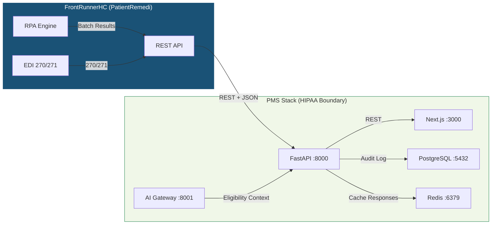

# FrontRunnerHC (PatientRemedi) Setup Guide for PMS Integration

**Document ID:** PMS-EXP-FRHC-001
**Version:** 1.0
**Date:** 2026-03-11
**Applies To:** PMS project (all platforms)
**Prerequisites Level:** Intermediate

---

## Table of Contents

1. [Overview](#1-overview)
2. [Prerequisites](#2-prerequisites)
3. [Part A: Configure FrontRunnerHC API Access](#3-part-a-configure-frontrunnerhc-api-access)
4. [Part B: Integrate with PMS Backend](#4-part-b-integrate-with-pms-backend)
5. [Part C: Integrate with PMS Frontend](#5-part-c-integrate-with-pms-frontend)
6. [Part D: Testing and Verification](#6-part-d-testing-and-verification)
7. [Troubleshooting](#7-troubleshooting)
8. [Reference Commands](#8-reference-commands)

---

## 1. Overview

This guide walks you through integrating **FrontRunnerHC's PatientRemedi** platform into the PMS. By the end, you will have:

- API credentials configured for FrontRunnerHC's REST API
- A Python client for eligibility verification, insurance discovery, and demographic validation
- FastAPI endpoints exposing FrontRunnerHC capabilities through the PMS backend
- Frontend components for real-time eligibility checks and insurance discovery
- Redis caching for high-frequency eligibility lookups
- HIPAA audit logging for all transactions



**Key facts:**

- **Platform**: FrontRunnerHC PatientRemedi suite
- **Access modes**: REST API, Workflow Portal, Progressive Web App (PWA)
- **Compliance**: CMS EDI 270/271, HIPAA, CORE, SOC2
- **Payer coverage**: 3,300+ payer plans (Medical, Dental, Vision, Mental Health, DME, Pharmacy)
- **Processing**: Real-time and batch modes
- **Core capabilities**: Eligibility verification, insurance discovery (RPA-powered), demographic validation, COB detection, MBI lookup, financial clearance
- **Marketplace integrations**: athenahealth, AdvancedMD, Salesforce
- **PHI**: Yes --- production calls involve real patient data
- **Related experiments**: Exp 45 (CMS Coverage API), Exp 47 (Availity API), Exp 48 (FHIR PA)

---

## 2. Prerequisites

### 2.1 Required Software

| Software | Minimum Version | Check Command |
|----------|----------------|---------------|
| Python | 3.11+ | `python3 --version` |
| Node.js | 18+ | `node --version` |
| PostgreSQL | 14+ | `psql --version` |
| Redis | 7+ | `redis-cli --version` |
| Docker | 24+ | `docker --version` |
| httpx | 0.25+ | `python3 -c "import httpx; print(httpx.__version__)"` |

### 2.2 Verify PMS Services

```bash
# FastAPI backend
curl -s http://localhost:8000/health | jq .

# Next.js frontend
curl -s -o /dev/null -w "%{http_code}" http://localhost:3000

# PostgreSQL
psql -U pms -d pms_db -c "SELECT 1;"

# Redis
redis-cli ping

# AI Gateway (Exp 13/20)
curl -s http://localhost:8001/health | jq .
```

**Checkpoint**: All PMS services are running and healthy.

---

## 3. Part A: Configure FrontRunnerHC API Access

### Step 1: Request API Credentials

1. Contact FrontRunnerHC sales at [frontrunnerhc.com](https://www.frontrunnerhc.com/) to request API access
2. You will receive a **sandbox environment** with:
   - API base URL (sandbox)
   - API key (client credential)
   - API secret
   - Organization ID
3. FrontRunnerHC will provision your organization in their sandbox with a subset of payer plans

### Step 2: Store Environment Variables

```bash
cat >> .env << 'EOF'
# FrontRunnerHC PatientRemedi API
FRHC_API_KEY=your-api-key
FRHC_API_SECRET=your-api-secret
FRHC_BASE_URL=https://sandbox-api.frontrunnerhc.com
FRHC_ORG_ID=your-organization-id
FRHC_TOKEN_URL=https://sandbox-api.frontrunnerhc.com/auth/token
FRHC_BATCH_POLL_INTERVAL=5
FRHC_CACHE_TTL=300
EOF
```

### Step 3: Add Docker Service for Redis (if not already running)

Add to `docker-compose.yml`:

```yaml
services:
  redis:
    image: redis:7-alpine
    ports:
      - "6379:6379"
    volumes:
      - redis_data:/data
    command: redis-server --appendonly yes --requirepass ${REDIS_PASSWORD:-pms_redis_dev}
    healthcheck:
      test: ["CMD", "redis-cli", "-a", "${REDIS_PASSWORD:-pms_redis_dev}", "ping"]
      interval: 10s
      timeout: 5s
      retries: 3

volumes:
  redis_data:
```

```bash
docker compose up -d redis
```

### Step 4: Verify Token Generation

```bash
source .env
curl -s -X POST "$FRHC_TOKEN_URL" \
  -H "Content-Type: application/json" \
  -d "{\"api_key\": \"$FRHC_API_KEY\", \"api_secret\": \"$FRHC_API_SECRET\", \"org_id\": \"$FRHC_ORG_ID\"}" \
  | jq '{access_token: .access_token[:30], expires_in, token_type}'
```

Expected:

```json
{
  "access_token": "eyJhbGciOiJSUzI1NiIs...",
  "expires_in": 3600,
  "token_type": "Bearer"
}
```

**Checkpoint**: You have sandbox credentials, Redis is running, and you can obtain an API token.

---

## 4. Part B: Integrate with PMS Backend

### Step 1: Create the FrontRunnerHC Python Client

Create `app/services/frontrunnerhc_client.py`:

```python
"""FrontRunnerHC PatientRemedi API client with token management and Redis caching."""

import hashlib
import json
import os
import time
from typing import Optional

import httpx
import redis.asyncio as redis


class FrontRunnerHCToken:
    """Manages API authentication tokens."""

    def __init__(self):
        self._token: Optional[str] = None
        self._expires_at: float = 0
        self._api_key = os.environ["FRHC_API_KEY"]
        self._api_secret = os.environ["FRHC_API_SECRET"]
        self._org_id = os.environ["FRHC_ORG_ID"]
        self._token_url = os.environ.get(
            "FRHC_TOKEN_URL",
            "https://sandbox-api.frontrunnerhc.com/auth/token",
        )

    async def get_token(self, client: httpx.AsyncClient) -> str:
        """Return a valid token, refreshing if expired."""
        if self._token and time.time() < self._expires_at:
            return self._token

        resp = await client.post(
            self._token_url,
            json={
                "api_key": self._api_key,
                "api_secret": self._api_secret,
                "org_id": self._org_id,
            },
            headers={"Content-Type": "application/json"},
        )
        resp.raise_for_status()
        data = resp.json()
        self._token = data["access_token"]
        # Refresh 60 seconds before expiry
        self._expires_at = time.time() + data.get("expires_in", 3600) - 60
        return self._token


class FrontRunnerHCClient:
    """Client for FrontRunnerHC PatientRemedi REST APIs."""

    def __init__(self):
        self._base = os.environ.get(
            "FRHC_BASE_URL", "https://sandbox-api.frontrunnerhc.com"
        )
        self._client = httpx.AsyncClient(timeout=30.0)
        self._token_mgr = FrontRunnerHCToken()
        self._cache_ttl = int(os.environ.get("FRHC_CACHE_TTL", "300"))
        self._redis: Optional[redis.Redis] = None

    async def _get_redis(self) -> redis.Redis:
        if self._redis is None:
            self._redis = redis.Redis(
                host=os.environ.get("REDIS_HOST", "localhost"),
                port=int(os.environ.get("REDIS_PORT", "6379")),
                password=os.environ.get("REDIS_PASSWORD", "pms_redis_dev"),
                decode_responses=True,
            )
        return self._redis

    def _cache_key(self, prefix: str, params: dict) -> str:
        raw = json.dumps(params, sort_keys=True)
        h = hashlib.sha256(raw.encode()).hexdigest()[:16]
        return f"frhc:{prefix}:{h}"

    async def _cached_get(self, prefix: str, params: dict) -> Optional[dict]:
        try:
            r = await self._get_redis()
            data = await r.get(self._cache_key(prefix, params))
            return json.loads(data) if data else None
        except Exception:
            return None

    async def _cache_set(self, prefix: str, params: dict, value: dict) -> None:
        try:
            r = await self._get_redis()
            await r.setex(
                self._cache_key(prefix, params),
                self._cache_ttl,
                json.dumps(value),
            )
        except Exception:
            pass  # Cache failures are non-fatal

    async def _authed_headers(self) -> dict:
        token = await self._token_mgr.get_token(self._client)
        return {
            "Authorization": f"Bearer {token}",
            "Accept": "application/json",
            "Content-Type": "application/json",
        }

    async def _get(self, path: str, params: dict = None) -> dict:
        headers = await self._authed_headers()
        resp = await self._client.get(
            f"{self._base}{path}", params=params, headers=headers
        )
        resp.raise_for_status()
        return resp.json()

    async def _post(self, path: str, payload: dict) -> dict:
        headers = await self._authed_headers()
        resp = await self._client.post(
            f"{self._base}{path}", json=payload, headers=headers
        )
        resp.raise_for_status()
        return resp.json()

    # ---------------------------------------------------------------
    # Eligibility Verification (EDI 270/271)
    # ---------------------------------------------------------------

    async def verify_eligibility(self, request: dict) -> dict:
        """
        Real-time eligibility verification against 3,300+ payer plans.

        Required fields:
            payer_id: str          -- FrontRunnerHC payer identifier
            member_id: str         -- Insurance member / subscriber ID
            provider_npi: str      -- Rendering provider NPI
            date_of_service: str   -- YYYY-MM-DD
            service_type: str      -- e.g., "30" (health benefit plan coverage)

        Optional fields:
            patient_first_name, patient_last_name, patient_dob,
            group_number, plan_type (Medical|Dental|Vision|MentalHealth|DME|Pharmacy)
        """
        cache_key_params = {
            k: request[k]
            for k in ["payer_id", "member_id", "date_of_service"]
            if k in request
        }
        cached = await self._cached_get("elig", cache_key_params)
        if cached:
            cached["_cached"] = True
            return cached

        result = await self._post("/v1/eligibility/verify", request)

        if result.get("status") == "active":
            await self._cache_set("elig", cache_key_params, result)

        return result

    async def verify_eligibility_batch(self, requests: list[dict]) -> dict:
        """
        Submit a batch of eligibility verification requests.
        Returns a batch_id for polling.
        """
        return await self._post("/v1/eligibility/batch", {"requests": requests})

    async def get_batch_status(self, batch_id: str) -> dict:
        """Poll for batch processing results."""
        return await self._get(f"/v1/eligibility/batch/{batch_id}")

    async def get_batch_results(
        self, batch_id: str, max_polls: int = 20, poll_interval: float = 5.0
    ) -> dict:
        """Submit and poll until batch completes."""
        import asyncio

        for _ in range(max_polls):
            result = await self.get_batch_status(batch_id)
            if result.get("status") == "completed":
                return result
            if result.get("status") in ("failed", "partial_failure"):
                return result
            await asyncio.sleep(poll_interval)
        return result

    # ---------------------------------------------------------------
    # Insurance Discovery (RPA-powered)
    # ---------------------------------------------------------------

    async def discover_insurance(self, request: dict) -> dict:
        """
        RPA-powered insurance discovery across all major payers.
        Finds active coverage for a patient using demographic data.

        Required fields:
            patient_first_name: str
            patient_last_name: str
            patient_dob: str       -- YYYY-MM-DD
            patient_ssn_last4: str -- Last 4 digits of SSN (optional but improves match)

        Optional fields:
            patient_gender: str    -- M or F
            patient_zip: str       -- 5-digit ZIP code
            known_payer_ids: list  -- Narrow search to specific payers
        """
        return await self._post("/v1/insurance-discovery/search", request)

    async def get_discovery_status(self, discovery_id: str) -> dict:
        """Check status of an insurance discovery request."""
        return await self._get(f"/v1/insurance-discovery/{discovery_id}")

    async def get_discovery_results(
        self, discovery_id: str, max_polls: int = 30, poll_interval: float = 3.0
    ) -> dict:
        """Poll until insurance discovery completes."""
        import asyncio

        for _ in range(max_polls):
            result = await self.get_discovery_status(discovery_id)
            if result.get("status") in ("completed", "no_coverage_found"):
                return result
            if result.get("status") == "error":
                return result
            await asyncio.sleep(poll_interval)
        return result

    # ---------------------------------------------------------------
    # Demographic Validation
    # ---------------------------------------------------------------

    async def validate_demographics(self, request: dict) -> dict:
        """
        Validate and correct patient demographic data against payer records.

        Required fields:
            patient_first_name, patient_last_name, patient_dob,
            payer_id, member_id

        Returns corrected fields and confidence scores.
        """
        return await self._post("/v1/demographics/validate", request)

    # ---------------------------------------------------------------
    # COB (Coordination of Benefits) Detection
    # ---------------------------------------------------------------

    async def detect_cob(self, request: dict) -> dict:
        """
        Detect coordination of benefits (primary/secondary/tertiary coverage).

        Required fields:
            patient_first_name, patient_last_name, patient_dob, member_id
        """
        return await self._post("/v1/cob/detect", request)

    # ---------------------------------------------------------------
    # MBI (Medicare Beneficiary Identifier) Lookup
    # ---------------------------------------------------------------

    async def lookup_mbi(self, request: dict) -> dict:
        """
        Look up Medicare Beneficiary Identifier for a patient.

        Required fields:
            patient_first_name, patient_last_name, patient_dob,
            patient_ssn_last4 (or patient_hicn)
        """
        return await self._post("/v1/mbi/lookup", request)

    # ---------------------------------------------------------------
    # Financial Clearance
    # ---------------------------------------------------------------

    async def run_financial_clearance(self, request: dict) -> dict:
        """
        Run full financial clearance workflow:
        eligibility + COB + demographic validation + copay estimation.

        Required fields:
            patient_first_name, patient_last_name, patient_dob,
            payer_id, member_id, provider_npi, procedure_codes: list[str],
            date_of_service
        """
        return await self._post("/v1/financial-clearance/run", request)

    # ---------------------------------------------------------------
    # Payer List
    # ---------------------------------------------------------------

    async def list_payers(self, plan_type: str = None) -> dict:
        """List supported payer plans. Optional filter by plan_type."""
        params = {}
        if plan_type:
            params["plan_type"] = plan_type
        return await self._get("/v1/payers", params)

    # ---------------------------------------------------------------
    # Lifecycle
    # ---------------------------------------------------------------

    async def close(self):
        await self._client.aclose()
        if self._redis:
            await self._redis.close()
```

**Checkpoint**: You have a FrontRunnerHC client with token management, Redis caching, and methods for all core APIs.

### Step 2: Create the Eligibility Service

Create `app/services/frhc_eligibility_service.py`:

```python
"""Eligibility verification service wrapping FrontRunnerHC client with audit logging."""

import logging
from datetime import datetime
from typing import Optional

from sqlalchemy.ext.asyncio import AsyncSession

from app.services.frontrunnerhc_client import FrontRunnerHCClient

log = logging.getLogger("frhc.eligibility")


class EligibilityService:
    """Orchestrates eligibility checks with caching and audit trail."""

    def __init__(self, client: FrontRunnerHCClient, db: AsyncSession):
        self._client = client
        self._db = db

    async def verify(
        self,
        payer_id: str,
        member_id: str,
        provider_npi: str,
        date_of_service: str,
        service_type: str = "30",
        patient_first_name: str = "",
        patient_last_name: str = "",
        patient_dob: str = "",
        plan_type: str = "Medical",
        checked_by: Optional[int] = None,
    ) -> dict:
        """Verify eligibility and log the result."""
        request = {
            "payer_id": payer_id,
            "member_id": member_id,
            "provider_npi": provider_npi,
            "date_of_service": date_of_service,
            "service_type": service_type,
            "patient_first_name": patient_first_name,
            "patient_last_name": patient_last_name,
            "patient_dob": patient_dob,
            "plan_type": plan_type,
        }

        result = await self._client.verify_eligibility(request)

        # Audit log
        await self._db.execute(
            """
            INSERT INTO frhc_eligibility_log
                (payer_id, member_id, date_of_service, plan_type,
                 status, response, checked_by, checked_at)
            VALUES (:payer_id, :member_id, :dos, :plan_type,
                    :status, :response, :checked_by, NOW())
            """,
            {
                "payer_id": payer_id,
                "member_id": member_id,
                "dos": date_of_service,
                "plan_type": plan_type,
                "status": result.get("status", "unknown"),
                "response": result,
                "checked_by": checked_by,
            },
        )
        await self._db.commit()

        log.info(
            "Eligibility check: payer=%s member=%s status=%s cached=%s",
            payer_id,
            member_id,
            result.get("status"),
            result.get("_cached", False),
        )
        return result

    async def verify_batch(
        self, requests: list[dict], submitted_by: Optional[int] = None
    ) -> dict:
        """Submit batch eligibility and return batch_id for polling."""
        result = await self._client.verify_eligibility_batch(requests)
        batch_id = result.get("batch_id")

        await self._db.execute(
            """
            INSERT INTO frhc_batch_log
                (batch_id, request_count, status, submitted_by, submitted_at)
            VALUES (:batch_id, :count, 'submitted', :submitted_by, NOW())
            """,
            {
                "batch_id": batch_id,
                "count": len(requests),
                "submitted_by": submitted_by,
            },
        )
        await self._db.commit()

        log.info("Batch submitted: batch_id=%s count=%d", batch_id, len(requests))
        return result
```

### Step 3: Create the Insurance Discovery Service

Create `app/services/frhc_discovery_service.py`:

```python
"""Insurance discovery service wrapping FrontRunnerHC RPA-powered search."""

import logging
from typing import Optional

from sqlalchemy.ext.asyncio import AsyncSession

from app.services.frontrunnerhc_client import FrontRunnerHCClient

log = logging.getLogger("frhc.discovery")


class InsuranceDiscoveryService:
    """Orchestrates insurance discovery with audit logging."""

    def __init__(self, client: FrontRunnerHCClient, db: AsyncSession):
        self._client = client
        self._db = db

    async def discover(
        self,
        patient_first_name: str,
        patient_last_name: str,
        patient_dob: str,
        patient_ssn_last4: str = "",
        patient_gender: str = "",
        patient_zip: str = "",
        known_payer_ids: list[str] = None,
        requested_by: Optional[int] = None,
    ) -> dict:
        """Initiate insurance discovery and poll for results."""
        request = {
            "patient_first_name": patient_first_name,
            "patient_last_name": patient_last_name,
            "patient_dob": patient_dob,
        }
        if patient_ssn_last4:
            request["patient_ssn_last4"] = patient_ssn_last4
        if patient_gender:
            request["patient_gender"] = patient_gender
        if patient_zip:
            request["patient_zip"] = patient_zip
        if known_payer_ids:
            request["known_payer_ids"] = known_payer_ids

        # Initiate discovery
        init_result = await self._client.discover_insurance(request)
        discovery_id = init_result.get("discovery_id")

        if not discovery_id:
            log.error("Discovery initiation failed: %s", init_result)
            return init_result

        # Poll for results
        result = await self._client.get_discovery_results(discovery_id)

        # Audit log
        coverages = result.get("coverages", [])
        await self._db.execute(
            """
            INSERT INTO frhc_discovery_log
                (discovery_id, patient_name, patient_dob,
                 coverages_found, status, response, requested_by, requested_at)
            VALUES (:discovery_id, :name, :dob,
                    :found, :status, :response, :requested_by, NOW())
            """,
            {
                "discovery_id": discovery_id,
                "name": f"{patient_last_name}, {patient_first_name}",
                "dob": patient_dob,
                "found": len(coverages),
                "status": result.get("status"),
                "response": result,
                "requested_by": requested_by,
            },
        )
        await self._db.commit()

        log.info(
            "Discovery complete: id=%s coverages_found=%d status=%s",
            discovery_id,
            len(coverages),
            result.get("status"),
        )
        return result
```

### Step 4: Create FastAPI Endpoints

Create `app/routers/frontrunnerhc.py`:

```python
"""FrontRunnerHC PatientRemedi API endpoints."""

import logging
from typing import Optional

from fastapi import APIRouter, HTTPException, Depends
from pydantic import BaseModel

from app.services.frontrunnerhc_client import FrontRunnerHCClient

router = APIRouter(prefix="/api/frhc", tags=["frontrunnerhc"])
client = FrontRunnerHCClient()
log = logging.getLogger("frhc")


# --- Request Models ---


class EligibilityRequest(BaseModel):
    payer_id: str
    member_id: str
    provider_npi: str
    date_of_service: str
    service_type: str = "30"
    patient_first_name: str = ""
    patient_last_name: str = ""
    patient_dob: str = ""
    plan_type: str = "Medical"


class BatchEligibilityRequest(BaseModel):
    requests: list[EligibilityRequest]


class InsuranceDiscoveryRequest(BaseModel):
    patient_first_name: str
    patient_last_name: str
    patient_dob: str
    patient_ssn_last4: str = ""
    patient_gender: str = ""
    patient_zip: str = ""
    known_payer_ids: list[str] = []


class DemographicValidationRequest(BaseModel):
    patient_first_name: str
    patient_last_name: str
    patient_dob: str
    payer_id: str
    member_id: str


class COBDetectionRequest(BaseModel):
    patient_first_name: str
    patient_last_name: str
    patient_dob: str
    member_id: str


class MBILookupRequest(BaseModel):
    patient_first_name: str
    patient_last_name: str
    patient_dob: str
    patient_ssn_last4: str = ""
    patient_hicn: str = ""


class FinancialClearanceRequest(BaseModel):
    patient_first_name: str
    patient_last_name: str
    patient_dob: str
    payer_id: str
    member_id: str
    provider_npi: str
    procedure_codes: list[str]
    date_of_service: str


# --- Payer List ---


@router.get("/payers")
async def list_payers(plan_type: str = None):
    """List FrontRunnerHC-supported payer plans (3,300+)."""
    try:
        return await client.list_payers(plan_type)
    except Exception as e:
        raise HTTPException(status_code=502, detail=f"FrontRunnerHC error: {e}")


# --- Eligibility Verification ---


@router.post("/eligibility")
async def verify_eligibility(req: EligibilityRequest):
    """Real-time eligibility verification via EDI 270/271."""
    try:
        result = await client.verify_eligibility(req.model_dump())
        log.info(
            "Eligibility: payer=%s member=%s status=%s",
            req.payer_id,
            req.member_id,
            result.get("status"),
        )
        return result
    except Exception as e:
        raise HTTPException(status_code=502, detail=f"FrontRunnerHC error: {e}")


@router.post("/eligibility/batch")
async def verify_eligibility_batch(req: BatchEligibilityRequest):
    """Submit batch eligibility verification. Returns batch_id for polling."""
    try:
        requests = [r.model_dump() for r in req.requests]
        result = await client.verify_eligibility_batch(requests)
        log.info("Batch submitted: count=%d batch_id=%s", len(requests), result.get("batch_id"))
        return result
    except Exception as e:
        raise HTTPException(status_code=502, detail=f"FrontRunnerHC error: {e}")


@router.get("/eligibility/batch/{batch_id}")
async def get_batch_status(batch_id: str):
    """Poll batch eligibility status."""
    try:
        return await client.get_batch_status(batch_id)
    except Exception as e:
        raise HTTPException(status_code=502, detail=f"FrontRunnerHC error: {e}")


# --- Insurance Discovery ---


@router.post("/insurance-discovery")
async def discover_insurance(req: InsuranceDiscoveryRequest):
    """RPA-powered insurance discovery across all major payers."""
    try:
        result = await client.discover_insurance(req.model_dump())
        log.info("Discovery initiated: id=%s", result.get("discovery_id"))
        return result
    except Exception as e:
        raise HTTPException(status_code=502, detail=f"FrontRunnerHC error: {e}")


@router.get("/insurance-discovery/{discovery_id}")
async def get_discovery_status(discovery_id: str):
    """Check insurance discovery status."""
    try:
        return await client.get_discovery_status(discovery_id)
    except Exception as e:
        raise HTTPException(status_code=502, detail=f"FrontRunnerHC error: {e}")


# --- Demographic Validation ---


@router.post("/demographics/validate")
async def validate_demographics(req: DemographicValidationRequest):
    """Validate patient demographics against payer records."""
    try:
        result = await client.validate_demographics(req.model_dump())
        log.info("Demographics validated: payer=%s member=%s", req.payer_id, req.member_id)
        return result
    except Exception as e:
        raise HTTPException(status_code=502, detail=f"FrontRunnerHC error: {e}")


# --- COB Detection ---


@router.post("/cob/detect")
async def detect_cob(req: COBDetectionRequest):
    """Detect coordination of benefits (primary/secondary/tertiary)."""
    try:
        result = await client.detect_cob(req.model_dump())
        log.info("COB detection: member=%s coverages=%d", req.member_id, len(result.get("coverages", [])))
        return result
    except Exception as e:
        raise HTTPException(status_code=502, detail=f"FrontRunnerHC error: {e}")


# --- MBI Lookup ---


@router.post("/mbi/lookup")
async def lookup_mbi(req: MBILookupRequest):
    """Look up Medicare Beneficiary Identifier."""
    try:
        result = await client.lookup_mbi(req.model_dump())
        log.info("MBI lookup: status=%s", result.get("status"))
        return result
    except Exception as e:
        raise HTTPException(status_code=502, detail=f"FrontRunnerHC error: {e}")


# --- Financial Clearance ---


@router.post("/financial-clearance")
async def run_financial_clearance(req: FinancialClearanceRequest):
    """Run full financial clearance workflow."""
    try:
        result = await client.run_financial_clearance(req.model_dump())
        log.info(
            "Financial clearance: payer=%s member=%s status=%s",
            req.payer_id,
            req.member_id,
            result.get("status"),
        )
        return result
    except Exception as e:
        raise HTTPException(status_code=502, detail=f"FrontRunnerHC error: {e}")
```

Register in `app/main.py`:

```python
from app.routers import frontrunnerhc
app.include_router(frontrunnerhc.router)
```

### Step 5: Create Database Schema

```sql
-- frhc_eligibility_log
CREATE TABLE frhc_eligibility_log (
    id SERIAL PRIMARY KEY,
    patient_id INTEGER,
    payer_id TEXT NOT NULL,
    member_id TEXT NOT NULL,
    date_of_service DATE NOT NULL,
    plan_type TEXT DEFAULT 'Medical',
    status TEXT,
    response JSONB NOT NULL,
    checked_by INTEGER,
    checked_at TIMESTAMPTZ NOT NULL DEFAULT NOW()
);

-- frhc_discovery_log
CREATE TABLE frhc_discovery_log (
    id SERIAL PRIMARY KEY,
    discovery_id TEXT NOT NULL UNIQUE,
    patient_name TEXT NOT NULL,
    patient_dob DATE NOT NULL,
    coverages_found INTEGER DEFAULT 0,
    status TEXT,
    response JSONB NOT NULL,
    requested_by INTEGER,
    requested_at TIMESTAMPTZ NOT NULL DEFAULT NOW()
);

-- frhc_batch_log
CREATE TABLE frhc_batch_log (
    id SERIAL PRIMARY KEY,
    batch_id TEXT NOT NULL UNIQUE,
    request_count INTEGER NOT NULL,
    completed_count INTEGER DEFAULT 0,
    status TEXT DEFAULT 'submitted',
    submitted_by INTEGER,
    submitted_at TIMESTAMPTZ NOT NULL DEFAULT NOW(),
    completed_at TIMESTAMPTZ
);

-- frhc_demographic_validation_log
CREATE TABLE frhc_demographic_validation_log (
    id SERIAL PRIMARY KEY,
    patient_id INTEGER,
    payer_id TEXT NOT NULL,
    member_id TEXT NOT NULL,
    corrections JSONB,
    confidence_score FLOAT,
    validated_by INTEGER,
    validated_at TIMESTAMPTZ NOT NULL DEFAULT NOW()
);

-- frhc_cob_detection_log
CREATE TABLE frhc_cob_detection_log (
    id SERIAL PRIMARY KEY,
    patient_id INTEGER,
    member_id TEXT NOT NULL,
    coverages_detected INTEGER DEFAULT 0,
    primary_payer TEXT,
    response JSONB NOT NULL,
    detected_by INTEGER,
    detected_at TIMESTAMPTZ NOT NULL DEFAULT NOW()
);

-- Indexes
CREATE INDEX idx_frhc_elig_payer ON frhc_eligibility_log (payer_id, member_id);
CREATE INDEX idx_frhc_elig_date ON frhc_eligibility_log (checked_at);
CREATE INDEX idx_frhc_disc_status ON frhc_discovery_log (status, requested_at);
CREATE INDEX idx_frhc_batch_status ON frhc_batch_log (status, submitted_at);
CREATE INDEX idx_frhc_demo_payer ON frhc_demographic_validation_log (payer_id, member_id);
CREATE INDEX idx_frhc_cob_member ON frhc_cob_detection_log (member_id);
```

**Checkpoint**: The PMS backend exposes `/api/frhc/eligibility`, `/api/frhc/insurance-discovery`, `/api/frhc/demographics/validate`, `/api/frhc/cob/detect`, `/api/frhc/mbi/lookup`, and `/api/frhc/financial-clearance` endpoints with full audit logging.

---

## 5. Part C: Integrate with PMS Frontend

### Step 1: Create the FrontRunnerHC TypeScript Client

Create `lib/frontrunnerhc-client.ts`:

```typescript
/**
 * FrontRunnerHC PatientRemedi API client for Next.js frontend.
 */

const FRHC_BASE = "/api/frhc";

export interface EligibilityRequest {
  payer_id: string;
  member_id: string;
  provider_npi: string;
  date_of_service: string;
  service_type?: string;
  patient_first_name?: string;
  patient_last_name?: string;
  patient_dob?: string;
  plan_type?: string;
}

export interface EligibilityResponse {
  status: string;
  payer_name: string;
  member_id: string;
  plan_type: string;
  coverage_start: string;
  coverage_end: string;
  copay: string;
  coinsurance: string;
  deductible_remaining: string;
  out_of_pocket_remaining: string;
  benefits: Record<string, unknown>[];
  _cached?: boolean;
}

export interface InsuranceDiscoveryRequest {
  patient_first_name: string;
  patient_last_name: string;
  patient_dob: string;
  patient_ssn_last4?: string;
  patient_gender?: string;
  patient_zip?: string;
  known_payer_ids?: string[];
}

export interface DiscoveredCoverage {
  payer_id: string;
  payer_name: string;
  member_id: string;
  plan_type: string;
  coverage_order: string; // primary | secondary | tertiary
  coverage_status: string;
  group_number: string;
}

export interface InsuranceDiscoveryResponse {
  discovery_id: string;
  status: string;
  coverages: DiscoveredCoverage[];
}

export interface PayerInfo {
  payer_id: string;
  payer_name: string;
  plan_types: string[];
  supported_transactions: string[];
}

async function request<T>(path: string, options?: RequestInit): Promise<T> {
  const res = await fetch(`${FRHC_BASE}${path}`, {
    headers: { "Content-Type": "application/json" },
    ...options,
  });
  if (!res.ok) {
    const body = await res.text();
    throw new Error(`FrontRunnerHC API error ${res.status}: ${body}`);
  }
  return res.json();
}

export const frhcClient = {
  listPayers: (planType?: string) =>
    request<{ payers: PayerInfo[]; total: number }>(
      `/payers${planType ? `?plan_type=${planType}` : ""}`
    ),

  verifyEligibility: (req: EligibilityRequest) =>
    request<EligibilityResponse>("/eligibility", {
      method: "POST",
      body: JSON.stringify(req),
    }),

  discoverInsurance: (req: InsuranceDiscoveryRequest) =>
    request<InsuranceDiscoveryResponse>("/insurance-discovery", {
      method: "POST",
      body: JSON.stringify(req),
    }),

  getDiscoveryStatus: (discoveryId: string) =>
    request<InsuranceDiscoveryResponse>(
      `/insurance-discovery/${discoveryId}`
    ),

  validateDemographics: (req: {
    patient_first_name: string;
    patient_last_name: string;
    patient_dob: string;
    payer_id: string;
    member_id: string;
  }) =>
    request<Record<string, unknown>>("/demographics/validate", {
      method: "POST",
      body: JSON.stringify(req),
    }),

  detectCOB: (req: {
    patient_first_name: string;
    patient_last_name: string;
    patient_dob: string;
    member_id: string;
  }) =>
    request<Record<string, unknown>>("/cob/detect", {
      method: "POST",
      body: JSON.stringify(req),
    }),

  lookupMBI: (req: {
    patient_first_name: string;
    patient_last_name: string;
    patient_dob: string;
    patient_ssn_last4?: string;
    patient_hicn?: string;
  }) =>
    request<Record<string, unknown>>("/mbi/lookup", {
      method: "POST",
      body: JSON.stringify(req),
    }),

  runFinancialClearance: (req: {
    patient_first_name: string;
    patient_last_name: string;
    patient_dob: string;
    payer_id: string;
    member_id: string;
    provider_npi: string;
    procedure_codes: string[];
    date_of_service: string;
  }) =>
    request<Record<string, unknown>>("/financial-clearance", {
      method: "POST",
      body: JSON.stringify(req),
    }),
};
```

### Step 2: Create the EligibilityPanel Component

Create `components/FRHCEligibilityPanel.tsx`:

```tsx
"use client";

import { useState } from "react";
import {
  frhcClient,
  EligibilityRequest,
  EligibilityResponse,
} from "@/lib/frontrunnerhc-client";

const PLAN_TYPES = [
  "Medical",
  "Dental",
  "Vision",
  "MentalHealth",
  "DME",
  "Pharmacy",
];

export default function FRHCEligibilityPanel({
  defaultPayerId = "",
  defaultMemberId = "",
  defaultProviderNpi = "",
}: {
  defaultPayerId?: string;
  defaultMemberId?: string;
  defaultProviderNpi?: string;
}) {
  const [payerId, setPayerId] = useState(defaultPayerId);
  const [memberId, setMemberId] = useState(defaultMemberId);
  const [providerNpi, setProviderNpi] = useState(defaultProviderNpi);
  const [dateOfService, setDateOfService] = useState(
    new Date().toISOString().split("T")[0]
  );
  const [planType, setPlanType] = useState("Medical");
  const [result, setResult] = useState<EligibilityResponse | null>(null);
  const [loading, setLoading] = useState(false);
  const [error, setError] = useState<string | null>(null);

  const handleVerify = async () => {
    setLoading(true);
    setError(null);
    setResult(null);
    try {
      const req: EligibilityRequest = {
        payer_id: payerId,
        member_id: memberId,
        provider_npi: providerNpi,
        date_of_service: dateOfService,
        plan_type: planType,
      };
      const res = await frhcClient.verifyEligibility(req);
      setResult(res);
    } catch (e: any) {
      setError(e.message);
    } finally {
      setLoading(false);
    }
  };

  return (
    <div className="border rounded-lg p-6 space-y-4">
      <h3 className="text-lg font-semibold">
        Eligibility Verification (FrontRunnerHC)
      </h3>

      <div className="grid grid-cols-2 gap-4">
        <div>
          <label className="block text-sm font-medium text-gray-700">
            Payer ID
          </label>
          <input
            type="text"
            value={payerId}
            onChange={(e) => setPayerId(e.target.value)}
            className="mt-1 block w-full border rounded px-3 py-2"
            placeholder="e.g., UHC, AETNA"
          />
        </div>
        <div>
          <label className="block text-sm font-medium text-gray-700">
            Member ID
          </label>
          <input
            type="text"
            value={memberId}
            onChange={(e) => setMemberId(e.target.value)}
            className="mt-1 block w-full border rounded px-3 py-2"
            placeholder="Insurance member ID"
          />
        </div>
        <div>
          <label className="block text-sm font-medium text-gray-700">
            Provider NPI
          </label>
          <input
            type="text"
            value={providerNpi}
            onChange={(e) => setProviderNpi(e.target.value)}
            className="mt-1 block w-full border rounded px-3 py-2"
            placeholder="10-digit NPI"
          />
        </div>
        <div>
          <label className="block text-sm font-medium text-gray-700">
            Date of Service
          </label>
          <input
            type="date"
            value={dateOfService}
            onChange={(e) => setDateOfService(e.target.value)}
            className="mt-1 block w-full border rounded px-3 py-2"
          />
        </div>
        <div>
          <label className="block text-sm font-medium text-gray-700">
            Plan Type
          </label>
          <select
            value={planType}
            onChange={(e) => setPlanType(e.target.value)}
            className="mt-1 block w-full border rounded px-3 py-2"
          >
            {PLAN_TYPES.map((pt) => (
              <option key={pt} value={pt}>
                {pt}
              </option>
            ))}
          </select>
        </div>
      </div>

      <button
        onClick={handleVerify}
        disabled={loading || !payerId || !memberId || !providerNpi}
        className="px-6 py-2 bg-blue-600 text-white rounded hover:bg-blue-700 disabled:opacity-50"
      >
        {loading ? "Verifying..." : "Verify Eligibility"}
      </button>

      {error && (
        <div className="p-3 bg-red-50 border border-red-200 rounded text-red-700 text-sm">
          {error}
        </div>
      )}

      {result && (
        <div className="mt-4 space-y-2">
          <div
            className={`inline-block px-3 py-1 rounded text-sm font-medium ${
              result.status === "active"
                ? "bg-green-100 text-green-800"
                : "bg-red-100 text-red-800"
            }`}
          >
            {result.status === "active" ? "Active Coverage" : result.status}
            {result._cached && " (cached)"}
          </div>
          <div className="grid grid-cols-2 gap-2 text-sm">
            <div>
              <span className="font-medium">Payer:</span> {result.payer_name}
            </div>
            <div>
              <span className="font-medium">Plan:</span> {result.plan_type}
            </div>
            <div>
              <span className="font-medium">Copay:</span> {result.copay}
            </div>
            <div>
              <span className="font-medium">Coinsurance:</span>{" "}
              {result.coinsurance}
            </div>
            <div>
              <span className="font-medium">Deductible Remaining:</span>{" "}
              {result.deductible_remaining}
            </div>
            <div>
              <span className="font-medium">OOP Remaining:</span>{" "}
              {result.out_of_pocket_remaining}
            </div>
          </div>
          <details className="mt-2">
            <summary className="cursor-pointer text-sm text-gray-500">
              Raw Response
            </summary>
            <pre className="mt-2 text-xs bg-gray-50 p-3 rounded overflow-auto max-h-60">
              {JSON.stringify(result, null, 2)}
            </pre>
          </details>
        </div>
      )}
    </div>
  );
}
```

### Step 3: Create the InsuranceDiscoveryPanel Component

Create `components/FRHCInsuranceDiscoveryPanel.tsx`:

```tsx
"use client";

import { useState } from "react";
import {
  frhcClient,
  InsuranceDiscoveryResponse,
  DiscoveredCoverage,
} from "@/lib/frontrunnerhc-client";

export default function FRHCInsuranceDiscoveryPanel() {
  const [firstName, setFirstName] = useState("");
  const [lastName, setLastName] = useState("");
  const [dob, setDob] = useState("");
  const [ssn4, setSsn4] = useState("");
  const [gender, setGender] = useState("");
  const [zip, setZip] = useState("");
  const [result, setResult] = useState<InsuranceDiscoveryResponse | null>(null);
  const [loading, setLoading] = useState(false);
  const [error, setError] = useState<string | null>(null);

  const handleDiscover = async () => {
    setLoading(true);
    setError(null);
    setResult(null);
    try {
      const res = await frhcClient.discoverInsurance({
        patient_first_name: firstName,
        patient_last_name: lastName,
        patient_dob: dob,
        patient_ssn_last4: ssn4,
        patient_gender: gender,
        patient_zip: zip,
      });

      // Poll if status is still processing
      if (res.status === "processing" && res.discovery_id) {
        let polled = res;
        for (let i = 0; i < 20; i++) {
          await new Promise((r) => setTimeout(r, 3000));
          polled = await frhcClient.getDiscoveryStatus(res.discovery_id);
          if (polled.status !== "processing") break;
        }
        setResult(polled);
      } else {
        setResult(res);
      }
    } catch (e: any) {
      setError(e.message);
    } finally {
      setLoading(false);
    }
  };

  const orderBadge = (order: string) => {
    const colors: Record<string, string> = {
      primary: "bg-blue-100 text-blue-800",
      secondary: "bg-purple-100 text-purple-800",
      tertiary: "bg-gray-100 text-gray-800",
    };
    return colors[order] || "bg-gray-100 text-gray-800";
  };

  return (
    <div className="border rounded-lg p-6 space-y-4">
      <h3 className="text-lg font-semibold">
        Insurance Discovery (FrontRunnerHC)
      </h3>
      <p className="text-sm text-gray-500">
        RPA-powered search across 3,300+ payer plans
      </p>

      <div className="grid grid-cols-2 gap-4">
        <div>
          <label className="block text-sm font-medium text-gray-700">
            First Name *
          </label>
          <input
            type="text"
            value={firstName}
            onChange={(e) => setFirstName(e.target.value)}
            className="mt-1 block w-full border rounded px-3 py-2"
          />
        </div>
        <div>
          <label className="block text-sm font-medium text-gray-700">
            Last Name *
          </label>
          <input
            type="text"
            value={lastName}
            onChange={(e) => setLastName(e.target.value)}
            className="mt-1 block w-full border rounded px-3 py-2"
          />
        </div>
        <div>
          <label className="block text-sm font-medium text-gray-700">
            Date of Birth *
          </label>
          <input
            type="date"
            value={dob}
            onChange={(e) => setDob(e.target.value)}
            className="mt-1 block w-full border rounded px-3 py-2"
          />
        </div>
        <div>
          <label className="block text-sm font-medium text-gray-700">
            SSN (last 4)
          </label>
          <input
            type="text"
            value={ssn4}
            onChange={(e) => setSsn4(e.target.value)}
            maxLength={4}
            className="mt-1 block w-full border rounded px-3 py-2"
            placeholder="Optional, improves accuracy"
          />
        </div>
        <div>
          <label className="block text-sm font-medium text-gray-700">
            Gender
          </label>
          <select
            value={gender}
            onChange={(e) => setGender(e.target.value)}
            className="mt-1 block w-full border rounded px-3 py-2"
          >
            <option value="">-- Select --</option>
            <option value="M">Male</option>
            <option value="F">Female</option>
          </select>
        </div>
        <div>
          <label className="block text-sm font-medium text-gray-700">
            ZIP Code
          </label>
          <input
            type="text"
            value={zip}
            onChange={(e) => setZip(e.target.value)}
            maxLength={5}
            className="mt-1 block w-full border rounded px-3 py-2"
            placeholder="5-digit ZIP"
          />
        </div>
      </div>

      <button
        onClick={handleDiscover}
        disabled={loading || !firstName || !lastName || !dob}
        className="px-6 py-2 bg-green-600 text-white rounded hover:bg-green-700 disabled:opacity-50"
      >
        {loading ? "Searching..." : "Discover Insurance"}
      </button>

      {error && (
        <div className="p-3 bg-red-50 border border-red-200 rounded text-red-700 text-sm">
          {error}
        </div>
      )}

      {result && (
        <div className="mt-4 space-y-3">
          <div className="text-sm text-gray-600">
            Status: <strong>{result.status}</strong> | Discovery ID:{" "}
            <code className="text-xs">{result.discovery_id}</code>
          </div>

          {result.coverages.length === 0 && (
            <div className="p-3 bg-yellow-50 border border-yellow-200 rounded text-yellow-700 text-sm">
              No active coverage found for this patient.
            </div>
          )}

          {result.coverages.map((cov: DiscoveredCoverage, idx: number) => (
            <div
              key={idx}
              className="border rounded p-4 bg-white shadow-sm space-y-1"
            >
              <div className="flex items-center gap-2">
                <span
                  className={`px-2 py-0.5 rounded text-xs font-medium ${orderBadge(
                    cov.coverage_order
                  )}`}
                >
                  {cov.coverage_order}
                </span>
                <span className="font-semibold">{cov.payer_name}</span>
              </div>
              <div className="grid grid-cols-2 gap-1 text-sm text-gray-600">
                <div>
                  <span className="font-medium">Payer ID:</span>{" "}
                  {cov.payer_id}
                </div>
                <div>
                  <span className="font-medium">Member ID:</span>{" "}
                  {cov.member_id}
                </div>
                <div>
                  <span className="font-medium">Plan Type:</span>{" "}
                  {cov.plan_type}
                </div>
                <div>
                  <span className="font-medium">Status:</span>{" "}
                  {cov.coverage_status}
                </div>
                <div>
                  <span className="font-medium">Group:</span>{" "}
                  {cov.group_number}
                </div>
              </div>
            </div>
          ))}
        </div>
      )}
    </div>
  );
}
```

**Checkpoint**: Frontend has an eligibility verification panel with plan type selection and an insurance discovery panel with RPA-powered search and polling.

---

## 6. Part D: Testing and Verification

### 6.1 Health Check

```bash
source .env

# 1. Verify token generation
curl -s -X POST "$FRHC_TOKEN_URL" \
  -H "Content-Type: application/json" \
  -d "{\"api_key\": \"$FRHC_API_KEY\", \"api_secret\": \"$FRHC_API_SECRET\", \"org_id\": \"$FRHC_ORG_ID\"}" \
  | jq '{access_token: .access_token[:30], expires_in, token_type}'

# 2. Verify Redis connectivity
redis-cli -a pms_redis_dev ping

# 3. List payers (should return 3,300+ plans)
curl -s "http://localhost:8000/api/frhc/payers" | jq '.total'

# 4. Filter payers by plan type
curl -s "http://localhost:8000/api/frhc/payers?plan_type=Dental" | jq '.total'
```

**Checkpoint**: API token works, Redis is connected, and the payer list endpoint returns results.

### 6.2 Functional Tests

```bash
# 5. Real-time eligibility verification
curl -s -X POST "http://localhost:8000/api/frhc/eligibility" \
  -H "Content-Type: application/json" \
  -d '{
    "payer_id": "UHC",
    "member_id": "TEST123456",
    "provider_npi": "1234567890",
    "date_of_service": "2026-03-11",
    "plan_type": "Medical"
  }' | jq '{status, payer_name, copay, deductible_remaining}'

# 6. Re-run to confirm Redis caching
curl -s -X POST "http://localhost:8000/api/frhc/eligibility" \
  -H "Content-Type: application/json" \
  -d '{
    "payer_id": "UHC",
    "member_id": "TEST123456",
    "provider_npi": "1234567890",
    "date_of_service": "2026-03-11",
    "plan_type": "Medical"
  }' | jq '._cached'
# Expected: true

# 7. Insurance discovery
curl -s -X POST "http://localhost:8000/api/frhc/insurance-discovery" \
  -H "Content-Type: application/json" \
  -d '{
    "patient_first_name": "John",
    "patient_last_name": "Smith",
    "patient_dob": "1965-04-15",
    "patient_gender": "M",
    "patient_zip": "78701"
  }' | jq '{discovery_id, status}'

# 8. Demographic validation
curl -s -X POST "http://localhost:8000/api/frhc/demographics/validate" \
  -H "Content-Type: application/json" \
  -d '{
    "patient_first_name": "John",
    "patient_last_name": "Smith",
    "patient_dob": "1965-04-15",
    "payer_id": "UHC",
    "member_id": "TEST123456"
  }' | jq '{status, corrections}'

# 9. COB detection
curl -s -X POST "http://localhost:8000/api/frhc/cob/detect" \
  -H "Content-Type: application/json" \
  -d '{
    "patient_first_name": "Jane",
    "patient_last_name": "Doe",
    "patient_dob": "1970-08-22",
    "member_id": "TEST789012"
  }' | jq '{coverages: [.coverages[]? | {payer_name, coverage_order}]}'

# 10. MBI lookup
curl -s -X POST "http://localhost:8000/api/frhc/mbi/lookup" \
  -H "Content-Type: application/json" \
  -d '{
    "patient_first_name": "Robert",
    "patient_last_name": "Johnson",
    "patient_dob": "1950-01-10",
    "patient_ssn_last4": "5678"
  }' | jq '{status, mbi}'

# 11. Financial clearance (full workflow)
curl -s -X POST "http://localhost:8000/api/frhc/financial-clearance" \
  -H "Content-Type: application/json" \
  -d '{
    "patient_first_name": "John",
    "patient_last_name": "Smith",
    "patient_dob": "1965-04-15",
    "payer_id": "UHC",
    "member_id": "TEST123456",
    "provider_npi": "1234567890",
    "procedure_codes": ["99213", "85025"],
    "date_of_service": "2026-03-11"
  }' | jq '{status, eligibility_status, estimated_patient_responsibility}'
```

**Checkpoint**: All individual API endpoints return expected responses.

### 6.3 Batch Processing Test

```bash
# 12. Submit batch eligibility
BATCH_ID=$(curl -s -X POST "http://localhost:8000/api/frhc/eligibility/batch" \
  -H "Content-Type: application/json" \
  -d '{
    "requests": [
      {"payer_id":"UHC","member_id":"BATCH001","provider_npi":"1234567890","date_of_service":"2026-03-11"},
      {"payer_id":"AETNA","member_id":"BATCH002","provider_npi":"1234567890","date_of_service":"2026-03-11"},
      {"payer_id":"BCBSTX","member_id":"BATCH003","provider_npi":"1234567890","date_of_service":"2026-03-11"}
    ]
  }' | jq -r '.batch_id')
echo "Batch ID: $BATCH_ID"

# 13. Poll batch status
curl -s "http://localhost:8000/api/frhc/eligibility/batch/$BATCH_ID" \
  | jq '{status, completed_count, total_count}'
```

**Checkpoint**: Batch eligibility processing submits and returns a pollable batch ID.

---

## 7. Troubleshooting

### 401 Unauthorized

**Cause**: API token expired or credentials are incorrect.
**Fix**: Verify `FRHC_API_KEY`, `FRHC_API_SECRET`, and `FRHC_ORG_ID` in `.env`. The client auto-refreshes tokens 60 seconds before expiry. If credentials were rotated, update `.env` and restart the backend.

### 502 Bad Gateway on All Endpoints

**Cause**: FrontRunnerHC API unreachable or `FRHC_BASE_URL` points to wrong environment.
**Fix**: Confirm `FRHC_BASE_URL` is correct (sandbox vs. production). Check if your IP is whitelisted. Test connectivity:

```bash
curl -s -o /dev/null -w "%{http_code}" "$FRHC_BASE_URL/health"
```

### Insurance Discovery Returns "processing" Indefinitely

**Cause**: RPA-powered discovery can take 30--90 seconds depending on payer coverage.
**Fix**: The frontend polls every 3 seconds for up to 60 seconds. For sandbox, discovery should complete within 10 seconds. If stuck, check the discovery ID:

```bash
curl -s "http://localhost:8000/api/frhc/insurance-discovery/{discovery_id}" | jq .
```

### Redis Connection Refused

**Cause**: Redis not running or password mismatch.
**Fix**: Verify Redis is up and credentials match:

```bash
docker compose ps redis
redis-cli -a pms_redis_dev ping
```

### Eligibility Returns Stale Cached Data

**Cause**: Redis cache TTL (default 5 minutes) serving old responses.
**Fix**: Flush specific cache keys or adjust `FRHC_CACHE_TTL` in `.env`. To flush all FrontRunnerHC cache:

```bash
redis-cli -a pms_redis_dev KEYS "frhc:*" | xargs redis-cli -a pms_redis_dev DEL
```

### Payer Not Found or Unsupported Transaction

**Cause**: Payer ID does not match FrontRunnerHC's payer directory, or the requested transaction type is not supported for that payer.
**Fix**: Query `/api/frhc/payers` to confirm the payer ID and check `supported_transactions`. FrontRunnerHC supports 3,300+ plans but not all payers support all transaction types.

### Batch Processing Partial Failure

**Cause**: Some requests in the batch failed while others succeeded.
**Fix**: Check the batch result for per-request status. Individual failures include error details. Re-submit only the failed items.

---

## 8. Reference Commands

### Key URLs

| Resource | URL |
|----------|-----|
| FrontRunnerHC Website | https://www.frontrunnerhc.com/ |
| PatientRemedi Product | https://www.frontrunnerhc.com/patientremedi |
| API Documentation | Contact FrontRunnerHC for developer portal access |
| Support | Contact FrontRunnerHC account representative |

### PMS Endpoints (FrontRunnerHC)

| Method | Endpoint | Description |
|--------|----------|-------------|
| GET | `/api/frhc/payers` | List supported payer plans |
| POST | `/api/frhc/eligibility` | Real-time eligibility verification |
| POST | `/api/frhc/eligibility/batch` | Batch eligibility verification |
| GET | `/api/frhc/eligibility/batch/{id}` | Poll batch status |
| POST | `/api/frhc/insurance-discovery` | RPA-powered insurance discovery |
| GET | `/api/frhc/insurance-discovery/{id}` | Poll discovery status |
| POST | `/api/frhc/demographics/validate` | Demographic validation |
| POST | `/api/frhc/cob/detect` | COB detection |
| POST | `/api/frhc/mbi/lookup` | Medicare MBI lookup |
| POST | `/api/frhc/financial-clearance` | Full financial clearance workflow |

### Environment Variables

| Variable | Description | Default |
|----------|-------------|---------|
| `FRHC_API_KEY` | API key from FrontRunnerHC | (required) |
| `FRHC_API_SECRET` | API secret from FrontRunnerHC | (required) |
| `FRHC_BASE_URL` | API base URL | `https://sandbox-api.frontrunnerhc.com` |
| `FRHC_ORG_ID` | Organization ID | (required) |
| `FRHC_TOKEN_URL` | Token endpoint | `{base}/auth/token` |
| `FRHC_BATCH_POLL_INTERVAL` | Batch poll interval (seconds) | `5` |
| `FRHC_CACHE_TTL` | Redis cache TTL (seconds) | `300` |
| `REDIS_HOST` | Redis host | `localhost` |
| `REDIS_PORT` | Redis port | `6379` |
| `REDIS_PASSWORD` | Redis password | `pms_redis_dev` |

### Compliance Summary

| Standard | Status |
|----------|--------|
| HIPAA | Compliant (BAA required for production) |
| CORE | Compliant (CAQH CORE Operating Rules) |
| SOC2 | Compliant (Type II) |
| CMS EDI 270/271 | Compliant (eligibility transactions) |

---

## Next Steps

1. Contact FrontRunnerHC for sandbox API credentials and developer portal access
2. Test all endpoints against sandbox with sample patient data
3. Validate batch processing performance for daily eligibility sweeps
4. Wire up insurance discovery results to patient registration workflow
5. Integrate financial clearance into pre-visit checklist (Exp 48 link)
6. Execute BAA with FrontRunnerHC for production PHI access
7. Evaluate cross-referencing with Availity (Exp 47) for multi-source eligibility

## Resources

- [FrontRunnerHC Website](https://www.frontrunnerhc.com/)
- [PatientRemedi Platform](https://www.frontrunnerhc.com/patientremedi)
- [Experiment 45: CMS Coverage API](45-PRD-CMSCoverageAPI-PMS-Integration.md)
- [Experiment 47: Availity API](47-AvailityAPI-PMS-Developer-Setup-Guide.md)
- [Experiment 48: FHIR Prior Auth](48-FHIRPriorAuth-PMS-Developer-Setup-Guide.md)
