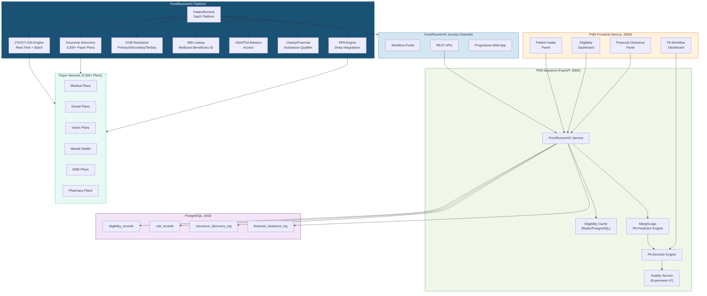
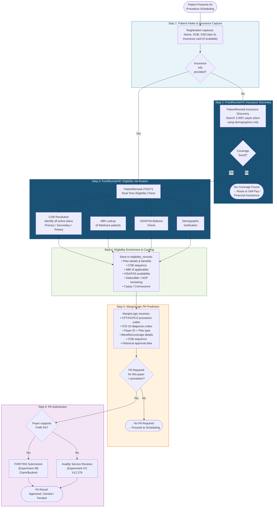
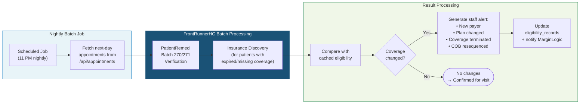

# Product Requirements Document: FrontRunnerHC Integration into Patient Management System (PMS)

**Document ID:** PRD-PMS-FRHC-001
**Version:** 1.0
**Date:** 2026-03-11
**Author:** Ammar (CEO, MPS Inc.)
**Status:** Draft

---

## 1. Executive Summary

FrontRunnerHC is a healthcare data automation platform headquartered in Plymouth, MA, purpose-built to drive adoption of EDI and CMS 270/271 standards for insurance eligibility verification. Its flagship product, **PatientRemedi**, is a patient-centric SaaS platform that provides real-time insurance eligibility verification, insurance discovery (finding coverage when none is provided), demographic verification, coordination of benefits (COB), and financial clearance — all through the **largest payer network in the industry** with access to 3,300+ payer plans spanning Medical, Dental, Vision, Mental Health, DME, and Pharmacy lines of business.

For the PMS, FrontRunnerHC addresses a critical upstream gap in the prior authorization pipeline: **accurate, comprehensive eligibility data**. MarginLogic, the PMS's PA prediction engine, can only produce reliable PA recommendations when it knows the patient's current insurance status, plan details, coordination of benefits, and coverage specifics. An estimated 2 million people switch insurance each month, meaning eligibility data captured at registration is frequently stale by the time a procedure is ordered. FrontRunnerHC's continuous verification model — combining real-time 270/271 EDI transactions with RPA-based insurance discovery — ensures that the eligibility data feeding MarginLogic is always current.

While Experiment 47 (Availity) provides multi-payer eligibility via its Coverages API and Experiment 48 (FHIR PA) enables direct payer-to-provider PA communication, FrontRunnerHC complements both by offering capabilities neither provides: **insurance discovery** (finding coverage for patients who present without insurance information), **HSA/FSA balance lookups**, **Medicare Beneficiary Identifier (MBI) resolution**, **charity/financial assistance qualification**, and **coordination of benefits resolution** across primary, secondary, and tertiary coverage. These capabilities fill the gap between patient intake and the first Availity eligibility call, ensuring that the PA workflow always starts with the most complete insurance picture available.

FrontRunnerHC is HIPAA, CORE, and SOC2 compliant, and offers integration via workflow portal, APIs, and progressive web applications (PWA). It maintains marketplace integrations with athenahealth, AdvancedMD, and Salesforce AppExchange, and is used by hundreds of healthcare organizations including labs, physician groups, healthcare systems, and billing companies.

## 2. Problem Statement

Even with Availity (Experiment 47) providing multi-payer eligibility verification, the PMS faces persistent eligibility data gaps that degrade the PA prediction pipeline:

- **Unknown or missing insurance**: Patients frequently present without insurance cards, with expired coverage, or with incomplete information. Availity's Coverages API requires a valid member ID and payer ID to execute a 270/271 query — it cannot discover coverage when these are unknown. FrontRunnerHC's insurance discovery searches across 3,300+ payer plans to find active coverage using only patient demographics.

- **Stale eligibility data**: An estimated 2 million Americans switch insurance plans each month. Coverage captured at patient registration may be invalid by the time a procedure is ordered weeks or months later. Without continuous re-verification, MarginLogic operates on stale data, leading to incorrect PA predictions, claim denials, and delayed treatments.

- **Incomplete coordination of benefits (COB)**: Many patients — particularly Medicare beneficiaries with supplemental plans — have multiple active coverages. Availity returns eligibility for the queried payer but does not automatically discover and sequence all active plans. Incorrect COB sequencing is a leading cause of claim denials. FrontRunnerHC resolves primary, secondary, and tertiary coverage in a single transaction.

- **MBI resolution for Medicare patients**: Texas Retina Associates (TRA) treats a significant Medicare population. Patients frequently present with old HICN numbers or cannot recall their Medicare Beneficiary Identifier (MBI). Manual MBI lookup through the CMS portal is time-consuming. FrontRunnerHC provides automated MBI resolution as part of the eligibility workflow.

- **No financial clearance at point of intake**: Staff have no automated way to determine a patient's HSA/FSA balance availability, out-of-pocket maximums remaining, or eligibility for charity/financial assistance programs before scheduling procedures. This leads to surprise patient bills and accounts receivable issues.

- **Insurance discovery is a manual, multi-step process**: When a patient's coverage is unknown, staff call the patient, search payer portals individually, or defer verification to the billing department. This can take hours per patient and frequently delays care.

- **PA prediction accuracy depends on eligibility completeness**: MarginLogic's ability to predict whether prior authorization is required — and which payer to submit it to — is only as good as the eligibility data it receives. Incomplete or inaccurate coverage data results in incorrect PA routing, unnecessary PA submissions, or missed PA requirements.

## 3. Proposed Solution

### 3.1 Architecture Overview

### 3.2 Eligibility-to-PA Pipeline: FrontRunnerHC + Availity + MarginLogic

The following diagram shows how FrontRunnerHC's eligibility and insurance discovery capabilities feed into the PA prediction pipeline, complementing Availity (Exp 47) and FHIR PA (Exp 48).

### 3.3 Batch Verification Workflow

FrontRunnerHC supports batch processing for proactive eligibility verification — running bulk checks against the next day's schedule to surface coverage changes before patients arrive.

### 3.4 Deployment Model

- **Cloud SaaS**: FrontRunnerHC PatientRemedi is a fully managed SaaS platform. No self-hosting or infrastructure deployment required.
- **Integration channels**: REST APIs for programmatic integration, workflow portal for manual operations, PWA for mobile access.
- **Processing modes**: Real-time (individual patient verification during intake) and batch (nightly schedule verification).
- **Authentication**: API key-based authentication with FrontRunnerHC platform credentials.
- **HIPAA compliance**: FrontRunnerHC is HIPAA, CORE, and SOC2 compliant. BAA required for production use with PHI.
- **EDI compliance**: All eligibility transactions use CMS-standard 270/271 EDI format, ensuring regulatory compliance and payer acceptance.
- **RPA augmentation**: For payers or data points not accessible via standard EDI, FrontRunnerHC deploys RPA (Robotic Process Automation) to extract data from payer portals — transparent to the PMS integration.

## 4. PMS Data Sources

| PMS API | Endpoint | Interaction |
|---------|----------|-------------|
| Patient Records | `/api/patients` | Provide patient demographics (name, DOB, SSN last 4) for insurance discovery; receive and store verified eligibility data |
| Appointment Schedule | `/api/appointments` | Fetch next-day appointments for batch eligibility verification |
| Encounter Records | `/api/encounters` | Provide CPT/HCPCS and ICD-10 codes that, combined with eligibility data, feed MarginLogic PA prediction |
| Prescription API | `/api/prescriptions` | Provide drug HCPCS codes for pharmacy benefit eligibility and PA determination |
| Reporting API | `/api/reports` | Track eligibility verification metrics: discovery success rate, coverage change rate, batch verification volume |
| MarginLogic API | `/api/marginlogic` | Feed enriched eligibility data (plan details, COB, benefits) into PA prediction engine |

## 5. Component/Module Definitions

### 5.1 FrontRunnerHC API Client

- **Description**: Core service class that manages authentication and communication with the FrontRunnerHC PatientRemedi REST API. Handles both real-time and batch request modes.
- **Input**: API credentials, patient demographics, payer identifiers.
- **Output**: Authenticated API sessions, request/response logging.
- **Endpoint**: FrontRunnerHC API base URL (provided during onboarding).

### 5.2 Insurance Discovery Service

- **Description**: Searches FrontRunnerHC's network of 3,300+ payer plans to find active coverage for patients who present without insurance information. Uses patient demographics (name, DOB, SSN last 4, address) as search criteria.
- **Input**: Patient demographics from `/api/patients`.
- **Output**: List of discovered active coverage plans with member IDs, group numbers, plan types, and effective dates.
- **PMS APIs used**: `/api/patients` (demographics for search).
- **Key value**: Enables the PA pipeline to function even when patients present without insurance cards.

### 5.3 Real-Time Eligibility Verification Service

- **Description**: Executes CMS 270/271 EDI eligibility inquiries against specific payers in real-time via FrontRunnerHC's PatientRemedi platform. Returns detailed benefit information including plan status, copay, deductible, coinsurance, OOP max remaining, and service-specific coverage details.
- **Input**: Patient demographics, member ID, payer ID, date of service, service type code.
- **Output**: Full 271 eligibility response: active/inactive status, plan details, benefit breakdown by service type, in-network/out-of-network differentials.
- **Endpoint**: FrontRunnerHC real-time eligibility API.
- **PMS APIs used**: `/api/patients` (member ID, payer ID, demographics).

### 5.4 Coordination of Benefits (COB) Resolution Service

- **Description**: Identifies and sequences all active coverage for a patient across primary, secondary, and tertiary payers. Critical for Medicare patients with supplemental plans and dual-eligible Medicaid patients.
- **Input**: Patient demographics, known payer information (if any).
- **Output**: Ordered list of active coverages with COB sequence (primary/secondary/tertiary), payer IDs, member IDs, and plan types.
- **PMS APIs used**: `/api/patients` (existing payer records for comparison).

### 5.5 Medicare Beneficiary Identifier (MBI) Lookup Service

- **Description**: Resolves current MBI for Medicare patients using demographics. Essential for TRA's Medicare population where patients may present with legacy HICN numbers or no Medicare ID.
- **Input**: Patient demographics (name, DOB, SSN last 4).
- **Output**: Current MBI, Medicare Part A/B/C/D enrollment status.
- **PMS APIs used**: `/api/patients` (demographics, existing Medicare info).

### 5.6 HSA/FSA Balance Access Service

- **Description**: Retrieves Health Savings Account (HSA) and Flexible Spending Account (FSA) balance information to inform financial clearance and patient responsibility estimates.
- **Input**: Patient demographics, plan information.
- **Output**: Current HSA/FSA balance, eligible expenses, account status.
- **PMS APIs used**: `/api/patients` (plan information).

### 5.7 Financial Assistance Qualification Service

- **Description**: Determines patient eligibility for charity care programs and financial assistance based on demographic and coverage information. Routes uninsured or underinsured patients to appropriate assistance programs.
- **Input**: Patient demographics, income information (if available), coverage status.
- **Output**: Qualified programs list, estimated assistance levels, application requirements.
- **PMS APIs used**: `/api/patients` (demographics, coverage status).

### 5.8 Batch Eligibility Verification Service

- **Description**: Processes bulk eligibility verification for scheduled patients. Runs nightly against the next day's appointment schedule, comparing results with cached eligibility to detect coverage changes.
- **Input**: List of patient IDs from `/api/appointments` (next-day schedule).
- **Output**: Batch results with per-patient eligibility status, change flags, and staff alerts for coverage changes.
- **PMS APIs used**: `/api/appointments` (schedule), `/api/patients` (demographics and cached eligibility).

### 5.9 MarginLogic Eligibility Enrichment Adapter

- **Description**: Transforms FrontRunnerHC eligibility responses into the structured format required by MarginLogic's PA prediction engine. Ensures that all eligibility fields — plan type, COB sequence, benefit details, service-specific coverage — are mapped to MarginLogic's input schema.
- **Input**: Raw FrontRunnerHC eligibility response.
- **Output**: MarginLogic-compatible eligibility payload with normalized plan codes, benefit categories, and coverage flags.
- **PMS APIs used**: `/api/marginlogic` (PA prediction input).

## 6. Non-Functional Requirements

### 6.1 Security and HIPAA Compliance

| Requirement | Implementation |
|-------------|----------------|
| HIPAA compliance | FrontRunnerHC is HIPAA compliant; BAA required for production PHI exchange |
| CORE compliance | FrontRunnerHC adheres to CAQH CORE operating rules for eligibility transactions |
| SOC2 compliance | FrontRunnerHC maintains SOC2 Type II certification |
| Encryption in transit | All API calls over HTTPS (TLS 1.2+) |
| Encryption at rest | Eligibility data encrypted in PostgreSQL (AES-256) |
| Audit logging | Every eligibility request logged with timestamp, user, patient ID, payer, response status. 7-year retention |
| PHI minimization | Send only demographics required for eligibility lookup; do not transmit clinical data to FrontRunnerHC |
| Access control | API credentials stored in environment variables; never committed to source control |

### 6.2 Performance

| Metric | Target |
|--------|--------|
| Real-time eligibility verification latency | < 5 seconds |
| Insurance discovery latency | < 15 seconds (searches multiple payers) |
| COB resolution latency | < 10 seconds |
| MBI lookup latency | < 5 seconds |
| Batch verification throughput | 500+ patients per nightly run |
| Batch completion time | < 60 minutes for full next-day schedule |
| Eligibility cache hit rate | > 80% (same-day re-verification avoided) |

### 6.3 Infrastructure

- **No new infrastructure**: FrontRunnerHC is SaaS; API calls from existing FastAPI backend.
- **PostgreSQL**: New tables for eligibility records, COB records, insurance discovery log, and financial clearance log.
- **Redis (optional)**: Same-day eligibility cache to avoid redundant API calls.
- **Network**: Outbound HTTPS to FrontRunnerHC API endpoints.
- **Cron/Scheduler**: Nightly batch job via existing PMS task scheduler or system cron.

## 7. Implementation Phases

### Phase 1: Core Eligibility & Insurance Discovery (Sprint 1 — 2 weeks)

- Onboard with FrontRunnerHC; execute BAA and API access agreement
- Implement FrontRunnerHC API Client with authentication
- Build Insurance Discovery Service
- Build Real-Time Eligibility Verification Service (270/271)
- Create `eligibility_records` and `insurance_discovery_log` tables in PostgreSQL
- Build Eligibility Dashboard on frontend (Next.js)
- Integrate with existing patient intake workflow

### Phase 2: COB, MBI & Financial Clearance (Sprint 2 — 2 weeks)

- Build COB Resolution Service with primary/secondary/tertiary sequencing
- Build MBI Lookup Service for Medicare patients
- Build HSA/FSA Balance Access Service
- Build Financial Assistance Qualification Service
- Create Financial Clearance Panel on frontend
- Create `cob_records` and `financial_clearance_log` tables
- Integrate COB data into patient record display

### Phase 3: Batch Verification & MarginLogic Integration (Sprint 3 — 2 weeks)

- Build Batch Eligibility Verification Service with nightly scheduling
- Implement coverage change detection and staff alerting
- Build MarginLogic Eligibility Enrichment Adapter
- Connect enriched eligibility data to MarginLogic PA prediction input
- Build eligibility verification metrics dashboard
- Performance tuning and production hardening

## 8. Success Metrics

| Metric | Target | Measurement |
|--------|--------|-------------|
| Insurance discovery success rate | > 70% of unknown-coverage patients | Discovery attempts vs coverage found |
| Eligibility verification coverage | 100% of scheduled patients verified before visit | Batch verification completion rate |
| Coverage change detection rate | > 95% of changes caught before patient arrives | Batch alerts vs post-visit discoveries |
| COB accuracy | > 98% correct primary/secondary/tertiary sequencing | COB-related claim denial rate reduction |
| MBI resolution success rate | > 90% for Medicare patients without current MBI | MBI lookup success vs manual resolution |
| MarginLogic PA prediction accuracy improvement | +15% accuracy uplift | PA prediction accuracy before/after enriched eligibility |
| Time to eligibility verification | < 5 seconds (from 3-5 minutes per portal) | API response time vs baseline |
| Staff time saved on insurance discovery | -80% reduction | Hours spent on manual discovery per week |
| Claim denial rate due to eligibility errors | -50% reduction | Eligibility-related denials before/after |
| Payer coverage breadth | 3,300+ plans accessible | FrontRunnerHC payer network verification |

## 9. Risks and Mitigations

| Risk | Impact | Mitigation |
|------|--------|------------|
| FrontRunnerHC API rate limits or throttling | Batch verification may not complete within nightly window | Stagger batch requests; implement exponential backoff; prioritize high-value appointments |
| Insurance discovery returns false positives | Incorrect coverage assigned to patient | Always verify discovered coverage with a follow-up 270/271 eligibility check before caching |
| FrontRunnerHC platform downtime | Cannot verify eligibility for incoming patients | Cache last-known eligibility; fall back to Availity (Exp 47) for real-time verification |
| Cost exceeds budget at scale | Operating expense growth | Salesforce pricing is $1,900/month per company (transaction-based); model volume against pricing tiers |
| RPA-based lookups are slower than EDI | Increased latency for certain payers | Set timeout thresholds; use cached data when RPA lookups exceed SLA; surface latency in UI |
| Payer data format inconsistencies | Eligibility parsing failures for edge-case payers | Build robust response parser with per-payer normalization rules; log and alert on parse failures |
| PHI exposure during API transit | HIPAA violation | TLS 1.2+ for all API calls; BAA in place; audit all requests; minimize PHI in requests |
| MarginLogic dependency on eligibility freshness | Stale data leads to incorrect PA predictions | Enforce re-verification policy: eligibility data older than 24 hours triggers automatic refresh |
| Overlap with Availity eligibility (Exp 47) | Redundant API calls and cost | Use FrontRunnerHC for discovery and COB; use Availity for PA-adjacent eligibility within the Availity workflow |

## 10. Dependencies

| Dependency | Type | Notes |
|------------|------|-------|
| FrontRunnerHC PatientRemedi API | External | API access agreement and onboarding required |
| FrontRunnerHC BAA | Legal | Required for production PHI exchange |
| FrontRunnerHC API credentials | Secret | API keys from FrontRunnerHC onboarding; stored in environment variables |
| Salesforce AppExchange listing | Reference | FrontRunnerHC pricing reference: $1,900/month per company |
| PostgreSQL 14+ | Infrastructure | Already deployed in PMS |
| FastAPI | Framework | Already deployed in PMS |
| `httpx` | Python library | Async HTTP client for API calls |
| `pydantic` | Python library | Request/response model validation |
| MarginLogic PA Prediction Engine | Internal | Consumes enriched eligibility data for PA prediction |
| Experiment 47 (Availity) | Internal | Complementary — handles PA submission after eligibility is verified |
| Experiment 48 (FHIR PA) | Internal | Complementary — FHIR PAS submission path uses eligibility data from FrontRunnerHC |
| Experiment 45 (CMS Coverage API) | Internal | Medicare coverage rules complement FrontRunnerHC Medicare eligibility data |
| Experiment 16 (FHIR R4 Facade) | Internal | FHIR-native eligibility resources can be sourced from FrontRunnerHC data |

## 11. Comparison with Existing Experiments

| Aspect | Exp 45 (CMS Coverage API) | Exp 47 (Availity) | Exp 48 (FHIR PA) | Exp 74 (FrontRunnerHC) |
|--------|--------------------------|-------------------|-------------------|------------------------|
| **Focus** | Medicare coverage rules | Multi-payer clearinghouse | FHIR PA workflow | **Eligibility verification & insurance discovery** |
| **Payer coverage** | CMS FFS only | All Availity-connected payers | CMS-0057-F mandated payers | **3,300+ payer plans (largest network)** |
| **Eligibility verification** | No | Yes (270/271) | Yes (CoverageEligibilityRequest) | **Yes (270/271 + RPA)** |
| **Insurance discovery** | No | No | No | **Yes — finds unknown coverage** |
| **COB resolution** | No | Limited | No | **Yes — primary/secondary/tertiary** |
| **MBI lookup** | No | No | No | **Yes — automated Medicare ID resolution** |
| **HSA/FSA balance** | No | No | No | **Yes** |
| **Financial assistance** | No | No | No | **Yes — charity qualification** |
| **Demographic verification** | No | No | No | **Yes** |
| **PA submission** | No | Yes (X12 278) | Yes (FHIR Claim/$submit) | **No — feeds data to PA pipeline** |
| **Batch processing** | No | Limited | No | **Yes — nightly schedule verification** |
| **Processing modes** | API | API | API | **API + Portal + PWA** |
| **Compliance** | N/A | HIPAA | HIPAA | **HIPAA + CORE + SOC2** |
| **Deployment** | Cloud API | Cloud API | Payer-hosted FHIR | **Cloud SaaS** |
| **Lines of business** | Medicare only | Medical primarily | Medical primarily | **Medical, Dental, Vision, Mental Health, DME, Pharmacy** |

**Key relationships:**

- **FrontRunnerHC is upstream of Availity and FHIR PA**: FrontRunnerHC discovers and verifies coverage, which then feeds into Availity (Exp 47) for PA submission or FHIR PA (Exp 48) for direct payer PA communication.
- **FrontRunnerHC complements Availity**: Availity excels at multi-payer transactional operations (eligibility, PA, claims) but requires known member/payer IDs. FrontRunnerHC fills the gap when coverage is unknown, incomplete, or stale.
- **FrontRunnerHC enriches MarginLogic**: By providing comprehensive eligibility data (plan details, COB, benefits, MBI), FrontRunnerHC gives MarginLogic the complete picture needed for accurate PA prediction.
- **CMS Coverage API (Exp 45) provides coverage rules; FrontRunnerHC provides coverage status**: Experiment 45 answers "does Medicare cover this procedure?" while FrontRunnerHC answers "is this patient actively enrolled in Medicare, and what are their benefits?"

## 12. Research Sources

**FrontRunnerHC Official:**
- [FrontRunnerHC Website](https://frontrunnerhc.com/) — Company overview, PatientRemedi product information
- [PatientRemedi Product Page](https://frontrunnerhc.com/patientremedi/) — Insurance eligibility verification, discovery, and financial clearance SaaS platform
- [LabXchange Product Page](https://frontrunnerhc.com/labxchange/) — Vendor-agnostic electronic order entry system for labs
- [Salesforce AppExchange Listing](https://appexchange.salesforce.com/appxListingDetail?listingId=a0N3A00000G0lQFUAZ) — Marketplace listing with pricing ($1,900/month per company)

**Industry Context:**
- [CAQH CORE Operating Rules](https://www.caqh.org/core/operating-rules) — 270/271 eligibility transaction standards
- [CMS EDI 270/271 Standards](https://www.cms.gov/regulations-and-guidance/electronic-transactions) — Federal eligibility inquiry/response EDI standards
- [AHIP Insurance Churn Data](https://www.ahip.org/) — Insurance switching frequency (~2 million per month)

**Compliance:**
- [HIPAA EDI Transaction Standards](https://www.hhs.gov/hipaa/for-professionals/transaction/index.html) — HIPAA Administrative Simplification for electronic transactions
- [SOC2 Type II Compliance](https://www.aicpa.org/soc2) — Service Organization Control audit standard

**Integration Ecosystem:**
- [athenahealth Marketplace](https://marketplace.athenahealth.com/) — EHR marketplace where FrontRunnerHC is listed
- [AdvancedMD Marketplace](https://www.advancedmd.com/marketplace/) — Practice management marketplace integration
- [Salesforce Health Cloud](https://www.salesforce.com/health/) — Healthcare CRM platform with FrontRunnerHC integration

## 13. Appendix

### A. FrontRunnerHC Capability Summary

| Capability | Description | Line of Business |
|------------|-------------|-----------------|
| Insurance Eligibility Verification | Real-time 270/271 EDI-based coverage verification | Medical, Dental, Vision, MH, DME, Pharmacy |
| Insurance Discovery | Find active coverage using demographics when member/payer ID is unknown | All |
| Coordination of Benefits | Identify and sequence primary/secondary/tertiary coverage | All |
| MBI Lookup | Resolve current Medicare Beneficiary Identifier | Medicare |
| HSA/FSA Balance Access | Retrieve consumer-directed health account balances | Medical |
| Demographic Verification | Validate and correct patient demographic data against payer records | All |
| Financial Assistance Qualification | Determine eligibility for charity care and assistance programs | All |
| Batch Processing | Bulk eligibility verification for scheduled patient populations | All |

### B. Integration Decision Matrix: FrontRunnerHC vs Availity

| Scenario | Use FrontRunnerHC | Use Availity (Exp 47) | Use Both |
|----------|-------------------|----------------------|----------|
| Patient presents without insurance | **Yes** — insurance discovery | No — requires member/payer ID | |
| Standard eligibility check (known payer) | Yes — real-time 270/271 | Yes — Coverages API | Either — avoid duplication |
| COB resolution needed | **Yes** — multi-payer COB | Limited | |
| MBI lookup for Medicare patient | **Yes** — automated MBI resolution | No | |
| PA submission | No | **Yes** — Service Reviews API | |
| Claim status inquiry | No | **Yes** — Claim Statuses API | |
| Pre-visit batch verification | **Yes** — nightly batch mode | Possible but limited | |
| HSA/FSA balance check | **Yes** | No | |
| Within PA workflow (Step 1: eligibility) | | **Yes** — integrated with PA orchestrator | |
| Initial intake / registration | **Yes** — discovery + verification + COB | | |
| PA prediction (MarginLogic input) | | | **Yes** — FrontRunnerHC provides data, Availity handles PA |

### C. Related Documents

- [Experiment 47: Availity API PRD](47-PRD-AvailityAPI-PMS-Integration.md)
- [Experiment 48: FHIR Prior Auth PRD](48-PRD-FHIRPriorAuth-PMS-Integration.md)
- [Experiment 45: CMS Coverage API PRD](45-PRD-CMSCoverageAPI-PMS-Integration.md)
- [Experiment 16: FHIR R4 Facade PRD](16-PRD-FHIR-PMS-Integration.md)
