# Product Requirements Document: Xero API Integration into Patient Management System (PMS)

**Document ID:** PRD-PMS-XERO-001
**Version:** 1.0
**Date:** 2026-03-11
**Author:** Ammar (CEO, MPS Inc.)
**Status:** Draft

---

## 1. Executive Summary

Xero is a cloud-based accounting platform serving 4.6 million subscribers worldwide, providing invoicing, bank reconciliation, expense tracking, payroll, and financial reporting through a comprehensive REST API. The platform is SOC 2 Type II and ISO 27001 certified, with data centers in the US, UK, and Australia. Xero's API (`api.xero.com/api.xro/2.0/`) exposes 40+ endpoint groups covering contacts, invoices, payments, bank transactions, accounts, journals, and reports — all accessible via OAuth 2.0 with the official `xero-python` SDK (v8.2.0).

Integrating Xero into the PMS creates an automated financial pipeline that connects clinical encounters to accounting workflows. When a patient encounter is completed and billed, the PMS can automatically generate a Xero invoice, track payment status, reconcile insurance reimbursements against bank transactions, and produce financial reports — eliminating the manual double-entry that currently requires staff to re-key billing data from the PMS into a separate accounting system. A critical addition is on-demand full company backup: the ability to export all Xero financial data (invoices, contacts, accounts, bank transactions, journals, payments, credit notes, purchase orders, and reports) to local storage, providing disaster recovery, audit snapshots, and data portability.

The integration delivers four immediate outcomes: (1) elimination of manual double-entry between clinical billing and accounting, (2) real-time financial visibility through synchronized invoice and payment data, (3) automated bank reconciliation matching insurance payments to patient invoices, and (4) on-demand full company backup for disaster recovery, compliance audits, and data portability — ensuring the practice is never locked into a single vendor.

## 2. Problem Statement

The PMS currently has no integration between its clinical billing workflows and accounting systems. This creates several operational bottlenecks:

- **Manual double-entry**: After encounters are billed in the PMS, staff must manually re-enter invoice data into the accounting system — a process consuming 15-30 minutes daily and prone to transcription errors.
- **Delayed financial visibility**: Revenue recognition, accounts receivable aging, and cash flow reports are only available after manual reconciliation, typically days or weeks behind actual activity.
- **Insurance payment reconciliation gap**: When insurance payments arrive via ERA/EOB, staff must manually match each payment to the corresponding PMS invoice and accounting entry — a time-consuming process that delays revenue posting.
- **No automated financial reporting**: Practice managers cannot generate real-time profit/loss, revenue-by-provider, or payer-mix reports without first ensuring all data has been manually synchronized between systems.
- **Vendor lock-in and data fragility**: If the accounting platform experiences downtime, data corruption, or policy changes, there is no local backup of the practice's complete financial history — creating audit risk and business continuity gaps.
- **Audit snapshot difficulty**: For regulatory audits or year-end reviews, staff must manually export data from the accounting system, with no guarantee of completeness or consistency.

The PMS already has experiments for insurance eligibility (pVerify, Exp 73; FrontRunnerHC, Exp 74), claims submission (Availity, Exp 47), and patient communications (RingCentral, Exp 71). Xero completes the revenue cycle by automating the post-encounter financial workflow: encounter → billing → invoice → payment tracking → reconciliation → reporting → backup.

## 3. Proposed Solution

### 3.1 Architecture Overview

```mermaid
flowchart TB
    subgraph PMS["PMS Platform"]
        subgraph BE["Backend (FastAPI :8000)"]
            XERO_CLIENT["XeroClient"]
            BILLING["BillingService"]
            INVOICE["InvoiceService"]
            PAYMENT["PaymentTrackingService"]
            RECON["ReconciliationService"]
            REPORT["FinancialReportService"]
            BACKUP["XeroBackupService"]
        end

        subgraph FE["Frontend (Next.js :3000)"]
            INVPANEL["Invoice Panel"]
            PAYPANEL["Payment Tracker"]
            RECONVIEW["Reconciliation View"]
            REPORTDASH["Financial Dashboard"]
            BACKUPPANEL["Backup Manager"]
        end

        subgraph DB["PostgreSQL :5432"]
            INVTBL["xero_invoices"]
            PAYTBL["xero_payments"]
            CONTBL["xero_contacts"]
            RECONTBL["xero_reconciliations"]
            AUDITTBL["xero_audit_log"]
            BACKUPTBL["xero_backups"]
            SNAPSHOTTBL["xero_backup_snapshots"]
        end

        subgraph AND["Android App"]
            MOBINV["Mobile Invoice View"]
            MOBPAY["Payment Status"]
        end
    end

    subgraph XERO["Xero Cloud (api.xero.com)"]
        TOKEN["OAuth 2.0 Token Service"]
        CONTACTS["Contacts API"]
        INVOICES["Invoices API"]
        PAYMENTS["Payments API"]
        BANK["Bank Transactions API"]
        ACCOUNTS["Accounts API"]
        JOURNALS["Journals API"]
        REPORTS_API["Reports API"]
    end

    subgraph PHI_BOUNDARY["PHI De-Identification Boundary"]
        DEIDENT["PHI Scrubber<br/>No DOB, SSN, Dx, Rx"]
    end

    INVPANEL --> INVOICE
    PAYPANEL --> PAYMENT
    RECONVIEW --> RECON
    REPORTDASH --> REPORT
    BACKUPPANEL --> BACKUP

    BILLING --> DEIDENT
    DEIDENT --> XERO_CLIENT

    XERO_CLIENT --> TOKEN
    XERO_CLIENT --> CONTACTS
    XERO_CLIENT --> INVOICES
    XERO_CLIENT --> PAYMENTS
    XERO_CLIENT --> BANK
    XERO_CLIENT --> ACCOUNTS

    BACKUP --> XERO_CLIENT
    BACKUP --> JOURNALS
    BACKUP --> REPORTS_API

    INVOICE --> INVTBL
    PAYMENT --> PAYTBL
    RECON --> RECONTBL
    BACKUP --> BACKUPTBL
    BACKUP --> SNAPSHOTTBL

    style PHI_BOUNDARY fill:#ff6b6b,stroke:#c92a2a,color:#fff
    style DEIDENT fill:#ff8787,stroke:#c92a2a,color:#fff
    style BACKUP fill:#4c6ef5,stroke:#364fc7,color:#fff
    style BACKUPPANEL fill:#4c6ef5,stroke:#364fc7,color:#fff
    style BACKUPTBL fill:#4c6ef5,stroke:#364fc7,color:#fff
    style SNAPSHOTTBL fill:#4c6ef5,stroke:#364fc7,color:#fff
```

### 3.2 Deployment Model

- **Cloud-hosted SaaS**: Xero is fully cloud-based; no self-hosting option. All API communication over TLS 1.2+.
- **OAuth 2.0 with PKCE**: Authorization Code flow with 30-minute access token expiry; refresh tokens stored encrypted in PostgreSQL.
- **PHI de-identification boundary**: A mandatory scrubber layer ensures **zero PHI** reaches Xero. Only billing-relevant data (patient name, address, phone, email) is transmitted — never DOB, SSN, diagnoses, medications, or clinical notes. Xero does **not** offer a HIPAA BAA, so the integration must be architecturally designed to ensure no PHI crosses the boundary.
- **Rate limiting**: 60 API calls/minute, 5,000/day per tenant. The XeroClient implements token bucket rate limiting with automatic retry and backoff.
- **Backup storage**: Full company backups stored as encrypted JSON archives in local filesystem with PostgreSQL metadata tracking. Configurable retention policy (default: 90 days, 12 monthly snapshots).
- **Docker**: No additional containers required; Xero integration runs within the existing FastAPI service.

## 4. PMS Data Sources

The Xero integration interacts with the following PMS APIs:

- **Patient Records API (`/api/patients`)**: Patient demographic data (name, address, phone, email) for creating Xero contacts. Clinical data (diagnoses, medications, allergies) is **never** sent to Xero.
- **Encounter Records API (`/api/encounters`)**: Encounter completion events trigger invoice generation. Encounter details (date, provider, CPT codes, fees) are translated into Xero line items.
- **Medication & Prescription API (`/api/prescriptions`)**: Not directly integrated — prescription data is PHI and must not reach Xero. Medication-related charges are aggregated into generic line items.
- **Reporting API (`/api/reports`)**: PMS clinical reports are enriched with Xero financial data (revenue, AR aging, payer mix) to create unified operational dashboards.

## 5. Component/Module Definitions

### 5.1 XeroClient

**Description**: Low-level HTTP client wrapping the `xero-python` SDK with token management, rate limiting, and retry logic.

- **Input**: API method name, parameters, tenant ID
- **Output**: Parsed Xero API response objects
- **PMS APIs used**: None (infrastructure component)
- **Key features**: Automatic token refresh (30-min expiry), token bucket rate limiter (60/min), exponential backoff retry, request/response audit logging

### 5.2 BillingService

**Description**: Translates PMS encounter billing data into Xero-compatible invoice payloads, applying PHI de-identification.

- **Input**: Encounter ID, billing codes, patient ID
- **Output**: De-identified invoice payload ready for Xero
- **PMS APIs used**: `/api/encounters`, `/api/patients`
- **Key features**: PHI scrubber (strips DOB, SSN, Dx, Rx), CPT-to-line-item mapping, tax calculation, insurance vs. patient responsibility splitting

### 5.3 InvoiceService

**Description**: Creates, updates, and tracks invoices in Xero, maintaining a local mirror in PostgreSQL.

- **Input**: De-identified invoice payload from BillingService
- **Output**: Xero invoice ID, status, payment URL
- **PMS APIs used**: `/api/encounters` (status updates)
- **Key features**: Invoice creation, voiding, credit notes, online payment link generation, status sync polling

### 5.4 PaymentTrackingService

**Description**: Monitors and records payments received against Xero invoices, matching insurance ERA payments and patient payments.

- **Input**: Xero payment webhooks, ERA/EOB data
- **Output**: Payment records linked to PMS encounters
- **PMS APIs used**: `/api/encounters` (payment status), `/api/patients` (balance updates)
- **Key features**: Insurance payment matching, patient payment recording, overpayment detection, refund tracking

### 5.5 ReconciliationService

**Description**: Matches bank transactions from Xero bank feeds against expected payments from insurance and patients.

- **Input**: Xero bank transaction feed, expected payment records
- **Output**: Reconciliation status, unmatched transactions report
- **PMS APIs used**: `/api/reports` (reconciliation summary)
- **Key features**: Automated matching by amount/reference, fuzzy matching for partial payments, exception queue for manual review

### 5.6 FinancialReportService

**Description**: Generates financial reports by combining Xero accounting data with PMS operational data.

- **Input**: Date range, report type, filters
- **Output**: Formatted report data (revenue, AR aging, payer mix, P&L)
- **PMS APIs used**: `/api/reports` (clinical volume data), `/api/encounters` (encounter counts by provider/payer)
- **Key features**: Revenue by provider, revenue by payer, AR aging buckets, monthly P&L, cash flow forecast

### 5.7 XeroBackupService

**Description**: On-demand full company data export from Xero to local encrypted storage. Pulls all financial entities — contacts, invoices, credit notes, payments, bank transactions, accounts, journals, purchase orders, quotes, manual journals, and reports — into a versioned, encrypted JSON archive with PostgreSQL metadata tracking.

- **Input**: Backup trigger (manual via API/UI, or scheduled cron), optional entity filter, optional date range
- **Output**: Encrypted JSON archive on local filesystem, backup metadata record in PostgreSQL, completion webhook/notification
- **PMS APIs used**: None directly (reads from Xero, writes to local storage)
- **Key features**:
  - **Full export**: Pulls all entity types (Contacts, Invoices, CreditNotes, Payments, BankTransactions, Accounts, Items, Journals, ManualJournals, PurchaseOrders, Quotes, TaxRates, TrackingCategories, Reports)
  - **Incremental backup**: Uses Xero's `If-Modified-Since` header and `ModifiedAfter` parameter to pull only changes since last backup
  - **Rate-limit aware pagination**: Respects 60 calls/min limit with intelligent batching and sleep intervals
  - **Encryption at rest**: AES-256-GCM encryption for all backup archives; encryption key managed via existing PMS key management (ADR-0016)
  - **Integrity verification**: SHA-256 checksums for each entity set and the overall archive
  - **Retention policy**: Configurable retention (default: daily backups for 90 days, monthly snapshots for 12 months, yearly snapshots indefinitely)
  - **Restore verification**: Dry-run restore capability that validates archive integrity and entity counts without writing to Xero
  - **Progress tracking**: Real-time progress reporting via WebSocket for UI feedback during long-running exports
  - **Selective export**: Option to back up specific entity types or date ranges for targeted recovery

## 6. Non-Functional Requirements

### 6.1 Security and HIPAA Compliance

- **PHI de-identification**: Mandatory scrubber ensures zero PHI reaches Xero. Only billing-safe fields (name, address, phone, email, invoice amounts) are transmitted.
- **No BAA dependency**: Architecture assumes Xero will never sign a BAA. All PHI remains in PMS PostgreSQL; Xero receives only de-identified financial data.
- **Token encryption**: OAuth tokens encrypted at rest using AES-256-GCM (per ADR-0016).
- **Audit logging**: Every Xero API call logged with timestamp, user, action, entity ID, and request/response hash. Logs retained for 7 years per HIPAA requirements.
- **Access control**: Xero integration endpoints require `billing:write` or `billing:read` RBAC roles. Backup endpoints require `admin:backup` role.
- **Backup encryption**: All backup archives encrypted at rest with AES-256-GCM. Encryption keys rotated per existing key management policy.
- **Backup access control**: Backup download/restore requires `admin:backup` role with MFA verification.

### 6.2 Performance

- **Invoice creation**: < 2 seconds per invoice (single API call + DB write)
- **Batch invoice sync**: 50 invoices/minute (within 60 calls/min rate limit)
- **Payment reconciliation**: < 5 seconds per reconciliation cycle
- **Financial report generation**: < 10 seconds for monthly reports
- **Full company backup**: < 30 minutes for a practice with 10,000 invoices, 5,000 contacts, 2 years of bank transactions
- **Incremental backup**: < 5 minutes for daily delta

### 6.3 Infrastructure

- **No additional containers**: Runs within existing FastAPI service
- **PostgreSQL tables**: 7 new tables (xero_invoices, xero_payments, xero_contacts, xero_reconciliations, xero_audit_log, xero_backups, xero_backup_snapshots)
- **Backup storage**: Local filesystem (default: `/data/xero-backups/`) with configurable path. Estimated storage: ~500MB per full backup for a mid-size practice.
- **Dependencies**: `xero-python>=8.2.0`, `cryptography>=41.0` (already in use)
- **Environment variables**: `XERO_CLIENT_ID`, `XERO_CLIENT_SECRET`, `XERO_REDIRECT_URI`, `XERO_TENANT_ID`, `XERO_BACKUP_PATH`, `XERO_BACKUP_ENCRYPTION_KEY`

## 7. Implementation Phases

### Phase 1: Foundation & Backup (Sprints 1-2)

- Implement `XeroClient` with OAuth 2.0 token management and rate limiting
- Create PostgreSQL schema for all 7 tables
- Build OAuth 2.0 authorization flow (connect/disconnect Xero)
- Implement `XeroBackupService` with full and incremental export
- Build Backup Manager UI panel with progress tracking
- Create backup scheduling (cron) and retention management
- Add backup integrity verification and restore dry-run

### Phase 2: Billing & Invoicing (Sprints 3-4)

- Implement `BillingService` with PHI de-identification boundary
- Build `InvoiceService` for create/update/void/credit-note workflows
- Create Invoice Panel UI with status tracking
- Implement encounter-to-invoice automation trigger
- Add `PaymentTrackingService` for payment recording and matching
- Build Payment Tracker UI

### Phase 3: Reconciliation & Reporting (Sprints 5-6)

- Implement `ReconciliationService` with automated bank transaction matching
- Build Reconciliation View UI with exception queue
- Implement `FinancialReportService` (revenue, AR aging, payer mix, P&L)
- Build Financial Dashboard UI
- Add Android mobile views for invoice and payment status
- Integration testing with full revenue cycle workflow

## 8. Success Metrics

| Metric | Target | Measurement Method |
|--------|--------|--------------------|
| Manual double-entry elimination | 100% of invoices auto-created | Count of manually created vs. auto-created invoices |
| Invoice creation latency | < 2 seconds | API response time monitoring |
| Payment reconciliation rate | > 90% auto-matched | Matched vs. unmatched transactions |
| Financial report freshness | < 1 hour lag | Timestamp comparison PMS vs. Xero |
| PHI leakage incidents | 0 | Automated PHI scanner on outbound API payloads |
| Backup completion rate | 100% of scheduled backups succeed | Backup job monitoring |
| Backup integrity | 100% checksum verification pass | Automated integrity checks |
| Backup restore time | < 1 hour for full restore verification | Dry-run restore timing |
| Revenue cycle time | 30% reduction | Days from encounter to payment posting |

## 9. Risks and Mitigations

| Risk | Impact | Mitigation |
|------|--------|------------|
| No HIPAA BAA from Xero | PHI exposure if scrubber fails | Architectural PHI boundary with automated scanning; zero-trust design where Xero never receives clinical data |
| 60 calls/min rate limit | Batch operations throttled | Token bucket rate limiter, intelligent batching, off-peak scheduling for bulk operations and backups |
| 30-minute token expiry | Token refresh failures during long operations | Proactive refresh at 25-minute mark, retry with fresh token on 401, backup service checkpoints token validity between entity batches |
| Xero API changes | Breaking changes in API responses | Pin SDK version, integration tests against sandbox, monitor Xero changelog |
| Bank feed delays | Reconciliation delayed by bank processing | Grace period for matching, manual override for urgent reconciliation |
| Backup data volume growth | Storage costs and backup duration increase | Incremental backups for daily runs, compression (gzip), configurable retention, entity-level selective backup |
| Xero service outage | Cannot create invoices or run backups | Queue invoices locally, retry on recovery; backup service resumes from last checkpoint |
| Data portability vendor lock-in | Difficulty migrating away from Xero | Full backup ensures complete local copy of all data; backup format uses standard JSON with documented schema |

## 10. Dependencies

- **Xero API**: `api.xero.com/api.xro/2.0/` — REST API for all accounting operations
- **xero-python SDK**: `>=8.2.0` — Official Python client with OAuth 2.0 support
- **Xero Developer Account**: Free sandbox environment for development and testing
- **Xero Business Plan**: Required for API access in production ($78/month as of March 2026 usage-based pricing)
- **PMS Backend**: FastAPI service running on port 8000
- **PMS Frontend**: Next.js app on port 3000
- **PostgreSQL**: Database on port 5432 for local data mirror and backup metadata
- **cryptography**: `>=41.0` — AES-256-GCM encryption for tokens and backup archives
- **Existing ADR-0016**: Key management infrastructure for encryption keys

## 11. Comparison with Existing Experiments

| Aspect | Xero (Exp 75) | pVerify (Exp 73) | FrontRunnerHC (Exp 74) | Availity (Exp 47) | RingCentral (Exp 71) |
|--------|---------------|------------------|------------------------|--------------------|-----------------------|
| **Purpose** | Post-encounter accounting & backup | Pre-encounter eligibility | Insurance discovery & eligibility | Claims submission & PA | Patient communications |
| **Revenue cycle stage** | Billing → Payment → Reconciliation | Verification → Authorization | Discovery → Verification | Submission → Adjudication | Scheduling → Reminders |
| **Data direction** | PMS → Xero (de-identified) | PMS ← pVerify | PMS ← FrontRunnerHC | PMS → Availity | PMS ↔ RingCentral |
| **PHI handling** | Zero PHI to Xero (no BAA) | PHI required (has BAA) | PHI required (has BAA) | PHI required (has BAA) | PHI in transcripts (access controlled) |
| **Data backup** | Full company export on demand | N/A | N/A | N/A | N/A |
| **Complementary** | Yes — receives billing events from pVerify/FrontRunnerHC eligibility + Availity claims | Yes — feeds eligibility into billing | Yes — feeds discovery into billing | Yes — feeds adjudication into payment | Yes — feeds comm costs into reporting |

The revenue cycle flow is: **pVerify/FrontRunnerHC** (pre-encounter eligibility) → **PMS** (encounter & billing) → **Xero** (invoicing, payment, reconciliation, reporting, backup) → **Availity** (insurance claims). Xero is the financial backbone connecting clinical operations to accounting, with full data backup ensuring business continuity and audit readiness.

## 12. Research Sources

### Official Documentation
- [Xero Developer API Documentation](https://developer.xero.com/documentation/api/accounting/overview) — Complete API reference for all accounting endpoints
- [Xero OAuth 2.0 Guide](https://developer.xero.com/documentation/guides/oauth2/overview) — Authorization flow, token management, scopes
- [xero-python SDK GitHub](https://github.com/XeroAPI/xero-python) — Official Python SDK source, examples, and changelog

### Architecture & Integration
- [Xero API Rate Limits](https://developer.xero.com/documentation/guides/oauth2/limits) — Rate limiting rules (60/min, 5000/day)
- [Xero Webhooks Documentation](https://developer.xero.com/documentation/guides/webhooks/overview) — Event notifications for real-time sync
- [Xero Bank Feeds API](https://developer.xero.com/documentation/api/bankfeeds) — Bank transaction integration for reconciliation

### Security & Compliance
- [Xero Security Overview](https://www.xero.com/security/) — SOC 2 Type II, ISO 27001 certifications, infrastructure security
- [Xero Data Hosting](https://www.xero.com/about/security/data-hosting/) — US data center availability, encryption standards

### Ecosystem & Pricing
- [Xero Pricing (US)](https://www.xero.com/us/pricing/) — Current plan tiers and API access requirements
- [Xero App Marketplace](https://apps.xero.com/) — Integration ecosystem, healthcare-specific apps

## 13. Appendix: Related Documents

- [Xero Setup Guide](75-XeroAPI-PMS-Developer-Setup-Guide.md)
- [Xero Developer Tutorial](75-XeroAPI-Developer-Tutorial.md)
- [pVerify PRD (Exp 73)](73-PRD-pVerify-PMS-Integration.md) — Pre-encounter eligibility verification
- [FrontRunnerHC PRD (Exp 74)](74-PRD-FrontRunnerHC-PMS-Integration.md) — Insurance discovery & financial clearance
- [RingCentral PRD (Exp 71)](71-PRD-RingCentralAPI-PMS-Integration.md) — Unified patient communications
- [Xero API Documentation](https://developer.xero.com/documentation/api/accounting/overview)
