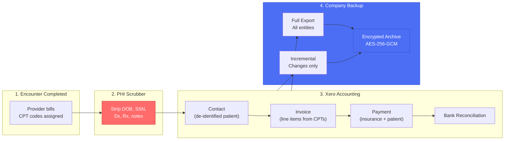
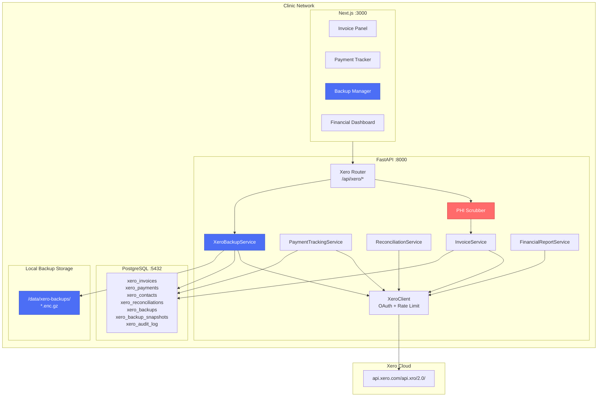

# Xero API Developer Onboarding Tutorial

**Welcome to the MPS PMS Xero Integration Team**

This tutorial will take you from zero to building your first Xero accounting integration with the PMS. By the end, you will understand how Xero's API works, have a running local environment, and have built and tested invoice creation, payment tracking, and a full company backup end-to-end.

**Document ID:** PMS-EXP-XERO-002
**Version:** 1.0
**Date:** 2026-03-11
**Applies To:** PMS project (all platforms)
**Prerequisite:** [Xero API Setup Guide](75-XeroAPI-PMS-Developer-Setup-Guide.md)
**Estimated time:** 2-3 hours
**Difficulty:** Beginner-friendly

---

## What You Will Learn

1. How Xero's double-entry accounting model works and why it matters for PMS billing
2. How OAuth 2.0 authorization connects PMS to a Xero organization
3. How the PHI de-identification boundary protects patient data (no HIPAA BAA)
4. How to create Xero contacts from PMS patient records (de-identified)
5. How to generate invoices from completed PMS encounters
6. How to track payments and match them to invoices
7. How to run a full company backup and verify its integrity
8. How to run an incremental backup for daily delta exports
9. How to query financial reports (P&L, Balance Sheet, Aged Receivables)
10. How to build a Backup Manager UI with progress tracking
11. How rate limiting works and how to stay within Xero's 60 calls/min limit
12. How Xero fits into the PMS revenue cycle alongside pVerify, FrontRunnerHC, and Availity

## Part 1: Understanding Xero (15 min read)

### 1.1 What Problem Does Xero Solve?

In a medical practice, every patient encounter generates financial activity: charges are posted, invoices are created, insurance claims are submitted, and payments arrive from both payers and patients. Today, PMS staff manually re-enter billing data from the clinical system into a separate accounting system — a tedious, error-prone process that delays financial visibility by days or weeks.

Xero eliminates this gap. When a provider completes an encounter and billing codes are assigned, the PMS automatically creates a Xero invoice, tracks payment against it, reconciles bank deposits, and generates financial reports — all without manual data entry. The on-demand backup ensures the practice always has a complete local copy of all financial data for disaster recovery, audits, and vendor portability.

### 1.2 How Xero Works — The Key Pieces



**Concept 1: Double-Entry Accounting** — Every Xero transaction affects two accounts. An invoice increases Accounts Receivable (asset) and Revenue (income). A payment decreases AR and increases Cash. This is automatic — you create invoices and payments, Xero handles the journal entries.

**Concept 2: PHI Boundary** — Xero has no HIPAA BAA. The PMS sends only billing-safe data (name, address, phone, email, CPT descriptions, amounts). Clinical data (diagnoses, medications, notes, DOB, SSN) never leaves the PMS database.

**Concept 3: Full Company Backup** — Xero stores your entire financial history in the cloud. The backup service pulls every entity type (contacts, invoices, payments, bank transactions, journals, reports) into an encrypted local archive — providing disaster recovery, audit snapshots, and vendor independence.

### 1.3 How Xero Fits with Other PMS Technologies

| Technology | Revenue Cycle Stage | Relationship to Xero |
|-----------|--------------------|-----------------------|
| pVerify (Exp 73) | Pre-encounter eligibility | Verified encounters feed into Xero invoices |
| FrontRunnerHC (Exp 74) | Insurance discovery | Discovered coverage determines payer on Xero invoice |
| Availity (Exp 47) | Claims submission | Claim adjudication triggers Xero payment recording |
| RingCentral (Exp 71) | Patient communications | Communication costs tracked as Xero expenses |
| Azure Doc Intel (Exp 69) | Document processing | EOB/ERA documents parsed → Xero payment matching |
| **Xero (Exp 75)** | **Billing → Payment → Reconciliation → Backup** | **Financial backbone of the revenue cycle** |

### 1.4 Key Vocabulary

| Term | Meaning |
|------|---------|
| **Tenant** | A Xero organization (company). Each practice is one tenant. |
| **Contact** | A person or organization in Xero's address book (maps to PMS patient, de-identified). |
| **ACCREC Invoice** | Accounts Receivable invoice — money owed TO the practice (patient/insurance). |
| **ACCPAY Invoice** | Accounts Payable invoice — money the practice owes (vendors, suppliers). |
| **Credit Note** | A reversal or adjustment against an invoice (partial refund, write-off). |
| **Bank Feed** | Automated import of bank transactions into Xero for reconciliation. |
| **Journal** | A double-entry accounting record (debit one account, credit another). |
| **Chart of Accounts** | The list of all account categories (Revenue, Expenses, Assets, Liabilities, Equity). |
| **Tracking Category** | Xero's equivalent of cost centers — use for provider, location, or department grouping. |
| **OAuth Scope** | Permissions granted to the PMS app (e.g., `accounting.transactions` for invoices). |
| **Full Backup** | Complete export of all Xero entities to encrypted local storage. |
| **Incremental Backup** | Export of only entities modified since the last backup (uses `If-Modified-Since`). |

### 1.5 Our Architecture



## Part 2: Environment Verification (15 min)

### 2.1 Checklist

Complete these steps to verify your environment is ready:

1. **PMS Backend running**:
   ```bash
   curl -s http://localhost:8000/health | jq .status
   # Expected: "healthy"
   ```

2. **PMS Frontend running**:
   ```bash
   curl -s -o /dev/null -w "%{http_code}" http://localhost:3000
   # Expected: 200
   ```

3. **PostgreSQL accessible**:
   ```bash
   psql -U pms -d pms_db -c "SELECT COUNT(*) FROM xero_backups;"
   # Expected: 0 (table exists, no rows yet)
   ```

4. **Xero environment variables set**:
   ```bash
   echo $XERO_CLIENT_ID | head -c 8
   # Expected: first 8 chars of your Client ID
   ```

5. **Xero connected**:
   ```bash
   curl -s http://localhost:8000/api/xero/auth/status | jq .
   # Expected: {"connected": true, "token_valid": true}
   ```

6. **Backup directory exists**:
   ```bash
   ls -la /data/xero-backups/
   # Expected: empty directory with 700 permissions
   ```

### 2.2 Quick Test

Run one API call to confirm end-to-end connectivity:

```bash
curl -s http://localhost:8000/api/xero/reports/balance-sheet?date=2026-03-11 \
  -H "Authorization: Bearer $BILLING_TOKEN" | jq '.Reports[0].ReportName'
# Expected: "Balance Sheet"
```

If this returns a report name, your Xero integration is fully operational.

## Part 3: Build Your First Integration (45 min)

### 3.1 What We Are Building

We will build a complete encounter-to-invoice pipeline:

1. Take a completed PMS encounter with billing codes
2. De-identify the patient data (strip PHI)
3. Create or find the patient's Xero contact
4. Generate a Xero invoice with CPT-based line items
5. Run a full company backup to capture the new invoice
6. Verify the backup integrity

### 3.2 Step 1 — Create a Test Patient Contact

```python
# test_xero_invoice.py
import asyncio
from app.integrations.xero.client import xero_client
from app.integrations.xero.phi_scrubber import scrub_patient_for_xero

async def main():
    # Simulate a PMS patient record (includes PHI)
    patient = {
        "id": "test-patient-001",
        "first_name": "Jane",
        "last_name": "Smith",
        "email": "jane.smith@example.com",
        "phone": "512-555-0100",
        "address": "100 Main St",
        "city": "Austin",
        "state": "TX",
        "zip": "78701",
        # PHI fields — these MUST be blocked
        "date_of_birth": "1985-06-15",
        "ssn": "123-45-6789",
        "diagnoses": ["E11.9 - Type 2 Diabetes"],
        "medications": ["Metformin 500mg"],
        "allergies": ["Penicillin"],
    }

    # Step 1: Scrub PHI
    result = scrub_patient_for_xero(patient)
    print(f"Clean data: {result.clean_data}")
    print(f"Blocked fields: {result.blocked_fields}")
    assert "date_of_birth" not in result.clean_data
    assert "ssn" not in result.clean_data
    assert "diagnoses" not in result.clean_data

    # Step 2: Create Xero contact
    contact_payload = {
        "Contacts": [{
            "Name": f"{result.clean_data['first_name']} {result.clean_data['last_name']}",
            "ContactNumber": patient["id"],
            "EmailAddress": result.clean_data.get("email", ""),
            "Phones": [{"PhoneType": "DEFAULT", "PhoneNumber": result.clean_data.get("phone", "")}],
        }]
    }

    response = await xero_client.post("Contacts", json_data=contact_payload)
    contact = response["Contacts"][0]
    print(f"Created Xero contact: {contact['ContactID']} — {contact['Name']}")

    return contact

asyncio.run(main())
```

Run it:
```bash
cd pms-backend
python test_xero_invoice.py
```

**Expected output**:
```
Clean data: {'first_name': 'Jane', 'last_name': 'Smith', 'email': 'jane.smith@example.com', 'phone': '512-555-0100', 'address': '100 Main St', 'city': 'Austin', 'state': 'TX', 'zip': '78701'}
Blocked fields: ['date_of_birth', 'ssn', 'diagnoses', 'medications', 'allergies']
Created Xero contact: abc123-... — Jane Smith
```

### 3.3 Step 2 — Create an Invoice from an Encounter

```python
# Continue in test_xero_invoice.py
async def create_test_invoice(contact_id: str):
    encounter = {
        "id": "enc-2026-0311-001",
        "encounter_date": "2026-03-11",
        "due_date": "2026-04-10",
        "billing_items": [
            {"cpt_code": "99213", "cpt_description": "Office Visit - Established Patient (Level 3)", "fee": 150.00},
            {"cpt_code": "82947", "cpt_description": "Glucose Blood Test", "fee": 25.00},
        ],
    }

    invoice_payload = {
        "Invoices": [{
            "Type": "ACCREC",
            "Contact": {"ContactID": contact_id},
            "Date": encounter["encounter_date"],
            "DueDate": encounter["due_date"],
            "Reference": f"ENC-{encounter['id']}",
            "LineItems": [
                {
                    "Description": item["cpt_description"],
                    "Quantity": 1,
                    "UnitAmount": item["fee"],
                    "AccountCode": "200",
                }
                for item in encounter["billing_items"]
            ],
            "Status": "AUTHORISED",
            "CurrencyCode": "USD",
        }]
    }

    response = await xero_client.post("Invoices", json_data=invoice_payload)
    invoice = response["Invoices"][0]

    print(f"Invoice created: {invoice['InvoiceNumber']}")
    print(f"  Status: {invoice['Status']}")
    print(f"  Total: ${invoice['Total']:.2f}")
    print(f"  Amount Due: ${invoice['AmountDue']:.2f}")
    print(f"  Xero ID: {invoice['InvoiceID']}")

    return invoice
```

**Expected output**:
```
Invoice created: INV-0042
  Status: AUTHORISED
  Total: $175.00
  Amount Due: $175.00
  Xero ID: def456-...
```

### 3.4 Step 3 — Record a Payment

```python
async def record_payment(invoice_id: str, amount: float):
    # Get the invoice to find the account
    invoice = await xero_client.get(f"Invoices/{invoice_id}")
    inv = invoice["Invoices"][0]

    payment_payload = {
        "Payments": [{
            "Invoice": {"InvoiceID": invoice_id},
            "Account": {"Code": "090"},  # Checking account
            "Date": "2026-03-11",
            "Amount": amount,
            "Reference": "Insurance ERA payment",
        }]
    }

    response = await xero_client.post("Payments", json_data=payment_payload)
    payment = response["Payments"][0]

    print(f"Payment recorded: ${payment['Amount']:.2f}")
    print(f"  Payment ID: {payment['PaymentID']}")
    print(f"  Remaining: ${inv['AmountDue'] - amount:.2f}")

    return payment
```

### 3.5 Step 4 — Run a Full Company Backup

```python
async def run_backup():
    from app.integrations.xero.backup_service import backup_service

    print("Starting full company backup...")
    result = await backup_service.run_full_backup(triggered_by="tutorial")

    print(f"Backup completed!")
    print(f"  Backup ID: {result['backup_id']}")
    print(f"  File: {result['file_path']}")
    print(f"  Size: {result['file_size_bytes'] / 1024:.1f} KB")
    print(f"  Duration: {result['duration_seconds']:.1f}s")
    print(f"  Entity counts:")
    for entity, count in result['entity_counts'].items():
        if count > 0:
            print(f"    {entity}: {count}")

    return result
```

**Expected output**:
```
Starting full company backup...
Backup completed!
  Backup ID: a1b2c3d4-...
  File: /data/xero-backups/xero-backup-full-20260311-143022.enc.gz
  Size: 245.3 KB
  Duration: 42.7s
  Entity counts:
    Contacts: 15
    Invoices: 43
    Payments: 28
    BankTransactions: 156
    Accounts: 64
    Journals: 312
    TaxRates: 8
    Report_BalanceSheet: 1
    Report_ProfitAndLoss: 1
```

### 3.6 Step 5 — Verify the Backup

```python
async def verify(backup_id: str):
    from app.integrations.xero.backup_service import backup_service
    from uuid import UUID

    result = await backup_service.verify_backup(UUID(backup_id))

    if result["valid"]:
        print("Backup verification PASSED")
        print(f"  Checksum match: {result['checksum_match']}")
        print(f"  File size: {result['file_size_bytes'] / 1024:.1f} KB")
    else:
        print(f"Backup verification FAILED: {result['error']}")

    return result
```

**Expected output**:
```
Backup verification PASSED
  Checksum match: True
  File size: 245.3 KB
```

## Part 4: Evaluating Strengths and Weaknesses (15 min)

### 4.1 Strengths

- **Mature API**: 40+ endpoint groups, well-documented, stable versioning, official Python SDK
- **OAuth 2.0**: Industry-standard auth with granular scopes — request only the permissions you need
- **Double-entry accounting**: Automatic journal entries from invoices/payments — no manual bookkeeping
- **Global presence**: Multi-currency, multi-tax-rate support for practices with international patients
- **Bank feeds**: Automatic bank transaction import for reconciliation
- **App marketplace**: 1,000+ integrations for payroll, inventory, CRM, etc.
- **Demo company**: Free sandbox with pre-populated data for development and testing

### 4.2 Weaknesses

- **No HIPAA BAA**: Cannot store PHI in Xero — requires architectural PHI boundary
- **Rate limits**: 60 calls/min is restrictive for bulk operations and large backups
- **30-minute token expiry**: Requires proactive refresh during long-running operations
- **No real-time webhooks for all entities**: Webhooks only cover contacts, invoices, and some financial events — not all entity types
- **Pagination overhead**: Large datasets require many paginated API calls, each counting against rate limits
- **No bulk export API**: No single endpoint to download all company data — must iterate through each entity type
- **Pricing changes**: March 2026 shift to usage-based pricing may increase costs for high-volume API usage

### 4.3 When to Use Xero vs Alternatives

| Scenario | Use Xero | Use QuickBooks | Use Custom Ledger |
|----------|----------|----------------|-------------------|
| Small-medium practice (<50 providers) | Yes | Yes | No |
| Multi-location enterprise | Maybe | Yes (QBO Advanced) | Consider |
| International patients/currencies | Yes (strong) | Limited | Custom |
| Need HIPAA BAA on accounting | No | No | Yes |
| High-volume API usage (>5000/day) | Check pricing | Check pricing | Yes |
| Full data portability required | Yes (with backup service) | Limited export | Yes |
| Existing Xero users | Yes | No | No |

### 4.4 HIPAA / Healthcare Considerations

1. **Zero PHI to Xero**: The PHI scrubber is the most critical component. It must be tested exhaustively and audited regularly. Any new patient field added to the PMS must be evaluated for PHI status before allowing it through the scrubber.

2. **Audit trail**: Every Xero API call is logged in `xero_audit_log` with timestamp, method, endpoint, and status code. Logs are retained for 7 years per HIPAA requirements.

3. **Access control**: Xero endpoints require explicit RBAC roles (`billing:read`, `billing:write`, `admin:backup`). The backup service additionally requires MFA for download/restore operations.

4. **Encryption**: OAuth tokens encrypted at rest (AES-256-GCM). Backup archives encrypted at rest with separate key. Both keys managed via ADR-0016 key management infrastructure.

5. **Data residency**: Xero US data is hosted in the US (AWS us-east-1). Verify this meets your organization's data residency requirements.

## Part 5: Debugging Common Issues (15 min read)

### Issue 1: "No refresh token available. Re-authorize with Xero."

**Symptom**: All API calls fail with this error after a period of inactivity.

**Cause**: Xero refresh tokens expire after 60 days of non-use. If the PMS hasn't made any Xero API calls in 60 days, the token is revoked.

**Fix**: Re-initiate the OAuth flow by visiting `/api/xero/auth/connect` and completing authorization in the browser.

**Prevention**: Schedule a daily health check that calls `/api/xero/auth/status` — this triggers a token refresh if needed.

### Issue 2: Invoice Creation Returns "Account code '200' is not a valid code"

**Symptom**: POST to /Invoices returns 400 with account code validation error.

**Cause**: The Chart of Accounts in the Xero demo company doesn't have account code "200" for Revenue.

**Fix**: Query the Chart of Accounts to find the correct revenue account code:
```bash
curl -s http://localhost:8000/api/xero/reports/balance-sheet?date=2026-03-11 \
  | jq '.Reports[0].Rows'
```
Or query accounts directly:
```python
accounts = await xero_client.get("Accounts", params={"where": 'Type=="REVENUE"'})
print(accounts["Accounts"][0]["Code"])  # Use this code
```

### Issue 3: Backup File Size Is Unexpectedly Large

**Symptom**: Full backup is >1GB for a small practice.

**Cause**: Xero returns verbose JSON with nested objects. Attachments (if any) are base64-encoded in the response.

**Fix**: The backup service uses gzip compression which typically achieves 80-90% compression on JSON. If size is still an issue, use selective backup to exclude large entity types:
```python
await backup_service.run_full_backup(entity_filter=["Contacts", "Invoices", "Payments"])
```

### Issue 4: Rate Limit Hit During Backup

**Symptom**: Backup fails with 429 errors partway through.

**Cause**: Other PMS services are also making Xero API calls concurrently, exhausting the 60/min budget.

**Fix**: Schedule backups during off-hours when no interactive users are making Xero calls. The `RateLimiter` is per-process — if multiple workers are running, they each have independent limiters. Consider a shared Redis-based rate limiter for multi-worker deployments.

### Issue 5: PHI Scrubber Passed a New Field

**Symptom**: Audit review finds a field like `emergency_contact_ssn` in outbound Xero API payload.

**Cause**: A new patient field was added to the PMS schema but not added to `BLOCKED_FIELDS` in the scrubber.

**Fix**:
1. Add the field to `BLOCKED_FIELDS` in `phi_scrubber.py`
2. Review `xero_audit_log` for any calls where this field may have been transmitted
3. If PHI was transmitted, follow HIPAA breach notification procedure
4. Add a CI test that validates all patient model fields are either in `SAFE_FIELDS` or `BLOCKED_FIELDS`

## Part 6: Practice Exercises (45 min)

### Option A: Build a Batch Invoice Generator

Create a script that reads all completed encounters from today's schedule and generates Xero invoices in batch, respecting rate limits.

**Hints**:
1. Query `/api/encounters?status=completed&date=today`
2. For each encounter, call `invoice_service.create_invoice_from_encounter()`
3. Use `asyncio.gather()` with a semaphore to limit concurrency to 1 (due to rate limits)
4. Track success/failure counts and log results

**Expected outcome**: A batch job that processes 50+ encounters into Xero invoices within rate limits.

### Option B: Build an Incremental Backup Scheduler

Create a scheduled job that runs daily incremental backups and monthly full backups with retention management.

**Hints**:
1. Use `apscheduler` or a simple cron-based trigger
2. At 2:00 AM daily: run `backup_service.run_incremental_backup(since=last_backup_time)`
3. On the 1st of each month: run `backup_service.run_full_backup()` and promote to monthly snapshot
4. After each backup: run `backup_service.cleanup_old_backups()`
5. Send a Slack/email notification on failure

**Expected outcome**: Automated backup rotation with daily incrementals, monthly fulls, and automatic cleanup.

### Option C: Build a Payment Reconciliation Dashboard

Create a dashboard that shows unmatched bank transactions and allows manual matching.

**Hints**:
1. Fetch bank transactions: `GET /BankTransactions`
2. Fetch payments: `GET /Payments`
3. Match by amount and reference number
4. Display unmatched transactions in a UI with drag-and-drop matching
5. Record matches in `xero_reconciliations` table

**Expected outcome**: A reconciliation interface showing matched/unmatched transactions with manual override.

## Part 7: Development Workflow and Conventions

### 7.1 File Organization

```
pms-backend/
├── app/
│   ├── integrations/
│   │   └── xero/
│   │       ├── __init__.py
│   │       ├── client.py            # XeroClient, TokenManager, RateLimiter
│   │       ├── phi_scrubber.py      # PHI de-identification boundary
│   │       ├── invoice_service.py   # Invoice lifecycle management
│   │       ├── payment_service.py   # Payment tracking & matching
│   │       ├── recon_service.py     # Bank reconciliation
│   │       ├── backup_service.py    # Full/incremental company backup
│   │       └── report_service.py    # Financial reporting
│   └── api/
│       └── routes/
│           └── xero.py              # FastAPI endpoints
│
pms-frontend/
├── src/
│   ├── types/
│   │   └── xero.ts                  # TypeScript interfaces
│   ├── lib/
│   │   └── xero-api.ts             # API client functions
│   └── components/
│       └── xero/
│           ├── BackupManager.tsx     # Backup management UI
│           ├── InvoicePanel.tsx      # Invoice list & creation
│           ├── PaymentTracker.tsx    # Payment status & history
│           └── FinancialDashboard.tsx # Reports & charts
```

### 7.2 Naming Conventions

| Item | Convention | Example |
|------|-----------|---------|
| Xero entity ID field | `xero_{entity}_id` | `xero_invoice_id`, `xero_contact_id` |
| Database table | `xero_{entity}` | `xero_invoices`, `xero_backups` |
| Service class | `{Entity}Service` | `InvoiceService`, `XeroBackupService` |
| API endpoint | `/api/xero/{resource}` | `/api/xero/invoices`, `/api/xero/backup/full` |
| Backup file | `xero-backup-{type}-{timestamp}.enc.gz` | `xero-backup-full-20260311-020000.enc.gz` |
| Environment variable | `XERO_*` | `XERO_CLIENT_ID`, `XERO_BACKUP_PATH` |

### 7.3 PR Checklist

- [ ] PHI scrubber updated if new patient fields were added
- [ ] No PHI in Xero API payloads (verify with audit log review)
- [ ] Rate limiting tested — no burst of >60 calls/min
- [ ] OAuth token refresh tested (simulate expired token)
- [ ] Backup integrity verification passes after changes
- [ ] New database columns have appropriate indexes
- [ ] API endpoints have correct RBAC role requirements
- [ ] Audit logging covers all new Xero API interactions
- [ ] Error handling returns meaningful messages without exposing internals

### 7.4 Security Reminders

1. **Never log PHI**: Audit logs store method/endpoint/status only — never request/response bodies that might contain patient data
2. **Never hardcode credentials**: All Xero credentials come from environment variables
3. **Encrypt at rest**: OAuth tokens and backup archives use AES-256-GCM
4. **Rotate keys**: Backup encryption keys should be rotated quarterly per ADR-0016
5. **Test the scrubber**: Add unit tests for every patient field to verify PHI blocking
6. **Backup access**: Backup download/restore requires `admin:backup` role + MFA

## Part 8: Quick Reference Card

### Key Commands

```bash
# Check connection
curl -s localhost:8000/api/xero/auth/status | jq .

# Create invoice
curl -s -X POST localhost:8000/api/xero/invoices \
  -H "Content-Type: application/json" \
  -d '{"encounter_id": "UUID"}' | jq .

# Full backup
curl -s -X POST localhost:8000/api/xero/backup/full | jq .

# Incremental backup
curl -s -X POST localhost:8000/api/xero/backup/incremental \
  -H "Content-Type: application/json" \
  -d '{"since": "2026-03-10T00:00:00Z"}' | jq .

# List backups
curl -s localhost:8000/api/xero/backup/list | jq .

# Verify backup
curl -s localhost:8000/api/xero/backup/{id}/verify | jq .

# P&L report
curl -s "localhost:8000/api/xero/reports/profit-and-loss?from_date=2026-01-01&to_date=2026-03-11" | jq .
```

### Key Files

| File | Purpose |
|------|---------|
| `app/integrations/xero/client.py` | XeroClient with OAuth + rate limiting |
| `app/integrations/xero/phi_scrubber.py` | PHI de-identification boundary |
| `app/integrations/xero/backup_service.py` | Full/incremental company backup |
| `app/integrations/xero/invoice_service.py` | Invoice lifecycle management |
| `app/api/routes/xero.py` | FastAPI endpoints |
| `src/components/xero/BackupManager.tsx` | Backup management UI |

### Key URLs

| URL | Description |
|-----|-------------|
| http://localhost:8000/api/xero/auth/status | Connection status |
| http://localhost:3000/admin/xero | Xero admin panel |
| http://localhost:3000/admin/xero/backups | Backup manager |
| https://developer.xero.com | Xero Developer Portal |
| https://api-explorer.xero.com | Interactive API explorer |

### Starter Template — Invoice from Encounter

```python
from app.integrations.xero.invoice_service import invoice_service
from app.integrations.xero.backup_service import backup_service

# Create invoice
result = await invoice_service.create_invoice_from_encounter(
    encounter_id=encounter.id,
    patient=patient.dict(),
    encounter=encounter.dict(),
)
print(f"Invoice {result['invoice_number']}: ${result['total']:.2f}")

# Run backup after batch processing
backup = await backup_service.run_full_backup(triggered_by="batch-job")
print(f"Backup {backup['backup_id']}: {backup['entity_counts']}")
```

## Next Steps

1. **Configure scheduled backups**: Set up daily incremental + monthly full backup rotation using the practice exercise from Option B
2. **Build the reconciliation workflow**: Implement bank transaction matching with the ReconciliationService
3. **Integrate with pVerify (Exp 73)**: Auto-generate invoices when eligibility-verified encounters are completed
4. **Set up Xero webhooks**: Enable real-time invoice/payment status updates instead of polling
5. **Review the [PRD](75-PRD-XeroAPI-PMS-Integration.md)** for the full Phase 2 and Phase 3 implementation roadmap
