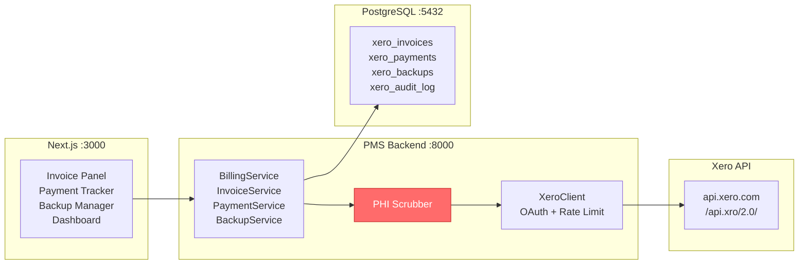

# Xero API Setup Guide for PMS Integration

**Document ID:** PMS-EXP-XERO-001
**Version:** 1.0
**Date:** 2026-03-11
**Applies To:** PMS project (all platforms)
**Prerequisites Level:** Intermediate

---

## Table of Contents

1. [Overview](#1-overview)
2. [Prerequisites](#2-prerequisites)
3. [Part A: Xero Developer Account & OAuth Setup](#3-part-a-xero-developer-account--oauth-setup)
4. [Part B: Install & Configure XeroClient](#4-part-b-install--configure-xeroclient)
5. [Part C: Database Schema](#5-part-c-database-schema)
6. [Part D: Backend Services](#6-part-d-backend-services)
7. [Part E: Backup Service](#7-part-e-backup-service)
8. [Part F: FastAPI Endpoints](#8-part-f-fastapi-endpoints)
9. [Part G: Frontend Components](#9-part-g-frontend-components)
10. [Part H: Testing & Verification](#10-part-h-testing--verification)
11. [Troubleshooting](#11-troubleshooting)
12. [Reference Commands](#12-reference-commands)
13. [Next Steps](#13-next-steps)
14. [Resources](#14-resources)

---

## 1. Overview

This guide walks you through connecting the PMS to Xero's cloud accounting API for automated invoicing, payment tracking, bank reconciliation, financial reporting, and **on-demand full company backup**. By the end, you will have:

- A Xero Developer App with OAuth 2.0 authorization flow
- A Python `XeroClient` with automatic token management and rate limiting
- PostgreSQL tables for invoices, payments, contacts, reconciliations, backups, and audit logs
- FastAPI endpoints for invoice management, payment tracking, and company backup
- Next.js components for the Invoice Panel, Payment Tracker, Backup Manager, and Financial Dashboard
- A working full company backup that exports all Xero data to encrypted local storage



## 2. Prerequisites

### 2.1 Required Software

| Software | Minimum Version | Check Command |
|----------|----------------|---------------|
| Python | 3.11+ | `python --version` |
| Node.js | 18+ | `node --version` |
| PostgreSQL | 15+ | `psql --version` |
| pip | 23+ | `pip --version` |
| Git | 2.40+ | `git --version` |

### 2.2 Installation of Prerequisites

Install the Xero Python SDK and dependencies:

```bash
pip install xero-python>=8.2.0 httpx>=0.27.0 cryptography>=41.0 tenacity>=8.0
```

### 2.3 Verify PMS Services

Confirm all PMS services are running:

```bash
# Backend health check
curl -s http://localhost:8000/health | jq .

# Frontend
curl -s -o /dev/null -w "%{http_code}" http://localhost:3000

# PostgreSQL
psql -U pms -d pms_db -c "SELECT 1;"
```

**Checkpoint**: All three commands succeed. Backend returns `{"status": "healthy"}`, frontend returns `200`, PostgreSQL returns `1`.

## 3. Part A: Xero Developer Account & OAuth Setup

### Step 1: Create a Xero Developer Account

1. Go to [developer.xero.com](https://developer.xero.com/) and sign in or create an account
2. Navigate to **My Apps** → **New App**
3. Configure the app:
   - **App name**: `PMS Integration`
   - **Integration type**: `Web app`
   - **Company or application URL**: `http://localhost:3000`
   - **Redirect URI**: `http://localhost:8000/api/xero/callback`
4. Click **Create App**
5. Note the **Client ID** and generate a **Client Secret**

### Step 2: Create a Demo Company

1. In the Xero Developer portal, go to **My Xero Organizations**
2. Click **Try Xero** to create a demo company (free, pre-populated with sample data)
3. Note the **Tenant ID** (visible in API responses after authorization)

### Step 3: Configure Environment Variables

Add to your `.env` file:

```bash
# Xero API Configuration
XERO_CLIENT_ID=your_client_id_here
XERO_CLIENT_SECRET=your_client_secret_here
XERO_REDIRECT_URI=http://localhost:8000/api/xero/callback
XERO_SCOPES=openid profile email accounting.transactions accounting.contacts accounting.reports.read accounting.settings.read accounting.journals.read
XERO_TENANT_ID=  # Auto-populated after first OAuth flow

# Xero Backup Configuration
XERO_BACKUP_PATH=/data/xero-backups
XERO_BACKUP_ENCRYPTION_KEY=  # Generated in Step 4
XERO_BACKUP_RETENTION_DAYS=90
XERO_BACKUP_MONTHLY_RETENTION=12
```

### Step 4: Generate Backup Encryption Key

```bash
python -c "from cryptography.fernet import Fernet; print(Fernet.generate_key().decode())"
```

Add the output to `XERO_BACKUP_ENCRYPTION_KEY` in `.env`.

Create the backup directory:

```bash
mkdir -p /data/xero-backups
chmod 700 /data/xero-backups
```

**Checkpoint**: You have a Xero Developer App with Client ID and Secret, a demo company, environment variables configured, and a backup directory created.

## 4. Part B: Install & Configure XeroClient

### Step 5: Create the Xero Client Module

Create `app/integrations/xero/client.py`:

```python
"""Xero API client with OAuth 2.0 token management and rate limiting."""

import asyncio
import time
from datetime import datetime, timedelta, timezone

import httpx
from tenacity import retry, stop_after_attempt, wait_exponential

from app.core.config import settings
from app.core.encryption import encrypt_value, decrypt_value
from app.db.session import get_db


class XeroTokenManager:
    """Manages OAuth 2.0 tokens with automatic refresh."""

    TOKEN_URL = "https://identity.xero.com/connect/token"
    AUTHORIZE_URL = "https://login.xero.com/identity/connect/authorize"

    def __init__(self):
        self._access_token: str | None = None
        self._refresh_token: str | None = None
        self._expires_at: datetime | None = None
        self._lock = asyncio.Lock()

    def get_authorization_url(self, state: str) -> str:
        """Generate OAuth 2.0 authorization URL."""
        params = {
            "response_type": "code",
            "client_id": settings.XERO_CLIENT_ID,
            "redirect_uri": settings.XERO_REDIRECT_URI,
            "scope": settings.XERO_SCOPES,
            "state": state,
        }
        query = "&".join(f"{k}={v}" for k, v in params.items())
        return f"{self.AUTHORIZE_URL}?{query}"

    async def exchange_code(self, code: str) -> dict:
        """Exchange authorization code for tokens."""
        async with httpx.AsyncClient() as client:
            response = await client.post(
                self.TOKEN_URL,
                data={
                    "grant_type": "authorization_code",
                    "code": code,
                    "redirect_uri": settings.XERO_REDIRECT_URI,
                    "client_id": settings.XERO_CLIENT_ID,
                    "client_secret": settings.XERO_CLIENT_SECRET,
                },
            )
            response.raise_for_status()
            tokens = response.json()
            await self._store_tokens(tokens)
            return tokens

    async def get_access_token(self) -> str:
        """Get a valid access token, refreshing if needed."""
        async with self._lock:
            if self._needs_refresh():
                await self._refresh()
            return self._access_token

    def _needs_refresh(self) -> bool:
        """Check if token needs refresh (5-min buffer before expiry)."""
        if not self._access_token or not self._expires_at:
            return True
        return datetime.now(timezone.utc) >= self._expires_at - timedelta(minutes=5)

    async def _refresh(self) -> None:
        """Refresh the access token."""
        if not self._refresh_token:
            await self._load_tokens_from_db()
        if not self._refresh_token:
            raise ValueError("No refresh token available. Re-authorize with Xero.")

        async with httpx.AsyncClient() as client:
            response = await client.post(
                self.TOKEN_URL,
                data={
                    "grant_type": "refresh_token",
                    "refresh_token": self._refresh_token,
                    "client_id": settings.XERO_CLIENT_ID,
                    "client_secret": settings.XERO_CLIENT_SECRET,
                },
            )
            response.raise_for_status()
            tokens = response.json()
            await self._store_tokens(tokens)

    async def _store_tokens(self, tokens: dict) -> None:
        """Store tokens encrypted in database."""
        self._access_token = tokens["access_token"]
        self._refresh_token = tokens["refresh_token"]
        self._expires_at = datetime.now(timezone.utc) + timedelta(
            seconds=tokens["expires_in"]
        )
        # Store encrypted refresh token in DB
        async for db in get_db():
            await db.execute(
                """INSERT INTO xero_tokens (id, refresh_token_enc, expires_at, updated_at)
                   VALUES (1, :token, :expires, NOW())
                   ON CONFLICT (id) DO UPDATE
                   SET refresh_token_enc = :token, expires_at = :expires, updated_at = NOW()""",
                {
                    "token": encrypt_value(self._refresh_token),
                    "expires": self._expires_at,
                },
            )
            await db.commit()

    async def _load_tokens_from_db(self) -> None:
        """Load refresh token from database."""
        async for db in get_db():
            result = await db.execute(
                "SELECT refresh_token_enc FROM xero_tokens WHERE id = 1"
            )
            row = result.fetchone()
            if row:
                self._refresh_token = decrypt_value(row.refresh_token_enc)


class RateLimiter:
    """Token bucket rate limiter for Xero API (60 calls/min)."""

    def __init__(self, calls_per_minute: int = 60):
        self._max_tokens = calls_per_minute
        self._tokens = calls_per_minute
        self._last_refill = time.monotonic()
        self._lock = asyncio.Lock()

    async def acquire(self) -> None:
        """Wait until a rate limit token is available."""
        async with self._lock:
            now = time.monotonic()
            elapsed = now - self._last_refill
            self._tokens = min(
                self._max_tokens,
                self._tokens + elapsed * (self._max_tokens / 60.0),
            )
            self._last_refill = now

            if self._tokens < 1:
                wait_time = (1 - self._tokens) / (self._max_tokens / 60.0)
                await asyncio.sleep(wait_time)
                self._tokens = 0
            else:
                self._tokens -= 1


class XeroClient:
    """Xero API client with token management, rate limiting, and audit logging."""

    BASE_URL = "https://api.xero.com/api.xro/2.0"

    def __init__(self):
        self.token_manager = XeroTokenManager()
        self.rate_limiter = RateLimiter(calls_per_minute=60)
        self._http = httpx.AsyncClient(timeout=30.0)

    async def close(self) -> None:
        await self._http.aclose()

    @retry(stop=stop_after_attempt(3), wait=wait_exponential(min=1, max=10))
    async def request(
        self,
        method: str,
        endpoint: str,
        *,
        params: dict | None = None,
        json_data: dict | None = None,
        headers: dict | None = None,
        if_modified_since: datetime | None = None,
    ) -> dict:
        """Make an authenticated, rate-limited request to Xero API."""
        await self.rate_limiter.acquire()
        token = await self.token_manager.get_access_token()

        req_headers = {
            "Authorization": f"Bearer {token}",
            "xero-tenant-id": settings.XERO_TENANT_ID,
            "Content-Type": "application/json",
            "Accept": "application/json",
        }
        if if_modified_since:
            req_headers["If-Modified-Since"] = if_modified_since.strftime(
                "%a, %d %b %Y %H:%M:%S GMT"
            )
        if headers:
            req_headers.update(headers)

        url = f"{self.BASE_URL}/{endpoint.lstrip('/')}"
        response = await self._http.request(
            method, url, params=params, json=json_data, headers=req_headers
        )

        # Log the API call for audit
        await self._audit_log(method, endpoint, response.status_code)

        if response.status_code == 401:
            # Token expired — force refresh and retry
            self.token_manager._access_token = None
            raise httpx.HTTPStatusError(
                "Token expired", request=response.request, response=response
            )

        response.raise_for_status()
        return response.json() if response.content else {}

    async def get(self, endpoint: str, **kwargs) -> dict:
        return await self.request("GET", endpoint, **kwargs)

    async def post(self, endpoint: str, **kwargs) -> dict:
        return await self.request("POST", endpoint, **kwargs)

    async def put(self, endpoint: str, **kwargs) -> dict:
        return await self.request("PUT", endpoint, **kwargs)

    async def get_all_pages(
        self,
        endpoint: str,
        entity_key: str,
        *,
        page_size: int = 100,
        if_modified_since: datetime | None = None,
    ) -> list[dict]:
        """Fetch all pages of a paginated Xero endpoint."""
        all_items = []
        page = 1
        while True:
            data = await self.get(
                endpoint,
                params={"page": page, "pageSize": page_size},
                if_modified_since=if_modified_since,
            )
            items = data.get(entity_key, [])
            if not items:
                break
            all_items.extend(items)
            page += 1
        return all_items

    async def _audit_log(
        self, method: str, endpoint: str, status_code: int
    ) -> None:
        """Log API call for HIPAA audit trail."""
        async for db in get_db():
            await db.execute(
                """INSERT INTO xero_audit_log
                   (method, endpoint, status_code, timestamp)
                   VALUES (:method, :endpoint, :status, NOW())""",
                {"method": method, "endpoint": endpoint, "status": status_code},
            )
            await db.commit()


# Singleton instance
xero_client = XeroClient()
```

**Checkpoint**: `XeroClient` class created with OAuth token management, rate limiting (60/min), pagination support, and audit logging.

## 5. Part C: Database Schema

### Step 6: Create Migration

Create the Alembic migration for all Xero tables:

```sql
-- xero_tokens: Encrypted OAuth token storage
CREATE TABLE xero_tokens (
    id INTEGER PRIMARY KEY DEFAULT 1,
    refresh_token_enc TEXT NOT NULL,
    expires_at TIMESTAMPTZ NOT NULL,
    updated_at TIMESTAMPTZ NOT NULL DEFAULT NOW(),
    CONSTRAINT single_row CHECK (id = 1)
);

-- xero_contacts: Mirror of Xero contacts (de-identified patient billing records)
CREATE TABLE xero_contacts (
    id UUID PRIMARY KEY DEFAULT gen_random_uuid(),
    xero_contact_id TEXT UNIQUE NOT NULL,
    patient_id UUID REFERENCES patients(id),
    name TEXT NOT NULL,
    email TEXT,
    phone TEXT,
    sync_status TEXT NOT NULL DEFAULT 'synced',  -- synced, pending, error
    last_synced_at TIMESTAMPTZ,
    created_at TIMESTAMPTZ NOT NULL DEFAULT NOW(),
    updated_at TIMESTAMPTZ NOT NULL DEFAULT NOW()
);

CREATE INDEX idx_xero_contacts_patient ON xero_contacts(patient_id);
CREATE INDEX idx_xero_contacts_xero_id ON xero_contacts(xero_contact_id);

-- xero_invoices: Mirror of Xero invoices linked to PMS encounters
CREATE TABLE xero_invoices (
    id UUID PRIMARY KEY DEFAULT gen_random_uuid(),
    xero_invoice_id TEXT UNIQUE,
    encounter_id UUID REFERENCES encounters(id),
    patient_id UUID REFERENCES patients(id),
    xero_contact_id TEXT,
    invoice_number TEXT,
    status TEXT NOT NULL DEFAULT 'draft',  -- draft, submitted, authorised, paid, voided
    total_amount DECIMAL(10,2) NOT NULL,
    amount_due DECIMAL(10,2),
    amount_paid DECIMAL(10,2) DEFAULT 0,
    currency_code TEXT DEFAULT 'USD',
    due_date DATE,
    line_items JSONB NOT NULL DEFAULT '[]',
    xero_url TEXT,
    online_payment_url TEXT,
    sync_status TEXT NOT NULL DEFAULT 'pending',  -- pending, synced, error
    error_message TEXT,
    created_at TIMESTAMPTZ NOT NULL DEFAULT NOW(),
    updated_at TIMESTAMPTZ NOT NULL DEFAULT NOW()
);

CREATE INDEX idx_xero_invoices_encounter ON xero_invoices(encounter_id);
CREATE INDEX idx_xero_invoices_patient ON xero_invoices(patient_id);
CREATE INDEX idx_xero_invoices_status ON xero_invoices(status);
CREATE INDEX idx_xero_invoices_xero_id ON xero_invoices(xero_invoice_id);

-- xero_payments: Payment records from Xero
CREATE TABLE xero_payments (
    id UUID PRIMARY KEY DEFAULT gen_random_uuid(),
    xero_payment_id TEXT UNIQUE NOT NULL,
    xero_invoice_id TEXT NOT NULL,
    invoice_id UUID REFERENCES xero_invoices(id),
    amount DECIMAL(10,2) NOT NULL,
    payment_date DATE NOT NULL,
    payment_type TEXT NOT NULL,  -- patient, insurance, refund
    reference TEXT,
    status TEXT NOT NULL DEFAULT 'active',
    created_at TIMESTAMPTZ NOT NULL DEFAULT NOW()
);

CREATE INDEX idx_xero_payments_invoice ON xero_payments(invoice_id);

-- xero_reconciliations: Bank transaction matching records
CREATE TABLE xero_reconciliations (
    id UUID PRIMARY KEY DEFAULT gen_random_uuid(),
    xero_bank_transaction_id TEXT,
    xero_payment_id TEXT,
    invoice_id UUID REFERENCES xero_invoices(id),
    match_type TEXT NOT NULL,  -- auto, manual, partial
    match_confidence DECIMAL(3,2),
    amount DECIMAL(10,2) NOT NULL,
    status TEXT NOT NULL DEFAULT 'matched',  -- matched, unmatched, exception
    reconciled_at TIMESTAMPTZ,
    created_at TIMESTAMPTZ NOT NULL DEFAULT NOW()
);

-- xero_audit_log: HIPAA-compliant API audit trail
CREATE TABLE xero_audit_log (
    id BIGSERIAL PRIMARY KEY,
    method TEXT NOT NULL,
    endpoint TEXT NOT NULL,
    status_code INTEGER NOT NULL,
    user_id UUID,
    request_hash TEXT,
    response_hash TEXT,
    timestamp TIMESTAMPTZ NOT NULL DEFAULT NOW()
);

CREATE INDEX idx_xero_audit_timestamp ON xero_audit_log(timestamp);

-- xero_backups: Backup job metadata
CREATE TABLE xero_backups (
    id UUID PRIMARY KEY DEFAULT gen_random_uuid(),
    backup_type TEXT NOT NULL DEFAULT 'full',  -- full, incremental, selective
    status TEXT NOT NULL DEFAULT 'pending',  -- pending, running, completed, failed
    started_at TIMESTAMPTZ,
    completed_at TIMESTAMPTZ,
    file_path TEXT,
    file_size_bytes BIGINT,
    checksum_sha256 TEXT,
    entity_counts JSONB DEFAULT '{}',
    error_message TEXT,
    triggered_by TEXT NOT NULL DEFAULT 'manual',  -- manual, scheduled, api
    since_date TIMESTAMPTZ,  -- For incremental backups
    entities_filter JSONB,  -- For selective backups
    created_at TIMESTAMPTZ NOT NULL DEFAULT NOW()
);

CREATE INDEX idx_xero_backups_status ON xero_backups(status);
CREATE INDEX idx_xero_backups_created ON xero_backups(created_at DESC);

-- xero_backup_snapshots: Retained monthly/yearly snapshots
CREATE TABLE xero_backup_snapshots (
    id UUID PRIMARY KEY DEFAULT gen_random_uuid(),
    backup_id UUID REFERENCES xero_backups(id),
    snapshot_type TEXT NOT NULL,  -- daily, monthly, yearly
    period_label TEXT NOT NULL,  -- e.g., '2026-03', '2026'
    file_path TEXT NOT NULL,
    file_size_bytes BIGINT,
    checksum_sha256 TEXT NOT NULL,
    retained_until DATE,
    created_at TIMESTAMPTZ NOT NULL DEFAULT NOW()
);

CREATE INDEX idx_xero_snapshots_type ON xero_backup_snapshots(snapshot_type);
```

Run the migration:

```bash
cd pms-backend
alembic revision --autogenerate -m "add xero integration tables"
alembic upgrade head
```

**Checkpoint**: 8 tables created — `xero_tokens`, `xero_contacts`, `xero_invoices`, `xero_payments`, `xero_reconciliations`, `xero_audit_log`, `xero_backups`, `xero_backup_snapshots`.

## 6. Part D: Backend Services

### Step 7: PHI De-Identification Service

Create `app/integrations/xero/phi_scrubber.py`:

```python
"""PHI de-identification boundary for Xero integration.

CRITICAL: Xero does not sign a HIPAA BAA. This scrubber ensures ZERO PHI
reaches the Xero API. Only billing-safe fields pass through.
"""

from dataclasses import dataclass

# Fields that are SAFE to send to Xero (not considered PHI for billing)
SAFE_FIELDS = {"first_name", "last_name", "address", "city", "state", "zip",
               "phone", "email"}

# Fields that must NEVER reach Xero
BLOCKED_FIELDS = {"date_of_birth", "dob", "ssn", "social_security",
                  "diagnosis", "diagnoses", "dx_codes", "icd_codes",
                  "medications", "prescriptions", "allergies",
                  "clinical_notes", "medical_history", "insurance_id",
                  "member_id", "group_number"}


@dataclass
class ScrubResult:
    clean_data: dict
    blocked_fields: list[str]


def scrub_patient_for_xero(patient: dict) -> ScrubResult:
    """Remove all PHI from patient data before sending to Xero.

    Returns only billing-safe fields: name, address, phone, email.
    """
    blocked = []
    clean = {}

    for key, value in patient.items():
        if key in BLOCKED_FIELDS or any(b in key.lower() for b in BLOCKED_FIELDS):
            blocked.append(key)
        elif key in SAFE_FIELDS:
            clean[key] = value

    return ScrubResult(clean_data=clean, blocked_fields=blocked)


def scrub_encounter_for_xero(encounter: dict) -> dict:
    """Convert encounter to Xero line items without clinical details.

    CPT codes and descriptions are billing data (not PHI).
    Diagnosis codes and clinical notes are stripped.
    """
    line_items = []
    for item in encounter.get("billing_items", []):
        line_items.append({
            "Description": item.get("cpt_description", "Medical Service"),
            "Quantity": 1,
            "UnitAmount": float(item.get("fee", 0)),
            "AccountCode": "200",  # Revenue account
        })

    return {
        "line_items": line_items,
        "date": encounter.get("encounter_date"),
        "due_date": encounter.get("due_date"),
        "reference": f"ENC-{encounter.get('id', 'UNKNOWN')}",
    }
```

### Step 8: Invoice Service

Create `app/integrations/xero/invoice_service.py`:

```python
"""Invoice lifecycle management — create, sync, void, credit note."""

from uuid import UUID

from app.integrations.xero.client import xero_client
from app.integrations.xero.phi_scrubber import (
    scrub_patient_for_xero,
    scrub_encounter_for_xero,
)


class InvoiceService:
    """Manages invoice lifecycle between PMS and Xero."""

    async def create_invoice_from_encounter(
        self, encounter_id: UUID, patient: dict, encounter: dict
    ) -> dict:
        """Create a Xero invoice from a completed PMS encounter."""
        # Step 1: PHI scrub
        scrubbed_patient = scrub_patient_for_xero(patient)
        scrubbed_encounter = scrub_encounter_for_xero(encounter)

        # Step 2: Ensure Xero contact exists
        contact = await self._ensure_contact(
            patient_id=str(encounter.get("patient_id")),
            patient_data=scrubbed_patient.clean_data,
        )

        # Step 3: Build invoice payload
        invoice_payload = {
            "Invoices": [{
                "Type": "ACCREC",  # Accounts receivable
                "Contact": {"ContactID": contact["ContactID"]},
                "Date": scrubbed_encounter["date"],
                "DueDate": scrubbed_encounter["due_date"],
                "Reference": scrubbed_encounter["reference"],
                "LineItems": scrubbed_encounter["line_items"],
                "Status": "AUTHORISED",
                "CurrencyCode": "USD",
            }]
        }

        # Step 4: Create in Xero
        result = await xero_client.post("Invoices", json_data=invoice_payload)
        xero_invoice = result["Invoices"][0]

        return {
            "xero_invoice_id": xero_invoice["InvoiceID"],
            "invoice_number": xero_invoice["InvoiceNumber"],
            "status": xero_invoice["Status"],
            "total": xero_invoice["Total"],
            "amount_due": xero_invoice["AmountDue"],
        }

    async def get_invoice(self, xero_invoice_id: str) -> dict:
        """Fetch invoice details from Xero."""
        result = await xero_client.get(f"Invoices/{xero_invoice_id}")
        return result["Invoices"][0]

    async def void_invoice(self, xero_invoice_id: str) -> dict:
        """Void an invoice in Xero."""
        payload = {
            "Invoices": [{"InvoiceID": xero_invoice_id, "Status": "VOIDED"}]
        }
        result = await xero_client.post("Invoices", json_data=payload)
        return result["Invoices"][0]

    async def create_credit_note(
        self, xero_invoice_id: str, amount: float, reason: str
    ) -> dict:
        """Create a credit note against an invoice."""
        invoice = await self.get_invoice(xero_invoice_id)
        payload = {
            "CreditNotes": [{
                "Type": "ACCRECCREDIT",
                "Contact": {"ContactID": invoice["Contact"]["ContactID"]},
                "Date": invoice["Date"],
                "Reference": f"CN for {invoice['InvoiceNumber']}: {reason}",
                "LineItems": [{
                    "Description": reason,
                    "Quantity": 1,
                    "UnitAmount": amount,
                    "AccountCode": "200",
                }],
                "Status": "AUTHORISED",
            }]
        }
        result = await xero_client.post("CreditNotes", json_data=payload)
        return result["CreditNotes"][0]

    async def _ensure_contact(
        self, patient_id: str, patient_data: dict
    ) -> dict:
        """Get or create a Xero contact for a patient."""
        # Search by patient reference
        search = await xero_client.get(
            "Contacts",
            params={"where": f'ContactNumber=="{patient_id}"'},
        )
        contacts = search.get("Contacts", [])
        if contacts:
            return contacts[0]

        # Create new contact
        name = f"{patient_data.get('first_name', '')} {patient_data.get('last_name', '')}".strip()
        payload = {
            "Contacts": [{
                "Name": name or f"Patient {patient_id[:8]}",
                "ContactNumber": patient_id,
                "EmailAddress": patient_data.get("email", ""),
                "Phones": [{"PhoneType": "DEFAULT", "PhoneNumber": patient_data.get("phone", "")}],
                "Addresses": [{
                    "AddressType": "STREET",
                    "AddressLine1": patient_data.get("address", ""),
                    "City": patient_data.get("city", ""),
                    "Region": patient_data.get("state", ""),
                    "PostalCode": patient_data.get("zip", ""),
                    "Country": "US",
                }],
            }]
        }
        result = await xero_client.post("Contacts", json_data=payload)
        return result["Contacts"][0]


invoice_service = InvoiceService()
```

**Checkpoint**: `InvoiceService` created with encounter-to-invoice pipeline, PHI scrubbing, contact management, voiding, and credit notes.

## 7. Part E: Backup Service

### Step 9: Full Company Backup Service

Create `app/integrations/xero/backup_service.py`:

```python
"""On-demand full company backup from Xero to local encrypted storage.

Exports all financial entities: Contacts, Invoices, CreditNotes, Payments,
BankTransactions, Accounts, Items, Journals, ManualJournals, PurchaseOrders,
Quotes, TaxRates, TrackingCategories, and key Reports.
"""

import asyncio
import gzip
import hashlib
import json
import os
from datetime import datetime, timezone
from pathlib import Path
from typing import Callable
from uuid import UUID, uuid4

from cryptography.fernet import Fernet

from app.core.config import settings
from app.integrations.xero.client import xero_client
from app.db.session import get_db


# All Xero entity types to back up
ENTITY_TYPES = [
    {"endpoint": "Contacts", "key": "Contacts", "paginated": True},
    {"endpoint": "Invoices", "key": "Invoices", "paginated": True,
     "params": {"Statuses": "DRAFT,SUBMITTED,AUTHORISED,PAID,VOIDED"}},
    {"endpoint": "CreditNotes", "key": "CreditNotes", "paginated": True},
    {"endpoint": "Payments", "key": "Payments", "paginated": False},
    {"endpoint": "BankTransactions", "key": "BankTransactions", "paginated": True},
    {"endpoint": "Accounts", "key": "Accounts", "paginated": False},
    {"endpoint": "Items", "key": "Items", "paginated": False},
    {"endpoint": "Journals", "key": "Journals", "paginated": True},
    {"endpoint": "ManualJournals", "key": "ManualJournals", "paginated": True},
    {"endpoint": "PurchaseOrders", "key": "PurchaseOrders", "paginated": True},
    {"endpoint": "Quotes", "key": "Quotes", "paginated": True},
    {"endpoint": "TaxRates", "key": "TaxRates", "paginated": False},
    {"endpoint": "TrackingCategories", "key": "TrackingCategories", "paginated": False},
]

# Key financial reports to include
REPORT_TYPES = [
    "BalanceSheet",
    "ProfitAndLoss",
    "TrialBalance",
    "AgedReceivablesByContact",
    "AgedPayablesByContact",
]


class XeroBackupService:
    """Full company data export with encryption and integrity verification."""

    def __init__(self):
        self.backup_path = Path(settings.XERO_BACKUP_PATH)
        self.backup_path.mkdir(parents=True, exist_ok=True)
        self._fernet = Fernet(settings.XERO_BACKUP_ENCRYPTION_KEY.encode())

    async def run_full_backup(
        self,
        triggered_by: str = "manual",
        progress_callback: Callable | None = None,
    ) -> dict:
        """Execute a full company backup of all Xero data.

        Returns backup metadata including file path, size, and entity counts.
        """
        backup_id = uuid4()
        started_at = datetime.now(timezone.utc)
        timestamp = started_at.strftime("%Y%m%d-%H%M%S")

        # Record backup start
        await self._update_backup_record(backup_id, {
            "status": "running",
            "backup_type": "full",
            "started_at": started_at,
            "triggered_by": triggered_by,
        })

        try:
            backup_data = {"metadata": {
                "backup_id": str(backup_id),
                "type": "full",
                "started_at": started_at.isoformat(),
                "xero_tenant_id": settings.XERO_TENANT_ID,
            }}
            entity_counts = {}
            total_entities = len(ENTITY_TYPES) + len(REPORT_TYPES)
            completed = 0

            # Export all entity types
            for entity_type in ENTITY_TYPES:
                endpoint = entity_type["endpoint"]
                key = entity_type["key"]
                params = entity_type.get("params", {})

                if progress_callback:
                    await progress_callback(
                        completed / total_entities,
                        f"Exporting {endpoint}...",
                    )

                if entity_type["paginated"]:
                    items = await xero_client.get_all_pages(
                        endpoint, key
                    )
                else:
                    data = await xero_client.get(endpoint, params=params)
                    items = data.get(key, [])

                backup_data[key] = items
                entity_counts[key] = len(items)
                completed += 1

            # Export key financial reports
            for report_name in REPORT_TYPES:
                if progress_callback:
                    await progress_callback(
                        completed / total_entities,
                        f"Generating {report_name} report...",
                    )

                try:
                    data = await xero_client.get(f"Reports/{report_name}")
                    backup_data[f"Report_{report_name}"] = data.get("Reports", [])
                    entity_counts[f"Report_{report_name}"] = 1
                except Exception:
                    entity_counts[f"Report_{report_name}"] = 0
                completed += 1

            # Finalize metadata
            completed_at = datetime.now(timezone.utc)
            backup_data["metadata"]["completed_at"] = completed_at.isoformat()
            backup_data["metadata"]["entity_counts"] = entity_counts

            # Serialize, compress, encrypt, and write
            json_bytes = json.dumps(backup_data, default=str).encode("utf-8")
            compressed = gzip.compress(json_bytes)
            encrypted = self._fernet.encrypt(compressed)

            # Compute checksum on unencrypted compressed data
            checksum = hashlib.sha256(compressed).hexdigest()

            # Write to file
            filename = f"xero-backup-full-{timestamp}.enc.gz"
            file_path = self.backup_path / filename
            file_path.write_bytes(encrypted)

            # Update backup record
            result = {
                "backup_id": str(backup_id),
                "status": "completed",
                "file_path": str(file_path),
                "file_size_bytes": len(encrypted),
                "checksum_sha256": checksum,
                "entity_counts": entity_counts,
                "started_at": started_at.isoformat(),
                "completed_at": completed_at.isoformat(),
                "duration_seconds": (completed_at - started_at).total_seconds(),
            }

            await self._update_backup_record(backup_id, {
                "status": "completed",
                "completed_at": completed_at,
                "file_path": str(file_path),
                "file_size_bytes": len(encrypted),
                "checksum_sha256": checksum,
                "entity_counts": json.dumps(entity_counts),
            })

            return result

        except Exception as e:
            await self._update_backup_record(backup_id, {
                "status": "failed",
                "completed_at": datetime.now(timezone.utc),
                "error_message": str(e),
            })
            raise

    async def run_incremental_backup(
        self,
        since: datetime,
        triggered_by: str = "scheduled",
        progress_callback: Callable | None = None,
    ) -> dict:
        """Export only entities modified since the given date."""
        backup_id = uuid4()
        started_at = datetime.now(timezone.utc)
        timestamp = started_at.strftime("%Y%m%d-%H%M%S")

        await self._update_backup_record(backup_id, {
            "status": "running",
            "backup_type": "incremental",
            "started_at": started_at,
            "since_date": since,
            "triggered_by": triggered_by,
        })

        try:
            backup_data = {"metadata": {
                "backup_id": str(backup_id),
                "type": "incremental",
                "since": since.isoformat(),
                "started_at": started_at.isoformat(),
            }}
            entity_counts = {}

            for entity_type in ENTITY_TYPES:
                endpoint = entity_type["endpoint"]
                key = entity_type["key"]

                if entity_type["paginated"]:
                    items = await xero_client.get_all_pages(
                        endpoint, key, if_modified_since=since
                    )
                else:
                    data = await xero_client.get(
                        endpoint, if_modified_since=since
                    )
                    items = data.get(key, [])

                if items:
                    backup_data[key] = items
                    entity_counts[key] = len(items)

            completed_at = datetime.now(timezone.utc)
            backup_data["metadata"]["completed_at"] = completed_at.isoformat()
            backup_data["metadata"]["entity_counts"] = entity_counts

            json_bytes = json.dumps(backup_data, default=str).encode("utf-8")
            compressed = gzip.compress(json_bytes)
            encrypted = self._fernet.encrypt(compressed)
            checksum = hashlib.sha256(compressed).hexdigest()

            filename = f"xero-backup-incr-{timestamp}.enc.gz"
            file_path = self.backup_path / filename
            file_path.write_bytes(encrypted)

            result = {
                "backup_id": str(backup_id),
                "status": "completed",
                "file_path": str(file_path),
                "file_size_bytes": len(encrypted),
                "checksum_sha256": checksum,
                "entity_counts": entity_counts,
                "duration_seconds": (completed_at - started_at).total_seconds(),
            }

            await self._update_backup_record(backup_id, {
                "status": "completed",
                "completed_at": completed_at,
                "file_path": str(file_path),
                "file_size_bytes": len(encrypted),
                "checksum_sha256": checksum,
                "entity_counts": json.dumps(entity_counts),
            })

            return result

        except Exception as e:
            await self._update_backup_record(backup_id, {
                "status": "failed",
                "completed_at": datetime.now(timezone.utc),
                "error_message": str(e),
            })
            raise

    async def verify_backup(self, backup_id: UUID) -> dict:
        """Verify backup integrity by decrypting and checking checksums."""
        async for db in get_db():
            result = await db.execute(
                "SELECT file_path, checksum_sha256, entity_counts FROM xero_backups WHERE id = :id",
                {"id": str(backup_id)},
            )
            row = result.fetchone()

        if not row:
            raise ValueError(f"Backup {backup_id} not found")

        file_path = Path(row.file_path)
        if not file_path.exists():
            return {"valid": False, "error": "Backup file not found on disk"}

        encrypted = file_path.read_bytes()
        try:
            compressed = self._fernet.decrypt(encrypted)
        except Exception:
            return {"valid": False, "error": "Decryption failed — key mismatch"}

        checksum = hashlib.sha256(compressed).hexdigest()
        if checksum != row.checksum_sha256:
            return {
                "valid": False,
                "error": f"Checksum mismatch: expected {row.checksum_sha256}, got {checksum}",
            }

        data = json.loads(gzip.decompress(compressed))
        stored_counts = json.loads(row.entity_counts) if row.entity_counts else {}
        actual_counts = {
            k: len(v) for k, v in data.items()
            if k != "metadata" and isinstance(v, list)
        }

        return {
            "valid": True,
            "checksum_match": True,
            "entity_counts": actual_counts,
            "expected_counts": stored_counts,
            "file_size_bytes": len(encrypted),
        }

    async def list_backups(
        self, limit: int = 20, offset: int = 0
    ) -> list[dict]:
        """List backup records ordered by date."""
        async for db in get_db():
            result = await db.execute(
                """SELECT id, backup_type, status, started_at, completed_at,
                          file_size_bytes, entity_counts, triggered_by, error_message
                   FROM xero_backups
                   ORDER BY created_at DESC
                   LIMIT :limit OFFSET :offset""",
                {"limit": limit, "offset": offset},
            )
            rows = result.fetchall()

        return [
            {
                "id": str(r.id),
                "backup_type": r.backup_type,
                "status": r.status,
                "started_at": r.started_at.isoformat() if r.started_at else None,
                "completed_at": r.completed_at.isoformat() if r.completed_at else None,
                "file_size_bytes": r.file_size_bytes,
                "entity_counts": json.loads(r.entity_counts) if r.entity_counts else {},
                "triggered_by": r.triggered_by,
                "error_message": r.error_message,
            }
            for r in rows
        ]

    async def cleanup_old_backups(self) -> dict:
        """Apply retention policy: delete backups older than retention period."""
        from datetime import timedelta

        retention_days = int(settings.XERO_BACKUP_RETENTION_DAYS)
        cutoff = datetime.now(timezone.utc) - timedelta(days=retention_days)

        async for db in get_db():
            result = await db.execute(
                """SELECT id, file_path FROM xero_backups
                   WHERE created_at < :cutoff
                   AND id NOT IN (SELECT backup_id FROM xero_backup_snapshots)""",
                {"cutoff": cutoff},
            )
            rows = result.fetchall()

        deleted = 0
        for row in rows:
            file_path = Path(row.file_path) if row.file_path else None
            if file_path and file_path.exists():
                file_path.unlink()
            async for db in get_db():
                await db.execute(
                    "DELETE FROM xero_backups WHERE id = :id", {"id": str(row.id)}
                )
                await db.commit()
            deleted += 1

        return {"deleted": deleted, "cutoff_date": cutoff.isoformat()}

    async def _update_backup_record(self, backup_id: UUID, data: dict) -> None:
        """Insert or update a backup record."""
        async for db in get_db():
            existing = await db.execute(
                "SELECT id FROM xero_backups WHERE id = :id",
                {"id": str(backup_id)},
            )
            if existing.fetchone():
                sets = ", ".join(f"{k} = :{k}" for k in data)
                await db.execute(
                    f"UPDATE xero_backups SET {sets} WHERE id = :id",
                    {"id": str(backup_id), **{k: v for k, v in data.items()}},
                )
            else:
                data["id"] = str(backup_id)
                cols = ", ".join(data.keys())
                vals = ", ".join(f":{k}" for k in data.keys())
                await db.execute(
                    f"INSERT INTO xero_backups ({cols}) VALUES ({vals})", data
                )
            await db.commit()


backup_service = XeroBackupService()
```

**Checkpoint**: `XeroBackupService` created with full backup, incremental backup, integrity verification, backup listing, and retention cleanup.

## 8. Part F: FastAPI Endpoints

### Step 10: Xero Router

Create `app/api/routes/xero.py`:

```python
"""Xero integration API endpoints."""

from datetime import datetime
from uuid import UUID

from fastapi import APIRouter, BackgroundTasks, Depends, HTTPException
from pydantic import BaseModel

from app.api.deps import get_current_user, require_role
from app.integrations.xero.client import xero_client
from app.integrations.xero.invoice_service import invoice_service
from app.integrations.xero.backup_service import backup_service

router = APIRouter(prefix="/api/xero", tags=["xero"])


# --- OAuth Endpoints ---

class OAuthStartResponse(BaseModel):
    authorization_url: str

@router.get("/auth/connect", response_model=OAuthStartResponse)
async def start_oauth(user=Depends(require_role("admin:billing"))):
    """Initiate Xero OAuth 2.0 authorization flow."""
    import secrets
    state = secrets.token_urlsafe(32)
    url = xero_client.token_manager.get_authorization_url(state)
    return {"authorization_url": url}

@router.get("/auth/callback")
async def oauth_callback(code: str, state: str):
    """Handle Xero OAuth 2.0 callback."""
    tokens = await xero_client.token_manager.exchange_code(code)
    return {"status": "connected", "expires_in": tokens["expires_in"]}

@router.get("/auth/status")
async def connection_status(user=Depends(require_role("billing:read"))):
    """Check if Xero is connected and token is valid."""
    try:
        token = await xero_client.token_manager.get_access_token()
        return {"connected": True, "token_valid": bool(token)}
    except Exception:
        return {"connected": False, "token_valid": False}


# --- Invoice Endpoints ---

class CreateInvoiceRequest(BaseModel):
    encounter_id: UUID

@router.post("/invoices")
async def create_invoice(
    req: CreateInvoiceRequest,
    user=Depends(require_role("billing:write")),
):
    """Create a Xero invoice from a PMS encounter."""
    # In production, fetch patient and encounter from DB
    result = await invoice_service.create_invoice_from_encounter(
        encounter_id=req.encounter_id,
        patient={},  # Fetched from /api/patients/{id}
        encounter={},  # Fetched from /api/encounters/{id}
    )
    return result

@router.get("/invoices/{xero_invoice_id}")
async def get_invoice(
    xero_invoice_id: str,
    user=Depends(require_role("billing:read")),
):
    """Get invoice details from Xero."""
    return await invoice_service.get_invoice(xero_invoice_id)

@router.post("/invoices/{xero_invoice_id}/void")
async def void_invoice(
    xero_invoice_id: str,
    user=Depends(require_role("billing:write")),
):
    """Void an invoice in Xero."""
    return await invoice_service.void_invoice(xero_invoice_id)


# --- Backup Endpoints ---

class BackupResponse(BaseModel):
    backup_id: str
    status: str
    message: str

@router.post("/backup/full", response_model=BackupResponse)
async def start_full_backup(
    background_tasks: BackgroundTasks,
    user=Depends(require_role("admin:backup")),
):
    """Trigger a full company backup from Xero (runs in background)."""
    import asyncio
    from uuid import uuid4

    async def _run_backup():
        await backup_service.run_full_backup(triggered_by=f"user:{user.id}")

    background_tasks.add_task(asyncio.ensure_future, _run_backup())
    return {
        "backup_id": "pending",
        "status": "started",
        "message": "Full backup started. Check /api/xero/backup/list for progress.",
    }

class IncrementalBackupRequest(BaseModel):
    since: datetime

@router.post("/backup/incremental", response_model=BackupResponse)
async def start_incremental_backup(
    req: IncrementalBackupRequest,
    background_tasks: BackgroundTasks,
    user=Depends(require_role("admin:backup")),
):
    """Trigger an incremental backup since the given date."""
    async def _run():
        await backup_service.run_incremental_backup(
            since=req.since, triggered_by=f"user:{user.id}"
        )

    background_tasks.add_task(asyncio.ensure_future, _run())
    return {
        "backup_id": "pending",
        "status": "started",
        "message": "Incremental backup started.",
    }

@router.get("/backup/list")
async def list_backups(
    limit: int = 20,
    offset: int = 0,
    user=Depends(require_role("admin:backup")),
):
    """List all backup records."""
    return await backup_service.list_backups(limit=limit, offset=offset)

@router.get("/backup/{backup_id}/verify")
async def verify_backup(
    backup_id: UUID,
    user=Depends(require_role("admin:backup")),
):
    """Verify backup integrity (decrypt + checksum)."""
    return await backup_service.verify_backup(backup_id)

@router.post("/backup/cleanup")
async def cleanup_old_backups(
    user=Depends(require_role("admin:backup")),
):
    """Apply retention policy and delete expired backups."""
    return await backup_service.cleanup_old_backups()


# --- Reports Endpoints ---

@router.get("/reports/profit-and-loss")
async def profit_and_loss(
    from_date: str,
    to_date: str,
    user=Depends(require_role("billing:read")),
):
    """Get Profit & Loss report from Xero."""
    return await xero_client.get(
        "Reports/ProfitAndLoss",
        params={"fromDate": from_date, "toDate": to_date},
    )

@router.get("/reports/balance-sheet")
async def balance_sheet(
    date: str,
    user=Depends(require_role("billing:read")),
):
    """Get Balance Sheet report from Xero."""
    return await xero_client.get(
        "Reports/BalanceSheet",
        params={"date": date},
    )

@router.get("/reports/aged-receivables")
async def aged_receivables(
    date: str,
    user=Depends(require_role("billing:read")),
):
    """Get Aged Receivables report from Xero."""
    return await xero_client.get(
        "Reports/AgedReceivablesByContact",
        params={"date": date},
    )
```

**Checkpoint**: FastAPI router with 12 endpoints — OAuth (3), Invoices (3), Backup (5), Reports (3). Backup endpoints require `admin:backup` role.

## 9. Part G: Frontend Components

### Step 11: TypeScript Types

Add to `src/types/xero.ts`:

```typescript
export interface XeroInvoice {
  id: string;
  xero_invoice_id: string;
  encounter_id: string;
  invoice_number: string;
  status: "draft" | "submitted" | "authorised" | "paid" | "voided";
  total_amount: number;
  amount_due: number;
  amount_paid: number;
  due_date: string;
  line_items: XeroLineItem[];
  online_payment_url?: string;
}

export interface XeroLineItem {
  description: string;
  quantity: number;
  unit_amount: number;
  account_code: string;
}

export interface XeroBackup {
  id: string;
  backup_type: "full" | "incremental" | "selective";
  status: "pending" | "running" | "completed" | "failed";
  started_at: string | null;
  completed_at: string | null;
  file_size_bytes: number | null;
  entity_counts: Record<string, number>;
  triggered_by: string;
  error_message: string | null;
}

export interface BackupVerification {
  valid: boolean;
  checksum_match?: boolean;
  entity_counts?: Record<string, number>;
  expected_counts?: Record<string, number>;
  file_size_bytes?: number;
  error?: string;
}

export interface XeroConnectionStatus {
  connected: boolean;
  token_valid: boolean;
}
```

### Step 12: API Client

Add to `src/lib/xero-api.ts`:

```typescript
import type { XeroBackup, BackupVerification, XeroConnectionStatus } from "@/types/xero";

const API_BASE = "/api/xero";

async function fetchJson<T>(url: string, options?: RequestInit): Promise<T> {
  const res = await fetch(`${API_BASE}${url}`, {
    headers: { "Content-Type": "application/json" },
    ...options,
  });
  if (!res.ok) throw new Error(`Xero API error: ${res.status}`);
  return res.json();
}

// OAuth
export const getConnectionStatus = () =>
  fetchJson<XeroConnectionStatus>("/auth/status");

export const startOAuthConnect = () =>
  fetchJson<{ authorization_url: string }>("/auth/connect");

// Invoices
export const createInvoice = (encounterId: string) =>
  fetchJson("/invoices", {
    method: "POST",
    body: JSON.stringify({ encounter_id: encounterId }),
  });

export const getInvoice = (xeroInvoiceId: string) =>
  fetchJson(`/invoices/${xeroInvoiceId}`);

export const voidInvoice = (xeroInvoiceId: string) =>
  fetchJson(`/invoices/${xeroInvoiceId}/void`, { method: "POST" });

// Backups
export const startFullBackup = () =>
  fetchJson("/backup/full", { method: "POST" });

export const startIncrementalBackup = (since: string) =>
  fetchJson("/backup/incremental", {
    method: "POST",
    body: JSON.stringify({ since }),
  });

export const listBackups = (limit = 20, offset = 0) =>
  fetchJson<XeroBackup[]>(`/backup/list?limit=${limit}&offset=${offset}`);

export const verifyBackup = (backupId: string) =>
  fetchJson<BackupVerification>(`/backup/${backupId}/verify`);

export const cleanupBackups = () =>
  fetchJson("/backup/cleanup", { method: "POST" });

// Reports
export const getProfitAndLoss = (fromDate: string, toDate: string) =>
  fetchJson(`/reports/profit-and-loss?from_date=${fromDate}&to_date=${toDate}`);

export const getBalanceSheet = (date: string) =>
  fetchJson(`/reports/balance-sheet?date=${date}`);

export const getAgedReceivables = (date: string) =>
  fetchJson(`/reports/aged-receivables?date=${date}`);
```

### Step 13: Backup Manager Component

Create `src/components/xero/BackupManager.tsx`:

```tsx
"use client";

import { useEffect, useState } from "react";
import {
  startFullBackup,
  startIncrementalBackup,
  listBackups,
  verifyBackup,
  cleanupBackups,
} from "@/lib/xero-api";
import type { XeroBackup, BackupVerification } from "@/types/xero";

export default function BackupManager() {
  const [backups, setBackups] = useState<XeroBackup[]>([]);
  const [loading, setLoading] = useState(true);
  const [running, setRunning] = useState(false);
  const [verification, setVerification] = useState<BackupVerification | null>(null);

  useEffect(() => {
    loadBackups();
    const interval = setInterval(loadBackups, 10_000); // Poll every 10s
    return () => clearInterval(interval);
  }, []);

  async function loadBackups() {
    try {
      const data = await listBackups();
      setBackups(data);
    } finally {
      setLoading(false);
    }
  }

  async function handleFullBackup() {
    setRunning(true);
    try {
      await startFullBackup();
      await loadBackups();
    } finally {
      setRunning(false);
    }
  }

  async function handleIncrementalBackup() {
    const lastCompleted = backups.find((b) => b.status === "completed");
    if (!lastCompleted?.completed_at) return;
    setRunning(true);
    try {
      await startIncrementalBackup(lastCompleted.completed_at);
      await loadBackups();
    } finally {
      setRunning(false);
    }
  }

  async function handleVerify(backupId: string) {
    const result = await verifyBackup(backupId);
    setVerification(result);
  }

  function formatBytes(bytes: number | null): string {
    if (!bytes) return "—";
    if (bytes < 1024) return `${bytes} B`;
    if (bytes < 1024 * 1024) return `${(bytes / 1024).toFixed(1)} KB`;
    return `${(bytes / (1024 * 1024)).toFixed(1)} MB`;
  }

  function formatEntityCounts(counts: Record<string, number>): string {
    return Object.entries(counts)
      .filter(([, v]) => v > 0)
      .map(([k, v]) => `${k}: ${v}`)
      .join(", ");
  }

  const statusColor: Record<string, string> = {
    completed: "text-green-600 bg-green-50",
    running: "text-blue-600 bg-blue-50",
    failed: "text-red-600 bg-red-50",
    pending: "text-yellow-600 bg-yellow-50",
  };

  return (
    <div className="space-y-6">
      <div className="flex items-center justify-between">
        <h2 className="text-xl font-semibold">Xero Company Backup</h2>
        <div className="flex gap-2">
          <button
            onClick={handleFullBackup}
            disabled={running}
            className="rounded-md bg-blue-600 px-4 py-2 text-sm font-medium text-white
                       hover:bg-blue-700 disabled:opacity-50"
          >
            {running ? "Running..." : "Full Backup"}
          </button>
          <button
            onClick={handleIncrementalBackup}
            disabled={running || !backups.some((b) => b.status === "completed")}
            className="rounded-md bg-gray-600 px-4 py-2 text-sm font-medium text-white
                       hover:bg-gray-700 disabled:opacity-50"
          >
            Incremental
          </button>
          <button
            onClick={() => cleanupBackups()}
            className="rounded-md border border-gray-300 px-4 py-2 text-sm font-medium
                       text-gray-700 hover:bg-gray-50"
          >
            Cleanup Old
          </button>
        </div>
      </div>

      {/* Verification Result */}
      {verification && (
        <div
          className={`rounded-lg p-4 ${
            verification.valid ? "bg-green-50 border-green-200" : "bg-red-50 border-red-200"
          } border`}
        >
          <p className="font-medium">
            {verification.valid ? "✓ Backup verified" : "✗ Verification failed"}
          </p>
          {verification.error && <p className="text-sm text-red-600">{verification.error}</p>}
          {verification.entity_counts && (
            <p className="text-sm text-gray-600 mt-1">
              Entities: {formatEntityCounts(verification.entity_counts)}
            </p>
          )}
          <button
            onClick={() => setVerification(null)}
            className="mt-2 text-sm text-gray-500 underline"
          >
            Dismiss
          </button>
        </div>
      )}

      {/* Backup History Table */}
      <div className="overflow-hidden rounded-lg border border-gray-200">
        <table className="min-w-full divide-y divide-gray-200">
          <thead className="bg-gray-50">
            <tr>
              <th className="px-4 py-3 text-left text-xs font-medium text-gray-500 uppercase">Type</th>
              <th className="px-4 py-3 text-left text-xs font-medium text-gray-500 uppercase">Status</th>
              <th className="px-4 py-3 text-left text-xs font-medium text-gray-500 uppercase">Started</th>
              <th className="px-4 py-3 text-left text-xs font-medium text-gray-500 uppercase">Size</th>
              <th className="px-4 py-3 text-left text-xs font-medium text-gray-500 uppercase">Entities</th>
              <th className="px-4 py-3 text-left text-xs font-medium text-gray-500 uppercase">Actions</th>
            </tr>
          </thead>
          <tbody className="divide-y divide-gray-200 bg-white">
            {backups.map((backup) => (
              <tr key={backup.id}>
                <td className="px-4 py-3 text-sm capitalize">{backup.backup_type}</td>
                <td className="px-4 py-3">
                  <span className={`inline-flex rounded-full px-2 py-1 text-xs font-medium ${statusColor[backup.status] || ""}`}>
                    {backup.status}
                  </span>
                </td>
                <td className="px-4 py-3 text-sm text-gray-500">
                  {backup.started_at ? new Date(backup.started_at).toLocaleString() : "—"}
                </td>
                <td className="px-4 py-3 text-sm">{formatBytes(backup.file_size_bytes)}</td>
                <td className="px-4 py-3 text-sm text-gray-500">
                  {formatEntityCounts(backup.entity_counts).substring(0, 60)}
                  {formatEntityCounts(backup.entity_counts).length > 60 ? "..." : ""}
                </td>
                <td className="px-4 py-3">
                  {backup.status === "completed" && (
                    <button
                      onClick={() => handleVerify(backup.id)}
                      className="text-sm text-blue-600 hover:text-blue-800"
                    >
                      Verify
                    </button>
                  )}
                  {backup.status === "failed" && backup.error_message && (
                    <span className="text-sm text-red-500" title={backup.error_message}>
                      Error
                    </span>
                  )}
                </td>
              </tr>
            ))}
            {backups.length === 0 && !loading && (
              <tr>
                <td colSpan={6} className="px-4 py-8 text-center text-sm text-gray-500">
                  No backups yet. Click "Full Backup" to create your first company backup.
                </td>
              </tr>
            )}
          </tbody>
        </table>
      </div>
    </div>
  );
}
```

**Checkpoint**: Frontend includes TypeScript types, API client with all Xero endpoints, and Backup Manager component with full/incremental backup triggers, verification, and history table.

## 10. Part H: Testing & Verification

### Step 14: Verify OAuth Connection

```bash
# Start OAuth flow (returns authorization URL)
curl -s http://localhost:8000/api/xero/auth/connect \
  -H "Authorization: Bearer $ADMIN_TOKEN" | jq .

# After authorizing in browser, check connection status
curl -s http://localhost:8000/api/xero/auth/status \
  -H "Authorization: Bearer $ADMIN_TOKEN" | jq .
```

Expected:
```json
{"connected": true, "token_valid": true}
```

### Step 15: Test Full Company Backup

```bash
# Trigger full backup
curl -s -X POST http://localhost:8000/api/xero/backup/full \
  -H "Authorization: Bearer $ADMIN_TOKEN" | jq .

# Expected:
# {"backup_id": "pending", "status": "started", "message": "Full backup started..."}

# Wait and check backup list
curl -s http://localhost:8000/api/xero/backup/list \
  -H "Authorization: Bearer $ADMIN_TOKEN" | jq '.[0]'

# Expected: status = "completed", entity_counts populated

# Verify backup integrity
BACKUP_ID=$(curl -s http://localhost:8000/api/xero/backup/list \
  -H "Authorization: Bearer $ADMIN_TOKEN" | jq -r '.[0].id')

curl -s http://localhost:8000/api/xero/backup/$BACKUP_ID/verify \
  -H "Authorization: Bearer $ADMIN_TOKEN" | jq .

# Expected: {"valid": true, "checksum_match": true, ...}
```

### Step 16: Test Invoice Creation

```bash
# Create invoice from encounter
curl -s -X POST http://localhost:8000/api/xero/invoices \
  -H "Authorization: Bearer $BILLING_TOKEN" \
  -H "Content-Type: application/json" \
  -d '{"encounter_id": "your-encounter-uuid"}' | jq .

# Expected: xero_invoice_id, invoice_number, status, total, amount_due
```

### Step 17: Test Financial Reports

```bash
# Profit & Loss
curl -s "http://localhost:8000/api/xero/reports/profit-and-loss?from_date=2026-01-01&to_date=2026-03-11" \
  -H "Authorization: Bearer $BILLING_TOKEN" | jq '.Reports[0].ReportName'

# Aged Receivables
curl -s "http://localhost:8000/api/xero/reports/aged-receivables?date=2026-03-11" \
  -H "Authorization: Bearer $BILLING_TOKEN" | jq '.Reports[0].ReportName'
```

**Checkpoint**: OAuth connects, full backup completes with all entity types, backup verification passes, invoice creation works, financial reports return data.

## 11. Troubleshooting

### OAuth Token Refresh Failing (401 Unauthorized)

**Symptom**: All API calls return 401 after working initially.

**Cause**: Refresh token expired or was revoked. Xero refresh tokens expire after 60 days of non-use.

**Fix**:
```bash
# Re-initiate OAuth flow
curl -s http://localhost:8000/api/xero/auth/connect \
  -H "Authorization: Bearer $ADMIN_TOKEN" | jq .authorization_url
# Visit the URL in browser and re-authorize
```

### Rate Limit Exceeded (429 Too Many Requests)

**Symptom**: Intermittent 429 errors during backup or batch operations.

**Cause**: Exceeding 60 calls/minute limit. May happen if multiple services make concurrent calls.

**Fix**: The `RateLimiter` class should handle this automatically. If issues persist, check for concurrent processes hitting the Xero API:
```bash
# Check recent API call volume
psql -U pms -d pms_db -c \
  "SELECT date_trunc('minute', timestamp) AS min, COUNT(*) FROM xero_audit_log WHERE timestamp > NOW() - INTERVAL '10 minutes' GROUP BY 1 ORDER BY 1;"
```

### Backup Takes Too Long

**Symptom**: Full backup exceeds 30-minute target.

**Cause**: Large data volume combined with rate limiting (60 calls/min means ~3,600 entity pages max per hour).

**Fix**:
- Use incremental backups for daily runs (only changed entities)
- Schedule full backups during off-hours (e.g., 2 AM)
- Use selective backup for specific entity types if only some data is needed

### PHI Detected in Outbound Payload

**Symptom**: Audit log flags PHI-like fields in Xero API request.

**Cause**: New patient field added to encounter data that bypasses the scrubber.

**Fix**:
1. Check `phi_scrubber.py` — ensure the new field is in `BLOCKED_FIELDS`
2. Add the field name to the block list
3. Review the `xero_audit_log` for any calls that may have leaked data
4. If PHI was transmitted, follow the HIPAA breach notification procedure

### Backup Decryption Fails

**Symptom**: `verify_backup` returns "Decryption failed — key mismatch".

**Cause**: `XERO_BACKUP_ENCRYPTION_KEY` was rotated after the backup was created.

**Fix**: Keep previous encryption keys in a key rotation log. To decrypt old backups:
```python
from cryptography.fernet import Fernet
old_fernet = Fernet(b"old_key_here")
encrypted = Path("backup-file.enc.gz").read_bytes()
compressed = old_fernet.decrypt(encrypted)
```

## 12. Reference Commands

### Daily Development

```bash
# Check Xero connection
curl -s http://localhost:8000/api/xero/auth/status | jq .

# Run incremental backup
curl -s -X POST http://localhost:8000/api/xero/backup/incremental \
  -H "Authorization: Bearer $ADMIN_TOKEN" \
  -H "Content-Type: application/json" \
  -d '{"since": "2026-03-10T00:00:00Z"}' | jq .

# List recent backups
curl -s http://localhost:8000/api/xero/backup/list?limit=5 | jq .

# Check audit log volume
psql -U pms -d pms_db -c "SELECT COUNT(*) FROM xero_audit_log WHERE timestamp > NOW() - INTERVAL '1 day';"
```

### Useful URLs

| Resource | URL |
|----------|-----|
| Xero Developer Portal | https://developer.xero.com |
| API Explorer | https://api-explorer.xero.com |
| OAuth Playground | https://developer.xero.com/documentation/tools/postman |
| PMS Xero Admin | http://localhost:3000/admin/xero |
| PMS Backup Manager | http://localhost:3000/admin/xero/backups |

## 13. Next Steps

After setup is complete:

1. Complete the [Xero Developer Tutorial](75-XeroAPI-Developer-Tutorial.md) to build your first invoice integration end-to-end
2. Configure scheduled daily incremental backups via cron
3. Set up Xero webhooks for real-time invoice/payment sync
4. Build the Reconciliation View for bank transaction matching
5. Integrate with pVerify (Exp 73) to auto-generate invoices from verified encounters

## 14. Resources

### Official Documentation
- [Xero Developer Docs](https://developer.xero.com/documentation/)
- [Xero API Reference](https://developer.xero.com/documentation/api/accounting/overview)
- [xero-python SDK](https://github.com/XeroAPI/xero-python)
- [Xero OAuth 2.0 Guide](https://developer.xero.com/documentation/guides/oauth2/overview)

### PMS-Specific
- [PRD: Xero PMS Integration](75-PRD-XeroAPI-PMS-Integration.md)
- [Xero Developer Tutorial](75-XeroAPI-Developer-Tutorial.md)
- [pVerify Setup Guide (Exp 73)](73-pVerify-PMS-Developer-Setup-Guide.md)
- [FrontRunnerHC Setup Guide (Exp 74)](74-FrontRunnerHC-PMS-Developer-Setup-Guide.md)
