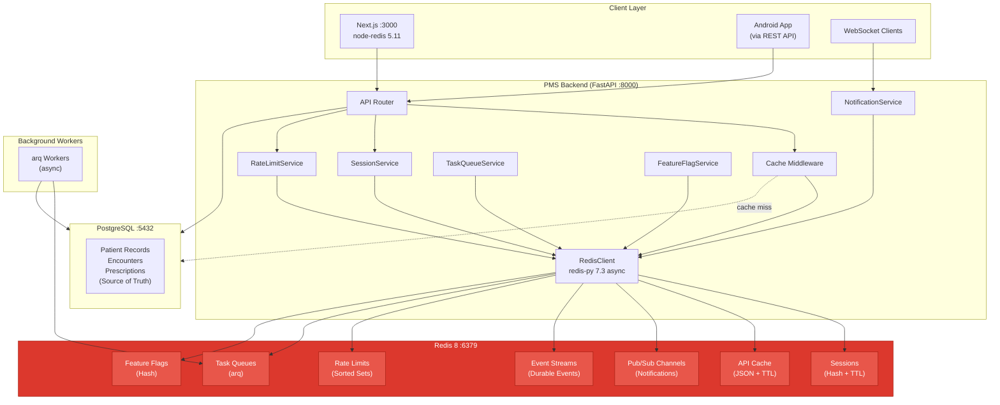

# Product Requirements Document: Redis Integration into Patient Management System (PMS)

**Document ID:** PRD-PMS-REDIS-001
**Version:** 1.0
**Date:** 2026-03-11
**Author:** Ammar (CEO, MPS Inc.)
**Status:** Draft

---

## 1. Executive Summary

Redis is an open-source, in-memory data store serving as a cache, message broker, and streaming engine. Redis 8 (current stable: 8.6.0, tri-licensed AGPLv3/RSALv2/SSPLv1) unifies previously separate modules — RediSearch, RedisJSON, RedisTimeSeries, and RedisBloom — into a single binary, providing sub-millisecond latency at 80,000–1,000,000+ operations per second. The `redis-py` 7.3.0 async client integrates natively with FastAPI's async request handlers, while `node-redis` 5.11.0 provides the Next.js frontend with direct cache access.

Integrating Redis into the PMS addresses four critical performance and scalability bottlenecks: (1) session management without PostgreSQL round-trips on every authenticated request, (2) API response caching for expensive queries like patient lists, appointment schedules, and medication catalogs, (3) real-time notifications via Pub/Sub and Streams for clinical alerts, encounter updates, and lab result notifications across all connected clients, and (4) background task queuing via `arq` for appointment reminders, FHIR bundle processing, report generation, and image analysis pipeline triggers.

Redis sits between the PMS application layer and PostgreSQL as a high-speed cache and message broker. PostgreSQL remains the authoritative source of truth for all patient data — Redis accelerates reads, decouples producers from consumers, and enables real-time event distribution without adding load to the primary database. By default, no raw PHI is stored in Redis; clinical identifiers and non-sensitive operational data flow through the cache layer, while PHI caching (when needed) requires TLS + ACLs + disk encryption + short TTLs.

## 2. Problem Statement

The PMS currently experiences several performance and architectural bottlenecks that Redis addresses:

- **Session validation overhead**: Every authenticated API request queries PostgreSQL to validate the user session, adding 2–5ms latency per request and generating thousands of redundant DB queries daily. With Redis, session tokens are validated in <1ms from memory.
- **Expensive query repetition**: Patient list queries, appointment schedules, and medication catalog lookups hit PostgreSQL repeatedly across users viewing the same data. A 500-patient clinic generates hundreds of identical queries per hour that could be served from cache.
- **No real-time updates**: When a provider updates a patient record, other connected clients (front desk, nurses, other providers) don't see changes until they manually refresh. There is no push mechanism — the PMS is entirely request-response. Redis Pub/Sub and Streams enable instant notification delivery.
- **Synchronous background tasks**: Long-running operations (report generation, FHIR bundle processing, batch eligibility verification, appointment reminder sending) block the FastAPI request thread. Redis-backed task queues (`arq`) offload these to async workers without blocking API responses.
- **Rate limiting gap**: The PMS has no centralized rate limiting for sensitive endpoints (login, PHI access, API calls to external services). Redis sorted sets provide atomic, distributed rate limiting with sliding window precision.
- **Cross-instance state**: When deploying multiple FastAPI workers (which is required for production), there is no shared state layer for WebSocket connection tracking, feature flags, or distributed locks. Redis provides this shared state with atomic operations.

## 3. Proposed Solution

### 3.1 Architecture Overview

### 3.2 Deployment Model

- **Docker-based**: `redis:8-alpine` image (~30MB) added to existing Docker Compose stack. No external services required for development.
- **Persistence**: Hybrid mode (AOF `everysec` + RDB snapshots) for production; RDB-only for development. Pure cache mode (no persistence) is acceptable since PostgreSQL is the source of truth.
- **Security envelope**: Password authentication (`requirepass`), ACLs for per-service permissions, TLS for production. Protected mode enabled by default blocks external connections.
- **HIPAA considerations**: No raw PHI in Redis by default. If PHI caching is required (e.g., patient name autocomplete), TLS + ACLs + filesystem-level disk encryption + short TTLs are mandatory. Redis OSS is not independently HIPAA-certified; compliance depends on the deployment configuration.
- **High availability**: Redis Sentinel for production (automatic failover). Redis Cluster only if data exceeds single-node memory.
- **Memory limit**: 256MB default (`maxmemory`), `allkeys-lru` eviction policy. Sufficient for a mid-size practice; scale to 1GB for large multi-provider clinics.

## 4. PMS Data Sources

Redis interacts with all PMS APIs as a caching and messaging layer:

- **Patient Records API (`/api/patients`)**: Cache patient list queries, patient detail lookups, and search results. Cache key pattern: `cache:patients:{query_hash}`. TTL: 30–60 seconds. Invalidate on patient create/update.
- **Encounter Records API (`/api/encounters`)**: Cache today's appointment schedule, encounter details for active visits. Publish encounter status changes via Pub/Sub for real-time UI updates. TTL: 15–30 seconds.
- **Medication & Prescription API (`/api/prescriptions`)**: Cache medication catalog (NDC codes, drug interactions) with longer TTL (5–15 minutes) since this data changes infrequently. Cache active prescriptions per patient with 60-second TTL.
- **Reporting API (`/api/reports`)**: Queue report generation as background tasks via arq. Cache completed report results with 5-minute TTL. Publish report completion events via Pub/Sub.

## 5. Component/Module Definitions

### 5.1 RedisClient

**Description**: Singleton async Redis client with connection pooling, health checks, and graceful shutdown.

- **Input**: Connection URL, pool size, TLS config
- **Output**: Shared `redis.asyncio.Redis` instance
- **PMS APIs used**: None (infrastructure component)
- **Key features**: Connection pool (20 max connections), automatic reconnection, health check on startup, graceful drain on shutdown

### 5.2 SessionService

**Description**: Redis-backed session management replacing PostgreSQL session lookups on every request.

- **Input**: Session token (from JWT or cookie)
- **Output**: User session data (user_id, role, clinic_id, permissions)
- **PMS APIs used**: `/api/auth` (session creation on login)
- **Key features**: Hash-based session storage, 30-minute sliding TTL, atomic session creation/invalidation, concurrent session limits per user

### 5.3 CacheMiddleware

**Description**: FastAPI middleware that intercepts GET requests and serves cached responses when available.

- **Input**: HTTP request (method, path, query params, auth context)
- **Output**: Cached HTTP response or pass-through to handler
- **PMS APIs used**: All read endpoints (`/api/patients`, `/api/encounters`, `/api/prescriptions`, `/api/reports`)
- **Key features**: Configurable TTL per endpoint, cache key generation from request fingerprint, automatic invalidation on write operations, cache bypass header (`X-No-Cache`), per-clinic cache isolation

### 5.4 NotificationService

**Description**: Real-time notification delivery using Redis Pub/Sub for ephemeral alerts and Streams for durable event logging.

- **Input**: Event type, payload, target (clinic/user/broadcast)
- **Output**: Published message on Pub/Sub channel or appended entry in Stream
- **PMS APIs used**: `/api/encounters` (status changes), `/api/patients` (record updates), `/api/prescriptions` (new prescriptions)
- **Key features**: Channel-per-clinic pattern, WebSocket bridge for frontend delivery, Stream consumer groups for reliable delivery, Android notification via REST polling of Stream

### 5.5 RateLimitService

**Description**: Distributed rate limiting using Redis sorted sets with sliding window algorithm.

- **Input**: User ID, endpoint, rate limit config (requests per window)
- **Output**: Allow/deny decision, remaining quota, retry-after header
- **PMS APIs used**: All endpoints (applied as FastAPI dependency)
- **Key features**: Sliding window precision, per-user and per-clinic limits, configurable limits per endpoint sensitivity (stricter for `/api/auth/login`, `/api/patients/{id}`), atomic check-and-increment

### 5.6 TaskQueueService

**Description**: Background task management using `arq` (async Redis queue) for long-running operations.

- **Input**: Task name, arguments, priority, scheduled time
- **Output**: Task ID, status, result (when complete)
- **PMS APIs used**: `/api/reports` (report generation), `/api/encounters` (batch operations), external APIs (pVerify, RingCentral, Xero)
- **Key features**: Async worker pool, task retry with exponential backoff, task scheduling (cron-like), result storage with TTL, dead letter queue for failed tasks

### 5.7 FeatureFlagService

**Description**: Fast feature flag evaluation from Redis Hash without database queries.

- **Input**: Flag name, evaluation context (clinic_id, user_id, role)
- **Output**: Boolean or variant value
- **PMS APIs used**: None (consumed by all services)
- **Key features**: Sub-millisecond flag evaluation, per-clinic overrides, gradual rollout percentages, admin API for flag management, synced from PostgreSQL on change

## 6. Non-Functional Requirements

### 6.1 Security and HIPAA Compliance

- **Authentication**: `requirepass` for all connections. Per-service ACL users (e.g., `pms-backend` can read/write all keys, `pms-frontend` can only read `cache:*` and `flags:*`).
- **Encryption in transit**: TLS 1.2+ for production deployments. Self-signed certs acceptable for development; CA-signed for production.
- **Encryption at rest**: Redis does not natively encrypt on-disk data. Use filesystem-level encryption (LUKS, dm-crypt) or managed service encryption for RDB/AOF files.
- **PHI isolation**: Default policy is no PHI in Redis. If PHI caching is enabled for specific use cases, keys must use short TTLs (<60s), and the PHI flag must be documented in the cache key pattern.
- **Audit logging**: All cache write operations logged at application level (not Redis level, as Redis lacks native audit logs). Rate limit violations logged with timestamp, user, endpoint.
- **Network isolation**: Redis bound to internal Docker network only. No public port exposure. Access restricted to PMS backend and frontend services.

### 6.2 Performance

- **Session validation**: < 1ms (vs 2–5ms with PostgreSQL)
- **Cache hit latency**: < 1ms
- **Cache miss penalty**: Same as current (DB query time) + ~0.5ms cache write
- **Pub/Sub message delivery**: < 5ms from publish to WebSocket client
- **Rate limit check**: < 1ms per request
- **Task enqueue**: < 1ms
- **Target cache hit ratio**: > 80% for patient list and schedule queries after warm-up
- **Memory usage**: < 256MB for a 500-patient clinic; < 1GB for 5,000-patient multi-provider

### 6.3 Infrastructure

- **Docker image**: `redis:8-alpine` (~30MB)
- **Port**: 6379 (internal only)
- **Memory**: 256MB–1GB allocated (configurable via `maxmemory`)
- **CPU**: Minimal (single-threaded command processing; I/O threads for networking)
- **Disk**: 50–200MB for persistence files (RDB + AOF)
- **Dependencies**: `redis>=7.3.0` (Python), `redis@^5.11.0` (Node.js), `arq>=0.26.0` (task queue)

## 7. Implementation Phases

### Phase 1: Foundation & Session Caching (Sprints 1-2)

- Add Redis to Docker Compose stack
- Implement `RedisClient` singleton with connection pooling and health checks
- Build `SessionService` replacing PostgreSQL session lookups
- Add Redis connection to FastAPI startup/shutdown lifecycle
- Configure `requirepass` and basic ACLs
- Add `redis-cli` health check to Docker Compose
- Write integration tests for session CRUD and TTL

### Phase 2: API Caching & Rate Limiting (Sprints 3-4)

- Implement `CacheMiddleware` for GET request caching
- Build cache invalidation triggers on write operations
- Implement `RateLimitService` with sliding window algorithm
- Add rate limiting to authentication and PHI access endpoints
- Implement `FeatureFlagService` for fast flag evaluation
- Build admin API for cache management (stats, flush, key inspection)
- Performance benchmarking: measure latency improvement and cache hit ratio

### Phase 3: Real-Time & Task Queues (Sprints 5-6)

- Implement `NotificationService` with Pub/Sub channels and Streams
- Build WebSocket bridge: Redis Pub/Sub → WebSocket → frontend clients
- Implement `TaskQueueService` with arq workers
- Migrate report generation, batch eligibility, and reminder sending to task queue
- Add Stream consumer groups for reliable event delivery
- Build notification UI in Next.js (toast alerts, badge counters)
- Production hardening: TLS, Sentinel HA, monitoring dashboards

## 8. Success Metrics

| Metric | Target | Measurement Method |
|--------|--------|--------------------|
| Session validation latency | < 1ms (from 2–5ms) | P50/P99 response time monitoring |
| API response time (cached) | 50% reduction for cached endpoints | Before/after latency comparison |
| Cache hit ratio | > 80% for high-traffic endpoints | Redis INFO stats (`keyspace_hits / total`) |
| Pub/Sub notification latency | < 5ms publish-to-client | End-to-end timing instrumentation |
| Rate limit accuracy | 100% enforcement, 0 false positives | Rate limit violation log analysis |
| Background task throughput | > 100 tasks/minute | arq worker metrics |
| Memory usage | < 256MB for 500-patient clinic | Redis INFO memory |
| Redis uptime | 99.9% | Docker health check monitoring |

## 9. Risks and Mitigations

| Risk | Impact | Mitigation |
|------|--------|------------|
| Redis down → cache unavailable | Degraded performance (fall through to DB) | Circuit breaker pattern: gracefully degrade to DB-only mode; Redis Sentinel for auto-failover |
| Memory exhaustion | Eviction of active cache entries, OOM | `maxmemory` limit with `allkeys-lru` policy; memory usage alerts at 80% |
| Stale cache serving outdated data | Clinical decisions based on stale info | Short TTLs (15–60s) + explicit invalidation on writes; `X-No-Cache` bypass for critical reads |
| PHI leakage into Redis | HIPAA violation | Default no-PHI policy; PHI keys require explicit opt-in with TLS + ACLs + short TTL; automated key pattern scanning |
| Single point of failure | Complete cache/session loss | Redis Sentinel with automatic failover; session regeneration from JWT on cache miss |
| Licensing change (AGPLv3 concerns) | Legal risk | Valkey (BSD-3 fork) is drop-in replacement; all clients are protocol-compatible |
| Connection pool exhaustion | Request failures under high load | Pool size monitoring, blocking pool option, connection timeout alerts |

## 10. Dependencies

- **Redis 8**: `redis:8-alpine` Docker image — in-memory data store
- **redis-py**: `>=7.3.0` — Async Python client for FastAPI backend
- **node-redis**: `>=5.11.0` — Node.js client for Next.js frontend
- **arq**: `>=0.26.0` — Async task queue library for background workers
- **PMS Backend**: FastAPI service on port 8000
- **PMS Frontend**: Next.js app on port 3000
- **PostgreSQL**: Primary data store on port 5432 (source of truth)
- **Docker Compose**: Orchestration for Redis container alongside existing services

## 11. Comparison with Existing Experiments

| Aspect | Redis (Exp 76) | WebSocket (Exp 37) | Xero (Exp 75) | pVerify (Exp 73) |
|--------|---------------|-------------------|---------------|-----------------|
| **Purpose** | Caching, messaging, task queues | Real-time bidirectional communication | Cloud accounting integration | Eligibility verification |
| **Layer** | Infrastructure (cache/broker) | Transport (WebSocket protocol) | Application (financial API) | Application (insurance API) |
| **Relationship** | Redis Pub/Sub powers WebSocket broadcast | Consumes Redis Pub/Sub events | Xero API calls can be queued via Redis arq | pVerify batch verification queued via Redis arq |
| **Data flow** | All services → Redis → all services | Backend ↔ Frontend (bidirectional) | PMS → Xero (de-identified) | PMS ← pVerify |
| **PHI** | No PHI by default (cache layer) | PHI in messages (access controlled) | Zero PHI (no BAA) | PHI required (has BAA) |

Redis is a **horizontal infrastructure layer** that enhances every other experiment: it provides the Pub/Sub backbone for WebSocket (Exp 37), caches FHIR resources from NextGen (Exp 46), queues batch eligibility checks for pVerify (Exp 73) and FrontRunnerHC (Exp 74), and queues invoice creation for Xero (Exp 75). It does not replace any existing integration — it accelerates all of them.

## 12. Research Sources

### Official Documentation
- [Redis Documentation](https://redis.io/docs/latest/) — Complete reference for all Redis features and configuration
- [Redis GitHub Repository](https://github.com/redis/redis) — Source code, issues, and release notes
- [Redis 8 GA Announcement](https://redis.io/blog/redis-8-ga/) — Unified modules, performance improvements, new features

### Client Libraries
- [redis-py Documentation](https://redis.readthedocs.io/en/stable/) — Python async client reference and examples
- [redis-py on PyPI](https://pypi.org/project/redis/) — Package metadata, version history
- [node-redis on npm](https://www.npmjs.com/package/redis) — Node.js client for Next.js integration
- [Redis + FastAPI Tutorial](https://redis.io/learn/develop/python/fastapi) — Official integration guide

### Security & Compliance
- [Redis Security Documentation](https://redis.io/docs/latest/operate/oss_and_stack/management/security/) — ACLs, TLS, authentication configuration
- [AWS ElastiCache HIPAA Eligibility](https://aws.amazon.com/blogs/security/now-you-can-use-amazon-elasticache-for-redis-a-hipaa-eligible-service-to-power-real-time-healthcare-applications/) — HIPAA-eligible managed Redis configuration
- [Redis Enterprise Compliance](https://redis.io/blog/securing-redis-with-redis-enterprise-for-compliance-requirements/) — Enterprise compliance tooling for HIPAA, PCI-DSS

### Ecosystem & Licensing
- [Redis Licensing](https://redis.io/legal/licenses/) — Tri-license details (AGPLv3/RSALv2/SSPLv1)
- [Redis AGPLv3 Announcement](https://redis.io/blog/agplv3/) — Rationale for adding AGPLv3 option

## 13. Appendix: Related Documents

- [Redis Setup Guide](76-Redis-PMS-Developer-Setup-Guide.md)
- [Redis Developer Tutorial](76-Redis-Developer-Tutorial.md)
- [WebSocket PRD (Exp 37)](37-PRD-WebSocket-PMS-Integration.md) — Real-time communication using Redis Pub/Sub
- [Xero PRD (Exp 75)](75-PRD-XeroAPI-PMS-Integration.md) — Cloud accounting (tasks queued via Redis)
- [pVerify PRD (Exp 73)](73-PRD-pVerify-PMS-Integration.md) — Eligibility verification (batch queued via Redis)
- [Redis Official Documentation](https://redis.io/docs/latest/)
