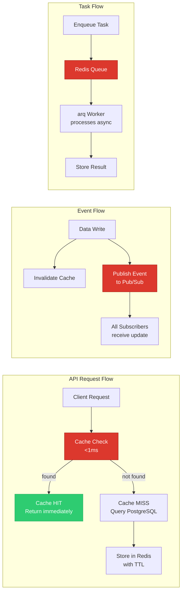
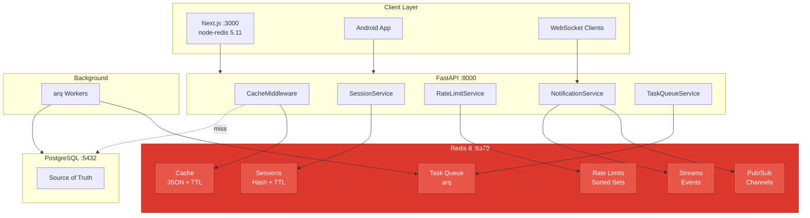

# Redis Developer Onboarding Tutorial

**Welcome to the MPS PMS Redis Integration Team**

This tutorial will take you from zero to building your first Redis integration with the PMS. By the end, you will understand how Redis works as a cache and message broker, have a running local environment, and have built session caching, API response caching, real-time notifications, and a background task queue end-to-end.

**Document ID:** PMS-EXP-REDIS-002
**Version:** 1.0
**Date:** 2026-03-11
**Applies To:** PMS project (all platforms)
**Prerequisite:** [Redis Setup Guide](76-Redis-PMS-Developer-Setup-Guide.md)
**Estimated time:** 2-3 hours
**Difficulty:** Beginner-friendly

---

## What You Will Learn

1. How Redis works as an in-memory data store and why it's orders of magnitude faster than PostgreSQL for read-heavy operations
2. How Redis data structures (Strings, Hashes, Sorted Sets, Pub/Sub, Streams) map to PMS use cases
3. How to use `redis-py` async client with FastAPI's event loop
4. How to build session caching that validates logins in <1ms
5. How to build API response caching with automatic invalidation on writes
6. How to implement sliding window rate limiting for login and PHI endpoints
7. How to use Pub/Sub for real-time clinical notifications (encounter updates, lab results)
8. How to set up arq background tasks for report generation and batch operations
9. How to monitor Redis performance and optimize cache hit ratios
10. How Redis fits into the PMS stack alongside PostgreSQL, WebSocket, and external integrations

## Part 1: Understanding Redis (15 min read)

### 1.1 What Problem Does Redis Solve?

Every time a front desk staff member opens the patient list, the PMS queries PostgreSQL. Every time a provider views today's schedule, another query. Every time a nurse checks medication details, another query. For a 500-patient clinic with 10 concurrent users, this generates hundreds of identical queries per hour — each taking 2-10ms for the database round-trip.

Redis sits in front of PostgreSQL as a high-speed cache. The first request hits the database; subsequent identical requests are served from Redis memory in <1ms. For a busy clinic, this reduces database load by 60-80% and makes the application feel instantaneous.

But Redis does more than caching: it provides real-time messaging (Pub/Sub), durable event streams, distributed rate limiting, and background task queuing — all features that PostgreSQL can do, but not at Redis speeds or with Redis-level simplicity.

### 1.2 How Redis Works — The Key Pieces



**Concept 1: Cache-Aside Pattern** — The application checks Redis first. On a hit, it returns the cached data instantly. On a miss, it queries PostgreSQL, stores the result in Redis with a TTL, and returns it. Writes invalidate the cache so the next read gets fresh data.

**Concept 2: Pub/Sub Messaging** — When a provider updates an encounter, the backend publishes an event to a Redis channel. All connected clients subscribed to that channel receive the update instantly — no polling required.

**Concept 3: Task Queuing** — Long-running operations (report generation, batch verification, reminder sending) are enqueued in Redis and processed by background workers. The API returns immediately with a task ID; the client polls or subscribes for completion.

### 1.3 How Redis Fits with Other PMS Technologies

| Technology | Relationship to Redis |
|-----------|----------------------|
| PostgreSQL :5432 | Source of truth — Redis caches reads, PostgreSQL stores writes |
| WebSocket (Exp 37) | Redis Pub/Sub powers WebSocket broadcast across multiple FastAPI workers |
| pVerify (Exp 73) | Batch eligibility checks enqueued as arq tasks via Redis |
| FrontRunnerHC (Exp 74) | Insurance discovery results cached in Redis for fast re-lookup |
| Xero (Exp 75) | Invoice creation batch jobs enqueued via Redis arq |
| RingCentral (Exp 71) | SMS/call reminders enqueued as background tasks via Redis |
| Sanford Guide (Exp 11) | Drug interaction lookups cached in Redis |

### 1.4 Key Vocabulary

| Term | Meaning |
|------|---------|
| **Key** | A unique identifier for a value in Redis (like a variable name). Pattern: `type:entity:id` |
| **TTL** | Time To Live — seconds until a key expires and is automatically deleted |
| **Hash** | A map of field-value pairs under a single key (like a Python dict) |
| **Sorted Set** | A set where each member has a score, kept sorted by score (used for rate limiting) |
| **Pub/Sub** | Publish/Subscribe — fire-and-forget messaging pattern for real-time events |
| **Stream** | An append-only log (like Kafka) — durable, with consumer groups for reliable delivery |
| **Pipeline** | Batch multiple Redis commands in one round-trip for higher throughput |
| **Connection Pool** | Pre-opened TCP connections reused across requests (avoids per-request connection overhead) |
| **LRU Eviction** | Least Recently Used — when memory is full, Redis deletes the oldest unused keys |
| **arq** | Async Redis Queue — Python library for background task processing, native asyncio |
| **Sentinel** | Redis high-availability system that monitors masters and promotes replicas on failure |

### 1.5 Our Architecture



## Part 2: Environment Verification (15 min)

### 2.1 Checklist

1. **Redis running**:
   ```bash
   docker exec pms-redis redis-cli -a "$REDIS_PASSWORD" ping
   # Expected: PONG
   ```

2. **Redis version**:
   ```bash
   docker exec pms-redis redis-cli -a "$REDIS_PASSWORD" info server | grep redis_version
   # Expected: redis_version:8.x.x
   ```

3. **PMS Backend**:
   ```bash
   curl -s http://localhost:8000/api/redis/health | jq .
   # Expected: {"status": "healthy", ...}
   ```

4. **Python client installed**:
   ```bash
   python -c "import redis; print(redis.__version__)"
   # Expected: 7.3.0+
   ```

5. **Node.js client installed**:
   ```bash
   cd pms-frontend && node -e "console.log(require('redis/package.json').version)"
   # Expected: 5.11.0+
   ```

### 2.2 Quick Test

```bash
# Set and get a test value
docker exec pms-redis redis-cli -a "$REDIS_PASSWORD" set test:hello "world" EX 10
docker exec pms-redis redis-cli -a "$REDIS_PASSWORD" get test:hello
# Expected: "world"

# Wait 10 seconds, try again
sleep 11
docker exec pms-redis redis-cli -a "$REDIS_PASSWORD" get test:hello
# Expected: (nil) — TTL expired
```

## Part 3: Build Your First Integration (45 min)

### 3.1 What We Are Building

A complete patient lookup caching pipeline:

1. First request → query PostgreSQL → store result in Redis → return to client
2. Subsequent requests → return from Redis in <1ms
3. When a patient is updated → invalidate cache → next read gets fresh data
4. Publish notification when a patient record changes

### 3.2 Step 1 — Direct Redis Operations

```python
# test_redis_basics.py
import asyncio
import redis.asyncio as aioredis
import json
import time


async def main():
    r = aioredis.from_url("redis://localhost:6379", password="your_password", decode_responses=True)

    # 1. String: simple cache
    await r.set("test:patient:name", "Jane Smith", ex=60)
    name = await r.get("test:patient:name")
    print(f"String: {name}")

    # 2. Hash: session data
    await r.hset("test:session:abc123", mapping={
        "user_id": "doc-001",
        "role": "provider",
        "clinic_id": "clinic-austin",
    })
    await r.expire("test:session:abc123", 1800)
    session = await r.hgetall("test:session:abc123")
    print(f"Hash: {session}")

    # 3. Sorted Set: rate limiting
    now = time.time()
    await r.zadd("test:ratelimit:login:user1", {str(now): now})
    count = await r.zcard("test:ratelimit:login:user1")
    print(f"Sorted Set count: {count}")

    # 4. JSON: complex object (Redis 8 native)
    patient = {"id": "p-001", "name": "Jane Smith", "encounters": [{"date": "2026-03-11", "type": "office_visit"}]}
    await r.json().set("test:patient:p-001", "$", patient)
    result = await r.json().get("test:patient:p-001", "$.name")
    print(f"JSON: {result}")

    # 5. Performance comparison
    start = time.monotonic()
    for _ in range(1000):
        await r.get("test:patient:name")
    elapsed = (time.monotonic() - start) * 1000
    print(f"1000 GETs: {elapsed:.1f}ms ({elapsed/1000:.3f}ms per op)")

    # Cleanup
    async for key in r.scan_iter("test:*"):
        await r.delete(key)

    await r.aclose()


asyncio.run(main())
```

**Expected output**:
```
String: Jane Smith
Hash: {'user_id': 'doc-001', 'role': 'provider', 'clinic_id': 'clinic-austin'}
Sorted Set count: 1
JSON: ['Jane Smith']
1000 GETs: 85.3ms (0.085ms per op)
```

### 3.3 Step 2 — Cache-Aside Pattern for Patient Lookups

```python
# test_cache_aside.py
import asyncio
import redis.asyncio as aioredis
import json
import time


# Simulated database query (normally hits PostgreSQL)
async def db_get_patient(patient_id: str) -> dict:
    await asyncio.sleep(0.005)  # Simulate 5ms DB latency
    return {
        "id": patient_id,
        "first_name": "Jane",
        "last_name": "Smith",
        "dob": "1985-06-15",
        "clinic_id": "clinic-austin",
    }


async def get_patient_cached(r: aioredis.Redis, patient_id: str) -> dict:
    """Cache-aside: check Redis first, fall back to DB."""
    cache_key = f"cache:patient:{patient_id}"

    # Check cache
    cached = await r.get(cache_key)
    if cached:
        return {**json.loads(cached), "_cache": "HIT"}

    # Cache miss — query DB
    patient = await db_get_patient(patient_id)

    # Store in cache with 30s TTL
    await r.setex(cache_key, 30, json.dumps(patient))

    return {**patient, "_cache": "MISS"}


async def main():
    r = aioredis.from_url("redis://localhost:6379", password="your_password", decode_responses=True)

    # First call: cache MISS (~5ms)
    start = time.monotonic()
    result = await get_patient_cached(r, "p-001")
    t1 = (time.monotonic() - start) * 1000
    print(f"Call 1: {result['_cache']} — {t1:.1f}ms")

    # Second call: cache HIT (<1ms)
    start = time.monotonic()
    result = await get_patient_cached(r, "p-001")
    t2 = (time.monotonic() - start) * 1000
    print(f"Call 2: {result['_cache']} — {t2:.1f}ms")

    # Speedup
    print(f"Speedup: {t1/t2:.0f}x faster on cache hit")

    # Invalidate on write
    await r.delete("cache:patient:p-001")
    print("Cache invalidated")

    # Third call: cache MISS again
    start = time.monotonic()
    result = await get_patient_cached(r, "p-001")
    t3 = (time.monotonic() - start) * 1000
    print(f"Call 3: {result['_cache']} — {t3:.1f}ms")

    await r.aclose()


asyncio.run(main())
```

**Expected output**:
```
Call 1: MISS — 6.2ms
Call 2: HIT — 0.3ms
Speedup: 21x faster on cache hit
Cache invalidated
Call 3: MISS — 5.8ms
```

### 3.4 Step 3 — Pub/Sub Notifications

```python
# test_pubsub.py
import asyncio
import redis.asyncio as aioredis
import json


async def subscriber(r: aioredis.Redis, clinic_id: str):
    """Listen for real-time notifications."""
    pubsub = r.pubsub()
    await pubsub.subscribe(f"notifications:{clinic_id}")
    print(f"Subscribed to notifications:{clinic_id}")

    count = 0
    async for message in pubsub.listen():
        if message["type"] == "message":
            event = json.loads(message["data"])
            print(f"  Received: {event['event_type']} — {event['payload']}")
            count += 1
            if count >= 3:
                break

    await pubsub.unsubscribe()
    await pubsub.aclose()


async def publisher(r: aioredis.Redis, clinic_id: str):
    """Simulate PMS events."""
    await asyncio.sleep(0.5)  # Wait for subscriber to connect

    events = [
        ("encounter.updated", {"encounter_id": "enc-001", "status": "in_progress"}),
        ("lab.result_ready", {"patient_id": "p-001", "test": "CBC", "status": "completed"}),
        ("appointment.checked_in", {"patient_id": "p-002", "time": "10:30 AM"}),
    ]

    for event_type, payload in events:
        message = json.dumps({
            "event_type": event_type,
            "payload": payload,
            "timestamp": "2026-03-11T14:30:00Z",
        })
        await r.publish(f"notifications:{clinic_id}", message)
        print(f"Published: {event_type}")
        await asyncio.sleep(0.2)


async def main():
    r = aioredis.from_url("redis://localhost:6379", password="your_password", decode_responses=True)

    await asyncio.gather(
        subscriber(r, "clinic-austin"),
        publisher(r, "clinic-austin"),
    )

    await r.aclose()


asyncio.run(main())
```

**Expected output**:
```
Subscribed to notifications:clinic-austin
Published: encounter.updated
  Received: encounter.updated — {'encounter_id': 'enc-001', 'status': 'in_progress'}
Published: lab.result_ready
  Received: lab.result_ready — {'patient_id': 'p-001', 'test': 'CBC', 'status': 'completed'}
Published: appointment.checked_in
  Received: appointment.checked_in — {'patient_id': 'p-002', 'time': '10:30 AM'}
```

### 3.5 Step 4 — Rate Limiting

```python
# test_rate_limit.py
import asyncio
import redis.asyncio as aioredis
import time


async def check_rate_limit(
    r: aioredis.Redis, user_id: str, endpoint: str,
    max_requests: int = 5, window_seconds: int = 10,
) -> tuple[bool, int]:
    """Sliding window rate limiter. Returns (allowed, remaining)."""
    key = f"ratelimit:{user_id}:{endpoint}"
    now = time.time()
    window_start = now - window_seconds

    pipe = r.pipeline()
    pipe.zremrangebyscore(key, 0, window_start)
    pipe.zadd(key, {str(now): now})
    pipe.zcard(key)
    pipe.expire(key, window_seconds)
    results = await pipe.execute()

    current_count = results[2]
    remaining = max(0, max_requests - current_count)
    allowed = current_count <= max_requests

    return allowed, remaining


async def main():
    r = aioredis.from_url("redis://localhost:6379", password="your_password", decode_responses=True)

    print("Simulating 7 login attempts (limit: 5 per 10s):")
    for i in range(7):
        allowed, remaining = await check_rate_limit(r, "user-001", "/api/auth/login")
        status = "ALLOWED" if allowed else "BLOCKED (429)"
        print(f"  Attempt {i+1}: {status} — {remaining} remaining")

    # Cleanup
    await r.delete("ratelimit:user-001:/api/auth/login")
    await r.aclose()


asyncio.run(main())
```

**Expected output**:
```
Simulating 7 login attempts (limit: 5 per 10s):
  Attempt 1: ALLOWED — 4 remaining
  Attempt 2: ALLOWED — 3 remaining
  Attempt 3: ALLOWED — 2 remaining
  Attempt 4: ALLOWED — 1 remaining
  Attempt 5: ALLOWED — 0 remaining
  Attempt 6: BLOCKED (429) — 0 remaining
  Attempt 7: BLOCKED (429) — 0 remaining
```

## Part 4: Evaluating Strengths and Weaknesses (15 min)

### 4.1 Strengths

- **Sub-millisecond latency**: 0.1-0.5ms per operation — orders of magnitude faster than any database query
- **Rich data structures**: Hashes, Sorted Sets, Streams, JSON — each purpose-built for common patterns (sessions, rate limiting, events, caching)
- **Battle-tested**: 15+ years, used by Twitter, GitHub, Stack Overflow, Snap, and major healthcare platforms
- **Native async**: `redis-py` 7.3.0 uses asyncio natively — perfect for FastAPI
- **Unified in Redis 8**: Search, JSON, TimeSeries, and probabilistic data structures built-in — no separate modules
- **Simple operations**: Single-command atomicity (no transactions needed for most ops)

### 4.2 Weaknesses

- **Memory-bound**: All data in RAM. 256MB of Redis ≈ a few million cached keys. Large datasets require careful TTL management.
- **No native encryption at rest**: Must use filesystem-level encryption (LUKS, dm-crypt) for persistent data
- **Single-threaded command processing**: Complex Lua scripts or large KEYS scans can block all other operations
- **No native audit logging**: Must implement application-level logging for HIPAA compliance
- **Licensing complexity**: Tri-license (AGPLv3/RSALv2/SSPLv1) requires understanding which applies to your use case
- **Cache invalidation**: "There are only two hard things in computer science: cache invalidation and naming things" — invalidation must be carefully designed to avoid stale data

### 4.3 When to Use Redis vs Alternatives

| Scenario | Redis | PostgreSQL | Valkey | Memcached |
|----------|-------|-----------|--------|-----------|
| Session storage | Yes (Hash + TTL) | No (too slow) | Yes (drop-in) | Yes (simple) |
| API response cache | Yes (JSON + TTL) | No | Yes | Yes (strings only) |
| Rate limiting | Yes (Sorted Sets) | No | Yes | No (no sorted sets) |
| Real-time notifications | Yes (Pub/Sub + Streams) | Limited (LISTEN/NOTIFY) | Yes | No |
| Background task queue | Yes (arq/Celery) | Possible (pg-boss) | Yes | No |
| Full-text search | Yes (built-in Query Engine) | Yes (tsvector) | No | No |
| Time series data | Yes (built-in) | Yes (TimescaleDB) | No | No |
| Licensing concern | AGPLv3 | PostgreSQL License | BSD-3 | BSD |

### 4.4 HIPAA / Healthcare Considerations

1. **Default no-PHI policy**: Redis caches non-PHI data by default — session tokens, rate limits, feature flags, anonymized IDs. This avoids HIPAA scope entirely for the cache layer.

2. **If PHI caching is needed** (e.g., patient name autocomplete for fast search):
   - TLS required for all connections
   - ACLs restrict which services can access PHI key patterns
   - Short TTLs (<60 seconds) limit PHI exposure window
   - Filesystem-level disk encryption for RDB/AOF files
   - Application-level audit logging for all PHI cache reads

3. **No BAA from Redis Ltd.**: Redis OSS is self-hosted — your HIPAA BAA is with your infrastructure provider (AWS, Azure, etc.), not Redis. Managed services like AWS ElastiCache are HIPAA-eligible.

4. **Key naming convention**: PHI-containing keys must use `phi:` prefix for automated scanning and policy enforcement: `phi:patient:name:p-001` vs `cache:patient:schedule:p-001`.

## Part 5: Debugging Common Issues (15 min read)

### Issue 1: "WRONGTYPE Operation against a key holding the wrong kind of value"

**Symptom**: Redis returns WRONGTYPE error on a GET/SET operation.
**Cause**: You're using a string command on a hash key (or vice versa). Redis keys have types — a key created as a Hash cannot be read with GET.
**Fix**: Use `TYPE key` to check the key type, then use the correct command family (HGET for hashes, GET for strings, etc.).

### Issue 2: Cache Hit Ratio Below 50%

**Symptom**: Redis stats show more misses than hits.
**Cause**: TTLs too short, keys evicted by LRU too aggressively, or cache keys not being reused (bad key generation).
**Fix**:
```bash
docker exec pms-redis redis-cli -a "$REDIS_PASSWORD" info stats | grep keyspace
```
Increase TTLs, increase `maxmemory`, or review cache key patterns to ensure cache reuse.

### Issue 3: Redis Memory Growing Unbounded

**Symptom**: `used_memory` keeps climbing even though keys have TTLs.
**Cause**: Keys are being created faster than they expire. Common with rate limiting sorted sets that aren't being cleaned.
**Fix**: Ensure `maxmemory-policy allkeys-lru` is set. Add explicit ZREMRANGEBYSCORE calls to clean rate limit windows.

### Issue 4: Pub/Sub Messages Lost

**Symptom**: Subscriber misses events that were published while it was disconnected.
**Cause**: Pub/Sub is fire-and-forget — if no subscriber is listening, the message is lost.
**Fix**: Use Redis Streams instead of Pub/Sub for events that must be delivered reliably. Streams persist events and support consumer groups for at-least-once delivery.

### Issue 5: Connection Pool Exhausted

**Symptom**: `redis.exceptions.ConnectionError: Too many connections`
**Cause**: More concurrent requests than `max_connections` in the pool. Each awaiting coroutine holds a connection.
**Fix**: Increase `max_connections` (default 20 → 50), use `BlockingConnectionPool` to wait instead of erroring, or ensure connections are released promptly (avoid holding Redis connections across `await` boundaries).

## Part 6: Practice Exercises (45 min)

### Option A: Build a Medication Catalog Cache

Build a caching layer for the medication catalog (`/api/prescriptions/catalog`) that:
1. Caches the full catalog in Redis JSON with 15-minute TTL
2. Supports JSONPath queries for drug name search (`$.medications[?(@.name =~ /aspirin/i)]`)
3. Invalidates cache when catalog is updated
4. Tracks cache hit/miss ratio in a Redis counter

**Hints**: Use `r.json().set()` for storage, `r.json().get()` with JSONPath for queries, `r.incr("stats:cache:hit")` for counters.

### Option B: Build a Real-Time Encounter Collaboration

Build a presence system that shows which providers are currently viewing a patient encounter:
1. When a provider opens an encounter, add them to a Redis Set (`encounter:viewers:{enc_id}`)
2. Use TTL or sorted sets with timestamps for automatic cleanup on disconnect
3. Publish viewer changes via Pub/Sub so all clients update in real-time
4. Show a "Dr. Smith is also viewing this encounter" indicator

**Hints**: Use `SADD/SREM` for viewer sets, `PUBLISH` for change notifications, poll with `SMEMBERS` or subscribe via Pub/Sub.

### Option C: Build an Appointment Reminder Queue

Build a background task pipeline that:
1. Accepts a list of tomorrow's appointments via API
2. Enqueues each as an arq task to send an SMS reminder via RingCentral (Exp 71)
3. Tracks progress in a Redis Stream (sent, failed, pending)
4. Provides an API endpoint to check batch progress

**Hints**: Use arq's `enqueue_job()` for task creation, Redis Streams for progress tracking, `XLEN` for counting.

## Part 7: Development Workflow and Conventions

### 7.1 File Organization

```
pms-backend/
├── app/
│   ├── core/
│   │   └── redis.py              # RedisClient singleton
│   ├── middleware/
│   │   └── cache.py              # CacheMiddleware
│   ├── services/
│   │   ├── session_service.py    # Session management
│   │   ├── rate_limit_service.py # Rate limiting
│   │   └── notification_service.py # Pub/Sub + Streams
│   ├── workers/
│   │   └── arq_worker.py         # Background task definitions
│   └── api/
│       └── routes/
│           └── redis_admin.py    # Health, stats, cache flush
│
pms-frontend/
├── src/
│   ├── lib/
│   │   └── redis.ts              # Node.js Redis client
│   └── hooks/
│       └── useNotifications.ts   # SSE notification hook
│
config/
└── redis.conf                    # Redis server configuration
```

### 7.2 Naming Conventions

| Item | Convention | Example |
|------|-----------|---------|
| Cache key | `cache:{entity}:{id_or_hash}` | `cache:patient:p-001`, `cache:api:a3f2b1` |
| Session key | `session:{session_id}` | `session:abc123def456` |
| Rate limit key | `ratelimit:{user}:{endpoint}` | `ratelimit:doc-001:/api/patients` |
| Pub/Sub channel | `notifications:{clinic}` | `notifications:clinic-austin` |
| Stream | `events:{clinic}` | `events:clinic-austin` |
| Feature flag | `flags:{flag_name}` | `flags:new_encounter_ui` |
| PHI key (if allowed) | `phi:{entity}:{id}` | `phi:patient:name:p-001` |
| Task queue | Managed by arq | `arq:queue`, `arq:job:{id}` |

### 7.3 PR Checklist

- [ ] All Redis keys have explicit TTLs (no unbounded keys except feature flags)
- [ ] Cache invalidation tested — write operations clear related cache keys
- [ ] No PHI in Redis keys/values unless explicitly documented and encrypted
- [ ] Connection pool not exhausted under load (check `max_connections`)
- [ ] Graceful degradation tested — app works when Redis is down (falls through to DB)
- [ ] Rate limit configuration reviewed for new endpoints
- [ ] `redis-cli MONITOR` used during development to verify key patterns
- [ ] No `KEYS *` commands in production code (use `SCAN` instead)

### 7.4 Security Reminders

1. **Never expose Redis port (6379) publicly** — bind to internal Docker network only
2. **Always use authentication** — `requirepass` is mandatory, even in development
3. **Use ACLs in production** — restrict each service to its key patterns
4. **PHI keys use `phi:` prefix** — enables automated scanning and policy enforcement
5. **Short TTLs for sensitive data** — sessions: 30min, cache: 30-300s, rate limits: auto-expire
6. **Disable dangerous commands** — `FLUSHALL`, `FLUSHDB`, `DEBUG` renamed in redis.conf

## Part 8: Quick Reference Card

### Key Commands

```bash
# Connection
docker exec pms-redis redis-cli -a "$REDIS_PASSWORD"

# Health
redis-cli PING                          # → PONG
redis-cli INFO memory                   # Memory stats
redis-cli INFO stats                    # Hit/miss ratio

# Cache operations
redis-cli GET cache:patient:p-001       # Read cache
redis-cli DEL cache:patient:p-001       # Invalidate
redis-cli KEYS "cache:*"               # List cache keys (dev only)
redis-cli SCAN 0 MATCH "cache:*"       # Production-safe key scan

# Session
redis-cli HGETALL session:abc123        # View session
redis-cli TTL session:abc123            # Check remaining TTL

# Monitoring
redis-cli MONITOR                       # Real-time command stream
redis-cli SLOWLOG GET 10                # Slow commands
redis-cli DBSIZE                        # Total key count
redis-cli MEMORY USAGE key              # Memory per key
```

### Key Files

| File | Purpose |
|------|---------|
| `config/redis.conf` | Redis server configuration |
| `app/core/redis.py` | RedisClient singleton with pool |
| `app/middleware/cache.py` | API response caching |
| `app/services/session_service.py` | Session management |
| `app/services/rate_limit_service.py` | Sliding window rate limiter |
| `app/services/notification_service.py` | Pub/Sub + Streams |
| `app/workers/arq_worker.py` | Background task definitions |

### Key URLs

| URL | Description |
|-----|-------------|
| http://localhost:8000/api/redis/health | Redis health check |
| http://localhost:8000/api/redis/stats | Redis statistics |
| https://redis.io/commands/ | Command reference |
| https://redis.io/docs/latest/ | Full documentation |

## Next Steps

1. **Enable TLS**: Configure Redis TLS for production per the [Setup Guide](76-Redis-PMS-Developer-Setup-Guide.md) security section
2. **Set up Sentinel**: Add Redis Sentinel for high availability and automatic failover
3. **Integrate with WebSocket (Exp 37)**: Bridge Redis Pub/Sub to WebSocket for real-time clinical UI updates
4. **Configure arq scheduled tasks**: Set up cron-like scheduling for appointment reminders and batch jobs
5. **Review the [PRD](76-PRD-Redis-PMS-Integration.md)** for the full Phase 2 and Phase 3 implementation roadmap
