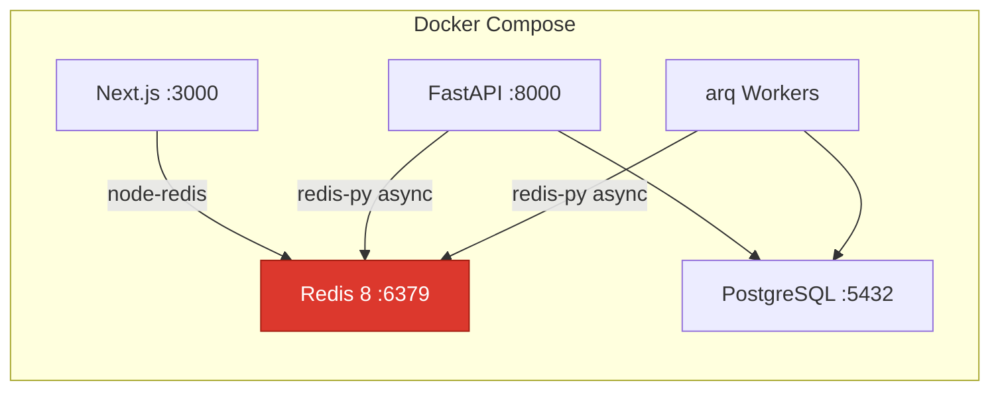

# Redis Setup Guide for PMS Integration

**Document ID:** PMS-EXP-REDIS-001
**Version:** 1.0
**Date:** 2026-03-11
**Applies To:** PMS project (all platforms)
**Prerequisites Level:** Beginner

---

## Table of Contents

1. [Overview](#1-overview)
2. [Prerequisites](#2-prerequisites)
3. [Part A: Install and Configure Redis](#3-part-a-install-and-configure-redis)
4. [Part B: Integrate with PMS Backend](#4-part-b-integrate-with-pms-backend)
5. [Part C: Integrate with PMS Frontend](#5-part-c-integrate-with-pms-frontend)
6. [Part D: Testing and Verification](#6-part-d-testing-and-verification)
7. [Troubleshooting](#7-troubleshooting)
8. [Reference Commands](#8-reference-commands)
9. [Next Steps](#9-next-steps)
10. [Resources](#10-resources)

---

## 1. Overview

This guide adds Redis 8 to the PMS Docker stack and integrates it with both the FastAPI backend and Next.js frontend. By the end, you will have:

- Redis 8 running in Docker with password auth and persistence
- A Python `RedisClient` singleton with async connection pooling
- Session caching service replacing PostgreSQL session lookups
- API response cache middleware for GET endpoints
- Rate limiting service for sensitive endpoints
- Real-time notification service using Pub/Sub
- Background task queue using `arq`
- Node.js Redis client for Next.js server-side caching
- Health checks and monitoring



## 2. Prerequisites

### 2.1 Required Software

| Software | Minimum Version | Check Command |
|----------|----------------|---------------|
| Docker | 24+ | `docker --version` |
| Docker Compose | 2.20+ | `docker compose version` |
| Python | 3.11+ | `python --version` |
| Node.js | 18+ | `node --version` |
| PostgreSQL | 15+ | `psql --version` |

### 2.2 Installation of Prerequisites

```bash
# Install Redis Python client and task queue
pip install "redis>=7.3.0" "arq>=0.26.0"

# Install Redis Node.js client
cd pms-frontend && npm install redis@^5.11.0
```

### 2.3 Verify PMS Services

```bash
# Backend
curl -s http://localhost:8000/health | jq .status
# Expected: "healthy"

# Frontend
curl -s -o /dev/null -w "%{http_code}" http://localhost:3000
# Expected: 200

# PostgreSQL
psql -U pms -d pms_db -c "SELECT 1;"
# Expected: 1
```

**Checkpoint**: All PMS services running, Python and Node.js Redis clients installed.

## 3. Part A: Install and Configure Redis

### Step 1: Add Redis to Docker Compose

Add to `docker-compose.yml`:

```yaml
services:
  # ... existing services ...

  redis:
    image: redis:8-alpine
    container_name: pms-redis
    ports:
      - "6379:6379"
    volumes:
      - redis-data:/data
      - ./config/redis.conf:/usr/local/etc/redis/redis.conf:ro
    command: redis-server /usr/local/etc/redis/redis.conf
    restart: unless-stopped
    healthcheck:
      test: ["CMD", "redis-cli", "-a", "${REDIS_PASSWORD}", "ping"]
      interval: 10s
      timeout: 5s
      retries: 3
    environment:
      - REDIS_PASSWORD=${REDIS_PASSWORD}
    networks:
      - pms-network

volumes:
  redis-data:
```

### Step 2: Create Redis Configuration

Create `config/redis.conf`:

```conf
# Authentication
requirepass ${REDIS_PASSWORD}

# Persistence (hybrid mode)
save 900 1
save 300 10
save 60 10000
appendonly yes
appendfsync everysec

# Memory management
maxmemory 256mb
maxmemory-policy allkeys-lru

# Network
bind 0.0.0.0
protected-mode yes
port 6379

# Logging
loglevel notice

# Performance
tcp-backlog 511
tcp-keepalive 300

# Disable dangerous commands in production
rename-command FLUSHDB ""
rename-command FLUSHALL ""
rename-command DEBUG ""
```

### Step 3: Add Environment Variables

Add to `.env`:

```bash
# Redis Configuration
REDIS_URL=redis://:${REDIS_PASSWORD}@localhost:6379/0
REDIS_PASSWORD=your_strong_password_here
REDIS_MAX_CONNECTIONS=20
REDIS_SOCKET_TIMEOUT=5
REDIS_TTL_SESSION=1800       # 30 minutes
REDIS_TTL_CACHE_SHORT=30     # 30 seconds
REDIS_TTL_CACHE_MEDIUM=300   # 5 minutes
REDIS_TTL_CACHE_LONG=900     # 15 minutes
```

### Step 4: Start Redis

```bash
docker compose up -d redis

# Verify
docker compose ps redis
# Expected: pms-redis running (healthy)

# Test connection
docker exec pms-redis redis-cli -a "$REDIS_PASSWORD" ping
# Expected: PONG

# Check info
docker exec pms-redis redis-cli -a "$REDIS_PASSWORD" info server | head -10
```

**Checkpoint**: Redis 8 running in Docker, authenticated, persistence enabled, health check passing.

## 4. Part B: Integrate with PMS Backend

### Step 5: Create RedisClient Singleton

Create `app/core/redis.py`:

```python
"""Redis client singleton with async connection pooling."""

import redis.asyncio as aioredis

from app.core.config import settings


class RedisClient:
    """Singleton async Redis client with connection pool and health checks."""

    _instance: aioredis.Redis | None = None
    _pool: aioredis.ConnectionPool | None = None

    @classmethod
    async def get_instance(cls) -> aioredis.Redis:
        """Get or create the Redis client singleton."""
        if cls._instance is None:
            cls._pool = aioredis.ConnectionPool.from_url(
                settings.REDIS_URL,
                max_connections=settings.REDIS_MAX_CONNECTIONS,
                decode_responses=True,
                socket_timeout=settings.REDIS_SOCKET_TIMEOUT,
                socket_connect_timeout=settings.REDIS_SOCKET_TIMEOUT,
                retry_on_timeout=True,
            )
            cls._instance = aioredis.Redis(connection_pool=cls._pool)
            # Verify connection
            await cls._instance.ping()
        return cls._instance

    @classmethod
    async def close(cls) -> None:
        """Gracefully close the Redis connection pool."""
        if cls._instance:
            await cls._instance.aclose()
            cls._instance = None
        if cls._pool:
            await cls._pool.disconnect()
            cls._pool = None

    @classmethod
    async def health_check(cls) -> dict:
        """Check Redis connectivity and return stats."""
        try:
            r = await cls.get_instance()
            info = await r.info("memory", "keyspace", "stats")
            return {
                "status": "healthy",
                "used_memory_human": info.get("used_memory_human", "unknown"),
                "connected_clients": info.get("connected_clients", 0),
                "keyspace_hits": info.get("keyspace_hits", 0),
                "keyspace_misses": info.get("keyspace_misses", 0),
            }
        except Exception as e:
            return {"status": "unhealthy", "error": str(e)}


async def get_redis() -> aioredis.Redis:
    """FastAPI dependency for Redis access."""
    return await RedisClient.get_instance()
```

### Step 6: Add to FastAPI Lifecycle

Update `app/main.py`:

```python
from contextlib import asynccontextmanager
from fastapi import FastAPI
from app.core.redis import RedisClient


@asynccontextmanager
async def lifespan(app: FastAPI):
    # Startup
    await RedisClient.get_instance()
    yield
    # Shutdown
    await RedisClient.close()


app = FastAPI(lifespan=lifespan)
```

### Step 7: Session Service

Create `app/services/session_service.py`:

```python
"""Redis-backed session management."""

import json
from datetime import datetime, timezone

from app.core.redis import get_redis
from app.core.config import settings


class SessionService:
    """Store and validate user sessions in Redis."""

    KEY_PREFIX = "session:"

    async def create_session(
        self, session_id: str, user_id: str, role: str, clinic_id: str,
        permissions: list[str],
    ) -> None:
        """Create a new session with sliding TTL."""
        r = await get_redis()
        key = f"{self.KEY_PREFIX}{session_id}"
        session_data = {
            "user_id": user_id,
            "role": role,
            "clinic_id": clinic_id,
            "permissions": json.dumps(permissions),
            "created_at": datetime.now(timezone.utc).isoformat(),
            "last_active": datetime.now(timezone.utc).isoformat(),
        }
        await r.hset(key, mapping=session_data)
        await r.expire(key, settings.REDIS_TTL_SESSION)

    async def validate_session(self, session_id: str) -> dict | None:
        """Validate and refresh session TTL. Returns session data or None."""
        r = await get_redis()
        key = f"{self.KEY_PREFIX}{session_id}"
        data = await r.hgetall(key)
        if not data:
            return None
        # Refresh sliding window TTL
        await r.expire(key, settings.REDIS_TTL_SESSION)
        await r.hset(key, "last_active", datetime.now(timezone.utc).isoformat())
        data["permissions"] = json.loads(data.get("permissions", "[]"))
        return data

    async def invalidate_session(self, session_id: str) -> bool:
        """Delete a session (logout)."""
        r = await get_redis()
        return bool(await r.delete(f"{self.KEY_PREFIX}{session_id}"))

    async def invalidate_user_sessions(self, user_id: str) -> int:
        """Invalidate all sessions for a user (password change, account lock)."""
        r = await get_redis()
        count = 0
        async for key in r.scan_iter(f"{self.KEY_PREFIX}*"):
            data = await r.hget(key, "user_id")
            if data == user_id:
                await r.delete(key)
                count += 1
        return count


session_service = SessionService()
```

### Step 8: Cache Middleware

Create `app/middleware/cache.py`:

```python
"""API response caching middleware."""

import hashlib
import json
from typing import Callable

from fastapi import Request, Response
from starlette.middleware.base import BaseHTTPMiddleware

from app.core.redis import RedisClient
from app.core.config import settings

# Endpoints and their cache TTLs
CACHE_CONFIG = {
    "/api/patients": settings.REDIS_TTL_CACHE_SHORT,
    "/api/encounters": settings.REDIS_TTL_CACHE_SHORT,
    "/api/prescriptions/catalog": settings.REDIS_TTL_CACHE_LONG,
    "/api/reports": settings.REDIS_TTL_CACHE_MEDIUM,
}

# Endpoints that invalidate cache on write
INVALIDATION_MAP = {
    "/api/patients": ["/api/patients"],
    "/api/encounters": ["/api/encounters"],
    "/api/prescriptions": ["/api/prescriptions"],
}


class CacheMiddleware(BaseHTTPMiddleware):
    """Cache GET responses in Redis with automatic invalidation."""

    async def dispatch(self, request: Request, call_next: Callable) -> Response:
        # Only cache GET requests
        if request.method != "GET":
            response = await call_next(request)
            # Invalidate cache on write operations
            if request.method in ("POST", "PUT", "PATCH", "DELETE"):
                await self._invalidate(request.url.path)
            return response

        # Check for cache bypass
        if request.headers.get("X-No-Cache") == "true":
            return await call_next(request)

        # Check if endpoint is cacheable
        ttl = self._get_ttl(request.url.path)
        if ttl is None:
            return await call_next(request)

        # Generate cache key
        cache_key = self._make_key(request)

        try:
            r = await RedisClient.get_instance()
            cached = await r.get(cache_key)
            if cached:
                data = json.loads(cached)
                return Response(
                    content=data["body"],
                    status_code=data["status"],
                    headers={**data["headers"], "X-Cache": "HIT"},
                    media_type="application/json",
                )
        except Exception:
            pass  # Redis down — fall through to handler

        # Cache miss — call handler
        response = await call_next(request)

        # Cache the response
        if response.status_code == 200:
            try:
                body = b""
                async for chunk in response.body_iterator:
                    body += chunk
                r = await RedisClient.get_instance()
                await r.setex(
                    cache_key,
                    ttl,
                    json.dumps({
                        "body": body.decode(),
                        "status": response.status_code,
                        "headers": dict(response.headers),
                    }),
                )
                return Response(
                    content=body,
                    status_code=response.status_code,
                    headers={**dict(response.headers), "X-Cache": "MISS"},
                    media_type="application/json",
                )
            except Exception:
                pass

        return response

    def _get_ttl(self, path: str) -> int | None:
        for prefix, ttl in CACHE_CONFIG.items():
            if path.startswith(prefix):
                return ttl
        return None

    def _make_key(self, request: Request) -> str:
        fingerprint = f"{request.url.path}:{request.url.query}:{request.headers.get('authorization', '')}"
        h = hashlib.sha256(fingerprint.encode()).hexdigest()[:16]
        return f"cache:api:{h}"

    async def _invalidate(self, path: str) -> None:
        try:
            r = await RedisClient.get_instance()
            for prefix in INVALIDATION_MAP.get(path, []):
                async for key in r.scan_iter(f"cache:api:*"):
                    await r.delete(key)
        except Exception:
            pass
```

### Step 9: Rate Limiting Service

Create `app/services/rate_limit_service.py`:

```python
"""Distributed rate limiting using Redis sorted sets."""

import time

from fastapi import HTTPException, Request

from app.core.redis import get_redis

# Rate limits by endpoint pattern
RATE_LIMITS = {
    "/api/auth/login": (5, 60),       # 5 requests per 60 seconds
    "/api/patients": (100, 60),        # 100 requests per 60 seconds
    "/api/encounters": (100, 60),
    "default": (200, 60),              # 200 requests per 60 seconds
}


class RateLimitService:
    """Sliding window rate limiter using Redis sorted sets."""

    async def check(self, request: Request) -> None:
        """Check rate limit. Raises 429 if exceeded."""
        user_id = getattr(request.state, "user_id", "anonymous")
        path = request.url.path

        max_requests, window = self._get_limit(path)
        key = f"ratelimit:{user_id}:{path}"

        r = await get_redis()
        now = time.time()
        window_start = now - window

        pipe = r.pipeline()
        pipe.zremrangebyscore(key, 0, window_start)  # Remove expired entries
        pipe.zadd(key, {str(now): now})               # Add current request
        pipe.zcard(key)                                # Count requests in window
        pipe.expire(key, window)                       # Set TTL
        results = await pipe.execute()

        current_count = results[2]
        if current_count > max_requests:
            retry_after = int(window - (now - window_start))
            raise HTTPException(
                status_code=429,
                detail="Rate limit exceeded",
                headers={"Retry-After": str(retry_after)},
            )

    def _get_limit(self, path: str) -> tuple[int, int]:
        for prefix, limit in RATE_LIMITS.items():
            if path.startswith(prefix):
                return limit
        return RATE_LIMITS["default"]


rate_limiter = RateLimitService()
```

### Step 10: Notification Service (Pub/Sub)

Create `app/services/notification_service.py`:

```python
"""Real-time notifications via Redis Pub/Sub and Streams."""

import json
from datetime import datetime, timezone
from typing import AsyncGenerator

from app.core.redis import get_redis


class NotificationService:
    """Publish and subscribe to clinic/user notifications."""

    async def publish(
        self, clinic_id: str, event_type: str, payload: dict,
        target_user_id: str | None = None,
    ) -> None:
        """Publish a notification to a clinic channel."""
        r = await get_redis()
        channel = f"notifications:{clinic_id}"
        if target_user_id:
            channel = f"{channel}:{target_user_id}"

        message = json.dumps({
            "event_type": event_type,
            "payload": payload,
            "timestamp": datetime.now(timezone.utc).isoformat(),
            "target_user_id": target_user_id,
        })

        # Pub/Sub for real-time delivery
        await r.publish(channel, message)

        # Stream for durable storage (survives disconnections)
        await r.xadd(
            f"events:{clinic_id}",
            {"event_type": event_type, "data": message},
            maxlen=10000,  # Keep last 10K events
        )

    async def subscribe(
        self, clinic_id: str, user_id: str | None = None,
    ) -> AsyncGenerator[dict, None]:
        """Subscribe to notifications for a clinic (and optionally a user)."""
        r = await get_redis()
        pubsub = r.pubsub()

        channels = [f"notifications:{clinic_id}"]
        if user_id:
            channels.append(f"notifications:{clinic_id}:{user_id}")

        await pubsub.subscribe(*channels)

        try:
            async for message in pubsub.listen():
                if message["type"] == "message":
                    yield json.loads(message["data"])
        finally:
            await pubsub.unsubscribe(*channels)
            await pubsub.aclose()

    async def get_recent_events(
        self, clinic_id: str, count: int = 50,
    ) -> list[dict]:
        """Get recent events from Stream (for clients that missed Pub/Sub)."""
        r = await get_redis()
        entries = await r.xrevrange(f"events:{clinic_id}", count=count)
        return [
            json.loads(entry[1]["data"])
            for entry in entries
        ]


notification_service = NotificationService()
```

### Step 11: Task Queue (arq)

Create `app/workers/arq_worker.py`:

```python
"""Background task worker using arq (async Redis queue)."""

from arq import create_pool
from arq.connections import RedisSettings

from app.core.config import settings


# --- Task definitions ---

async def generate_report(ctx, report_type: str, params: dict) -> dict:
    """Generate a report in the background."""
    # Import here to avoid circular imports
    from app.services.report_service import report_service
    result = await report_service.generate(report_type, params)
    return {"report_id": result.id, "status": "completed"}


async def send_appointment_reminders(ctx, clinic_id: str, date: str) -> dict:
    """Send appointment reminders via RingCentral (Exp 71)."""
    from app.services.reminder_service import reminder_service
    sent = await reminder_service.send_for_date(clinic_id, date)
    return {"sent": sent, "date": date}


async def batch_eligibility_check(ctx, patient_ids: list[str]) -> dict:
    """Run batch eligibility verification via pVerify (Exp 73)."""
    from app.integrations.pverify.eligibility_service import eligibility_service
    results = await eligibility_service.batch_verify(patient_ids)
    return {"checked": len(results), "eligible": sum(1 for r in results if r.eligible)}


async def sync_xero_invoices(ctx, encounter_ids: list[str]) -> dict:
    """Batch create Xero invoices (Exp 75)."""
    from app.integrations.xero.invoice_service import invoice_service
    created = 0
    for enc_id in encounter_ids:
        await invoice_service.create_invoice_from_encounter(enc_id, {}, {})
        created += 1
    return {"created": created}


# --- Worker configuration ---

class WorkerSettings:
    """arq worker settings."""

    redis_settings = RedisSettings.from_dsn(settings.REDIS_URL)
    functions = [
        generate_report,
        send_appointment_reminders,
        batch_eligibility_check,
        sync_xero_invoices,
    ]
    max_jobs = 10
    job_timeout = 300  # 5 minutes max per job
    retry_jobs = True
    max_tries = 3
```

Run the worker:

```bash
arq app.workers.arq_worker.WorkerSettings
```

### Step 12: FastAPI Endpoints

Create `app/api/routes/redis_admin.py`:

```python
"""Redis admin and health endpoints."""

from fastapi import APIRouter, Depends

from app.core.redis import RedisClient, get_redis
from app.api.deps import require_role

router = APIRouter(prefix="/api/redis", tags=["redis"])


@router.get("/health")
async def redis_health():
    """Redis health check with stats."""
    return await RedisClient.health_check()


@router.get("/stats")
async def redis_stats(user=Depends(require_role("admin"))):
    """Detailed Redis statistics."""
    r = await get_redis()
    info = await r.info()
    return {
        "version": info.get("redis_version"),
        "uptime_seconds": info.get("uptime_in_seconds"),
        "used_memory_human": info.get("used_memory_human"),
        "used_memory_peak_human": info.get("used_memory_peak_human"),
        "connected_clients": info.get("connected_clients"),
        "total_connections_received": info.get("total_connections_received"),
        "keyspace_hits": info.get("keyspace_hits"),
        "keyspace_misses": info.get("keyspace_misses"),
        "hit_ratio": (
            info["keyspace_hits"] / (info["keyspace_hits"] + info["keyspace_misses"])
            if info.get("keyspace_hits", 0) + info.get("keyspace_misses", 0) > 0
            else 0
        ),
    }


@router.post("/cache/flush")
async def flush_cache(user=Depends(require_role("admin"))):
    """Flush all cache keys (not sessions or rate limits)."""
    r = await get_redis()
    count = 0
    async for key in r.scan_iter("cache:*"):
        await r.delete(key)
        count += 1
    return {"flushed": count}
```

**Checkpoint**: Backend fully integrated — RedisClient singleton, SessionService, CacheMiddleware, RateLimitService, NotificationService, arq TaskQueue, admin endpoints.

## 5. Part C: Integrate with PMS Frontend

### Step 13: Node.js Redis Client

Create `src/lib/redis.ts`:

```typescript
import { createClient } from "redis";

const redisClient = createClient({
  url: process.env.REDIS_URL || "redis://localhost:6379",
  password: process.env.REDIS_PASSWORD,
});

redisClient.on("error", (err) => console.error("Redis Client Error:", err));

let connected = false;

export async function getRedis() {
  if (!connected) {
    await redisClient.connect();
    connected = true;
  }
  return redisClient;
}

export async function getCached<T>(
  key: string,
  fetcher: () => Promise<T>,
  ttl: number = 30,
): Promise<T> {
  const redis = await getRedis();
  const cached = await redis.get(key);
  if (cached) {
    return JSON.parse(cached) as T;
  }
  const data = await fetcher();
  await redis.setEx(key, ttl, JSON.stringify(data));
  return data;
}
```

### Step 14: Server-Side Caching in API Routes

Example Next.js API route with Redis caching:

```typescript
// src/app/api/patients/route.ts
import { NextResponse } from "next/server";
import { getCached } from "@/lib/redis";

export async function GET(request: Request) {
  const url = new URL(request.url);
  const search = url.searchParams.get("search") || "";

  const patients = await getCached(
    `fe:patients:${search}`,
    async () => {
      const res = await fetch(`${process.env.API_URL}/api/patients?search=${search}`);
      return res.json();
    },
    30, // 30 second TTL
  );

  return NextResponse.json(patients);
}
```

### Step 15: Real-Time Notifications Hook

Create `src/hooks/useNotifications.ts`:

```typescript
"use client";

import { useEffect, useState, useCallback } from "react";

interface Notification {
  event_type: string;
  payload: Record<string, unknown>;
  timestamp: string;
}

export function useNotifications(clinicId: string) {
  const [notifications, setNotifications] = useState<Notification[]>([]);
  const [connected, setConnected] = useState(false);

  useEffect(() => {
    const eventSource = new EventSource(
      `/api/notifications/stream?clinic_id=${clinicId}`
    );

    eventSource.onopen = () => setConnected(true);
    eventSource.onmessage = (event) => {
      const notification: Notification = JSON.parse(event.data);
      setNotifications((prev) => [notification, ...prev].slice(0, 100));
    };
    eventSource.onerror = () => setConnected(false);

    return () => eventSource.close();
  }, [clinicId]);

  const dismiss = useCallback((index: number) => {
    setNotifications((prev) => prev.filter((_, i) => i !== index));
  }, []);

  return { notifications, connected, dismiss };
}
```

### Step 16: Add Environment Variables

Add to `.env.local` for Next.js:

```bash
REDIS_URL=redis://localhost:6379
REDIS_PASSWORD=your_strong_password_here
```

**Checkpoint**: Frontend integrated — Node.js Redis client, server-side caching helper, real-time notification hook via SSE.

## 6. Part D: Testing and Verification

### Step 17: Redis Health Check

```bash
# Health endpoint
curl -s http://localhost:8000/api/redis/health | jq .
# Expected: {"status": "healthy", "used_memory_human": "1.50M", ...}

# Stats endpoint
curl -s http://localhost:8000/api/redis/stats \
  -H "Authorization: Bearer $ADMIN_TOKEN" | jq .
# Expected: version, uptime, memory, hit ratio
```

### Step 18: Session Service Test

```bash
# Login (creates session in Redis)
TOKEN=$(curl -s -X POST http://localhost:8000/api/auth/login \
  -H "Content-Type: application/json" \
  -d '{"username": "admin", "password": "admin"}' | jq -r .access_token)

# Verify session exists in Redis
docker exec pms-redis redis-cli -a "$REDIS_PASSWORD" keys "session:*"
# Expected: session:{session_id}

# Validate session (should be < 1ms)
time curl -s http://localhost:8000/api/patients \
  -H "Authorization: Bearer $TOKEN" > /dev/null
```

### Step 19: Cache Test

```bash
# First request (cache MISS)
curl -s -D - http://localhost:8000/api/patients \
  -H "Authorization: Bearer $TOKEN" 2>&1 | grep X-Cache
# Expected: X-Cache: MISS

# Second request (cache HIT)
curl -s -D - http://localhost:8000/api/patients \
  -H "Authorization: Bearer $TOKEN" 2>&1 | grep X-Cache
# Expected: X-Cache: HIT

# Bypass cache
curl -s -D - http://localhost:8000/api/patients \
  -H "Authorization: Bearer $TOKEN" \
  -H "X-No-Cache: true" 2>&1 | grep X-Cache
# Expected: X-Cache: MISS
```

### Step 20: Rate Limit Test

```bash
# Hit login endpoint rapidly
for i in $(seq 1 6); do
  echo "Request $i:"
  curl -s -o /dev/null -w "%{http_code}" \
    -X POST http://localhost:8000/api/auth/login \
    -H "Content-Type: application/json" \
    -d '{"username": "test", "password": "wrong"}'
  echo ""
done
# Expected: 401, 401, 401, 401, 401, 429 (rate limited on 6th)
```

### Step 21: Task Queue Test

```bash
# Start arq worker
arq app.workers.arq_worker.WorkerSettings &

# Enqueue a task via API
curl -s -X POST http://localhost:8000/api/reports/generate \
  -H "Authorization: Bearer $ADMIN_TOKEN" \
  -H "Content-Type: application/json" \
  -d '{"report_type": "monthly_revenue", "params": {"month": "2026-03"}}' | jq .
# Expected: {"task_id": "...", "status": "queued"}
```

**Checkpoint**: Health check passes, sessions cached in Redis, API caching with HIT/MISS headers, rate limiting enforced, task queue processing.

## 7. Troubleshooting

### Redis Connection Refused

**Symptom**: `ConnectionError: Error connecting to localhost:6379`

**Cause**: Redis container not running or port not exposed.

**Fix**:
```bash
docker compose ps redis
docker compose logs redis --tail 20
docker compose up -d redis
```

### Authentication Error (NOAUTH)

**Symptom**: `ResponseError: NOAUTH Authentication required`

**Cause**: `REDIS_PASSWORD` not set in environment or doesn't match `redis.conf`.

**Fix**:
```bash
# Check password matches
echo $REDIS_PASSWORD
docker exec pms-redis redis-cli -a "$REDIS_PASSWORD" ping
```

### Port 6379 Already in Use

**Symptom**: `Bind: Address already in use`

**Cause**: Another Redis instance or process using port 6379.

**Fix**:
```bash
lsof -i :6379
# Kill the conflicting process or change the port in docker-compose.yml
```

### Memory Limit Reached (OOM)

**Symptom**: `OOM command not allowed when used memory > 'maxmemory'`

**Cause**: Redis reached `maxmemory` limit and eviction policy can't free enough keys.

**Fix**:
```bash
# Check memory usage
docker exec pms-redis redis-cli -a "$REDIS_PASSWORD" info memory | grep used_memory_human

# Increase limit in redis.conf or flush stale caches
docker exec pms-redis redis-cli -a "$REDIS_PASSWORD" config set maxmemory 512mb
```

### Cache Serving Stale Data

**Symptom**: UI shows outdated patient or encounter data.

**Cause**: Cache TTL too long or invalidation not triggered on write.

**Fix**:
```bash
# Flush all cache keys
curl -s -X POST http://localhost:8000/api/redis/cache/flush \
  -H "Authorization: Bearer $ADMIN_TOKEN" | jq .

# Or flush specific key pattern
docker exec pms-redis redis-cli -a "$REDIS_PASSWORD" --scan --pattern "cache:*" | xargs -L 1 docker exec -i pms-redis redis-cli -a "$REDIS_PASSWORD" del
```

## 8. Reference Commands

### Daily Development

```bash
# Check Redis status
docker exec pms-redis redis-cli -a "$REDIS_PASSWORD" ping

# Monitor all commands in real-time (debug only)
docker exec pms-redis redis-cli -a "$REDIS_PASSWORD" monitor

# View all keys
docker exec pms-redis redis-cli -a "$REDIS_PASSWORD" keys "*"

# View key TTL
docker exec pms-redis redis-cli -a "$REDIS_PASSWORD" ttl "session:abc123"

# View memory per key
docker exec pms-redis redis-cli -a "$REDIS_PASSWORD" memory usage "cache:api:xyz"

# Start arq worker
arq app.workers.arq_worker.WorkerSettings

# Flush cache (API)
curl -s -X POST http://localhost:8000/api/redis/cache/flush -H "Authorization: Bearer $ADMIN_TOKEN"
```

### Useful URLs

| Resource | URL |
|----------|-----|
| Redis Documentation | https://redis.io/docs/latest/ |
| Redis Commands Reference | https://redis.io/commands/ |
| redis-py Docs | https://redis.readthedocs.io/en/stable/ |
| arq Documentation | https://arq-docs.helpmanual.io/ |
| PMS Redis Health | http://localhost:8000/api/redis/health |
| PMS Redis Stats | http://localhost:8000/api/redis/stats |

## 9. Next Steps

1. Complete the [Redis Developer Tutorial](76-Redis-Developer-Tutorial.md) to build your first caching integration end-to-end
2. Enable TLS for production Redis connections
3. Set up Redis Sentinel for high availability
4. Configure arq scheduled tasks for appointment reminders and batch jobs
5. Integrate Redis Pub/Sub with WebSocket (Exp 37) for real-time clinical notifications

## 10. Resources

### Official Documentation
- [Redis Documentation](https://redis.io/docs/latest/)
- [Redis GitHub Repository](https://github.com/redis/redis)
- [redis-py Documentation](https://redis.readthedocs.io/en/stable/)
- [node-redis Documentation](https://github.com/redis/node-redis)
- [arq Documentation](https://arq-docs.helpmanual.io/)

### PMS-Specific
- [PRD: Redis PMS Integration](76-PRD-Redis-PMS-Integration.md)
- [Redis Developer Tutorial](76-Redis-Developer-Tutorial.md)
- [WebSocket Integration (Exp 37)](37-PRD-WebSocket-PMS-Integration.md) — Uses Redis Pub/Sub
- [pVerify Integration (Exp 73)](73-PRD-pVerify-PMS-Integration.md) — Batch tasks via Redis arq
- [Xero Integration (Exp 75)](75-PRD-XeroAPI-PMS-Integration.md) — Invoice tasks via Redis arq
