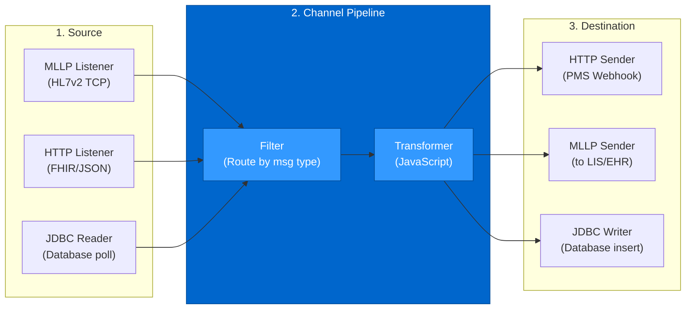
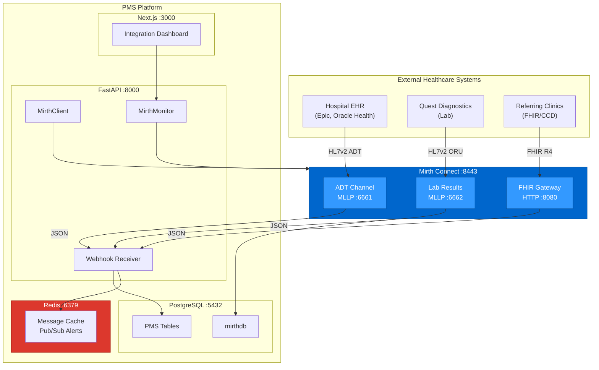

# Mirth Connect Developer Onboarding Tutorial

**Welcome to the MPS PMS Mirth Connect Integration Team**

This tutorial will take you from zero to building your first healthcare integration channel with the PMS. By the end, you will understand how Mirth Connect processes HL7v2 and FHIR messages, have a running local environment, and have built and tested an ADT feed and lab results pipeline end-to-end.

**Document ID:** PMS-EXP-MIRTHCONNECT-002
**Version:** 1.0
**Date:** 2026-03-11
**Applies To:** PMS project (all platforms)
**Prerequisite:** [Mirth Connect Setup Guide](77-MirthConnect-PMS-Developer-Setup-Guide.md)
**Estimated time:** 2-3 hours
**Difficulty:** Beginner-friendly

---

## What You Will Learn

1. How healthcare interoperability works and why Mirth Connect is the industry standard middleware
2. How HL7v2 messages are structured (segments, fields, components) and what ADT, ORU, and ORM mean
3. How Mirth channels work: Source → Filter → Transformer → Destination pipeline
4. How to configure MLLP (Minimal Lower Layer Protocol) listeners for HL7v2
5. How to write JavaScript transformers that parse HL7v2 segments into PMS-compatible JSON
6. How to receive transformed messages via FastAPI webhooks
7. How to build a FHIR Gateway channel for R4 resource exchange
8. How to monitor channel health, message statistics, and error queues
9. How to debug failed messages using Mirth's message viewer
10. How Mirth Connect fits into the PMS interoperability stack alongside FHIR (Exp 49), pVerify (Exp 73), and Availity (Exp 47)

## Part 1: Understanding Mirth Connect (15 min read)

### 1.1 What Problem Does Mirth Connect Solve?

Healthcare is an industry where dozens of systems need to talk to each other — but they all speak different languages. The hospital's EHR sends patient admissions in HL7v2 (a pipe-delimited format from 1987). The lab system sends results in a slightly different HL7v2 dialect. The pharmacy expects yet another format. The insurance clearinghouse speaks X12 EDI. And modern FHIR APIs use JSON.

Today, the PMS is an island. It cannot receive patient admissions from the hospital, lab results from Quest Diagnostics, or referral documents from partner clinics. Staff manually re-enter all this information — a process that's slow, error-prone, and a major source of clinical delays.

Mirth Connect is the translator and router that sits between all these systems. It receives messages in any healthcare format, transforms them into whatever format the destination expects, and delivers them reliably with full audit logging. For the PMS, Mirth is the bridge from isolation to interoperability.

### 1.2 How Mirth Connect Works — The Key Pieces



**Concept 1: Channels** — Each integration is a channel with a source connector (where data comes in), an optional filter (which messages to process), a transformer (how to convert the data), and one or more destination connectors (where to send it). Think of channels as data pipelines.

**Concept 2: HL7v2 Messages** — The lingua franca of healthcare integration. Messages are pipe-delimited text with segments (MSH, PID, PV1, OBX), fields within segments, and components within fields. Example: `PID|||PAT001||Smith^Jane^M||19850615|F` encodes a patient's ID, name, DOB, and gender.

**Concept 3: Transformers** — JavaScript code that runs inside the channel, parsing input messages and building output messages. Mirth provides `msg` as the parsed message object, so you can access `msg['PID']['PID.5']['PID.5.1']` to get the patient's last name.

### 1.3 How Mirth Connect Fits with Other PMS Technologies

| Technology | Relationship to Mirth |
|-----------|----------------------|
| NextGen FHIR API (Exp 49) | FHIR imports can flow through Mirth's FHIR Gateway channel |
| Redis (Exp 76) | Mirth webhook payloads cached in Redis for fast PMS processing |
| pVerify (Exp 73) | X12 270/271 eligibility can route through Mirth EDI channel |
| Availity (Exp 47) | X12 837/835 claims can route through Mirth EDI channel |
| RingCentral (Exp 71) | ADT events from Mirth can trigger appointment reminders |
| Xero (Exp 75) | Billing data from Mirth ADT feeds can trigger invoice creation |
| WebSocket (Exp 37) | Mirth webhook → Redis Pub/Sub → WebSocket for real-time UI updates |
| LigoLab (Exp 70) | Lab results from LigoLab can flow through Mirth ORU channel |

### 1.4 Key Vocabulary

| Term | Meaning |
|------|---------|
| **HL7v2** | Health Level 7 Version 2 — pipe-delimited message standard for clinical data exchange |
| **MLLP** | Minimal Lower Layer Protocol — TCP wrapper for HL7v2 messages (start byte 0x0B, end bytes 0x1C 0x0D) |
| **ADT** | Admission, Discharge, Transfer — HL7v2 message type for patient movement events |
| **ORU** | Observation Result Unsolicited — HL7v2 message type for lab/test results |
| **ORM** | Order Message — HL7v2 message type for lab/radiology orders |
| **Segment** | A line in an HL7v2 message (MSH, PID, PV1, OBX, etc.) |
| **Channel** | A Mirth integration pipeline: source → filter → transformer → destination |
| **Connector** | The source or destination endpoint of a channel (MLLP, HTTP, JDBC, File) |
| **Transformer** | JavaScript code that converts data between formats inside a channel |
| **ACK/NAK** | Acknowledgment/Negative Acknowledgment — HL7v2 response confirming receipt |
| **CCD/C-CDA** | Continuity of Care Document — XML-based clinical document standard for referrals |
| **FHIR R4** | Fast Healthcare Interoperability Resources Release 4 — modern JSON-based clinical data API |

### 1.5 Our Architecture



## Part 2: Environment Verification (15 min)

### 2.1 Checklist

1. **Mirth running**:
   ```bash
   curl -sk https://localhost:8443/api/server/version -u admin:admin
   # Expected: "4.5.2"
   ```

2. **PMS backend health**:
   ```bash
   curl -s http://localhost:8000/api/mirth/health | jq .
   # Expected: {"status": "healthy", "version": "4.5.2"}
   ```

3. **MLLP port listening**:
   ```bash
   nc -z localhost 6661 && echo "ADT port open" || echo "ADT port closed"
   # Expected: ADT port open
   ```

4. **PostgreSQL mirthdb**:
   ```bash
   psql -U mirthdb -d mirthdb -c "SELECT COUNT(*) FROM channel;"
   # Expected: count of deployed channels
   ```

### 2.2 Quick Test

```bash
# Send a minimal HL7v2 ADT message and check for ACK
python3 -c "
import socket
msg = chr(0x0B) + 'MSH|^~\\\&|TEST|TEST|PMS|PMS|20260311||ADT^A01|TEST001|P|2.5\rPID|||T001||Test^Patient||19900101|M\r' + chr(0x1C) + chr(0x0D)
s = socket.socket(socket.AF_INET, socket.SOCK_STREAM)
s.connect(('localhost', 6661))
s.send(msg.encode())
print(s.recv(4096).decode())
s.close()
"
# Expected: MSH|^~\&|PMS|PMS|TEST|TEST|...|ACK|...
```

## Part 3: Build Your First Integration (45 min)

### 3.1 What We Are Building

A complete ADT → PMS patient creation pipeline:
1. Receive an HL7v2 ADT^A01 (patient admission) message via MLLP
2. Mirth channel parses the PID segment (demographics) and PV1 segment (visit)
3. Transformer converts to PMS JSON schema
4. HTTP Sender posts to FastAPI webhook
5. PMS creates/updates the patient record and encounter

### 3.2 Step 1 — Understand the HL7v2 ADT Message

```
MSH|^~\&|EPIC|HOSPITAL|PMS|CLINIC|20260311143000||ADT^A01|MSG001|P|2.5
PID|||PAT001^^^HOSP^MR||Smith^Jane^M||19850615|F||W|100 Main St^^Austin^TX^78701||5125550100
PV1||I|ICU^001^01||||DOC001^Jones^Sarah|||MED||||||||V001|||||||||||||||||||||||||20260311120000
IN1|1|BCBS|123456||Blue Cross Blue Shield|||||||||||Smith^Jane|||||||||||||||||||INS001
```

Breaking this down:
- **MSH** (Message Header): Sender (EPIC/HOSPITAL), receiver (PMS/CLINIC), message type (ADT^A01), message ID (MSG001)
- **PID** (Patient Identification): MRN (PAT001), name (Smith^Jane^M), DOB (19850615), gender (F), address, phone
- **PV1** (Patient Visit): Patient class (I=Inpatient), location (ICU^001^01), attending (DOC001^Jones^Sarah), visit number (V001), admit date
- **IN1** (Insurance): Plan ID (BCBS), company name (Blue Cross Blue Shield), subscriber name, member ID (INS001)

### 3.3 Step 2 — Trace the Channel Pipeline

When this message arrives at port 6661:

1. **Source Connector (MLLP)**: Strips MLLP framing (0x0B/0x1C/0x0D), validates HL7v2 structure
2. **Pre-processor**: (optional) Logging, message ID extraction
3. **Filter**: Check MSH.9 (message type) — only process ADT^A01, ADT^A04, ADT^A08, ADT^A03
4. **Transformer**: JavaScript parses PID/PV1/IN1 into JSON, sets as channel output
5. **Destination (HTTP Sender)**: POSTs JSON to `http://pms-backend:8000/webhooks/mirth/adt`
6. **Response**: Mirth generates HL7 ACK and sends back to sender via MLLP

### 3.4 Step 3 — Test the Webhook Directly

Before testing through Mirth, verify the webhook endpoint works:

```bash
curl -s -X POST http://localhost:8000/webhooks/mirth/adt \
  -H "Content-Type: application/json" \
  -d '{
    "message_id": "TEST001",
    "event_type": "A01",
    "patient_id": "PAT001",
    "first_name": "Jane",
    "last_name": "Smith",
    "date_of_birth": "19850615",
    "gender": "F",
    "address": "100 Main St, Austin TX 78701",
    "phone": "5125550100",
    "insurance_id": "INS001",
    "visit_number": "V001",
    "admission_date": "20260311120000",
    "department": "ICU",
    "attending_provider": "Sarah Jones"
  }' | jq .
```

Expected:
```json
{"status": "accepted", "message_id": "TEST001", "event_type": "A01"}
```

### 3.5 Step 4 — Send HL7v2 Through Mirth

```python
# test_adt_pipeline.py
import socket

def send_hl7_mllp(host: str, port: int, message: str) -> str:
    """Send HL7v2 message via MLLP and return ACK."""
    sb = chr(0x0B)
    eb = chr(0x1C)
    cr = chr(0x0D)
    mllp = f"{sb}{message}{eb}{cr}"

    sock = socket.socket(socket.AF_INET, socket.SOCK_STREAM)
    sock.settimeout(10)
    sock.connect((host, port))
    sock.send(mllp.encode())
    response = sock.recv(4096).decode()
    sock.close()

    # Strip MLLP framing from response
    return response.replace(chr(0x0B), "").replace(chr(0x1C), "").replace(chr(0x0D), "\n").strip()

# ADT^A01 - Patient Admission
adt_a01 = (
    "MSH|^~\\&|EPIC|HOSPITAL|PMS|CLINIC|20260311143000||ADT^A01|MSG001|P|2.5\r"
    "PID|||PAT001^^^HOSP^MR||Smith^Jane^M||19850615|F||W|100 Main St^^Austin^TX^78701||5125550100\r"
    "PV1||I|ICU^001^01||||DOC001^Jones^Sarah|||MED||||||||V001|||||||||||||||||||||||||20260311120000\r"
    "IN1|1|BCBS|123456||Blue Cross Blue Shield|||||||||||Smith^Jane|||||||||||||||||||INS001\r"
)

print("Sending ADT^A01 (Patient Admission)...")
ack = send_hl7_mllp("localhost", 6661, adt_a01)
print(f"Response:\n{ack}")

# Check if ACK contains "AA" (Application Accept)
if "AA" in ack:
    print("\nSUCCESS: Message accepted by Mirth")
else:
    print("\nERROR: Message rejected")
```

### 3.6 Step 5 — Verify End-to-End

```bash
# Check Mirth channel statistics
curl -s http://localhost:8000/api/mirth/statistics \
  -H "Authorization: Bearer $ADMIN_TOKEN" | jq .

# Check PMS backend received the webhook
docker logs pms-backend 2>&1 | grep "ADT A01 received" | tail -1

# Check Mirth message content
curl -sk "https://localhost:8443/api/channels/adt-inbound-001/messages?limit=1" \
  -u admin:admin -H "Accept: application/json" | jq '.messages[0]'
```

## Part 4: Evaluating Strengths and Weaknesses (15 min)

### 4.1 Strengths

- **Healthcare-native**: Purpose-built for HL7v2, FHIR, CDA, DICOM, X12 — no generic framework adaptation needed
- **Visual channel builder**: Drag-and-drop GUI for non-developers to build integration flows
- **Broad connector support**: MLLP, HTTP, JDBC, SFTP, JMS, SMTP, DICOM — covers every healthcare protocol
- **JavaScript scripting**: Powerful transformation engine with access to Java libraries
- **Message audit trail**: Complete transaction history for every message processed — essential for HIPAA
- **Large community**: 12,000+ forum users, extensive documentation, third-party training
- **PostgreSQL native**: Uses the same database technology as the PMS

### 4.2 Weaknesses

- **Licensing uncertainty**: 4.5.2 is the last open-source version; 4.6+ is commercial only. No more security patches for OSS version.
- **Java Swing admin GUI**: The administration interface is a desktop Java application — less convenient than web-based alternatives
- **JVM overhead**: Requires 1-2GB RAM for the Java runtime, more than lightweight alternatives
- **JavaScript (Rhino)**: The scripting engine uses an older JavaScript runtime (ES5) without modern features
- **Learning curve**: HL7v2 parsing and healthcare interoperability have steep learning curves
- **No official Python SDK**: Integration with FastAPI requires manual REST API calls

### 4.3 When to Use Mirth Connect vs Alternatives

| Scenario | Use Mirth | Use HAPI FHIR | Use Apache Camel | Use Rhapsody |
|----------|-----------|---------------|------------------|-------------|
| HL7v2 interfaces (legacy EHRs, labs) | Yes (native) | No | With HL7 component | Yes |
| FHIR-only integration | Possible | Yes (purpose-built) | With FHIR component | Yes |
| Enterprise with budget | Consider 4.6+ | Consider Smile CDR | Free | Yes ($$$$) |
| Cost-sensitive / startup | Yes (4.5.2 OSS) | Yes (OSS) | Yes (OSS) | No |
| Non-healthcare integration | No | No | Yes (general purpose) | No |
| Need vendor support SLA | 4.6+ commercial | Smile CDR | Community | Yes (24/7) |

### 4.4 HIPAA / Healthcare Considerations

1. **PHI in every message**: HL7v2 and FHIR messages contain patient demographics, diagnoses, lab results, and other PHI by design. Every network path must be encrypted (TLS on MLLP, HTTPS on REST).

2. **Message audit trail**: Mirth stores every processed message in its database with full content. This is essential for HIPAA audit requirements but creates a large PHI data store that must be secured and pruned.

3. **Access control**: Mirth RBAC restricts who can view message content, deploy channels, and manage the server. Only `integration:admin` role users should access the PMS integration endpoints.

4. **Message pruning**: Configure automatic purging of message content after 30 days (keep metadata for 365 days) to limit PHI retention in the Mirth database.

5. **Vulnerability management**: Open-source 4.5.2 receives no security patches. Monitor CVE databases and the Open Integration Engine fork for community patches. Budget for commercial license if production security patches are critical.

## Part 5: Debugging Common Issues (15 min read)

### Issue 1: "No HL7 ACK Received" (MLLP Timeout)

**Symptom**: HL7 sender times out waiting for ACK from Mirth.
**Cause**: Channel transformer throws an error, preventing response generation.
**Fix**: Check the Mirth server log:
```bash
docker logs pms-mirth --tail 100 | grep -i error
```
Open the message in Mirth Administrator → check the "Errors" tab for the transformer stack trace.

### Issue 2: HL7v2 Parsing Error ("Invalid HL7 Message")

**Symptom**: Mirth rejects the message with a parse error.
**Cause**: Missing segment delimiters (\r), incorrect encoding characters, or invalid segment structure.
**Fix**: Validate the message structure:
- Segments must be separated by `\r` (carriage return), NOT `\n`
- MSH segment encoding characters must be `|^~\&`
- Each segment must start with a valid 3-letter segment ID

### Issue 3: Transformer Returns Empty JSON

**Symptom**: Webhook receives `{}` or `null` from Mirth.
**Cause**: Transformer JavaScript error silently swallowed; `tmp` variable not set.
**Fix**: Add logging to the transformer:
```javascript
logger.info("PID.5.1: " + msg['PID']['PID.5']['PID.5.1'].toString());
```
Check Mirth logs for the output. Ensure the transformer ends with `tmp = JSON.stringify(payload);`.

### Issue 4: Duplicate Messages

**Symptom**: Same patient/result created multiple times in PMS.
**Cause**: HL7 sender retransmits when ACK is delayed; Mirth reprocesses.
**Fix**: Implement idempotency in the webhook receiver:
```python
# Track processed message IDs
if await redis.sismember("mirth:processed", event.message_id):
    return {"status": "duplicate", "message_id": event.message_id}
await redis.sadd("mirth:processed", event.message_id)
await redis.expire(f"mirth:processed", 86400)  # 24h TTL
```

### Issue 5: Channel Shows "STOPPED" After Restart

**Symptom**: Channels don't auto-start when Mirth restarts.
**Cause**: Channels were stopped manually before restart, or initial state is "STOPPED".
**Fix**: Set channels to auto-start:
```bash
# Deploy and start all channels
curl -sk -X POST https://localhost:8443/api/channels/_redeployAll -u admin:admin
```
Or configure channels with `initialState="STARTED"` in the channel XML.

## Part 6: Practice Exercises (45 min)

### Option A: Build a Lab Results Channel

Create a Mirth channel that receives HL7v2 ORU messages (lab results) and posts them to the PMS:
1. MLLP listener on port 6662
2. Transformer parses OBR (order) and OBX (observation) segments
3. Maps to PMS `LabResult` schema (test_code, test_name, result_value, units, reference_range, abnormal_flag)
4. HTTP Sender posts to `/webhooks/mirth/lab-results`

**Hints**: OBX segments repeat — use a loop: `for (var i = 0; i < msg['OBX'].length(); i++)`. Abnormal flags are in OBX.8.

### Option B: Build a FHIR Patient Import

Create a Mirth channel that receives FHIR Patient resources via HTTP and creates PMS patients:
1. HTTP Listener on port 8080, path `/fhir/Patient`
2. Parse FHIR Patient JSON (name, birthDate, gender, telecom, address)
3. Transform to PMS patient schema
4. POST to `/webhooks/mirth/adt` with event_type "FHIR_IMPORT"

**Hints**: FHIR names are arrays: `msg.name[0].family` for last name. Use `msg.identifier` to find the MRN.

### Option C: Build a Monitoring Dashboard Enhancement

Extend the PMS Integration Dashboard to show:
1. Message volume chart (received/sent/error per hour)
2. Per-channel error rate with color coding (green < 1%, yellow < 5%, red > 5%)
3. Click-to-view for recent error messages with raw HL7 content
4. Auto-alerting when error rate exceeds threshold

**Hints**: Poll `/api/mirth/statistics` every 15 seconds. Store historical data in Redis sorted sets for trending.

## Part 7: Development Workflow and Conventions

### 7.1 File Organization

```
pms-backend/
├── app/
│   ├── integrations/
│   │   └── mirth/
│   │       ├── __init__.py
│   │       ├── client.py           # MirthClient REST API wrapper
│   │       └── monitor.py          # MirthMonitorService
│   └── api/
│       └── routes/
│           ├── mirth_webhooks.py   # Webhook receivers (ADT, lab, referral)
│           └── mirth_admin.py      # Admin/monitoring endpoints
│
pms-frontend/
├── src/
│   ├── types/
│   │   └── mirth.ts               # TypeScript interfaces
│   └── components/
│       └── mirth/
│           ├── IntegrationDashboard.tsx  # Channel overview
│           └── MessageViewer.tsx         # Message inspection
│
config/
└── mirth/
    └── channels/                   # Channel XML exports (version controlled)
        ├── adt-inbound.xml
        ├── lab-results-inbound.xml
        └── fhir-gateway.xml
```

### 7.2 Naming Conventions

| Item | Convention | Example |
|------|-----------|---------|
| Mirth channel name | `PMS {Direction} {Type}` | `PMS ADT Inbound`, `PMS Lab Orders Outbound` |
| Webhook endpoint | `/webhooks/mirth/{message-type}` | `/webhooks/mirth/adt`, `/webhooks/mirth/lab-results` |
| MLLP port | 666X (sequential) | 6661 (ADT), 6662 (Lab), 6663 (Orders) |
| Channel XML file | `{type}-{direction}.xml` | `adt-inbound.xml`, `lab-orders-outbound.xml` |
| Environment variable | `MIRTH_*` | `MIRTH_API_URL`, `MIRTH_USERNAME` |

### 7.3 PR Checklist

- [ ] Channel XML exported and committed to `config/mirth/channels/`
- [ ] Webhook Pydantic models match transformer output exactly
- [ ] Idempotency implemented (message ID deduplication)
- [ ] Error handling tested — malformed messages don't crash the webhook
- [ ] MLLP ports documented in docker-compose.yml with comments
- [ ] Transformer includes logging for debugging
- [ ] PHI handling reviewed — no unnecessary PHI logging in application logs
- [ ] Channel statistics verified after testing (received > 0, error = 0)

### 7.4 Security Reminders

1. **TLS on MLLP**: Production MLLP connections must use TLS (configure in Mirth SSL Manager)
2. **Webhook authentication**: Protect webhook endpoints with API key or mTLS in production
3. **No PHI in application logs**: Log message IDs, event types, and patient IDs — never log full message content to application logs
4. **Message pruning**: Configure 30-day content retention in Mirth to limit PHI exposure
5. **Mirth admin access**: Restrict to `integration:admin` role only; change default password immediately
6. **Channel XML in git**: Version control channel configurations, but review for embedded credentials before committing

## Part 8: Quick Reference Card

### Key Commands

```bash
# Mirth health via PMS
curl -s http://localhost:8000/api/mirth/health | jq .

# Channel list
curl -sk https://localhost:8443/api/channels/idsAndNames -u admin:admin -H "Accept: application/json"

# Channel statistics
curl -sk https://localhost:8443/api/channels/statistics -u admin:admin -H "Accept: application/json"

# Send test HL7v2 ADT
python3 scripts/send_test_adt.py

# View Mirth logs
docker logs pms-mirth --tail 50 -f

# Redeploy all channels
curl -sk -X POST https://localhost:8443/api/channels/_redeployAll -u admin:admin
```

### Key Files

| File | Purpose |
|------|---------|
| `app/integrations/mirth/client.py` | MirthClient REST API wrapper |
| `app/api/routes/mirth_webhooks.py` | Webhook receivers |
| `app/api/routes/mirth_admin.py` | Admin/monitoring endpoints |
| `config/mirth/channels/*.xml` | Channel configurations |
| `src/components/mirth/IntegrationDashboard.tsx` | Channel monitoring UI |

### Key URLs

| URL | Description |
|-----|-------------|
| https://localhost:8443 | Mirth Admin (requires Java GUI) |
| https://localhost:8443/api | Mirth REST API |
| http://localhost:8000/api/mirth/health | PMS Mirth health check |
| http://localhost:3000/admin/integrations | PMS Integration Dashboard |

### HL7v2 Message Quick Reference

| Segment | Name | Key Fields |
|---------|------|------------|
| MSH | Message Header | MSH.9 (type), MSH.10 (message ID) |
| PID | Patient ID | PID.3 (MRN), PID.5 (name), PID.7 (DOB), PID.8 (gender) |
| PV1 | Patient Visit | PV1.2 (class), PV1.3 (location), PV1.7 (attending), PV1.19 (visit #) |
| OBR | Observation Request | OBR.4 (test code), OBR.7 (observation date) |
| OBX | Observation Result | OBX.3 (test ID), OBX.5 (value), OBX.6 (units), OBX.7 (range), OBX.8 (flag) |
| IN1 | Insurance | IN1.3 (company ID), IN1.4 (plan name), IN1.36 (member ID) |

## Next Steps

1. **Build the Lab Results Channel** using Practice Exercise Option A
2. **Create outbound channels** for lab orders (ORM) and prescriptions
3. **Set up FHIR Gateway** channel for modern EHR integration
4. **Configure TLS on MLLP** for production-grade encryption
5. **Review the [PRD](77-PRD-MirthConnect-PMS-Integration.md)** for Phase 2 and Phase 3 roadmap including X12 EDI and public health reporting
