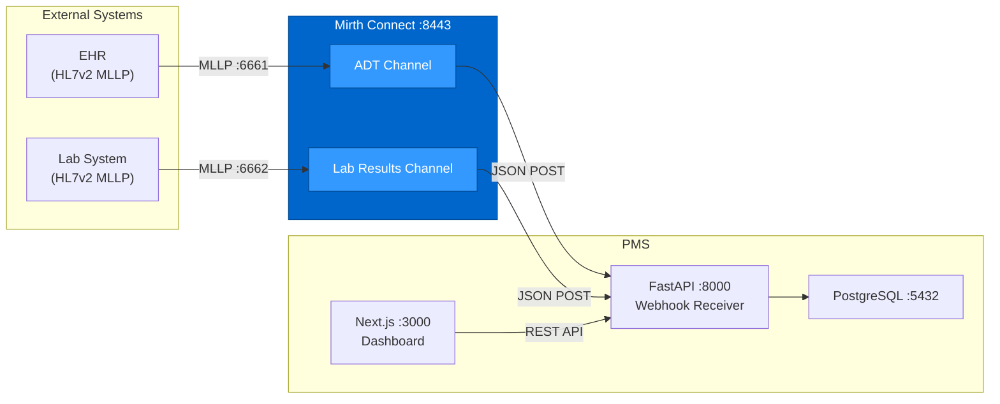

# Mirth Connect Setup Guide for PMS Integration

**Document ID:** PMS-EXP-MIRTHCONNECT-001
**Version:** 1.0
**Date:** 2026-03-11
**Applies To:** PMS project (all platforms)
**Prerequisites Level:** Intermediate

---

## Table of Contents

1. [Overview](#1-overview)
2. [Prerequisites](#2-prerequisites)
3. [Part A: Deploy Mirth Connect via Docker](#3-part-a-deploy-mirth-connect-via-docker)
4. [Part B: Integrate with PMS Backend](#4-part-b-integrate-with-pms-backend)
5. [Part C: Create Mirth Channels](#5-part-c-create-mirth-channels)
6. [Part D: Integrate with PMS Frontend](#6-part-d-integrate-with-pms-frontend)
7. [Part E: Testing and Verification](#7-part-e-testing-and-verification)
8. [Troubleshooting](#8-troubleshooting)
9. [Reference Commands](#9-reference-commands)
10. [Next Steps](#10-next-steps)
11. [Resources](#11-resources)

---

## 1. Overview

This guide deploys Mirth Connect 4.5.2 alongside the PMS and integrates it for bidirectional healthcare message exchange. By the end, you will have:

- Mirth Connect running in Docker with PostgreSQL backend
- A Python `MirthClient` for REST API management and monitoring
- FastAPI webhook endpoints receiving transformed messages from Mirth
- An ADT channel processing HL7v2 admission messages into PMS patients
- A Lab Results channel processing HL7v2 ORU messages into PMS encounters
- Next.js Integration Dashboard showing channel status and message statistics



## 2. Prerequisites

### 2.1 Required Software

| Software | Minimum Version | Check Command |
|----------|----------------|---------------|
| Docker | 24+ | `docker --version` |
| Docker Compose | 2.20+ | `docker compose version` |
| Python | 3.11+ | `python --version` |
| Node.js | 18+ | `node --version` |
| PostgreSQL | 15+ | `psql --version` |

### 2.2 Installation of Prerequisites

```bash
# Install Python HTTP client for Mirth REST API
pip install httpx>=0.27.0

# Install HL7 message parser (optional, for testing)
pip install hl7>=0.4.5
```

### 2.3 Verify PMS Services

```bash
curl -s http://localhost:8000/health | jq .status    # "healthy"
curl -s -o /dev/null -w "%{http_code}" http://localhost:3000  # 200
psql -U pms -d pms_db -c "SELECT 1;"                 # 1
```

**Checkpoint**: PMS services running, Python dependencies installed.

## 3. Part A: Deploy Mirth Connect via Docker

### Step 1: Create Mirth Database

```bash
psql -U postgres -c "CREATE DATABASE mirthdb;"
psql -U postgres -c "CREATE USER mirthdb WITH PASSWORD 'mirthdb_password';"
psql -U postgres -c "GRANT ALL PRIVILEGES ON DATABASE mirthdb TO mirthdb;"
```

### Step 2: Add Mirth to Docker Compose

Add to `docker-compose.yml`:

```yaml
services:
  # ... existing services ...

  mirth:
    image: nextgenhealthcare/connect:4.5.2
    container_name: pms-mirth
    ports:
      - "8443:8443"    # Admin UI / REST API (HTTPS)
      - "8080:8080"    # HTTP Listener channels
      - "6661:6661"    # MLLP - ADT channel
      - "6662:6662"    # MLLP - Lab Results channel
      - "6663:6663"    # MLLP - Lab Orders channel
    environment:
      - _MP_database=postgres
      - _MP_database_url=jdbc:postgresql://postgres:5432/mirthdb
      - _MP_database_username=mirthdb
      - _MP_database_password=mirthdb_password
      - _MP_keystore_storepass=changeit
      - _MP_keystore_keypass=changeit
    volumes:
      - mirth-appdata:/opt/connect/appdata
      - mirth-custom-lib:/opt/connect/custom-lib
    depends_on:
      postgres:
        condition: service_healthy
    restart: unless-stopped
    healthcheck:
      test: ["CMD", "curl", "-fk", "https://localhost:8443/api/server/status"]
      interval: 30s
      timeout: 10s
      retries: 5
      start_period: 60s
    networks:
      - pms-network

volumes:
  mirth-appdata:
  mirth-custom-lib:
```

### Step 3: Start Mirth

```bash
docker compose up -d mirth

# Wait for startup (Mirth takes 30-60 seconds to initialize)
echo "Waiting for Mirth to start..."
until docker exec pms-mirth curl -fks https://localhost:8443/api/server/status; do
  sleep 5
done
echo "Mirth is ready!"
```

### Step 4: Verify Mirth

```bash
# Check server status
curl -sk https://localhost:8443/api/server/status \
  -u admin:admin \
  -H "Accept: application/json" | jq .

# Check version
curl -sk https://localhost:8443/api/server/version \
  -u admin:admin

# Expected: "4.5.2"
```

### Step 5: Change Default Password

```bash
curl -sk -X PUT https://localhost:8443/api/users/1 \
  -u admin:admin \
  -H "Content-Type: application/json" \
  -d '{
    "id": 1,
    "username": "admin",
    "firstName": "Admin",
    "lastName": "User",
    "organization": "MPS Inc",
    "email": "admin@mps.com"
  }'
```

**Checkpoint**: Mirth Connect 4.5.2 running in Docker, connected to PostgreSQL, accessible at https://localhost:8443, default password changed.

## 4. Part B: Integrate with PMS Backend

### Step 6: MirthClient

Create `app/integrations/mirth/client.py`:

```python
"""Mirth Connect REST API client."""

import httpx
from app.core.config import settings


class MirthClient:
    """Client for Mirth Connect REST API (port 8443)."""

    def __init__(self):
        self.base_url = settings.MIRTH_API_URL  # https://mirth:8443/api
        self.auth = (settings.MIRTH_USERNAME, settings.MIRTH_PASSWORD)
        self._http = httpx.AsyncClient(
            verify=False,  # Self-signed cert in dev
            timeout=30.0,
            auth=self.auth,
        )

    async def close(self):
        await self._http.aclose()

    # --- Server ---

    async def get_status(self) -> dict:
        """Get server status."""
        resp = await self._http.get(
            f"{self.base_url}/server/status",
            headers={"Accept": "application/json"},
        )
        resp.raise_for_status()
        return resp.json()

    async def get_version(self) -> str:
        """Get Mirth version."""
        resp = await self._http.get(f"{self.base_url}/server/version")
        return resp.text.strip('"')

    # --- Channels ---

    async def list_channels(self) -> list[dict]:
        """List all channels with IDs and names."""
        resp = await self._http.get(
            f"{self.base_url}/channels/idsAndNames",
            headers={"Accept": "application/json"},
        )
        resp.raise_for_status()
        return resp.json()

    async def get_channel(self, channel_id: str) -> dict:
        """Get full channel configuration."""
        resp = await self._http.get(
            f"{self.base_url}/channels/{channel_id}",
            headers={"Accept": "application/json"},
        )
        resp.raise_for_status()
        return resp.json()

    async def deploy_channel(self, channel_id: str) -> bool:
        """Deploy a channel."""
        resp = await self._http.post(
            f"{self.base_url}/channels/{channel_id}/_deploy"
        )
        return resp.status_code == 200

    async def start_channel(self, channel_id: str) -> bool:
        """Start a deployed channel."""
        resp = await self._http.post(
            f"{self.base_url}/channels/{channel_id}/_start"
        )
        return resp.status_code == 200

    async def stop_channel(self, channel_id: str) -> bool:
        """Stop a channel."""
        resp = await self._http.post(
            f"{self.base_url}/channels/{channel_id}/_stop"
        )
        return resp.status_code == 200

    # --- Statistics ---

    async def get_statistics(self) -> dict:
        """Get statistics for all channels."""
        resp = await self._http.get(
            f"{self.base_url}/channels/statistics",
            headers={"Accept": "application/json"},
        )
        resp.raise_for_status()
        return resp.json()

    async def get_channel_statistics(self, channel_id: str) -> dict:
        """Get statistics for a specific channel."""
        resp = await self._http.get(
            f"{self.base_url}/channels/{channel_id}/statistics",
            headers={"Accept": "application/json"},
        )
        resp.raise_for_status()
        return resp.json()

    # --- Messages ---

    async def search_messages(
        self, channel_id: str, limit: int = 20, offset: int = 0,
        status: str | None = None,
    ) -> dict:
        """Search messages in a channel."""
        params = {"limit": limit, "offset": offset}
        if status:
            params["status"] = status
        resp = await self._http.get(
            f"{self.base_url}/channels/{channel_id}/messages",
            params=params,
            headers={"Accept": "application/json"},
        )
        resp.raise_for_status()
        return resp.json()


mirth_client = MirthClient()
```

### Step 7: Webhook Receiver Endpoints

Create `app/api/routes/mirth_webhooks.py`:

```python
"""Webhook endpoints receiving transformed messages from Mirth channels."""

import logging
from uuid import UUID

from fastapi import APIRouter, HTTPException, Header, Request
from pydantic import BaseModel

router = APIRouter(prefix="/webhooks/mirth", tags=["mirth-webhooks"])
logger = logging.getLogger("mirth.webhooks")


class ADTEvent(BaseModel):
    message_id: str
    event_type: str  # A01, A04, A08, A03
    patient_id: str | None = None
    first_name: str
    last_name: str
    date_of_birth: str | None = None
    gender: str | None = None
    address: str | None = None
    phone: str | None = None
    insurance_id: str | None = None
    visit_number: str | None = None
    admission_date: str | None = None
    department: str | None = None
    attending_provider: str | None = None


class LabResult(BaseModel):
    message_id: str
    patient_id: str
    order_id: str
    test_code: str
    test_name: str
    result_value: str
    result_units: str | None = None
    reference_range: str | None = None
    abnormal_flag: str | None = None  # N, H, L, HH, LL, A
    result_status: str  # F (final), P (preliminary), C (corrected)
    observation_date: str
    performing_lab: str | None = None


@router.post("/adt")
async def receive_adt_event(
    event: ADTEvent,
    x_mirth_channel: str = Header(None),
):
    """Receive ADT (Admit/Discharge/Transfer) event from Mirth."""
    logger.info(
        f"ADT {event.event_type} received: {event.first_name} {event.last_name} "
        f"(message: {event.message_id})"
    )

    # TODO: Create or update patient in PMS database
    # patient = await patient_service.upsert_from_adt(event)

    # TODO: Create encounter if A01 (admit) or A04 (register)
    # if event.event_type in ("A01", "A04"):
    #     encounter = await encounter_service.create_from_adt(event, patient.id)

    return {
        "status": "accepted",
        "message_id": event.message_id,
        "event_type": event.event_type,
    }


@router.post("/lab-results")
async def receive_lab_result(
    result: LabResult,
    x_mirth_channel: str = Header(None),
):
    """Receive lab result (ORU) from Mirth."""
    logger.info(
        f"Lab result received: {result.test_name} = {result.result_value} "
        f"{result.result_units} (patient: {result.patient_id})"
    )

    # TODO: Store lab result in PMS database
    # lab = await lab_service.store_result(result)

    # TODO: Link to encounter and notify provider
    # await notification_service.publish(
    #     clinic_id, "lab.result_ready",
    #     {"patient_id": result.patient_id, "test": result.test_name}
    # )

    return {
        "status": "accepted",
        "message_id": result.message_id,
        "test_code": result.test_code,
    }


@router.post("/referrals")
async def receive_referral(request: Request):
    """Receive referral document (CCD/C-CDA or FHIR Bundle) from Mirth."""
    body = await request.json()
    logger.info(f"Referral received: {body.get('message_id', 'unknown')}")

    return {"status": "accepted", "message_id": body.get("message_id")}
```

### Step 8: Mirth Admin Router

Create `app/api/routes/mirth_admin.py`:

```python
"""Mirth Connect administration and monitoring endpoints."""

from fastapi import APIRouter, Depends

from app.api.deps import require_role
from app.integrations.mirth.client import mirth_client

router = APIRouter(prefix="/api/mirth", tags=["mirth-admin"])


@router.get("/health")
async def mirth_health():
    """Check Mirth connectivity and status."""
    try:
        status = await mirth_client.get_status()
        version = await mirth_client.get_version()
        return {"status": "healthy", "version": version, "server_status": status}
    except Exception as e:
        return {"status": "unhealthy", "error": str(e)}


@router.get("/channels")
async def list_channels(user=Depends(require_role("integration:admin"))):
    """List all Mirth channels."""
    return await mirth_client.list_channels()


@router.get("/channels/{channel_id}/statistics")
async def channel_statistics(
    channel_id: str,
    user=Depends(require_role("integration:admin")),
):
    """Get statistics for a specific channel."""
    return await mirth_client.get_channel_statistics(channel_id)


@router.get("/statistics")
async def all_statistics(user=Depends(require_role("integration:admin"))):
    """Get statistics for all channels."""
    return await mirth_client.get_statistics()


@router.post("/channels/{channel_id}/deploy")
async def deploy_channel(
    channel_id: str,
    user=Depends(require_role("integration:admin")),
):
    """Deploy a channel."""
    success = await mirth_client.deploy_channel(channel_id)
    return {"deployed": success}


@router.post("/channels/{channel_id}/start")
async def start_channel(
    channel_id: str,
    user=Depends(require_role("integration:admin")),
):
    """Start a deployed channel."""
    success = await mirth_client.start_channel(channel_id)
    return {"started": success}


@router.post("/channels/{channel_id}/stop")
async def stop_channel(
    channel_id: str,
    user=Depends(require_role("integration:admin")),
):
    """Stop a channel."""
    success = await mirth_client.stop_channel(channel_id)
    return {"stopped": success}


@router.get("/channels/{channel_id}/messages")
async def search_messages(
    channel_id: str,
    limit: int = 20,
    offset: int = 0,
    status: str | None = None,
    user=Depends(require_role("integration:admin")),
):
    """Search messages in a channel."""
    return await mirth_client.search_messages(channel_id, limit, offset, status)
```

### Step 9: Add Environment Variables

Add to `.env`:

```bash
# Mirth Connect Configuration
MIRTH_API_URL=https://localhost:8443/api
MIRTH_USERNAME=admin
MIRTH_PASSWORD=your_mirth_password
MIRTH_WEBHOOK_SECRET=your_webhook_secret_key
```

**Checkpoint**: MirthClient, webhook receiver (ADT, lab results, referrals), and admin router all created.

## 5. Part C: Create Mirth Channels

### Step 10: ADT Channel (via REST API)

You can create channels via the Mirth Administrator GUI (Java Swing) or via the REST API. Here's the REST API approach:

```python
# scripts/create_adt_channel.py
"""Create the ADT Inbound channel via Mirth REST API."""

import httpx
import json

MIRTH_URL = "https://localhost:8443/api"
AUTH = ("admin", "your_password")

# Channel XML configuration
ADT_CHANNEL_XML = """<?xml version="1.0" encoding="UTF-8"?>
<channel version="4.5.0">
  <id>adt-inbound-001</id>
  <name>PMS ADT Inbound</name>
  <description>Receives HL7v2 ADT messages and posts transformed JSON to PMS</description>
  <enabled>true</enabled>
  <sourceConnector>
    <transportName>TCP Listener</transportName>
    <properties class="com.mirth.connect.connectors.tcp.TcpReceiverProperties">
      <listenerConnectorProperties>
        <host>0.0.0.0</host>
        <port>6661</port>
      </listenerConnectorProperties>
      <transmissionModeProperties class="com.mirth.connect.model.transmission.framemode.FrameModeProperties">
        <startOfMessageBytes>0B</startOfMessageBytes>
        <endOfMessageBytes>1C0D</endOfMessageBytes>
      </transmissionModeProperties>
      <dataTypeName>HL7V2</dataTypeName>
    </properties>
  </sourceConnector>
  <destinationConnectors>
    <connector>
      <name>PMS Webhook</name>
      <transportName>HTTP Sender</transportName>
      <properties class="com.mirth.connect.connectors.http.HttpDispatcherProperties">
        <host>http://pms-backend:8000/webhooks/mirth/adt</host>
        <method>POST</method>
        <contentType>application/json</contentType>
      </properties>
    </connector>
  </destinationConnectors>
</channel>"""

def create_channel():
    with httpx.Client(verify=False, auth=AUTH) as client:
        resp = client.post(
            f"{MIRTH_URL}/channels",
            content=ADT_CHANNEL_XML,
            headers={"Content-Type": "application/xml"},
        )
        print(f"Create channel: {resp.status_code}")

        # Deploy
        resp = client.post(f"{MIRTH_URL}/channels/adt-inbound-001/_deploy")
        print(f"Deploy: {resp.status_code}")

        # Start
        resp = client.post(f"{MIRTH_URL}/channels/adt-inbound-001/_start")
        print(f"Start: {resp.status_code}")

create_channel()
```

> **Note**: In practice, channels are typically created using the Mirth Administrator GUI which provides a visual drag-and-drop interface. The JavaScript transformer for the ADT channel would parse PID/PV1/IN1 segments and map them to the PMS JSON schema.

### Step 11: ADT Transformer (JavaScript)

The transformer script inside the Mirth channel converts HL7v2 to PMS JSON:

```javascript
// Mirth Channel Transformer (JavaScript/Rhino)
// Input: HL7v2 ADT message
// Output: JSON for PMS webhook

var eventType = msg['MSH']['MSH.9']['MSH.9.2'].toString(); // A01, A04, A08, etc.
var messageId = msg['MSH']['MSH.10'].toString();

// Parse PID segment (Patient Demographics)
var pid = msg['PID'];
var patientId = pid['PID.3']['PID.3.1'].toString();
var lastName = pid['PID.5']['PID.5.1'].toString();
var firstName = pid['PID.5']['PID.5.2'].toString();
var dob = pid['PID.7']['PID.7.1'].toString();
var gender = pid['PID.8'].toString();
var address = pid['PID.11']['PID.11.1'].toString();
var phone = pid['PID.13']['PID.13.1'].toString();

// Parse PV1 segment (Patient Visit)
var pv1 = msg['PV1'];
var visitNumber = pv1['PV1.19']['PV1.19.1'].toString();
var admitDate = pv1['PV1.44']['PV1.44.1'].toString();
var department = pv1['PV1.3']['PV1.3.1'].toString();
var attending = pv1['PV1.7']['PV1.7.2'].toString() + ' ' + pv1['PV1.7']['PV1.7.3'].toString();

// Parse IN1 segment (Insurance) if present
var insuranceId = '';
try {
    insuranceId = msg['IN1']['IN1.36']['IN1.36.1'].toString();
} catch (e) {}

// Build PMS JSON payload
var payload = {
    message_id: messageId,
    event_type: eventType,
    patient_id: patientId,
    first_name: firstName,
    last_name: lastName,
    date_of_birth: dob,
    gender: gender,
    address: address,
    phone: phone,
    insurance_id: insuranceId,
    visit_number: visitNumber,
    admission_date: admitDate,
    department: department,
    attending_provider: attending
};

// Set transformed message
tmp = JSON.stringify(payload);
```

**Checkpoint**: ADT channel created with MLLP listener on port 6661, JavaScript transformer parsing PID/PV1/IN1, HTTP sender posting to PMS webhook.

## 6. Part D: Integrate with PMS Frontend

### Step 12: TypeScript Types

Add to `src/types/mirth.ts`:

```typescript
export interface MirthChannel {
  id: string;
  name: string;
  enabled: boolean;
  state: "STARTED" | "STOPPED" | "PAUSED" | "DEPLOYING";
}

export interface MirthStatistics {
  channelId: string;
  received: number;
  sent: number;
  error: number;
  filtered: number;
  queued: number;
}

export interface MirthMessage {
  messageId: number;
  channelId: string;
  status: "RECEIVED" | "TRANSFORMED" | "SENT" | "ERROR" | "QUEUED";
  receivedDate: string;
  responseDate?: string;
  rawContent?: string;
  transformedContent?: string;
}

export interface MirthHealth {
  status: "healthy" | "unhealthy";
  version?: string;
  error?: string;
}
```

### Step 13: Integration Dashboard Component

Create `src/components/mirth/IntegrationDashboard.tsx`:

```tsx
"use client";

import { useEffect, useState } from "react";

interface ChannelStat {
  channelId: string;
  name: string;
  state: string;
  received: number;
  sent: number;
  error: number;
  queued: number;
}

export default function IntegrationDashboard() {
  const [channels, setChannels] = useState<ChannelStat[]>([]);
  const [health, setHealth] = useState<{ status: string; version?: string }>({
    status: "checking",
  });

  useEffect(() => {
    loadData();
    const interval = setInterval(loadData, 15_000);
    return () => clearInterval(interval);
  }, []);

  async function loadData() {
    try {
      const [healthRes, statsRes] = await Promise.all([
        fetch("/api/mirth/health").then((r) => r.json()),
        fetch("/api/mirth/statistics").then((r) => r.json()),
      ]);
      setHealth(healthRes);
      if (Array.isArray(statsRes)) {
        setChannels(statsRes);
      }
    } catch {
      setHealth({ status: "unhealthy" });
    }
  }

  const stateColor: Record<string, string> = {
    STARTED: "text-green-600 bg-green-50",
    STOPPED: "text-red-600 bg-red-50",
    PAUSED: "text-yellow-600 bg-yellow-50",
  };

  return (
    <div className="space-y-6">
      <div className="flex items-center justify-between">
        <h2 className="text-xl font-semibold">Healthcare Integration Engine</h2>
        <div className="flex items-center gap-2">
          <span
            className={`inline-flex h-2.5 w-2.5 rounded-full ${
              health.status === "healthy" ? "bg-green-500" : "bg-red-500"
            }`}
          />
          <span className="text-sm text-gray-500">
            Mirth Connect {health.version || "—"}
          </span>
        </div>
      </div>

      {/* Summary Cards */}
      <div className="grid grid-cols-4 gap-4">
        {["Received", "Sent", "Errors", "Queued"].map((label, i) => {
          const total = channels.reduce(
            (sum, ch) =>
              sum + (i === 0 ? ch.received : i === 1 ? ch.sent : i === 2 ? ch.error : ch.queued),
            0
          );
          return (
            <div key={label} className="rounded-lg border border-gray-200 p-4">
              <p className="text-sm text-gray-500">{label}</p>
              <p className={`text-2xl font-bold ${i === 2 && total > 0 ? "text-red-600" : ""}`}>
                {total.toLocaleString()}
              </p>
            </div>
          );
        })}
      </div>

      {/* Channel Table */}
      <div className="overflow-hidden rounded-lg border border-gray-200">
        <table className="min-w-full divide-y divide-gray-200">
          <thead className="bg-gray-50">
            <tr>
              <th className="px-4 py-3 text-left text-xs font-medium text-gray-500 uppercase">Channel</th>
              <th className="px-4 py-3 text-left text-xs font-medium text-gray-500 uppercase">State</th>
              <th className="px-4 py-3 text-right text-xs font-medium text-gray-500 uppercase">Received</th>
              <th className="px-4 py-3 text-right text-xs font-medium text-gray-500 uppercase">Sent</th>
              <th className="px-4 py-3 text-right text-xs font-medium text-gray-500 uppercase">Errors</th>
              <th className="px-4 py-3 text-right text-xs font-medium text-gray-500 uppercase">Queued</th>
            </tr>
          </thead>
          <tbody className="divide-y divide-gray-200 bg-white">
            {channels.map((ch) => (
              <tr key={ch.channelId}>
                <td className="px-4 py-3 text-sm font-medium">{ch.name}</td>
                <td className="px-4 py-3">
                  <span className={`inline-flex rounded-full px-2 py-1 text-xs font-medium ${stateColor[ch.state] || ""}`}>
                    {ch.state}
                  </span>
                </td>
                <td className="px-4 py-3 text-right text-sm">{ch.received.toLocaleString()}</td>
                <td className="px-4 py-3 text-right text-sm">{ch.sent.toLocaleString()}</td>
                <td className="px-4 py-3 text-right text-sm text-red-600">{ch.error > 0 ? ch.error.toLocaleString() : "—"}</td>
                <td className="px-4 py-3 text-right text-sm">{ch.queued > 0 ? ch.queued.toLocaleString() : "—"}</td>
              </tr>
            ))}
          </tbody>
        </table>
      </div>
    </div>
  );
}
```

**Checkpoint**: Frontend includes TypeScript types and Integration Dashboard with channel status, statistics, and auto-refresh.

## 7. Part E: Testing and Verification

### Step 14: Verify Mirth Health via PMS

```bash
curl -s http://localhost:8000/api/mirth/health | jq .
# Expected: {"status": "healthy", "version": "4.5.2", ...}
```

### Step 15: Send Test HL7v2 ADT Message

```bash
# Install MLLP sender tool
pip install hl7

# Send a test ADT^A01 message via MLLP
python3 -c "
import socket

adt_msg = (
    'MSH|^~\&|EPIC|HOSPITAL|PMS|CLINIC|20260311143000||ADT^A01|MSG001|P|2.5\r'
    'PID|||PAT001^^^HOSP^MR||Smith^Jane^M||19850615|F||W|100 Main St^^Austin^TX^78701||5125550100\r'
    'PV1||I|ICU^001^01||||DOC001^Jones^Sarah|||MED||||||||V001|||||||||||||||||||||||||20260311120000\r'
    'IN1|1|BCBS|123456||Blue Cross Blue Shield|||||||||||Smith^Jane|||||||||||||||||||INS001\r'
)

# Wrap in MLLP frame
sb = chr(0x0B)
eb = chr(0x1C)
cr = chr(0x0D)
mllp_msg = f'{sb}{adt_msg}{eb}{cr}'

sock = socket.socket(socket.AF_INET, socket.SOCK_STREAM)
sock.connect(('localhost', 6661))
sock.send(mllp_msg.encode())
response = sock.recv(4096)
sock.close()
print(f'Response: {response.decode()}')
"
```

Expected: An HL7 ACK message from Mirth, and the PMS webhook receives the transformed JSON.

### Step 16: Verify Webhook Received

```bash
# Check PMS backend logs for webhook receipt
docker logs pms-backend 2>&1 | grep "ADT A01 received"
# Expected: "ADT A01 received: Jane Smith (message: MSG001)"
```

### Step 17: Check Channel Statistics

```bash
curl -s http://localhost:8000/api/mirth/statistics \
  -H "Authorization: Bearer $ADMIN_TOKEN" | jq .
# Expected: received: 1, sent: 1, error: 0
```

**Checkpoint**: HL7v2 ADT message sent via MLLP, processed by Mirth channel, transformed to JSON, posted to PMS webhook, ACK returned.

## 8. Troubleshooting

### Mirth Won't Start (Container Exits Immediately)

**Symptom**: `pms-mirth` container exits with code 1 after a few seconds.

**Cause**: PostgreSQL connection failure or insufficient Java heap.

**Fix**:
```bash
docker logs pms-mirth --tail 50
# Look for "Unable to connect to database" or "OutOfMemoryError"

# Fix DB connection:
docker exec pms-mirth cat /opt/connect/conf/mirth.properties | grep database

# Fix memory: add to docker-compose.yml environment
# - _MP_server__vmoptions=-Xmx2g
```

### MLLP Connection Refused on Port 6661

**Symptom**: `Connection refused` when sending HL7 messages.

**Cause**: ADT channel not deployed or not started, or Docker port not mapped.

**Fix**:
```bash
# Check if channel is running
curl -sk https://localhost:8443/api/channels/adt-inbound-001/status \
  -u admin:admin -H "Accept: application/json" | jq .

# Deploy and start if needed
curl -sk -X POST https://localhost:8443/api/channels/adt-inbound-001/_deploy \
  -u admin:admin
curl -sk -X POST https://localhost:8443/api/channels/adt-inbound-001/_start \
  -u admin:admin
```

### Webhook Returns 422 (Validation Error)

**Symptom**: Mirth channel shows error; PMS returns 422 Unprocessable Entity.

**Cause**: Mirth transformer producing JSON that doesn't match the Pydantic model.

**Fix**: Check the Mirth channel's sent message content:
```bash
curl -sk "https://localhost:8443/api/channels/adt-inbound-001/messages?limit=1" \
  -u admin:admin -H "Accept: application/json" | jq '.messages[0].connectorMessages'
```
Compare the JSON payload against the `ADTEvent` Pydantic model fields.

### Self-Signed Certificate Warning

**Symptom**: `SSL: CERTIFICATE_VERIFY_FAILED` when MirthClient connects.

**Cause**: Mirth uses a self-signed certificate by default.

**Fix**: For development, use `verify=False` in httpx client (already configured). For production, install a proper TLS certificate in Mirth's Java keystore.

### Messages Stuck in Queue

**Symptom**: Channel statistics show growing `queued` count but `sent` stays flat.

**Cause**: Destination (PMS webhook) is down or rejecting messages.

**Fix**:
```bash
# Check PMS backend health
curl -s http://localhost:8000/health | jq .

# Check Mirth error messages
curl -sk "https://localhost:8443/api/channels/adt-inbound-001/messages?status=ERROR&limit=5" \
  -u admin:admin -H "Accept: application/json" | jq '.messages[].connectorMessages[].responseError'
```

## 9. Reference Commands

### Daily Development

```bash
# Mirth health
curl -s http://localhost:8000/api/mirth/health | jq .

# List channels
curl -sk https://localhost:8443/api/channels/idsAndNames -u admin:admin -H "Accept: application/json" | jq .

# Channel statistics
curl -sk https://localhost:8443/api/channels/statistics -u admin:admin -H "Accept: application/json" | jq .

# View recent messages for a channel
curl -sk "https://localhost:8443/api/channels/{id}/messages?limit=10" -u admin:admin -H "Accept: application/json" | jq .

# Restart all channels
curl -sk -X POST https://localhost:8443/api/channels/_redeployAll -u admin:admin

# View Mirth logs
docker logs pms-mirth --tail 100 -f
```

### Useful URLs

| Resource | URL |
|----------|-----|
| Mirth Admin UI | https://localhost:8443 (requires Mirth Administrator Java app) |
| Mirth REST API | https://localhost:8443/api |
| PMS Mirth Health | http://localhost:8000/api/mirth/health |
| PMS Integration Dashboard | http://localhost:3000/admin/integrations |
| Mirth GitHub Wiki | https://github.com/nextgenhealthcare/connect/wiki |

## 10. Next Steps

1. Complete the [Mirth Connect Developer Tutorial](77-MirthConnect-Developer-Tutorial.md) to build ADT and lab result channels end-to-end
2. Create the Lab Results Channel (ORU inbound) and Lab Orders Channel (ORM outbound)
3. Build the FHIR Gateway Channel for R4 resource exchange with FHIR-capable EHRs
4. Configure TLS on all MLLP connectors for production
5. Integrate channel statistics with Redis (Exp 76) for caching and Pub/Sub alerting

## 11. Resources

### Official Documentation
- [Mirth Connect GitHub Repository](https://github.com/nextgenhealthcare/connect)
- [Mirth Connect GitHub Wiki](https://github.com/nextgenhealthcare/connect/wiki)
- [Mirth Connect REST API](https://docs.nextgen.com/en-US/mirthc2ae-connect-by-nextgen-healthcare-user-guide-3273569/mirthc2ae-connect-rest-api-14421)
- [Docker Hub — nextgenhealthcare/connect](https://hub.docker.com/r/nextgenhealthcare/connect)

### PMS-Specific
- [PRD: Mirth Connect PMS Integration](77-PRD-MirthConnect-PMS-Integration.md)
- [Mirth Connect Developer Tutorial](77-MirthConnect-Developer-Tutorial.md)
- [NextGen FHIR API (Exp 49)](49-PRD-NextGenFHIRAPI-PMS-Integration.md) — FHIR import via Mirth
- [Redis (Exp 76)](76-PRD-Redis-PMS-Integration.md) — Cache layer for Mirth webhooks

### Community
- [Mirth Community Forums](https://forums.mirthproject.io/)
- [Open Integration Engine (Fork)](https://github.com/OpenIntegrationEngine)
