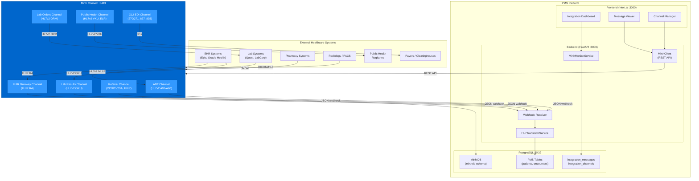

# Product Requirements Document: Mirth Connect Integration into Patient Management System (PMS)

**Document ID:** PRD-PMS-MIRTHCONNECT-001
**Version:** 1.0
**Date:** 2026-03-11
**Author:** Ammar (CEO, MPS Inc.)
**Status:** Draft

---

## 1. Executive Summary

Mirth Connect (officially "Mirth Connect by NextGen Healthcare") is a Java-based, cross-platform healthcare integration engine — widely known as "the Swiss army knife of healthcare integration." It routes, transforms, and filters clinical messages between disparate healthcare systems using standardized formats including HL7v2 (ADT, ORM, ORU, SIU), FHIR R4, CDA/C-CDA, DICOM, X12 EDI, JSON, and XML. The platform supports 10+ connector types (TCP/MLLP, HTTP, JDBC, SFTP, JMS, SMTP, DICOM) and processes messages through a channel-based pipeline: Source → Filter → Transformer → Destination, with JavaScript (Rhino) scripting for custom transformations.

Integrating Mirth Connect into the PMS creates a healthcare interoperability hub that enables the practice to exchange clinical data with external EHR systems (Epic, Oracle Health, athenahealth), laboratory information systems (LIS), pharmacy systems, radiology/PACS, billing clearinghouses, and public health registries. Today, the PMS exists as a standalone system with no ability to receive patient admissions (ADT), lab results (ORU), or referral documents (CCD) from external facilities — and no ability to send lab orders (ORM), prescriptions, or public health reports outbound. Mirth Connect bridges this gap by acting as the message translator and router between the PMS and the broader healthcare ecosystem.

The integration delivers three immediate outcomes: (1) inbound interoperability — receiving ADT feeds, lab results, referral documents, and insurance eligibility responses from external systems and mapping them into PMS patient records and encounters, (2) outbound interoperability — sending lab orders, prescriptions, referral requests, and public health reports from the PMS to external systems in the format each requires (HL7v2, FHIR, X12), and (3) a unified integration dashboard for monitoring all message flows, error queues, and channel statistics from the PMS admin UI.

## 2. Problem Statement

The PMS currently operates as a closed system with no standardized interoperability layer. This creates several critical gaps:

- **No ADT feed ingestion**: When patients are admitted, discharged, or transferred at partner facilities, the PMS has no way to receive these events automatically. Staff must manually enter or look up patient information from faxes, phone calls, or portal messages.
- **No lab result delivery**: Lab results from reference laboratories (Quest, LabCorp, hospital labs) arrive via fax or portal and must be manually transcribed into the PMS — a slow, error-prone process that delays clinical decisions.
- **No outbound lab ordering**: Lab orders created in the PMS cannot be electronically transmitted to laboratory information systems. Clinicians must re-enter orders in the lab's portal or fax requisitions.
- **No standard referral exchange**: Referral documents (CCD/C-CDA) from other EHR systems cannot be ingested into the PMS. Incoming referrals require manual data entry of patient demographics, diagnoses, medications, and allergies.
- **No public health reporting**: Electronic lab reporting (ELR), immunization registry submissions (VXU), and syndromic surveillance — all required by state and federal mandates — must be handled outside the PMS.
- **No X12 EDI integration**: Insurance eligibility (270/271), claims (837), and remittance (835) messages cannot flow directly through a standards-based integration engine.
- **Format translation gap**: External systems speak HL7v2 (MLLP), FHIR (REST), and X12 (EDI). The PMS speaks JSON/REST. There is no translation layer between these worlds.

The PMS already has experiments for FHIR (NextGen FHIR API, Exp 49), insurance eligibility (pVerify Exp 73, FrontRunnerHC Exp 74), and claims (Availity Exp 47). Mirth Connect becomes the integration backbone that connects all of these — receiving HL7v2 from legacy systems, transforming to FHIR or JSON for the PMS, and routing outbound messages in whatever format each destination requires.

## 3. Proposed Solution

### 3.1 Architecture Overview

### 3.2 Deployment Model

- **Docker-based**: `nextgenhealthcare/connect` image for version 4.5.2 (last open-source release under MPL 2.0). Port 8443 for HTTPS admin/API, port 8080 for HTTP listeners, additional ports for MLLP listeners.
- **PostgreSQL backend**: Mirth uses the same PostgreSQL instance (separate `mirthdb` database) for its message store and configuration — sharing infrastructure while maintaining data isolation.
- **Licensing**: Open-source 4.5.2 (MPL 2.0) for initial development and POC. Evaluate commercial 4.6+ license for production if vendor support and security patches are required. Monitor the Open Integration Engine (OIE) community fork as a long-term open-source path.
- **HIPAA compliance**: All Mirth connectors use TLS. User authentication and RBAC for channel management. Full message audit trail in the Mirth database. PHI in messages encrypted in transit and at rest via PostgreSQL disk encryption.
- **Network isolation**: Mirth runs in the internal Docker network. MLLP/HTTP listener ports exposed only to trusted network segments (VPN or VPC peering for external EHR connections).

## 4. PMS Data Sources

Mirth Connect interacts with all PMS APIs as a bidirectional bridge to external systems:

- **Patient Records API (`/api/patients`)**: Inbound ADT messages (HL7v2 A01/A04/A08) create or update patient demographic records. Outbound queries provide patient data for referral documents and public health reports.
- **Encounter Records API (`/api/encounters`)**: Inbound ADT and scheduling (SIU) messages create encounters. Lab results (ORU) are linked to encounters. Outbound encounter data feeds billing channels.
- **Medication & Prescription API (`/api/prescriptions`)**: Inbound medication reconciliation from referral documents (CCD). Outbound prescription orders to pharmacy systems.
- **Reporting API (`/api/reports`)**: Integration statistics (message volumes, error rates, channel health) feed into operational dashboards. Public health reporting channels pull data from the reporting API.

## 5. Component/Module Definitions

### 5.1 MirthClient

**Description**: Python client wrapping the Mirth Connect REST API (port 8443) for channel management, monitoring, and message retrieval.

- **Input**: Channel operations (deploy, start, stop), statistics queries, message searches
- **Output**: Channel status, statistics, message content
- **PMS APIs used**: None (manages Mirth directly)
- **Key features**: Session-based authentication, channel CRUD, deployment control, statistics polling, message search and retrieval

### 5.2 WebhookReceiver

**Description**: FastAPI endpoints that receive transformed JSON payloads from Mirth HTTP Sender destinations. Each Mirth channel transforms its native format (HL7v2, FHIR, CCD) into PMS-compatible JSON and POSTs it to the appropriate webhook.

- **Input**: JSON payloads from Mirth channels (ADT events, lab results, referral documents)
- **Output**: Created/updated PMS records, acknowledgment responses
- **PMS APIs used**: `/api/patients` (create/update), `/api/encounters` (create/link), `/api/prescriptions` (medication reconciliation)
- **Key features**: Endpoint per message type (`/webhooks/mirth/adt`, `/webhooks/mirth/lab-results`, `/webhooks/mirth/referrals`), idempotency via message ID tracking, error queue for failed processing

### 5.3 HL7TransformService

**Description**: Backend service that prepares PMS data for outbound transmission. Formats patient, encounter, and order data into structures that Mirth channels can transform into HL7v2, FHIR, or X12.

- **Input**: PMS entity IDs (patient, encounter, order)
- **Output**: Structured JSON payloads posted to Mirth HTTP Listener channels
- **PMS APIs used**: `/api/patients`, `/api/encounters`, `/api/prescriptions`
- **Key features**: Lab order generation (ORM), referral document assembly, public health report data extraction, eligibility inquiry formatting

### 5.4 MirthMonitorService

**Description**: Polls the Mirth REST API for channel statistics and health, storing results in PostgreSQL for dashboard display and alerting.

- **Input**: Mirth REST API statistics endpoints
- **Output**: Integration dashboard data, alert triggers
- **PMS APIs used**: `/api/reports` (integration metrics)
- **Key features**: Channel health monitoring, message volume tracking, error rate alerting, queue depth monitoring, uptime tracking

### 5.5 ADT Channel (Mirth)

**Description**: Mirth channel receiving HL7v2 ADT messages (A01 Admit, A04 Register, A08 Update, A03 Discharge) via TCP/MLLP from external EHR systems, transforming to JSON, and posting to the PMS webhook.

- **Source**: TCP/MLLP listener on port 6661
- **Transformer**: JavaScript — parse PID (demographics), PV1 (visit), IN1 (insurance), map to PMS JSON schema
- **Destination**: HTTP POST to `http://pms-backend:8000/webhooks/mirth/adt`
- **Response**: HL7 ACK/NAK

### 5.6 Lab Results Channel (Mirth)

**Description**: Mirth channel receiving HL7v2 ORU (Observation Result) messages from laboratory systems, extracting discrete results, and posting to PMS.

- **Source**: TCP/MLLP listener on port 6662
- **Transformer**: JavaScript — parse OBR (order), OBX (observations), map result values, units, reference ranges to PMS lab result schema
- **Destination**: HTTP POST to `http://pms-backend:8000/webhooks/mirth/lab-results`
- **Response**: HL7 ACK/NAK

### 5.7 Lab Orders Channel (Mirth)

**Description**: Mirth channel receiving lab order JSON from the PMS (via HTTP Listener), transforming to HL7v2 ORM, and sending to laboratory systems via MLLP.

- **Source**: HTTP Listener on port 8080, path `/lab-orders`
- **Transformer**: JavaScript — map PMS JSON order to HL7v2 ORM^O01 message with ORC/OBR segments
- **Destination**: TCP/MLLP sender to LIS at configured host:port

### 5.8 FHIR Gateway Channel (Mirth)

**Description**: Bidirectional FHIR R4 channel. Receives FHIR Bundles from FHIR-capable EHRs and converts to PMS JSON. Also converts PMS data to FHIR resources for outbound exchange.

- **Source**: HTTP Listener on port 8080, path `/fhir`
- **Transformer**: JavaScript — map FHIR Patient, Encounter, Observation, MedicationRequest resources to/from PMS schema
- **Destination**: HTTP POST to PMS webhook (inbound) or FHIR server endpoint (outbound)

## 6. Non-Functional Requirements

### 6.1 Security and HIPAA Compliance

- **TLS on all connectors**: MLLP over TLS, HTTPS for REST/webhook connections, encrypted JDBC connections to PostgreSQL
- **Authentication**: Mirth admin requires username/password (LDAP integration available). Webhook endpoints require API key or mTLS
- **RBAC**: Mirth users have granular permissions (view channels, deploy, edit, manage users). PMS integration endpoints require `integration:admin` role
- **Audit logging**: Every message processed by Mirth is logged with timestamp, channel, source, destination, and outcome. Mirth database retains full message content for configurable retention period
- **PHI in messages**: HL7v2, FHIR, and CCD messages contain PHI by design. All network paths must be encrypted. Message storage in PostgreSQL inherits database-level encryption
- **Message pruning**: Configure automatic pruning of message content after retention period (default: 30 days content, 365 days metadata) to limit PHI exposure

### 6.2 Performance

- **Message throughput**: ~1,000–2,000 HL7v2 messages/second (multi-threaded channels, up to 64 threads)
- **Transformation latency**: < 50ms per message for typical HL7v2 → JSON transformation
- **Webhook delivery**: < 100ms from Mirth transformer to PMS webhook response
- **Channel startup**: < 10 seconds per channel deployment
- **Dashboard refresh**: < 5 seconds for statistics update

### 6.3 Infrastructure

- **Docker image**: `nextgenhealthcare/connect:4.5.2` (~500MB with admin UI)
- **Ports**: 8443 (admin/API), 8080 (HTTP listeners), 6661-6670 (MLLP listeners, configurable)
- **PostgreSQL**: Separate `mirthdb` database on existing PostgreSQL instance
- **Memory**: 1–2GB JVM heap for typical deployment (`-Xmx2g` in `mcserver.vmoptions`)
- **CPU**: 2+ cores recommended for multi-threaded channel processing
- **Disk**: 1–10GB for message store (depends on volume and retention)

## 7. Implementation Phases

### Phase 1: Foundation & ADT Ingestion (Sprints 1-2)

- Deploy Mirth Connect 4.5.2 via Docker Compose with PostgreSQL backend
- Implement `MirthClient` for REST API management
- Build `WebhookReceiver` FastAPI endpoints for ADT events
- Create ADT Channel: MLLP source → HL7v2 parser → JSON transformer → PMS webhook
- Build basic Integration Dashboard in Next.js (channel status, statistics)
- Test with sample HL7v2 ADT messages

### Phase 2: Lab Interface & FHIR Gateway (Sprints 3-4)

- Create Lab Results Channel (ORU inbound from LIS)
- Create Lab Orders Channel (ORM outbound to LIS)
- Build FHIR Gateway Channel for FHIR R4 resource exchange
- Implement `HL7TransformService` for outbound message preparation
- Create Referral Channel (CCD/C-CDA inbound)
- Add Message Viewer UI for inspecting processed messages
- Integration testing with lab system simulator

### Phase 3: Advanced Channels & Monitoring (Sprints 5-6)

- Create Public Health reporting channels (ELR, VXU)
- Create X12 EDI channels for eligibility (270/271) and claims (837/835)
- Implement `MirthMonitorService` with alerting
- Build Channel Manager UI for admin operations
- Add error queue management and message reprocessing
- Production hardening: TLS on all connectors, LDAP auth, pruning policies

## 8. Success Metrics

| Metric | Target | Measurement Method |
|--------|--------|--------------------|
| ADT message processing rate | > 100 messages/minute | Mirth channel statistics |
| Lab result delivery time | < 5 minutes from LIS to PMS | End-to-end timestamp comparison |
| Message transformation accuracy | > 99.9% | Error rate monitoring |
| Channel uptime | > 99.5% | Mirth status monitoring |
| Manual data entry reduction | 80% for lab results, 50% for ADT | Staff workflow time tracking |
| Integration error rate | < 0.1% | Error queue depth / total messages |
| Webhook response time | < 100ms P95 | FastAPI endpoint metrics |
| Dashboard data freshness | < 30 seconds | Statistics polling interval |

## 9. Risks and Mitigations

| Risk | Impact | Mitigation |
|------|--------|------------|
| Licensing change (4.5.2 no longer patched) | Security vulnerabilities unpatched | Monitor OIE fork for community patches; budget for commercial 4.6+ license if needed; evaluate Rhapsody as fallback |
| HL7v2 message format variations | Transformation failures from non-standard messages | Build robust error handling with message quarantine; create per-facility transformation profiles |
| MLLP connectivity to external systems | Network/firewall configuration complexity | Use VPN tunnels or VPC peering; document all required firewall rules per interface |
| Message volume spikes | Queue backlog and processing delays | Configure channel threading (up to 64 threads); add message queuing with rate limiting |
| PHI in message store | HIPAA exposure from stored messages | Configure aggressive pruning; encrypt PostgreSQL at rest; restrict Mirth admin access via RBAC |
| Java dependency (JVM) | Additional runtime to manage | Containerized deployment isolates JVM; Docker health checks monitor JVM health |
| Mirth admin GUI is Java Swing | Developer experience friction | Use REST API for programmatic management; build PMS admin UI as a web-based alternative |

## 10. Dependencies

- **Mirth Connect 4.5.2**: Docker image `nextgenhealthcare/connect:4.5.2` (MPL 2.0)
- **PostgreSQL**: Separate `mirthdb` database on existing instance (port 5432)
- **Java Runtime**: Embedded in Docker image (OpenJDK)
- **PMS Backend**: FastAPI service on port 8000 (webhook receiver)
- **PMS Frontend**: Next.js app on port 3000 (integration dashboard)
- **httpx**: `>=0.27.0` — Async HTTP client for Mirth REST API calls
- **Network access**: MLLP ports (6661-6670) accessible from external systems via VPN/VPC
- **External system credentials**: Interface specifications and connection details from partner EHR/LIS/pharmacy systems

## 11. Comparison with Existing Experiments

| Aspect | Mirth Connect (Exp 77) | NextGen FHIR API (Exp 49) | Redis (Exp 76) | Availity (Exp 47) |
|--------|----------------------|--------------------------|---------------|-------------------|
| **Purpose** | Healthcare message routing & transformation | FHIR R4 data import from referring practices | In-memory cache & message broker | Insurance claims submission |
| **Protocols** | HL7v2, FHIR, CCD, DICOM, X12, JSON | FHIR R4 only | Redis protocol (internal) | X12 EDI, REST API |
| **Direction** | Bidirectional hub (all external systems) | Inbound only (from NextGen EHRs) | Internal only (cache/pub-sub) | Outbound (claims), Inbound (remittance) |
| **Relationship** | Mirth can route FHIR messages to/from NextGen | FHIR import could flow through Mirth FHIR channel | Redis caches Mirth webhook payloads for fast processing | X12 claims/eligibility can flow through Mirth EDI channel |
| **Data formats** | HL7v2, FHIR, CCD, DICOM, X12, JSON, XML | FHIR R4 JSON | JSON (internal) | X12 EDI |
| **Infrastructure** | Separate Docker container (Java) | REST API calls from FastAPI | In-process (redis:8-alpine) | REST API calls from FastAPI |

Mirth Connect is the **interoperability backbone** that connects the PMS to the broader healthcare ecosystem. Exp 49 (NextGen FHIR) handles one specific inbound path; Mirth generalizes this to all systems, all formats, bidirectionally. Exp 47 (Availity) handles one specific outbound path (claims); Mirth can route X12 messages through its EDI channel as an alternative or complementary path. Exp 76 (Redis) provides fast internal caching of messages that Mirth delivers.

## 12. Research Sources

### Official Documentation
- [Mirth Connect by NextGen Healthcare](https://www.nextgen.com/solutions/interoperability/mirth-integration-engine) — Official product page and feature overview
- [Mirth Connect GitHub Repository](https://github.com/nextgenhealthcare/connect) — Source code, wiki, and discussions
- [Mirth Connect REST API Documentation](https://docs.nextgen.com/en-US/mirthc2ae-connect-by-nextgen-healthcare-user-guide-3273569/mirthc2ae-connect-rest-api-14421) — Full API reference

### Architecture & Integration
- [Mirth Connect Architecture Guide — IntuitionLabs](https://intuitionlabs.ai/articles/mirth-connect-architecture-integration-engine-guide) — Channel architecture, connectors, transformers
- [Mirth Connect Docker Hub](https://hub.docker.com/r/nextgenhealthcare/connect) — Official Docker image and configuration

### Security & Compliance
- [Mirth Connect Security Best Practices — CapMinds](https://www.capminds.com/blog/mirth-connect-best-practices-for-secure-hl7-integration/) — HIPAA-compliant HL7 integration patterns
- [Mirth Connect and FHIR — CapMinds](https://www.capminds.com/blog/mirth-connect-fhir-how-mirthconnect-supports-the-latest-health-data-standards/) — FHIR R4 processing capabilities

### Ecosystem & Licensing
- [Mirth Connect License Change — Meditecs](https://www.meditecs.com/kb/mirth-connect-license-change/) — Detailed analysis of MPL 2.0 to commercial transition
- [Open Integration Engine — GitHub](https://github.com/OpenIntegrationEngine) — Community fork maintaining open-source path
- [KLAS Integration Engine Rankings](https://klasresearch.com/best-in-klas-ranking/integration-engines/2023/19) — Industry ratings and competitive comparison

## 13. Appendix: Related Documents

- [Mirth Connect Setup Guide](77-MirthConnect-PMS-Developer-Setup-Guide.md)
- [Mirth Connect Developer Tutorial](77-MirthConnect-Developer-Tutorial.md)
- [NextGen FHIR API PRD (Exp 49)](49-PRD-NextGenFHIRAPI-PMS-Integration.md) — FHIR R4 data import (complementary)
- [Redis PRD (Exp 76)](76-PRD-Redis-PMS-Integration.md) — Internal caching for Mirth webhook payloads
- [Availity PRD (Exp 47)](47-PRD-Availity-PMS-Integration.md) — Claims submission (complementary X12 path)
- [Mirth Connect GitHub Wiki](https://github.com/nextgenhealthcare/connect/wiki)
