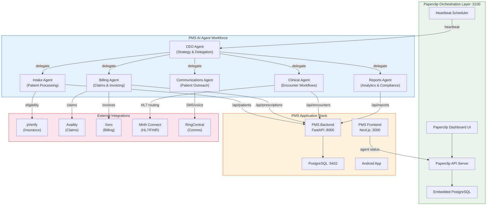

# Product Requirements Document: Paperclip AI Agent Orchestration Integration into Patient Management System (PMS)

**Document ID:** PRD-PMS-PAPERCLIP-001
**Version:** 1.0
**Date:** 2026-03-11
**Author:** Ammar (CEO, MPS Inc.)
**Status:** Draft

---

## 1. Executive Summary

Paperclip is an open-source (MIT licensed) Node.js server and React UI that orchestrates teams of AI agents into company-like structures with org charts, budgets, governance, goal alignment, and audit trails. Originally launched in March 2026, it has rapidly gained traction (14.6k+ GitHub stars) as the leading control plane for multi-agent orchestration — supporting OpenClaw, Claude Code, Codex, Cursor, Bash scripts, and any HTTP-reachable agent.

Integrating Paperclip into the PMS creates an **AI Operations Layer** that automates repetitive clinical and administrative workflows through coordinated agent teams. Instead of one-off scripts or single-agent automation, Paperclip enables a structured "AI workforce" where specialized agents handle patient intake processing, insurance verification orchestration (Exp 73 pVerify), claims submission (Exp 47 Availity), appointment scheduling, lab result routing (Exp 77 Mirth Connect), billing reconciliation (Exp 75 Xero), and report generation — all governed by budget limits, approval gates, and full audit trails.

The value proposition is significant: Paperclip's heartbeat-driven execution, atomic task checkout, persistent agent state, and immutable audit log provide the governance and accountability framework essential for healthcare AI automation. Its multi-company isolation enables MPS to run separate agent organizations per clinic or practice while maintaining centralized oversight — a critical capability for multi-tenant healthcare deployments.

## 2. Problem Statement

The PMS currently integrates with numerous external services (pVerify for eligibility, FrontRunnerHC for provider discovery, Availity for claims, Xero for billing, Mirth Connect for HL7/FHIR routing, RingCentral for communications). Each integration operates independently, requiring manual coordination between workflows. A patient visit triggers a cascade of tasks — verify insurance, check medication interactions, generate encounter notes, submit claims, create invoices, send follow-up communications — that today depend on staff manually triggering each step or fragile sequential scripts with no governance.

Key pain points:
- **No cross-system orchestration**: Staff must manually bridge the gaps between PMS subsystems (e.g., after an encounter closes, someone must trigger claim submission, then invoice generation, then patient communication)
- **No budget or cost control for AI operations**: AI agents (Claude Code for code generation, automation scripts for data processing) run without spending limits or cost attribution
- **No audit trail for AI actions**: When an AI agent modifies patient data, processes a claim, or generates a report, there's no structured record of what happened, why, and at whose authorization
- **No approval gates**: Sensitive operations (PHI access, claim submission, prescription processing) lack structured human-in-the-loop checkpoints
- **Scaling bottleneck**: Adding new automations means writing new bespoke integrations rather than plugging agents into a governed framework

## 3. Proposed Solution

### 3.1 Architecture Overview

### 3.2 Deployment Model

**Self-hosted, Docker-based deployment** within the PMS infrastructure:

- **Runtime**: Node.js 20+ process with embedded PostgreSQL (or external PMS PostgreSQL via `DATABASE_URL`)
- **Ports**: Paperclip API + UI on `:3100`, behind PMS reverse proxy
- **Mode**: `authenticated` deployment mode with API key authentication for agent access
- **Storage**: Local disk at `~/.paperclip/instances/pms/data/storage` for agent artifacts
- **Network**: Internal Docker network only — Paperclip never exposed to public internet
- **Secrets**: `PAPERCLIP_SECRETS_MASTER_KEY` for encrypting agent API keys at rest; `PAPERCLIP_SECRETS_STRICT_MODE=true` to enforce secret references for PHI-adjacent keys

**HIPAA Considerations**:
- Paperclip itself stores no PHI — it stores task metadata, agent configurations, and execution logs
- All PHI remains in the PMS PostgreSQL database; agents interact with PHI only through PMS API endpoints with existing access controls
- Agent API keys are hashed at rest with company-scoped isolation
- Immutable audit log captures every agent action, tool call, and decision for compliance
- Approval gates enforce human review before sensitive operations (claim submission, prescription changes)
- Company-scoped data isolation ensures multi-clinic deployments maintain data boundaries

## 4. PMS Data Sources

Paperclip agents interact with existing PMS APIs through HTTP adapters:

| PMS API | Agent Consumer | Workflow |
|---------|---------------|----------|
| **Patient Records API** (`/api/patients`) | Intake Agent | New patient registration, demographics verification, insurance eligibility checks via pVerify |
| **Encounter Records API** (`/api/encounters`) | Clinical Agent | Encounter lifecycle management, clinical note generation triggers, lab order routing via Mirth Connect |
| **Medication & Prescription API** (`/api/prescriptions`) | Clinical Agent, Billing Agent | Medication interaction checks, prescription processing, prior authorization workflows |
| **Reporting API** (`/api/reports`) | Reports Agent | Automated report generation (daily census, financial summaries, compliance reports), analytics aggregation |
| **Billing endpoints** (Xero, Availity) | Billing Agent | Claim submission, invoice generation, payment reconciliation, aged receivables tracking |
| **Communications endpoints** (RingCentral) | Communications Agent | Appointment reminders, follow-up calls, patient outreach campaigns |

## 5. Component/Module Definitions

### 5.1 PaperclipClient — API Integration Service

**Description**: Python client wrapping Paperclip's REST API for the FastAPI backend to create companies, register agents, submit tasks, and query status.

**Input**: Task definitions, agent configurations, company goals
**Output**: Task status, agent activity logs, cost reports
**PMS APIs**: All — serves as the bridge layer

### 5.2 PMS Agent Adapter — HTTP Webhook Agent

**Description**: Custom HTTP adapter that allows Paperclip heartbeats to trigger PMS backend endpoints. When Paperclip fires a heartbeat, it sends a POST to a PMS webhook endpoint that executes the assigned task using PMS business logic.

**Input**: Heartbeat payload (agent ID, task context, goal ancestry)
**Output**: Task completion status, artifacts, cost metrics
**PMS APIs**: `/api/patients`, `/api/encounters`, `/api/prescriptions`

### 5.3 IntakeOrchestrator — Patient Intake Agent

**Description**: Paperclip agent that automates the patient intake pipeline: receive new patient data → verify demographics → check insurance eligibility (pVerify) → create patient record → trigger welcome communication.

**Input**: Patient registration form data
**Output**: Verified patient record, eligibility status, welcome message sent
**PMS APIs**: `/api/patients`, pVerify integration

### 5.4 BillingOrchestrator — Revenue Cycle Agent

**Description**: Paperclip agent that manages the billing pipeline: encounter closes → generate claim (Availity) → create invoice (Xero) → track payment → reconcile.

**Input**: Completed encounter records
**Output**: Submitted claims, generated invoices, reconciliation reports
**PMS APIs**: `/api/encounters`, `/api/prescriptions`, Availity, Xero integrations

### 5.5 ClinicalWorkflowAgent — Encounter Lifecycle Agent

**Description**: Paperclip agent that orchestrates clinical workflows: encounter opens → check medication interactions → route lab orders (Mirth Connect) → process lab results → update encounter record.

**Input**: Encounter events (open, update, close)
**Output**: Medication alerts, lab orders sent, results processed
**PMS APIs**: `/api/encounters`, `/api/prescriptions`, Mirth Connect integration

### 5.6 GovernanceService — Approval Gate Manager

**Description**: Middleware that enforces human-in-the-loop approval gates for sensitive operations. Integrates with Paperclip's board governance model.

**Input**: Agent action requests requiring approval (claim submission, prescription changes, PHI exports)
**Output**: Approved/rejected action status, approval audit record
**PMS APIs**: All — cross-cutting governance layer

### 5.7 AgentCostDashboard — Budget & Analytics UI

**Description**: React component embedded in PMS frontend showing real-time agent activity, cost per task/project/agent, budget utilization, and governance alerts.

**Input**: Paperclip API data (costs, tasks, agent status)
**Output**: Dashboard visualizations, budget alerts, activity timeline
**PMS APIs**: `/api/reports` for correlation with business metrics

### 5.8 AuditBridge — Compliance Audit Connector

**Description**: Service that syncs Paperclip's immutable audit log with the PMS audit system, ensuring all AI agent actions appear in the unified compliance audit trail.

**Input**: Paperclip activity log events
**Output**: PMS audit records with agent attribution
**PMS APIs**: PMS audit logging system

## 6. Non-Functional Requirements

### 6.1 Security and HIPAA Compliance

| Requirement | Implementation |
|-------------|---------------|
| **PHI isolation** | Paperclip stores zero PHI — only task metadata and agent configs. PHI accessed exclusively through PMS API with existing RBAC |
| **Agent authentication** | Bearer API keys per agent, hashed at rest (`agent_api_keys`). Company-scoped — agents cannot access other companies |
| **Secrets management** | `PAPERCLIP_SECRETS_MASTER_KEY` encrypts sensitive config. `PAPERCLIP_SECRETS_STRICT_MODE=true` enforces secret references |
| **Audit trail** | Immutable append-only log: every instruction, response, tool call, and decision recorded with full tracing |
| **Approval gates** | Board-level governance for sensitive operations: hiring agents, strategy changes, PHI-adjacent workflows |
| **Network isolation** | Paperclip on internal Docker network only, behind PMS reverse proxy. No public internet exposure |
| **Multi-tenant isolation** | Company-scoped data isolation — one deployment serves multiple clinics without data leakage |
| **Access control** | `authenticated` deployment mode with login-required multi-user access |

### 6.2 Performance

| Metric | Target |
|--------|--------|
| Heartbeat latency | < 500ms from trigger to agent wake |
| Task checkout | Atomic, < 100ms with 409 Conflict for contention |
| Dashboard load time | < 2s for agent status and cost views |
| Concurrent agents | 20+ agents across 5+ companies on single deployment |
| Audit log query | < 1s for 30-day activity history |

### 6.3 Infrastructure

| Resource | Specification |
|----------|---------------|
| **Runtime** | Node.js 20+, pnpm 9.15+ |
| **Database** | Embedded PostgreSQL (dev) or external PostgreSQL 15+ (prod) via `DATABASE_URL` |
| **Storage** | Local disk for agent artifacts (~500MB baseline) |
| **Memory** | 512MB minimum, 1GB recommended |
| **Docker** | `docker compose -f docker-compose.quickstart.yml up --build` |
| **Backups** | Automatic 60-min intervals, 30-day retention (configurable) |

## 7. Implementation Phases

### Phase 1: Foundation (Sprints 1–2)

- Deploy Paperclip via Docker alongside PMS stack
- Configure external PostgreSQL connection (`DATABASE_URL`)
- Create PMS company with goal: "Automate PMS clinical and administrative workflows"
- Build PaperclipClient Python wrapper for FastAPI
- Implement PMS Agent Adapter (HTTP webhook receiver)
- Register first agent: IntakeOrchestrator with pVerify integration
- Set up AuditBridge for compliance logging

### Phase 2: Core Orchestration (Sprints 3–4)

- Deploy BillingOrchestrator agent (Availity + Xero)
- Deploy ClinicalWorkflowAgent (Mirth Connect integration)
- Deploy Communications Agent (RingCentral)
- Implement GovernanceService with approval gates for claims and prescriptions
- Build AgentCostDashboard in PMS frontend
- Configure budget limits per agent and project
- End-to-end patient visit workflow: intake → encounter → billing → communication

### Phase 3: Advanced Automation (Sprints 5–6)

- Deploy Reports Agent for automated compliance and financial reporting
- Implement Clipmart-style templates for common clinic workflows
- Multi-clinic deployment with company-per-clinic isolation
- Advanced governance: escalation chains, SLA monitoring, agent performance scoring
- Integration with Redis (Exp 76) for real-time agent status broadcasting via Pub/Sub
- Android app integration: push notifications for approval requests

## 8. Success Metrics

| Metric | Target | Measurement |
|--------|--------|-------------|
| End-to-end patient visit automation rate | 80% of routine visits fully automated | Task completion logs / total encounters |
| Staff time saved per visit | 15+ minutes per encounter | Time tracking before/after comparison |
| Agent task success rate | > 95% tasks completed without human intervention | Paperclip task status analytics |
| Cost per automated workflow | < $0.50 per patient visit | Paperclip cost tracking per task chain |
| Audit compliance coverage | 100% of AI actions in audit trail | AuditBridge sync completeness |
| Mean time to claim submission | < 5 minutes post-encounter close | Billing agent task duration |
| Approval gate response time | < 30 minutes for human approval | GovernanceService metrics |

## 9. Risks and Mitigations

| Risk | Impact | Mitigation |
|------|--------|------------|
| Agent makes incorrect clinical decision | Patient safety, liability | Approval gates for all clinical actions; agents recommend, humans approve |
| Runaway agent cost (token burn) | Budget overrun | Per-agent budget caps, per-task cost limits, automatic throttling at budget threshold |
| Paperclip single point of failure | All automation stops | Health monitoring, automatic restart, graceful degradation to manual workflows |
| PHI leakage through agent context | HIPAA violation | Zero-PHI policy in Paperclip; agents access PHI only through PMS API with RBAC |
| Agent contention on shared tasks | Duplicate work, data conflicts | Atomic task checkout with 409 Conflict; single-assignee constraint |
| Embedded PostgreSQL data loss | Loss of agent configs and audit trail | Automatic backups (60-min intervals, 30-day retention); external PostgreSQL for prod |
| Rapid Paperclip version changes (v0.x) | Breaking changes, migration burden | Pin to stable release, test upgrades in worktree isolation, maintain rollback plan |
| OpenClaw/Claude Code API changes | Agent adapters break | Adapter abstraction layer; test agent compatibility in CI before deployment |

## 10. Dependencies

| Dependency | Version | Purpose |
|------------|---------|---------|
| Paperclip | v0.3.0+ | Agent orchestration platform |
| Node.js | 20+ | Paperclip runtime |
| pnpm | 9.15+ | Paperclip package manager |
| PostgreSQL | 15+ (external) or embedded | Paperclip data store |
| PMS Backend (FastAPI) | Current | API endpoints for agent workflows |
| PMS Frontend (Next.js) | Current | AgentCostDashboard embedding |
| pVerify integration (Exp 73) | Active | Insurance eligibility for Intake Agent |
| Availity integration (Exp 47) | Active | Claims submission for Billing Agent |
| Xero integration (Exp 75) | Active | Invoice generation for Billing Agent |
| Mirth Connect (Exp 77) | Active | HL7/FHIR routing for Clinical Agent |
| RingCentral (Exp 71) | Active | Communications for Comms Agent |
| Redis (Exp 76) | Optional | Real-time agent status Pub/Sub |

## 11. Comparison with Existing Experiments

| Aspect | Paperclip (Exp 78) | n8n (Exp 39) | CrewAI (Exp 42) |
|--------|-------------------|--------------|-----------------|
| **Focus** | Multi-agent company orchestration | Workflow automation (node-based) | Multi-agent task execution |
| **Governance** | Full: org charts, budgets, approval gates, audit | Limited: workflow-level error handling | Basic: role-based delegation |
| **Agent model** | Company hierarchy with heartbeat-driven execution | Trigger → node chain → output | Role-based crew with sequential/parallel tasks |
| **Cost control** | Per-agent, per-task, per-project budget tracking | Per-workflow execution cost | No built-in cost tracking |
| **Audit trail** | Immutable append-only log, full tracing | Execution logs per workflow run | Execution logs per crew run |
| **Multi-tenant** | Native company-scoped isolation | Single workspace | No multi-tenant |
| **Healthcare fit** | Approval gates for clinical actions, HIPAA audit trail | Good for simple automations | Good for research/analysis agents |

Paperclip is **complementary** to n8n and CrewAI: n8n handles deterministic workflow chains (e.g., "when encounter closes, trigger claim"), CrewAI handles ad-hoc research tasks, and Paperclip provides the governance umbrella that coordinates both with budget control, audit trails, and organizational structure.

## 12. Research Sources

### Official Documentation
- [Paperclip GitHub Repository](https://github.com/paperclipai/paperclip) — Source code, README, and development docs
- [Paperclip Official Website](https://paperclip.ing/) — Product overview, features, and Clipmart preview
- [Paperclip Core Concepts](https://github.com/paperclipai/paperclip/blob/master/docs/start/core-concepts.md) — Data models, workflows, and governance framework
- [Paperclip PRODUCT.md](https://github.com/paperclipai/paperclip/blob/master/doc/PRODUCT.md) — Architecture specifications and deployment modes

### Architecture & Technical Details
- [Paperclip DEVELOPING.md](https://github.com/paperclipai/paperclip/blob/master/doc/DEVELOPING.md) — Setup, environment variables, database configuration
- [Paperclip AGENTS.md](https://github.com/paperclipai/paperclip/blob/master/AGENTS.md) — Agent access model and API key authentication

### Ecosystem & Adoption
- [eWeek: Meet Paperclip](https://www.eweek.com/news/meet-paperclip-openclaw-ai-company-tool/) — Overview of Paperclip + OpenClaw integration
- [Flowtivity: Zero-Human Companies](https://flowtivity.ai/blog/zero-human-company-paperclip-ai-agent-orchestration/) — Business implications and feature analysis
- [Vibe Sparking: Paperclip Deep Dive](https://www.vibesparking.com/en/blog/ai/agent-orchestration/2026-03-05-paperclip-open-source-orchestration-zero-human-companies/) — Technical feature analysis and governance model
- [Medium: Zero-Human Company Guide](https://agentnativedev.medium.com/zero-human-company-with-openclaw-claude-and-codex-how-to-build-an-agent-organization-30ca109fe5e8) — Practical setup with OpenClaw, Claude, and Codex

## 13. Appendix: Related Documents

- [Paperclip Setup Guide](78-Paperclip-PMS-Developer-Setup-Guide.md)
- [Paperclip Developer Tutorial](78-Paperclip-Developer-Tutorial.md)
- [Paperclip GitHub Repository](https://github.com/paperclipai/paperclip)
- [Paperclip Core Concepts](https://github.com/paperclipai/paperclip/blob/master/docs/start/core-concepts.md)
- [n8n Workflow Automation (Exp 39)](39-PRD-n8n-PMS-Integration.md)
- [pVerify Insurance Eligibility (Exp 73)](73-PRD-pVerify-PMS-Integration.md)
- [Xero Cloud Accounting (Exp 75)](75-PRD-XeroAPI-PMS-Integration.md)
- [Mirth Connect Healthcare Integration (Exp 77)](77-PRD-MirthConnect-PMS-Integration.md)
