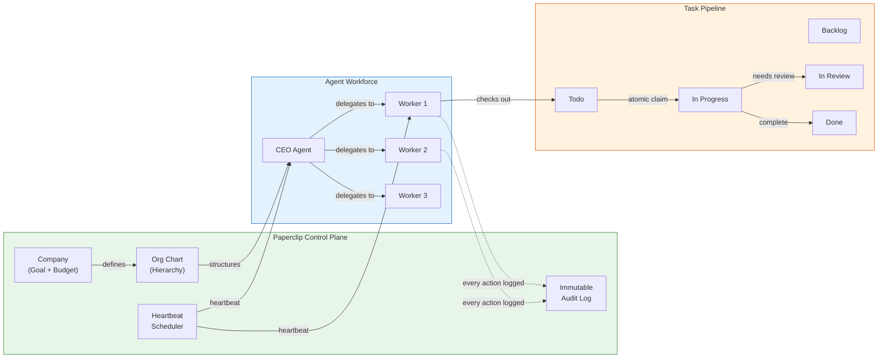
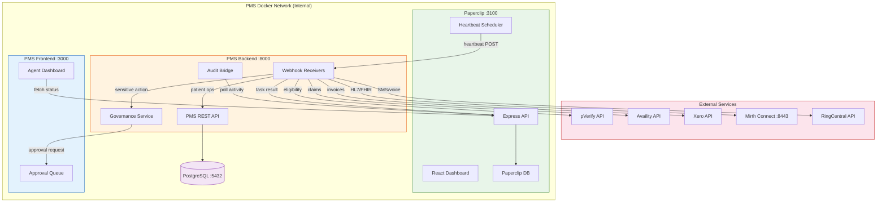

# Paperclip AI Agent Orchestration Developer Onboarding Tutorial

**Welcome to the MPS PMS Paperclip Integration Team**

This tutorial will take you from zero to building your first multi-agent workflow with the PMS. By the end, you will understand how Paperclip orchestrates AI agents, have a running local environment with a PMS agent company, and have built and tested a complete patient visit automation pipeline end-to-end.

**Document ID:** PMS-EXP-PAPERCLIP-002
**Version:** 1.0
**Date:** 2026-03-11
**Applies To:** PMS project (all platforms)
**Prerequisite:** [Paperclip Setup Guide](78-Paperclip-PMS-Developer-Setup-Guide.md)
**Estimated time:** 2-3 hours
**Difficulty:** Beginner-friendly

---

## What You Will Learn

1. What Paperclip is and why it matters for healthcare workflow automation
2. How the company → agent → task → heartbeat model works
3. How Paperclip's org chart, budgets, and governance apply to PMS
4. How to create a company and register agents via the API
5. How to build HTTP webhook adapters that process heartbeats
6. How to implement approval gates for sensitive clinical actions
7. How to track costs per agent, per task, and per project
8. How to monitor agent activity through the AuditBridge
9. How to build a patient visit automation pipeline from intake to billing
10. How to debug agent execution issues using Paperclip's tracing

---

## Part 1: Understanding Paperclip (15 min read)

### 1.1 What Problem Does Paperclip Solve?

A typical patient visit at an MPS clinic triggers a cascade of tasks:

1. **Intake**: Verify demographics, check insurance eligibility (pVerify), create/update patient record
2. **Clinical**: Open encounter, check medication interactions, order labs (Mirth Connect), document visit
3. **Billing**: Generate claim (Availity), create invoice (Xero), track payment
4. **Communications**: Send appointment follow-up, medication reminders (RingCentral)
5. **Reporting**: Update daily census, financial reports, compliance logs

Today, each step is either manual or handled by isolated scripts. There is no unified system that:
- **Coordinates** across all these subsystems automatically
- **Controls costs** of AI-powered automation (token budgets)
- **Enforces approval** before sensitive actions (claim submission, prescription changes)
- **Audits** every AI action for HIPAA compliance
- **Scales** across multiple clinics without data leakage

Paperclip solves this by treating AI agents as employees in a company — with an org chart, budgets, goals, and governance.

### 1.2 How Paperclip Works — The Key Pieces



**Three core concepts:**

1. **Company = Organization**: A company has a goal ("Automate PMS workflows"), a budget, and an org chart of agents. One Paperclip instance can run multiple companies (one per clinic).

2. **Agent = Employee**: Each agent has a role, reports to a manager, has a budget, and connects to an execution runtime (HTTP webhook, Claude Code, Bash script). Agents don't run continuously — they wake on heartbeats.

3. **Issue = Task**: Tasks flow through a lifecycle (backlog → todo → in_progress → in_review → done). Only one agent can "check out" a task at a time (atomic). Every task traces up to the company goal.

### 1.3 How Paperclip Fits with Other PMS Technologies

| Technology | Experiment | Relationship to Paperclip |
|-----------|-----------|--------------------------|
| **n8n** | Exp 39 | Complementary — n8n handles deterministic workflow chains; Paperclip governs the agent layer above |
| **CrewAI** | Exp 42 | Complementary — CrewAI for ad-hoc research tasks; Paperclip for persistent organizational orchestration |
| **Redis** | Exp 76 | Enabler — Redis Pub/Sub broadcasts real-time agent status to the PMS frontend |
| **pVerify** | Exp 73 | Consumer — Intake Agent calls pVerify for eligibility checks |
| **Availity** | Exp 47 | Consumer — Billing Agent submits claims through Availity |
| **Xero** | Exp 75 | Consumer — Billing Agent generates invoices in Xero |
| **Mirth Connect** | Exp 77 | Consumer — Clinical Agent routes HL7/FHIR messages through Mirth |
| **RingCentral** | Exp 71 | Consumer — Communications Agent sends SMS/voice via RingCentral |
| **WebSocket** | Exp 37 | Enabler — WebSocket pushes agent activity to frontend in real-time |

### 1.4 Key Vocabulary

| Term | Meaning |
|------|---------|
| **Company** | Top-level organizational unit with a goal, budget, and agent workforce |
| **Agent** | An AI employee with a role, adapter type, capabilities, and budget |
| **Adapter** | The connection between Paperclip and an agent's execution runtime (HTTP, Claude Code, Bash) |
| **Heartbeat** | A scheduled or event-triggered wake-up signal that activates an agent |
| **Issue** | A unit of work (task) that flows through a lifecycle from backlog to done |
| **Checkout** | Atomic claim of a task by an agent — only one agent can own a task at a time |
| **Goal ancestry** | The chain of parent goals that connects every task to the company objective |
| **Board** | Governance layer that approves hiring, strategy changes, and sensitive actions |
| **Approval gate** | A checkpoint where a human must approve/reject an agent's proposed action |
| **Activity log** | Immutable append-only record of every agent action, tool call, and decision |
| **Budget (cents)** | Cost limit tracked per agent, task, project, and company in hundredths of a dollar |
| **Clipmart** | Marketplace for pre-built company templates (coming soon) |

### 1.5 Our Architecture



---

## Part 2: Environment Verification (15 min)

### 2.1 Checklist

```bash
# 1. Node.js 20+
node --version
# Expected: v20.x.x or higher

# 2. pnpm 9.15+
pnpm --version
# Expected: 9.15.x or higher

# 3. Paperclip running
curl -s http://localhost:3100/api/health | python3 -m json.tool
# Expected: {"status": "ok"}

# 4. PMS Backend running
curl -s http://localhost:8000/api/health | python3 -m json.tool
# Expected: {"status": "ok"}

# 5. PMS Frontend running
curl -s -o /dev/null -w "%{http_code}" http://localhost:3000
# Expected: 200

# 6. PostgreSQL running
psql -U pms_user -d pms_db -c "SELECT 1;" 2>/dev/null && echo "OK"
# Expected: OK

# 7. Paperclip database exists
psql -U paperclip_user -d paperclip_db -c "SELECT 1;" 2>/dev/null && echo "OK"
# Expected: OK
```

### 2.2 Quick Test

Run the bootstrap script to verify end-to-end connectivity:

```bash
cd ~/Projects/pms/pms-backend
python3 scripts/paperclip_bootstrap.py
```

If you see "PMS Paperclip bootstrap complete!" — everything is working. If not, refer to the [Setup Guide troubleshooting section](78-Paperclip-PMS-Developer-Setup-Guide.md#7-troubleshooting).

---

## Part 3: Build Your First Integration (45 min)

### 3.1 What We Are Building

We will build a **Patient Visit Automation Pipeline** that:

1. A new patient arrives → **Intake Agent** verifies demographics and checks insurance eligibility
2. Encounter opens → **Clinical Agent** checks medication interactions
3. Encounter closes → **Billing Agent** submits a claim and creates an invoice
4. After billing → **Communications Agent** sends a follow-up message

This demonstrates Paperclip's delegation chain, heartbeat execution, atomic task checkout, approval gates, and cost tracking.

### 3.2 Step 1 — Create the PMS Agent Company

If you haven't run the bootstrap script yet:

```python
# In a Python shell or script
import asyncio
from app.integrations.paperclip.client import PaperclipClient, PaperclipConfig, AgentConfig

async def create_company():
    client = PaperclipClient(PaperclipConfig())

    company = await client.create_company(
        name="MPS Clinic Alpha",
        goal="Automate patient visit workflows from intake to billing",
        budget_cents=100000,  # $1,000 starting budget
    )
    print(f"Company ID: {company['id']}")
    await client.close()
    return company['id']

company_id = asyncio.run(create_company())
```

Save the `company_id` — you'll need it for the remaining steps.

### 3.3 Step 2 — Register the Agent Team

```python
async def register_agents(company_id: str):
    client = PaperclipClient(PaperclipConfig())

    # CEO Agent — delegates to specialists
    ceo = await client.register_agent(company_id, AgentConfig(
        name="clinic-alpha-ceo",
        title="Clinic Operations Director",
        adapter_type="http",
        adapter_config={"webhook_url": "http://localhost:8000/api/paperclip/webhooks/intake"},
        capabilities="Oversees all clinic automation workflows",
        budget_cents=20000,
    ))

    # Intake Agent
    intake = await client.register_agent(company_id, AgentConfig(
        name="clinic-alpha-intake",
        title="Patient Intake Specialist",
        adapter_type="http",
        adapter_config={"webhook_url": "http://localhost:8000/api/paperclip/webhooks/intake"},
        capabilities="Patient registration, demographics, insurance eligibility",
        reports_to=ceo["id"],
        budget_cents=25000,
    ))

    # Billing Agent
    billing = await client.register_agent(company_id, AgentConfig(
        name="clinic-alpha-billing",
        title="Revenue Cycle Manager",
        adapter_type="http",
        adapter_config={"webhook_url": "http://localhost:8000/api/paperclip/webhooks/billing"},
        capabilities="Claims submission, invoice generation, payment tracking",
        reports_to=ceo["id"],
        budget_cents=30000,
    ))

    print(f"CEO: {ceo['id']}")
    print(f"Intake: {intake['id']}")
    print(f"Billing: {billing['id']}")

    await client.close()
    return {"ceo": ceo["id"], "intake": intake["id"], "billing": billing["id"]}

agents = asyncio.run(register_agents(company_id))
```

**Checkpoint**: You have a company with 3 agents in a hierarchy (CEO → Intake, Billing).

### 3.4 Step 3 — Create a Patient Visit Task Chain

```python
from app.integrations.paperclip.client import TaskCreate

async def create_visit_tasks(company_id: str, agents: dict):
    client = PaperclipClient(PaperclipConfig())

    # Parent task: the overall patient visit
    visit = await client.create_task(company_id, TaskCreate(
        title="Process patient visit: John Smith (2026-03-11)",
        description="Full patient visit automation: intake → clinical → billing → follow-up",
        priority="high",
        labels=["patient-visit", "automation"],
    ))

    # Child task 1: Intake
    intake_task = await client.create_task(company_id, TaskCreate(
        title="Intake: Verify John Smith demographics and insurance",
        description="Check demographics, verify insurance via pVerify, create/update record",
        priority="high",
        assignee_id=agents["intake"],
        parent_id=visit["id"],
        labels=["intake"],
    ))

    # Child task 2: Billing (depends on encounter completion)
    billing_task = await client.create_task(company_id, TaskCreate(
        title="Billing: Submit claim and invoice for John Smith visit",
        description="Generate claim via Availity, create invoice in Xero",
        priority="medium",
        assignee_id=agents["billing"],
        parent_id=visit["id"],
        labels=["billing"],
    ))

    print(f"Visit task: {visit['id']}")
    print(f"Intake task: {intake_task['id']} → assigned to intake agent")
    print(f"Billing task: {billing_task['id']} → assigned to billing agent")

    await client.close()

asyncio.run(create_visit_tasks(company_id, agents))
```

**Checkpoint**: Task hierarchy created — parent visit task with intake and billing child tasks.

### 3.5 Step 4 — Simulate Heartbeat Execution

Now simulate what happens when Paperclip fires a heartbeat to the Intake Agent:

```bash
# Simulate Intake Agent heartbeat
curl -s -X POST http://localhost:8000/api/paperclip/webhooks/intake \
  -H "Content-Type: application/json" \
  -H "Authorization: Bearer intake-agent-key" \
  -d '{
    "agent_id": "clinic-alpha-intake",
    "agent_name": "clinic-alpha-intake",
    "company_id": "'$COMPANY_ID'",
    "task_id": "intake-task-001",
    "task_title": "Intake: Verify John Smith demographics and insurance",
    "goal_ancestry": ["Process patient visit: John Smith", "Automate patient visit workflows"],
    "context": {
      "patient_data": {
        "first_name": "John",
        "last_name": "Smith",
        "dob": "1985-06-15",
        "insurance_id": "BCBS-123456789"
      }
    }
  }' | python3 -m json.tool
```

Expected response:
```json
{
  "status": "completed",
  "result": {
    "patient_created": true,
    "eligibility_verified": true,
    "welcome_message_sent": true
  },
  "cost_cents": 5,
  "artifacts": ["patient_record", "eligibility_report"],
  "next_action": null
}
```

### 3.6 Step 5 — Test Approval Gate for Billing

The Billing Agent's claim submission requires human approval:

```bash
# 1. Request approval for claim submission
APPROVAL_RESPONSE=$(curl -s -X POST http://localhost:8000/api/paperclip/governance/request-approval \
  -H "Content-Type: application/json" \
  -d '{
    "agent_id": "clinic-alpha-billing",
    "agent_name": "clinic-alpha-billing",
    "company_id": "'$COMPANY_ID'",
    "task_id": "billing-task-001",
    "action_type": "claim_submission",
    "description": "Submit claim for John Smith encounter (CPT: 99213, ICD-10: J06.9)",
    "risk_level": "high",
    "context": {
      "encounter_id": "ENC-2026-5678",
      "claim_amount_cents": 15000,
      "payer": "BCBS"
    }
  }')

echo "$APPROVAL_RESPONSE" | python3 -m json.tool
# Status will be "pending"

# 2. Extract request_id
REQUEST_ID=$(echo "$APPROVAL_RESPONSE" | python3 -c "import sys,json; print(json.load(sys.stdin)['request_id'])")

# 3. View pending approvals
curl -s http://localhost:8000/api/paperclip/governance/pending | python3 -m json.tool

# 4. Approve the claim (as a human reviewer)
curl -s -X POST "http://localhost:8000/api/paperclip/governance/approve/$REQUEST_ID?reviewer=dr_johnson&notes=Verified%20CPT%20and%20diagnosis%20codes" \
  | python3 -m json.tool
# Status will be "approved"

# 5. Now the Billing Agent can proceed with claim submission
curl -s -X POST http://localhost:8000/api/paperclip/webhooks/billing \
  -H "Content-Type: application/json" \
  -H "Authorization: Bearer billing-agent-key" \
  -d '{
    "agent_id": "clinic-alpha-billing",
    "agent_name": "clinic-alpha-billing",
    "company_id": "'$COMPANY_ID'",
    "task_id": "billing-task-001",
    "task_title": "Billing: Submit claim and invoice for John Smith",
    "context": {"encounter_id": "ENC-2026-5678"}
  }' | python3 -m json.tool
```

**Checkpoint**: You've completed a full patient visit pipeline — intake processing, approval gate for billing, and claim submission — all through Paperclip's orchestration model.

---

## Part 4: Evaluating Strengths and Weaknesses (15 min)

### 4.1 Strengths

- **Governance-first design**: Org charts, budgets, approval gates, and immutable audit logs are first-class features — not afterthoughts. Essential for healthcare compliance.
- **Agent-agnostic**: Works with Claude Code, OpenClaw, Codex, Cursor, Bash, or any HTTP endpoint. No lock-in to a specific AI provider.
- **Multi-company isolation**: Native support for running separate agent organizations per clinic — critical for multi-tenant healthcare deployments.
- **Atomic task management**: Task checkout prevents double-work. Only one agent owns a task at a time.
- **Persistent agent state**: Agents resume context across heartbeats instead of restarting from scratch, reducing token waste.
- **Cost control**: Per-agent, per-task, per-project budget tracking with automatic throttling at limits.
- **MIT licensed, self-hosted**: No vendor dependency, no data leaving your infrastructure, full source code access.
- **Rapid traction**: 14.6k+ GitHub stars in < 2 weeks, active community, frequent releases.

### 4.2 Weaknesses

- **Very early stage (v0.3.0)**: API surface will change. Not yet production-hardened for mission-critical healthcare workflows.
- **No native HIPAA certification**: Paperclip itself has no BAA or HIPAA compliance certification. The PHI isolation is your responsibility to architect.
- **Node.js single-process**: Currently runs as one Node.js process. No built-in horizontal scaling or HA clustering.
- **Limited documentation**: Core concepts are documented but many API endpoints lack detailed reference docs.
- **No native real-time push**: Dashboard polls for updates; no WebSocket/SSE streaming of agent events (must build with Redis Pub/Sub or similar).
- **Embedded PostgreSQL for dev only**: Production requires external PostgreSQL setup and management.
- **Heartbeat-driven only**: Agents don't run continuously — they wake on schedule. Sub-second response times require short heartbeat intervals, which increase resource usage.

### 4.3 When to Use Paperclip vs Alternatives

| Scenario | Best Choice | Why |
|----------|------------|-----|
| Multi-agent company with budgets and governance | **Paperclip** | Purpose-built for organizational orchestration |
| Simple trigger → action workflows | **n8n** (Exp 39) | Visual workflow builder, no agent overhead |
| Ad-hoc multi-agent research tasks | **CrewAI** (Exp 42) | Lighter-weight for one-off agent collaboration |
| Complex stateful workflows with branching | **LangGraph** | Graph-based state machines with durable execution |
| Single-agent coding tasks | **Claude Code** / **Codex** | Direct agent usage without orchestration overhead |
| High-throughput event processing | **Mirth Connect** (Exp 77) | Purpose-built for healthcare message routing |

**Use Paperclip when**: You need multiple agents working together with cost control, approval gates, audit trails, and organizational structure — especially across multiple clinics.

### 4.4 HIPAA / Healthcare Considerations

| Concern | Assessment | Mitigation |
|---------|-----------|------------|
| **PHI storage** | Paperclip stores no PHI by design — only task metadata | Enforce via code review; never put PHI in task titles/descriptions |
| **Audit trail** | Immutable append-only log covers all agent actions | Sync to PMS audit system via AuditBridge for unified compliance |
| **Access control** | Agent API keys hashed at rest, company-scoped | Use `authenticated` deployment mode; rotate keys regularly |
| **Approval gates** | Board governance model with human-in-the-loop | Configure gates for all PHI-adjacent and financial operations |
| **Network exposure** | Self-hosted, internal Docker network | Never expose Paperclip to public internet; use reverse proxy |
| **BAA** | No BAA available (open-source, self-hosted) | Responsibility falls on your infrastructure security posture |
| **Data isolation** | Multi-company scoping with separate data per company | Map one company per clinic for tenant isolation |

---

## Part 5: Debugging Common Issues (15 min read)

### Issue 1: Agent Heartbeat Never Fires

**Symptom**: Agent shows as "idle" in dashboard, no webhook calls in PMS backend logs.

**Cause**: Heartbeat schedule not configured for the agent.

**Fix**: Check the agent's heartbeat configuration in the Paperclip dashboard. Ensure a schedule interval is set (e.g., every 5 minutes). Verify the agent status is "active", not "paused".

### Issue 2: 409 Conflict on Task Checkout

**Symptom**: Agent receives 409 when trying to start a task.

**Cause**: Another agent already checked out this task (atomic constraint).

**Fix**: This is expected behavior — Paperclip prevents double-work. Check which agent owns the task via the API. If the owning agent is stuck, manually reassign the task.

### Issue 3: Webhook Returns 500 Internal Server Error

**Symptom**: Paperclip heartbeat fires but the PMS webhook returns 500.

**Cause**: Unhandled exception in the webhook handler.

**Fix**: Check PMS backend logs (`docker logs pms-backend`). The webhook handlers in `app/integrations/paperclip/webhook.py` wrap everything in try/except, but a missing dependency or database error may not be caught. Add specific error handling for the failing step.

### Issue 4: Budget Exhausted — Agent Throttled

**Symptom**: Agent tasks fail with "budget exceeded" error.

**Cause**: Agent has spent its allocated budget.

**Fix**: Check agent costs via `curl http://localhost:3100/api/companies/COMPANY_ID/costs`. Either increase the agent's budget or wait for the next billing cycle reset. Review which tasks are consuming the most tokens.

### Issue 5: Approval Request Expires

**Symptom**: Agent action is blocked indefinitely waiting for approval.

**Cause**: No human reviewed the approval request before the `expires_at` deadline.

**Fix**: Set up notifications (email, Slack via webhook) when approval requests are created. Monitor the `/api/paperclip/governance/pending` endpoint. Consider shorter heartbeat intervals for agents waiting on approvals.

### Issue 6: AuditBridge Missing Entries

**Symptom**: Some agent actions don't appear in the PMS audit log.

**Cause**: AuditBridge polling interval is too long, or the bridge crashed silently.

**Fix**: Check AuditBridge logs. Reduce `poll_interval_seconds` (e.g., from 30 to 10). Ensure the bridge is running as a background task in the FastAPI startup lifecycle. Add health monitoring for the bridge process.

---

## Part 6: Practice Exercise (45 min)

### Option A: Lab Results Processing Pipeline

Build a pipeline where:
1. Mirth Connect receives a lab result (HL7 ORU message)
2. PMS webhook creates a task in Paperclip for the Clinical Agent
3. Clinical Agent processes the result, flags abnormals, and updates the encounter
4. If critical results found, trigger an approval gate before notifying the provider
5. Communications Agent sends the notification after approval

**Hints**:
- Create a new webhook endpoint `/api/paperclip/webhooks/lab-results`
- Use Mirth Connect's HTTP Sender to POST to PMS backend
- The Clinical Agent's heartbeat handler should check for `action: "process_lab_results"`
- Abnormal results (OBX-8 = "H" or "L") should trigger the approval gate

### Option B: Multi-Clinic Agent Deployment

Set up two separate Paperclip companies representing two clinics:
1. "MPS Clinic Alpha" — full agent team (intake, billing, clinical, comms)
2. "MPS Clinic Beta" — reduced team (intake, billing only)
3. Verify data isolation: agents in Clinic Alpha cannot see Clinic Beta's tasks
4. Run a patient visit through each clinic and verify separate audit trails
5. Build a "Super Admin" dashboard page that shows agent status across both companies

**Hints**:
- Call `create_company()` twice with different names/goals
- Register different agent teams per company
- Use separate company IDs in API calls
- Build a frontend component that iterates over multiple company IDs

### Option C: Cost Optimization Dashboard

Build an analytics page that:
1. Queries Paperclip cost data for the last 30 days
2. Shows cost trends by agent (line chart)
3. Identifies the most expensive task types
4. Calculates cost-per-patient-visit
5. Recommends budget adjustments based on historical usage

**Hints**:
- Use the `/api/companies/{id}/costs` endpoint with date range parameters
- Group costs by agent and by task labels
- Calculate averages per task type for the cost-per-visit metric
- Use a charting library (recharts, chart.js) for visualizations

---

## Part 7: Development Workflow and Conventions

### 7.1 File Organization

```
pms-backend/
├── app/
│   └── integrations/
│       └── paperclip/
│           ├── __init__.py
│           ├── client.py            # PaperclipClient API wrapper
│           ├── webhook.py           # Heartbeat webhook receivers
│           ├── governance.py        # Approval gate service
│           └── audit_bridge.py      # Audit log sync
├── scripts/
│   └── paperclip_bootstrap.py       # Company & agent setup
└── tests/
    └── integrations/
        └── paperclip/
            ├── test_client.py
            ├── test_webhooks.py
            └── test_governance.py

pms-frontend/
├── lib/
│   └── paperclip.ts                 # API client
├── components/
│   └── paperclip/
│       └── AgentCostDashboard.tsx    # Dashboard component
└── app/
    └── admin/
        └── agents/
            └── page.tsx             # Dashboard page
```

### 7.2 Naming Conventions

| Item | Convention | Example |
|------|-----------|---------|
| Agent names | `{clinic}-{role}` | `clinic-alpha-intake` |
| Task labels | kebab-case categories | `patient-visit`, `billing`, `recurring` |
| Webhook paths | `/api/paperclip/webhooks/{role}` | `/api/paperclip/webhooks/billing` |
| Company names | "MPS {Clinic Name}" | "MPS Clinic Alpha" |
| Python modules | Snake case under `integrations/paperclip/` | `audit_bridge.py` |
| TypeScript modules | camelCase under `lib/` | `paperclip.ts` |
| React components | PascalCase under `components/paperclip/` | `AgentCostDashboard.tsx` |
| Environment variables | `PAPERCLIP_` prefix | `PAPERCLIP_SECRETS_MASTER_KEY` |

### 7.3 PR Checklist

- [ ] No PHI in Paperclip task titles, descriptions, or context fields
- [ ] Agent API keys loaded from environment/secrets, not hardcoded
- [ ] Approval gates configured for all sensitive operations (claims, prescriptions, PHI exports)
- [ ] Webhook handlers have proper error handling with status codes
- [ ] Cost tracking (`cost_cents`) reported in all heartbeat responses
- [ ] AuditBridge sync verified for new agent actions
- [ ] Budget limits set for all new agents
- [ ] Tests cover webhook handlers and governance flow
- [ ] `PAPERCLIP_SECRETS_STRICT_MODE=true` in production config

### 7.4 Security Reminders

1. **Zero PHI in Paperclip**: Never put patient names, DOB, SSN, diagnoses, or medications in task titles/descriptions. Use record IDs only (e.g., "Process encounter ENC-5678" not "Process encounter for John Smith diabetes follow-up").
2. **Rotate agent API keys**: Rotate bearer tokens quarterly. Keys are hashed at rest but should still be cycled.
3. **Network isolation**: Paperclip must never be exposed to the public internet. Keep it on the internal Docker network behind the PMS reverse proxy.
4. **Approval gates for PHI access**: Any agent action that reads or modifies PHI must go through the GovernanceService approval flow.
5. **Audit everything**: Ensure AuditBridge is running and syncing. Compliance auditors need a complete trail of AI actions.

---

## Part 8: Quick Reference Card

### Key Commands

```bash
# Start Paperclip
cd paperclip-orchestrator && pnpm dev       # Dev mode
pnpm paperclipai run                        # Bootstrap + start
docker compose -f docker-compose.quickstart.yml up --build  # Docker

# Database
pnpm db:migrate                             # Apply migrations
pnpm db:generate                            # Generate migration

# API Health
curl http://localhost:3100/api/health
```

### Key Files

| File | Purpose |
|------|---------|
| `app/integrations/paperclip/client.py` | Async API wrapper |
| `app/integrations/paperclip/webhook.py` | Heartbeat receivers |
| `app/integrations/paperclip/governance.py` | Approval gates |
| `app/integrations/paperclip/audit_bridge.py` | Audit log sync |
| `scripts/paperclip_bootstrap.py` | Company setup script |
| `lib/paperclip.ts` | Frontend API client |
| `components/paperclip/AgentCostDashboard.tsx` | Dashboard UI |

### Key URLs

| URL | Purpose |
|-----|---------|
| http://localhost:3100 | Paperclip Dashboard |
| http://localhost:3100/api/health | API health check |
| http://localhost:3100/api/companies | List companies |
| http://localhost:8000/api/paperclip/governance/pending | Pending approvals |
| http://localhost:3000/admin/agents | PMS Agent Dashboard |

### Starter Template — New Agent Webhook

```python
@router.post("/my-agent", response_model=HeartbeatResponse)
async def my_agent_heartbeat(
    payload: HeartbeatPayload,
    agent_role: str = Depends(verify_agent_key),
):
    if not payload.task_id:
        return HeartbeatResponse(status="completed", result={"message": "No work"})

    try:
        # Your agent logic here
        result = {"done": True}
        return HeartbeatResponse(
            status="completed", result=result, cost_cents=5
        )
    except Exception as e:
        return HeartbeatResponse(status="failed", result={"error": str(e)})
```

---

## Next Steps

1. **Configure heartbeat schedules** for each agent in the Paperclip dashboard — set appropriate intervals based on urgency (intake: 2min, billing: 5min, reports: 30min)
2. **Integrate with Redis (Exp 76)** to broadcast real-time agent status via Pub/Sub to the frontend
3. **Build the full Clinical Agent** with Mirth Connect (Exp 77) HL7 message routing for lab orders and results
4. **Set up multi-clinic deployment** with one Paperclip company per clinic for data isolation
5. **Explore Clipmart templates** when available — pre-built clinic workflow templates to accelerate deployment across new practices
