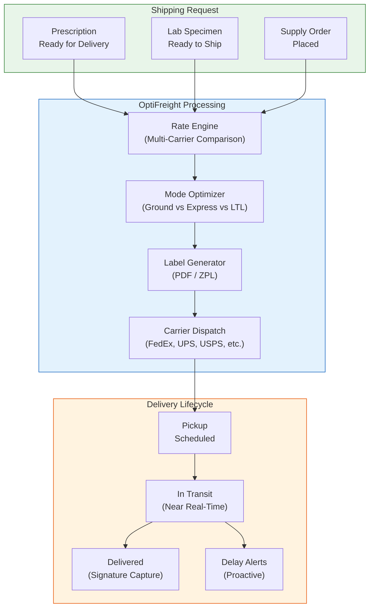
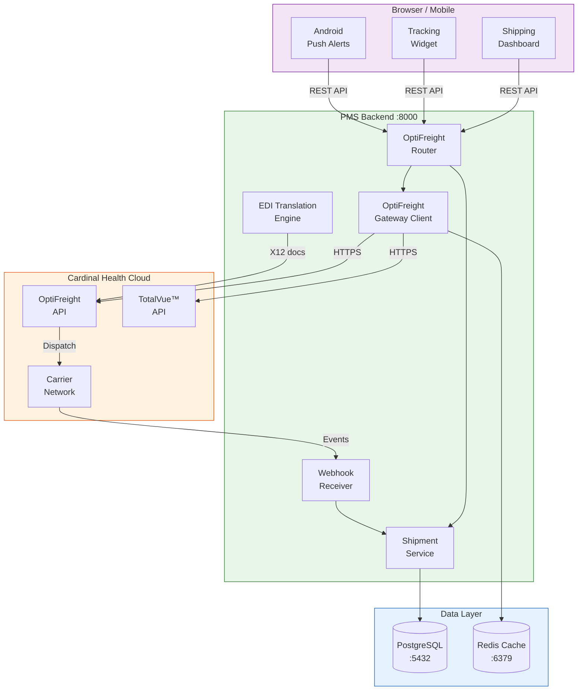

# OptiFreight Logistics Developer Onboarding Tutorial

**Welcome to the MPS PMS OptiFreight Integration Team**

This tutorial will take you from zero to building your first shipping integration with the PMS using Cardinal Health's OptiFreight® Logistics platform. By the end, you will understand how OptiFreight works, have a running local environment, and have built and tested a prescription-to-delivery shipping workflow end-to-end.

**Document ID:** PMS-EXP-OPTIFREIGHT-002
**Version:** 1.0
**Date:** 2026-03-11
**Applies To:** PMS project (all platforms)
**Prerequisite:** [OptiFreight Setup Guide](79-OptiFreight-PMS-Developer-Setup-Guide.md)
**Estimated time:** 2-3 hours
**Difficulty:** Beginner-friendly

---

## What You Will Learn

1. What OptiFreight® Logistics is and why it matters for healthcare shipping
2. How the TotalVue™ Insights platform provides tracking and analytics
3. How EDI X12 transactions work for supply chain integration
4. How to create shipments from PMS prescription data
5. How to generate and download shipping labels programmatically
6. How to track shipments with real-time webhook updates
7. How to compare carrier rates for cost optimization
8. How to build a shipping dashboard in the PMS frontend
9. How to handle HIPAA compliance for shipping data
10. How to debug common shipping integration issues

## Part 1: Understanding OptiFreight (15 min read)

### 1.1 What Problem Does OptiFreight Solve?

When a pharmacy fills a prescription for delivery, or a lab needs to ship specimens, or a clinic orders medical supplies, the shipping process is manual and fragmented:

1. Staff logs into the OptiFreight portal separately
2. Manually enters recipient address (already in the PMS)
3. Selects shipping mode (without cost comparison data)
4. Prints a label from the portal
5. Writes the tracking number on a sticky note
6. Later checks tracking on a carrier website
7. Has no automated way to alert patients about delays

This wastes 15-30 minutes per shipment and creates data silos. OptiFreight integration eliminates this by connecting shipping directly to patient records and prescriptions.

### 1.2 How OptiFreight Works — The Key Pieces



OptiFreight works in three stages:

1. **Request**: A shipping need originates from the PMS — a prescription fulfillment, a lab specimen, or a supply order. The PMS sends the recipient, package details, and priority to OptiFreight.

2. **Processing**: OptiFreight compares rates across its carrier network, recommends the optimal shipping mode, generates a carrier-specific label, and dispatches the package.

3. **Tracking**: From pickup to delivery, OptiFreight provides near real-time status updates via TotalVue™, including proactive delay alerts.

### 1.3 How OptiFreight Fits with Other PMS Technologies

| Technology | Experiment | Relationship to OptiFreight |
|-----------|------------|----------------------------|
| FedEx API | Exp 64 | Direct carrier — OptiFreight may route through FedEx |
| UPS API | Exp 65 | Direct carrier — OptiFreight may route through UPS |
| OnTime 360 | Exp 66 | Local delivery — complementary for same-day courier |
| Redis | Exp 76 | Caching — stores tracking data for fast UI updates |
| Mirth Connect | Exp 77 | EDI engine — can translate X12 transactions for OptiFreight |
| Paperclip | Exp 78 | Agent orchestration — shipping agent in multi-agent workflow |
| RingCentral | Exp 71 | Communications — SMS delivery notifications via RingCentral |
| pVerify | Exp 73 | Eligibility — verify insurance covers shipping charges |

### 1.4 Key Vocabulary

| Term | Meaning |
|------|---------|
| **OptiFreight®** | Cardinal Health's healthcare-specialized shipping management platform |
| **TotalVue™ Insights** | Cloud analytics suite: Tracking, Analytics, and Reporting modules |
| **Mode Optimization** | Algorithmic selection of cheapest/fastest shipping mode for a package |
| **LTL** | Less-than-Truckload — freight shipping for larger/heavier healthcare equipment |
| **EDI X12** | Electronic Data Interchange standard for business documents (856 ASN, 810 Invoice, 850 PO) |
| **ASN (856)** | Advance Ship Notice — required notification before shipment arrives at Cardinal Health facility |
| **BAA** | Business Associate Agreement — HIPAA contract covering third-party PHI handling |
| **ZPL** | Zebra Programming Language — thermal label printer format used in shipping |
| **PHI Minimization** | Principle of sending only the minimum necessary patient data for shipping |
| **Carrier Network** | OptiFreight's contracted carriers: FedEx, UPS, USPS, regional carriers |
| **Shipment Protection** | OptiFreight's insurance/claims service for lost or damaged healthcare shipments |
| **Reference ID** | PMS-generated identifier (e.g., prescription ID) attached to a shipment for traceability |

### 1.5 Our Architecture



## Part 2: Environment Verification (15 min)

### 2.1 Checklist

Run each command and verify the expected output:

1. **PMS Backend running**:
   ```bash
   curl -s http://localhost:8000/health
   # Expected: {"status": "healthy"}
   ```

2. **PostgreSQL accessible**:
   ```bash
   psql -h localhost -U pms -d pms_db -c "SELECT COUNT(*) FROM optifreight_shipments;"
   # Expected: count = 0 (fresh install)
   ```

3. **Redis running**:
   ```bash
   redis-cli -n 2 ping
   # Expected: PONG
   ```

4. **OptiFreight routes registered**:
   ```bash
   curl -s http://localhost:8000/openapi.json | python -c "
   import sys, json
   paths = json.load(sys.stdin)['paths']
   of_paths = [p for p in paths if 'optifreight' in p]
   for p in of_paths:
       print(p)
   "
   # Expected: /api/shipping/optifreight/shipments, /rates, /webhooks/tracking, etc.
   ```

5. **Environment variables set**:
   ```bash
   python -c "
   from app.core.config import settings
   assert settings.OPTIFREIGHT_PORTAL_URL, 'Missing OPTIFREIGHT_PORTAL_URL'
   assert settings.OPTIFREIGHT_CLIENT_ID, 'Missing OPTIFREIGHT_CLIENT_ID'
   print('OptiFreight config: OK')
   "
   ```

6. **Next.js frontend running**:
   ```bash
   curl -s -o /dev/null -w "%{http_code}" http://localhost:3000/shipping
   # Expected: 200
   ```

### 2.2 Quick Test

Run a rate quote to verify end-to-end connectivity:

```bash
TOKEN=$(curl -s -X POST http://localhost:8000/api/auth/login \
  -H "Content-Type: application/json" \
  -d '{"username":"admin","password":"admin"}' | python -c "import sys,json; print(json.load(sys.stdin)['access_token'])")

curl -s "http://localhost:8000/api/shipping/optifreight/rates?dest_zip=10001&weight_lbs=1.0" \
  -H "Authorization: Bearer $TOKEN" | python -m json.tool
```

If you get rate quotes back, your environment is ready.

## Part 3: Build Your First Integration (45 min)

### 3.1 What We Are Building

We will build a **Prescription Delivery Shipping** workflow:

1. A pharmacist marks a prescription as "ready for delivery" in the PMS
2. The system automatically fetches the patient's address
3. Gets rate quotes from OptiFreight
4. Creates a shipment with the optimal mode
5. Generates a shipping label
6. Attaches the tracking number to the prescription record
7. Sends a tracking link to the patient (mock)

### 3.2 Create the Shipping Service

Create `app/integrations/optifreight/shipping_service.py`:

```python
"""Service layer connecting PMS prescriptions to OptiFreight shipping."""

import logging
from typing import Optional

from app.integrations.optifreight.client import (
    OptiFreightClient,
    ShipmentRequest,
    ShipmentResponse,
)

logger = logging.getLogger(__name__)


class PrescriptionShippingService:
    """Orchestrates prescription → shipment workflow."""

    def __init__(self, optifreight: OptiFreightClient, db_session):
        self.optifreight = optifreight
        self.db = db_session

    async def ship_prescription(
        self,
        prescription_id: int,
        service_mode: str = "GROUND",
        user_id: str = "system",
    ) -> ShipmentResponse:
        """
        Ship a prescription to the patient's address.

        Steps:
        1. Load prescription and patient records
        2. Build shipment request from PMS data
        3. Create shipment via OptiFreight
        4. Save shipment record linked to prescription
        5. Update prescription with tracking number
        """
        # Step 1: Load prescription with patient data
        prescription = await self._get_prescription(prescription_id)
        patient = await self._get_patient(prescription["patient_id"])

        logger.info(
            "Shipping prescription %s to patient %s at %s",
            prescription_id,
            patient["id"],
            patient["zip_code"],
        )

        # Step 2: Build shipment request
        request = ShipmentRequest(
            recipient_name=f"{patient['first_name']} {patient['last_name']}",
            street_address=patient["address_line1"],
            city=patient["city"],
            state=patient["state"],
            zip_code=patient["zip_code"],
            weight_lbs=self._estimate_weight(prescription),
            service_mode=service_mode,
            reference_id=f"RX-{prescription_id}",
            contents_description="Prescription Medication",
            signature_required=True,
        )

        # Step 3: Create shipment via OptiFreight
        shipment = await self.optifreight.create_shipment(request)
        logger.info(
            "Shipment created: tracking=%s carrier=%s rate=$%.2f",
            shipment.tracking_number,
            shipment.carrier,
            shipment.rate,
        )

        # Step 4: Save shipment record
        await self._save_shipment_record(
            shipment=shipment,
            prescription_id=prescription_id,
            user_id=user_id,
            recipient_name=request.recipient_name,
            recipient_zip=request.zip_code,
            weight_lbs=request.weight_lbs,
        )

        # Step 5: Update prescription with tracking
        await self._update_prescription_tracking(
            prescription_id=prescription_id,
            tracking_number=shipment.tracking_number,
            carrier=shipment.carrier,
        )

        return shipment

    async def get_optimal_rate(
        self, prescription_id: int
    ) -> dict:
        """Get rate comparison for a prescription shipment."""
        prescription = await self._get_prescription(prescription_id)
        patient = await self._get_patient(prescription["patient_id"])

        rates = await self.optifreight.get_rates(
            origin_zip="78701",  # Clinic ZIP
            dest_zip=patient["zip_code"],
            weight_lbs=self._estimate_weight(prescription),
        )

        return {
            "prescription_id": prescription_id,
            "patient_zip": patient["zip_code"],
            "weight_lbs": self._estimate_weight(prescription),
            "rates": rates,
            "recommended": min(rates, key=lambda r: r["rate"]) if rates else None,
        }

    def _estimate_weight(self, prescription: dict) -> float:
        """Estimate package weight based on medication type."""
        # Simple heuristic — refine with actual medication weights
        med_type = prescription.get("medication_type", "tablet")
        weight_map = {
            "tablet": 0.5,
            "capsule": 0.5,
            "liquid": 2.0,
            "injection": 1.5,
            "cream": 0.8,
            "inhaler": 0.6,
            "compound": 3.0,
        }
        return weight_map.get(med_type, 1.0)

    async def _get_prescription(self, prescription_id: int) -> dict:
        """Load prescription from PMS database."""
        # In production, use SQLAlchemy query
        # For tutorial, return mock data
        return {
            "id": prescription_id,
            "patient_id": 1001,
            "medication_name": "Metformin 500mg",
            "medication_type": "tablet",
            "quantity": 90,
            "status": "ready_for_delivery",
        }

    async def _get_patient(self, patient_id: int) -> dict:
        """Load patient from PMS database."""
        # In production, use SQLAlchemy query
        return {
            "id": patient_id,
            "first_name": "Jane",
            "last_name": "Doe",
            "address_line1": "456 Oak Avenue",
            "city": "Austin",
            "state": "TX",
            "zip_code": "78702",
            "phone": "512-555-0123",
            "email": "jane.doe@example.com",
        }

    async def _save_shipment_record(self, **kwargs):
        """Save shipment to optifreight_shipments table."""
        # In production, create Shipment ORM instance and commit
        logger.info("Saved shipment record for RX-%s", kwargs["prescription_id"])

    async def _update_prescription_tracking(
        self,
        prescription_id: int,
        tracking_number: str,
        carrier: str,
    ):
        """Update prescription record with tracking info."""
        # In production, update prescription.tracking_number column
        logger.info(
            "Updated prescription %s with tracking %s (%s)",
            prescription_id,
            tracking_number,
            carrier,
        )
```

### 3.3 Add a Prescription Shipping Endpoint

Add to `app/integrations/optifreight/router.py`:

```python
@router.post("/prescriptions/{prescription_id}/ship")
async def ship_prescription(
    prescription_id: int,
    service_mode: str = "GROUND",
    user=Depends(get_current_user),
    client: OptiFreightClient = Depends(get_client),
):
    """Ship a prescription to the patient via OptiFreight."""
    from app.integrations.optifreight.shipping_service import (
        PrescriptionShippingService,
    )

    service = PrescriptionShippingService(
        optifreight=client, db_session=None  # Inject real session in production
    )
    result = await service.ship_prescription(
        prescription_id=prescription_id,
        service_mode=service_mode,
        user_id=str(user.id),
    )
    return result


@router.get("/prescriptions/{prescription_id}/rates")
async def get_prescription_rates(
    prescription_id: int,
    user=Depends(get_current_user),
    client: OptiFreightClient = Depends(get_client),
):
    """Get rate quotes for shipping a prescription."""
    from app.integrations.optifreight.shipping_service import (
        PrescriptionShippingService,
    )

    service = PrescriptionShippingService(
        optifreight=client, db_session=None
    )
    return await service.get_optimal_rate(prescription_id)
```

### 3.4 Test the Prescription Shipping Workflow

```bash
# Get rates for prescription #1001
curl -s "http://localhost:8000/api/shipping/optifreight/prescriptions/1001/rates" \
  -H "Authorization: Bearer $TOKEN" | python -m json.tool

# Ship the prescription
curl -s -X POST \
  "http://localhost:8000/api/shipping/optifreight/prescriptions/1001/ship?service_mode=GROUND" \
  -H "Authorization: Bearer $TOKEN" | python -m json.tool
```

Expected response:
```json
{
  "shipmentId": "OFL-2026-00001",
  "trackingNumber": "1Z999AA10123456784",
  "carrier": "UPS",
  "serviceMode": "GROUND",
  "estimatedDelivery": "2026-03-16T18:00:00Z",
  "labelUrl": "https://optifreight.cardinalhealth.com/labels/OFL-2026-00001.pdf",
  "rate": 8.45,
  "currency": "USD"
}
```

### 3.5 Download the Shipping Label

```bash
# Download label PDF
curl -s "http://localhost:8000/api/shipping/optifreight/shipments/OFL-2026-00001/label" \
  -H "Authorization: Bearer $TOKEN" \
  -o prescription-label.pdf

# Verify it's a valid PDF
file prescription-label.pdf
# Expected: prescription-label.pdf: PDF document, version 1.4
```

### 3.6 Add Tracking to the Prescription View

Create a reusable tracking widget for the prescription detail page.

Add to `src/components/shipping/PrescriptionTracker.tsx`:

```tsx
"use client";

import { useState, useEffect } from "react";
import { getTracking, type TrackingStatus } from "@/services/optifreightService";

interface PrescriptionTrackerProps {
  trackingNumber: string;
  token: string;
}

export default function PrescriptionTracker({
  trackingNumber,
  token,
}: PrescriptionTrackerProps) {
  const [status, setStatus] = useState<TrackingStatus | null>(null);
  const [loading, setLoading] = useState(true);

  useEffect(() => {
    const fetchTracking = async () => {
      try {
        const result = await getTracking(token, trackingNumber);
        setStatus(result);
      } catch {
        console.error("Failed to fetch tracking");
      } finally {
        setLoading(false);
      }
    };

    fetchTracking();
    // Refresh every 60 seconds
    const interval = setInterval(fetchTracking, 60000);
    return () => clearInterval(interval);
  }, [trackingNumber, token]);

  if (loading) return <div className="animate-pulse h-16 bg-gray-100 rounded" />;
  if (!status) return <div className="text-gray-500">Tracking unavailable</div>;

  const steps = ["LABEL_CREATED", "PICKED_UP", "IN_TRANSIT", "OUT_FOR_DELIVERY", "DELIVERED"];
  const currentStep = steps.indexOf(status.status);

  return (
    <div className="border rounded-lg p-4">
      <div className="flex justify-between items-center mb-3">
        <h3 className="font-medium">Delivery Status</h3>
        <span className="text-sm text-gray-500">
          {status.carrier} — {trackingNumber}
        </span>
      </div>

      {/* Progress bar */}
      <div className="flex items-center gap-1 mb-3">
        {steps.map((step, idx) => (
          <div key={step} className="flex-1 flex items-center">
            <div
              className={`h-2 flex-1 rounded ${
                idx <= currentStep ? "bg-blue-500" : "bg-gray-200"
              }`}
            />
          </div>
        ))}
      </div>

      <div className="flex justify-between text-xs text-gray-500">
        <span>Label Created</span>
        <span>Picked Up</span>
        <span>In Transit</span>
        <span>Out for Delivery</span>
        <span>Delivered</span>
      </div>

      {status.estimatedDelivery && (
        <p className="mt-3 text-sm">
          Estimated delivery:{" "}
          <strong>
            {new Date(status.estimatedDelivery).toLocaleDateString("en-US", {
              weekday: "long",
              month: "long",
              day: "numeric",
            })}
          </strong>
        </p>
      )}
    </div>
  );
}
```

**Checkpoint**: You have built a complete prescription-to-delivery workflow with rate comparison, shipment creation, label generation, and a tracking widget.

## Part 4: Evaluating Strengths and Weaknesses (15 min)

### 4.1 Strengths

- **Healthcare-Specialized**: Unlike generic shipping platforms, OptiFreight is built exclusively for healthcare — pharmacies, hospitals, labs, and surgery centers
- **Massive Scale**: 22M+ shipments/year across 25K locations with 20+ years of healthcare logistics expertise
- **Multi-Carrier Optimization**: Automatic rate comparison and mode optimization across FedEx, UPS, USPS, and regional carriers
- **TotalVue™ Analytics**: Cloud-based analytics with performance benchmarking against healthcare industry standards
- **Shipment Protection**: Built-in claims service specifically for healthcare shipment loss/damage
- **Cardinal Health Integration**: Seamless connection to Cardinal Health's pharmaceutical distribution network
- **Expert Support**: 250+ logistics specialists with dedicated account representatives

### 4.2 Weaknesses

- **No Public API**: OptiFreight does not publish a public REST API — integration requires customer relationship and potentially portal automation or EDI
- **Closed Ecosystem**: Tightly coupled to Cardinal Health's distribution network — less flexible than open shipping APIs
- **EDI Complexity**: X12 EDI transactions (856, 810, 850) are complex to implement compared to modern REST APIs
- **Limited Documentation**: Technical integration details are not publicly available — requires direct engagement with Cardinal Health
- **Healthcare-Only**: Cannot be used for non-healthcare shipments, limiting flexibility for multi-purpose facilities
- **BAA Overhead**: Requires legal negotiation of a Business Associate Agreement before patient-adjacent data flows

### 4.3 When to Use OptiFreight vs Alternatives

| Scenario | Best Choice | Why |
|----------|------------|-----|
| Pharmacy prescription deliveries at scale | **OptiFreight** | Healthcare-specific, multi-carrier optimization, TotalVue analytics |
| Single-carrier FedEx integration | **FedEx API (Exp 64)** | Direct API, full FedEx feature access, no intermediary |
| Same-day local pharmacy delivery | **OnTime 360 (Exp 66)** | Local courier dispatch, route optimization, real-time driver tracking |
| Small volume, simple shipping | **FedEx/UPS direct (Exp 64/65)** | Simpler integration, no OptiFreight account needed |
| Large freight / medical equipment | **OptiFreight LTL** | Specialized LTL freight management for healthcare |
| Multi-carrier cost optimization | **OptiFreight** | Built-in rate comparison and mode optimization |
| Supply chain EDI compliance | **OptiFreight + Mirth Connect (Exp 77)** | EDI X12 translation + healthcare integration engine |

### 4.4 HIPAA / Healthcare Considerations

| Consideration | Assessment |
|---------------|------------|
| **BAA Available** | Yes — Cardinal Health executes BAAs for OptiFreight customers |
| **PHI Minimization** | Address and name only — no clinical data in shipping requests |
| **Encryption** | TLS in transit; OptiFreight uses "various layers of security and encryption" |
| **Audit Trail** | TotalVue™ provides shipment audit history; PMS adds internal audit logs |
| **Access Control** | Portal has role-based controls; PMS adds prescription-level authorization |
| **Shipment Protection** | Healthcare-specific claims process for lost/damaged shipments |
| **DSCSA Compliance** | EDI 856 ASN supports Drug Supply Chain Security Act requirements |

**Key Risk**: Shipping labels may contain patient names and addresses. While not clinical PHI, these are still personally identifiable information. Implement label redaction for printed manifests and encrypt stored label data.

## Part 5: Debugging Common Issues (15 min read)

### Issue 1: Authentication Token Expiry

**Symptom**: API calls return `401 Unauthorized` intermittently.

**Cause**: OAuth2 token has expired and auto-refresh failed.

**Fix**:
```python
# Check token status
import httpx
response = httpx.get(
    f"{PORTAL_URL}/auth/validate",
    headers={"Authorization": f"Bearer {token}"}
)
print(response.status_code, response.json())

# Force token refresh
client._token = None
client._token_expiry = None
await client._authenticate()
```

### Issue 2: Rate Quotes Return Empty

**Symptom**: `GET /rates` returns `{"rates": []}`.

**Cause**: Origin/destination ZIP code not serviced, or weight exceeds carrier limits.

**Fix**:
```bash
# Verify ZIP codes are valid
curl -s "http://localhost:8000/api/shipping/optifreight/rates?dest_zip=00000&weight_lbs=1" \
  -H "Authorization: Bearer $TOKEN"
# If empty, try a known valid ZIP like 10001

# Check weight limits (typically max 150 lbs for parcel, LTL for heavier)
```

### Issue 3: Label Generation Returns HTML Instead of PDF

**Symptom**: Downloaded label file contains HTML login page.

**Cause**: Session expired and OptiFreight redirected to login page.

**Fix**:
```python
# Check response content type before returning
response = await self._http.get(f"{self.base_url}/shipments/{shipment_id}/label")
if "text/html" in response.headers.get("content-type", ""):
    # Re-authenticate and retry
    self._token = None
    await self._authenticate()
    response = await self._http.get(...)
```

### Issue 4: Webhook Events Arriving Out of Order

**Symptom**: Shipment status jumps backwards (e.g., DELIVERED → IN_TRANSIT).

**Cause**: Carrier events may arrive out of chronological order.

**Fix**:
```python
# Always compare event timestamps before updating status
async def handle_event(event):
    current = await get_latest_event(event["tracking_number"])
    if current and event["timestamp"] < current["timestamp"]:
        logger.info("Ignoring out-of-order event for %s", event["tracking_number"])
        return
    await update_status(event)
```

### Issue 5: Redis Cache Serving Stale Tracking Data

**Symptom**: UI shows old tracking status even after webhook update.

**Cause**: Cache was not invalidated when webhook arrived.

**Fix**:
```python
# In webhook handler, always delete cache
await redis_client.delete(f"optifreight:tracking:{tracking_number}")

# Verify cache is cleared
redis-cli -n 2 EXISTS "optifreight:tracking:1Z999AA10123456784"
# Expected: (integer) 0
```

### Reading OptiFreight Logs

```bash
# Filter backend logs for OptiFreight activity
docker logs pms-backend 2>&1 | grep -i "optifreight\|shipment\|tracking"

# Watch webhook events in real-time
docker logs -f pms-backend 2>&1 | grep "Webhook:"

# Check Redis cache state
redis-cli -n 2 KEYS "optifreight:*"
redis-cli -n 2 TTL "optifreight:tracking:SOME_TRACKING_NUMBER"
```

## Part 6: Practice Exercise (45 min)

### Option A: Batch Prescription Shipping

Build a batch shipping endpoint that ships all prescriptions with status "ready_for_delivery" in a single operation.

**Hints**:
1. Query `prescriptions` table for `status = 'ready_for_delivery'`
2. Get rates for each prescription in parallel using `asyncio.gather`
3. Select the cheapest rate for each
4. Create shipments in batch
5. Return a summary with total cost, number shipped, and carriers used

```python
# Starter outline
@router.post("/batch-ship")
async def batch_ship_prescriptions(
    service_mode: str = "GROUND",
    user=Depends(get_current_user),
):
    # 1. Query pending prescriptions
    # 2. Parallel rate quotes
    # 3. Create shipments
    # 4. Return summary
    pass
```

### Option B: Shipping Cost Dashboard

Build a Next.js component that shows shipping cost analytics:

**Hints**:
1. Create a `/api/shipping/optifreight/analytics` endpoint
2. Query `optifreight_shipments` for cost aggregation by carrier, mode, and month
3. Display a bar chart (use recharts or chart.js) showing monthly shipping spend
4. Add a breakdown table by carrier and service mode

### Option C: Lab Specimen Shipping Workflow

Build a shipping workflow for lab specimens with chain-of-custody tracking:

**Hints**:
1. Create a `LabSpecimenShipment` model with fields: encounter_id, specimen_type, collection_time, temperature_requirement
2. Add a `/api/shipping/optifreight/specimens/{encounter_id}/ship` endpoint
3. Select carrier/mode based on temperature requirements (cold-chain → EXPRESS)
4. Attach chain-of-custody events to the shipment event log
5. Alert the receiving lab when the specimen is out for delivery

## Part 7: Development Workflow and Conventions

### 7.1 File Organization

```
app/
├── integrations/
│   └── optifreight/
│       ├── __init__.py
│       ├── client.py              # OptiFreight API client
│       ├── models.py              # SQLAlchemy models
│       ├── router.py              # FastAPI routes
│       ├── shipping_service.py    # Business logic layer
│       ├── edi_translator.py      # X12 EDI translation
│       └── schemas.py             # Pydantic request/response schemas

src/
├── services/
│   └── optifreightService.ts      # Frontend API client
├── components/
│   └── shipping/
│       ├── ShippingDashboard.tsx   # Main shipping page
│       ├── PrescriptionTracker.tsx # Tracking widget
│       └── RateComparison.tsx      # Rate quote display
└── app/
    └── shipping/
        └── page.tsx               # Shipping page route
```

### 7.2 Naming Conventions

| Item | Convention | Example |
|------|-----------|---------|
| API routes | `/api/shipping/optifreight/...` | `/api/shipping/optifreight/shipments` |
| Database tables | `optifreight_` prefix | `optifreight_shipments` |
| Redis keys | `optifreight:` prefix | `optifreight:tracking:{number}` |
| Reference IDs | `RX-{prescription_id}` format | `RX-1001` |
| Python modules | snake_case | `shipping_service.py` |
| TypeScript services | camelCase | `optifreightService.ts` |
| React components | PascalCase | `ShippingDashboard.tsx` |

### 7.3 PR Checklist

- [ ] OptiFreight API calls include error handling with appropriate HTTP status codes
- [ ] No PHI beyond recipient name/address in shipping requests
- [ ] All shipping API endpoints require authentication
- [ ] Tracking data is cached in Redis with TTL
- [ ] Webhook signature validation is implemented
- [ ] Database migration included and tested
- [ ] Audit log entries created for shipment creation and cancellation
- [ ] Unit tests cover shipping service business logic
- [ ] Integration tests mock OptiFreight API responses
- [ ] Frontend components handle loading and error states

### 7.4 Security Reminders

1. **Never include medication names** in shipping labels or API requests — use "Medical Supplies" or "Prescription Medication" as generic descriptions
2. **Encrypt stored addresses** in the `optifreight_shipments` table using column-level encryption
3. **Log all shipping operations** with user ID, timestamp, and action type for HIPAA audit trail
4. **Verify BAA is executed** before enabling production data flows
5. **Rate-limit shipping endpoints** to prevent abuse (max 50 shipments/minute per user)
6. **Rotate OptiFreight credentials** quarterly and store in a secrets manager (not `.env` in production)
7. **Validate webhook signatures** on every incoming event — reject unsigned events

## Part 8: Quick Reference Card

### Key Commands

```bash
# Ship a prescription
curl -X POST "http://localhost:8000/api/shipping/optifreight/prescriptions/{rx_id}/ship" \
  -H "Authorization: Bearer $TOKEN"

# Get rate quotes
curl "http://localhost:8000/api/shipping/optifreight/rates?dest_zip={zip}&weight_lbs={wt}" \
  -H "Authorization: Bearer $TOKEN"

# Track a shipment
curl "http://localhost:8000/api/shipping/optifreight/shipments/{tracking}/tracking" \
  -H "Authorization: Bearer $TOKEN"

# Download label
curl "http://localhost:8000/api/shipping/optifreight/shipments/{id}/label" \
  -H "Authorization: Bearer $TOKEN" -o label.pdf

# Cancel shipment
curl -X DELETE "http://localhost:8000/api/shipping/optifreight/shipments/{id}" \
  -H "Authorization: Bearer $TOKEN"
```

### Key Files

| File | Purpose |
|------|---------|
| `app/integrations/optifreight/client.py` | OptiFreight API client |
| `app/integrations/optifreight/router.py` | FastAPI shipping routes |
| `app/integrations/optifreight/models.py` | Database models |
| `app/integrations/optifreight/shipping_service.py` | Business logic |
| `src/services/optifreightService.ts` | Frontend API client |
| `src/components/shipping/ShippingDashboard.tsx` | Shipping UI |
| `.env` | OptiFreight credentials |

### Key URLs

| Resource | URL |
|----------|-----|
| Shipping Dashboard | http://localhost:3000/shipping |
| API Docs | http://localhost:8000/docs#/optifreight |
| OptiFreight Portal | https://optifreight.cardinalhealth.com |
| Cardinal Health EDI | vendoredi@cardinalhealth.com |
| Customer Care | 866.457.4579 x1 |

### Starter Template

```python
from app.integrations.optifreight.client import OptiFreightClient, ShipmentRequest

async def quick_ship(address: str, city: str, state: str, zip_code: str):
    client = OptiFreightClient()
    try:
        # Get rates
        rates = await client.get_rates("78701", zip_code, 1.0)
        best_rate = min(rates, key=lambda r: r["rate"])

        # Create shipment
        shipment = await client.create_shipment(ShipmentRequest(
            recipient_name="Patient Name",
            street_address=address,
            city=city,
            state=state,
            zip_code=zip_code,
            weight_lbs=1.0,
            service_mode=best_rate["service_mode"],
            reference_id="RX-DEMO",
        ))
        print(f"Shipped! Tracking: {shipment.tracking_number}")
        return shipment
    finally:
        await client.close()
```

## Next Steps

1. Review the [OptiFreight PRD](79-PRD-OptiFreight-PMS-Integration.md) for the full integration roadmap
2. Implement the EDI Translation Engine for X12 856/810/850 supply chain transactions
3. Connect shipping notifications to [RingCentral (Exp 71)](71-PRD-RingCentral-PMS-Integration.md) for SMS delivery alerts
4. Integrate with [Redis (Exp 76)](76-PRD-Redis-PMS-Integration.md) for high-performance tracking cache
5. Explore [Mirth Connect (Exp 77)](77-PRD-MirthConnect-PMS-Integration.md) for EDI translation capabilities
