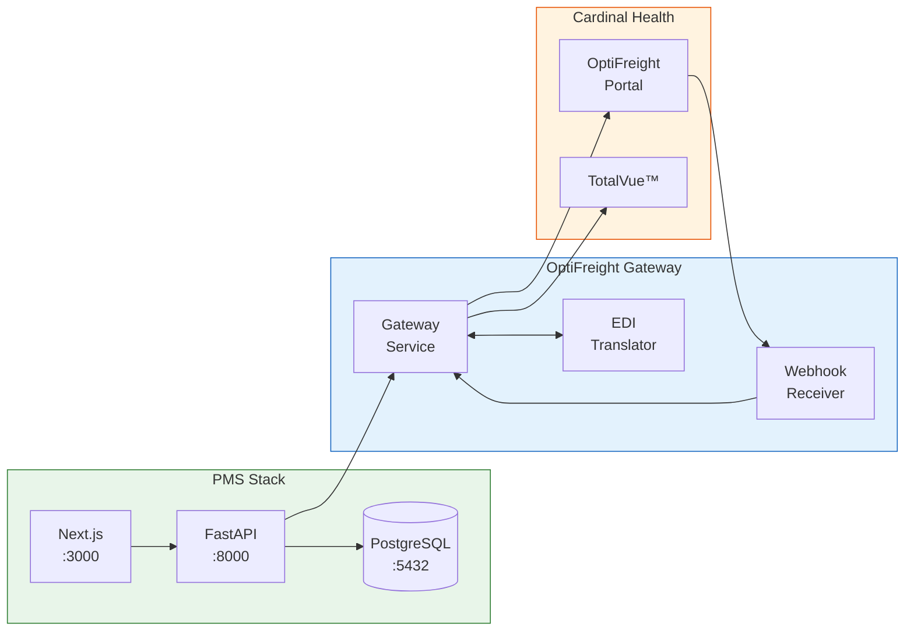

# OptiFreight Logistics Setup Guide for PMS Integration

**Document ID:** PMS-EXP-OPTIFREIGHT-001
**Version:** 1.0
**Date:** 2026-03-11
**Applies To:** PMS project (all platforms)
**Prerequisites Level:** Intermediate

---

## Table of Contents

1. [Overview](#1-overview)
2. [Prerequisites](#2-prerequisites)
3. [Part A: OptiFreight Account Setup and Configuration](#3-part-a-optifreight-account-setup-and-configuration)
4. [Part B: Integrate with PMS Backend](#4-part-b-integrate-with-pms-backend)
5. [Part C: Integrate with PMS Frontend](#5-part-c-integrate-with-pms-frontend)
6. [Part D: Testing and Verification](#6-part-d-testing-and-verification)
7. [Troubleshooting](#7-troubleshooting)
8. [Reference Commands](#8-reference-commands)

---

## 1. Overview

This guide walks you through integrating Cardinal Health's OptiFreight® Logistics platform with the PMS. By the end, you will have:

- An OptiFreight Gateway Service handling shipping API calls
- EDI X12 translation for supply chain transactions
- Shipment tracking with Redis caching
- Webhook receiver for real-time delivery updates
- A Logistics Dashboard in the Next.js frontend
- Shipping label generation linked to PMS prescriptions



## 2. Prerequisites

### 2.1 Required Software

| Software | Minimum Version | Check Command |
|----------|----------------|---------------|
| Python | 3.11+ | `python --version` |
| Node.js | 18+ | `node --version` |
| Docker | 24+ | `docker --version` |
| Docker Compose | 2.20+ | `docker compose version` |
| Redis | 7.0+ | `redis-cli ping` |
| pip | 23+ | `pip --version` |

### 2.2 Installation of Prerequisites

**Redis** (if not already installed via Experiment 76):

```bash
# macOS
brew install redis
brew services start redis

# Linux
sudo apt-get install redis-server
sudo systemctl start redis
```

**EDI Libraries**:

```bash
pip install python-edi bots-edi pydantic httpx
```

### 2.3 Verify PMS Services

```bash
# Verify backend
curl -s http://localhost:8000/health | python -m json.tool

# Verify frontend
curl -s -o /dev/null -w "%{http_code}" http://localhost:3000

# Verify database
psql -h localhost -U pms -d pms_db -c "SELECT 1;"

# Verify Redis
redis-cli ping
# Expected: PONG
```

**Checkpoint**: All four services return healthy responses.

## 3. Part A: OptiFreight Account Setup and Configuration

### Step 1: Obtain OptiFreight Credentials

Contact Cardinal Health to set up your OptiFreight® Logistics account:

- **Phone**: 866.457.4579 x1
- **Email**: OptiFreightCustomerCare@cardinalhealth.com
- **Request**: API access credentials, EDI trading partner ID, webhook endpoint configuration

You will receive:
- `OPTIFREIGHT_CLIENT_ID` — API client identifier
- `OPTIFREIGHT_CLIENT_SECRET` — API client secret
- `OPTIFREIGHT_ACCOUNT_ID` — Your organization's account ID
- `OPTIFREIGHT_EDI_PARTNER_ID` — EDI trading partner identifier
- `OPTIFREIGHT_PORTAL_URL` — Base URL for API calls

### Step 2: Configure Environment Variables

Create or update your `.env` file:

```bash
# OptiFreight Configuration
OPTIFREIGHT_PORTAL_URL=https://optifreight.cardinalhealth.com/api/v1
OPTIFREIGHT_CLIENT_ID=your_client_id_here
OPTIFREIGHT_CLIENT_SECRET=your_client_secret_here
OPTIFREIGHT_ACCOUNT_ID=your_account_id_here
OPTIFREIGHT_EDI_PARTNER_ID=your_edi_partner_id_here
OPTIFREIGHT_WEBHOOK_SECRET=your_webhook_secret_here

# Redis (shared with Experiment 76)
REDIS_URL=redis://localhost:6379/2

# Shipping defaults
OPTIFREIGHT_DEFAULT_ORIGIN_ZIP=78701
OPTIFREIGHT_DEFAULT_WEIGHT_UNIT=LB
OPTIFREIGHT_LABEL_FORMAT=PDF
```

### Step 3: Execute Business Associate Agreement (BAA)

Before any patient-adjacent data flows:

1. Request BAA template from your Cardinal Health account representative
2. Legal review by your HIPAA compliance officer
3. Execute BAA — retain signed copy in compliance records
4. Document BAA execution date in your HIPAA compliance log

**Checkpoint**: You have OptiFreight credentials, environment variables configured, and BAA process initiated.

## 4. Part B: Integrate with PMS Backend

### Step 1: Create the OptiFreight Client

Create `app/integrations/optifreight/client.py`:

```python
"""OptiFreight API client for Cardinal Health shipping services."""

import hashlib
import hmac
from datetime import datetime
from typing import Optional

import httpx
from pydantic import BaseModel

from app.core.config import settings


class ShipmentRequest(BaseModel):
    """Request model for creating a shipment."""
    recipient_name: str
    street_address: str
    city: str
    state: str
    zip_code: str
    weight_lbs: float
    length_in: float = 12.0
    width_in: float = 9.0
    height_in: float = 6.0
    service_mode: str = "GROUND"  # GROUND, EXPRESS, PRIORITY, LTL
    reference_id: str  # PMS prescription or order ID
    contents_description: str = "Medical Supplies"
    signature_required: bool = True


class ShipmentResponse(BaseModel):
    """Response model from OptiFreight shipment creation."""
    shipment_id: str
    tracking_number: str
    carrier: str
    service_mode: str
    estimated_delivery: datetime
    label_url: str
    rate: float
    currency: str = "USD"


class TrackingStatus(BaseModel):
    """Tracking status for a shipment."""
    tracking_number: str
    status: str  # IN_TRANSIT, DELIVERED, DELAYED, EXCEPTION, LABEL_CREATED
    location: Optional[str] = None
    timestamp: datetime
    estimated_delivery: Optional[datetime] = None
    carrier: str
    events: list[dict] = []


class OptiFreightClient:
    """Async client for OptiFreight API interactions."""

    def __init__(self):
        self.base_url = settings.OPTIFREIGHT_PORTAL_URL
        self.client_id = settings.OPTIFREIGHT_CLIENT_ID
        self.client_secret = settings.OPTIFREIGHT_CLIENT_SECRET
        self.account_id = settings.OPTIFREIGHT_ACCOUNT_ID
        self._token: Optional[str] = None
        self._token_expiry: Optional[datetime] = None
        self._http = httpx.AsyncClient(
            timeout=30.0,
            headers={"User-Agent": "PMS-OptiFreight-Integration/1.0"},
        )

    async def _authenticate(self) -> str:
        """Obtain or refresh OAuth2 token."""
        if self._token and self._token_expiry and datetime.utcnow() < self._token_expiry:
            return self._token

        response = await self._http.post(
            f"{self.base_url}/auth/token",
            data={
                "grant_type": "client_credentials",
                "client_id": self.client_id,
                "client_secret": self.client_secret,
            },
        )
        response.raise_for_status()
        data = response.json()
        self._token = data["access_token"]
        self._token_expiry = datetime.utcnow() + timedelta(
            seconds=data.get("expires_in", 3600)
        )
        return self._token

    async def _headers(self) -> dict:
        """Build authenticated request headers."""
        token = await self._authenticate()
        return {
            "Authorization": f"Bearer {token}",
            "X-Account-ID": self.account_id,
            "Content-Type": "application/json",
        }

    async def create_shipment(self, request: ShipmentRequest) -> ShipmentResponse:
        """Create a new shipment and generate a shipping label."""
        headers = await self._headers()
        payload = {
            "account_id": self.account_id,
            "recipient": {
                "name": request.recipient_name,
                "address": {
                    "street": request.street_address,
                    "city": request.city,
                    "state": request.state,
                    "zip": request.zip_code,
                },
            },
            "package": {
                "weight": request.weight_lbs,
                "weight_unit": "LB",
                "dimensions": {
                    "length": request.length_in,
                    "width": request.width_in,
                    "height": request.height_in,
                    "unit": "IN",
                },
            },
            "service_mode": request.service_mode,
            "reference": request.reference_id,
            "contents": request.contents_description,
            "signature_required": request.signature_required,
            "label_format": settings.OPTIFREIGHT_LABEL_FORMAT,
        }

        response = await self._http.post(
            f"{self.base_url}/shipments",
            headers=headers,
            json=payload,
        )
        response.raise_for_status()
        return ShipmentResponse(**response.json())

    async def get_tracking(self, tracking_number: str) -> TrackingStatus:
        """Get current tracking status for a shipment."""
        headers = await self._headers()
        response = await self._http.get(
            f"{self.base_url}/tracking/{tracking_number}",
            headers=headers,
        )
        response.raise_for_status()
        return TrackingStatus(**response.json())

    async def get_rates(
        self,
        origin_zip: str,
        dest_zip: str,
        weight_lbs: float,
    ) -> list[dict]:
        """Get rate quotes for available shipping modes."""
        headers = await self._headers()
        response = await self._http.get(
            f"{self.base_url}/rates",
            headers=headers,
            params={
                "origin_zip": origin_zip,
                "destination_zip": dest_zip,
                "weight": weight_lbs,
                "account_id": self.account_id,
            },
        )
        response.raise_for_status()
        return response.json().get("rates", [])

    async def cancel_shipment(self, shipment_id: str) -> bool:
        """Cancel a shipment before carrier pickup."""
        headers = await self._headers()
        response = await self._http.delete(
            f"{self.base_url}/shipments/{shipment_id}",
            headers=headers,
        )
        return response.status_code == 204

    async def get_label(self, shipment_id: str) -> bytes:
        """Download shipping label as PDF bytes."""
        headers = await self._headers()
        response = await self._http.get(
            f"{self.base_url}/shipments/{shipment_id}/label",
            headers=headers,
        )
        response.raise_for_status()
        return response.content

    def verify_webhook(self, payload: bytes, signature: str) -> bool:
        """Verify webhook signature from OptiFreight."""
        expected = hmac.new(
            settings.OPTIFREIGHT_WEBHOOK_SECRET.encode(),
            payload,
            hashlib.sha256,
        ).hexdigest()
        return hmac.compare_digest(expected, signature)

    async def close(self):
        """Close the HTTP client."""
        await self._http.aclose()
```

### Step 2: Create Database Models

Create `app/integrations/optifreight/models.py`:

```python
"""Database models for OptiFreight shipment tracking."""

from datetime import datetime
from enum import Enum
from typing import Optional

from sqlalchemy import (
    Column, DateTime, Float, ForeignKey, Integer, String, Text, Enum as SAEnum
)
from sqlalchemy.orm import relationship

from app.db.base import Base


class ShipmentStatus(str, Enum):
    LABEL_CREATED = "LABEL_CREATED"
    PICKED_UP = "PICKED_UP"
    IN_TRANSIT = "IN_TRANSIT"
    OUT_FOR_DELIVERY = "OUT_FOR_DELIVERY"
    DELIVERED = "DELIVERED"
    DELAYED = "DELAYED"
    EXCEPTION = "EXCEPTION"
    CANCELLED = "CANCELLED"


class Shipment(Base):
    __tablename__ = "optifreight_shipments"

    id = Column(Integer, primary_key=True, index=True)
    shipment_id = Column(String(64), unique=True, index=True, nullable=False)
    tracking_number = Column(String(64), unique=True, index=True, nullable=False)
    prescription_id = Column(Integer, ForeignKey("prescriptions.id"), nullable=True)
    encounter_id = Column(Integer, ForeignKey("encounters.id"), nullable=True)
    carrier = Column(String(32), nullable=False)
    service_mode = Column(String(32), nullable=False)
    status = Column(SAEnum(ShipmentStatus), default=ShipmentStatus.LABEL_CREATED)

    # Recipient (encrypted at rest — no PHI beyond address)
    recipient_name = Column(String(255), nullable=False)
    recipient_zip = Column(String(10), nullable=False)

    # Shipping details
    weight_lbs = Column(Float, nullable=False)
    rate = Column(Float, nullable=True)
    currency = Column(String(3), default="USD")
    label_url = Column(Text, nullable=True)

    # Timestamps
    created_at = Column(DateTime, default=datetime.utcnow)
    estimated_delivery = Column(DateTime, nullable=True)
    actual_delivery = Column(DateTime, nullable=True)
    updated_at = Column(DateTime, default=datetime.utcnow, onupdate=datetime.utcnow)

    # Audit
    created_by = Column(String(64), nullable=False)

    # Relationships
    events = relationship("ShipmentEvent", back_populates="shipment")


class ShipmentEvent(Base):
    __tablename__ = "optifreight_shipment_events"

    id = Column(Integer, primary_key=True, index=True)
    shipment_id = Column(Integer, ForeignKey("optifreight_shipments.id"), nullable=False)
    status = Column(SAEnum(ShipmentStatus), nullable=False)
    location = Column(String(255), nullable=True)
    description = Column(Text, nullable=True)
    timestamp = Column(DateTime, nullable=False)
    raw_event = Column(Text, nullable=True)  # JSON from webhook
    created_at = Column(DateTime, default=datetime.utcnow)

    shipment = relationship("Shipment", back_populates="events")
```

### Step 3: Create the API Router

Create `app/integrations/optifreight/router.py`:

```python
"""FastAPI router for OptiFreight shipping operations."""

import json
import logging
from typing import Optional

import redis.asyncio as redis
from fastapi import APIRouter, Depends, HTTPException, Request, status

from app.core.auth import get_current_user
from app.core.config import settings
from app.integrations.optifreight.client import (
    OptiFreightClient,
    ShipmentRequest,
)

logger = logging.getLogger(__name__)

router = APIRouter(prefix="/api/shipping/optifreight", tags=["optifreight"])

# Redis connection for caching
redis_client = redis.from_url(settings.REDIS_URL, decode_responses=True)
CACHE_TTL = 300  # 5 minutes

# Singleton client
_client: Optional[OptiFreightClient] = None


def get_client() -> OptiFreightClient:
    global _client
    if _client is None:
        _client = OptiFreightClient()
    return _client


@router.post("/shipments", status_code=status.HTTP_201_CREATED)
async def create_shipment(
    request: ShipmentRequest,
    user=Depends(get_current_user),
    client: OptiFreightClient = Depends(get_client),
):
    """Create a new shipment and generate a shipping label."""
    logger.info(
        "Creating shipment for reference=%s by user=%s",
        request.reference_id,
        user.id,
    )
    try:
        result = await client.create_shipment(request)

        # TODO: Save to database (Shipment model)
        # TODO: Link to prescription if reference_id matches

        logger.info(
            "Shipment created: id=%s tracking=%s carrier=%s",
            result.shipment_id,
            result.tracking_number,
            result.carrier,
        )
        return result
    except Exception as e:
        logger.error("Failed to create shipment: %s", str(e))
        raise HTTPException(
            status_code=status.HTTP_502_BAD_GATEWAY,
            detail=f"OptiFreight API error: {str(e)}",
        )


@router.get("/shipments/{tracking_number}/tracking")
async def get_tracking(
    tracking_number: str,
    user=Depends(get_current_user),
    client: OptiFreightClient = Depends(get_client),
):
    """Get tracking status for a shipment (cached)."""
    cache_key = f"optifreight:tracking:{tracking_number}"

    # Check cache first
    cached = await redis_client.get(cache_key)
    if cached:
        return json.loads(cached)

    try:
        result = await client.get_tracking(tracking_number)
        # Cache the result
        await redis_client.setex(cache_key, CACHE_TTL, result.model_dump_json())
        return result
    except Exception as e:
        logger.error("Tracking lookup failed for %s: %s", tracking_number, str(e))
        raise HTTPException(
            status_code=status.HTTP_502_BAD_GATEWAY,
            detail=f"Tracking lookup failed: {str(e)}",
        )


@router.get("/rates")
async def get_rate_quotes(
    dest_zip: str,
    weight_lbs: float,
    origin_zip: str = settings.OPTIFREIGHT_DEFAULT_ORIGIN_ZIP,
    user=Depends(get_current_user),
    client: OptiFreightClient = Depends(get_client),
):
    """Get rate quotes for available shipping modes."""
    try:
        rates = await client.get_rates(origin_zip, dest_zip, weight_lbs)
        return {"rates": rates, "origin_zip": origin_zip, "dest_zip": dest_zip}
    except Exception as e:
        raise HTTPException(
            status_code=status.HTTP_502_BAD_GATEWAY,
            detail=f"Rate quote failed: {str(e)}",
        )


@router.get("/shipments/{shipment_id}/label")
async def download_label(
    shipment_id: str,
    user=Depends(get_current_user),
    client: OptiFreightClient = Depends(get_client),
):
    """Download shipping label PDF."""
    from fastapi.responses import Response

    try:
        label_bytes = await client.get_label(shipment_id)
        return Response(
            content=label_bytes,
            media_type="application/pdf",
            headers={
                "Content-Disposition": f'attachment; filename="label-{shipment_id}.pdf"'
            },
        )
    except Exception as e:
        raise HTTPException(
            status_code=status.HTTP_502_BAD_GATEWAY,
            detail=f"Label download failed: {str(e)}",
        )


@router.delete("/shipments/{shipment_id}")
async def cancel_shipment(
    shipment_id: str,
    user=Depends(get_current_user),
    client: OptiFreightClient = Depends(get_client),
):
    """Cancel a shipment before carrier pickup."""
    success = await client.cancel_shipment(shipment_id)
    if not success:
        raise HTTPException(
            status_code=status.HTTP_400_BAD_REQUEST,
            detail="Cannot cancel — shipment may already be picked up",
        )
    return {"status": "cancelled", "shipment_id": shipment_id}


@router.post("/webhooks/tracking")
async def handle_tracking_webhook(request: Request):
    """Receive tracking event webhooks from OptiFreight."""
    body = await request.body()
    signature = request.headers.get("X-OptiFreight-Signature", "")

    client = get_client()
    if not client.verify_webhook(body, signature):
        raise HTTPException(
            status_code=status.HTTP_401_UNAUTHORIZED,
            detail="Invalid webhook signature",
        )

    event = json.loads(body)
    tracking_number = event.get("tracking_number")
    logger.info(
        "Webhook: tracking event for %s — status=%s",
        tracking_number,
        event.get("status"),
    )

    # Invalidate cache so next query gets fresh data
    await redis_client.delete(f"optifreight:tracking:{tracking_number}")

    # TODO: Update Shipment record in database
    # TODO: Send push notification if status is DELIVERED or DELAYED

    return {"received": True}
```

### Step 4: Register the Router

Add the OptiFreight router to your FastAPI application:

```python
# In app/main.py or app/api/__init__.py
from app.integrations.optifreight.router import router as optifreight_router

app.include_router(optifreight_router)
```

### Step 5: Run Database Migration

```bash
# Generate migration
alembic revision --autogenerate -m "add optifreight shipment tables"

# Apply migration
alembic upgrade head
```

Verify tables were created:

```bash
psql -h localhost -U pms -d pms_db -c "\dt optifreight_*"
```

Expected output:
```
              List of relations
 Schema |             Name             | Type  | Owner
--------+------------------------------+-------+-------
 public | optifreight_shipment_events  | table | pms
 public | optifreight_shipments        | table | pms
```

**Checkpoint**: Backend has OptiFreight client, database models, API router registered, and migration applied.

## 5. Part C: Integrate with PMS Frontend

### Step 1: Add Environment Variables

In your Next.js `.env.local`:

```bash
NEXT_PUBLIC_API_URL=http://localhost:8000
NEXT_PUBLIC_OPTIFREIGHT_ENABLED=true
```

### Step 2: Create the Shipping API Service

Create `src/services/optifreightService.ts`:

```typescript
const API_BASE = process.env.NEXT_PUBLIC_API_URL;

export interface ShipmentRequest {
  recipientName: string;
  streetAddress: string;
  city: string;
  state: string;
  zipCode: string;
  weightLbs: number;
  serviceMode: "GROUND" | "EXPRESS" | "PRIORITY" | "LTL";
  referenceId: string;
  contentsDescription?: string;
  signatureRequired?: boolean;
}

export interface ShipmentResponse {
  shipmentId: string;
  trackingNumber: string;
  carrier: string;
  serviceMode: string;
  estimatedDelivery: string;
  labelUrl: string;
  rate: number;
  currency: string;
}

export interface TrackingStatus {
  trackingNumber: string;
  status: string;
  location: string | null;
  timestamp: string;
  estimatedDelivery: string | null;
  carrier: string;
  events: Array<{
    status: string;
    location: string;
    timestamp: string;
    description: string;
  }>;
}

export interface RateQuote {
  carrier: string;
  serviceMode: string;
  rate: number;
  estimatedDays: number;
  currency: string;
}

export async function createShipment(
  token: string,
  request: ShipmentRequest
): Promise<ShipmentResponse> {
  const res = await fetch(`${API_BASE}/api/shipping/optifreight/shipments`, {
    method: "POST",
    headers: {
      Authorization: `Bearer ${token}`,
      "Content-Type": "application/json",
    },
    body: JSON.stringify({
      recipient_name: request.recipientName,
      street_address: request.streetAddress,
      city: request.city,
      state: request.state,
      zip_code: request.zipCode,
      weight_lbs: request.weightLbs,
      service_mode: request.serviceMode,
      reference_id: request.referenceId,
      contents_description: request.contentsDescription ?? "Medical Supplies",
      signature_required: request.signatureRequired ?? true,
    }),
  });
  if (!res.ok) throw new Error(`Shipment creation failed: ${res.status}`);
  return res.json();
}

export async function getTracking(
  token: string,
  trackingNumber: string
): Promise<TrackingStatus> {
  const res = await fetch(
    `${API_BASE}/api/shipping/optifreight/shipments/${trackingNumber}/tracking`,
    { headers: { Authorization: `Bearer ${token}` } }
  );
  if (!res.ok) throw new Error(`Tracking failed: ${res.status}`);
  return res.json();
}

export async function getRates(
  token: string,
  destZip: string,
  weightLbs: number
): Promise<{ rates: RateQuote[] }> {
  const params = new URLSearchParams({
    dest_zip: destZip,
    weight_lbs: weightLbs.toString(),
  });
  const res = await fetch(
    `${API_BASE}/api/shipping/optifreight/rates?${params}`,
    { headers: { Authorization: `Bearer ${token}` } }
  );
  if (!res.ok) throw new Error(`Rate quote failed: ${res.status}`);
  return res.json();
}

export async function downloadLabel(
  token: string,
  shipmentId: string
): Promise<Blob> {
  const res = await fetch(
    `${API_BASE}/api/shipping/optifreight/shipments/${shipmentId}/label`,
    { headers: { Authorization: `Bearer ${token}` } }
  );
  if (!res.ok) throw new Error(`Label download failed: ${res.status}`);
  return res.blob();
}

export async function cancelShipment(
  token: string,
  shipmentId: string
): Promise<void> {
  const res = await fetch(
    `${API_BASE}/api/shipping/optifreight/shipments/${shipmentId}`,
    {
      method: "DELETE",
      headers: { Authorization: `Bearer ${token}` },
    }
  );
  if (!res.ok) throw new Error(`Cancel failed: ${res.status}`);
}
```

### Step 3: Create the Shipping Dashboard Component

Create `src/components/shipping/ShippingDashboard.tsx`:

```tsx
"use client";

import { useState, useEffect } from "react";
import {
  getTracking,
  getRates,
  createShipment,
  downloadLabel,
  type ShipmentRequest,
  type ShipmentResponse,
  type TrackingStatus,
  type RateQuote,
} from "@/services/optifreightService";

interface ShippingDashboardProps {
  token: string;
}

const STATUS_COLORS: Record<string, string> = {
  LABEL_CREATED: "bg-gray-100 text-gray-800",
  PICKED_UP: "bg-blue-100 text-blue-800",
  IN_TRANSIT: "bg-blue-100 text-blue-800",
  OUT_FOR_DELIVERY: "bg-yellow-100 text-yellow-800",
  DELIVERED: "bg-green-100 text-green-800",
  DELAYED: "bg-red-100 text-red-800",
  EXCEPTION: "bg-red-100 text-red-800",
  CANCELLED: "bg-gray-100 text-gray-500",
};

export default function ShippingDashboard({ token }: ShippingDashboardProps) {
  const [activeTab, setActiveTab] = useState<
    "track" | "ship" | "rates"
  >("track");
  const [trackingNumber, setTrackingNumber] = useState("");
  const [tracking, setTracking] = useState<TrackingStatus | null>(null);
  const [rates, setRates] = useState<RateQuote[]>([]);
  const [loading, setLoading] = useState(false);
  const [error, setError] = useState<string | null>(null);

  const handleTrack = async () => {
    if (!trackingNumber.trim()) return;
    setLoading(true);
    setError(null);
    try {
      const result = await getTracking(token, trackingNumber);
      setTracking(result);
    } catch (e) {
      setError(e instanceof Error ? e.message : "Tracking failed");
    } finally {
      setLoading(false);
    }
  };

  const handleGetRates = async (destZip: string, weight: number) => {
    setLoading(true);
    setError(null);
    try {
      const result = await getRates(token, destZip, weight);
      setRates(result.rates);
    } catch (e) {
      setError(e instanceof Error ? e.message : "Rate quote failed");
    } finally {
      setLoading(false);
    }
  };

  return (
    <div className="bg-white rounded-lg shadow p-6">
      <h2 className="text-xl font-semibold mb-4">
        OptiFreight® Shipping
      </h2>

      {/* Tab Navigation */}
      <div className="flex border-b mb-4">
        {(["track", "ship", "rates"] as const).map((tab) => (
          <button
            key={tab}
            onClick={() => setActiveTab(tab)}
            className={`px-4 py-2 font-medium capitalize ${
              activeTab === tab
                ? "border-b-2 border-blue-500 text-blue-600"
                : "text-gray-500 hover:text-gray-700"
            }`}
          >
            {tab === "track"
              ? "Track Shipment"
              : tab === "ship"
              ? "Create Shipment"
              : "Rate Quotes"}
          </button>
        ))}
      </div>

      {error && (
        <div className="bg-red-50 text-red-700 p-3 rounded mb-4">
          {error}
        </div>
      )}

      {/* Track Tab */}
      {activeTab === "track" && (
        <div>
          <div className="flex gap-2 mb-4">
            <input
              type="text"
              value={trackingNumber}
              onChange={(e) => setTrackingNumber(e.target.value)}
              placeholder="Enter tracking number"
              className="flex-1 border rounded px-3 py-2"
            />
            <button
              onClick={handleTrack}
              disabled={loading}
              className="bg-blue-600 text-white px-4 py-2 rounded hover:bg-blue-700 disabled:opacity-50"
            >
              {loading ? "Tracking..." : "Track"}
            </button>
          </div>

          {tracking && (
            <div>
              <div className="flex items-center gap-3 mb-4">
                <span
                  className={`px-3 py-1 rounded-full text-sm font-medium ${
                    STATUS_COLORS[tracking.status] ?? "bg-gray-100"
                  }`}
                >
                  {tracking.status.replace(/_/g, " ")}
                </span>
                <span className="text-gray-500">
                  via {tracking.carrier}
                </span>
                {tracking.estimatedDelivery && (
                  <span className="text-gray-500">
                    ETA:{" "}
                    {new Date(
                      tracking.estimatedDelivery
                    ).toLocaleDateString()}
                  </span>
                )}
              </div>

              <div className="space-y-2">
                {tracking.events.map((event, idx) => (
                  <div
                    key={idx}
                    className="flex items-start gap-3 text-sm"
                  >
                    <div className="w-2 h-2 mt-1.5 rounded-full bg-blue-500" />
                    <div>
                      <p className="font-medium">{event.description}</p>
                      <p className="text-gray-500">
                        {event.location} —{" "}
                        {new Date(event.timestamp).toLocaleString()}
                      </p>
                    </div>
                  </div>
                ))}
              </div>
            </div>
          )}
        </div>
      )}

      {/* Rates Tab */}
      {activeTab === "rates" && (
        <div>
          <RateQuoteForm onSubmit={handleGetRates} loading={loading} />
          {rates.length > 0 && (
            <div className="mt-4">
              <table className="w-full text-sm">
                <thead>
                  <tr className="border-b">
                    <th className="text-left py-2">Carrier</th>
                    <th className="text-left py-2">Service</th>
                    <th className="text-right py-2">Rate</th>
                    <th className="text-right py-2">Est. Days</th>
                  </tr>
                </thead>
                <tbody>
                  {rates.map((rate, idx) => (
                    <tr key={idx} className="border-b">
                      <td className="py-2">{rate.carrier}</td>
                      <td className="py-2">{rate.serviceMode}</td>
                      <td className="py-2 text-right">
                        ${rate.rate.toFixed(2)}
                      </td>
                      <td className="py-2 text-right">
                        {rate.estimatedDays}
                      </td>
                    </tr>
                  ))}
                </tbody>
              </table>
            </div>
          )}
        </div>
      )}
    </div>
  );
}

function RateQuoteForm({
  onSubmit,
  loading,
}: {
  onSubmit: (zip: string, weight: number) => void;
  loading: boolean;
}) {
  const [zip, setZip] = useState("");
  const [weight, setWeight] = useState("1.0");

  return (
    <div className="flex gap-2">
      <input
        type="text"
        value={zip}
        onChange={(e) => setZip(e.target.value)}
        placeholder="Destination ZIP"
        className="border rounded px-3 py-2 w-40"
      />
      <input
        type="number"
        value={weight}
        onChange={(e) => setWeight(e.target.value)}
        placeholder="Weight (lbs)"
        className="border rounded px-3 py-2 w-32"
        step="0.1"
        min="0.1"
      />
      <button
        onClick={() => onSubmit(zip, parseFloat(weight))}
        disabled={loading || !zip}
        className="bg-blue-600 text-white px-4 py-2 rounded hover:bg-blue-700 disabled:opacity-50"
      >
        {loading ? "Loading..." : "Get Rates"}
      </button>
    </div>
  );
}
```

### Step 4: Add the Shipping Page

Create `src/app/shipping/page.tsx`:

```tsx
import ShippingDashboard from "@/components/shipping/ShippingDashboard";

export default function ShippingPage() {
  // In production, get token from auth context
  const token = ""; // useAuth().token

  return (
    <div className="container mx-auto py-6 px-4">
      <h1 className="text-2xl font-bold mb-6">Shipping Management</h1>
      <ShippingDashboard token={token} />
    </div>
  );
}
```

**Checkpoint**: Frontend has OptiFreight service, Shipping Dashboard component, and dedicated shipping page.

## 6. Part D: Testing and Verification

### Step 1: Verify Backend Health

```bash
# Check OptiFreight routes are registered
curl -s http://localhost:8000/openapi.json | python -m json.tool | grep optifreight
```

Expected: Routes for `/api/shipping/optifreight/*` appear in the OpenAPI spec.

### Step 2: Test Rate Quote

```bash
curl -s -X GET \
  "http://localhost:8000/api/shipping/optifreight/rates?dest_zip=90210&weight_lbs=2.5" \
  -H "Authorization: Bearer $TOKEN" | python -m json.tool
```

Expected response:
```json
{
  "rates": [
    {
      "carrier": "FedEx",
      "serviceMode": "GROUND",
      "rate": 8.45,
      "estimatedDays": 5,
      "currency": "USD"
    },
    {
      "carrier": "UPS",
      "serviceMode": "EXPRESS",
      "rate": 15.20,
      "estimatedDays": 2,
      "currency": "USD"
    }
  ],
  "origin_zip": "78701",
  "dest_zip": "90210"
}
```

### Step 3: Test Shipment Creation

```bash
curl -s -X POST http://localhost:8000/api/shipping/optifreight/shipments \
  -H "Authorization: Bearer $TOKEN" \
  -H "Content-Type: application/json" \
  -d '{
    "recipient_name": "Jane Doe",
    "street_address": "123 Main St",
    "city": "Austin",
    "state": "TX",
    "zip_code": "78701",
    "weight_lbs": 1.5,
    "service_mode": "GROUND",
    "reference_id": "RX-2026-001234",
    "contents_description": "Prescription Medication",
    "signature_required": true
  }' | python -m json.tool
```

### Step 4: Test Tracking

```bash
curl -s -X GET \
  "http://localhost:8000/api/shipping/optifreight/shipments/TRACKING_NUMBER_HERE/tracking" \
  -H "Authorization: Bearer $TOKEN" | python -m json.tool
```

### Step 5: Test Webhook

```bash
# Simulate a tracking webhook event
curl -s -X POST http://localhost:8000/api/shipping/optifreight/webhooks/tracking \
  -H "Content-Type: application/json" \
  -H "X-OptiFreight-Signature: test_signature" \
  -d '{
    "tracking_number": "1Z999AA10123456784",
    "status": "IN_TRANSIT",
    "location": "Austin, TX",
    "timestamp": "2026-03-11T14:30:00Z"
  }'
```

### Step 6: Verify Redis Cache

```bash
# Check cached tracking data
redis-cli -n 2 KEYS "optifreight:*"

# Check TTL on cached entry
redis-cli -n 2 TTL "optifreight:tracking:1Z999AA10123456784"
```

### Step 7: Verify Frontend

1. Navigate to `http://localhost:3000/shipping`
2. Verify the Shipping Dashboard renders with three tabs
3. Enter a tracking number and click "Track"
4. Switch to "Rate Quotes" tab and get a quote

**Checkpoint**: All API endpoints respond correctly, webhook processing works, Redis caching is active, and the frontend dashboard renders.

## 7. Troubleshooting

### OptiFreight Authentication Failures

**Symptom**: 401 Unauthorized from OptiFreight API calls.

**Solution**:
1. Verify `OPTIFREIGHT_CLIENT_ID` and `OPTIFREIGHT_CLIENT_SECRET` in `.env`
2. Check token expiry — the client auto-refreshes, but verify with:
   ```bash
   curl -X POST https://optifreight.cardinalhealth.com/api/v1/auth/token \
     -d "grant_type=client_credentials&client_id=$ID&client_secret=$SECRET"
   ```
3. Contact Cardinal Health if credentials are revoked or expired

### Redis Connection Refused

**Symptom**: `ConnectionRefusedError` on shipping API calls.

**Solution**:
```bash
# Check Redis is running
redis-cli ping

# If not running
brew services restart redis  # macOS
sudo systemctl restart redis  # Linux

# Verify correct database number in REDIS_URL
redis-cli -n 2 INFO keyspace
```

### EDI Transaction Rejections

**Symptom**: X12 856/810/850 documents rejected by Cardinal Health.

**Solution**:
1. Validate EDI document structure with the bots-edi validator
2. Check required fields per Cardinal Health's EDI spec — missing ASN fields incur $10/line penalties
3. Contact `vendoredi@cardinalhealth.com` for technical support
4. Review the [856 Implementation Guide](https://www.cardinalhealth.com/content/dam/corp/web/documents/brochure/cardinal-health-856-4010-advanced-shipment-notice.pdf)

### Webhook Events Not Received

**Symptom**: Tracking status not updating in PMS after carrier scans.

**Solution**:
1. Verify webhook URL is registered with OptiFreight account team
2. Check firewall allows inbound HTTPS from OptiFreight IP ranges
3. Verify webhook signature validation:
   ```bash
   # Test with known payload and signature
   python -c "
   import hmac, hashlib
   secret = 'your_webhook_secret'
   payload = b'{\"test\": true}'
   sig = hmac.new(secret.encode(), payload, hashlib.sha256).hexdigest()
   print(f'Signature: {sig}')
   "
   ```
4. Check FastAPI logs for 401 errors on `/webhooks/tracking`

### Label Generation Timeout

**Symptom**: Label download takes > 10 seconds or times out.

**Solution**:
1. Check OptiFreight API status at the customer portal
2. Increase `httpx.AsyncClient` timeout in the client constructor
3. Implement retry with exponential backoff for transient failures
4. Cache generated labels in Redis or on disk to avoid re-generation

### Port Conflicts

**Symptom**: FastAPI fails to start or Redis connection refused.

**Solution**:
```bash
# Check what's using port 8000
lsof -i :8000

# Check Redis port
lsof -i :6379

# Use alternative ports in .env if needed
```

## 8. Reference Commands

### Daily Development Workflow

```bash
# Start all services
docker compose up -d

# Check OptiFreight integration health
curl -s http://localhost:8000/api/shipping/optifreight/health

# Tail shipping logs
docker logs -f pms-backend 2>&1 | grep optifreight

# Monitor Redis cache activity
redis-cli -n 2 MONITOR
```

### Management Commands

```bash
# View all active shipments
curl -s http://localhost:8000/api/shipping/optifreight/shipments \
  -H "Authorization: Bearer $TOKEN"

# Purge tracking cache
redis-cli -n 2 KEYS "optifreight:*" | xargs redis-cli -n 2 DEL

# Run database migration
alembic upgrade head

# Rollback migration
alembic downgrade -1
```

### Useful URLs

| Resource | URL |
|----------|-----|
| PMS Shipping Dashboard | http://localhost:3000/shipping |
| FastAPI Docs (Shipping) | http://localhost:8000/docs#/optifreight |
| OptiFreight Portal | https://optifreight.cardinalhealth.com |
| OptiFreight Customer Care | 866.457.4579 x1 |
| Cardinal Health EDI Support | vendoredi@cardinalhealth.com |
| TotalVue™ Insights | https://optifreight.cardinalhealth.com/TotalVue |

## Next Steps

- Complete the [OptiFreight Developer Tutorial](79-OptiFreight-Developer-Tutorial.md) for hands-on integration building
- Review the [PRD](79-PRD-OptiFreight-PMS-Integration.md) for full feature scope and implementation phases
- Explore [FedEx Integration (Exp 64)](64-PRD-FedEx-PMS-Integration.md) and [UPS Integration (Exp 65)](65-PRD-UPS-PMS-Integration.md) for carrier-specific patterns
- Set up [Redis (Exp 76)](76-PRD-Redis-PMS-Integration.md) if not already deployed for shipment caching

## Resources

- [OptiFreight® Logistics](https://www.cardinalhealth.com/en/solutions/optifreight-logistics.html) — Official product page
- [OptiFreight Customer Portal](https://optifreight.cardinalhealth.com/) — Customer login and shipping tools
- [Cardinal Health EDI Guide](https://zenbridge.io/trading-partners/cardinalhealth-edi-integration/) — EDI transaction specifications
- [TotalVue™ Analytics](https://www.prnewswire.com/news-releases/cardinal-health-launches-totalvue-analytics-a-logistics-management-tool-powered-by-data-to-drive-cost-savings-301200800.html) — Analytics platform announcement
- [OptiFreight Customer Resources](https://www.cardinalhealth.com/en/solutions/optifreight-logistics/resources-for-optifreight-logistics/customer-resources.html) — Training and support materials
