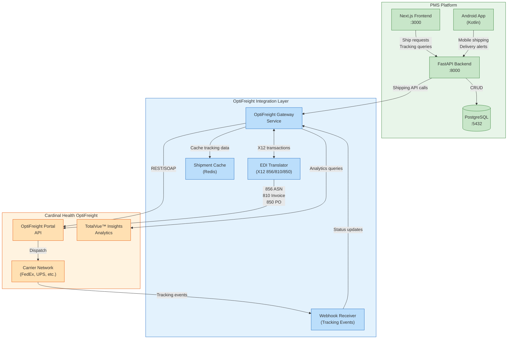

# Product Requirements Document: OptiFreight Logistics Integration into Patient Management System (PMS)

**Document ID:** PRD-PMS-OPTIFREIGHT-001
**Version:** 1.0
**Date:** 2026-03-11
**Author:** Ammar (CEO, MPS Inc.)
**Status:** Draft

---

## 1. Executive Summary

OptiFreight® Logistics, a Cardinal Health company, is the leading healthcare-specialized shipping and freight management platform in North America, managing 22+ million shipments annually across 25,000 shipping locations. The platform provides inbound, outbound, and LTL (Less-than-Truckload) freight management with the TotalVue™ Insights analytics suite for near real-time tracking, cost optimization, and performance benchmarking.

Integrating OptiFreight into the PMS would automate medication and supply shipping workflows — from pharmacy prescription fulfillment and lab specimen routing to medical supply procurement. By connecting PMS prescription and encounter data directly to OptiFreight's shipping infrastructure, clinical staff can generate shipping labels, track deliveries, receive delay alerts, and analyze logistics costs without leaving the PMS interface.

This integration addresses a critical operational gap: currently, shipping coordination for pharmacy deliveries, lab specimens, and medical supplies requires manual portal access, phone calls, and fragmented tracking across multiple carrier websites. An integrated solution reduces staff workload, improves delivery reliability for time-sensitive medications, and provides centralized visibility into all logistics operations.

## 2. Problem Statement

Healthcare facilities using the PMS face several logistics pain points:

1. **Fragmented Shipping Workflows**: Staff must leave the PMS to access the OptiFreight portal, manually enter shipment details, and cross-reference tracking numbers back to patient records or supply orders.
2. **No Prescription-to-Delivery Tracking**: When pharmacies fulfill prescriptions for delivery (e.g., specialty medications, compounding, mail-order), there is no automated link between the PMS prescription record and the shipping status.
3. **Reactive Delay Management**: Shipping delays for critical medications or lab specimens are discovered only when patients or staff call to inquire, rather than through proactive alerts tied to clinical records.
4. **Cost Opacity**: Shipping costs for patient deliveries, lab logistics, and supply procurement are tracked separately from clinical operations, making it difficult to analyze per-patient or per-department logistics spend.
5. **Manual Label Generation**: Staff print shipping labels through the OptiFreight portal separately, requiring duplicate data entry of addresses, package details, and reference numbers already stored in the PMS.

## 3. Proposed Solution

### 3.1 Architecture Overview

### 3.2 Deployment Model

- **Self-Hosted Gateway**: The OptiFreight Gateway Service runs as a Docker container alongside the PMS backend, handling all API communication with Cardinal Health's platform.
- **EDI Translator**: A dedicated service handles X12 EDI document translation (856 ASN, 810 Invoice, 850 Purchase Order) for structured data exchange with Cardinal Health's supply chain.
- **Redis Cache**: Shipment tracking data is cached locally (TTL: 5 minutes) to reduce API calls and provide responsive UI updates.
- **Webhook Receiver**: A dedicated endpoint receives real-time tracking events from carrier networks via OptiFreight's event notification system.
- **HIPAA Considerations**: All shipment data containing patient information (delivery addresses, prescription references) is encrypted at rest (AES-256) and in transit (TLS 1.3). Patient identifiers are mapped to internal shipment reference IDs — no PHI is transmitted to OptiFreight beyond the minimum necessary for shipping (name, address). Audit logs capture all shipping-related API calls with user attribution.

## 4. PMS Data Sources

The OptiFreight integration interacts with the following PMS APIs:

| PMS API | Endpoint | Integration Use |
|---------|----------|-----------------|
| **Patient Records** | `/api/patients` | Retrieve patient delivery addresses for prescription shipments; validate patient identity for shipment authorization |
| **Prescription API** | `/api/prescriptions` | Link prescriptions to outbound shipments; trigger shipping workflows on prescription fulfillment; attach tracking numbers to prescription records |
| **Encounter Records** | `/api/encounters` | Associate lab specimen shipments with encounters; log shipping events in encounter timeline |
| **Reporting API** | `/api/reports` | Aggregate shipping costs per department, per patient, and per carrier; generate logistics performance dashboards |

### Additional Integration Points

- **Medication & Supply Orders**: When a prescription is marked "ready for delivery," the integration auto-generates a shipping request with patient address, package weight estimate, and priority level.
- **Lab Specimen Routing**: Outbound lab specimens are linked to encounter records with chain-of-custody tracking through the shipping lifecycle.
- **Supply Procurement**: Inbound medical supply orders trigger EDI 850 purchase orders and track inbound delivery via EDI 856 ASN.

## 5. Component/Module Definitions

### 5.1 OptiFreight Gateway Service

**Description**: Central FastAPI router that abstracts all OptiFreight API interactions behind a clean internal API.

- **Input**: Shipping requests from PMS backend (patient address, package details, priority, reference IDs)
- **Output**: Shipping labels (PDF/ZPL), tracking numbers, rate quotes, delivery ETAs
- **PMS APIs Used**: `/api/patients`, `/api/prescriptions`

### 5.2 EDI Translation Engine

**Description**: Translates between PMS data models and X12 EDI transaction sets required by Cardinal Health's supply chain.

- **Input**: PMS purchase orders, shipment notifications, invoice data
- **Output**: X12 850 (Purchase Order), X12 856 (Advance Ship Notice), X12 810 (Invoice)
- **PMS APIs Used**: `/api/prescriptions`, `/api/reports`

### 5.3 Shipment Tracker

**Description**: Real-time shipment tracking service that aggregates carrier tracking data from OptiFreight's TotalVue™ platform.

- **Input**: Tracking numbers, shipment IDs
- **Output**: Current status, location, ETA, delay alerts, delivery confirmation
- **PMS APIs Used**: `/api/prescriptions`, `/api/encounters`

### 5.4 Shipping Label Generator

**Description**: Generates shipping labels directly from PMS data without manual re-entry.

- **Input**: Patient record (address), prescription details (weight, contents, priority), shipping mode selection
- **Output**: PDF or ZPL label, carrier-specific barcode, reference number
- **PMS APIs Used**: `/api/patients`, `/api/prescriptions`

### 5.5 Logistics Analytics Dashboard

**Description**: Next.js dashboard component displaying TotalVue™ analytics data within the PMS frontend.

- **Input**: Date range, department filter, carrier filter
- **Output**: Cost breakdowns, delivery performance metrics, mode optimization recommendations
- **PMS APIs Used**: `/api/reports`

### 5.6 Mobile Delivery Notifications

**Description**: Android push notification service for delivery status updates tied to patient prescriptions.

- **Input**: Tracking events from webhook receiver
- **Output**: Push notifications with delivery ETA, delay alerts, delivery confirmation
- **PMS APIs Used**: `/api/prescriptions`

## 6. Non-Functional Requirements

### 6.1 Security and HIPAA Compliance

| Requirement | Implementation |
|-------------|----------------|
| **PHI Minimization** | Only transmit minimum necessary data to OptiFreight: recipient name and address. No diagnosis codes, medication names, or clinical data in shipping labels or API calls. |
| **Encryption at Rest** | All cached shipment data in Redis encrypted with AES-256. PostgreSQL shipment records use column-level encryption for address fields. |
| **Encryption in Transit** | TLS 1.3 for all OptiFreight API calls. Mutual TLS for EDI transactions. |
| **Access Control** | Role-based access: only authorized staff (pharmacy, lab, supply chain) can create shipments. Shipping label generation requires prescription-level authorization. |
| **Audit Logging** | Every shipping API call logged with user ID, timestamp, patient reference, and action type. Logs retained for 7 years per HIPAA requirements. |
| **BAA Requirement** | Cardinal Health must execute a Business Associate Agreement (BAA) covering OptiFreight's handling of any patient-adjacent shipping data. |

### 6.2 Performance

| Metric | Target |
|--------|--------|
| Label generation latency | < 3 seconds |
| Tracking status refresh | < 2 seconds (cached), < 5 seconds (live) |
| Rate quote response | < 4 seconds |
| Webhook event processing | < 500ms |
| Dashboard load time | < 3 seconds |
| Concurrent shipment requests | 50/minute sustained |

### 6.3 Infrastructure

| Component | Requirement |
|-----------|-------------|
| OptiFreight Gateway | Docker container, 512MB RAM, 0.5 vCPU |
| EDI Translator | Docker container, 256MB RAM, 0.25 vCPU |
| Redis Cache | Existing Redis instance (Exp 76), 128MB allocation |
| Webhook Receiver | Shared with FastAPI backend, dedicated `/webhooks/optifreight` route |
| Network | Outbound HTTPS to `optifreight.cardinalhealth.com`, inbound webhook endpoint with IP allowlisting |

## 7. Implementation Phases

### Phase 1: Foundation (Sprints 1-3)

- Establish OptiFreight customer account and API credentials
- Negotiate and execute BAA with Cardinal Health
- Build OptiFreight Gateway Service with authentication
- Implement shipping label generation from prescription data
- Create basic shipment tracking with TotalVue™ integration
- Database schema for shipment records linked to prescriptions

### Phase 2: Core Integration (Sprints 4-6)

- EDI Translation Engine for X12 856/810/850 transactions
- Webhook receiver for real-time tracking event ingestion
- Redis caching layer for tracking data
- Next.js Logistics Dashboard with cost analytics
- Link shipment statuses to prescription records in PMS UI
- Android push notifications for delivery updates

### Phase 3: Advanced Features (Sprints 7-9)

- Mode optimization recommendations (ground vs. express vs. LTL)
- Batch shipping for pharmacy mail-order fulfillment runs
- Lab specimen chain-of-custody tracking integration
- Supply procurement automation with inbound shipment tracking
- TotalVue™ Analytics deep integration with PMS reporting
- Multi-facility shipping management for clinic networks

## 8. Success Metrics

| Metric | Target | Measurement Method |
|--------|--------|--------------------|
| Shipping label generation time | 80% reduction vs. manual portal | Time comparison study |
| Prescription-to-delivery visibility | 100% of shipped prescriptions tracked | Shipment linkage audit |
| Shipping cost savings | 15-25% through mode optimization | TotalVue™ Analytics vs. baseline |
| Staff time on shipping tasks | 60% reduction | Time-motion study |
| Delivery delay response time | < 30 minutes from delay detection | Alert-to-action measurement |
| Data entry errors in shipping | 90% reduction | Error rate comparison |
| Patient delivery satisfaction | > 4.5/5 rating | Patient survey |

## 9. Risks and Mitigations

| Risk | Impact | Mitigation |
|------|--------|------------|
| **No public API documentation** — OptiFreight does not publish a public REST API | High | Engage Cardinal Health account team for API access; use EDI X12 as fallback integration method; build portal automation as interim solution |
| **BAA negotiation delays** | Medium | Initiate BAA process in Phase 1 Sprint 1; use de-identified test data until BAA is executed |
| **EDI complexity** | Medium | Use established EDI translation libraries (python-edi, bots); leverage patterns from FedEx (Exp 64) and UPS (Exp 65) experiments |
| **Rate limiting on OptiFreight APIs** | Medium | Implement Redis caching with configurable TTL; batch API calls where possible |
| **Carrier network diversity** | Low | OptiFreight abstracts carrier complexity; no direct carrier API integration needed |
| **Portal authentication changes** | Medium | Build resilient session management; implement health checks and automatic re-authentication |
| **HIPAA compliance gaps** | High | PHI minimization by design; address-only data transmission; comprehensive audit logging |

## 10. Dependencies

| Dependency | Type | Status |
|------------|------|--------|
| Cardinal Health OptiFreight® account | Service | Required — customer enrollment needed |
| OptiFreight API credentials or portal access | Service | Required — request from account team |
| Business Associate Agreement (BAA) | Legal | Required — must be executed before PHI-adjacent data flows |
| Redis (Experiment 76) | Infrastructure | Available — use existing Redis deployment |
| FedEx integration patterns (Experiment 64) | Reference | Available — carrier API patterns applicable |
| UPS integration patterns (Experiment 65) | Reference | Available — carrier API patterns applicable |
| EDI X12 libraries (python-edi or bots) | Library | Open source — pip installable |
| Docker and Docker Compose | Infrastructure | Available — existing deployment infrastructure |

## 11. Comparison with Existing Experiments

### vs. FedEx Shipping API (Experiment 64)

FedEx (Exp 64) provides direct carrier API integration for a single carrier. OptiFreight abstracts across multiple carriers including FedEx, providing rate comparison, mode optimization, and consolidated tracking. The OptiFreight integration is higher-level — it manages the carrier selection and optimization that would otherwise require building separate integrations for each carrier.

### vs. UPS Shipping API (Experiment 65)

Similar to FedEx, UPS (Exp 65) is a single-carrier integration. OptiFreight may use UPS as one of its carrier options, providing the same shipping capability but with cross-carrier optimization and healthcare-specific features like TotalVue™ analytics.

### vs. OnTime 360 (Experiment 66)

OnTime 360 (Exp 66) focuses on local/regional delivery management (courier dispatch, route optimization). OptiFreight handles national/international shipping through major carriers. These are complementary — OnTime 360 for same-day local pharmacy deliveries, OptiFreight for standard shipping and freight.

### vs. Mirth Connect (Experiment 77)

Mirth Connect (Exp 77) is a healthcare integration engine for HL7/FHIR clinical data exchange. OptiFreight integration could leverage Mirth Connect as an EDI translation layer for X12 transactions, making them complementary infrastructure components.

## 12. Research Sources

### Official Documentation
- [OptiFreight® Logistics Overview](https://www.cardinalhealth.com/en/solutions/optifreight-logistics.html) — Main product page with service overview and value propositions
- [OptiFreight Customer Portal](https://optifreight.cardinalhealth.com/) — Login portal showing available features and service capabilities
- [OptiFreight Customer Resources](https://www.cardinalhealth.com/en/solutions/optifreight-logistics/resources-for-optifreight-logistics/customer-resources.html) — Training materials, guides, and customer tools

### Technology & Analytics
- [OptiFreight Innovation and Insights](https://www.cardinalhealth.com/en/solutions/optifreight-logistics/innovation-and-insights.html) — TotalVue™ Insights platform details and analytics capabilities
- [TotalVue™ Tracking Launch](https://www.cardinalhealth.com/en/solutions/optifreight-logistics/resources-for-optifreight-logistics/news/optifreight-logistics-launches-totalvue-tracking.html) — Near real-time tracking feature announcement
- [TotalVue™ Analytics Launch](https://www.prnewswire.com/news-releases/cardinal-health-launches-totalvue-analytics-a-logistics-management-tool-powered-by-data-to-drive-cost-savings-301200800.html) — Cloud-based analytics platform for cost optimization

### EDI & Integration
- [Cardinal Health EDI Integration Guide](https://zenbridge.io/trading-partners/cardinalhealth-edi-integration/) — X12 transaction set specifications and compliance requirements
- [Cardinal Health 856 ASN Implementation Guide](https://www.cardinalhealth.com/content/dam/corp/web/documents/brochure/cardinal-health-856-4010-advanced-shipment-notice.pdf) — Advance Ship Notice technical specifications
- [Advancing Logistics Management](https://newsroom.cardinalhealth.com/Advancing-logistics-management-for-the-healthcare-industry) — 22M+ annual shipments, 25K locations, TotalVue platform details

### Industry Context
- [OptiFreight Who We Serve](https://www.cardinalhealth.com/en/solutions/optifreight-logistics/who-we-serve.html) — Healthcare segments: hospitals, pharmacies, labs, surgery centers, IDNs

## 13. Appendix: Related Documents

- [OptiFreight Setup Guide](79-OptiFreight-PMS-Developer-Setup-Guide.md) — Step-by-step installation and configuration
- [OptiFreight Developer Tutorial](79-OptiFreight-Developer-Tutorial.md) — Hands-on onboarding tutorial
- [FedEx PRD (Experiment 64)](64-PRD-FedEx-PMS-Integration.md) — Single-carrier FedEx API integration
- [UPS PRD (Experiment 65)](65-PRD-UPS-PMS-Integration.md) — Single-carrier UPS API integration
- [OnTime 360 PRD (Experiment 66)](66-PRD-OnTime360-PMS-Integration.md) — Local delivery management
- [Redis PRD (Experiment 76)](76-PRD-Redis-PMS-Integration.md) — Caching infrastructure for shipment data
- [Mirth Connect PRD (Experiment 77)](77-PRD-MirthConnect-PMS-Integration.md) — Healthcare integration engine for EDI
