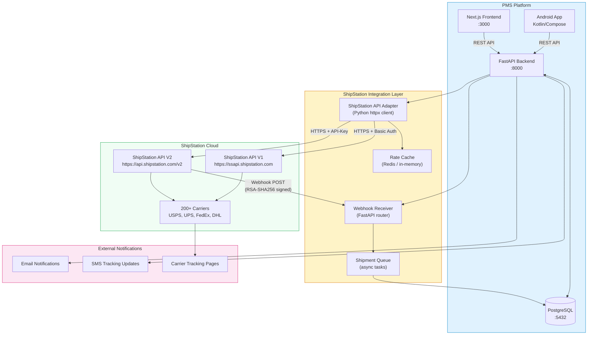

# Product Requirements Document: ShipStation API Integration into Patient Management System (PMS)

**Document ID:** PRD-PMS-SHIPSTATION-001
**Version:** 1.0
**Date:** 2026-03-11
**Author:** Ammar (CEO, MPS Inc.)
**Status:** Draft

---

## 1. Executive Summary

**ShipStation** is a cloud-based shipping and fulfillment platform with a REST API (V1 and V2) that provides access to 200+ carriers (including USPS, UPS, FedEx, and DHL), automated label creation, rate shopping, address validation, package tracking, and webhook-driven event notifications. The platform processes millions of shipments monthly and is used by over 130,000 e-commerce sellers. ShipStation's API V2 adds batch label creation, return labels, manifests, and enhanced tracking — all accessible via a single integration point.

Integrating ShipStation into PMS addresses a concrete operational need: **shipping lab samples to reference laboratories and sending medical supplies, test kits, and durable medical equipment (DME) to patients**. The primary use case is **lab sample logistics** — when a clinic collects blood, urine, or tissue samples, those specimens must be shipped to external labs (Quest, LabCorp, specialty reference labs) with proper tracking and chain-of-custody documentation. Currently, clinic staff manually coordinate these shipments through carrier websites, re-entering addresses and tracking numbers. This creates data entry errors, missed pickups, lost tracking visibility, and no audit trail linking shipments back to patient encounters.

With ShipStation integrated, PMS can automate the entire shipment lifecycle — from a lab order triggering specimen pickup, through label creation and carrier selection, to real-time tracking updates visible to lab coordinators and providers. Secondary use cases include shipping home health supplies, test kits, and DME directly to patients. Shipping costs are optimized through rate comparison across carriers, address validation prevents failed deliveries, and every shipment is linked to the originating patient record and encounter for complete traceability.

## 2. Problem Statement

PMS clinics face three fulfillment-related operational bottlenecks:

1. **Manual lab sample shipment coordination**: When a provider orders lab work and specimens are collected in-clinic, staff must manually create shipping labels to send samples to reference labs (Quest, LabCorp, specialty labs). This involves looking up the lab's receiving address, typing it into a carrier website, selecting services with appropriate handling, and copying tracking numbers into the patient chart — consuming 15–30 minutes per shipment and risking specimen delivery delays that affect patient care.

2. **No shipment visibility in clinical context**: Tracking information lives in carrier portals disconnected from the PMS. When a provider asks "did the specimen arrive at the lab?", staff must search carrier websites. There is no way to see all pending and delivered shipments for a patient within their clinical record — critical for time-sensitive lab samples.

3. **Cost opacity and carrier lock-in**: Without rate comparison, clinics default to a single carrier regardless of cost or delivery speed. A 2-day UPS shipment may cost $18 when USPS Priority would deliver in the same timeframe for $8. Across hundreds of monthly lab shipments plus patient supply deliveries, this adds up to thousands in unnecessary costs with no analytics to identify trends.

## 3. Proposed Solution

### 3.1 Architecture Overview

### 3.2 Deployment Model

**Cloud SaaS integration** — ShipStation is a hosted service; no self-hosting required. PMS connects via HTTPS REST calls.

| Aspect | Details |
|--------|---------|
| **Hosting** | ShipStation cloud (managed by Auctane) — no on-premise deployment |
| **API Access** | Requires ShipStation Gold Plan ($99/mo US) or Scale Plan (UK/EU/AU/NZ) |
| **Authentication** | V1: Basic HTTP (API Key + Secret). V2: `API-Key` header per request |
| **Data Residency** | ShipStation servers in US. Shipping data (names, addresses) stored by ShipStation |
| **HIPAA** | **ShipStation is NOT HIPAA-compliant** and has not undergone HIPAA audits. PMS must ensure no Protected Health Information (PHI) is transmitted to ShipStation in **API data fields** (order notes, package descriptions, custom fields). You can ship any physical contents (lab samples, medications, supplies, DME) — the restriction applies to **what text data the API call contains**, not what's in the box. Only shipping logistics data (name, address, package dimensions, weight) should be sent in API fields. |
| **PHI Isolation** | PMS strips clinical context from API payloads before sending to ShipStation. The `shipstation_order_id` links back to PMS records internally using an opaque UUID. Diagnosis codes, clinical notes, and test order details stay in PMS — they are not needed by ShipStation to create labels or track packages. |
| **Encryption** | All API calls over TLS 1.2+. Webhook payloads signed with RSA-SHA256 |
| **Docker** | Not applicable — cloud service. PMS adapter runs within existing FastAPI container |

## 4. PMS Data Sources

| PMS API | Relevance to ShipStation | Data Flow |
|---------|--------------------------|-----------|
| **Patient Records API** (`/api/patients`) | Patient shipping address, contact info for delivery notifications | PMS → ShipStation (address only, no clinical data) |
| **Encounter Records API** (`/api/encounters`) | Triggers shipment creation when provider orders home health supplies during encounter | PMS internal — encounter ID stored as shipment reference |
| **Medication & Prescription API** (`/api/prescriptions`) | Links prescription fulfillment to physical shipment (e.g., compounded medication delivery) | PMS internal — prescription ID stored as order reference |
| **Reporting API** (`/api/reports`) | Shipping cost analytics, delivery time metrics, carrier performance dashboards | ShipStation → PMS (aggregated shipping data) |

**Design principle:** The ShipStation API adapter sends only shipping logistics data (name, address, phone, package dimensions, weight) to ShipStation. Clinical details (ICD codes, test order names, clinical notes) are not needed by ShipStation and stay in PMS. Internal PMS UUIDs are used as order references (opaque to ShipStation). You can ship any physical contents — lab samples, medications, supplies — the data separation applies only to what's in the API payload, not what's in the box.

## 5. Component/Module Definitions

### 5.1 ShipStation API Adapter (`pms-backend/integrations/shipstation/`)

**Description:** Python client wrapping ShipStation V2 REST API with retry logic, rate limiting, and credential management.

| Aspect | Details |
|--------|---------|
| **Input** | Shipment requests from PMS business logic (address, dimensions, weight, service preferences) |
| **Output** | Label PDFs/PNGs/ZPL, tracking numbers, rate quotes, shipment status |
| **PMS APIs Used** | `/api/patients` (address lookup), `/api/prescriptions` (order reference) |
| **Key Methods** | `create_label()`, `get_rates()`, `validate_address()`, `void_label()`, `create_return_label()`, `get_tracking()` |
| **Rate Limit Handling** | Token bucket (40 req/min V1, 200 req/min V2) with exponential backoff |

### 5.2 Webhook Receiver (`pms-backend/integrations/shipstation/webhooks.py`)

**Description:** FastAPI router receiving ShipStation webhook events, verifying RSA-SHA256 signatures, and dispatching to internal handlers.

| Aspect | Details |
|--------|---------|
| **Input** | HTTP POST from ShipStation with JSON payload and signature header |
| **Output** | Updated shipment status in PostgreSQL, push notifications to Android app |
| **Events Handled** | `track` (tracking updates), `fulfillment_shipped_v2` (shipment confirmed), `batch_processed_v2` (bulk label results), `fulfillment_rejected_v2` (carrier rejection) |
| **Security** | RSA-SHA256 signature verification on every webhook; reject unsigned requests |

### 5.3 Shipment Manager Service (`pms-backend/services/shipment_service.py`)

**Description:** Business logic layer orchestrating the shipment lifecycle — from lab-order-triggered specimen shipments to reference labs, and encounter-triggered supply deliveries to patients.

| Aspect | Details |
|--------|---------|
| **Input** | Lab orders requiring specimen shipment, encounter-linked supply orders, prescription fulfillment requests |
| **Output** | Created shipments with tracking, cost allocation, delivery ETAs, chain-of-custody records |
| **PMS APIs Used** | `/api/encounters`, `/api/prescriptions`, `/api/patients`, `/api/reports` |
| **Workflow** | Validate destination → Rate shop → Create label → Store tracking → Notify staff/patient → Monitor delivery |

### 5.4 Shipment Tracking Dashboard (Next.js)

**Description:** Frontend component showing shipment status within patient records — tracking timeline, carrier info, delivery proof.

| Aspect | Details |
|--------|---------|
| **Input** | Shipment data from PMS backend API |
| **Output** | Visual tracking timeline, rate comparison UI, bulk shipment management |
| **Pages** | Patient detail → Shipments tab, Staff → Fulfillment queue, Admin → Shipping analytics |

### 5.5 Patient Delivery Tracker (Android)

**Description:** Android component showing patients their incoming shipments with real-time tracking and push notification on delivery.

| Aspect | Details |
|--------|---------|
| **Input** | Shipment tracking data via PMS API |
| **Output** | Tracking map, ETA display, delivery confirmation, push notifications |

## 6. Non-Functional Requirements

### 6.1 Security and HIPAA Compliance

| Requirement | Implementation |
|-------------|----------------|
| **Data Minimization** | ShipStation API adapter sends only logistics data (name, address, dimensions, weight) needed for shipping. Clinical details (diagnosis, test orders, medications) stay in PMS — they aren't needed for label creation or tracking |
| **Audit Logging** | Every ShipStation API call logged with timestamp, user, action, and PMS record reference (encounter/prescription ID). Logs retained 7 years per HIPAA |
| **Credential Storage** | API keys stored in environment variables or secrets manager (AWS Secrets Manager / HashiCorp Vault). Never in code or database |
| **Webhook Verification** | RSA-SHA256 signature validation on all incoming webhooks. IP allowlist for ShipStation webhook origins |
| **Access Control** | Only authorized PMS roles (Nurse, Office Manager, Admin) can create shipments. Patients can only view their own tracking |
| **Reference Opacity** | ShipStation order references use opaque PMS UUIDs. No patient MRN, DOB, or SSN in API fields |
| **BAA** | ShipStation does NOT sign BAAs. Since only logistics data (name, address, package details) is sent — not clinical information — a BAA is not required for this integration pattern |

### 6.2 Performance

| Metric | Target |
|--------|--------|
| Label creation latency | < 3 seconds (single label) |
| Rate shopping response | < 5 seconds (compare 5+ carriers) |
| Webhook processing | < 500ms from receipt to database update |
| Batch label throughput | 100 labels in < 60 seconds |
| Address validation | < 1 second per address |

### 6.3 Infrastructure

| Requirement | Details |
|-------------|---------|
| **Network** | Outbound HTTPS to `api.shipstation.com` and `ssapi.shipstation.com` |
| **Inbound Webhooks** | Public HTTPS endpoint for ShipStation webhook callbacks (use existing PMS domain + `/webhooks/shipstation`) |
| **Database** | New `shipments` table in PostgreSQL with FK to `patients`, `encounters`, `prescriptions` |
| **Caching** | Optional Redis cache for rate quotes (TTL 15 minutes) to reduce API calls |
| **No additional containers** | Runs within existing FastAPI backend — no new services to deploy |

## 7. Implementation Phases

### Phase 1 — Foundation (Sprints 1–2, 4 weeks)

| Task | Details |
|------|---------|
| ShipStation account setup | Create account, obtain API keys, configure carriers |
| API adapter implementation | Python client with auth, rate limiting, retry logic |
| Database schema | `shipments`, `shipment_events`, `shipping_addresses` tables |
| Address validation endpoint | `/api/shipments/validate-address` |
| Rate shopping endpoint | `/api/shipments/rates` |
| PHI firewall unit tests | Automated tests verifying no clinical data leaks to ShipStation |

### Phase 2 — Core Integration (Sprints 3–4, 4 weeks)

| Task | Details |
|------|---------|
| Label creation workflow | End-to-end: encounter → supply order → label → tracking |
| Webhook receiver | Tracking events, signature verification, status updates |
| Frontend shipment tab | Patient detail page → Shipments section with tracking timeline |
| Bulk shipment support | Batch label creation for scheduled supply shipments |
| Return label generation | Patient-initiated returns for defective supplies |

### Phase 3 — Advanced Features (Sprints 5–6, 4 weeks)

| Task | Details |
|------|---------|
| Android tracking | Patient-facing delivery tracker with push notifications |
| Shipping analytics dashboard | Cost per carrier, delivery time trends, failed delivery rates |
| Automated supply reorder | Recurring shipments for chronic care patients (monthly supplies) |
| Multi-warehouse support | Route shipments from nearest warehouse/clinic location |
| n8n automation integration | ShipStation webhooks → n8n workflows for escalation and alerts |

## 8. Success Metrics

| Metric | Target | Measurement Method |
|--------|--------|-------------------|
| Shipment creation time | < 2 minutes (vs 15–30 min manual) | Time from encounter order to label printed |
| Address validation error rate | < 1% failed deliveries | ShipStation delivery exception tracking |
| Shipping cost reduction | 15–25% savings via rate shopping | Monthly shipping spend comparison |
| Staff time saved | 10+ hours/week across clinic | Time tracking before/after |
| Patient tracking satisfaction | > 90% can self-serve tracking | Patient portal usage analytics |
| Webhook processing reliability | 99.9% events processed | Webhook receipt vs database update audit |

## 9. Risks and Mitigations

| Risk | Impact | Mitigation |
|------|--------|------------|
| **ShipStation is not HIPAA-compliant** | Clinical data exposure if inadvertently included in API fields | Adapter sends only logistics data by design; automated tests verify no clinical fields in outgoing payloads; code review checklist for new shipping features |
| **API rate limiting (40 req/min V1, 200 req/min V2)** | Throttling during bulk operations | Rate limiter with queuing; use V2 batch endpoints; spread bulk operations over time |
| **API access requires Gold Plan ($99/mo+)** | Ongoing SaaS cost | Justified by staff time savings and shipping cost reduction; ROI positive at ~50 shipments/month |
| **ShipStation API pricing increased 10x in 2025** | Future cost escalation | Abstract adapter layer allows switching to Shippo/EasyPost; no vendor lock-in in PMS code |
| **Webhook delivery failures** | Missed tracking updates | Polling fallback for critical shipments; webhook retry with dead letter queue |
| **Patient address accuracy** | Failed deliveries, wasted labels | Address validation before every label creation; flag PO Boxes for carriers that don't deliver to them |
| **Carrier outages** | Cannot create labels | Multi-carrier fallback — if primary carrier API is down, auto-switch to alternative |

## 10. Dependencies

| Dependency | Version / Tier | Purpose |
|------------|---------------|---------|
| ShipStation Account | Gold Plan ($99/mo+) | API access |
| ShipStation API V2 | Latest (early access) | Batch labels, manifests, return labels |
| ShipStation API V1 | Stable | Legacy endpoints not yet in V2 |
| Python `httpx` | ≥ 0.27 | Async HTTP client for API calls |
| PostgreSQL | Existing | Shipment state persistence |
| FastAPI | Existing | Webhook receiver, REST endpoints |
| Next.js | Existing | Shipment tracking frontend |
| Redis (optional) | ≥ 7.0 | Rate quote caching |
| Carrier accounts | USPS, UPS, FedEx (minimum) | Connected in ShipStation dashboard |

## 11. Comparison with Existing Experiments

### ShipStation API vs n8n 2.0+ (Experiment 34) — Complementary

| Dimension | ShipStation API (Exp 80) | n8n 2.0+ (Exp 34) |
|-----------|--------------------------|---------------------|
| **Focus** | Shipping/fulfillment execution | Workflow automation |
| **Role** | Creates labels, tracks packages, shops rates | Orchestrates business logic and notifications |
| **Integration** | Direct REST API to ShipStation cloud | Visual workflow connecting multiple services |
| **Use Together** | n8n can trigger ShipStation shipments based on encounter events, send delivery alerts, and escalate failed deliveries |

### ShipStation API vs A2A Protocol (Experiment 63) — Different Scope

| Dimension | ShipStation API (Exp 80) | A2A Protocol (Exp 63) |
|-----------|--------------------------|------------------------|
| **Focus** | Physical goods shipping | Agent-to-agent communication |
| **Interaction** | PMS → ShipStation cloud API | PMS agents ↔ external agents |
| **Future Synergy** | A2A could enable PMS agents to negotiate with carrier agents for dynamic pricing and scheduling |

### ShipStation API vs Supabase + Claude Code (Experiment 58) — Complementary Infrastructure

ShipStation shipment data stored in PostgreSQL (managed via Supabase) with real-time subscriptions for tracking updates pushed to the frontend — combining Exp 58's real-time database capabilities with Exp 80's shipping logistics.

## 12. Research Sources

### Official Documentation
- [ShipStation API Documentation](https://docs.shipstation.com/) — V2 API reference, getting started guide
- [ShipStation API V1 Reference](https://www.shipstation.com/docs/api/) — V1 endpoints, models, webhooks
- [ShipStation Fulfillment API Overview](https://www.shipstation.com/fulfillment/api/) — Product capabilities and carrier coverage
- [ShipStation API Requirements](https://www.shipstation.com/docs/api/requirements/) — Authentication, base URL, rate limits

### Pricing & Plans
- [ShipStation Pricing](https://www.shipstation.com/pricing/) — Plan tiers and API access requirements
- [Usage & Rate Limits](https://docs.shipstation.com/rate-limits) — API call quotas and throttling

### Security & Compliance
- [ShipStation HIPAA Community Discussion](https://community.shipstation.com/t5/Account-Settings/HIPAA-Compliance/idi-p/3322) — ShipStation's HIPAA compliance status
- [Security & Authentication](https://docs.shipstation.com/authentication) — V2 API-Key auth, webhook signatures

### Ecosystem & Alternatives
- [Shippo vs ShipStation Comparison](https://goshippo.com/blog/shippo-vs-shipstation-which-shipping-platform-delivers-better-value) — Feature and pricing comparison
- [EasyPost vs ShipStation vs Shippo Comparison](https://1teamsoftware.com/2025/05/01/shipstation-vs-shippo-vs-easypost/) — Multi-platform analysis

## 13. Appendix: Related Documents

- [ShipStation API Setup Guide](80-ShipStationAPI-PMS-Developer-Setup-Guide.md) — Step-by-step setup and PMS integration
- [ShipStation API Developer Tutorial](80-ShipStationAPI-Developer-Tutorial.md) — Hands-on tutorial building a shipment workflow
- [n8n 2.0+ PRD](34-PRD-n8nUpdates-PMS-Integration.md) — Complementary workflow automation
- [A2A Protocol PRD](63-PRD-A2A-PMS-Integration.md) — Agent-to-agent communication
- [Supabase + Claude Code PRD](58-PRD-SupabaseClaudeCode-PMS-Integration.md) — Real-time database integration
- [ShipStation Official API Docs](https://docs.shipstation.com/)
