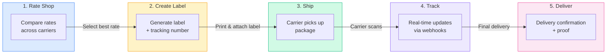
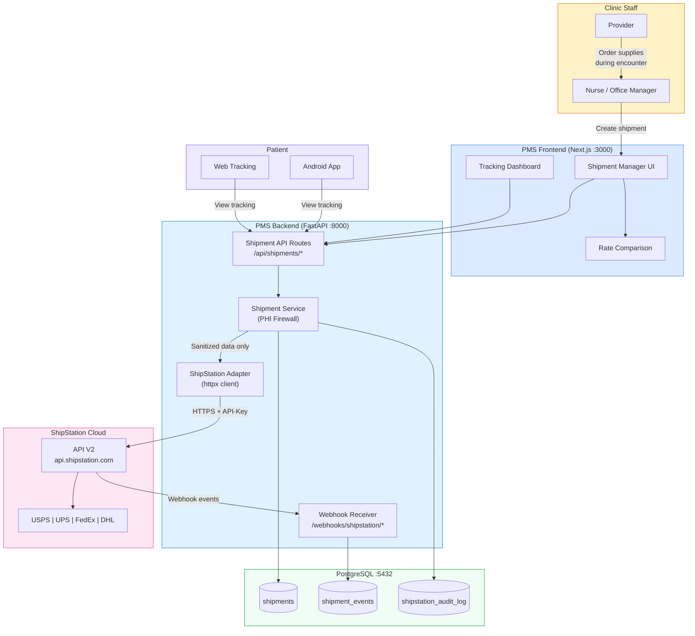

# ShipStation API Developer Onboarding Tutorial

**Welcome to the MPS PMS ShipStation API Integration Team**

This tutorial will take you from zero to building your first shipping workflow with the PMS. By the end, you will understand how ShipStation's API works, have a running local environment, and have built and tested a complete medical supply shipment flow — from a provider ordering supplies during an encounter to a patient tracking their delivery on their phone.

**Document ID:** PMS-EXP-SHIPSTATION-002
**Version:** 1.0
**Date:** 2026-03-11
**Applies To:** PMS project (all platforms)
**Prerequisite:** [ShipStation API Setup Guide](80-ShipStationAPI-PMS-Developer-Setup-Guide.md)
**Estimated time:** 2-3 hours
**Difficulty:** Beginner-friendly

---

## What You Will Learn

1. How ShipStation's shipping API works and where it fits in the PMS architecture
2. The difference between ShipStation API V1 (Basic Auth) and V2 (API-Key header)
3. How to validate patient shipping addresses before creating labels
4. How to compare rates across USPS, UPS, and FedEx in a single API call
5. How to create shipping labels and download them as PDFs
6. How to receive real-time tracking updates via webhooks
7. How the PHI firewall prevents clinical data from leaking to ShipStation
8. How to build a patient-facing shipment tracker in the Next.js frontend
9. How to connect shipments to encounters and prescriptions for audit trails
10. How to handle errors, void labels, and create return labels

---

## Part 1: Understanding ShipStation API (15 min read)

### 1.1 What Problem Does ShipStation Solve?

When a provider at an MPS clinic orders lab work and specimens are collected, the office staff currently faces a manual shipping workflow:

1. Log into the USPS/UPS/FedEx website
2. Manually type the reference lab's receiving address
3. Select a shipping service with appropriate speed for specimen viability
4. Copy the tracking number into the patient's chart
5. When the provider asks "did the specimen arrive?", search the carrier website

This takes **15–30 minutes per shipment**, risks specimen viability if the wrong service speed is selected, and creates no audit trail linking the shipment back to the lab order. The same problem applies when shipping supplies, test kits, or DME to patients.

**ShipStation solves this** by providing a single API that connects to 200+ carriers. PMS calls one API to validate addresses, compare rates, create labels, and receive tracking updates — all programmatically, all linked to the patient's encounter and lab order.

### 1.2 How ShipStation Works — The Key Pieces



**Three core concepts:**

1. **Rate Shopping** — Send package dimensions and destination to ShipStation; get back rates from all connected carriers. Pick the cheapest, fastest, or best value.

2. **Label Creation** — Once you pick a rate, ShipStation creates the label (PDF/PNG/ZPL), assigns a tracking number, and charges the carrier account. The label is ready to print and stick on the box.

3. **Webhooks** — ShipStation sends HTTP POST events to your server whenever a tracking status changes. You don't need to poll — updates arrive automatically.

### 1.3 How ShipStation Fits with Other PMS Technologies

| Technology | Experiment | Relationship to ShipStation |
|------------|------------|----------------------------|
| n8n 2.0+ | Exp 34 | n8n can orchestrate ShipStation workflows — trigger shipments from encounter events, send delivery alerts, escalate exceptions |
| Supabase | Exp 58 | Shipment data stored in PostgreSQL; Supabase real-time subscriptions push tracking updates to frontend |
| CrewAI | Exp 55 | AI agents could automate carrier selection based on delivery urgency and cost rules |
| A2A Protocol | Exp 63 | Future: PMS shipping agent could negotiate with carrier agents for dynamic pricing |
| FHIR | Exp 16 | Shipment events could generate FHIR SupplyDelivery resources for interoperability |
| WebSocket | Exp 37 | Real-time tracking updates pushed to staff dashboard and patient app |
| Docker | Exp 39 | PMS backend (including ShipStation adapter) runs in Docker containers |

### 1.4 Key Vocabulary

| Term | Meaning |
|------|---------|
| **Carrier** | Shipping company (USPS, UPS, FedEx, DHL) connected in ShipStation |
| **Service Code** | Specific shipping service (e.g., `usps_priority_mail`, `ups_ground`, `fedex_2day`) |
| **Label** | Shipping label (PDF/PNG/ZPL) with barcode, tracking number, and addresses |
| **Manifest** | End-of-day summary document listing all labels created, given to carrier at pickup |
| **Webhook** | HTTP POST callback sent by ShipStation when a tracking event occurs |
| **Rate** | Price quote for shipping a package via a specific carrier and service |
| **Batch** | Group of labels created in a single API call (V2 feature) |
| **Void** | Cancel a label before it's used — refunds the shipping charge |
| **Return Label** | Pre-paid label for the patient to return supplies (V2 feature) |
| **PHI Firewall** | PMS architecture pattern ensuring no clinical data reaches ShipStation |
| **Dimensional Weight** | Pricing based on package volume (L×W×H) rather than actual weight |
| **API-Key** | V2 authentication — single key sent in `API-Key` HTTP header |

### 1.5 Our Architecture



---

## Part 2: Environment Verification (15 min)

### 2.1 Checklist

```bash
# 1. PMS Backend running
curl -s http://localhost:8000/docs | grep -q "Swagger" && echo "OK: Backend running" || echo "FAIL"

# 2. PostgreSQL accessible
psql -U pms_user -d pms_db -c "SELECT count(*) FROM shipments;" 2>/dev/null && echo "OK: Shipments table exists" || echo "FAIL: Run migration"

# 3. ShipStation API key configured
[ -n "$SHIPSTATION_API_KEY_V2" ] && echo "OK: V2 API key set" || echo "FAIL: Set SHIPSTATION_API_KEY_V2"

# 4. ShipStation API accessible
curl -s -o /dev/null -w "%{http_code}" \
  -H "API-Key: $SHIPSTATION_API_KEY_V2" \
  https://api.shipstation.com/v2/carriers && echo " OK: API accessible" || echo " FAIL"

# 5. At least one carrier connected
CARRIER_COUNT=$(curl -s -H "API-Key: $SHIPSTATION_API_KEY_V2" \
  https://api.shipstation.com/v2/carriers | python -c "import sys,json; print(len(json.load(sys.stdin).get('carriers',[])))")
echo "Carriers connected: $CARRIER_COUNT"
```

### 2.2 Quick Test

Run the complete flow in one command:

```bash
# Validate an address via PMS API
curl -s -X POST http://localhost:8000/api/shipments/rates \
  -H "Content-Type: application/json" \
  -H "Authorization: Bearer $TOKEN" \
  -d '{
    "patient_id": "'"$TEST_PATIENT_ID"'",
    "weight_oz": 16,
    "length_in": 10,
    "width_in": 8,
    "height_in": 4
  }' | python -m json.tool
```

If you see a JSON array of rate quotes with carrier names and prices, your environment is working.

---

## Part 3: Build Your First Integration (45 min)

### 3.1 What We Are Building

A **complete lab sample shipment workflow**: after a provider orders blood work during an encounter and the phlebotomist collects the specimen, a lab coordinator ships the sample to a reference lab. The system validates the lab's address, compares rates (prioritizing speed for specimen viability), creates a label, and starts tracking — all linked back to the encounter and lab order.

### 3.2 Step 1: Create a Test Patient with Shipping Address

```python
# scripts/seed_test_shipment.py

import asyncio
import httpx

API = "http://localhost:8000"
TOKEN = "your_dev_token_here"
HEADERS = {"Authorization": f"Bearer {TOKEN}", "Content-Type": "application/json"}

async def seed():
    async with httpx.AsyncClient() as client:
        # Create test patient (or use existing)
        patient = await client.post(f"{API}/api/patients", headers=HEADERS, json={
            "first_name": "Maria",
            "last_name": "Garcia",
            "date_of_birth": "1985-06-15",
            "address_line1": "456 Oak Avenue",
            "address_line2": "Apt 2B",
            "city": "Austin",
            "state": "TX",
            "postal_code": "78701",
            "phone": "512-555-0123",
            "email": "maria.garcia@example.com",
        })
        patient_data = patient.json()
        print(f"Patient ID: {patient_data['id']}")

        # Create encounter
        encounter = await client.post(f"{API}/api/encounters", headers=HEADERS, json={
            "patient_id": patient_data["id"],
            "encounter_type": "office_visit",
            "provider_id": "PROVIDER_UUID",
            "notes": "Patient needs wound care supplies shipped to home.",
        })
        encounter_data = encounter.json()
        print(f"Encounter ID: {encounter_data['id']}")

        return patient_data["id"], encounter_data["id"]

asyncio.run(seed())
```

### 3.3 Step 2: Validate the Patient's Address

```python
# scripts/demo_shipment_flow.py — Part 1

import asyncio
import httpx

API = "http://localhost:8000"
TOKEN = "your_dev_token_here"
HEADERS = {"Authorization": f"Bearer {TOKEN}", "Content-Type": "application/json"}

PATIENT_ID = "PASTE_PATIENT_UUID"
ENCOUNTER_ID = "PASTE_ENCOUNTER_UUID"

async def validate_address():
    async with httpx.AsyncClient() as client:
        resp = await client.post(f"{API}/api/shipments/validate-address", headers=HEADERS, json={
            "patient_id": PATIENT_ID,
        })
        result = resp.json()
        print("Address validation result:")
        print(f"  Status: {result.get('status')}")
        print(f"  Matched: {result.get('matched_address', {}).get('address_line1')}")
        print(f"  Messages: {result.get('messages', [])}")
        return result

asyncio.run(validate_address())
```

**What's happening:**
- PMS loads the patient's address from PostgreSQL
- The PHI firewall strips clinical data — only name + address go to ShipStation
- ShipStation returns a validated/corrected address with any warnings

### 3.4 Step 3: Compare Shipping Rates

```python
# scripts/demo_shipment_flow.py — Part 2

async def compare_rates():
    async with httpx.AsyncClient() as client:
        resp = await client.post(f"{API}/api/shipments/rates", headers=HEADERS, json={
            "patient_id": PATIENT_ID,
            "weight_oz": 24,       # Wound care kit weight
            "length_in": 12,
            "width_in": 10,
            "height_in": 6,
        })
        rates = resp.json()

        print(f"\n{'Carrier':<20} {'Service':<30} {'Cost':>8} {'Days':>6}")
        print("-" * 66)
        for rate in sorted(rates, key=lambda r: r.get("shipping_amount", {}).get("amount", 999)):
            carrier = rate.get("carrier_friendly_name", "Unknown")
            service = rate.get("service_type", "Unknown")
            cost = rate.get("shipping_amount", {}).get("amount", 0)
            days = rate.get("delivery_days", "?")
            print(f"{carrier:<20} {service:<30} ${cost:>7.2f} {days:>5}d")

        # Return cheapest rate
        cheapest = min(rates, key=lambda r: r.get("shipping_amount", {}).get("amount", 999))
        print(f"\nRecommended: {cheapest['carrier_friendly_name']} {cheapest['service_type']} — ${cheapest['shipping_amount']['amount']:.2f}")
        return cheapest

asyncio.run(compare_rates())
```

**Expected output:**

```
Carrier              Service                           Cost   Days
------------------------------------------------------------------
USPS                 Priority Mail                    $ 8.45     2d
USPS                 First Class Package              $ 4.50     5d
UPS                  Ground                           $12.30     5d
UPS                  3 Day Select                     $18.75     3d
FedEx                Ground                           $11.90     5d
FedEx                2Day                             $22.40     2d

Recommended: USPS Priority Mail — $8.45
```

### 3.5 Step 4: Create the Shipping Label

```python
# scripts/demo_shipment_flow.py — Part 3

async def create_shipment(rate: dict):
    async with httpx.AsyncClient() as client:
        resp = await client.post(f"{API}/api/shipments", headers=HEADERS, json={
            "patient_id": PATIENT_ID,
            "encounter_id": ENCOUNTER_ID,
            "carrier_id": rate["carrier_id"],
            "service_code": rate["service_code"],
            "weight_oz": 24,
            "length_in": 12,
            "width_in": 10,
            "height_in": 6,
        })
        shipment = resp.json()

        print(f"\nShipment created!")
        print(f"  Shipment ID:     {shipment['id']}")
        print(f"  Tracking Number: {shipment.get('tracking_number', 'Pending')}")
        print(f"  Label URL:       {shipment.get('label_url', 'Pending')}")
        print(f"  Shipping Cost:   ${shipment.get('shipping_cost', 0):.2f}")
        print(f"  Status:          {shipment['status']}")

        return shipment

# Chain the full flow
async def full_flow():
    rate = await compare_rates()
    shipment = await create_shipment(rate)
    return shipment

asyncio.run(full_flow())
```

**What's happening behind the scenes:**
1. `ShipmentService.create_shipment()` loads patient address from DB
2. PHI firewall ensures only `name + address + phone` reach ShipStation
3. ShipStation V2 API creates the label and returns tracking number + PDF URL
4. PMS stores shipment record linked to `patient_id`, `encounter_id`
5. Audit log records the API call for HIPAA compliance

### 3.6 Step 5: Monitor Tracking via Webhooks

When the carrier scans the package, ShipStation sends a webhook to your PMS endpoint:

```json
{
  "resource_type": "SHIP_NOTIFY",
  "resource_url": "/shipments?shipmentId=12345678",
  "event_data": {
    "tracking_number": "9400111899223456789012",
    "carrier_code": "stamps_com",
    "status_description": "In Transit",
    "status_code": "IT"
  }
}
```

Your `webhook_receiver.py` verifies the signature, extracts the tracking data, and updates the `shipment_events` table. The frontend polls or receives a WebSocket push to update the tracking UI.

```bash
# Check shipment tracking events after webhook fires
curl -s http://localhost:8000/api/shipments/$SHIPMENT_ID/tracking \
  -H "Authorization: Bearer $TOKEN" | python -m json.tool
```

**Checkpoint:** You've built a complete flow — address validation → rate shopping → label creation → tracking.

---

## Part 4: Evaluating Strengths and Weaknesses (15 min)

### 4.1 Strengths

- **Carrier breadth**: 200+ carriers via one API — no need for individual carrier integrations
- **Rate shopping**: Compare prices across carriers in a single call, saving 15-25% on shipping costs
- **V2 batch operations**: Create hundreds of labels in one request — critical for monthly supply shipments
- **Webhook-driven tracking**: Real-time updates without polling
- **Address validation**: Prevents failed deliveries before they happen
- **Return labels (V2)**: Patients can return defective supplies easily
- **Mature ecosystem**: 130,000+ sellers, extensive documentation, Postman collections, OpenAPI 3.0 spec

### 4.2 Weaknesses

- **Not HIPAA-compliant**: ShipStation has no BAA, no HIPAA audit. PHI firewall is entirely your responsibility
- **API access requires Gold Plan ($99/mo+)**: Price increased 10x in May 2025 (was $9.95). Ongoing SaaS cost
- **Rate limits**: 40 req/min (V1), 200 req/min (V2) — can be constraining for bulk operations
- **V2 is still early access**: Some V1 endpoints not yet available in V2. May need both versions
- **No official Python SDK**: Must use raw HTTP client (httpx/requests). Community wrappers exist but are unofficial
- **Webhook reliability**: Webhook deliveries can be delayed or dropped — need polling fallback for critical shipments
- **US-centric pricing**: International shipping options exist but are more complex to configure

### 4.3 When to Use ShipStation vs Alternatives

| Scenario | Best Choice | Why |
|----------|------------|-----|
| High-volume clinic (100+ shipments/month) | **ShipStation** | Batch labels, rate shopping ROI justifies $99/mo |
| Low-volume / startup clinic (<50/month) | **Shippo** | API access on all plans (free tier available), simpler pricing |
| Budget-constrained, USPS/UPS only | **Pirate Ship** | Free, no monthly fees, but limited carriers and no API |
| Custom carrier integrations needed | **EasyPost** | Developer-focused, pay-per-label, 100+ carriers |
| Need HIPAA-compliant shipping platform | **None of these** | Consider UPS Healthcare API or FedEx Healthcare directly with BAA |

### 4.4 HIPAA / Healthcare Considerations

ShipStation is NOT HIPAA-compliant and will NOT sign a Business Associate Agreement (BAA). However, this doesn't limit **what you can physically ship** — it limits **what data you put in the API fields**.

| Requirement | Our Approach |
|-------------|-------------|
| **API data contains only logistics info** | The adapter sends name, address, phone, and package dimensions to ShipStation. Clinical details (test orders, diagnoses, medication names) stay in PMS — ShipStation doesn't need them to create labels |
| **Package descriptions** | Use general terms: "Medical Supplies", "Laboratory Specimens", "Healthcare Products". Don't include specific test names or patient conditions in API text fields |
| **Physical contents** | You can ship **anything legal** — lab samples, medications, insulin pumps, DME, controlled substances (with proper carrier compliance). The restriction is on the API data, not the box contents |
| **Order references** | Use opaque UUIDs as ShipStation order IDs. MRN, DOB, and encounter codes stay in PMS |
| **Audit trail** | Every ShipStation API call logged in `shipstation_audit_log` with user, action, and timestamp |
| **Access control** | Only Nurse, Office Manager, and Admin roles can create shipments. Patients can only view their own tracking |

**For controlled substances or temperature-sensitive specimens**, ensure the selected carrier service meets regulatory requirements (e.g., UN3373 packaging for Category B biological substances, cold chain for temperature-sensitive samples). ShipStation handles the shipping logistics; your clinic handles the packaging and regulatory compliance.

---

## Part 5: Debugging Common Issues (15 min read)

### Issue 1: "Carrier not found" Error

**Symptom:** `{"error": "carrier_id not found"}` when creating a label.

**Cause:** The carrier isn't connected in ShipStation, or the carrier_id from rate shopping doesn't match.

**Fix:** Call `GET /v2/carriers` to list connected carriers. Connect missing carriers in ShipStation Settings → Carriers. Use the exact `carrier_id` from the rates response.

### Issue 2: Label Created But No Tracking Updates

**Symptom:** Shipment stuck in `label_created` status for hours.

**Cause:** Carrier hasn't scanned the package yet, or webhook isn't registered.

**Fix:**
1. Verify webhook is registered: `GET /v2/environment/webhooks`
2. Check webhook URL is publicly accessible (not localhost)
3. If the package hasn't been given to the carrier, tracking won't start
4. Implement a polling fallback for shipments with no webhook activity after 24 hours

### Issue 3: Rate Shopping Returns Empty Array

**Symptom:** `POST /api/shipments/rates` returns `[]`.

**Cause:** No carriers support the requested origin/destination/weight combination, or all carriers are disconnected.

**Fix:**
1. Verify carriers are connected and active
2. Check package weight isn't exceeding carrier limits (e.g., USPS First Class max 15.99 oz)
3. Verify origin postal code is valid
4. Try with fewer constraints (remove specific service_code filter)

### Issue 4: Webhook Signature Verification Fails

**Symptom:** All webhooks return 401 from your receiver.

**Cause:** Wrong webhook secret, or signature header name mismatch.

**Fix:**
1. ShipStation V2 uses RSA-SHA256 signatures. Verify you're checking the correct header (`X-ShipStation-Signature`)
2. Ensure webhook secret matches what ShipStation expects
3. For development, temporarily log the raw headers and body to diagnose

### Issue 5: Clinical Data in API Payload

**Symptom:** Code review finds specific test names or patient conditions in ShipStation API fields.

**Cause:** A developer passed a lab test name or diagnosis into `package_description` or `label_messages`.

**Fix:**
1. Review the code path that populates ShipStation request data
2. `package_description` should use general terms: "Laboratory Specimens", "Medical Supplies", "Healthcare Products"
3. Specific test names, diagnoses, and medication names aren't needed by ShipStation — keep them in PMS only
4. Remember: this is about the API data fields, not the physical contents of the package

---

## Part 6: Practice Exercise (45 min)

### Option A: Build a Recurring Supply Shipment System

Build a feature where chronic care patients receive automatic monthly shipments:

1. Create a `recurring_shipments` table with patient_id, supply_type, frequency, next_ship_date
2. Write a scheduled task (cron or n8n workflow) that runs daily
3. For each patient with `next_ship_date = today`, auto-create a shipment using their saved preferences
4. Send push notification to patient when label is created

**Hints:**
- Use the batch label endpoint for efficiency
- Store carrier/service preference per patient
- Handle address changes between shipments

### Option B: Build a Shipping Cost Analytics Dashboard

Build a reporting page showing shipping spend trends:

1. Query `shipments` table grouped by carrier, service, month
2. Calculate average cost per shipment by carrier
3. Show delivery time distributions (created → delivered)
4. Identify top cost-saving opportunities (shipments where cheapest rate wasn't selected)

**Hints:**
- Use `/api/reports` aggregation queries
- Chart with Recharts or Chart.js in Next.js
- Compare actual cost vs. cheapest available rate

### Option C: Build a Return Label Flow

Build a patient-initiated return flow for defective supplies:

1. Patient clicks "Return" on a delivered shipment in the Android app
2. PMS calls ShipStation V2 `POST /labels` with `is_return_label: true`
3. Return label PDF is emailed to patient and shown in app
4. Track return shipment separately, update original shipment status to "return_in_progress"

**Hints:**
- V2 return labels use the original shipment's addresses swapped
- Link return shipment to original via `parent_shipment_id` column
- Notify office manager when return is delivered back

---

## Part 7: Development Workflow and Conventions

### 7.1 File Organization

```
pms-backend/
├── integrations/
│   └── shipstation/
│       ├── __init__.py
│       ├── client.py          # ShipStation API adapter
│       ├── webhooks.py        # Webhook receiver routes
│       ├── models.py          # Pydantic models for API payloads
│       └── data_filter.py     # Logistics-only data extraction
├── services/
│   └── shipment_service.py    # Business logic
├── routers/
│   └── shipments.py           # REST API routes
└── migrations/
    └── add_shipments.sql      # Database schema

pms-frontend/
├── lib/api/
│   └── shipments.ts           # API client
└── components/shipments/
    ├── ShipmentTracker.tsx     # Tracking timeline
    ├── RateComparison.tsx      # Rate shopping UI
    └── CreateShipment.tsx      # Shipment creation form
```

### 7.2 Naming Conventions

| Item | Convention | Example |
|------|-----------|---------|
| Database tables | snake_case, plural | `shipments`, `shipment_events` |
| API routes | `/api/shipments/{id}/tracking` | RESTful resource paths |
| Python modules | snake_case | `shipment_service.py` |
| TypeScript files | camelCase | `shipments.ts` |
| React components | PascalCase | `ShipmentTracker.tsx` |
| Environment variables | SCREAMING_SNAKE | `SHIPSTATION_API_KEY_V2` |
| ShipStation references | Opaque UUIDs | `shipstation_order_id = "uuid-only"` |

### 7.3 PR Checklist

- [ ] Only logistics data (name, address, dimensions) in ShipStation API payloads
- [ ] `package_description` uses general terms ("Laboratory Specimens", "Medical Supplies")
- [ ] Order references use opaque UUIDs — no MRN, DOB, encounter codes in API fields
- [ ] API key is read from environment variable, not hardcoded
- [ ] Webhook signature verification is enabled (not bypassed)
- [ ] Rate limiter is active and configured for current plan limits
- [ ] Audit log entry created for every ShipStation API call
- [ ] Error handling covers 401 (auth), 429 (rate limit), 5xx (server error)
- [ ] Unit tests cover the new shipping flow
- [ ] Frontend components handle loading, error, and empty states

### 7.4 Security Reminders

1. **Keep API payloads to logistics data only** — name, address, dimensions, weight. Clinical details (diagnoses, test names, medication specifics) aren't needed by ShipStation and stay in PMS
2. **Package descriptions use general terms** — "Laboratory Specimens", "Medical Supplies". Don't put patient conditions or specific test names in API text fields
3. **You CAN ship anything physical** — lab samples, medications, insulin pumps, DME. The data separation applies to API fields, not box contents
4. **API keys in env vars only** — never commit `.env` files to git
5. **Verify webhook signatures** — reject unsigned requests immediately
6. **Log every API call** — the `shipstation_audit_log` table is required for HIPAA audit readiness
7. **Role-based access** — only authorized clinical staff can create shipments; patients view-only

---

## Part 8: Quick Reference Card

### Key API Endpoints

| Method | PMS Endpoint | Description |
|--------|-------------|-------------|
| `POST` | `/api/shipments/rates` | Compare rates across carriers |
| `POST` | `/api/shipments` | Create shipment + label |
| `GET` | `/api/shipments/patient/{id}` | List patient's shipments |
| `GET` | `/api/shipments/{id}/tracking` | Get tracking events |
| `POST` | `/api/shipments/{id}/void` | Void a label |
| `POST` | `/webhooks/shipstation/tracking` | Receive tracking webhooks |

### Key Environment Variables

```bash
SHIPSTATION_API_KEY_V2=your_v2_key
SHIPSTATION_API_KEY_V1=your_v1_key
SHIPSTATION_API_SECRET_V1=your_v1_secret
SHIPSTATION_BASE_URL_V2=https://api.shipstation.com/v2
SHIPSTATION_BASE_URL_V1=https://ssapi.shipstation.com
SHIPSTATION_WEBHOOK_SECRET=your_webhook_secret
SHIPSTATION_RATE_LIMIT_PER_MIN=200
```

### Key Files

| File | Purpose |
|------|---------|
| `integrations/shipstation/client.py` | API adapter with rate limiting |
| `integrations/shipstation/webhooks.py` | Webhook receiver |
| `integrations/shipstation/phi_firewall.py` | PHI sanitization |
| `services/shipment_service.py` | Business logic |
| `routers/shipments.py` | REST API routes |
| `migrations/add_shipments.sql` | Database schema |

### Quick Commands

```bash
# Test API connectivity
curl -s -H "API-Key: $SHIPSTATION_API_KEY_V2" https://api.shipstation.com/v2/carriers | python -m json.tool

# Start ngrok for webhook dev
ngrok http 8000

# Run PHI firewall tests
pytest tests/test_phi_firewall.py -v

# Check shipment status
curl -s http://localhost:8000/api/shipments/$SHIPMENT_ID/tracking -H "Authorization: Bearer $TOKEN"
```

---

## Next Steps

1. **Complete the [ShipStation Setup Guide](80-ShipStationAPI-PMS-Developer-Setup-Guide.md)** if you haven't set up credentials
2. **Read the [n8n 2.0+ Tutorial](34-n8nUpdates-Developer-Tutorial.md)** to build automated shipment workflows
3. **Explore [WebSocket integration (Exp 37)](37-PRD-WebSocket-PMS-Integration.md)** for real-time tracking push to patients
4. **Review [OWASP LLM Top 10 (Exp 50)](50-PRD-OWASPLLMTop10-PMS-Integration.md)** for security best practices around API integrations
5. **Build the recurring shipment system** (Practice Exercise Option A) for chronic care patients
