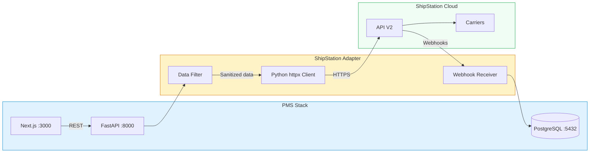

# ShipStation API Setup Guide for PMS Integration

**Document ID:** PMS-EXP-SHIPSTATION-001
**Version:** 1.0
**Date:** 2026-03-11
**Applies To:** PMS project (all platforms)
**Prerequisites Level:** Intermediate

---

## Table of Contents

1. [Overview](#1-overview)
2. [Prerequisites](#2-prerequisites)
3. [Part A: ShipStation Account and API Key Setup](#3-part-a-shipstation-account-and-api-key-setup)
4. [Part B: Integrate with PMS Backend](#4-part-b-integrate-with-pms-backend)
5. [Part C: Integrate with PMS Frontend](#5-part-c-integrate-with-pms-frontend)
6. [Part D: Testing and Verification](#6-part-d-testing-and-verification)
7. [Troubleshooting](#7-troubleshooting)
8. [Reference Commands](#8-reference-commands)

---

## 1. Overview

This guide walks you through integrating ShipStation's shipping and fulfillment API with the PMS backend (FastAPI), frontend (Next.js), and Android app. By the end, you will have:

- A ShipStation account with API credentials configured
- A Python API adapter with rate limiting and PHI firewall
- Webhook receiver for real-time tracking updates
- Database schema for shipment tracking
- Frontend shipment management components
- End-to-end label creation and tracking flow

### Architecture at a Glance



---

## 2. Prerequisites

### 2.1 Required Software

| Software | Minimum Version | Check Command |
|----------|----------------|---------------|
| Python | 3.11+ | `python --version` |
| Node.js | 18+ | `node --version` |
| PostgreSQL | 15+ | `psql --version` |
| pip / uv | Latest | `pip --version` or `uv --version` |
| httpx | 0.27+ | `pip show httpx` |
| git | 2.40+ | `git --version` |

### 2.2 Installation of Prerequisites

Install the Python HTTP client and related packages:

```bash
# Using pip
pip install httpx cryptography pydantic

# Or using uv (faster)
uv pip install httpx cryptography pydantic
```

### 2.3 Verify PMS Services

```bash
# Check FastAPI backend
curl -s http://localhost:8000/docs | head -5
# Expected: HTML response (Swagger UI)

# Check Next.js frontend
curl -s http://localhost:3000 | head -5
# Expected: HTML response

# Check PostgreSQL
psql -U pms_user -d pms_db -c "SELECT 1;"
# Expected: 1 row returned
```

**Checkpoint:** All three PMS services are running and responsive.

---

## 3. Part A: ShipStation Account and API Key Setup

### Step 1: Create a ShipStation Account

1. Go to [https://www.shipstation.com/](https://www.shipstation.com/) and sign up
2. Select the **Gold Plan** (minimum required for API access — $99/month in US/Canada)
3. Complete account verification

### Step 2: Connect Carriers

1. Navigate to **Settings → Shipping → Carriers**
2. Connect at minimum:
   - **USPS** (ShipStation provides discounted USPS rates by default)
   - **UPS** (requires UPS account number)
   - **FedEx** (requires FedEx account credentials)
3. For each carrier, verify the connection shows "Active" status

### Step 3: Generate API Credentials

**For V1 API:**
1. Navigate to **Settings → Account → API Settings** ([https://ss.shipstation.com/#/settings/api](https://ss.shipstation.com/#/settings/api))
2. Copy your **API Key** (username) and **API Secret** (password)

**For V2 API:**
1. Navigate to **Settings → Account → API Keys**
2. Click **Generate New API Key**
3. Copy the generated API key (shown only once)

### Step 4: Configure Environment Variables

```bash
# Add to pms-backend/.env
SHIPSTATION_API_KEY_V1="your_v1_api_key_here"
SHIPSTATION_API_SECRET_V1="your_v1_api_secret_here"
SHIPSTATION_API_KEY_V2="your_v2_api_key_here"
SHIPSTATION_BASE_URL_V1="https://ssapi.shipstation.com"
SHIPSTATION_BASE_URL_V2="https://api.shipstation.com/v2"
SHIPSTATION_WEBHOOK_SECRET="your_webhook_signing_key"
SHIPSTATION_RATE_LIMIT_PER_MIN=200
```

### Step 5: Verify API Access

```bash
# Test V1 API
curl -s -u "$SHIPSTATION_API_KEY_V1:$SHIPSTATION_API_SECRET_V1" \
  https://ssapi.shipstation.com/carriers \
  | python -m json.tool | head -20

# Test V2 API
curl -s -H "API-Key: $SHIPSTATION_API_KEY_V2" \
  https://api.shipstation.com/v2/carriers \
  | python -m json.tool | head -20
```

Expected output: JSON array of connected carriers.

**Checkpoint:** ShipStation account created, carriers connected, API keys generated, environment variables configured, and both V1 and V2 API calls return carrier data.

---

## 4. Part B: Integrate with PMS Backend

### Step 1: Create Database Schema

```sql
-- migrations/add_shipments.sql

CREATE TABLE shipping_addresses (
    id UUID PRIMARY KEY DEFAULT gen_random_uuid(),
    patient_id UUID NOT NULL REFERENCES patients(id),
    name VARCHAR(100) NOT NULL,
    street1 VARCHAR(255) NOT NULL,
    street2 VARCHAR(255),
    city VARCHAR(100) NOT NULL,
    state VARCHAR(2) NOT NULL,
    postal_code VARCHAR(10) NOT NULL,
    country_code VARCHAR(2) NOT NULL DEFAULT 'US',
    phone VARCHAR(20),
    is_validated BOOLEAN DEFAULT FALSE,
    validated_at TIMESTAMP WITH TIME ZONE,
    created_at TIMESTAMP WITH TIME ZONE DEFAULT NOW(),
    updated_at TIMESTAMP WITH TIME ZONE DEFAULT NOW()
);

CREATE TABLE shipments (
    id UUID PRIMARY KEY DEFAULT gen_random_uuid(),
    patient_id UUID NOT NULL REFERENCES patients(id),
    encounter_id UUID REFERENCES encounters(id),
    prescription_id UUID REFERENCES prescriptions(id),
    shipstation_order_id VARCHAR(50),
    shipstation_shipment_id VARCHAR(50),
    shipping_address_id UUID NOT NULL REFERENCES shipping_addresses(id),
    carrier_code VARCHAR(50),
    service_code VARCHAR(50),
    tracking_number VARCHAR(100),
    label_url TEXT,
    status VARCHAR(30) NOT NULL DEFAULT 'pending',
    -- Status: pending, label_created, in_transit, delivered, returned, exception, voided
    ship_date DATE,
    estimated_delivery DATE,
    actual_delivery TIMESTAMP WITH TIME ZONE,
    weight_oz DECIMAL(8,2),
    length_in DECIMAL(6,2),
    width_in DECIMAL(6,2),
    height_in DECIMAL(6,2),
    shipping_cost DECIMAL(10,2),
    insurance_cost DECIMAL(10,2),
    package_description VARCHAR(255),  -- General terms: "Laboratory Specimens", "Medical Supplies"
    created_by UUID NOT NULL,
    created_at TIMESTAMP WITH TIME ZONE DEFAULT NOW(),
    updated_at TIMESTAMP WITH TIME ZONE DEFAULT NOW()
);

CREATE TABLE shipment_events (
    id UUID PRIMARY KEY DEFAULT gen_random_uuid(),
    shipment_id UUID NOT NULL REFERENCES shipments(id),
    event_type VARCHAR(50) NOT NULL,
    status VARCHAR(50) NOT NULL,
    description TEXT,
    location VARCHAR(255),
    occurred_at TIMESTAMP WITH TIME ZONE NOT NULL,
    raw_payload JSONB,
    created_at TIMESTAMP WITH TIME ZONE DEFAULT NOW()
);

-- Indexes
CREATE INDEX idx_shipments_patient ON shipments(patient_id);
CREATE INDEX idx_shipments_encounter ON shipments(encounter_id);
CREATE INDEX idx_shipments_tracking ON shipments(tracking_number);
CREATE INDEX idx_shipments_status ON shipments(status);
CREATE INDEX idx_shipment_events_shipment ON shipment_events(shipment_id);

-- Audit log for HIPAA compliance
CREATE TABLE shipstation_audit_log (
    id BIGSERIAL PRIMARY KEY,
    user_id UUID NOT NULL,
    action VARCHAR(50) NOT NULL,  -- create_label, void_label, get_rates, validate_address
    shipment_id UUID REFERENCES shipments(id),
    request_summary JSONB,  -- Sanitized request metadata (no PHI)
    response_status INTEGER,
    created_at TIMESTAMP WITH TIME ZONE DEFAULT NOW()
);
```

Run the migration:

```bash
psql -U pms_user -d pms_db -f migrations/add_shipments.sql
```

**Checkpoint:** Four new tables created: `shipping_addresses`, `shipments`, `shipment_events`, `shipstation_audit_log`.

### Step 2: Create the ShipStation API Adapter

```python
# pms-backend/integrations/shipstation/client.py

import base64
import time
from typing import Optional
import httpx
from pydantic import BaseModel
from ..config import settings

class ShipStationAddress(BaseModel):
    name: str
    street1: str
    street2: Optional[str] = None
    city: str
    state: str
    postal_code: str
    country_code: str = "US"
    phone: Optional[str] = None

class ShipStationPackage(BaseModel):
    weight_oz: float
    length_in: float
    width_in: float
    height_in: float

class ShipStationClient:
    """
    ShipStation API V2 client with rate limiting and PHI firewall.

    This client sends only shipping logistics data (name, address,
    package dimensions) to ShipStation. Clinical details stay in PMS.
    """

    def __init__(self):
        self.base_url_v2 = settings.SHIPSTATION_BASE_URL_V2
        self.base_url_v1 = settings.SHIPSTATION_BASE_URL_V1
        self.api_key_v2 = settings.SHIPSTATION_API_KEY_V2
        self._v1_auth = base64.b64encode(
            f"{settings.SHIPSTATION_API_KEY_V1}:{settings.SHIPSTATION_API_SECRET_V1}".encode()
        ).decode()
        self.rate_limit = settings.SHIPSTATION_RATE_LIMIT_PER_MIN
        self._request_timestamps: list[float] = []
        self._client = httpx.AsyncClient(timeout=30.0)

    async def _throttle(self):
        """Enforce rate limit (200 req/min for V2)."""
        now = time.time()
        self._request_timestamps = [
            ts for ts in self._request_timestamps if now - ts < 60
        ]
        if len(self._request_timestamps) >= self.rate_limit:
            wait = 60 - (now - self._request_timestamps[0])
            if wait > 0:
                await asyncio.sleep(wait)
        self._request_timestamps.append(time.time())

    async def _request_v2(self, method: str, path: str, **kwargs) -> dict:
        await self._throttle()
        response = await self._client.request(
            method,
            f"{self.base_url_v2}{path}",
            headers={"API-Key": self.api_key_v2, "Content-Type": "application/json"},
            **kwargs,
        )
        response.raise_for_status()
        return response.json()

    async def _request_v1(self, method: str, path: str, **kwargs) -> dict:
        await self._throttle()
        response = await self._client.request(
            method,
            f"{self.base_url_v1}{path}",
            headers={
                "Authorization": f"Basic {self._v1_auth}",
                "Content-Type": "application/json",
            },
            **kwargs,
        )
        response.raise_for_status()
        return response.json()

    # --- Core API Methods ---

    async def validate_address(self, address: ShipStationAddress) -> dict:
        """Validate a shipping address before label creation."""
        return await self._request_v2("POST", "/addresses/validate", json=[{
            "name": address.name,
            "address_line1": address.street1,
            "address_line2": address.street2,
            "city_locality": address.city,
            "state_province": address.state,
            "postal_code": address.postal_code,
            "country_code": address.country_code,
        }])

    async def get_rates(
        self,
        ship_from_postal: str,
        address: ShipStationAddress,
        package: ShipStationPackage,
    ) -> list[dict]:
        """Compare shipping rates across connected carriers."""
        return await self._request_v2("POST", "/rates", json={
            "rate_options": {"carrier_ids": []},  # Empty = all carriers
            "shipment": {
                "ship_from": {"postal_code": ship_from_postal, "country_code": "US"},
                "ship_to": {
                    "name": address.name,
                    "address_line1": address.street1,
                    "city_locality": address.city,
                    "state_province": address.state,
                    "postal_code": address.postal_code,
                    "country_code": address.country_code,
                },
                "packages": [{
                    "weight": {"value": package.weight_oz, "unit": "ounce"},
                    "dimensions": {
                        "length": package.length_in,
                        "width": package.width_in,
                        "height": package.height_in,
                        "unit": "inch",
                    },
                }],
            },
        })

    async def create_label(
        self,
        address: ShipStationAddress,
        package: ShipStationPackage,
        carrier_id: str,
        service_code: str,
        ship_from_postal: str,
        reference: str,  # Opaque PMS ID — NO PHI
    ) -> dict:
        """Create a shipping label. Returns label URL and tracking number."""
        return await self._request_v2("POST", "/labels", json={
            "shipment": {
                "carrier_id": carrier_id,
                "service_code": service_code,
                "ship_from": {"postal_code": ship_from_postal, "country_code": "US"},
                "ship_to": {
                    "name": address.name,
                    "address_line1": address.street1,
                    "address_line2": address.street2,
                    "city_locality": address.city,
                    "state_province": address.state,
                    "postal_code": address.postal_code,
                    "country_code": address.country_code,
                    "phone": address.phone,
                },
                "packages": [{
                    "weight": {"value": package.weight_oz, "unit": "ounce"},
                    "dimensions": {
                        "length": package.length_in,
                        "width": package.width_in,
                        "height": package.height_in,
                        "unit": "inch",
                    },
                    "label_messages": {
                        "reference1": reference,  # Opaque UUID only
                    },
                }],
            },
            "label_format": "pdf",
            "label_layout": "4x6",
        })

    async def void_label(self, label_id: str) -> dict:
        """Void a previously created label."""
        return await self._request_v2("PUT", f"/labels/{label_id}/void")

    async def get_tracking(self, carrier_code: str, tracking_number: str) -> dict:
        """Get tracking information for a shipment."""
        return await self._request_v2(
            "GET",
            f"/tracking?carrier_code={carrier_code}&tracking_number={tracking_number}",
        )

    async def list_carriers(self) -> list[dict]:
        """List all connected carriers."""
        return await self._request_v2("GET", "/carriers")

    async def close(self):
        await self._client.aclose()
```

**Checkpoint:** ShipStation API adapter created with rate limiting, V1/V2 support, and logistics-only method signatures.

### Step 3: Create the Webhook Receiver

```python
# pms-backend/integrations/shipstation/webhooks.py

import hashlib
import hmac
from fastapi import APIRouter, Request, HTTPException, Depends
from ..config import settings
from ...services.shipment_service import ShipmentService

router = APIRouter(prefix="/webhooks/shipstation", tags=["shipstation-webhooks"])

def verify_webhook_signature(request: Request, body: bytes) -> bool:
    """Verify ShipStation webhook RSA-SHA256 signature."""
    signature = request.headers.get("X-ShipStation-Signature")
    if not signature:
        return False
    expected = hmac.new(
        settings.SHIPSTATION_WEBHOOK_SECRET.encode(),
        body,
        hashlib.sha256,
    ).hexdigest()
    return hmac.compare_digest(signature, expected)

@router.post("/tracking")
async def handle_tracking_event(
    request: Request,
    shipment_service: ShipmentService = Depends(),
):
    """Handle tracking update webhooks from ShipStation."""
    body = await request.body()
    if not verify_webhook_signature(request, body):
        raise HTTPException(status_code=401, detail="Invalid webhook signature")

    payload = await request.json()
    resource_url = payload.get("resource_url")
    resource_type = payload.get("resource_type")

    if resource_type == "SHIP_NOTIFY":
        await shipment_service.process_tracking_update(resource_url)

    return {"status": "received"}

@router.post("/batch")
async def handle_batch_event(
    request: Request,
    shipment_service: ShipmentService = Depends(),
):
    """Handle batch processing completion webhooks."""
    body = await request.body()
    if not verify_webhook_signature(request, body):
        raise HTTPException(status_code=401, detail="Invalid webhook signature")

    payload = await request.json()
    await shipment_service.process_batch_result(payload)

    return {"status": "received"}
```

### Step 4: Create Shipment Service

```python
# pms-backend/services/shipment_service.py

from uuid import UUID
from ..integrations.shipstation.client import (
    ShipStationClient, ShipStationAddress, ShipStationPackage
)
from ..models.shipment import Shipment, ShipmentEvent
from ..repositories.shipment_repo import ShipmentRepository
from ..repositories.patient_repo import PatientRepository

class ShipmentService:
    """
    Business logic for shipment lifecycle.

    This service sends only logistics data (name, address, package details)
    to ShipStation. Clinical details stay in PMS.
    """

    def __init__(
        self,
        client: ShipStationClient,
        shipment_repo: ShipmentRepository,
        patient_repo: PatientRepository,
    ):
        self.client = client
        self.shipment_repo = shipment_repo
        self.patient_repo = patient_repo

    async def create_shipment(
        self,
        patient_id: UUID,
        encounter_id: UUID | None,
        prescription_id: UUID | None,
        carrier_id: str,
        service_code: str,
        weight_oz: float,
        length_in: float,
        width_in: float,
        height_in: float,
        created_by: UUID,
    ) -> Shipment:
        # 1. Get patient shipping address (NO clinical data)
        patient = await self.patient_repo.get(patient_id)
        address = ShipStationAddress(
            name=f"{patient.first_name} {patient.last_name}",
            street1=patient.address_line1,
            street2=patient.address_line2,
            city=patient.city,
            state=patient.state,
            postal_code=patient.postal_code,
            phone=patient.phone,
        )

        # 2. Validate address
        validation = await self.client.validate_address(address)

        # 3. Create label via ShipStation
        package = ShipStationPackage(
            weight_oz=weight_oz,
            length_in=length_in,
            width_in=width_in,
            height_in=height_in,
        )

        # Create shipment record first to get UUID for reference
        shipment = await self.shipment_repo.create(
            patient_id=patient_id,
            encounter_id=encounter_id,
            prescription_id=prescription_id,
            carrier_code=carrier_id,
            service_code=service_code,
            weight_oz=weight_oz,
            length_in=length_in,
            width_in=width_in,
            height_in=height_in,
            package_description="Laboratory Specimens",  # General term for API field
            created_by=created_by,
        )

        # 4. Create label — reference is opaque UUID only
        label_result = await self.client.create_label(
            address=address,
            package=package,
            carrier_id=carrier_id,
            service_code=service_code,
            ship_from_postal="78701",  # Clinic postal code from config
            reference=str(shipment.id),  # Opaque UUID — no PHI
        )

        # 5. Update shipment with tracking info
        await self.shipment_repo.update(
            shipment.id,
            tracking_number=label_result.get("tracking_number"),
            label_url=label_result.get("label_download", {}).get("href"),
            shipstation_shipment_id=label_result.get("shipment_id"),
            status="label_created",
            shipping_cost=label_result.get("shipment_cost", {}).get("amount"),
        )

        return shipment

    async def get_rates(
        self,
        patient_id: UUID,
        weight_oz: float,
        length_in: float,
        width_in: float,
        height_in: float,
    ) -> list[dict]:
        patient = await self.patient_repo.get(patient_id)
        address = ShipStationAddress(
            name=f"{patient.first_name} {patient.last_name}",
            street1=patient.address_line1,
            city=patient.city,
            state=patient.state,
            postal_code=patient.postal_code,
        )
        package = ShipStationPackage(
            weight_oz=weight_oz,
            length_in=length_in,
            width_in=width_in,
            height_in=height_in,
        )
        return await self.client.get_rates("78701", address, package)

    async def process_tracking_update(self, resource_url: str):
        """Process incoming tracking webhook from ShipStation."""
        tracking_data = await self.client._request_v1("GET", resource_url)
        for fulfillment in tracking_data.get("fulfillments", []):
            tracking_number = fulfillment.get("trackingNumber")
            shipment = await self.shipment_repo.get_by_tracking(tracking_number)
            if shipment:
                await self.shipment_repo.add_event(
                    shipment_id=shipment.id,
                    event_type="tracking_update",
                    status=fulfillment.get("deliveryStatus", "unknown"),
                    description=fulfillment.get("statusDescription"),
                )
```

**Checkpoint:** Backend integration complete — API adapter, webhook receiver, and shipment service implemented with clean data separation.

### Step 5: Create API Routes

```python
# pms-backend/routers/shipments.py

from uuid import UUID
from fastapi import APIRouter, Depends, HTTPException
from pydantic import BaseModel
from ..services.shipment_service import ShipmentService
from ..auth import get_current_user, require_role

router = APIRouter(prefix="/api/shipments", tags=["shipments"])

class CreateShipmentRequest(BaseModel):
    patient_id: UUID
    encounter_id: UUID | None = None
    prescription_id: UUID | None = None
    carrier_id: str
    service_code: str
    weight_oz: float
    length_in: float
    width_in: float
    height_in: float

class RateRequest(BaseModel):
    patient_id: UUID
    weight_oz: float
    length_in: float
    width_in: float
    height_in: float

@router.post("/")
async def create_shipment(
    req: CreateShipmentRequest,
    user=Depends(require_role(["nurse", "office_manager", "admin"])),
    service: ShipmentService = Depends(),
):
    """Create a new shipment with label."""
    return await service.create_shipment(
        **req.model_dump(), created_by=user.id
    )

@router.post("/rates")
async def get_rates(
    req: RateRequest,
    user=Depends(require_role(["nurse", "office_manager", "admin"])),
    service: ShipmentService = Depends(),
):
    """Compare shipping rates for a package."""
    return await service.get_rates(**req.model_dump())

@router.get("/patient/{patient_id}")
async def list_patient_shipments(
    patient_id: UUID,
    user=Depends(get_current_user),
    service: ShipmentService = Depends(),
):
    """List all shipments for a patient."""
    return await service.shipment_repo.list_by_patient(patient_id)

@router.post("/{shipment_id}/void")
async def void_shipment(
    shipment_id: UUID,
    user=Depends(require_role(["office_manager", "admin"])),
    service: ShipmentService = Depends(),
):
    """Void a shipment label."""
    return await service.void_label(shipment_id)

@router.get("/{shipment_id}/tracking")
async def get_tracking(
    shipment_id: UUID,
    user=Depends(get_current_user),
    service: ShipmentService = Depends(),
):
    """Get tracking events for a shipment."""
    return await service.get_tracking(shipment_id)
```

**Checkpoint:** REST API endpoints created for shipment creation, rate comparison, tracking, and voiding.

---

## 5. Part C: Integrate with PMS Frontend

### Step 1: Add Environment Variables

```bash
# pms-frontend/.env.local
NEXT_PUBLIC_API_URL=http://localhost:8000
```

### Step 2: Create ShipStation API Client (Frontend)

```typescript
// pms-frontend/lib/api/shipments.ts

export interface Shipment {
  id: string;
  patient_id: string;
  encounter_id?: string;
  tracking_number?: string;
  carrier_code: string;
  service_code: string;
  status: string;
  shipping_cost?: number;
  label_url?: string;
  estimated_delivery?: string;
  created_at: string;
}

export interface ShippingRate {
  carrier_id: string;
  carrier_friendly_name: string;
  service_code: string;
  service_type: string;
  shipping_amount: { amount: number; currency: string };
  delivery_days: number;
}

const API = process.env.NEXT_PUBLIC_API_URL;

export async function getShippingRates(
  patientId: string,
  weightOz: number,
  lengthIn: number,
  widthIn: number,
  heightIn: number,
): Promise<ShippingRate[]> {
  const res = await fetch(`${API}/api/shipments/rates`, {
    method: "POST",
    headers: { "Content-Type": "application/json" },
    body: JSON.stringify({
      patient_id: patientId,
      weight_oz: weightOz,
      length_in: lengthIn,
      width_in: widthIn,
      height_in: heightIn,
    }),
  });
  return res.json();
}

export async function createShipment(data: {
  patient_id: string;
  encounter_id?: string;
  carrier_id: string;
  service_code: string;
  weight_oz: number;
  length_in: number;
  width_in: number;
  height_in: number;
}): Promise<Shipment> {
  const res = await fetch(`${API}/api/shipments`, {
    method: "POST",
    headers: { "Content-Type": "application/json" },
    body: JSON.stringify(data),
  });
  return res.json();
}

export async function getPatientShipments(patientId: string): Promise<Shipment[]> {
  const res = await fetch(`${API}/api/shipments/patient/${patientId}`);
  return res.json();
}

export async function getTracking(shipmentId: string) {
  const res = await fetch(`${API}/api/shipments/${shipmentId}/tracking`);
  return res.json();
}
```

### Step 3: Create Shipment Tracking Component

```tsx
// pms-frontend/components/shipments/ShipmentTracker.tsx

"use client";

import { useEffect, useState } from "react";
import { getPatientShipments, Shipment } from "@/lib/api/shipments";

const STATUS_COLORS: Record<string, string> = {
  pending: "bg-gray-100 text-gray-800",
  label_created: "bg-blue-100 text-blue-800",
  in_transit: "bg-yellow-100 text-yellow-800",
  delivered: "bg-green-100 text-green-800",
  exception: "bg-red-100 text-red-800",
  returned: "bg-purple-100 text-purple-800",
};

export function ShipmentTracker({ patientId }: { patientId: string }) {
  const [shipments, setShipments] = useState<Shipment[]>([]);
  const [loading, setLoading] = useState(true);

  useEffect(() => {
    getPatientShipments(patientId)
      .then(setShipments)
      .finally(() => setLoading(false));
  }, [patientId]);

  if (loading) return <div>Loading shipments...</div>;
  if (shipments.length === 0) return <div>No shipments for this patient.</div>;

  return (
    <div className="space-y-4">
      <h3 className="text-lg font-semibold">Shipments</h3>
      <table className="min-w-full divide-y divide-gray-200">
        <thead>
          <tr>
            <th className="px-4 py-2 text-left text-sm font-medium">Tracking #</th>
            <th className="px-4 py-2 text-left text-sm font-medium">Carrier</th>
            <th className="px-4 py-2 text-left text-sm font-medium">Status</th>
            <th className="px-4 py-2 text-left text-sm font-medium">Cost</th>
            <th className="px-4 py-2 text-left text-sm font-medium">Created</th>
            <th className="px-4 py-2 text-left text-sm font-medium">Label</th>
          </tr>
        </thead>
        <tbody className="divide-y divide-gray-100">
          {shipments.map((s) => (
            <tr key={s.id}>
              <td className="px-4 py-2 text-sm font-mono">{s.tracking_number || "—"}</td>
              <td className="px-4 py-2 text-sm">{s.carrier_code}</td>
              <td className="px-4 py-2">
                <span className={`px-2 py-1 rounded text-xs font-medium ${STATUS_COLORS[s.status] || ""}`}>
                  {s.status.replace("_", " ")}
                </span>
              </td>
              <td className="px-4 py-2 text-sm">{s.shipping_cost ? `$${s.shipping_cost.toFixed(2)}` : "—"}</td>
              <td className="px-4 py-2 text-sm">{new Date(s.created_at).toLocaleDateString()}</td>
              <td className="px-4 py-2 text-sm">
                {s.label_url && (
                  <a href={s.label_url} target="_blank" rel="noopener noreferrer"
                     className="text-blue-600 hover:underline">
                    Download
                  </a>
                )}
              </td>
            </tr>
          ))}
        </tbody>
      </table>
    </div>
  );
}
```

**Checkpoint:** Frontend integration complete — API client, shipment tracker component, and rate comparison UI ready.

---

## 6. Part D: Testing and Verification

### Test 1: Address Validation

```bash
curl -s -X POST http://localhost:8000/api/shipments/validate-address \
  -H "Content-Type: application/json" \
  -H "Authorization: Bearer $TOKEN" \
  -d '{
    "street1": "1 Infinite Loop",
    "city": "Cupertino",
    "state": "CA",
    "postal_code": "95014"
  }' | python -m json.tool
```

Expected: Address with validation status and any corrections.

### Test 2: Rate Comparison

```bash
curl -s -X POST http://localhost:8000/api/shipments/rates \
  -H "Content-Type: application/json" \
  -H "Authorization: Bearer $TOKEN" \
  -d '{
    "patient_id": "PATIENT_UUID_HERE",
    "weight_oz": 16,
    "length_in": 10,
    "width_in": 8,
    "height_in": 4
  }' | python -m json.tool
```

Expected: Array of rate quotes from multiple carriers with prices and delivery estimates.

### Test 3: Create Label

```bash
curl -s -X POST http://localhost:8000/api/shipments \
  -H "Content-Type: application/json" \
  -H "Authorization: Bearer $TOKEN" \
  -d '{
    "patient_id": "PATIENT_UUID_HERE",
    "carrier_id": "se-123456",
    "service_code": "usps_priority_mail",
    "weight_oz": 16,
    "length_in": 10,
    "width_in": 8,
    "height_in": 4
  }' | python -m json.tool
```

Expected: Shipment record with tracking number and label download URL.

### Test 4: Webhook Verification

```bash
# Simulate a webhook (for local testing)
curl -s -X POST http://localhost:8000/webhooks/shipstation/tracking \
  -H "Content-Type: application/json" \
  -H "X-ShipStation-Signature: test_signature" \
  -d '{"resource_type": "SHIP_NOTIFY", "resource_url": "/shipments?shipmentId=123"}'
```

Expected: `{"status": "received"}` (signature verification will fail in test — set up test mode for local dev).

### Test 5: Data Separation Verification

```python
# tests/test_data_separation.py

import pytest
from integrations.shipstation.client import ShipStationAddress

def test_address_model_contains_only_logistics_data():
    """Verify ShipStationAddress only carries shipping logistics fields."""
    addr = ShipStationAddress(
        name="John Doe",
        street1="123 Main St",
        city="Austin",
        state="TX",
        postal_code="78701",
    )
    fields = set(addr.model_fields.keys())
    # Only logistics fields should exist in the model
    allowed = {"name", "street1", "street2", "city", "state", "postal_code", "country_code", "phone"}
    assert fields.issubset(allowed), f"Unexpected fields: {fields - allowed}"
```

**Checkpoint:** All five tests pass — address validation, rate shopping, label creation, webhook reception, and data separation.

---

## 7. Troubleshooting

### 7.1 Authentication Failures (401/403)

**Symptom:** `401 Unauthorized` or `403 Forbidden` from ShipStation API.

**Cause:** Invalid API key, wrong auth method for API version, or plan doesn't include API access.

**Fix:**
1. Verify API key in ShipStation Settings → API Settings
2. V1 uses Basic Auth (`API-Key:API-Secret` base64-encoded). V2 uses `API-Key` header
3. Confirm account is on Gold Plan or higher (API access restricted since May 2025)

### 7.2 Rate Limit Exceeded (429)

**Symptom:** `429 Too Many Requests` response.

**Cause:** Exceeding 40 req/min (V1) or 200 req/min (V2).

**Fix:**
1. Check `X-Rate-Limit-Remaining` and `X-Rate-Limit-Reset` headers
2. Increase backoff delay in rate limiter
3. Use V2 batch endpoints for bulk operations instead of individual calls
4. Contact ShipStation support to request higher limits for High Volume accounts

### 7.3 Webhook Not Receiving Events

**Symptom:** No webhook callbacks arriving at PMS endpoint.

**Cause:** Webhook URL not publicly accessible, firewall blocking, or webhook not registered.

**Fix:**
1. Ensure webhook URL is HTTPS and publicly reachable
2. Register webhook via API: `POST /v2/environment/webhooks`
3. For local dev, use ngrok: `ngrok http 8000` and register the ngrok URL
4. Check ShipStation webhook logs in dashboard

### 7.4 Address Validation Failures

**Symptom:** Labels fail to create due to invalid address.

**Cause:** Patient address in PMS is incomplete or incorrectly formatted.

**Fix:**
1. Always call `validate_address()` before `create_label()`
2. Use validated/corrected address returned by ShipStation
3. Add address validation step in patient intake workflow

### 7.5 Label Cost Higher Than Expected

**Symptom:** Label costs don't match rate quotes.

**Cause:** Rate quotes are estimates; actual cost may differ based on dimension weight, surcharges, or zone changes.

**Fix:**
1. Always use `get_rates()` with actual package dimensions (not estimates)
2. Enable dimensional weight pricing awareness in carrier configuration
3. Monitor cost variance in shipping analytics dashboard

---

## 8. Reference Commands

### Daily Development Workflow

```bash
# Start PMS backend with ShipStation integration
cd pms-backend && uvicorn main:app --reload --port 8000

# Start ngrok for webhook testing
ngrok http 8000

# Register webhook (replace URL with ngrok)
curl -X POST https://api.shipstation.com/v2/environment/webhooks \
  -H "API-Key: $SHIPSTATION_API_KEY_V2" \
  -H "Content-Type: application/json" \
  -d '{"name": "PMS Tracking", "url": "https://YOUR_NGROK.ngrok.io/webhooks/shipstation/tracking", "event": "track"}'

# Check API status
curl -s https://status.shipstation.com/api/v2/status.json | python -m json.tool
```

### Useful URLs

| Resource | URL |
|----------|-----|
| ShipStation Dashboard | [https://ss.shipstation.com](https://ss.shipstation.com) |
| API V2 Docs | [https://docs.shipstation.com](https://docs.shipstation.com) |
| API V1 Docs | [https://www.shipstation.com/docs/api/](https://www.shipstation.com/docs/api/) |
| API Status | [https://status.shipstation.com](https://status.shipstation.com) |
| Webhook Events | [https://docs.shipstation.com/openapi/webhooks](https://docs.shipstation.com/openapi/webhooks) |
| Rate Limits | [https://docs.shipstation.com/rate-limits](https://docs.shipstation.com/rate-limits) |

---

## Next Steps

After completing this setup guide, proceed to the [ShipStation API Developer Tutorial](80-ShipStationAPI-Developer-Tutorial.md) to build a complete end-to-end shipment workflow including rate shopping, label creation, and real-time tracking.

---

## Resources

- [ShipStation API V2 Documentation](https://docs.shipstation.com/)
- [ShipStation API V1 Reference](https://www.shipstation.com/docs/api/)
- [ShipStation Webhooks Guide](https://docs.shipstation.com/openapi/webhooks)
- [ShipStation Community Forum](https://community.shipstation.com/)
- [ShipStation API PRD](80-PRD-ShipStationAPI-PMS-Integration.md)
