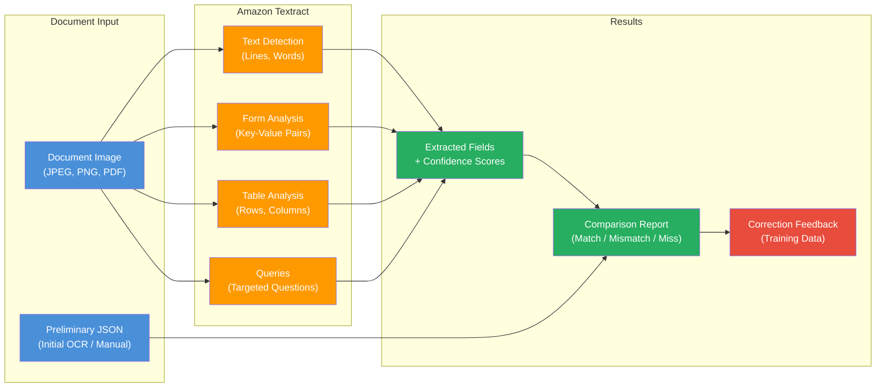
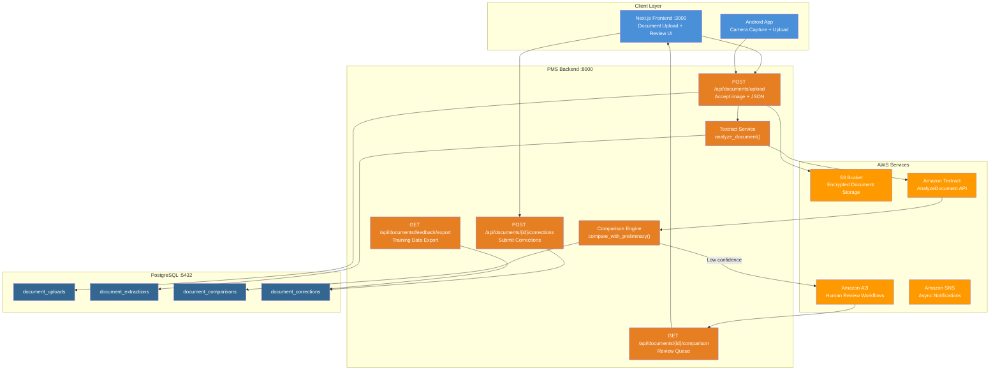

# Amazon Textract Developer Onboarding Tutorial

**Welcome to the MPS PMS Amazon Textract Integration Team**

This tutorial will take you from zero to building your first document verification workflow with Amazon Textract and the PMS. By the end, you will understand how Textract extracts data from healthcare documents, how to compare extractions against preliminary OCR data, and how to capture corrections that improve future accuracy.

**Document ID:** PMS-EXP-TEXTRACT-002
**Version:** 1.0
**Date:** March 12, 2026
**Applies To:** PMS project (all platforms)
**Prerequisite:** [Amazon Textract Setup Guide](81-AmazonTextract-PMS-Developer-Setup-Guide.md)
**Estimated time:** 2-3 hours
**Difficulty:** Beginner-friendly

---

## What You Will Learn

1. What Amazon Textract is and how it differs from traditional OCR
2. How Textract's confidence scoring system works
3. How to upload document images with preliminary JSON data via the PMS API
4. How the Comparison Engine detects matches, mismatches, and misses
5. How to build a human review workflow for low-confidence extractions
6. How correction data feeds into a continuous improvement loop
7. How Textract Custom Queries target specific fields in healthcare documents
8. How adapters allow custom model fine-tuning with correction data
9. HIPAA compliance considerations for document processing
10. When to use Textract vs. Azure Document Intelligence vs. manual entry

## Part 1: Understanding Amazon Textract (15 min read)

### 1.1 What Problem Does Textract Solve?

In the PMS, clinical and administrative staff manually transcribe data from thousands of documents daily — insurance cards, referral letters, lab orders, and prescription forms. A front desk staff member receives a patient's insurance card, manually types the member ID, group number, plan name, and dates into the PMS. This process is:

- **Slow**: 3-5 minutes per document for a skilled data entry specialist
- **Error-prone**: Transposed digits in a member ID can cause claim denials costing $50-200 each
- **Untrackable**: When preliminary OCR attempts are used, there's no way to know what the OCR got wrong or how to improve it

Amazon Textract solves this by automatically extracting text and structured data from document images, returning confidence scores for each extraction, and enabling a comparison workflow that catches errors before they enter the PMS.

### 1.2 How Textract Works — The Key Pieces



**Three core concepts:**

1. **Extraction**: Textract analyzes document images and returns structured data (text lines, key-value pairs, tables) with per-field confidence scores (0-100%).
2. **Comparison**: The PMS compares Textract's extraction against your preliminary JSON dataset, identifying matches, mismatches, and fields that only one source found.
3. **Feedback Loop**: When humans correct errors, those corrections are stored as training data. Over time, this data trains Custom Queries adapters that improve accuracy for your specific document types.

### 1.3 How Textract Fits with Other PMS Technologies

| Technology | Role | Relationship to Textract |
|-----------|------|--------------------------|
| **Azure Document Intelligence (Exp 46)** | Alternative OCR service | Fallback for multilingual docs; can run in parallel for comparison |
| **Paperclip (Exp 78)** | Agent orchestration | Orchestrates document processing workflows as agent tasks |
| **n8n (Exp 34)** | Workflow automation | Triggers document processing pipelines on file upload events |
| **Amazon Connect Health (Exp 51)** | Voice contact center | Call agents can trigger document upload for insurance verification |
| **pVerify (Exp 73)** | Insurance eligibility | Textract-extracted insurance data feeds into pVerify eligibility checks |
| **Redis (Exp 76)** | Caching | Caches extraction results for frequently-seen document templates |
| **PostgreSQL** | Primary database | Stores extractions, comparisons, corrections, and feedback data |

### 1.4 Key Vocabulary

| Term | Meaning |
|------|---------|
| **Block** | The fundamental unit of Textract output. Every piece of detected content (page, line, word, key, value, cell) is a Block with an ID, type, geometry, and confidence score. |
| **Key-Value Pair** | A form field and its value (e.g., "Member ID" → "ABC123"). Textract identifies the key and value as related blocks. |
| **Confidence Score** | A 0-100% score indicating Textract's certainty about an extraction. Scores below your threshold trigger human review. |
| **Queries** | Natural language questions you send with the document (e.g., "What is the member ID?"). Textract returns targeted answers with confidence scores. |
| **Custom Queries Adapter** | A fine-tuned model trained on your correction data to improve extraction accuracy for specific document types. Minimum 5 training documents. |
| **Comparison Report** | PMS output showing per-field status: match (both agree), mismatch (values differ), textract_only (preliminary missed it), preliminary_only (Textract missed it). |
| **Correction Record** | A captured human edit: what Textract said, what the preliminary data said, and what the human determined is correct. |
| **A2I (Augmented AI)** | AWS service for routing low-confidence extractions to human reviewers with a custom review UI. |
| **Adapter** | A modular component that extends Textract's base model with domain-specific knowledge from your training data. |
| **AnalyzeDocument** | Synchronous Textract API for single-page documents. Returns results immediately. |
| **StartDocumentAnalysis** | Asynchronous Textract API for multi-page documents. Returns a job ID; results retrieved via polling or SNS notification. |

### 1.5 Our Architecture



## Part 2: Environment Verification (15 min)

### 2.1 Checklist

Run each command and verify the expected output:

1. **AWS CLI configured**:
   ```bash
   aws sts get-caller-identity
   # Expected: JSON with Account, UserId, Arn
   ```

2. **S3 bucket exists**:
   ```bash
   aws s3 ls | grep pms-textract
   # Expected: bucket name with date
   ```

3. **Textract API accessible**:
   ```bash
   python3 -c "import boto3; c = boto3.client('textract', region_name='us-east-1'); print('Textract OK')"
   # Expected: Textract OK
   ```

4. **boto3 and textractor installed**:
   ```bash
   python3 -c "import boto3; print(f'boto3 {boto3.__version__}')"
   python3 -c "from textractor import Textractor; print('textractor OK')"
   ```

5. **PMS backend running**:
   ```bash
   curl -s http://localhost:8000/docs | head -1
   ```

6. **PostgreSQL tables created**:
   ```bash
   psql -h localhost -p 5432 -U pms -d pms_db -c "\dt document_*"
   # Expected: 4 tables listed
   ```

### 2.2 Quick Test

Upload a simple test to verify the full pipeline:

```bash
# Create a minimal test image (white image with text)
python3 -c "
from PIL import Image, ImageDraw, ImageFont
img = Image.new('RGB', (400, 200), 'white')
draw = ImageDraw.Draw(img)
draw.text((20, 20), 'Member ID: TEST123', fill='black')
draw.text((20, 60), 'Group: GRP456', fill='black')
draw.text((20, 100), 'Plan: Blue Cross PPO', fill='black')
img.save('/tmp/test-card.jpg')
print('Test image created')
"

# Upload to S3
aws s3 cp /tmp/test-card.jpg s3://$BUCKET_NAME/test/test-card.jpg --sse aws:kms

# Run Textract
python3 -c "
import boto3, json
client = boto3.client('textract', region_name='us-east-1')
response = client.detect_document_text(
    Document={'S3Object': {'Bucket': '$(echo $BUCKET_NAME)', 'Name': 'test/test-card.jpg'}}
)
for block in response['Blocks']:
    if block['BlockType'] == 'LINE':
        print(f\"{block['Confidence']:.1f}% | {block['Text']}\")
"
# Expected: Lines of text with confidence scores > 90%
```

## Part 3: Build Your First Integration (45 min)

### 3.1 What We Are Building

We will build a complete **insurance card verification workflow**:

1. Upload an insurance card image + preliminary JSON (simulating initial OCR attempt)
2. Textract analyzes the image and extracts key-value pairs
3. The Comparison Engine identifies matches and mismatches
4. You review flagged fields and submit corrections
5. Corrections are stored as training data for future improvement

### 3.2 Prepare a Test Insurance Card

Save a real or mock insurance card image as `test-insurance.jpg`. For testing, create one:

```python
# save as create_test_card.py
from PIL import Image, ImageDraw

img = Image.new("RGB", (800, 500), "white")
draw = ImageDraw.Draw(img)

# Header
draw.rectangle([0, 0, 800, 60], fill="#003366")
draw.text((20, 15), "BLUE CROSS BLUE SHIELD", fill="white")

# Member info
draw.text((20, 80), "Member Name: John A. Smith", fill="black")
draw.text((20, 120), "Member ID: XYZ789012345", fill="black")
draw.text((20, 160), "Group Number: GRP-4567-AB", fill="black")
draw.text((20, 200), "Plan: PPO Select Plus", fill="black")
draw.text((20, 240), "Effective Date: 01/01/2026", fill="black")

# Copay info
draw.text((20, 300), "Office Visit Copay: $25", fill="black")
draw.text((20, 340), "Specialist Copay: $50", fill="black")
draw.text((20, 380), "ER Copay: $150", fill="black")

# RxBin
draw.text((450, 80), "RxBIN: 003858", fill="black")
draw.text((450, 120), "RxPCN: A4", fill="black")
draw.text((450, 160), "RxGroup: RXGRP01", fill="black")

img.save("test-insurance.jpg", quality=95)
print("Test insurance card created: test-insurance.jpg")
```

```bash
python3 create_test_card.py
```

### 3.3 Create the Preliminary JSON Dataset

This simulates what a basic OCR or manual entry might have captured — intentionally including errors to demonstrate the comparison workflow:

```json
{
  "member_name": "John A Smith",
  "member_id": "XYZ789012345",
  "group_number": "GRP-4567-AB",
  "plan": "PPO Select",
  "effective_date": "01/01/2026",
  "office_copay": "$25",
  "specialist_copay": "$50",
  "er_copay": "$150",
  "rxbin": "003858",
  "rxpcn": "A4"
}
```

Save as `preliminary.json`. Note: `plan` is "PPO Select" but the card says "PPO Select Plus" — this is an intentional mismatch. Also, `rxgroup` is missing entirely — a preliminary miss.

### 3.4 Upload and Verify via the API

```bash
# Upload the insurance card with preliminary data
curl -X POST http://localhost:8000/api/documents/upload \
  -H "Authorization: Bearer <your-token>" \
  -F "file=@test-insurance.jpg" \
  -F "preliminary_data=$(cat preliminary.json)" \
  -F "document_type=insurance_card" \
  | python3 -m json.tool
```

Expected response:

```json
{
  "document_id": "a1b2c3d4-...",
  "status": "reviewing",
  "auto_accepted": 7,
  "needs_review": 2,
  "flagged_fields": {
    "plan": {
      "textract": "PPO Select Plus",
      "preliminary": "PPO Select",
      "confidence": 94.2,
      "reason": "value_mismatch"
    },
    "rxgroup": {
      "textract": "RXGRP01",
      "preliminary": null,
      "confidence": 91.5,
      "reason": "preliminary_miss"
    }
  }
}
```

The system correctly identified:
- 7 fields where Textract and preliminary data agree with high confidence → auto-accepted
- 1 mismatch: `plan` = "PPO Select" vs "PPO Select Plus"
- 1 miss: `rxgroup` was in the card but not in the preliminary JSON

### 3.5 Review and Submit Corrections

```bash
# Submit corrections for the flagged fields
curl -X POST http://localhost:8000/api/documents/a1b2c3d4-.../corrections \
  -H "Authorization: Bearer <your-token>" \
  -H "Content-Type: application/json" \
  -d '[
    {
      "field_name": "plan",
      "corrected_value": "PPO Select Plus",
      "textract_value": "PPO Select Plus",
      "preliminary_value": "PPO Select",
      "correction_type": "textract_correct"
    },
    {
      "field_name": "rxgroup",
      "corrected_value": "RXGRP01",
      "textract_value": "RXGRP01",
      "preliminary_value": null,
      "correction_type": "textract_correct"
    }
  ]'
```

### 3.6 View the Feedback Data

```bash
# Export corrections to see patterns
curl http://localhost:8000/api/documents/feedback/export?document_type=insurance_card \
  -H "Authorization: Bearer <your-token>" \
  | python3 -m json.tool
```

Expected output shows the correction pattern:

```json
{
  "feedback_summary": [
    {
      "field_name": "plan",
      "correction_type": "textract_correct",
      "occurrence_count": 1,
      "textract_value": "PPO Select Plus",
      "corrected_value": "PPO Select Plus",
      "document_type": "insurance_card"
    },
    {
      "field_name": "rxgroup",
      "correction_type": "textract_correct",
      "occurrence_count": 1,
      "textract_value": "RXGRP01",
      "corrected_value": "RXGRP01",
      "document_type": "insurance_card"
    }
  ],
  "total_corrections": 2
}
```

**Key insight**: After processing hundreds of documents, this feedback data reveals:
- Which fields the preliminary OCR consistently misses (to improve your OCR pipeline)
- Which fields Textract consistently gets wrong (to train Custom Queries adapters)
- Which fields always require human review (to adjust confidence thresholds)

## Part 4: Evaluating Strengths and Weaknesses (15 min)

### 4.1 Strengths

- **AWS ecosystem integration**: Seamless connection with S3, Lambda, Step Functions, SNS, A2I. No cross-cloud complexity if PMS is AWS-hosted.
- **Confidence scoring**: Per-field confidence enables intelligent routing — auto-accept high confidence, flag low confidence for review.
- **Queries feature**: Natural language questions ("What is the member ID?") provide targeted extraction without complex field mapping.
- **Custom Queries adapters**: Fine-tune accuracy with as few as 5 training documents using correction data from the feedback loop.
- **HIPAA eligible**: Covered under AWS BAA. Encryption at rest and in transit built-in.
- **Scalability**: Fully managed service — handles 1 or 1 million documents without infrastructure changes.
- **A2I integration**: Built-in human review workflow for low-confidence results.

### 4.2 Weaknesses

- **No direct model learning from corrections**: Textract's base model does not learn from A2I corrections. You must train Custom Queries adapters separately.
- **Limited multilingual support**: English-optimized. For multilingual patient populations, Azure Document Intelligence (100+ languages) may be needed.
- **Table extraction limitations**: Can struggle with borderless tables and complex nested layouts.
- **Cost at scale**: $0.05/page for forms analysis adds up — 1,000 pages/day = $50/day. Need cost monitoring.
- **No on-premise option**: Textract is cloud-only. For organizations requiring on-premise OCR, alternatives like Tesseract or PaddleOCR are needed.
- **Adapter training time**: 2-30 hours per training cycle. Not suitable for rapid iteration.
- **Customization ceiling**: Cannot provide custom training data for the base model (unlike Azure and Google which offer custom data labeling).

### 4.3 When to Use Textract vs Alternatives

| Scenario | Recommended Tool | Why |
|----------|-----------------|-----|
| Insurance cards (English) | **Textract** | Strong form analysis + Queries feature |
| Multilingual patient forms | **Azure Document Intelligence** | 100+ language support |
| Simple text extraction (no forms) | **Textract DetectDocumentText** | Cheapest at $0.0015/page |
| Complex nested tables | **Azure Document Intelligence** | Better table structure preservation |
| Offline / on-premise required | **Tesseract / PaddleOCR** | Open-source, no cloud dependency |
| High-volume batch (cost-sensitive) | **Textract + Detect API** | $0.0015/page for text-only, $0.015 for tables |
| Handwritten clinical notes | **Textract** | Handwriting detection built-in |
| Prescription label barcodes | **Textract + custom post-processing** | OCR + barcode requires additional library |

### 4.4 HIPAA / Healthcare Considerations

- **BAA coverage**: Amazon Textract, S3, A2I, SNS, and KMS are all HIPAA-eligible services covered under the AWS BAA. Ensure your organization has an active BAA with AWS.
- **PHI in transit**: All API calls use TLS 1.2+. Enable VPC endpoints for private connectivity without traversing the public internet.
- **PHI at rest**: S3 server-side encryption with KMS. PostgreSQL column-level encryption for extracted PHI fields.
- **Audit trail**: CloudTrail logs every Textract API call with IAM identity, timestamp, and parameters. Document corrections include reviewer ID and timestamp.
- **Minimum necessary**: Extract only the fields needed for the workflow. Don't store full Textract raw responses longer than needed — implement lifecycle policies.
- **Access control**: IAM policies restrict Textract access to the PMS backend service role. Human reviewers access the review UI through PMS RBAC, not direct AWS console access.
- **Data retention**: Implement S3 lifecycle policies to auto-delete processed documents after the configured retention period (e.g., 90 days).

## Part 5: Debugging Common Issues (15 min read)

### Issue 1: "Textract returns empty blocks for a clearly readable document"

**Symptom**: `response["Blocks"]` contains only PAGE blocks, no LINE or WORD blocks.

**Cause**: Document image is too small, too low resolution, or heavily compressed.

**Fix**: Ensure images are at least 150 DPI and 600x400 pixels. Check with:
```python
from PIL import Image
img = Image.open("document.jpg")
print(f"Size: {img.size}, Mode: {img.mode}")
# Minimum recommended: 600x400, RGB mode
```

### Issue 2: "Key-value pairs not detected even though the form has clear labels"

**Symptom**: `_build_block_maps()` returns empty `key_map` and `value_map`.

**Cause**: You used `detect_document_text()` instead of `analyze_document()`. Text detection only finds lines/words — not form structure.

**Fix**: Use `analyze_document()` with `FeatureTypes=["FORMS"]`:
```python
response = textract_client.analyze_document(
    Document={"S3Object": {"Bucket": bucket, "Name": key}},
    FeatureTypes=["FORMS"],
)
```

### Issue 3: "Comparison shows all mismatches even though values look the same"

**Symptom**: Every field is flagged as `value_mismatch` despite appearing identical.

**Cause**: Whitespace, capitalization, or encoding differences. Textract may return "Member ID" while preliminary JSON has "member_id".

**Fix**: The `_normalize()` function handles basic normalization. For key name matching, implement fuzzy matching:
```python
from difflib import SequenceMatcher
def fuzzy_match(a: str, b: str, threshold: float = 0.8) -> bool:
    return SequenceMatcher(None, a.lower(), b.lower()).ratio() >= threshold
```

### Issue 4: "Adapter training fails with 'insufficient documents'"

**Symptom**: `CreateAdapterVersion` returns an error about insufficient training data.

**Cause**: Custom Queries adapters require minimum 5 training + 5 test documents.

**Fix**: Accumulate at least 10 annotated documents before attempting adapter training. Use the feedback export to identify documents with corrections.

### Issue 5: "S3 upload succeeds but Textract can't find the object"

**Symptom**: `InvalidS3ObjectException` immediately after successful `put_object`.

**Cause**: S3 eventual consistency (rare) or bucket name/key mismatch.

**Fix**: Verify the exact bucket and key:
```python
s3_client.head_object(Bucket=bucket, Key=key)  # Confirms object exists
```

### Issue 6: "Async job never completes — GetDocumentAnalysis returns IN_PROGRESS forever"

**Symptom**: Polling `get_document_analysis()` returns `IN_PROGRESS` for >30 minutes.

**Cause**: SNS notification topic misconfigured or IAM role for SNS publish missing.

**Fix**: Verify SNS topic ARN and IAM role in `StartDocumentAnalysis` call. Check CloudWatch logs for Textract service errors.

## Part 6: Practice Exercise (45 min)

### Option A: Prescription Form Verification

Build a prescription verification workflow:
1. Create a mock prescription form image with: drug name, dosage, frequency, quantity, prescriber, date
2. Create a preliminary JSON with 2 intentional errors (wrong dosage, missing prescriber)
3. Upload via the API and verify the Comparison Engine catches both issues
4. Submit corrections and verify feedback export

**Hints**:
- Use `document_type=prescription` to get prescription-specific Queries
- Check that the Queries responses include `query:What is the medication name?` format

### Option B: Multi-Document Batch Processing

Process 5 insurance cards in sequence:
1. Create 5 variations of insurance card images (different member IDs, plans, copays)
2. Upload each with slightly different preliminary JSON errors
3. After all 5 are processed, export the feedback data
4. Analyze: which fields had the most corrections? Which correction types dominated?

**Hints**:
- Use a bash loop: `for i in {1..5}; do curl ...; done`
- The feedback export aggregates by field name and correction type

### Option C: Confidence Threshold Tuning

Experiment with confidence thresholds:
1. Upload the same document 3 times with different threshold settings
2. Set `TEXTRACT_AUTO_ACCEPT_THRESHOLD` to 99, 95, and 85
3. Observe how the number of auto-accepted vs flagged fields changes
4. Determine the optimal threshold for your document types

**Hints**:
- Higher thresholds = more human reviews but fewer errors
- Lower thresholds = less human work but more risk of bad data
- Healthcare documents should err on the side of higher thresholds (95+)

## Part 7: Development Workflow and Conventions

### 7.1 File Organization

```
pms-backend/
├── app/
│   ├── api/
│   │   └── routes/
│   │       └── documents.py          # Document processing API routes
│   ├── services/
│   │   └── textract_service.py       # Textract + S3 + comparison logic
│   ├── models/
│   │   └── document.py               # SQLAlchemy models for document tables
│   └── schemas/
│       └── document.py               # Pydantic schemas for request/response
├── migrations/
│   └── versions/
│       └── xxx_add_document_tables.py # Alembic migration
└── tests/
    └── test_textract_service.py       # Unit and integration tests

pms-frontend/
├── components/
│   └── documents/
│       ├── DocumentUploadVerify.tsx   # Upload + comparison UI
│       └── ReviewQueue.tsx            # Human review queue component
└── app/
    └── documents/
        └── page.tsx                   # Document processing page
```

### 7.2 Naming Conventions

| Item | Convention | Example |
|------|-----------|---------|
| API routes | `/api/documents/{action}` | `/api/documents/upload` |
| Service functions | `snake_case` async functions | `analyze_document()` |
| DB tables | `document_{entity}` | `document_corrections` |
| S3 keys | `{stage}/{type}/{date}/{uuid}/{filename}` | `uploads/insurance_card/2026/03/12/uuid/card.jpg` |
| Environment variables | `TEXTRACT_` prefix | `TEXTRACT_S3_BUCKET` |
| Correction types | `{source}_correct` or `both_wrong` | `textract_correct` |
| Document types | `snake_case` | `insurance_card`, `lab_order` |

### 7.3 PR Checklist

- [ ] Textract API calls use IAM roles, not hardcoded credentials
- [ ] S3 uploads include `ServerSideEncryption="aws:kms"` parameter
- [ ] All PHI fields are encrypted at rest in PostgreSQL
- [ ] Audit logging captures user ID and timestamp for every action
- [ ] Error handling returns generic messages (no PHI in error responses)
- [ ] Unit tests mock Textract API calls (don't hit AWS in CI)
- [ ] Integration tests use a dedicated test S3 bucket with lifecycle policies
- [ ] Confidence thresholds are configurable via environment variables
- [ ] New document types include corresponding Queries definitions
- [ ] Frontend review UI does not log or expose raw PHI to browser console

### 7.4 Security Reminders

- **Never log PHI**: Extraction results, comparisons, and corrections contain patient data. Log document IDs and status only — never field values.
- **Rotate IAM credentials**: Use IAM roles with temporary credentials (STS AssumeRole) in production, not long-lived access keys.
- **S3 bucket policy**: Verify `BlockPublicAccess` is enabled. No public access to document images.
- **Review UI access**: Only authorized reviewers (via PMS RBAC) can access the human review queue. Implement session timeout.
- **Data minimization**: Delete extracted raw responses after corrections are finalized. Keep only the minimal correction records needed for adapter training.
- **VPC endpoints**: In production, configure S3 and Textract VPC endpoints to keep traffic off the public internet.

## Part 8: Quick Reference Card

### Key Commands

```bash
# Upload document for verification
curl -X POST http://localhost:8000/api/documents/upload \
  -F "file=@document.jpg" -F "preliminary_data={...}" -F "document_type=insurance_card"

# Get comparison results
curl http://localhost:8000/api/documents/{id}/comparison

# Submit corrections
curl -X POST http://localhost:8000/api/documents/{id}/corrections -d '[...]'

# Export feedback for training
curl http://localhost:8000/api/documents/feedback/export

# Test Textract directly
python3 -c "import boto3; c=boto3.client('textract'); print(c.detect_document_text(Document={'S3Object':{'Bucket':'...','Name':'...'}}))"
```

### Key Files

| File | Purpose |
|------|---------|
| `app/services/textract_service.py` | Textract API calls, S3 upload, comparison engine |
| `app/api/routes/documents.py` | REST API endpoints |
| `components/documents/DocumentUploadVerify.tsx` | Frontend upload + review UI |
| `.env` | AWS credentials, S3 bucket, thresholds |

### Key URLs

| Resource | URL |
|----------|-----|
| Textract Console | https://console.aws.amazon.com/textract |
| Textract Pricing | https://aws.amazon.com/textract/pricing/ |
| Textract API Docs | https://docs.aws.amazon.com/textract/latest/dg/ |
| Textract Python Examples | https://docs.aws.amazon.com/code-library/latest/ug/python_3_textract_code_examples.html |
| Custom Queries Guide | https://docs.aws.amazon.com/textract/latest/dg/how-it-works-custom-queries.html |

### Starter Template: Process a Document

```python
import boto3
import json

textract = boto3.client("textract", region_name="us-east-1")
s3 = boto3.client("s3", region_name="us-east-1")

# 1. Upload
s3.put_object(Bucket="your-bucket", Key="doc.jpg", Body=open("doc.jpg", "rb"), ServerSideEncryption="aws:kms")

# 2. Extract
response = textract.analyze_document(
    Document={"S3Object": {"Bucket": "your-bucket", "Name": "doc.jpg"}},
    FeatureTypes=["FORMS", "QUERIES"],
    QueriesConfig={"Queries": [{"Text": "What is the member ID?"}]},
)

# 3. Parse results
for block in response["Blocks"]:
    if block["BlockType"] == "QUERY_RESULT":
        print(f"Q: {block.get('Query', {}).get('Text')} → A: {block['Text']} ({block['Confidence']:.1f}%)")

# 4. Compare with preliminary
preliminary = {"member_id": "ABC123"}
# ... run comparison engine ...

# 5. Capture corrections
correction = {"field_name": "member_id", "corrected_value": "ABC124", "correction_type": "both_wrong"}
# ... save to database ...
```

## Next Steps

1. **Process real documents**: Replace test images with actual insurance cards, referrals, and prescriptions from your document queue.
2. **Tune confidence thresholds**: Analyze feedback data after 100+ documents to find the optimal auto-accept and review thresholds for each document type.
3. **Train your first adapter**: After collecting 50+ corrections for a document type, export training data and create a Custom Queries adapter.
4. **Connect to pVerify (Exp 73)**: Route auto-accepted insurance card data to pVerify for real-time eligibility verification.
5. **Build n8n automation (Exp 34)**: Create n8n workflows that trigger document processing on file upload events from fax or email integrations.
