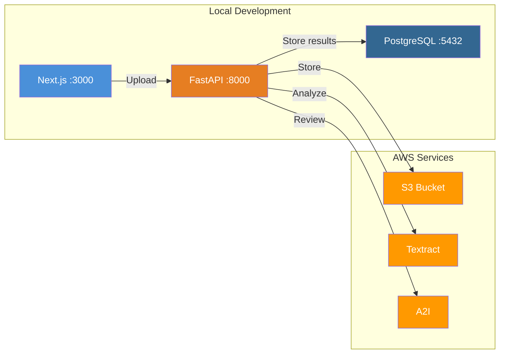

# Amazon Textract Setup Guide for PMS Integration

**Document ID:** PMS-EXP-TEXTRACT-001
**Version:** 1.0
**Date:** March 12, 2026
**Applies To:** PMS project (all platforms)
**Prerequisites Level:** Intermediate

---

## Table of Contents

1. [Overview](#1-overview)
2. [Prerequisites](#2-prerequisites)
3. [Part A: AWS Infrastructure Setup](#3-part-a-aws-infrastructure-setup)
4. [Part B: Integrate with PMS Backend](#4-part-b-integrate-with-pms-backend)
5. [Part C: Integrate with PMS Frontend](#5-part-c-integrate-with-pms-frontend)
6. [Part D: Testing and Verification](#6-part-d-testing-and-verification)
7. [Troubleshooting](#7-troubleshooting)
8. [Reference Commands](#8-reference-commands)

---

## 1. Overview

This guide walks you through setting up Amazon Textract integration with the PMS for intelligent document processing. By the end, you will have:

- An S3 bucket configured for secure document storage with encryption
- IAM roles with least-privilege policies for Textract access
- A FastAPI backend module that uploads documents, calls Textract, compares results against preliminary JSON data, and captures corrections
- A Next.js frontend component for document upload and human review
- A PostgreSQL schema for storing extractions, comparisons, and feedback
- An Amazon A2I workflow for human-in-the-loop review



## 2. Prerequisites

### 2.1 Required Software

| Software | Minimum Version | Check Command |
|----------|-----------------|---------------|
| Python | 3.10+ | `python3 --version` |
| Node.js | 18+ | `node --version` |
| Docker | 24+ | `docker --version` |
| AWS CLI | 2.x | `aws --version` |
| PostgreSQL | 15+ | `psql --version` |
| pip | 23+ | `pip --version` |

### 2.2 Installation of Prerequisites

#### AWS CLI v2

```bash
# macOS
curl "https://awscli.amazonaws.com/AWSCLIV2.pkg" -o "AWSCLIV2.pkg"
sudo installer -pkg AWSCLIV2.pkg -target /

# Linux
curl "https://awscli.amazonaws.com/awscli-exe-linux-x86_64.zip" -o "awscliv2.zip"
unzip awscliv2.zip
sudo ./aws/install

# Verify
aws --version
```

#### Configure AWS credentials

```bash
aws configure
# Enter:
#   AWS Access Key ID: <your-access-key>
#   AWS Secret Access Key: <your-secret-key>
#   Default region name: us-east-1
#   Default output format: json

# Verify credentials
aws sts get-caller-identity
```

### 2.3 Verify PMS Services

```bash
# Check PMS backend is running
curl -s http://localhost:8000/docs | head -5
# Expected: HTML content from FastAPI Swagger UI

# Check PMS frontend is running
curl -s http://localhost:3000 | head -5
# Expected: HTML content from Next.js

# Check PostgreSQL is running
psql -h localhost -p 5432 -U pms -d pms_db -c "SELECT 1;"
# Expected: 1 row returned
```

## 3. Part A: AWS Infrastructure Setup

### Step 1: Create S3 Bucket for Document Storage

```bash
# Set variables
BUCKET_NAME="pms-textract-documents-$(aws sts get-caller-identity --query Account --output text)"
REGION="us-east-1"

# Create bucket with encryption
aws s3api create-bucket \
  --bucket $BUCKET_NAME \
  --region $REGION

# Enable default encryption (AES-256 via KMS)
aws s3api put-bucket-encryption \
  --bucket $BUCKET_NAME \
  --server-side-encryption-configuration '{
    "Rules": [
      {
        "ApplyServerSideEncryptionByDefault": {
          "SSEAlgorithm": "aws:kms"
        },
        "BucketKeyEnabled": true
      }
    ]
  }'

# Block all public access
aws s3api put-public-access-block \
  --bucket $BUCKET_NAME \
  --public-access-block-configuration \
    "BlockPublicAcls=true,IgnorePublicAcls=true,BlockPublicPolicy=true,RestrictPublicBuckets=true"

# Enable versioning (required for audit trail)
aws s3api put-bucket-versioning \
  --bucket $BUCKET_NAME \
  --versioning-configuration Status=Enabled

# Set lifecycle policy (delete processed documents after 90 days)
aws s3api put-bucket-lifecycle-configuration \
  --bucket $BUCKET_NAME \
  --lifecycle-configuration '{
    "Rules": [
      {
        "ID": "DeleteProcessedDocs",
        "Status": "Enabled",
        "Filter": {"Prefix": "processed/"},
        "Expiration": {"Days": 90}
      }
    ]
  }'

echo "Bucket created: $BUCKET_NAME"
```

### Step 2: Create IAM Policy and Role

```bash
# Create the policy document
cat > /tmp/pms-textract-policy.json << 'EOF'
{
  "Version": "2012-10-17",
  "Statement": [
    {
      "Sid": "TextractAccess",
      "Effect": "Allow",
      "Action": [
        "textract:AnalyzeDocument",
        "textract:DetectDocumentText",
        "textract:StartDocumentAnalysis",
        "textract:StartDocumentTextDetection",
        "textract:GetDocumentAnalysis",
        "textract:GetDocumentTextDetection",
        "textract:AnalyzeExpense",
        "textract:AnalyzeID"
      ],
      "Resource": "*"
    },
    {
      "Sid": "S3DocumentAccess",
      "Effect": "Allow",
      "Action": [
        "s3:GetObject",
        "s3:PutObject",
        "s3:DeleteObject",
        "s3:ListBucket"
      ],
      "Resource": [
        "arn:aws:s3:::pms-textract-documents-*",
        "arn:aws:s3:::pms-textract-documents-*/*"
      ]
    },
    {
      "Sid": "SNSNotifications",
      "Effect": "Allow",
      "Action": [
        "sns:Publish",
        "sns:Subscribe"
      ],
      "Resource": "arn:aws:sns:*:*:pms-textract-*"
    },
    {
      "Sid": "KMSAccess",
      "Effect": "Allow",
      "Action": [
        "kms:Decrypt",
        "kms:GenerateDataKey"
      ],
      "Resource": "*",
      "Condition": {
        "StringEquals": {
          "kms:ViaService": "s3.us-east-1.amazonaws.com"
        }
      }
    }
  ]
}
EOF

# Create the IAM policy
aws iam create-policy \
  --policy-name PMS-Textract-Access \
  --policy-document file:///tmp/pms-textract-policy.json

echo "IAM policy created"
```

### Step 3: Create SNS Topic for Async Notifications

```bash
# Create SNS topic for extraction completion notifications
aws sns create-topic --name pms-textract-notifications --region $REGION

# Note the TopicArn from output — you'll need it in the backend config
```

**Checkpoint**: You now have an encrypted S3 bucket, IAM policy with least-privilege Textract access, and an SNS topic for async notifications. Verify:

```bash
aws s3 ls | grep pms-textract
aws iam list-policies --query "Policies[?PolicyName=='PMS-Textract-Access']"
aws sns list-topics --query "Topics[?contains(TopicArn, 'pms-textract')]"
```

## 4. Part B: Integrate with PMS Backend

### Step 1: Install Python Dependencies

```bash
cd /path/to/pms-backend

# Add to requirements.txt
echo "boto3>=1.34.0" >> requirements.txt
echo "amazon-textract-textractor>=1.0.0" >> requirements.txt
echo "Pillow>=10.0.0" >> requirements.txt

pip install boto3 amazon-textract-textractor Pillow
```

### Step 2: Add Environment Variables

Add to your `.env` file:

```bash
# Amazon Textract Configuration
AWS_REGION=us-east-1
AWS_ACCESS_KEY_ID=your-access-key
AWS_SECRET_ACCESS_KEY=your-secret-key
TEXTRACT_S3_BUCKET=pms-textract-documents-<account-id>
TEXTRACT_SNS_TOPIC_ARN=arn:aws:sns:us-east-1:<account-id>:pms-textract-notifications
TEXTRACT_CONFIDENCE_THRESHOLD=90.0
TEXTRACT_AUTO_ACCEPT_THRESHOLD=98.0
```

### Step 3: Create Database Schema

```sql
-- Migration: Create document processing tables

CREATE TABLE IF NOT EXISTS document_uploads (
    id UUID PRIMARY KEY DEFAULT gen_random_uuid(),
    patient_id UUID REFERENCES patients(id),
    encounter_id UUID REFERENCES encounters(id),
    document_type VARCHAR(50) NOT NULL,  -- 'insurance_card', 'referral', 'prescription', 'intake_form', 'lab_order'
    s3_key VARCHAR(500) NOT NULL,
    original_filename VARCHAR(255),
    preliminary_data JSONB,  -- The JSON dataset uploaded alongside the image
    status VARCHAR(30) DEFAULT 'uploaded',  -- uploaded, processing, extracted, reviewing, completed, failed
    uploaded_by UUID REFERENCES users(id),
    created_at TIMESTAMPTZ DEFAULT NOW(),
    updated_at TIMESTAMPTZ DEFAULT NOW()
);

CREATE TABLE IF NOT EXISTS document_extractions (
    id UUID PRIMARY KEY DEFAULT gen_random_uuid(),
    document_id UUID REFERENCES document_uploads(id) ON DELETE CASCADE,
    textract_job_id VARCHAR(255),
    raw_response JSONB NOT NULL,  -- Full Textract response
    extracted_fields JSONB NOT NULL,  -- Normalized key-value pairs
    confidence_scores JSONB NOT NULL,  -- Per-field confidence scores
    extraction_method VARCHAR(30),  -- 'sync_analyze', 'async_analyze', 'detect_text', 'queries'
    adapter_id VARCHAR(255),  -- Custom Queries adapter used, if any
    processing_time_ms INTEGER,
    created_at TIMESTAMPTZ DEFAULT NOW()
);

CREATE TABLE IF NOT EXISTS document_comparisons (
    id UUID PRIMARY KEY DEFAULT gen_random_uuid(),
    document_id UUID REFERENCES document_uploads(id) ON DELETE CASCADE,
    extraction_id UUID REFERENCES document_extractions(id) ON DELETE CASCADE,
    comparison_results JSONB NOT NULL,  -- Per-field: match/mismatch/textract_only/preliminary_only
    auto_accepted_fields JSONB,  -- Fields above auto-accept threshold
    flagged_fields JSONB,  -- Fields requiring human review
    auto_accept_count INTEGER DEFAULT 0,
    review_required_count INTEGER DEFAULT 0,
    created_at TIMESTAMPTZ DEFAULT NOW()
);

CREATE TABLE IF NOT EXISTS document_corrections (
    id UUID PRIMARY KEY DEFAULT gen_random_uuid(),
    document_id UUID REFERENCES document_uploads(id) ON DELETE CASCADE,
    comparison_id UUID REFERENCES document_comparisons(id),
    field_name VARCHAR(255) NOT NULL,
    textract_value TEXT,
    preliminary_value TEXT,
    corrected_value TEXT NOT NULL,
    correction_type VARCHAR(30),  -- 'textract_correct', 'preliminary_correct', 'both_wrong', 'manual_entry'
    confidence_score FLOAT,
    reviewer_id UUID REFERENCES users(id),
    reviewed_at TIMESTAMPTZ DEFAULT NOW(),
    created_at TIMESTAMPTZ DEFAULT NOW()
);

-- Indexes for common queries
CREATE INDEX idx_doc_uploads_patient ON document_uploads(patient_id);
CREATE INDEX idx_doc_uploads_status ON document_uploads(status);
CREATE INDEX idx_doc_uploads_type ON document_uploads(document_type);
CREATE INDEX idx_doc_corrections_field ON document_corrections(field_name);
CREATE INDEX idx_doc_corrections_type ON document_corrections(correction_type);
CREATE INDEX idx_doc_corrections_document ON document_corrections(document_id);
```

### Step 4: Create the Textract Service Module

Create `app/services/textract_service.py`:

```python
import boto3
import json
import uuid
from datetime import datetime
from typing import Optional
from app.core.config import settings

textract_client = boto3.client(
    "textract",
    region_name=settings.AWS_REGION,
    aws_access_key_id=settings.AWS_ACCESS_KEY_ID,
    aws_secret_access_key=settings.AWS_SECRET_ACCESS_KEY,
)

s3_client = boto3.client(
    "s3",
    region_name=settings.AWS_REGION,
    aws_access_key_id=settings.AWS_ACCESS_KEY_ID,
    aws_secret_access_key=settings.AWS_SECRET_ACCESS_KEY,
)


async def upload_to_s3(file_bytes: bytes, filename: str, document_type: str) -> str:
    """Upload document image to S3 and return the S3 key."""
    s3_key = f"uploads/{document_type}/{datetime.utcnow().strftime('%Y/%m/%d')}/{uuid.uuid4()}/{filename}"
    s3_client.put_object(
        Bucket=settings.TEXTRACT_S3_BUCKET,
        Key=s3_key,
        Body=file_bytes,
        ContentType="image/jpeg",
        ServerSideEncryption="aws:kms",
    )
    return s3_key


async def analyze_document(s3_key: str, queries: Optional[list[str]] = None, adapter_id: Optional[str] = None) -> dict:
    """Run Textract AnalyzeDocument on an S3 object. Returns extracted fields and confidence scores."""
    feature_types = ["FORMS", "TABLES"]
    params = {
        "Document": {
            "S3Object": {
                "Bucket": settings.TEXTRACT_S3_BUCKET,
                "Name": s3_key,
            }
        },
        "FeatureTypes": feature_types,
    }

    if queries:
        feature_types.append("QUERIES")
        params["QueriesConfig"] = {
            "Queries": [{"Text": q} for q in queries]
        }

    if adapter_id:
        params["AdaptersConfig"] = {
            "Adapters": [{"AdapterId": adapter_id, "Version": "1"}]
        }

    response = textract_client.analyze_document(**params)

    # Extract key-value pairs and confidence scores
    extracted_fields = {}
    confidence_scores = {}

    blocks = response.get("Blocks", [])
    key_map, value_map, block_map = _build_block_maps(blocks)

    for block_id, key_block in key_map.items():
        key_text = _get_text(key_block, block_map)
        value_block = _find_value_block(key_block, value_map)
        if value_block:
            value_text = _get_text(value_block, block_map)
            confidence = min(
                key_block.get("Confidence", 0),
                value_block.get("Confidence", 0),
            )
            extracted_fields[key_text] = value_text
            confidence_scores[key_text] = round(confidence, 2)

    # Extract query results if present
    for block in blocks:
        if block.get("BlockType") == "QUERY_RESULT":
            query_text = block.get("Query", {}).get("Text", "")
            result_text = block.get("Text", "")
            confidence = block.get("Confidence", 0)
            extracted_fields[f"query:{query_text}"] = result_text
            confidence_scores[f"query:{query_text}"] = round(confidence, 2)

    return {
        "extracted_fields": extracted_fields,
        "confidence_scores": confidence_scores,
        "raw_response": response,
        "page_count": len(set(b.get("Page", 1) for b in blocks)),
    }


def _build_block_maps(blocks: list) -> tuple[dict, dict, dict]:
    key_map = {}
    value_map = {}
    block_map = {}
    for block in blocks:
        block_id = block["Id"]
        block_map[block_id] = block
        if block["BlockType"] == "KEY_VALUE_SET":
            if "KEY" in block.get("EntityTypes", []):
                key_map[block_id] = block
            else:
                value_map[block_id] = block
    return key_map, value_map, block_map


def _find_value_block(key_block: dict, value_map: dict) -> Optional[dict]:
    for rel in key_block.get("Relationships", []):
        if rel["Type"] == "VALUE":
            for value_id in rel["Ids"]:
                if value_id in value_map:
                    return value_map[value_id]
    return None


def _get_text(block: dict, block_map: dict) -> str:
    text = ""
    for rel in block.get("Relationships", []):
        if rel["Type"] == "CHILD":
            for child_id in rel["Ids"]:
                child = block_map.get(child_id, {})
                if child.get("BlockType") == "WORD":
                    text += child.get("Text", "") + " "
    return text.strip()


async def compare_with_preliminary(
    extracted_fields: dict,
    confidence_scores: dict,
    preliminary_data: dict,
    auto_accept_threshold: float = 98.0,
    review_threshold: float = 90.0,
) -> dict:
    """Compare Textract extraction against preliminary JSON data."""
    comparison = {}
    auto_accepted = {}
    flagged = {}

    all_keys = set(list(extracted_fields.keys()) + list(preliminary_data.keys()))

    for key in all_keys:
        textract_val = extracted_fields.get(key)
        prelim_val = preliminary_data.get(key)
        confidence = confidence_scores.get(key, 0)

        if textract_val and prelim_val:
            if _normalize(textract_val) == _normalize(prelim_val):
                status = "match"
                if confidence >= auto_accept_threshold:
                    auto_accepted[key] = textract_val
                else:
                    flagged[key] = {
                        "textract": textract_val,
                        "preliminary": prelim_val,
                        "confidence": confidence,
                        "reason": "match_low_confidence",
                    }
            else:
                status = "mismatch"
                flagged[key] = {
                    "textract": textract_val,
                    "preliminary": prelim_val,
                    "confidence": confidence,
                    "reason": "value_mismatch",
                }
        elif textract_val and not prelim_val:
            status = "textract_only"
            if confidence >= auto_accept_threshold:
                auto_accepted[key] = textract_val
            else:
                flagged[key] = {
                    "textract": textract_val,
                    "preliminary": None,
                    "confidence": confidence,
                    "reason": "preliminary_miss",
                }
        elif prelim_val and not textract_val:
            status = "preliminary_only"
            flagged[key] = {
                "textract": None,
                "preliminary": prelim_val,
                "confidence": 0,
                "reason": "textract_miss",
            }
        else:
            continue

        comparison[key] = {
            "status": status,
            "textract_value": textract_val,
            "preliminary_value": prelim_val,
            "confidence": confidence,
        }

    return {
        "comparison_results": comparison,
        "auto_accepted_fields": auto_accepted,
        "flagged_fields": flagged,
        "auto_accept_count": len(auto_accepted),
        "review_required_count": len(flagged),
    }


def _normalize(value: str) -> str:
    """Normalize a value for comparison (lowercase, strip whitespace, remove common OCR artifacts)."""
    return value.lower().strip().replace("  ", " ").replace("\n", " ")
```

### Step 5: Create API Routes

Create `app/api/routes/documents.py`:

```python
from fastapi import APIRouter, UploadFile, File, Form, Depends, HTTPException
from typing import Optional
from uuid import UUID
import json

from app.services import textract_service
from app.core.database import get_db
from app.core.auth import get_current_user

router = APIRouter(prefix="/api/documents", tags=["documents"])


@router.post("/upload")
async def upload_document(
    file: UploadFile = File(...),
    preliminary_data: str = Form(...),
    document_type: str = Form(...),
    patient_id: Optional[str] = Form(None),
    encounter_id: Optional[str] = Form(None),
    db=Depends(get_db),
    current_user=Depends(get_current_user),
):
    """Upload a document image with preliminary JSON data for Textract verification."""
    # Validate file type
    allowed_types = {"image/jpeg", "image/png", "image/tiff", "application/pdf"}
    if file.content_type not in allowed_types:
        raise HTTPException(400, f"Unsupported file type: {file.content_type}")

    # Parse preliminary data
    try:
        prelim = json.loads(preliminary_data)
    except json.JSONDecodeError:
        raise HTTPException(400, "Invalid preliminary_data JSON")

    # Upload to S3
    file_bytes = await file.read()
    s3_key = await textract_service.upload_to_s3(file_bytes, file.filename, document_type)

    # Save document record
    doc_id = await db.execute(
        """INSERT INTO document_uploads
           (document_type, s3_key, original_filename, preliminary_data, patient_id, encounter_id, uploaded_by, status)
           VALUES ($1, $2, $3, $4, $5, $6, $7, 'processing')
           RETURNING id""",
        document_type, s3_key, file.filename, json.dumps(prelim),
        patient_id, encounter_id, current_user.id,
    )

    # Run Textract analysis
    queries = _get_queries_for_type(document_type)
    extraction = await textract_service.analyze_document(s3_key, queries=queries)

    # Save extraction
    extraction_id = await db.execute(
        """INSERT INTO document_extractions
           (document_id, extracted_fields, confidence_scores, raw_response, extraction_method)
           VALUES ($1, $2, $3, $4, 'sync_analyze')
           RETURNING id""",
        doc_id, json.dumps(extraction["extracted_fields"]),
        json.dumps(extraction["confidence_scores"]),
        json.dumps(extraction["raw_response"]),
    )

    # Compare with preliminary data
    comparison = await textract_service.compare_with_preliminary(
        extraction["extracted_fields"],
        extraction["confidence_scores"],
        prelim,
    )

    # Save comparison
    await db.execute(
        """INSERT INTO document_comparisons
           (document_id, extraction_id, comparison_results, auto_accepted_fields,
            flagged_fields, auto_accept_count, review_required_count)
           VALUES ($1, $2, $3, $4, $5, $6, $7)""",
        doc_id, extraction_id,
        json.dumps(comparison["comparison_results"]),
        json.dumps(comparison["auto_accepted_fields"]),
        json.dumps(comparison["flagged_fields"]),
        comparison["auto_accept_count"],
        comparison["review_required_count"],
    )

    # Update status
    new_status = "completed" if comparison["review_required_count"] == 0 else "reviewing"
    await db.execute(
        "UPDATE document_uploads SET status = $1 WHERE id = $2",
        new_status, doc_id,
    )

    return {
        "document_id": str(doc_id),
        "status": new_status,
        "auto_accepted": comparison["auto_accept_count"],
        "needs_review": comparison["review_required_count"],
        "flagged_fields": comparison["flagged_fields"],
    }


@router.get("/{document_id}/comparison")
async def get_comparison(
    document_id: UUID,
    db=Depends(get_db),
    current_user=Depends(get_current_user),
):
    """Get the comparison results for a document."""
    row = await db.fetch_one(
        """SELECT dc.*, du.s3_key, du.original_filename, du.document_type
           FROM document_comparisons dc
           JOIN document_uploads du ON du.id = dc.document_id
           WHERE dc.document_id = $1""",
        document_id,
    )
    if not row:
        raise HTTPException(404, "Document not found")
    return dict(row)


@router.post("/{document_id}/corrections")
async def submit_correction(
    document_id: UUID,
    corrections: list[dict],
    db=Depends(get_db),
    current_user=Depends(get_current_user),
):
    """Submit human corrections for flagged fields. Captures feedback for model improvement."""
    comparison = await db.fetch_one(
        "SELECT id FROM document_comparisons WHERE document_id = $1",
        document_id,
    )
    if not comparison:
        raise HTTPException(404, "Document comparison not found")

    for correction in corrections:
        await db.execute(
            """INSERT INTO document_corrections
               (document_id, comparison_id, field_name, textract_value,
                preliminary_value, corrected_value, correction_type, confidence_score, reviewer_id)
               VALUES ($1, $2, $3, $4, $5, $6, $7, $8, $9)""",
            document_id, comparison["id"],
            correction["field_name"], correction.get("textract_value"),
            correction.get("preliminary_value"), correction["corrected_value"],
            correction.get("correction_type", "manual_entry"),
            correction.get("confidence_score"), current_user.id,
        )

    # Update document status to completed
    await db.execute(
        "UPDATE document_uploads SET status = 'completed' WHERE id = $1",
        document_id,
    )

    return {"status": "corrections_saved", "count": len(corrections)}


@router.get("/feedback/export")
async def export_feedback(
    document_type: Optional[str] = None,
    db=Depends(get_db),
    current_user=Depends(get_current_user),
):
    """Export correction data for adapter training. Returns aggregated misses and corrections."""
    query = """
        SELECT
            dc.field_name,
            dc.correction_type,
            COUNT(*) as occurrence_count,
            dc.textract_value,
            dc.corrected_value,
            du.document_type
        FROM document_corrections dc
        JOIN document_uploads du ON du.id = dc.document_id
    """
    params = []
    if document_type:
        query += " WHERE du.document_type = $1"
        params.append(document_type)

    query += """
        GROUP BY dc.field_name, dc.correction_type, dc.textract_value,
                 dc.corrected_value, du.document_type
        ORDER BY occurrence_count DESC
    """

    rows = await db.fetch_all(query, *params)
    return {
        "feedback_summary": [dict(r) for r in rows],
        "total_corrections": sum(r["occurrence_count"] for r in rows),
    }


def _get_queries_for_type(document_type: str) -> list[str]:
    """Return Textract Queries for specific document types."""
    queries = {
        "insurance_card": [
            "What is the member ID?",
            "What is the group number?",
            "What is the plan name?",
            "What is the subscriber name?",
            "What is the copay amount?",
            "What is the effective date?",
        ],
        "referral": [
            "Who is the referring physician?",
            "What is the diagnosis?",
            "What is the reason for referral?",
            "What is the patient name?",
            "What is the date of referral?",
        ],
        "prescription": [
            "What is the medication name?",
            "What is the dosage?",
            "What is the frequency?",
            "What is the quantity?",
            "Who is the prescribing physician?",
            "What is the prescription date?",
        ],
        "lab_order": [
            "What tests are ordered?",
            "What is the ordering physician?",
            "What is the patient name?",
            "What is the date of birth?",
            "What is the diagnosis code?",
        ],
    }
    return queries.get(document_type, [])
```

**Checkpoint**: You now have the complete backend integration: Textract service module, API routes for upload/compare/correct/export, and database schema. The system uploads images to S3, runs Textract analysis, compares against preliminary JSON data, flags discrepancies for review, and captures corrections for model improvement.

## 5. Part C: Integrate with PMS Frontend

### Step 1: Install Dependencies

```bash
cd /path/to/pms-frontend
npm install react-dropzone @tanstack/react-query
```

### Step 2: Add Environment Variables

Add to `.env.local`:

```bash
NEXT_PUBLIC_API_URL=http://localhost:3000/api
```

### Step 3: Create Document Upload Component

Create `components/documents/DocumentUploadVerify.tsx`:

```tsx
"use client";

import { useState, useCallback } from "react";
import { useDropzone } from "react-dropzone";

interface FlaggedField {
  textract: string | null;
  preliminary: string | null;
  confidence: number;
  reason: string;
}

interface UploadResult {
  document_id: string;
  status: string;
  auto_accepted: number;
  needs_review: number;
  flagged_fields: Record<string, FlaggedField>;
}

export default function DocumentUploadVerify() {
  const [file, setFile] = useState<File | null>(null);
  const [preliminaryJson, setPreliminaryJson] = useState("");
  const [documentType, setDocumentType] = useState("insurance_card");
  const [result, setResult] = useState<UploadResult | null>(null);
  const [corrections, setCorrections] = useState<Record<string, string>>({});
  const [loading, setLoading] = useState(false);

  const onDrop = useCallback((acceptedFiles: File[]) => {
    if (acceptedFiles.length > 0) setFile(acceptedFiles[0]);
  }, []);

  const { getRootProps, getInputProps, isDragActive } = useDropzone({
    onDrop,
    accept: { "image/*": [".jpg", ".jpeg", ".png", ".tiff"], "application/pdf": [".pdf"] },
    maxFiles: 1,
  });

  const handleUpload = async () => {
    if (!file || !preliminaryJson) return;
    setLoading(true);

    const formData = new FormData();
    formData.append("file", file);
    formData.append("preliminary_data", preliminaryJson);
    formData.append("document_type", documentType);

    const res = await fetch("/api/documents/upload", { method: "POST", body: formData });
    const data: UploadResult = await res.json();
    setResult(data);
    setLoading(false);
  };

  const handleSubmitCorrections = async () => {
    if (!result) return;
    const correctionsList = Object.entries(corrections).map(([field_name, corrected_value]) => ({
      field_name,
      corrected_value,
      textract_value: result.flagged_fields[field_name]?.textract,
      preliminary_value: result.flagged_fields[field_name]?.preliminary,
      correction_type: corrected_value === result.flagged_fields[field_name]?.textract
        ? "textract_correct"
        : corrected_value === result.flagged_fields[field_name]?.preliminary
          ? "preliminary_correct"
          : "manual_entry",
    }));

    await fetch(`/api/documents/${result.document_id}/corrections`, {
      method: "POST",
      headers: { "Content-Type": "application/json" },
      body: JSON.stringify(correctionsList),
    });

    setResult(null);
    setFile(null);
    setPreliminaryJson("");
    setCorrections({});
  };

  return (
    <div className="max-w-4xl mx-auto p-6 space-y-6">
      <h2 className="text-2xl font-bold">Document OCR Verification</h2>

      {/* Upload Section */}
      <div className="grid grid-cols-2 gap-6">
        <div>
          <label className="block text-sm font-medium mb-2">Document Image</label>
          <div
            {...getRootProps()}
            className={`border-2 border-dashed rounded-lg p-8 text-center cursor-pointer
              ${isDragActive ? "border-blue-500 bg-blue-50" : "border-gray-300"}`}
          >
            <input {...getInputProps()} />
            {file ? <p>{file.name}</p> : <p>Drop document image here or click to browse</p>}
          </div>
        </div>
        <div>
          <label className="block text-sm font-medium mb-2">Preliminary JSON Data</label>
          <textarea
            className="w-full h-40 border rounded-lg p-3 font-mono text-sm"
            placeholder='{"member_id": "ABC123", "group_number": "GRP456"}'
            value={preliminaryJson}
            onChange={(e) => setPreliminaryJson(e.target.value)}
          />
        </div>
      </div>

      <div className="flex items-center gap-4">
        <select
          className="border rounded-lg px-4 py-2"
          value={documentType}
          onChange={(e) => setDocumentType(e.target.value)}
        >
          <option value="insurance_card">Insurance Card</option>
          <option value="referral">Referral Letter</option>
          <option value="prescription">Prescription</option>
          <option value="lab_order">Lab Order</option>
          <option value="intake_form">Intake Form</option>
        </select>
        <button
          onClick={handleUpload}
          disabled={!file || !preliminaryJson || loading}
          className="bg-blue-600 text-white px-6 py-2 rounded-lg disabled:opacity-50"
        >
          {loading ? "Processing..." : "Upload & Verify"}
        </button>
      </div>

      {/* Results Section */}
      {result && (
        <div className="space-y-4">
          <div className="flex gap-4">
            <span className="bg-green-100 text-green-800 px-3 py-1 rounded-full text-sm">
              Auto-accepted: {result.auto_accepted}
            </span>
            <span className="bg-yellow-100 text-yellow-800 px-3 py-1 rounded-full text-sm">
              Needs review: {result.needs_review}
            </span>
          </div>

          {Object.keys(result.flagged_fields).length > 0 && (
            <div className="border rounded-lg overflow-hidden">
              <table className="w-full">
                <thead className="bg-gray-50">
                  <tr>
                    <th className="px-4 py-2 text-left">Field</th>
                    <th className="px-4 py-2 text-left">Textract Value</th>
                    <th className="px-4 py-2 text-left">Preliminary Value</th>
                    <th className="px-4 py-2 text-left">Confidence</th>
                    <th className="px-4 py-2 text-left">Corrected Value</th>
                  </tr>
                </thead>
                <tbody>
                  {Object.entries(result.flagged_fields).map(([field, data]) => (
                    <tr key={field} className="border-t">
                      <td className="px-4 py-2 font-medium">{field}</td>
                      <td className="px-4 py-2">{data.textract || "—"}</td>
                      <td className="px-4 py-2">{data.preliminary || "—"}</td>
                      <td className="px-4 py-2">
                        <span className={`${data.confidence >= 90 ? "text-green-600" : data.confidence >= 70 ? "text-yellow-600" : "text-red-600"}`}>
                          {data.confidence.toFixed(1)}%
                        </span>
                      </td>
                      <td className="px-4 py-2">
                        <input
                          className="border rounded px-2 py-1 w-full"
                          defaultValue={data.textract || data.preliminary || ""}
                          onChange={(e) => setCorrections((prev) => ({ ...prev, [field]: e.target.value }))}
                        />
                      </td>
                    </tr>
                  ))}
                </tbody>
              </table>
              <div className="p-4 bg-gray-50">
                <button
                  onClick={handleSubmitCorrections}
                  className="bg-green-600 text-white px-6 py-2 rounded-lg"
                >
                  Submit Corrections
                </button>
              </div>
            </div>
          )}
        </div>
      )}
    </div>
  );
}
```

**Checkpoint**: You now have a Next.js component that lets users upload a document image + preliminary JSON, view comparison results with Textract, and submit corrections for flagged fields. Corrections are captured as training data.

## 6. Part D: Testing and Verification

### Test 1: S3 Upload Verification

```bash
# Upload a test image to S3
echo "test" | aws s3 cp - s3://$BUCKET_NAME/test/verify.txt --sse aws:kms

# Verify it exists
aws s3 ls s3://$BUCKET_NAME/test/

# Clean up
aws s3 rm s3://$BUCKET_NAME/test/verify.txt
```

### Test 2: Textract Direct API Test

```bash
# Test Textract with a sample document (use a real document image)
python3 -c "
import boto3, json

client = boto3.client('textract', region_name='us-east-1')

# Analyze a document from S3
response = client.detect_document_text(
    Document={
        'S3Object': {
            'Bucket': '$BUCKET_NAME',
            'Name': 'test/sample-insurance-card.jpg'
        }
    }
)

for block in response['Blocks']:
    if block['BlockType'] == 'LINE':
        print(f'{block[\"Confidence\"]:.1f}% | {block[\"Text\"]}')
"
```

### Test 3: End-to-End Upload and Verify

```bash
# Upload document with preliminary data via API
curl -X POST http://localhost:8000/api/documents/upload \
  -H "Authorization: Bearer <your-token>" \
  -F "file=@/path/to/insurance-card.jpg" \
  -F 'preliminary_data={"member_id": "ABC123456", "group_number": "GRP789", "plan_name": "Blue Cross PPO"}' \
  -F "document_type=insurance_card" | python3 -m json.tool

# Expected response:
# {
#   "document_id": "uuid-here",
#   "status": "reviewing",
#   "auto_accepted": 2,
#   "needs_review": 1,
#   "flagged_fields": {
#     "member_id": {
#       "textract": "ABC123456",
#       "preliminary": "ABC123456",
#       "confidence": 87.5,
#       "reason": "match_low_confidence"
#     }
#   }
# }
```

### Test 4: Submit Corrections

```bash
curl -X POST http://localhost:8000/api/documents/<document-id>/corrections \
  -H "Authorization: Bearer <your-token>" \
  -H "Content-Type: application/json" \
  -d '[{
    "field_name": "member_id",
    "corrected_value": "ABC123456",
    "correction_type": "textract_correct"
  }]' | python3 -m json.tool

# Expected: {"status": "corrections_saved", "count": 1}
```

### Test 5: Export Feedback Data

```bash
curl http://localhost:8000/api/documents/feedback/export?document_type=insurance_card \
  -H "Authorization: Bearer <your-token>" | python3 -m json.tool

# Expected: Aggregated correction data grouped by field and correction type
```

## 7. Troubleshooting

### AccessDeniedException from Textract

**Symptom**: `botocore.exceptions.ClientError: An error occurred (AccessDeniedException)`

**Solution**: Verify IAM policy is attached to the user/role. Check that the S3 bucket name in the policy matches your actual bucket:

```bash
aws iam list-attached-user-policies --user-name <your-user>
aws textract detect-document-text --document '{"S3Object": {"Bucket": "'$BUCKET_NAME'", "Name": "test.jpg"}}'
```

### InvalidS3ObjectException

**Symptom**: `InvalidS3ObjectException: Unable to get object metadata from S3`

**Solution**: The S3 object doesn't exist or Textract doesn't have read access. Verify the object exists and the IAM policy includes `s3:GetObject`:

```bash
aws s3 ls s3://$BUCKET_NAME/uploads/ --recursive
```

### Low Confidence Scores on Clear Documents

**Symptom**: Textract returns confidence below 80% even on clearly printed text.

**Solution**: Check image quality — Textract works best with 150+ DPI, no skew, good contrast. Implement pre-upload image quality checks:

```python
from PIL import Image
img = Image.open("document.jpg")
print(f"Size: {img.size}, DPI: {img.info.get('dpi', 'unknown')}")
```

### Timeout on Large Documents

**Symptom**: `ReadTimeoutError` when processing multi-page PDFs.

**Solution**: Use async processing (`StartDocumentAnalysis`) instead of sync (`AnalyzeDocument`) for documents > 1 page:

```python
response = textract_client.start_document_analysis(
    DocumentLocation={"S3Object": {"Bucket": bucket, "Name": key}},
    FeatureTypes=["FORMS", "TABLES"],
    NotificationChannel={"SNSTopicArn": sns_topic_arn, "RoleArn": role_arn},
)
job_id = response["JobId"]
```

### UnsupportedDocumentException

**Symptom**: `UnsupportedDocumentException: Request has unsupported document format`

**Solution**: Textract supports JPEG, PNG, PDF, and TIFF. Convert other formats before upload:

```python
from PIL import Image
img = Image.open("document.bmp")
img.save("document.jpg", "JPEG", quality=95)
```

## 8. Reference Commands

### Daily Development Workflow

```bash
# Start PMS services
docker compose up -d

# Check Textract service health
python3 -c "import boto3; print(boto3.client('textract', region_name='us-east-1').meta.service_model.service_name)"

# View recent document uploads
psql -c "SELECT id, document_type, status, created_at FROM document_uploads ORDER BY created_at DESC LIMIT 10;"

# View correction statistics
psql -c "SELECT correction_type, COUNT(*) FROM document_corrections GROUP BY correction_type;"
```

### Management Commands

```bash
# Export feedback data for adapter training
curl http://localhost:8000/api/documents/feedback/export > feedback_export.json

# Check S3 bucket size
aws s3 ls s3://$BUCKET_NAME --recursive --summarize | tail -2

# View CloudTrail Textract API calls
aws cloudtrail lookup-events --lookup-attributes AttributeKey=EventSource,AttributeValue=textract.amazonaws.com --max-items 10
```

### Useful URLs

| Resource | URL |
|----------|-----|
| PMS Backend API Docs | http://localhost:8000/docs |
| PMS Frontend | http://localhost:3000 |
| AWS Textract Console | https://console.aws.amazon.com/textract |
| S3 Document Bucket | https://s3.console.aws.amazon.com/s3/buckets/$BUCKET_NAME |
| CloudTrail Logs | https://console.aws.amazon.com/cloudtrail |

## Next Steps

After completing this setup:

1. Proceed to the [Amazon Textract Developer Tutorial](81-AmazonTextract-Developer-Tutorial.md) to build a complete insurance card verification workflow.
2. Upload test documents and evaluate extraction accuracy across document types.
3. Collect correction data and plan first adapter training cycle.

## Resources

- [Amazon Textract Official Documentation](https://docs.aws.amazon.com/textract/)
- [Textract Boto3 API Reference](https://boto3.amazonaws.com/v1/documentation/api/latest/reference/services/textract.html)
- [amazon-textract-textractor (GitHub)](https://github.com/aws-samples/amazon-textract-textractor)
- [Amazon A2I + Textract Integration](https://docs.aws.amazon.com/textract/latest/dg/a2i-textract.html)
- [Custom Queries Adapters](https://docs.aws.amazon.com/textract/latest/dg/how-it-works-custom-queries.html)
- [Textract Pricing](https://aws.amazon.com/textract/pricing/)
- [PRD: Amazon Textract PMS Integration](81-PRD-AmazonTextract-PMS-Integration.md)
