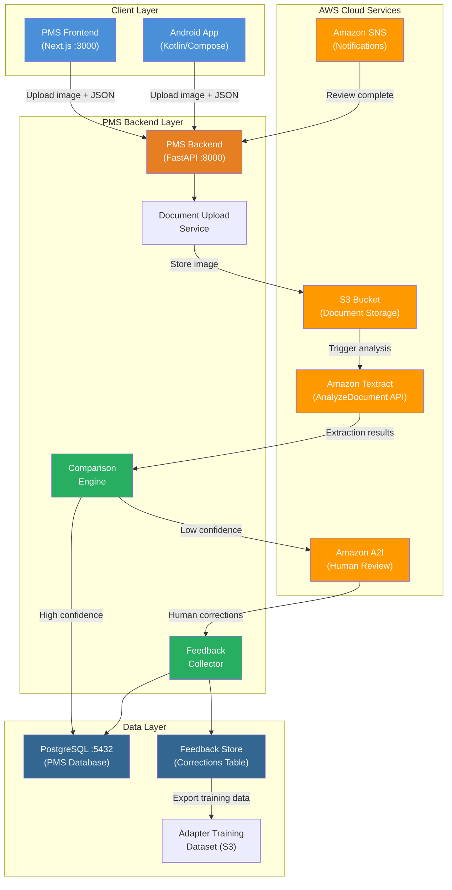

# Product Requirements Document: Amazon Textract Integration into Patient Management System (PMS)

**Document ID:** PRD-PMS-TEXTRACT-001
**Version:** 1.0
**Date:** March 12, 2026
**Author:** Ammar (CEO, MPS Inc.)
**Status:** Draft

---

## 1. Executive Summary

Amazon Textract is AWS's machine learning-powered document analysis service that extracts printed text, handwritten text, forms, tables, and structured data from scanned documents and images. Unlike basic OCR engines, Textract understands the spatial relationships on a page — identifying key-value pairs in forms, reconstructing tables with row/column relationships, and answering specific queries about document content. It returns confidence scores for every extraction, enabling automated routing of low-confidence results to human reviewers.

The PMS processes thousands of healthcare documents daily — insurance cards, referral letters, lab requisitions, prescription forms, patient intake forms, and faxed clinical notes. Currently, staff manually key data from these documents into the system, a process that is slow, error-prone, and expensive. By integrating Amazon Textract with a human-in-the-loop (HITL) verification workflow, the PMS can automate document data extraction while capturing correction data to continuously improve OCR accuracy.

This integration addresses a specific workflow: clinical staff upload document images alongside a preliminary JSON dataset (from initial OCR or manual entry). Amazon Textract re-processes the images, and the system compares Textract's output against the preliminary data. Discrepancies and low-confidence extractions are surfaced for human review. Corrections made by reviewers are captured in a feedback database, creating a training dataset that can be used to fine-tune Textract Custom Queries adapters and improve future extraction accuracy.

## 2. Problem Statement

PMS clinical and administrative staff spend an estimated 2-3 hours per day manually transcribing data from scanned documents — insurance cards, referral letters, lab orders, and patient intake forms. This manual process introduces:

- **Data entry errors**: Mistyped policy numbers, incorrect medication dosages, and transposed patient identifiers create downstream billing denials and clinical safety risks.
- **Processing delays**: Documents sit in queues for hours or days before being keyed into the system, delaying insurance verification, referral processing, and medication reconciliation.
- **No feedback loop**: When OCR tools are used for preliminary extraction, there is no systematic way to capture what the OCR got wrong, making it impossible to measure accuracy or improve extraction quality over time.
- **Inconsistent quality**: Different staff members interpret the same document differently, leading to data inconsistency across patient records.

The PMS needs an intelligent document processing pipeline that extracts data accurately, routes uncertain results to human reviewers, and captures corrections as structured training data for continuous improvement.

## 3. Proposed Solution

### 3.1 Architecture Overview

### 3.2 Deployment Model

- **Cloud-native on AWS**: Textract, S3, A2I, and SNS are fully managed AWS services. No self-hosted infrastructure required.
- **HIPAA-eligible**: Amazon Textract is a HIPAA-eligible service. Documents containing PHI are encrypted at rest (AES-256 via AWS KMS) and in transit (TLS 1.2+). A BAA with AWS covers Textract usage.
- **Docker integration**: The PMS backend's Textract integration module runs within the existing FastAPI Docker container. No additional containers needed.
- **Network security**: All API calls to AWS use IAM roles with least-privilege policies. S3 bucket policies restrict access to the PMS backend service role. VPC endpoints can be configured for private connectivity.
- **Data residency**: S3 bucket and Textract processing configured in a single AWS region (e.g., us-east-1) to comply with data residency requirements.

## 4. PMS Data Sources

The Amazon Textract integration interacts with the following PMS APIs and data:

- **Patient Records API (`/api/patients`)**: Extracted patient demographics (name, DOB, address, phone) from intake forms are matched against existing patient records. New patients are flagged for creation.
- **Encounter Records API (`/api/encounters`)**: Extracted clinical data from referral letters and clinical notes are linked to specific patient encounters. Document metadata (upload date, source type, extraction confidence) is stored with the encounter.
- **Medication & Prescription API (`/api/prescriptions`)**: Prescription forms and medication lists are parsed by Textract. Extracted drug names, dosages, and frequencies are validated against the PMS formulary before insertion.
- **Reporting API (`/api/reports`)**: OCR accuracy metrics, correction rates, and processing times are surfaced through the reporting API for operational dashboards.

Additionally, a new **Document Processing API (`/api/documents`)** will be created to handle:
- Document upload with preliminary JSON data
- Extraction status tracking
- Comparison results and review queue management
- Feedback submission and correction history

## 5. Component/Module Definitions

### 5.1 Document Upload Service

- **Description**: Accepts document images (JPEG, PNG, PDF, TIFF) and an accompanying JSON dataset containing preliminary OCR results or manually entered data.
- **Input**: Multipart form upload — image file + JSON payload with field-level preliminary values.
- **Output**: Upload confirmation with document ID and processing status.
- **PMS APIs**: `/api/documents/upload`, `/api/patients` (for patient context).

### 5.2 Textract Extraction Engine

- **Description**: Sends uploaded documents to Amazon Textract for analysis using AnalyzeDocument (synchronous, single page) or StartDocumentAnalysis (asynchronous, multi-page). Uses Queries feature for targeted field extraction and Custom Queries adapters for document-type-specific accuracy.
- **Input**: S3 object reference for uploaded document.
- **Output**: Structured JSON with extracted text, key-value pairs, tables, and per-field confidence scores.
- **PMS APIs**: Internal service — feeds into Comparison Engine.

### 5.3 Comparison Engine

- **Description**: Compares Textract extraction results against the preliminary JSON dataset provided at upload. For each field, determines: match (both agree), mismatch (values differ), Textract-only (preliminary missed it), preliminary-only (Textract missed it). Applies configurable confidence thresholds.
- **Input**: Textract results JSON + preliminary JSON dataset.
- **Output**: Comparison report with field-level status, confidence scores, and routing decision (auto-accept, human review, or reject).
- **PMS APIs**: `/api/documents/{id}/comparison`.

### 5.4 Human Review Queue (A2I Integration)

- **Description**: Routes low-confidence and mismatched fields to Amazon A2I for human review. Reviewers see the original document image alongside extracted and preliminary values, and can correct, confirm, or reject each field.
- **Input**: Document image + comparison report with flagged fields.
- **Output**: Human-verified field values with reviewer ID and timestamp.
- **PMS APIs**: `/api/documents/{id}/review`.

### 5.5 Feedback Collector

- **Description**: Captures all human corrections as structured training data. Stores: original Textract output, preliminary value, corrected value, field type, document type, reviewer ID, and timestamp. This data feeds into adapter retraining pipelines.
- **Input**: Human review results.
- **Output**: Correction records in PostgreSQL + exported training datasets in S3.
- **PMS APIs**: `/api/documents/feedback`, `/api/reports/ocr-accuracy`.

### 5.6 Adapter Training Pipeline

- **Description**: Periodically exports accumulated correction data to train or retrain Textract Custom Queries adapters. Requires minimum 5 training + 5 test documents. Training takes 2-30 hours. New adapter versions are evaluated against test sets before promotion.
- **Input**: Correction dataset from Feedback Collector.
- **Output**: New adapter version ID for deployment.
- **PMS APIs**: `/api/documents/adapters` (admin-only).

## 6. Non-Functional Requirements

### 6.1 Security and HIPAA Compliance

- **Encryption at rest**: All documents in S3 encrypted with AWS KMS (AES-256). Extraction results in PostgreSQL encrypted at the column level for PHI fields.
- **Encryption in transit**: TLS 1.2+ for all API calls to AWS services and between PMS components.
- **Access control**: IAM roles with least-privilege policies. S3 bucket policies restrict access to PMS backend service role. Human reviewers authenticated through PMS RBAC.
- **Audit logging**: Every document upload, extraction, comparison, review action, and correction logged with user ID, timestamp, and action type. CloudTrail enabled for all Textract API calls.
- **PHI isolation**: Documents containing PHI stored in a dedicated S3 bucket with lifecycle policies (auto-delete after configurable retention period). Extracted PHI in PostgreSQL subject to existing PMS data governance policies.
- **BAA coverage**: Amazon Textract, S3, A2I, SNS, and KMS are HIPAA-eligible and covered under the AWS BAA.

### 6.2 Performance

| Metric | Target |
|--------|--------|
| Single-page synchronous extraction | < 5 seconds |
| Multi-page async extraction (10 pages) | < 30 seconds |
| Comparison engine processing | < 1 second per document |
| Human review queue load time | < 2 seconds |
| Daily document throughput | 1,000+ documents |
| API response time (upload endpoint) | < 500ms (excluding upload transfer) |

### 6.3 Infrastructure

- **AWS services**: S3, Textract, A2I (SageMaker), SNS, KMS, CloudTrail, IAM.
- **Docker**: No additional containers. Integration module runs within existing FastAPI container.
- **Database**: 2-3 new PostgreSQL tables (documents, extractions, corrections).
- **Storage**: S3 bucket with lifecycle policies. Estimated 500MB-2GB/month for document images.
- **Cost estimate**: ~$0.015/page (tables) + $0.05/page (forms) + $0.025/page (queries). At 1,000 pages/day = ~$90/day or ~$2,700/month.

## 7. Implementation Phases

### Phase 1: Foundation (Sprints 1-2, 4 weeks)

- Set up AWS infrastructure: S3 bucket, IAM roles, KMS keys, CloudTrail logging
- Implement Document Upload Service with S3 integration
- Implement Textract Extraction Engine (synchronous single-page)
- Build basic comparison engine (exact match + confidence threshold)
- Create PostgreSQL schema for documents, extractions, and comparisons
- Unit and integration tests

### Phase 2: Human Review & Feedback Loop (Sprints 3-4, 4 weeks)

- Integrate Amazon A2I for human review workflows
- Build review queue UI in Next.js frontend
- Implement Feedback Collector with correction capture
- Add async multi-page document processing (StartDocumentAnalysis)
- Implement SNS notifications for review completion
- Add OCR accuracy reporting to `/api/reports`
- Android app document capture and upload

### Phase 3: Continuous Improvement & Optimization (Sprints 5-6, 4 weeks)

- Build adapter training pipeline with correction data export
- Implement Custom Queries for document-type-specific extraction (insurance cards, referral letters, prescriptions)
- Add Textract Queries feature for targeted field extraction
- Build adapter evaluation and promotion workflow
- Performance optimization (batch processing, caching)
- Operational dashboards and alerting

## 8. Success Metrics

| Metric | Target | Measurement Method |
|--------|--------|--------------------|
| OCR extraction accuracy (auto-accepted fields) | > 95% | Comparison engine match rate |
| Manual data entry time reduction | > 60% | Time tracking before/after |
| Human review turnaround time | < 5 minutes per document | Review queue metrics |
| Correction capture rate | 100% of human edits | Feedback collector audit |
| Adapter accuracy improvement per cycle | > 2% F1 improvement | Adapter evaluation metrics |
| Document processing throughput | > 1,000 docs/day | CloudWatch metrics |
| Staff satisfaction score | > 4/5 | Post-implementation survey |
| Billing denial rate from data entry errors | < 2% | Claims reporting |

## 9. Risks and Mitigations

| Risk | Impact | Mitigation |
|------|--------|------------|
| Low extraction accuracy on handwritten documents | Staff spends more time reviewing than manually entering | Start with printed documents first; use Textract's handwriting detection selectively; capture correction data to train adapters |
| AWS service costs exceed budget at scale | Monthly costs exceed ROI | Implement page-level cost tracking via CloudTrail; use Detect Document Text ($0.0015/page) for simple OCR; reserve Analyze Document for complex forms |
| A2I review queue bottleneck | Documents stuck waiting for human review | Set SLA alerts; auto-assign reviewers based on workload; allow batch review actions |
| Textract does not directly learn from corrections | Feedback loop requires manual adapter retraining | Build automated adapter retraining pipeline with scheduled exports; track improvement over retraining cycles |
| PHI exposure in S3 or review UI | HIPAA violation | Encryption, access control, audit logging, lifecycle policies, BAA coverage, penetration testing |
| Document quality (blurry scans, rotated images) | Poor extraction quality | Implement image quality validation pre-upload (blur detection, rotation correction); reject below-threshold images with user feedback |
| Multi-language document support | Limited Textract language support vs Azure/Google | Document language requirements; use Textract for English; evaluate Azure Document Intelligence (Exp 46) for multilingual needs |

## 10. Dependencies

- **Amazon Textract**: AWS managed service — AnalyzeDocument, StartDocumentAnalysis, Queries, Custom Queries APIs
- **Amazon S3**: Document image storage with encryption and lifecycle policies
- **Amazon A2I (SageMaker)**: Human review workflow management
- **Amazon SNS**: Async notification for review completion and extraction status
- **AWS KMS**: Encryption key management for PHI
- **AWS IAM**: Service role and policy management
- **boto3 (Python)**: AWS SDK for Textract, S3, A2I, SNS API calls
- **amazon-textract-textractor**: Python library for post-processing Textract results
- **PostgreSQL**: Existing PMS database for document metadata, extractions, corrections
- **PMS Backend (FastAPI)**: Host for all new API endpoints
- **PMS Frontend (Next.js)**: Host for review queue UI and document upload components

## 11. Comparison with Existing Experiments

### vs. Experiment 46: Azure Document Intelligence

Experiment 46 evaluates Azure Document Intelligence (formerly Form Recognizer) for healthcare document OCR. Key differences:

| Aspect | Amazon Textract (Exp 81) | Azure Document Intelligence (Exp 46) |
|--------|--------------------------|--------------------------------------|
| **Ecosystem** | AWS-native (S3, Lambda, A2I) | Azure-native (Blob Storage, Functions) |
| **Custom training** | Custom Queries adapters (min 5 docs) | Custom models with data labeling |
| **Human review** | Amazon A2I built-in integration | Requires custom HITL workflow |
| **Language support** | English-optimized, limited multilingual | 100+ languages with full processing |
| **Table accuracy** | Good, sometimes struggles with borderless | Excellent, preserves structure well |
| **PMS stack alignment** | Direct fit — PMS uses AWS infrastructure | Requires Azure cross-cloud connectivity |
| **HIPAA** | HIPAA-eligible, BAA available | HIPAA-eligible, BAA available |

**Complementary use**: Textract is the primary choice for PMS given AWS infrastructure alignment. Azure Document Intelligence serves as a fallback for multilingual documents or document types where Azure benchmarks higher accuracy.

### vs. Experiment 78: Paperclip (Agent Orchestration)

Paperclip's agent orchestration capabilities complement Textract integration. Document processing workflows (upload → extract → compare → review → feedback) can be orchestrated as Paperclip agent tasks, with the review queue managed as a human-in-the-loop agent step.

## 12. Research Sources

### Official Documentation
- [Amazon Textract Documentation Overview](https://aws.amazon.com/documentation-overview/textract/) — Service capabilities and API reference
- [Textract Boto3 API Reference](https://boto3.amazonaws.com/v1/documentation/api/latest/reference/services/textract.html) — Python SDK for all Textract operations
- [Custom Queries and Adapters](https://docs.aws.amazon.com/textract/latest/dg/how-it-works-custom-queries.html) — Adapter training workflow and best practices
- [Amazon A2I + Textract Integration](https://docs.aws.amazon.com/textract/latest/dg/a2i-textract.html) — Human review workflow configuration

### Architecture & Implementation
- [Automate Digitization with Human Oversight (AWS Blog)](https://aws.amazon.com/blogs/machine-learning/automate-digitization-of-transactional-documents-with-human-oversight-using-amazon-textract-and-amazon-a2i/) — Reference architecture for HITL document processing
- [amazon-textract-textractor (GitHub)](https://github.com/aws-samples/amazon-textract-textractor) — Python post-processing library
- [AI-Augmented OCR with Amazon Textract (Caylent)](https://caylent.com/blog/ai-augmented-ocr-with-amazon-textract) — Enhancement patterns and workflows

### Security & Compliance
- [Amazon Textract HIPAA Eligibility](https://aws.amazon.com/about-aws/whats-new/2019/10/amazon-textract-is-now-a-hipaa-eligible-service/) — HIPAA compliance announcement
- [Compliance Validation for Textract](https://docs.aws.amazon.com/textract/latest/dg/SERVICENAME-compliance.html) — SOC, ISO, PCI compliance details
- [Building a HIPAA-Compliant OCR Pipeline (IntuitionLabs)](https://intuitionlabs.ai/articles/hipaa-compliant-ocr-pipeline) — Security architecture patterns

### Ecosystem & Comparison
- [Amazon Textract Pricing](https://aws.amazon.com/textract/pricing/) — Per-page pricing for all APIs
- [OCR Tools Comparison 2026 (Persumi)](https://persumi.com/c/product-builders/u/fredwu/p/comparison-of-ai-ocr-tools-microsoft-azure-ai-document-intelligence-google-cloud-document-ai-aws-textract-and-others) — Azure vs Google vs Textract benchmarks

## 13. Appendix: Related Documents

- [Amazon Textract Setup Guide](81-AmazonTextract-PMS-Developer-Setup-Guide.md) — Step-by-step environment configuration and AWS service setup
- [Amazon Textract Developer Tutorial](81-AmazonTextract-Developer-Tutorial.md) — Hands-on tutorial building a document verification workflow
- [PRD: Azure Document Intelligence PMS Integration](46-PRD-AzureDocIntel-PMS-Integration.md) — Complementary OCR evaluation
- [PRD: Paperclip PMS Integration](78-PRD-Paperclip-PMS-Integration.md) — Agent orchestration for document processing workflows
- [Amazon Textract Official Documentation](https://docs.aws.amazon.com/textract/)
- [Amazon A2I Documentation](https://docs.aws.amazon.com/sagemaker/latest/dg/a2i-use-augmented-ai-a2i-human-review-loops.html)
