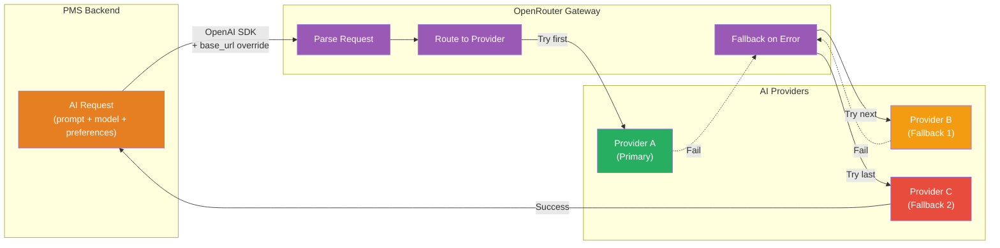
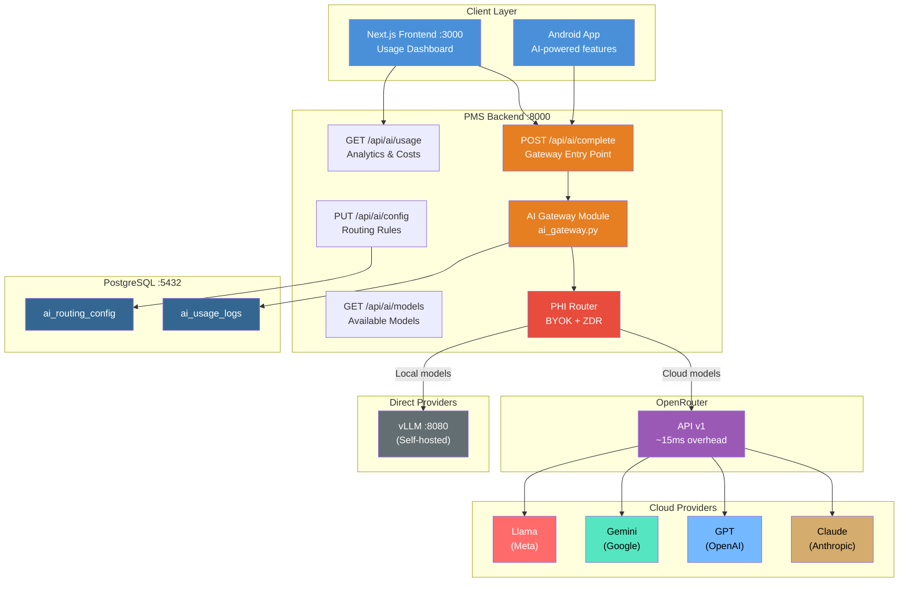

# OpenRouter Developer Onboarding Tutorial

**Welcome to the MPS PMS OpenRouter Integration Team**

This tutorial will take you from zero to building your first multi-model AI gateway integration with the PMS. By the end, you will understand how OpenRouter routes AI requests, have a working gateway with automatic fallback, and have built and tested a clinical note generation feature that switches models based on availability and cost.

**Document ID:** PMS-EXP-OPENROUTER-002
**Version:** 1.0
**Date:** March 12, 2026
**Applies To:** PMS project (all platforms)
**Prerequisite:** [OpenRouter Setup Guide](82-OpenRouter-PMS-Developer-Setup-Guide.md)
**Estimated time:** 2-3 hours
**Difficulty:** Beginner-friendly

---

## What You Will Learn

1. What OpenRouter is and why the PMS needs a unified AI gateway
2. How OpenRouter routes requests across 500+ models from 60+ providers
3. How to send completions through the PMS gateway module
4. How fallback chains protect against provider outages
5. How to configure per-feature routing (quality vs cost vs latency)
6. How PHI-safe routing works with BYOK and Zero Data Retention
7. How to track AI costs and usage per feature, per patient, per model
8. How to compare models for clinical task quality using the gateway
9. When to use OpenRouter vs direct provider APIs vs self-hosted vLLM
10. HIPAA compliance considerations for AI gateway architectures

## Part 1: Understanding OpenRouter (15 min read)

### 1.1 What Problem Does OpenRouter Solve?

The PMS uses AI for multiple features — clinical note generation, prescription analysis, insurance verification, patient summaries, and report generation. Today, each feature calls a specific AI provider directly:

- **Clinical notes** → Claude API (Anthropic)
- **Document analysis** → GPT-4o (OpenAI)
- **Report generation** → Gemini Flash (Google)

This creates three problems:

1. **Fragile**: When Claude went down on March 11, 2026 (2-hour outage), all clinical note features stopped working. No automatic failover.
2. **Expensive**: Each feature is locked to one model. The PMS can't automatically route batch tasks to cheaper models or switch to faster models for real-time features.
3. **Hard to evolve**: Testing a new model for prescription analysis requires code changes — import a different SDK, handle a different response format, update error handling.

OpenRouter solves all three by providing a single API endpoint that routes to any of 500+ models. Switch models by changing a string, get automatic failover for free, and optimize costs per-feature.

### 1.2 How OpenRouter Works — The Key Pieces



**Three core concepts:**

1. **Unified endpoint**: One API (`https://openrouter.ai/api/v1`) speaks OpenAI's format. You use the same `openai` Python SDK — just change `base_url` and `model`.
2. **Intelligent routing**: OpenRouter picks the best provider for your model based on cost, latency, or availability. You control this with `provider` preferences.
3. **Automatic fallback**: If a provider fails, OpenRouter tries the next one. You only pay for the successful response.

### 1.3 How OpenRouter Fits with Other PMS Technologies

| Technology | Role | Relationship to OpenRouter |
|-----------|------|---------------------------|
| **vLLM (Exp 52)** | Self-hosted inference | Gateway routes to vLLM for on-premise models, OpenRouter for cloud |
| **MCP (Exp 09)** | Tool protocol | MCP provides tools for models; OpenRouter provides the models themselves |
| **n8n (Exp 34)** | Workflow automation | n8n workflows call the AI gateway for LLM-powered automation steps |
| **Paperclip (Exp 78)** | Agent orchestration | Paperclip agents use the gateway for all inference calls |
| **CrewAI (Exp 55)** | Multi-agent teams | CrewAI agents route through the gateway for model selection and cost control |
| **LangGraph (Exp 26)** | Stateful workflows | LangGraph nodes call the gateway instead of direct provider APIs |
| **Amazon Textract (Exp 81)** | Document OCR | Textract handles extraction; gateway handles AI analysis of extracted text |
| **Redis (Exp 76)** | Caching | Redis caches frequent AI responses to reduce gateway calls and cost |

### 1.4 Key Vocabulary

| Term | Meaning |
|------|---------|
| **Gateway** | A proxy that sits between your application and AI providers, normalizing the API interface |
| **BYOK** | Bring Your Own Key — use your existing provider API keys through OpenRouter for billing and BAA preservation |
| **ZDR** | Zero Data Retention — a flag ensuring prompts are not logged or stored by the provider |
| **Provider** | The company hosting the model (Anthropic, OpenAI, Google, Together, Fireworks, etc.) |
| **Routing strategy** | How the gateway selects a provider: by price (cheapest), latency (fastest), or quality (default load-balanced) |
| **Fallback chain** | An ordered list of models to try if the primary fails |
| **Model ID** | OpenRouter format: `provider/model-name` (e.g., `anthropic/claude-sonnet-4-6`) |
| **`:free` suffix** | Appended to model IDs for free-tier models with rate limits (e.g., `meta-llama/llama-3.1-8b-instruct:free`) |
| **`:nitro` variant** | Sorts providers by throughput (speed) instead of default ordering |
| **`:floor` variant** | Sorts providers by price (cheapest first) |
| **extra_body** | OpenAI SDK parameter for passing OpenRouter-specific preferences (provider, transforms, etc.) |
| **Usage log** | PMS database record of every AI request: model, cost, latency, feature, PHI flag |

### 1.5 Our Architecture



## Part 2: Environment Verification (15 min)

### 2.1 Checklist

1. **OpenRouter API key set**:
   ```bash
   echo $OPENROUTER_API_KEY | head -c 15
   # Expected: sk-or-v1-xxxxx
   ```

2. **OpenRouter API accessible**:
   ```bash
   curl -s https://openrouter.ai/api/v1/models -H "Authorization: Bearer $OPENROUTER_API_KEY" | python3 -c "import json,sys; print(f'OK: {len(json.load(sys.stdin)[\"data\"])} models')"
   # Expected: OK: 500+ models
   ```

3. **OpenAI SDK installed**:
   ```bash
   python3 -c "import openai; print(f'openai {openai.__version__}')"
   # Expected: openai 1.x.x
   ```

4. **PMS backend running**:
   ```bash
   curl -s http://localhost:8000/docs | head -1
   ```

5. **PostgreSQL tables created**:
   ```bash
   psql -h localhost -p 5432 -U pms -d pms_db -c "\dt ai_*"
   # Expected: ai_usage_logs, ai_routing_config
   ```

### 2.2 Quick Test

```bash
python3 -c "
from openai import OpenAI
import os

client = OpenAI(
    base_url='https://openrouter.ai/api/v1',
    api_key=os.environ['OPENROUTER_API_KEY'],
)

response = client.chat.completions.create(
    model='meta-llama/llama-3.1-8b-instruct:free',
    messages=[{'role': 'user', 'content': 'Say hello in exactly 5 words.'}],
    max_tokens=20,
)
print(f'Model: {response.model}')
print(f'Response: {response.choices[0].message.content}')
print(f'Tokens: {response.usage.prompt_tokens} in / {response.usage.completion_tokens} out')
"
```

## Part 3: Build Your First Integration (45 min)

### 3.1 What We Are Building

A **clinical note summary feature** that:
1. Takes a raw encounter transcript and generates a structured clinical note
2. Uses Claude as the primary model (best clinical reasoning)
3. Falls back to GPT-4o if Claude is unavailable
4. Falls back to Gemini Pro as a last resort
5. Logs usage with cost tracking and PHI flagging

### 3.2 Create the Clinical Note Service

Create `app/services/clinical_notes.py`:

```python
from app.services.ai_gateway import complete

CLINICAL_NOTE_SYSTEM_PROMPT = """You are a clinical documentation assistant for a patient management system.
Generate a structured clinical note from the encounter transcript.
Use the SOAP format: Subjective, Objective, Assessment, Plan.
Be concise and clinically accurate. Do not fabricate information not present in the transcript."""


async def generate_clinical_note(
    transcript: str,
    patient_id: str,
    encounter_id: str,
    user_id: str,
    db=None,
) -> dict:
    """Generate a structured clinical note from an encounter transcript."""
    result = await complete(
        prompt=f"Generate a SOAP note from this encounter transcript:\n\n{transcript}",
        feature="clinical_note",
        system_prompt=CLINICAL_NOTE_SYSTEM_PROMPT,
        contains_phi=True,  # Transcripts contain PHI
        patient_id=patient_id,
        encounter_id=encounter_id,
        user_id=user_id,
        temperature=0.2,  # Low temperature for clinical accuracy
        db=db,
    )

    return {
        "note": result["content"],
        "model_used": result["model"],
        "provider": result["provider"],
        "cost": float(result["cost"]),
        "latency_ms": result["latency_ms"],
        "fallback_used": result.get("fallback_used", False),
    }
```

### 3.3 Create the API Endpoint

Add to `app/api/routes/encounters.py`:

```python
from app.services.clinical_notes import generate_clinical_note

@router.post("/{encounter_id}/generate-note")
async def generate_encounter_note(
    encounter_id: str,
    transcript: str = Body(...),
    db=Depends(get_db),
    current_user=Depends(get_current_user),
):
    """Generate a clinical note from an encounter transcript using the AI gateway."""
    # Verify encounter exists and belongs to the user's patient
    encounter = await db.fetch_one(
        "SELECT patient_id FROM encounters WHERE id = $1", encounter_id
    )
    if not encounter:
        raise HTTPException(404, "Encounter not found")

    result = await generate_clinical_note(
        transcript=transcript,
        patient_id=str(encounter["patient_id"]),
        encounter_id=encounter_id,
        user_id=str(current_user.id),
        db=db,
    )

    return result
```

### 3.4 Test the Clinical Note Feature

```bash
# Generate a clinical note
curl -X POST http://localhost:8000/api/encounters/test-encounter-id/generate-note \
  -H "Authorization: Bearer <your-token>" \
  -H "Content-Type: application/json" \
  -d '"Patient presents with persistent cough for 3 days. No fever. Denies shortness of breath. Lungs clear on auscultation bilaterally. Assessment: Likely viral upper respiratory infection. Plan: Rest, fluids, OTC cough suppressant, return if symptoms worsen or fever develops."' \
  | python3 -m json.tool
```

Expected response:
```json
{
  "note": "## SOAP Note\n\n**Subjective:**\nPatient presents with persistent cough for 3 days...",
  "model_used": "anthropic/claude-sonnet-4-6",
  "provider": "anthropic",
  "cost": 0.0045,
  "latency_ms": 1250,
  "fallback_used": false
}
```

### 3.5 Verify Usage Logging

```bash
# Check that the request was logged
psql -c "SELECT feature, model, provider, total_cost, latency_ms, contains_phi, status FROM ai_usage_logs ORDER BY created_at DESC LIMIT 5;"
```

### 3.6 Test Fallback Behavior

Simulate a primary model failure by temporarily changing the routing config:

```bash
# Set primary model to a non-existent model to force fallback
curl -X PUT http://localhost:8000/api/ai/config \
  -H "Authorization: Bearer <your-token>" \
  -H "Content-Type: application/json" \
  -d '{
    "feature": "clinical_note",
    "primary_model": "nonexistent/fake-model",
    "fallback_models": ["openai/gpt-4o", "google/gemini-2.0-pro"],
    "routing_strategy": "quality",
    "requires_phi_routing": true
  }'

# Now generate a note — it should fallback to GPT-4o
curl -X POST http://localhost:8000/api/encounters/test-encounter-id/generate-note \
  -H "Authorization: Bearer <your-token>" \
  -H "Content-Type: application/json" \
  -d '"Patient reports knee pain for 2 weeks..."' \
  | python3 -m json.tool

# Expected: model_used should be "openai/gpt-4o", fallback_used: true

# Restore the correct config
curl -X PUT http://localhost:8000/api/ai/config \
  -H "Authorization: Bearer <your-token>" \
  -H "Content-Type: application/json" \
  -d '{
    "feature": "clinical_note",
    "primary_model": "anthropic/claude-sonnet-4-6",
    "fallback_models": ["openai/gpt-4o", "google/gemini-2.0-pro"],
    "routing_strategy": "quality",
    "requires_phi_routing": true
  }'
```

## Part 4: Evaluating Strengths and Weaknesses (15 min)

### 4.1 Strengths

- **Zero migration cost**: Uses the standard OpenAI Python SDK. Change `base_url` and `model` — that's it.
- **500+ models**: Access Claude, GPT, Gemini, Llama, Mistral, DeepSeek, and hundreds more through one endpoint.
- **Automatic fallback**: Production resilience without custom retry logic. If Claude goes down, GPT-4o takes over transparently.
- **Cost optimization**: Route batch tasks to cheap models, real-time tasks to fast models, clinical tasks to accurate models — all through configuration, not code.
- **BYOK**: Preserve existing provider BAA relationships. First 1M BYOK requests/month free.
- **~15ms overhead**: Industry-leading gateway latency. Minimal impact on user experience.
- **Model comparison**: Test new models by changing a string in routing config. No SDK changes, no new error handling.

### 4.2 Weaknesses

- **No HIPAA BAA from OpenRouter**: OpenRouter itself does not offer a BAA. PHI passes through OpenRouter's infrastructure even in BYOK mode. Mitigation: ZDR + provider-level BAAs, but a compliance gray area.
- **SaaS dependency**: No self-hosted option. If OpenRouter goes down, you need a direct provider fallback path.
- **Limited observability**: No deep tracing, token-level debugging, or team-based cost attribution (unlike Portkey).
- **5% BYOK fee after free tier**: If PMS grows past 1M requests/month, the fee becomes significant.
- **No streaming control**: Limited control over streaming behavior compared to direct provider APIs.
- **Vendor risk**: Single company (OpenRouter Inc.) — if they change pricing or shut down, the PMS needs to migrate.

### 4.3 When to Use OpenRouter vs Alternatives

| Scenario | Recommended | Why |
|----------|-------------|-----|
| Multi-model routing with minimal setup | **OpenRouter** | 5-minute setup, OpenAI SDK compatible |
| Full self-hosted control | **LiteLLM** | Open-source, self-hosted, no data leaves your infra |
| Enterprise observability + governance | **Portkey** | Deep tracing, virtual keys, team budgets |
| Highest-sensitivity PHI processing | **Direct provider API** | No middleman, direct BAA, full control |
| On-premise inference | **vLLM (Exp 52)** | Self-hosted, no network, zero data exposure |
| Development and prototyping | **OpenRouter** | Free models, instant access to 500+ models, no commitments |

### 4.4 HIPAA / Healthcare Considerations

- **BAA gap**: OpenRouter does not offer a BAA. For HIPAA compliance, the PMS must rely on provider-level BAAs (Anthropic, OpenAI, Google) via BYOK mode.
- **Data transit**: Prompts containing PHI transit through OpenRouter's infrastructure before reaching the provider. Even with ZDR, this creates a compliance consideration.
- **Mitigation strategy**:
  1. Use BYOK mode exclusively for PHI requests
  2. Enable ZDR on all PHI requests
  3. Restrict PHI routing to HIPAA-eligible providers only
  4. Maintain a direct provider fallback for highest-sensitivity operations
  5. Document the risk acceptance in your HIPAA risk assessment
- **Audit logging**: The PMS logs all AI requests with PHI flags in PostgreSQL. This provides the audit trail required by HIPAA, independent of OpenRouter's logging.
- **Provider filtering**: The PHI router restricts PHI requests to `anthropic`, `openai`, and `google` — all of which offer BAAs and are HIPAA-eligible.

## Part 5: Debugging Common Issues (15 min read)

### Issue 1: "All models failed" error

**Symptom**: Gateway returns 503 with "All models failed. Last error: ..."

**Cause**: Primary model and all fallbacks are unavailable (rare) or API key is invalid.

**Fix**: Check OpenRouter status at https://status.openrouter.ai. Verify API key. Add more fallback models:
```python
fallback_models=["openai/gpt-4o", "google/gemini-2.0-pro", "meta-llama/llama-3.1-70b-instruct"]
```

### Issue 2: Wrong model responds (routing mismatch)

**Symptom**: Routing config says Claude, but response comes from GPT.

**Cause**: OpenRouter's `response.model` field reflects the actual model that processed the request, which may differ from the requested model if fallback occurred.

**Fix**: Check the `fallback_used` field in the response. If true, the primary model was unavailable.

### Issue 3: Cost tracking shows $0 for all requests

**Symptom**: `ai_usage_logs.total_cost` is always 0.

**Cause**: The cost estimation function uses hardcoded pricing. OpenRouter doesn't always include cost in the response body.

**Fix**: Use the OpenRouter Activity dashboard for authoritative cost data, or query the `/api/v1/generation` endpoint for per-request cost.

### Issue 4: PHI request routed to non-HIPAA provider

**Symptom**: A `contains_phi=true` request was served by a non-HIPAA-eligible provider.

**Cause**: The `allowed_providers` filter is not being applied, or the provider name doesn't match.

**Fix**: Verify the `OPENROUTER_PHI_PROVIDERS` environment variable matches OpenRouter's provider names exactly. Check the `provider` field in usage logs.

### Issue 5: Streaming responses are buffered

**Symptom**: Streamed responses arrive as a single chunk instead of token-by-token.

**Cause**: The gateway module isn't configured for streaming.

**Fix**: Use `stream=True` in the completion call and return a `StreamingResponse` from FastAPI:
```python
response = openrouter_client.chat.completions.create(
    model=model, messages=messages, stream=True
)
```

### Issue 6: Rate limited on free models

**Symptom**: `429 Too Many Requests` when using `:free` model variants.

**Cause**: Free models have rate limits (typically 20 requests/minute, 200/day).

**Fix**: Add credits and use paid models for production. Free models are for development only.

## Part 6: Practice Exercise (45 min)

### Option A: Build a Prescription Analysis Feature

Build a prescription safety check using the gateway:
1. Create a `prescription_check` service that sends prescription details to the AI gateway
2. Configure routing: Claude primary (best clinical reasoning), GPT-4o fallback
3. Flag the request as PHI (prescriptions contain patient data)
4. Generate 5 test prescriptions and verify routing, fallback, and cost tracking

**Hints**:
- System prompt should instruct the model to check for drug interactions, dosage issues, and contraindications
- Use `temperature=0.1` for maximum determinism in clinical analysis
- Verify PHI routing is enforced in usage logs

### Option B: Cost Optimization Experiment

Compare model costs for the same clinical task:
1. Generate 10 clinical notes using Claude Sonnet ($3/$15 per 1M tokens)
2. Generate the same 10 notes using GPT-4o ($2.50/$10 per 1M tokens)
3. Generate the same 10 notes using Gemini Flash ($0.075/$0.30 per 1M tokens)
4. Compare quality, cost, and latency in the usage dashboard

**Hints**:
- Override `model` in each request to bypass routing config
- Use the same transcripts for fair comparison
- Quality assessment: clinical accuracy, completeness, formatting

### Option C: Build a Budget Alert System

Implement spending caps:
1. Query `ai_usage_logs` for daily cost by feature
2. Create an endpoint that returns budget status (under/over)
3. Set a daily budget of $5 and trigger an alert when 80% is consumed
4. Implement automatic model downgrade (Claude → Gemini) when budget approaches limit

**Hints**:
- Aggregate costs with `SELECT feature, SUM(total_cost) FROM ai_usage_logs WHERE created_at > NOW() - INTERVAL '1 day' GROUP BY feature`
- Budget enforcement can be implemented in the gateway module's `complete()` function

## Part 7: Development Workflow and Conventions

### 7.1 File Organization

```
pms-backend/
├── app/
│   ├── api/
│   │   └── routes/
│   │       └── ai.py                 # AI gateway API routes
│   ├── services/
│   │   ├── ai_gateway.py             # Core gateway module
│   │   └── clinical_notes.py         # Clinical note generation service
│   ├── models/
│   │   └── ai_usage.py               # SQLAlchemy models for AI tables
│   └── schemas/
│       └── ai.py                     # Pydantic schemas
├── migrations/
│   └── versions/
│       └── xxx_add_ai_gateway.py     # Alembic migration
└── tests/
    └── test_ai_gateway.py            # Gateway tests

pms-frontend/
├── components/
│   └── ai/
│       └── AIUsageDashboard.tsx       # Usage analytics dashboard
└── app/
    └── admin/
        └── ai/
            └── page.tsx               # AI management page
```

### 7.2 Naming Conventions

| Item | Convention | Example |
|------|-----------|---------|
| Feature names | `snake_case` | `clinical_note`, `prescription_check` |
| Model IDs | `provider/model-name` | `anthropic/claude-sonnet-4-6` |
| API routes | `/api/ai/{action}` | `/api/ai/complete` |
| Service functions | `snake_case` async | `generate_clinical_note()` |
| DB tables | `ai_{entity}` | `ai_usage_logs`, `ai_routing_config` |
| Environment variables | `OPENROUTER_` prefix | `OPENROUTER_API_KEY` |

### 7.3 PR Checklist

- [ ] All AI requests go through `ai_gateway.complete()` — no direct provider calls
- [ ] PHI-containing requests have `contains_phi=True`
- [ ] Usage logging captures feature, model, cost, and latency
- [ ] Fallback models are defined for every feature
- [ ] No API keys or secrets in code — environment variables only
- [ ] Unit tests mock the OpenRouter API (don't hit real API in CI)
- [ ] Error messages do not expose PHI or API keys
- [ ] Routing config changes are tracked with `updated_by` and `updated_at`

### 7.4 Security Reminders

- **Never log prompts**: AI prompts may contain PHI. Log feature name, model, cost, and latency — never prompt content.
- **BYOK for PHI**: All PHI-containing requests must use BYOK mode with provider BAAs.
- **ZDR enforcement**: Enable Zero Data Retention for all PHI requests via provider preferences.
- **API key rotation**: Rotate the OpenRouter API key quarterly. Use the Infisical integration for automated rotation.
- **Direct fallback**: Maintain a code path for direct provider API calls if OpenRouter is unavailable.
- **Provider audit**: Quarterly review of which providers handle PHI requests. Remove any that lose HIPAA eligibility.

## Part 8: Quick Reference Card

### Key Commands

```bash
# Test OpenRouter connectivity
curl -s https://openrouter.ai/api/v1/models -H "Authorization: Bearer $OPENROUTER_API_KEY" | python3 -c "import json,sys; print(f'{len(json.load(sys.stdin)[\"data\"])} models')"

# Send a completion through the gateway
curl -X POST http://localhost:8000/api/ai/complete -H "Authorization: Bearer <token>" -H "Content-Type: application/json" -d '{"prompt": "Hello", "feature": "test"}'

# View usage analytics
curl http://localhost:8000/api/ai/usage?days=7 -H "Authorization: Bearer <token>"

# Update routing config
curl -X PUT http://localhost:8000/api/ai/config -H "Authorization: Bearer <token>" -H "Content-Type: application/json" -d '{"feature": "clinical_note", "primary_model": "anthropic/claude-sonnet-4-6", "fallback_models": ["openai/gpt-4o"]}'

# View routing configs
psql -c "SELECT feature, primary_model, routing_strategy FROM ai_routing_config;"

# View recent usage
psql -c "SELECT feature, model, total_cost, latency_ms, status FROM ai_usage_logs ORDER BY created_at DESC LIMIT 10;"
```

### Key Files

| File | Purpose |
|------|---------|
| `app/services/ai_gateway.py` | Core gateway module — all LLM calls go here |
| `app/api/routes/ai.py` | REST API endpoints for completions, models, usage, config |
| `components/ai/AIUsageDashboard.tsx` | Frontend usage analytics |
| `.env` | OpenRouter API key, base URL, default models |

### Key URLs

| Resource | URL |
|----------|-----|
| OpenRouter Dashboard | https://openrouter.ai/activity |
| OpenRouter Models | https://openrouter.ai/models |
| OpenRouter Docs | https://openrouter.ai/docs |
| OpenRouter Pricing | https://openrouter.ai/pricing |
| OpenRouter Status | https://status.openrouter.ai |

### Model Selection Cheat Sheet

| Use Case | Model | Why |
|----------|-------|-----|
| Clinical reasoning | `anthropic/claude-sonnet-4-6` | Best clinical accuracy |
| Document analysis | `openai/gpt-4o` | Strong multimodal + large context |
| Cheap batch tasks | `google/gemini-2.0-flash` | $0.075/M input — cheapest quality model |
| Free development | `meta-llama/llama-3.1-8b-instruct:free` | Zero cost, rate limited |
| Speed-critical | `anthropic/claude-haiku-4-5-20251001` | Fastest Claude model |
| Maximum quality | `anthropic/claude-opus-4-6` | Best overall, expensive |

## Next Steps

1. **Migrate existing AI integrations**: Replace direct Anthropic/OpenAI SDK calls with `ai_gateway.complete()` calls.
2. **Configure per-feature routing**: Set up routing rules for all PMS AI features in `ai_routing_config`.
3. **Set up cost alerting**: Build budget monitoring and automatic model downgrade when spending approaches limits.
4. **Evaluate model quality per feature**: Use the gateway to A/B test models for each clinical task.
5. **Integrate with n8n (Exp 34)**: Create n8n workflows that call the AI gateway for automated clinical tasks.
