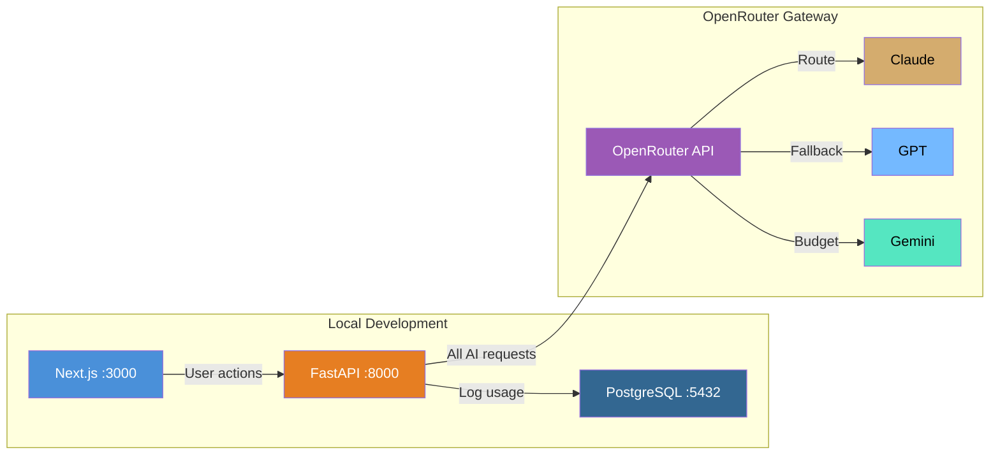

# OpenRouter Setup Guide for PMS Integration

**Document ID:** PMS-EXP-OPENROUTER-001
**Version:** 1.0
**Date:** March 12, 2026
**Applies To:** PMS project (all platforms)
**Prerequisites Level:** Beginner

---

## Table of Contents

1. [Overview](#1-overview)
2. [Prerequisites](#2-prerequisites)
3. [Part A: OpenRouter Account and API Key Setup](#3-part-a-openrouter-account-and-api-key-setup)
4. [Part B: Integrate with PMS Backend](#4-part-b-integrate-with-pms-backend)
5. [Part C: Integrate with PMS Frontend](#5-part-c-integrate-with-pms-frontend)
6. [Part D: Testing and Verification](#6-part-d-testing-and-verification)
7. [Troubleshooting](#7-troubleshooting)
8. [Reference Commands](#8-reference-commands)

---

## 1. Overview

This guide walks you through integrating OpenRouter as the unified AI gateway for the PMS. By the end, you will have:

- An OpenRouter account with API key and BYOK provider keys configured
- A FastAPI gateway module that routes all LLM requests through OpenRouter
- Per-feature routing configuration (model selection, fallback chains, cost/latency preferences)
- PHI-safe routing with Zero Data Retention and HIPAA-eligible provider filtering
- Usage analytics tracking in PostgreSQL
- A Next.js dashboard showing AI costs and usage by feature



## 2. Prerequisites

### 2.1 Required Software

| Software | Minimum Version | Check Command |
|----------|-----------------|---------------|
| Python | 3.10+ | `python3 --version` |
| Node.js | 18+ | `node --version` |
| Docker | 24+ | `docker --version` |
| PostgreSQL | 15+ | `psql --version` |
| pip | 23+ | `pip --version` |

### 2.2 Installation of Prerequisites

The OpenRouter integration uses the standard OpenAI Python SDK — no additional SDKs are needed.

```bash
pip install openai httpx
```

### 2.3 Verify PMS Services

```bash
# Check PMS backend
curl -s http://localhost:8000/docs | head -5

# Check PMS frontend
curl -s http://localhost:3000 | head -5

# Check PostgreSQL
psql -h localhost -p 5432 -U pms -d pms_db -c "SELECT 1;"
```

## 3. Part A: OpenRouter Account and API Key Setup

### Step 1: Create OpenRouter Account

1. Go to [https://openrouter.ai](https://openrouter.ai)
2. Sign up with email or GitHub
3. Navigate to **Keys** → **Create Key**
4. Name the key `pms-backend-dev`
5. Copy the API key (starts with `sk-or-v1-...`)

### Step 2: Add Credits (Optional for Development)

For development, you can use free models (no credits needed). For production models:

1. Navigate to **Credits** → **Add Credits**
2. Add $10 for development testing
3. Set a spending limit to prevent runaway costs

### Step 3: Configure BYOK Provider Keys

To use your existing provider API keys through OpenRouter:

1. Navigate to **Settings** → **Provider Keys**
2. Add your Anthropic API key (for Claude models)
3. Add your OpenAI API key (for GPT models)
4. Add your Google AI API key (for Gemini models)

BYOK benefits: first 1M requests/month free, preserves your BAA relationships, unified analytics.

### Step 4: Set Environment Variables

Add to your PMS backend `.env` file:

```bash
# OpenRouter Configuration
OPENROUTER_API_KEY=sk-or-v1-your-key-here
OPENROUTER_BASE_URL=https://openrouter.ai/api/v1
OPENROUTER_APP_NAME=MPS-PMS
OPENROUTER_APP_URL=http://localhost:8000

# Default model preferences
OPENROUTER_DEFAULT_MODEL=anthropic/claude-sonnet-4-6
OPENROUTER_FALLBACK_MODEL=openai/gpt-4o
OPENROUTER_BUDGET_MODEL=google/gemini-2.0-flash

# PHI routing
OPENROUTER_PHI_PROVIDERS=anthropic,openai,google
OPENROUTER_ENABLE_ZDR=true
```

**Checkpoint**: You have an OpenRouter account with API key, BYOK provider keys configured, and environment variables set. Verify:

```bash
# Test API key
curl -s https://openrouter.ai/api/v1/models \
  -H "Authorization: Bearer $OPENROUTER_API_KEY" | python3 -c "import json,sys; d=json.load(sys.stdin); print(f'{len(d[\"data\"])} models available')"
# Expected: 500+ models available
```

## 4. Part B: Integrate with PMS Backend

### Step 1: Create Database Schema

```sql
-- Migration: Create AI gateway usage tables

CREATE TABLE IF NOT EXISTS ai_usage_logs (
    id UUID PRIMARY KEY DEFAULT gen_random_uuid(),
    feature VARCHAR(100) NOT NULL,          -- 'clinical_note', 'prescription_check', 'report_gen', etc.
    model VARCHAR(200) NOT NULL,            -- 'anthropic/claude-sonnet-4-6'
    provider VARCHAR(100),                  -- 'anthropic', 'openai', 'google'
    input_tokens INTEGER NOT NULL DEFAULT 0,
    output_tokens INTEGER NOT NULL DEFAULT 0,
    total_cost DECIMAL(10, 6) NOT NULL DEFAULT 0,
    latency_ms INTEGER,
    status VARCHAR(20) DEFAULT 'success',   -- 'success', 'fallback', 'error'
    fallback_from VARCHAR(200),             -- original model if fallback occurred
    contains_phi BOOLEAN DEFAULT false,
    zdr_enabled BOOLEAN DEFAULT false,
    user_id UUID REFERENCES users(id),
    patient_id UUID REFERENCES patients(id),
    encounter_id UUID REFERENCES encounters(id),
    request_id VARCHAR(255),                -- OpenRouter request ID
    created_at TIMESTAMPTZ DEFAULT NOW()
);

CREATE TABLE IF NOT EXISTS ai_routing_config (
    id UUID PRIMARY KEY DEFAULT gen_random_uuid(),
    feature VARCHAR(100) NOT NULL UNIQUE,
    primary_model VARCHAR(200) NOT NULL,
    fallback_models JSONB DEFAULT '[]',
    routing_strategy VARCHAR(20) DEFAULT 'quality',  -- 'quality', 'cost', 'latency'
    max_cost_per_request DECIMAL(10, 6),
    max_latency_ms INTEGER,
    requires_phi_routing BOOLEAN DEFAULT false,
    allowed_providers JSONB DEFAULT '[]',
    is_active BOOLEAN DEFAULT true,
    updated_by UUID REFERENCES users(id),
    updated_at TIMESTAMPTZ DEFAULT NOW(),
    created_at TIMESTAMPTZ DEFAULT NOW()
);

-- Indexes
CREATE INDEX idx_ai_usage_feature ON ai_usage_logs(feature);
CREATE INDEX idx_ai_usage_model ON ai_usage_logs(model);
CREATE INDEX idx_ai_usage_created ON ai_usage_logs(created_at);
CREATE INDEX idx_ai_usage_patient ON ai_usage_logs(patient_id);
CREATE INDEX idx_ai_routing_feature ON ai_routing_config(feature);

-- Insert default routing configurations
INSERT INTO ai_routing_config (feature, primary_model, fallback_models, routing_strategy, requires_phi_routing) VALUES
('clinical_note', 'anthropic/claude-sonnet-4-6', '["openai/gpt-4o", "google/gemini-2.0-pro"]', 'quality', true),
('prescription_check', 'anthropic/claude-sonnet-4-6', '["openai/gpt-4o"]', 'quality', true),
('report_generation', 'google/gemini-2.0-flash', '["anthropic/claude-haiku-4-5-20251001"]', 'cost', false),
('insurance_verification', 'openai/gpt-4o-mini', '["google/gemini-2.0-flash"]', 'cost', true),
('patient_summary', 'anthropic/claude-sonnet-4-6', '["openai/gpt-4o"]', 'quality', true),
('document_analysis', 'openai/gpt-4o', '["anthropic/claude-sonnet-4-6"]', 'quality', true)
ON CONFLICT (feature) DO NOTHING;
```

### Step 2: Create the Gateway Module

Create `app/services/ai_gateway.py`:

```python
import time
import uuid
from decimal import Decimal
from typing import Optional

from openai import OpenAI
from app.core.config import settings

# Initialize OpenRouter client using OpenAI SDK
openrouter_client = OpenAI(
    base_url=settings.OPENROUTER_BASE_URL,
    api_key=settings.OPENROUTER_API_KEY,
    default_headers={
        "HTTP-Referer": settings.OPENROUTER_APP_URL,
        "X-Title": settings.OPENROUTER_APP_NAME,
    },
)


async def complete(
    prompt: str,
    feature: str,
    system_prompt: Optional[str] = None,
    model: Optional[str] = None,
    fallback_models: Optional[list[str]] = None,
    routing_strategy: str = "quality",
    contains_phi: bool = False,
    user_id: Optional[str] = None,
    patient_id: Optional[str] = None,
    encounter_id: Optional[str] = None,
    max_tokens: int = 4096,
    temperature: float = 0.3,
    db=None,
) -> dict:
    """
    Send a completion request through the OpenRouter gateway.

    Args:
        prompt: The user message to send
        feature: PMS feature name (e.g., 'clinical_note', 'prescription_check')
        system_prompt: Optional system message
        model: Specific model to use (overrides routing config)
        fallback_models: Ordered list of fallback models
        routing_strategy: 'quality', 'cost', or 'latency'
        contains_phi: Whether the prompt contains PHI
        user_id: ID of the requesting user
        patient_id: Related patient ID (for usage tracking)
        encounter_id: Related encounter ID (for usage tracking)
        max_tokens: Maximum output tokens
        temperature: Model temperature
        db: Database connection for usage logging

    Returns:
        dict with 'content', 'model', 'provider', 'usage', 'cost', 'latency_ms'
    """
    # Load routing config from DB if no model specified
    if not model and db:
        config = await _get_routing_config(feature, db)
        if config:
            model = config["primary_model"]
            fallback_models = config.get("fallback_models", [])
            contains_phi = config.get("requires_phi_routing", contains_phi)

    model = model or settings.OPENROUTER_DEFAULT_MODEL
    fallback_models = fallback_models or [settings.OPENROUTER_FALLBACK_MODEL]

    # Build messages
    messages = []
    if system_prompt:
        messages.append({"role": "system", "content": system_prompt})
    messages.append({"role": "user", "content": prompt})

    # Build provider preferences
    provider_prefs = _build_provider_preferences(
        routing_strategy=routing_strategy,
        contains_phi=contains_phi,
    )

    # Build model list for fallback
    models_to_try = [model] + (fallback_models or [])

    # Try each model in order
    last_error = None
    for i, current_model in enumerate(models_to_try):
        start_time = time.time()
        try:
            response = openrouter_client.chat.completions.create(
                model=current_model,
                messages=messages,
                max_tokens=max_tokens,
                temperature=temperature,
                extra_body={
                    "provider": provider_prefs,
                    "transforms": ["middle-out"],
                },
            )

            latency_ms = int((time.time() - start_time) * 1000)

            result = {
                "content": response.choices[0].message.content,
                "model": response.model,
                "provider": _extract_provider(response),
                "usage": {
                    "input_tokens": response.usage.prompt_tokens if response.usage else 0,
                    "output_tokens": response.usage.completion_tokens if response.usage else 0,
                },
                "cost": _estimate_cost(response),
                "latency_ms": latency_ms,
                "request_id": response.id,
                "fallback_used": i > 0,
                "fallback_from": model if i > 0 else None,
            }

            # Log usage
            if db:
                await _log_usage(
                    db=db,
                    feature=feature,
                    model=current_model,
                    provider=result["provider"],
                    input_tokens=result["usage"]["input_tokens"],
                    output_tokens=result["usage"]["output_tokens"],
                    total_cost=result["cost"],
                    latency_ms=latency_ms,
                    status="fallback" if i > 0 else "success",
                    fallback_from=model if i > 0 else None,
                    contains_phi=contains_phi,
                    zdr_enabled=contains_phi and settings.OPENROUTER_ENABLE_ZDR,
                    user_id=user_id,
                    patient_id=patient_id,
                    encounter_id=encounter_id,
                    request_id=response.id,
                )

            return result

        except Exception as e:
            last_error = e
            continue

    # All models failed
    if db:
        await _log_usage(
            db=db,
            feature=feature,
            model=model,
            provider="none",
            input_tokens=0,
            output_tokens=0,
            total_cost=Decimal("0"),
            latency_ms=0,
            status="error",
            fallback_from=None,
            contains_phi=contains_phi,
            zdr_enabled=False,
            user_id=user_id,
            request_id=str(uuid.uuid4()),
        )

    raise Exception(f"All models failed. Last error: {last_error}")


async def list_models() -> list[dict]:
    """List available models from OpenRouter."""
    response = openrouter_client.models.list()
    return [
        {
            "id": m.id,
            "name": getattr(m, "name", m.id),
            "context_length": getattr(m, "context_length", None),
            "pricing": getattr(m, "pricing", None),
        }
        for m in response.data
    ]


def _build_provider_preferences(routing_strategy: str, contains_phi: bool) -> dict:
    """Build OpenRouter provider preferences based on routing strategy and PHI flag."""
    prefs = {}

    if routing_strategy == "cost":
        prefs["sort"] = "price"
    elif routing_strategy == "latency":
        prefs["sort"] = "latency"
    # 'quality' uses default routing (load-balanced)

    if contains_phi:
        prefs["allow"] = settings.OPENROUTER_PHI_PROVIDERS.split(",")
        if settings.OPENROUTER_ENABLE_ZDR:
            prefs["require_parameters"] = True

    return prefs


def _extract_provider(response) -> str:
    """Extract the actual provider name from the OpenRouter response."""
    model_id = response.model or ""
    return model_id.split("/")[0] if "/" in model_id else "unknown"


def _estimate_cost(response) -> Decimal:
    """Estimate cost from response usage data."""
    if not response.usage:
        return Decimal("0")
    # OpenRouter includes cost info in response headers or usage
    # Rough estimation based on typical pricing
    return Decimal(str(
        (response.usage.prompt_tokens * 0.000003)
        + (response.usage.completion_tokens * 0.000015)
    ))


async def _get_routing_config(feature: str, db) -> Optional[dict]:
    """Load routing configuration for a feature from the database."""
    row = await db.fetch_one(
        "SELECT * FROM ai_routing_config WHERE feature = $1 AND is_active = true",
        feature,
    )
    return dict(row) if row else None


async def _log_usage(db, **kwargs):
    """Log AI usage to PostgreSQL."""
    await db.execute(
        """INSERT INTO ai_usage_logs
           (feature, model, provider, input_tokens, output_tokens, total_cost,
            latency_ms, status, fallback_from, contains_phi, zdr_enabled,
            user_id, patient_id, encounter_id, request_id)
           VALUES ($1, $2, $3, $4, $5, $6, $7, $8, $9, $10, $11, $12, $13, $14, $15)""",
        kwargs.get("feature"), kwargs.get("model"), kwargs.get("provider"),
        kwargs.get("input_tokens", 0), kwargs.get("output_tokens", 0),
        kwargs.get("total_cost", 0), kwargs.get("latency_ms", 0),
        kwargs.get("status", "success"), kwargs.get("fallback_from"),
        kwargs.get("contains_phi", False), kwargs.get("zdr_enabled", False),
        kwargs.get("user_id"), kwargs.get("patient_id"),
        kwargs.get("encounter_id"), kwargs.get("request_id"),
    )
```

### Step 3: Create API Routes

Create `app/api/routes/ai.py`:

```python
from fastapi import APIRouter, Depends, HTTPException
from pydantic import BaseModel
from typing import Optional
from datetime import datetime, timedelta

from app.services import ai_gateway
from app.core.database import get_db
from app.core.auth import get_current_user

router = APIRouter(prefix="/api/ai", tags=["ai-gateway"])


class CompletionRequest(BaseModel):
    prompt: str
    feature: str
    system_prompt: Optional[str] = None
    model: Optional[str] = None
    contains_phi: bool = False
    max_tokens: int = 4096
    temperature: float = 0.3


class RoutingConfigRequest(BaseModel):
    feature: str
    primary_model: str
    fallback_models: list[str] = []
    routing_strategy: str = "quality"
    requires_phi_routing: bool = False
    max_cost_per_request: Optional[float] = None
    max_latency_ms: Optional[int] = None


@router.post("/complete")
async def complete(
    req: CompletionRequest,
    db=Depends(get_db),
    current_user=Depends(get_current_user),
):
    """Send a completion request through the AI gateway."""
    try:
        result = await ai_gateway.complete(
            prompt=req.prompt,
            feature=req.feature,
            system_prompt=req.system_prompt,
            model=req.model,
            contains_phi=req.contains_phi,
            max_tokens=req.max_tokens,
            temperature=req.temperature,
            user_id=str(current_user.id),
            db=db,
        )
        return result
    except Exception as e:
        raise HTTPException(503, f"AI gateway error: {str(e)}")


@router.get("/models")
async def list_models(current_user=Depends(get_current_user)):
    """List available AI models through OpenRouter."""
    models = await ai_gateway.list_models()
    return {"models": models, "count": len(models)}


@router.get("/usage")
async def get_usage(
    feature: Optional[str] = None,
    days: int = 7,
    db=Depends(get_db),
    current_user=Depends(get_current_user),
):
    """Get AI usage analytics and costs."""
    since = datetime.utcnow() - timedelta(days=days)

    query = """
        SELECT
            feature,
            model,
            COUNT(*) as request_count,
            SUM(input_tokens) as total_input_tokens,
            SUM(output_tokens) as total_output_tokens,
            SUM(total_cost) as total_cost,
            AVG(latency_ms) as avg_latency_ms,
            COUNT(CASE WHEN status = 'fallback' THEN 1 END) as fallback_count,
            COUNT(CASE WHEN status = 'error' THEN 1 END) as error_count
        FROM ai_usage_logs
        WHERE created_at >= $1
    """
    params = [since]

    if feature:
        query += " AND feature = $2"
        params.append(feature)

    query += " GROUP BY feature, model ORDER BY total_cost DESC"

    rows = await db.fetch_all(query, *params)
    return {
        "period_days": days,
        "usage": [dict(r) for r in rows],
        "total_cost": sum(r["total_cost"] for r in rows),
        "total_requests": sum(r["request_count"] for r in rows),
    }


@router.get("/config")
async def get_routing_config(
    db=Depends(get_db),
    current_user=Depends(get_current_user),
):
    """Get all routing configurations."""
    rows = await db.fetch_all(
        "SELECT * FROM ai_routing_config WHERE is_active = true ORDER BY feature"
    )
    return {"configs": [dict(r) for r in rows]}


@router.put("/config")
async def update_routing_config(
    req: RoutingConfigRequest,
    db=Depends(get_db),
    current_user=Depends(get_current_user),
):
    """Update routing configuration for a feature."""
    import json
    await db.execute(
        """INSERT INTO ai_routing_config
           (feature, primary_model, fallback_models, routing_strategy,
            requires_phi_routing, max_cost_per_request, max_latency_ms, updated_by)
           VALUES ($1, $2, $3, $4, $5, $6, $7, $8)
           ON CONFLICT (feature) DO UPDATE SET
             primary_model = $2, fallback_models = $3, routing_strategy = $4,
             requires_phi_routing = $5, max_cost_per_request = $6,
             max_latency_ms = $7, updated_by = $8, updated_at = NOW()""",
        req.feature, req.primary_model, json.dumps(req.fallback_models),
        req.routing_strategy, req.requires_phi_routing,
        req.max_cost_per_request, req.max_latency_ms, current_user.id,
    )
    return {"status": "updated", "feature": req.feature}
```

**Checkpoint**: You now have the complete backend integration: AI gateway module with OpenRouter client, per-feature routing configuration, automatic fallback, PHI-safe routing, usage logging, and REST API endpoints.

## 5. Part C: Integrate with PMS Frontend

### Step 1: Create AI Usage Dashboard Component

Create `components/ai/AIUsageDashboard.tsx`:

```tsx
"use client";

import { useState, useEffect } from "react";

interface UsageEntry {
  feature: string;
  model: string;
  request_count: number;
  total_input_tokens: number;
  total_output_tokens: number;
  total_cost: number;
  avg_latency_ms: number;
  fallback_count: number;
  error_count: number;
}

interface UsageData {
  period_days: number;
  usage: UsageEntry[];
  total_cost: number;
  total_requests: number;
}

export default function AIUsageDashboard() {
  const [usage, setUsage] = useState<UsageData | null>(null);
  const [days, setDays] = useState(7);
  const [loading, setLoading] = useState(true);

  useEffect(() => {
    const fetchUsage = async () => {
      setLoading(true);
      const res = await fetch(`/api/ai/usage?days=${days}`);
      const data = await res.json();
      setUsage(data);
      setLoading(false);
    };
    fetchUsage();
  }, [days]);

  if (loading) return <div className="p-6">Loading AI usage data...</div>;
  if (!usage) return <div className="p-6">No usage data available</div>;

  return (
    <div className="max-w-6xl mx-auto p-6 space-y-6">
      <div className="flex items-center justify-between">
        <h2 className="text-2xl font-bold">AI Gateway Usage</h2>
        <select
          className="border rounded-lg px-4 py-2"
          value={days}
          onChange={(e) => setDays(Number(e.target.value))}
        >
          <option value={1}>Last 24 hours</option>
          <option value={7}>Last 7 days</option>
          <option value={30}>Last 30 days</option>
        </select>
      </div>

      {/* Summary Cards */}
      <div className="grid grid-cols-3 gap-4">
        <div className="bg-white border rounded-lg p-4">
          <div className="text-sm text-gray-500">Total Cost</div>
          <div className="text-2xl font-bold">${usage.total_cost.toFixed(4)}</div>
        </div>
        <div className="bg-white border rounded-lg p-4">
          <div className="text-sm text-gray-500">Total Requests</div>
          <div className="text-2xl font-bold">{usage.total_requests.toLocaleString()}</div>
        </div>
        <div className="bg-white border rounded-lg p-4">
          <div className="text-sm text-gray-500">Avg Cost/Request</div>
          <div className="text-2xl font-bold">
            ${usage.total_requests > 0 ? (usage.total_cost / usage.total_requests).toFixed(4) : "0"}
          </div>
        </div>
      </div>

      {/* Usage Table */}
      <div className="border rounded-lg overflow-hidden">
        <table className="w-full">
          <thead className="bg-gray-50">
            <tr>
              <th className="px-4 py-2 text-left">Feature</th>
              <th className="px-4 py-2 text-left">Model</th>
              <th className="px-4 py-2 text-right">Requests</th>
              <th className="px-4 py-2 text-right">Tokens</th>
              <th className="px-4 py-2 text-right">Cost</th>
              <th className="px-4 py-2 text-right">Avg Latency</th>
              <th className="px-4 py-2 text-right">Fallbacks</th>
              <th className="px-4 py-2 text-right">Errors</th>
            </tr>
          </thead>
          <tbody>
            {usage.usage.map((entry, i) => (
              <tr key={i} className="border-t">
                <td className="px-4 py-2 font-medium">{entry.feature}</td>
                <td className="px-4 py-2 text-sm text-gray-600">{entry.model}</td>
                <td className="px-4 py-2 text-right">{entry.request_count}</td>
                <td className="px-4 py-2 text-right text-sm">
                  {(entry.total_input_tokens + entry.total_output_tokens).toLocaleString()}
                </td>
                <td className="px-4 py-2 text-right">${entry.total_cost.toFixed(4)}</td>
                <td className="px-4 py-2 text-right">{Math.round(entry.avg_latency_ms)}ms</td>
                <td className="px-4 py-2 text-right">
                  <span className={entry.fallback_count > 0 ? "text-yellow-600" : ""}>
                    {entry.fallback_count}
                  </span>
                </td>
                <td className="px-4 py-2 text-right">
                  <span className={entry.error_count > 0 ? "text-red-600 font-bold" : ""}>
                    {entry.error_count}
                  </span>
                </td>
              </tr>
            ))}
          </tbody>
        </table>
      </div>
    </div>
  );
}
```

**Checkpoint**: You now have a Next.js dashboard that shows per-feature AI usage, costs, latency, fallback rates, and error rates. This provides visibility into all AI spending across the PMS.

## 6. Part D: Testing and Verification

### Test 1: OpenRouter API Connectivity

```bash
# Verify API key works
curl -s https://openrouter.ai/api/v1/models \
  -H "Authorization: Bearer $OPENROUTER_API_KEY" \
  | python3 -c "import json,sys; d=json.load(sys.stdin); print(f'Connected: {len(d[\"data\"])} models')"

# Expected: Connected: 500+ models
```

### Test 2: Basic Completion (Free Model)

```bash
# Test with a free model (no credits needed)
curl -s https://openrouter.ai/api/v1/chat/completions \
  -H "Authorization: Bearer $OPENROUTER_API_KEY" \
  -H "Content-Type: application/json" \
  -H "HTTP-Referer: http://localhost:8000" \
  -d '{
    "model": "meta-llama/llama-3.1-8b-instruct:free",
    "messages": [{"role": "user", "content": "What is HIPAA? Answer in one sentence."}]
  }' | python3 -m json.tool

# Expected: JSON response with model completion
```

### Test 3: PMS Gateway Endpoint

```bash
# Test the PMS AI gateway endpoint
curl -X POST http://localhost:8000/api/ai/complete \
  -H "Authorization: Bearer <your-pms-token>" \
  -H "Content-Type: application/json" \
  -d '{
    "prompt": "Summarize the purpose of a patient intake form in one sentence.",
    "feature": "report_generation",
    "model": "meta-llama/llama-3.1-8b-instruct:free"
  }' | python3 -m json.tool

# Expected: {"content": "...", "model": "...", "provider": "meta", "usage": {...}, "cost": 0, "latency_ms": ...}
```

### Test 4: Fallback Behavior

```bash
# Test fallback by using a non-existent model as primary
curl -X POST http://localhost:8000/api/ai/complete \
  -H "Authorization: Bearer <your-pms-token>" \
  -H "Content-Type: application/json" \
  -d '{
    "prompt": "Hello",
    "feature": "test",
    "model": "nonexistent/fake-model"
  }' | python3 -m json.tool

# Expected: Response from fallback model, with fallback_used: true
```

### Test 5: Usage Analytics

```bash
# Check usage after running tests
curl http://localhost:8000/api/ai/usage?days=1 \
  -H "Authorization: Bearer <your-pms-token>" \
  | python3 -m json.tool

# Expected: Usage data with request counts, costs, and latency
```

### Test 6: PHI Routing Verification

```bash
# Test PHI-flagged request (should only route to allowed providers)
curl -X POST http://localhost:8000/api/ai/complete \
  -H "Authorization: Bearer <your-pms-token>" \
  -H "Content-Type: application/json" \
  -d '{
    "prompt": "Summarize this patient note: ...",
    "feature": "clinical_note",
    "contains_phi": true
  }' | python3 -m json.tool

# Expected: Response from HIPAA-eligible provider (anthropic, openai, or google)
```

## 7. Troubleshooting

### 401 Unauthorized from OpenRouter

**Symptom**: `{"error": {"message": "Invalid API key"}}`

**Solution**: Verify your API key is set correctly:
```bash
echo $OPENROUTER_API_KEY | head -c 20
# Should start with: sk-or-v1-
```

### Model Not Found

**Symptom**: `{"error": {"message": "Model not found: xyz/model"}}`

**Solution**: Check the model ID format. OpenRouter uses `provider/model-name` format:
```bash
# List models matching a pattern
curl -s https://openrouter.ai/api/v1/models \
  -H "Authorization: Bearer $OPENROUTER_API_KEY" \
  | python3 -c "import json,sys; [print(m['id']) for m in json.load(sys.stdin)['data'] if 'claude' in m['id'].lower()]"
```

### Insufficient Credits

**Symptom**: `{"error": {"message": "Insufficient credits"}}`

**Solution**: Add credits at https://openrouter.ai/credits or switch to BYOK mode. For development, use free models (model ID ending in `:free`).

### High Latency

**Symptom**: Requests taking > 5 seconds

**Solution**: Use latency-optimized routing:
```python
result = await ai_gateway.complete(
    prompt="...", feature="...", routing_strategy="latency"
)
```

Or use the `:nitro` model variant for throughput optimization.

### BYOK Key Not Working

**Symptom**: Requests billed to OpenRouter credits instead of provider

**Solution**: Verify BYOK keys are configured in OpenRouter Settings → Provider Keys. Ensure the provider key matches the model's provider (e.g., Anthropic key for Claude models).

## 8. Reference Commands

### Daily Development Workflow

```bash
# Start PMS services
docker compose up -d

# Test gateway connectivity
python3 -c "
from openai import OpenAI
c = OpenAI(base_url='https://openrouter.ai/api/v1', api_key='$OPENROUTER_API_KEY')
r = c.chat.completions.create(model='meta-llama/llama-3.1-8b-instruct:free', messages=[{'role':'user','content':'hi'}])
print(r.choices[0].message.content[:100])
"

# View usage logs
psql -c "SELECT feature, model, status, total_cost, latency_ms FROM ai_usage_logs ORDER BY created_at DESC LIMIT 10;"

# View routing config
psql -c "SELECT feature, primary_model, routing_strategy, requires_phi_routing FROM ai_routing_config;"
```

### Useful URLs

| Resource | URL |
|----------|-----|
| OpenRouter Dashboard | https://openrouter.ai/activity |
| OpenRouter Models | https://openrouter.ai/models |
| OpenRouter Credits | https://openrouter.ai/credits |
| OpenRouter API Keys | https://openrouter.ai/keys |
| PMS Backend API Docs | http://localhost:8000/docs |

## Next Steps

After completing this setup:

1. Proceed to the [OpenRouter Developer Tutorial](82-OpenRouter-Developer-Tutorial.md) to build multi-model routing for clinical AI features.
2. Migrate existing direct AI integrations to the gateway module.
3. Configure per-feature routing rules in the database.
4. Set up cost alerts and spending dashboards.

## Resources

- [OpenRouter Documentation](https://openrouter.ai/docs/quickstart)
- [OpenRouter API Reference](https://openrouter.ai/docs/api/reference/overview)
- [OpenRouter Provider Routing](https://openrouter.ai/docs/guides/routing/provider-selection)
- [OpenRouter BYOK](https://openrouter.ai/docs/guides/overview/auth/byok)
- [OpenRouter Privacy & Logging](https://openrouter.ai/docs/guides/privacy/logging)
- [OpenAI Python SDK](https://github.com/openai/openai-python)
- [PRD: OpenRouter PMS Integration](82-PRD-OpenRouter-PMS-Integration.md)
