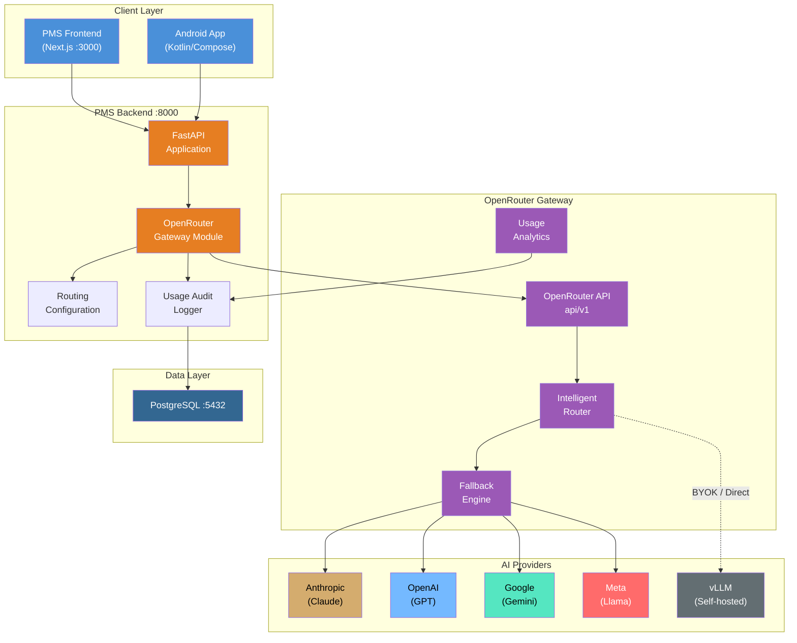

# Product Requirements Document: OpenRouter Integration into Patient Management System (PMS)

**Document ID:** PRD-PMS-OPENROUTER-001
**Version:** 1.0
**Date:** March 12, 2026
**Author:** Ammar (CEO, MPS Inc.)
**Status:** Draft

---

## 1. Executive Summary

OpenRouter is a unified API gateway that provides access to 500+ AI models from 60+ providers (OpenAI, Anthropic, Google, Meta, Mistral, DeepSeek, and others) through a single OpenAI-compatible endpoint. Instead of managing separate API keys, SDKs, and billing relationships with each AI provider, OpenRouter normalizes all model interactions into a single interface with intelligent routing, automatic provider fallback, and cost optimization.

The PMS currently relies on direct API integrations with individual AI providers — Claude for clinical reasoning, GPT models for document analysis, and potentially vLLM for on-premise inference (Exp 52). Each integration requires its own API key management, error handling, fallback logic, and billing reconciliation. As the PMS adds more AI-powered features (ambient documentation, prescription analysis, insurance verification, clinical decision support), the complexity of managing multiple provider relationships grows linearly.

By integrating OpenRouter as the PMS AI gateway, the system gains: (1) a single API endpoint for all LLM interactions, (2) automatic failover when a provider experiences downtime (e.g., the March 11 Claude outage), (3) cost-optimized routing that selects the cheapest provider meeting quality thresholds, (4) model comparison and A/B testing through a unified interface, and (5) centralized usage analytics and cost tracking across all AI features. OpenRouter's BYOK (Bring Your Own Key) mode allows the PMS to use existing provider API keys while still benefiting from routing and analytics, with the first 1M BYOK requests per month free.

## 2. Problem Statement

The PMS faces several operational bottlenecks related to AI provider management:

- **Single-provider dependency**: When Claude experienced a 2-hour outage on March 11, 2026, all PMS AI features dependent on Claude were unavailable. There was no automatic failover to an equivalent model.
- **Cost opacity**: AI costs are spread across 3+ provider billing dashboards. There is no unified view of per-feature, per-patient, or per-encounter AI spending.
- **Vendor lock-in risk**: PMS AI features are tightly coupled to specific provider SDKs. Switching from Claude to GPT-5.4 for a specific feature requires code changes, not configuration changes.
- **Model evaluation friction**: Comparing model quality for a clinical task (e.g., prescription analysis accuracy) requires building separate integrations for each candidate model.
- **No intelligent routing**: The PMS cannot dynamically route requests based on cost, latency, or model availability. Every request goes to a hardcoded provider.
- **Inconsistent error handling**: Each AI integration implements its own retry logic, timeout handling, and fallback behavior, leading to inconsistent user experience.

## 3. Proposed Solution

### 3.1 Architecture Overview

### 3.2 Deployment Model

- **SaaS gateway**: OpenRouter is a cloud-hosted SaaS service. No self-hosted infrastructure required. The PMS backend sends requests to `https://openrouter.ai/api/v1`.
- **BYOK mode**: The PMS uses its existing Anthropic, OpenAI, and Google API keys through OpenRouter's BYOK feature. First 1M requests/month free; 5% fee thereafter. This preserves existing provider BAA relationships.
- **HIPAA considerations**: OpenRouter itself does not offer a BAA. For HIPAA-compliant PHI processing, the PMS must:
  - Use BYOK mode with providers that have BAAs (Anthropic, OpenAI, Google)
  - Enable Zero Data Retention (ZDR) on all requests containing PHI
  - Route PHI-containing requests only to HIPAA-eligible providers
  - Maintain a separate direct integration path for highest-sensitivity PHI operations
- **Docker integration**: The OpenRouter gateway module runs within the existing FastAPI Docker container. No additional containers.
- **Hybrid routing**: For self-hosted models (vLLM, Exp 52), the gateway module routes directly without going through OpenRouter, maintaining a unified interface regardless of whether the model is cloud or on-premise.

## 4. PMS Data Sources

The OpenRouter gateway sits between PMS AI features and model providers. It does not directly access PMS data stores — instead, it processes prompts generated by PMS services:

- **Patient Records API (`/api/patients`)**: AI features that summarize patient histories, generate care plans, or analyze demographics send prompts through the gateway. The gateway routes to the optimal model based on task complexity and cost.
- **Encounter Records API (`/api/encounters`)**: Clinical note generation, ambient documentation, and encounter summarization prompts flow through the gateway. These require high-quality models (Claude/GPT) with fallback.
- **Medication & Prescription API (`/api/prescriptions`)**: Drug interaction checking, prescription analysis, and formulary lookup prompts. These require fast, accurate responses — gateway optimizes for latency.
- **Reporting API (`/api/reports`)**: Batch report generation (daily summaries, quality metrics) uses the gateway to route to the cheapest model meeting accuracy requirements.

A new **AI Gateway API (`/api/ai`)** will be created to centralize all LLM interactions:
- `/api/ai/complete` — Single completion request with routing preferences
- `/api/ai/models` — List available models with capabilities and pricing
- `/api/ai/usage` — Usage analytics and cost breakdown by feature/model
- `/api/ai/config` — Routing configuration management (admin-only)

## 5. Component/Module Definitions

### 5.1 OpenRouter Gateway Module

- **Description**: Central module that wraps all LLM API calls. Uses the OpenAI Python SDK with OpenRouter's base URL. Manages API keys, routing preferences, and request metadata.
- **Input**: Prompt text, model preference (or "auto"), routing strategy (cost/latency/quality), PHI flag.
- **Output**: Model completion response, usage metadata (tokens, cost, provider, latency).
- **PMS APIs**: `/api/ai/complete`.

### 5.2 Routing Configuration Manager

- **Description**: Stores and manages per-feature routing rules. Defines which models are eligible for each PMS AI feature, fallback order, cost ceilings, and latency requirements.
- **Input**: Feature name, routing rule definitions.
- **Output**: Routing configuration applied to gateway requests.
- **PMS APIs**: `/api/ai/config`.

### 5.3 Model Fallback Engine

- **Description**: Implements automatic failover when a provider is unavailable. Maintains a health status cache for each provider. On failure, retries with the next provider in the fallback chain.
- **Input**: Failed request, fallback model list.
- **Output**: Successful response from fallback provider or error after all fallbacks exhausted.
- **PMS APIs**: Internal — transparent to callers.

### 5.4 Usage Analytics Collector

- **Description**: Captures per-request metadata (model, provider, tokens, cost, latency, feature, patient context) and stores in PostgreSQL. Powers cost dashboards and budget alerts.
- **Input**: Request/response metadata from OpenRouter.
- **Output**: Usage records in PostgreSQL, aggregated analytics via `/api/ai/usage`.
- **PMS APIs**: `/api/ai/usage`, `/api/reports`.

### 5.5 PHI Router

- **Description**: Intercepts requests flagged as containing PHI and enforces HIPAA-compliant routing rules: BYOK mode only, ZDR enabled, HIPAA-eligible providers only, audit logging.
- **Input**: Request with `phi=True` flag.
- **Output**: Request routed only to HIPAA-eligible providers with ZDR.
- **PMS APIs**: Internal — enforced by gateway module.

### 5.6 Model Comparison Engine

- **Description**: Sends the same prompt to multiple models simultaneously (shadow mode) for quality comparison. Stores results for A/B evaluation without impacting user experience.
- **Input**: Prompt + list of models to compare.
- **Output**: Comparison results with quality scores, latency, and cost for each model.
- **PMS APIs**: `/api/ai/compare` (admin-only).

## 6. Non-Functional Requirements

### 6.1 Security and HIPAA Compliance

- **BYOK for PHI**: All requests containing PHI use BYOK mode with provider API keys that have active BAAs (Anthropic, OpenAI, Google). OpenRouter's own API key is used only for non-PHI requests.
- **Zero Data Retention**: All PHI-containing requests include `zdr: true` in the provider preferences, ensuring prompts are not logged by the provider.
- **Provider filtering**: PHI requests are restricted to HIPAA-eligible providers via the `allow` list in provider preferences.
- **Audit logging**: Every LLM request is logged in PostgreSQL with: timestamp, feature, model, provider, token count, cost, latency, PHI flag, user ID. No prompt content is logged.
- **API key management**: OpenRouter API key and provider BYOK keys stored in environment variables or AWS Secrets Manager. Rotated quarterly.
- **TLS encryption**: All communication with OpenRouter uses TLS 1.2+.
- **Direct fallback for PHI**: If OpenRouter is unavailable, PHI-critical features fall back to direct provider API calls, bypassing the gateway entirely.

### 6.2 Performance

| Metric | Target |
|--------|--------|
| Gateway overhead latency | < 30ms (OpenRouter advertises ~15ms) |
| Model fallback switch time | < 2 seconds |
| Request timeout | 30 seconds (streaming), 60 seconds (batch) |
| Daily request capacity | 10,000+ requests |
| Cost tracking accuracy | 100% of requests captured |
| Uptime (with fallback) | 99.9% effective availability |

### 6.3 Infrastructure

- **No additional infrastructure**: OpenRouter is SaaS. Gateway module runs within existing FastAPI container.
- **Database**: 1-2 new PostgreSQL tables (ai_usage_logs, ai_routing_config).
- **Cost estimate**: BYOK mode — first 1M requests/month free, then 5% of provider cost. At ~300 requests/day × 30 days = 9,000 requests/month — well within free tier.
- **Dependencies**: `openai` Python SDK (already likely installed), `httpx` for direct provider fallback.

## 7. Implementation Phases

### Phase 1: Foundation (Sprints 1-2, 4 weeks)

- Set up OpenRouter account and API key
- Implement Gateway Module with OpenAI SDK + OpenRouter base URL
- Configure BYOK keys for Anthropic, OpenAI, Google
- Create PostgreSQL schema for usage logs
- Implement basic routing (single model, manual selection)
- Build `/api/ai/complete` endpoint
- Enable ZDR and PHI routing rules
- Unit and integration tests

### Phase 2: Intelligent Routing & Analytics (Sprints 3-4, 4 weeks)

- Implement Routing Configuration Manager with per-feature rules
- Build Model Fallback Engine with automatic provider failover
- Create Usage Analytics Collector with cost dashboards
- Implement provider health monitoring
- Build `/api/ai/usage` and `/api/ai/config` endpoints
- Add streaming support for real-time AI responses
- Migrate existing direct AI integrations to gateway module

### Phase 3: Optimization & Comparison (Sprints 5-6, 4 weeks)

- Build Model Comparison Engine for A/B testing
- Implement cost-optimized routing (cheapest model meeting quality threshold)
- Add latency-optimized routing for real-time features
- Build budget alerting and spending caps
- Integrate with n8n (Exp 34) for automated model evaluation workflows
- Create operational dashboard in Next.js frontend
- Performance tuning and edge case handling

## 8. Success Metrics

| Metric | Target | Measurement Method |
|--------|--------|--------------------|
| AI feature availability (with fallback) | > 99.9% | Uptime monitoring across all AI features |
| Cost reduction via optimized routing | > 15% | Before/after cost comparison on same workload |
| Mean time to model switch | < 2 seconds | Fallback engine latency metrics |
| Provider API key count (managed centrally) | 1 (OpenRouter) + BYOK | Credential inventory |
| Time to evaluate new model | < 1 hour | Model comparison engine usage |
| Cost attribution accuracy | 100% per-feature | Usage analytics vs provider billing reconciliation |
| Developer integration time for new AI feature | < 30 minutes | Time from feature spec to working AI call |

## 9. Risks and Mitigations

| Risk | Impact | Mitigation |
|------|--------|------------|
| OpenRouter outage blocks all AI features | Complete AI feature downtime | Direct provider fallback path bypasses OpenRouter entirely. Gateway module implements circuit breaker. |
| PHI passes through OpenRouter infrastructure | HIPAA violation risk | BYOK mode + ZDR enforced for PHI. Provider routing restricted to HIPAA-eligible providers. Direct fallback for highest-sensitivity operations. |
| OpenRouter adds latency to real-time features | Poor user experience for ambient documentation | OpenRouter adds ~15ms. Monitor and switch to direct calls if latency exceeds threshold. |
| Cost markup (5% on BYOK after free tier) erodes savings | Increased AI spending | First 1M BYOK requests/month free. At PMS scale (~9K requests/month), well within free tier. Monitor growth. |
| OpenRouter discontinues BYOK pricing or changes terms | Budget and architecture disruption | Maintain direct provider integration as fallback. Gateway module abstracts the routing — switching from OpenRouter to LiteLLM or direct calls is a config change, not a code change. |
| Model routing sends wrong model for clinical task | Incorrect clinical output | Per-feature routing configuration locks clinical features to validated models. No "auto" routing for clinical tasks. |
| OpenRouter has limited governance/observability | Cannot meet enterprise audit requirements | Supplement with PMS-side usage logging in PostgreSQL. Evaluate Portkey if governance needs grow. |

## 10. Dependencies

- **OpenRouter API**: SaaS service — account, API key, BYOK configuration
- **OpenAI Python SDK**: `openai>=1.0.0` — used as client library with OpenRouter base URL
- **Anthropic API Key**: Existing key, used via BYOK for Claude models
- **OpenAI API Key**: Existing key, used via BYOK for GPT models
- **Google AI API Key**: For Gemini models via BYOK
- **PostgreSQL**: Existing PMS database for usage logs and routing configuration
- **PMS Backend (FastAPI)**: Host for gateway module and API endpoints
- **PMS Frontend (Next.js)**: Host for usage dashboard and model comparison UI

## 11. Comparison with Existing Experiments

### vs. Experiment 52: vLLM (Self-Hosted Model Inference)

| Aspect | OpenRouter (Exp 82) | vLLM (Exp 52) |
|--------|---------------------|---------------|
| **Deployment** | SaaS — no infrastructure | Self-hosted — GPU hardware required |
| **Models** | 500+ cloud models | Any Hugging Face model |
| **Latency** | Network round-trip + ~15ms | Local — no network overhead |
| **Cost model** | Per-token (provider pricing + 5%) | Fixed infrastructure cost |
| **HIPAA** | BYOK + ZDR (data passes through OpenRouter) | Full control — data never leaves premises |
| **Use case** | Cloud AI gateway, fallback, cost optimization | On-premise inference for highest-sensitivity PHI |

**Complementary**: OpenRouter serves as the cloud gateway for production AI features, while vLLM handles on-premise inference for highest-sensitivity PHI or offline scenarios. The PMS gateway module routes to either transparently.

### vs. Experiment 09: MCP (Model Context Protocol)

MCP defines how AI models access tools and data sources. OpenRouter defines how the PMS routes requests to AI models. They are complementary layers — MCP provides the tool protocol, OpenRouter provides the model routing.

### vs. Experiment 78: Paperclip (Agent Orchestration)

Paperclip orchestrates multi-agent workflows. When Paperclip agents need to call an LLM, they route through the OpenRouter gateway module, which selects the optimal model. OpenRouter is the "engine" that Paperclip agents use for inference.

## 12. Research Sources

### Official Documentation
- [OpenRouter Documentation](https://openrouter.ai/docs/quickstart) — Quickstart, API reference, and integration guides
- [OpenRouter Provider Routing](https://openrouter.ai/docs/guides/routing/provider-selection) — Intelligent routing, fallback, and provider preferences
- [OpenRouter BYOK](https://openrouter.ai/docs/guides/overview/auth/byok) — Bring Your Own Key configuration and pricing
- [OpenRouter Models](https://openrouter.ai/docs/guides/overview/models) — 500+ models catalog with capabilities and pricing

### Architecture & Integration
- [OpenRouter Python Guide (Real Python)](https://realpython.com/openrouter-api/) — Python SDK integration with practical examples
- [OpenRouter Practical Guide (Medium)](https://medium.com/@milesk_33/a-practical-guide-to-openrouter-unified-llm-apis-model-routing-and-real-world-use-d3c4c07ed170) — Model routing strategies and real-world patterns
- [OpenRouter Python Tutorial (Snyk)](https://snyk.io/articles/openrouter-in-python-use-any-llm-with-one-api-key/) — Security-focused Python integration

### Security & Compliance
- [OpenRouter Privacy Policy](https://openrouter.ai/privacy) — Data handling and retention policies
- [OpenRouter Logging & Data Retention](https://openrouter.ai/docs/guides/privacy/logging) — Provider data retention policies
- [Private OpenRouter Alternatives (Prem AI)](https://blog.premai.io/seven-private-openrouter-alternatives-for-teams-that-need-data-control/) — Data control and HIPAA considerations

### Ecosystem & Comparison
- [OpenRouter Pricing](https://openrouter.ai/pricing) — Per-token pricing breakdown and fee structure
- [AI Gateway Comparison (Portkey)](https://portkey.ai/buyers-guide/ai-gateway-solutions) — OpenRouter vs LiteLLM vs Portkey comparison

## 13. Appendix: Related Documents

- [OpenRouter Setup Guide](82-OpenRouter-PMS-Developer-Setup-Guide.md) — Step-by-step environment configuration and gateway integration
- [OpenRouter Developer Tutorial](82-OpenRouter-Developer-Tutorial.md) — Hands-on tutorial building a multi-model AI gateway for PMS
- [PRD: vLLM PMS Integration](52-PRD-vLLM-PMS-Integration.md) — On-premise model inference (complementary)
- [PRD: MCP PMS Integration](09-PRD-MCP-PMS-Integration.md) — Model Context Protocol for tool integration
- [PRD: Paperclip PMS Integration](78-PRD-Paperclip-PMS-Integration.md) — Agent orchestration using gateway for inference
- [OpenRouter Official Site](https://openrouter.ai/)
