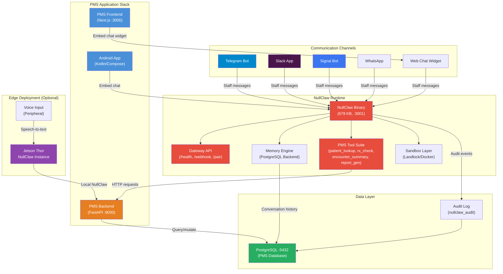

# Product Requirements Document: NullClaw Integration into Patient Management System (PMS)

**Document ID:** PRD-PMS-NULLCLAW-001
**Version:** 1.0
**Date:** March 12, 2026
**Author:** Ammar (CEO, MPS Inc.)
**Status:** Draft

---

## 1. Executive Summary

NullClaw is the smallest fully autonomous AI assistant infrastructure — a 678 KB static Zig binary that boots in under 2 milliseconds, consumes approximately 1 MB of RAM, and runs on any hardware with a CPU and libc. It provides a complete AI assistant runtime with 50+ LLM providers, 19 communication channels (Telegram, Discord, Signal, Slack, WhatsApp, iMessage, web, and more), 35+ built-in tools, 10 memory engines, multi-layer sandboxing, and a pluggable gateway API. Its vtable-driven architecture means every subsystem — providers, channels, tools, memory, tunnels, peripherals — can be swapped without modifying core orchestration.

Integrating NullClaw into the PMS creates an autonomous AI assistant layer that clinical and administrative staff can interact with through their preferred communication channels. Staff can query patient records, retrieve encounter summaries, check prescription statuses, and generate reports by sending natural language messages via Telegram, Slack, the PMS web interface, or even the Android app's embedded chat. NullClaw's gateway API serves as the bridge: the PMS backend registers webhook endpoints that NullClaw calls when staff ask clinical questions, and NullClaw formats and delivers responses back through whichever channel the staff member is using.

The value proposition is threefold: (1) **Omnichannel clinical access** — staff get PMS data wherever they are, without logging into the web portal; (2) **Edge deployment capability** — NullClaw's sub-1 MB footprint means it can run on Jetson Thor edge devices alongside the existing vision inference pipeline, enabling voice-and-chat AI at the point of care; (3) **Autonomous task execution** — with configurable autonomy levels and sandbox isolation, NullClaw can execute routine tasks (appointment reminders, prescription refill checks, report generation) on a schedule or in response to staff commands, reducing manual workload.

## 2. Problem Statement

PMS clinical staff currently interact with the system exclusively through the Next.js web portal or the Android mobile app. This creates several operational bottlenecks:

- **Context switching**: Nurses and physicians must stop their current workflow, open the PMS application, navigate to the correct screen, and manually look up patient information. During rounds or in procedure rooms, this disrupts clinical flow and introduces delays.
- **Limited accessibility**: Staff who are away from a workstation or don't have the Android app installed cannot access PMS data. There is no way to query the system from Telegram, Slack, or other messaging platforms already used for team coordination.
- **No proactive notifications**: The PMS does not push clinical alerts (overdue medications, pending lab results, expiring authorizations) to staff through their preferred communication channels. Staff must remember to check dashboards manually.
- **Edge device underutilization**: The Jetson Thor edge deployment (ADR-0007) currently handles only vision inference. There is no lightweight AI assistant running on edge hardware that could provide voice or chat-based clinical assistance at the point of care.
- **Manual routine tasks**: Tasks like generating daily patient summaries, checking medication interaction alerts, and compiling shift handoff reports require staff to manually pull data from multiple PMS screens and assemble it themselves.

The PMS needs an ultra-lightweight, multi-channel AI assistant that can serve as a natural language interface to clinical data, run on any hardware from cloud servers to edge devices, and execute routine clinical tasks autonomously within configurable safety boundaries.

## 3. Proposed Solution

### 3.1 Architecture Overview

### 3.2 Deployment Model

**Primary: Docker-based self-hosted deployment**

NullClaw runs as a single static binary inside a minimal Docker container (`FROM scratch` or Alpine-based). The deployment model:

- **Cloud/server**: NullClaw container runs alongside the PMS backend in the existing `docker-compose.yml` stack. It binds to `127.0.0.1:3001` (avoiding conflict with Next.js on :3000) and communicates with the FastAPI backend over the Docker network.
- **Edge (Jetson Thor)**: A separate NullClaw instance runs directly on the Jetson hardware. At 678 KB and ~1 MB RAM, it consumes negligible resources alongside the vision inference pipeline.
- **Tunnel exposure**: For channels that require webhook delivery (Telegram, Slack, WhatsApp), NullClaw uses its built-in Cloudflare/Tailscale/ngrok tunnel support to receive inbound messages without exposing the gateway publicly.

**HIPAA security envelope:**
- Gateway bound to loopback by default; external access only through authenticated tunnels
- Pairing-based authentication (one-time 6-digit code → bearer token)
- ChaCha20-Poly1305 encryption for stored credentials and secrets
- Sandbox isolation (Landlock/Firejail/Bubblewrap/Docker) for all tool executions
- Workspace-scoped filesystem access — NullClaw cannot read outside its designated directory
- Configurable autonomy levels: `supervised` mode requires staff confirmation for write operations
- Audit logging with configurable retention (minimum 6 years for HIPAA)
- All PMS API calls authenticated with service-level API keys, scoped to read-only by default

## 4. PMS Data Sources

NullClaw's custom PMS tools interact with the following existing APIs:

| API Endpoint | Usage | Access Level |
|---|---|---|
| `/api/patients` | Look up patient demographics, allergies, and insurance by name, MRN, or DOB. Staff ask "pull up patient John Doe" and NullClaw queries this endpoint. | Read-only |
| `/api/encounters` | Retrieve encounter history, visit notes, and diagnoses. Staff ask "show me today's encounters for Dr. Smith" and NullClaw lists active encounters. | Read-only |
| `/api/prescriptions` | Check active medications, refill status, and interaction alerts. Staff ask "any drug interactions for patient 12345?" and NullClaw queries the prescriptions API. | Read-only |
| `/api/reports` | Generate and retrieve clinical reports — daily census, pending labs, overdue follow-ups. NullClaw can trigger report generation and deliver the formatted result through the staff's channel. | Read-only (generation triggers allowed) |
| `/api/appointments` | Query upcoming appointments, availability, and scheduling conflicts. Staff ask "what's on the schedule for Room 3 this afternoon?" | Read-only |

**Write operations** (appointment creation, prescription updates) are gated behind `autonomy.level = "supervised"` — NullClaw presents the proposed action and waits for explicit staff confirmation before executing.

## 5. Component/Module Definitions

### 5.1 PMS Tool Suite

Custom NullClaw tools registered via the vtable `Tool` interface:

| Tool Name | Description | Input | Output | PMS API |
|---|---|---|---|---|
| `patient_lookup` | Search for patients by name, MRN, or DOB | `{"query": "John Doe"}` or `{"mrn": "12345"}` | Patient demographics, allergies, insurance | `/api/patients` |
| `encounter_summary` | Get encounter details or daily encounter list | `{"patient_id": 123}` or `{"provider": "Dr. Smith", "date": "today"}` | Encounter notes, diagnoses, vitals | `/api/encounters` |
| `rx_check` | Check medications and drug interactions | `{"patient_id": 123}` or `{"medications": ["aspirin", "warfarin"]}` | Active Rx list, interaction warnings | `/api/prescriptions` |
| `report_gen` | Generate or retrieve clinical reports | `{"type": "daily_census"}` or `{"type": "pending_labs"}` | Formatted report content | `/api/reports` |
| `schedule_query` | Query appointments and availability | `{"provider": "Dr. Smith", "date": "2026-03-12"}` | Appointment list, open slots | `/api/appointments` |

### 5.2 NullClaw Gateway Adapter

A FastAPI middleware module in the PMS backend that:
- Registers PMS-specific webhook endpoints with NullClaw's gateway
- Authenticates NullClaw requests using the pairing-derived bearer token
- Translates NullClaw tool calls into PMS API requests
- Returns structured responses that NullClaw formats for the target channel

### 5.3 Web Chat Widget

A React component embedded in the Next.js frontend that connects to NullClaw's gateway:
- WebSocket connection to NullClaw for real-time chat
- Staff authentication passed through from the PMS session
- Renders NullClaw responses with PMS-styled formatting (patient cards, encounter summaries)

### 5.4 Android Chat Module

A Kotlin/Compose module in the Android app that:
- Connects to NullClaw's gateway via HTTP/WebSocket
- Provides a chat interface within the mobile app
- Supports voice input via Android's speech-to-text, forwarded as text to NullClaw

### 5.5 Audit Logger

An observer implementation (NullClaw `Observer` vtable) that:
- Logs every tool invocation, channel message, and autonomy decision to PostgreSQL
- Records: timestamp, staff ID, channel, tool name, input (PHI-redacted), output summary, approval status
- Supports HIPAA-compliant retention policies (minimum 6 years)

## 6. Non-Functional Requirements

### 6.1 Security and HIPAA Compliance

| Requirement | Implementation |
|---|---|
| **Authentication** | Pairing-based gateway auth + PMS service API key for backend calls |
| **Authorization** | Role-based tool access: nurses get read-only patient/encounter tools; physicians get full tool suite; admins get report generation |
| **Encryption in transit** | TLS for all gateway ↔ PMS communication; tunnel encryption for external channels |
| **Encryption at rest** | ChaCha20-Poly1305 for NullClaw secrets; AES-256 for PostgreSQL (existing PMS encryption) |
| **PHI isolation** | NullClaw memory engine stores conversation context WITHOUT raw PHI — only references (patient IDs, encounter IDs) that resolve through authenticated API calls |
| **Audit trail** | Every query and tool execution logged with staff identity, timestamp, and action summary |
| **Sandbox isolation** | All tool executions run in Landlock/Docker sandbox; filesystem access limited to NullClaw workspace |
| **Session management** | Bearer tokens expire after configurable TTL; re-pairing required after expiry |
| **Minimum necessary** | Tools return only the data fields requested, not full patient records |

### 6.2 Performance

| Metric | Target |
|---|---|
| NullClaw startup time | < 10 ms (including tool registration) |
| Gateway response latency (health check) | < 5 ms |
| End-to-end query latency (staff message → response) | < 3 seconds (excluding LLM inference) |
| LLM inference latency | Provider-dependent; < 5 seconds for most queries |
| Concurrent channel connections | 19 channels simultaneously |
| Memory usage | < 5 MB (NullClaw + PMS tools + conversation cache) |
| Binary size | 678 KB (NullClaw) + ~50 KB (PMS tool definitions) |

### 6.3 Infrastructure

| Component | Requirement |
|---|---|
| NullClaw binary | Single static binary, no runtime dependencies beyond libc |
| Docker container | `FROM scratch` or Alpine-based; < 5 MB total image |
| PostgreSQL | Existing PMS database; additional tables for audit log and conversation memory |
| Network | NullClaw on :3001; PMS backend on :8000; frontend on :3000 |
| Tunnel (optional) | Cloudflare/Tailscale/ngrok for external channel webhooks |
| Zig toolchain | Zig 0.15.2 for building from source (optional; pre-built binary available via Homebrew) |

## 7. Implementation Phases

### Phase 1: Foundation (Sprints 1-2)

- Install NullClaw via Homebrew or build from source
- Configure NullClaw with a single LLM provider (OpenRouter for multi-model access)
- Set up PostgreSQL memory backend for conversation persistence
- Implement `patient_lookup` and `encounter_summary` PMS tools
- Deploy NullClaw in Docker alongside PMS backend
- Configure pairing authentication and audit logging
- Enable CLI channel for internal testing

### Phase 2: Core Multi-Channel Integration (Sprints 3-4)

- Implement remaining PMS tools (`rx_check`, `report_gen`, `schedule_query`)
- Configure Telegram and Slack channels for staff communication
- Build the Next.js web chat widget component
- Implement the FastAPI gateway adapter middleware
- Set up role-based tool access (nurse vs physician vs admin)
- Configure sandbox isolation and autonomy levels
- Deploy Cloudflare tunnel for external webhook delivery

### Phase 3: Advanced Features & Edge Deployment (Sprints 5-6)

- Build Android chat module with voice input support
- Deploy NullClaw instance on Jetson Thor edge hardware
- Implement scheduled autonomous tasks (daily census, medication reminders)
- Add Signal and WhatsApp channels
- Build conversation analytics dashboard in Next.js frontend
- Implement multi-provider failover (primary + fallback LLM providers)
- Performance tuning and load testing across all channels

## 8. Success Metrics

| Metric | Target | Measurement Method |
|---|---|---|
| Staff adoption rate | > 60% of clinical staff using at least one channel within 3 months | Unique staff IDs in audit log |
| Average query response time | < 5 seconds end-to-end | Gateway response time logs |
| Daily queries handled | > 200 queries/day within 2 months | Audit log count |
| Manual lookup reduction | 40% fewer PMS web portal lookups for simple queries | Web analytics comparison |
| Staff satisfaction | > 4.0/5.0 on usability survey | Quarterly survey |
| System uptime | 99.5% availability | Health check monitoring |
| HIPAA audit compliance | Zero PHI exposure incidents | Quarterly security audit |

## 9. Risks and Mitigations

| Risk | Impact | Mitigation |
|---|---|---|
| LLM hallucination in clinical context | High — incorrect patient data could impact clinical decisions | All data sourced from PMS APIs, not generated; NullClaw formats API responses, doesn't fabricate data. Supervised autonomy mode for write operations. |
| PHI leakage through channel messages | High — HIPAA violation | PHI-reference-only memory (store IDs, not raw data); channel-specific message sanitization; audit logging of all outbound messages |
| NullClaw binary supply chain risk | Medium — compromised binary could access PMS data | Build from source with verified Zig toolchain; sandbox isolation limits blast radius; network-scoped API access only |
| Channel account compromise | Medium — attacker sends queries through hijacked Telegram/Slack | Pairing authentication; channel allowlists (`allow_from` config); rate limiting; anomaly detection in audit logs |
| LLM provider outage | Medium — assistant becomes unavailable | Multi-provider failover configuration (primary: OpenRouter, fallback: Ollama local) |
| Zig ecosystem immaturity | Low — Zig is pre-1.0 | NullClaw is a compiled binary; PMS integration code is Python/TypeScript; Zig dependency is build-time only |
| Staff resistance to AI assistant | Medium — low adoption | Phased rollout starting with most-requested use case (patient lookup); opt-in channels; training sessions |

## 10. Dependencies

| Dependency | Type | Version | License |
|---|---|---|---|
| NullClaw | Core runtime | v2026.3.12 | MIT |
| Zig | Build toolchain (optional) | 0.15.2 | MIT |
| OpenRouter / LLM provider | AI inference | Current | Per-provider |
| PostgreSQL | Memory backend + audit store | 15+ (existing) | PostgreSQL License |
| Cloudflare Tunnel / Tailscale | External channel access | Current | Per-provider |
| PMS Backend API | Data source | Current | Internal |
| Docker | Container deployment | 24+ (existing) | Apache 2.0 |

## 11. Comparison with Existing Experiments

### vs. Experiment 05 — OpenClaw (TypeScript AI Assistant)

NullClaw and OpenClaw solve a similar problem — providing an AI assistant runtime — but with fundamentally different trade-offs:

| Dimension | OpenClaw (Exp 05) | NullClaw (Exp 83) |
|---|---|---|
| Language | TypeScript | Zig |
| Binary size | ~28 MB (dist) | 678 KB |
| RAM usage | > 1 GB | ~1 MB |
| Startup time | > 500 seconds (0.8 GHz) | < 8 ms (0.8 GHz) |
| Edge deployment | Not feasible | Native fit |
| Provider support | Limited | 50+ providers |
| Channel support | Fewer | 19 channels |
| Ecosystem maturity | Larger JS ecosystem | Zig is pre-1.0 |

**Complementary use**: OpenClaw may be preferred for cloud-heavy deployments where Node.js ecosystem integration matters. NullClaw is the clear choice for edge deployment (Jetson Thor), resource-constrained environments, and scenarios requiring instant startup and minimal footprint. Both can coexist — OpenClaw for cloud, NullClaw for edge.

### vs. Experiment 76 — Redis (Caching Layer)

Redis (Experiment 76) provides a caching and pub/sub layer for PMS. NullClaw's memory engine can optionally use Redis as a backend, making these experiments complementary. NullClaw's conversation cache could be backed by Redis for high-throughput multi-channel deployments, while Redis continues to serve its primary role as the PMS application cache.

## 12. Research Sources

### Official Documentation
- [NullClaw GitHub Repository](https://github.com/nullclaw/nullclaw) — Source code, README, benchmarks, and build instructions
- [NullClaw Official Website](https://nullclaw.io) — Project overview and quick-start landing page
- [NullClaw Architecture Docs](https://github.com/nullclaw/nullclaw/blob/main/docs/en/architecture.md) — Vtable-driven design, subsystem interfaces, extension points
- [NullClaw Security Docs](https://github.com/nullclaw/nullclaw/blob/main/docs/en/security.md) — Sandbox isolation, pairing auth, encryption, audit logging

### Architecture & Integration
- [NullClaw Gateway API](https://github.com/nullclaw/nullclaw/blob/main/docs/en/gateway-api.md) — HTTP endpoints, webhook integration, pairing flow
- [NullClaw Configuration Guide](https://github.com/nullclaw/nullclaw/blob/main/docs/en/configuration.md) — Provider, channel, tool, and security configuration

### Ecosystem & Adoption
- [NullClaw Releases](https://github.com/nullclaw/nullclaw/releases) — Version history, latest release v2026.3.12
- [NullClaw GitHub Organization](https://github.com/nullclaw) — Ecosystem projects and community

## 13. Appendix: Related Documents

- [NullClaw Setup Guide](83-NullClaw-PMS-Developer-Setup-Guide.md) — Step-by-step installation and PMS integration setup
- [NullClaw Developer Tutorial](83-NullClaw-Developer-Tutorial.md) — Hands-on onboarding: build a patient lookup assistant end-to-end
- [NullClaw Official Docs (English)](https://github.com/nullclaw/nullclaw/blob/main/docs/en/README.md) — Full documentation index
- [ADR-0007: Jetson Thor Edge Deployment](../architecture/0007-jetson-thor-edge-deployment.md) — Edge deployment architecture that NullClaw extends
- [Experiment 05: OpenClaw](05-PRD-OpenClaw-PMS-Integration.md) — Alternative AI assistant runtime (TypeScript-based)
- [Experiment 76: Redis](76-PRD-Redis-PMS-Integration.md) — Caching layer that can serve as NullClaw memory backend
