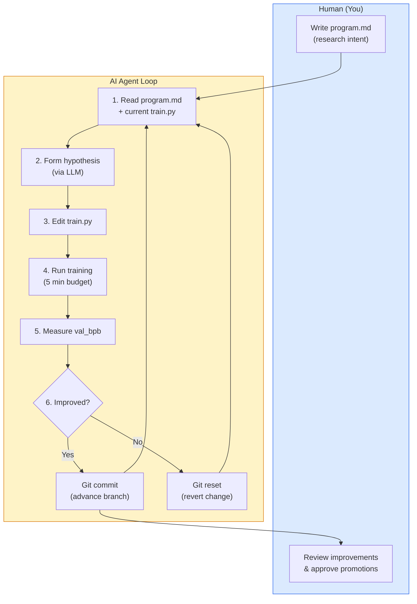
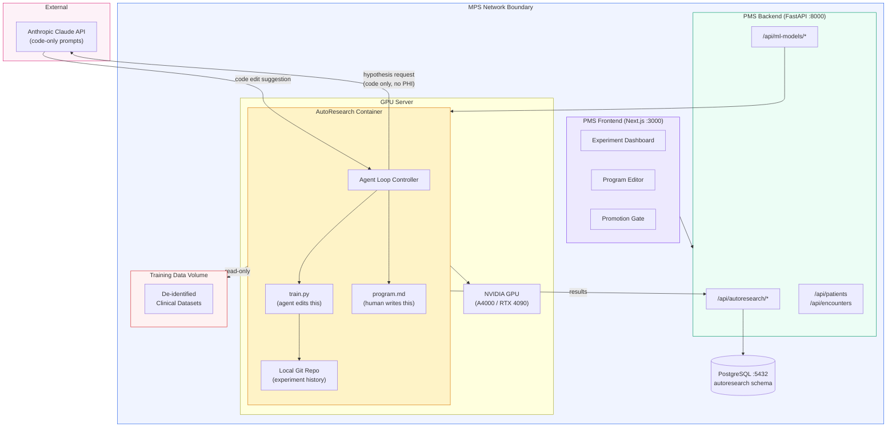

# AutoResearch Developer Onboarding Tutorial

**Welcome to the MPS PMS AutoResearch Integration Team**

This tutorial will take you from zero to building your first AutoResearch integration with the PMS. By the end, you will understand how AutoResearch works, have a running local environment, and have built and tested a custom model optimization pipeline end-to-end.

**Document ID:** PMS-EXP-AUTORESEARCH-002
**Version:** 1.0
**Date:** March 12, 2026
**Applies To:** PMS project (all platforms)
**Prerequisite:** [AutoResearch Setup Guide](84-AutoResearch-PMS-Developer-Setup-Guide.md)
**Estimated time:** 2-3 hours
**Difficulty:** Beginner-friendly

---

## What You Will Learn

1. What problem AutoResearch solves for PMS clinical model optimization
2. How the agent loop works: hypothesis, code edit, train, measure, keep or discard
3. The role of `program.md` (human intent) vs `train.py` (agent workspace)
4. How to write effective research programs for clinical model optimization
5. How to monitor experiments through the PMS dashboard
6. How to interpret val_bpb metrics and identify genuine improvements
7. How to use the Model Promotion Gate for safe deployment
8. How to debug common agent loop failures
9. HIPAA considerations for autonomous model training
10. How AutoResearch complements existing PMS AI infrastructure

---

## Part 1: Understanding AutoResearch (15 min read)

### 1.1 What Problem Does AutoResearch Solve?

MPS deploys several ML models in clinical workflows:

- **Dermatology CDS** (Experiment 18): Skin lesion classification for clinical decision support
- **MedASR** (Experiment 07): Medical speech recognition for encounter documentation
- **Future models**: Drug interaction prediction, lab result anomaly detection

Each model needs periodic optimization — better learning rates, architectures, augmentation strategies. Today, a data scientist manually runs 2-3 experiments per day, each requiring setup, monitoring, and assessment. This means:

- **GPU resources idle 16+ hours/day** (nights and weekends)
- **Weeks to explore** what could be searched in a single overnight session
- **Knowledge silos** — when the data scientist context-switches, optimization context is lost

AutoResearch solves this by giving an AI agent the training script and letting it run experiments autonomously. The agent forms hypotheses, modifies code, trains for 5 minutes, checks the result, and either keeps the improvement or reverts. Repeat ~100 times overnight.

**The human's job shifts from "run experiments" to "design the research program."**

### 1.2 How AutoResearch Works — The Key Pieces



**Three files, three roles:**

| File | Edited by | Purpose |
|---|---|---|
| `program.md` | Human | Research intent: goals, constraints, areas to explore |
| `train.py` | Agent | The actual training script — model, optimizer, data pipeline |
| `prepare.py` | Neither (locked) | Data preprocessing — fixed to ensure fair comparisons |

### 1.3 How AutoResearch Fits with Other PMS Technologies

| Technology | Experiment | What It Does | How It Relates to AutoResearch |
|---|---|---|---|
| ISIC Archive | Exp 18 | Dermatology image dataset & CDS model | AutoResearch optimizes this model's training |
| MedASR | Exp 07 | Medical speech recognition | AutoResearch optimizes transcription model accuracy |
| Adaptive Thinking | Exp 08 | AI reasoning patterns | Complementary: reasoning about model outputs, not training |
| OpenClaw | Exp 05 | Workflow automation agent | Complementary: executes clinical workflows using optimized models |
| Docker | Exp 39 | Container deployment | AutoResearch runs inside Docker with GPU passthrough |
| n8n | Exp 34 | Workflow automation | Can trigger AutoResearch runs on schedule |
| Gemma 3 | Exp 13 | On-device language model | Another candidate model for AutoResearch optimization |

### 1.4 Key Vocabulary

| Term | Meaning |
|---|---|
| **Agent loop** | The continuous cycle of hypothesis, edit, train, measure, keep or discard |
| **program.md** | Human-authored markdown file describing research goals and constraints for the agent |
| **train.py** | The single Python file the agent is allowed to modify — contains model, optimizer, and training loop |
| **val_bpb** | Validation bits per byte — the primary metric. Lower is better. Vocabulary-size-independent |
| **Time budget** | Fixed training duration per experiment (default: 5 minutes). Ensures fair comparison |
| **Advance** | When an experiment improves val_bpb, the agent keeps the git commit ("advances" the branch) |
| **Reset** | When an experiment doesn't improve, the agent reverts to the previous best code via `git reset` |
| **Feature branch** | Each AutoResearch run operates on `autoresearch/<tag>` branch — main is never modified |
| **Hypothesis** | The agent's reasoning for why a specific code change might improve the metric |
| **Model promotion** | The human-approved process of moving an optimized model from experiment to production |
| **Muon optimizer** | A momentum-based optimizer used alongside AdamW in the default AutoResearch training setup |
| **nanochat** | Karpathy's minimal LLM training framework that AutoResearch is built on |

### 1.5 Our Architecture



---

## Part 2: Environment Verification (15 min)

### 2.1 Checklist

Run each command and verify the expected output:

1. **Docker and GPU:**
   ```bash
   docker --version
   # Expected: Docker version 24.x or higher

   docker exec pms-autoresearch nvidia-smi --query-gpu=name --format=csv,noheader
   # Expected: Your GPU name (e.g., "NVIDIA RTX A4000")
   ```

2. **AutoResearch container:**
   ```bash
   docker ps --filter name=pms-autoresearch --format "{{.Status}}"
   # Expected: "Up X minutes" or similar
   ```

3. **PMS Backend:**
   ```bash
   curl -s http://localhost:8000/api/health
   # Expected: {"status": "ok"}
   ```

4. **Database schema:**
   ```bash
   psql -h localhost -U pms_user -d pms_db -c "\dt autoresearch.*"
   # Expected: 4 tables (programs, runs, experiments, promotions)
   ```

5. **Frontend:**
   ```bash
   curl -s -o /dev/null -w "%{http_code}" http://localhost:3000/autoresearch
   # Expected: 200
   ```

### 2.2 Quick Test

Verify the full pipeline with a single API call:

```bash
curl -s -X POST http://localhost:8000/api/autoresearch/programs \
  -H "Content-Type: application/json" \
  -d '{
    "name": "quicktest",
    "content": "# Quick Test\nOptimize learning rate only.",
    "model_target": "test-model"
  }' | python3 -m json.tool
```

Expected: a JSON response with `id` and `name` fields. If this works, your backend, database, and API layer are all connected.

---

## Part 3: Build Your First Integration (45 min)

### 3.1 What We Are Building

We will create a complete model optimization pipeline for the PMS dermatology CDS model:

1. Write a `program.md` tailored to skin lesion classification
2. Adapt `train.py` for the dermatology model architecture
3. Start an AutoResearch run via the API
4. Monitor progress through the dashboard
5. Review and promote an improvement

### 3.2 Write Your Research Program

Create a file called `derm-optimizer.md`:

```markdown
# Dermatology CDS Model Optimization

## Goal
Improve the skin lesion classification model's validation accuracy while
keeping the model small enough for mobile deployment (Android via TFLite).

## Constraints
- Model must have fewer than 25M parameters
- Output must remain 7-class classification (MEL, NV, BCC, AK, BKL, DF, VASC)
- Training must complete within the 5-minute time budget
- Do NOT remove dropout layers (prevents overfitting on small medical datasets)
- Do NOT change the input resolution (224x224)

## Areas to Explore
- Learning rate: try cosine annealing, warm restarts, and OneCycleLR
- Optimizer: compare AdamW, Lion, and Muon
- Architecture: experiment with depth (number of transformer blocks)
- Attention: try multi-head attention with different head counts (4, 8, 16)
- Regularization: label smoothing values between 0.05 and 0.2
- Data augmentation: MixUp, CutMix, and RandAugment in the training loop

## Assessment
Primary metric: val_bpb (lower is better)
Secondary: monitor training throughput (samples/sec) — reject if <50% of baseline
```

### 3.3 Upload the Program via API

```bash
PROGRAM_CONTENT=$(cat derm-optimizer.md)

PROGRAM_ID=$(curl -s -X POST http://localhost:8000/api/autoresearch/programs \
  -H "Content-Type: application/json" \
  -d "{
    \"name\": \"derm-cds-optimizer\",
    \"content\": $(python3 -c "import json; print(json.dumps(open('derm-optimizer.md').read()))"),
    \"model_target\": \"derm-cds-v1\"
  }" | python3 -c "import json,sys; print(json.load(sys.stdin)['id'])")

echo "Program ID: $PROGRAM_ID"
```

### 3.4 Prepare the Training Script

The default AutoResearch `train.py` is designed for nanochat (language model training). For the dermatology CDS model, you need to create a PMS-specific `train.py` that:

```python
# File: train_derm.py (simplified excerpt)
# This replaces train.py in the AutoResearch container for derm-cds runs

import torch
import torch.nn as nn
from torch.utils.data import DataLoader
import time

# ---- Model Definition (agent can modify this section) ----
class DermClassifier(nn.Module):
    def __init__(self, num_classes=7, depth=12, dim=384, heads=8, dropout=0.1):
        super().__init__()
        self.patch_embed = nn.Conv2d(3, dim, kernel_size=16, stride=16)
        self.cls_token = nn.Parameter(torch.randn(1, 1, dim))
        encoder_layer = nn.TransformerEncoderLayer(
            d_model=dim, nhead=heads, dropout=dropout, batch_first=True
        )
        self.transformer = nn.TransformerEncoder(encoder_layer, num_layers=depth)
        self.head = nn.Linear(dim, num_classes)
        self.dropout = nn.Dropout(dropout)

    def forward(self, x):
        x = self.patch_embed(x).flatten(2).transpose(1, 2)
        cls = self.cls_token.expand(x.size(0), -1, -1)
        x = torch.cat([cls, x], dim=1)
        x = self.transformer(x)
        x = self.dropout(x[:, 0])
        return self.head(x)

# ---- Training Configuration (agent can modify this section) ----
config = {
    "lr": 3e-4,
    "batch_size": 32,
    "depth": 12,
    "dim": 384,
    "heads": 8,
    "dropout": 0.1,
    "weight_decay": 0.01,
    "label_smoothing": 0.1,
    "optimizer": "adamw",  # adamw, lion, muon
}

# ---- Training Loop (agent can modify this section) ----
def train():
    device = torch.device("cuda")
    model = DermClassifier(
        depth=config["depth"],
        dim=config["dim"],
        heads=config["heads"],
        dropout=config["dropout"],
    ).to(device)

    param_count = sum(p.numel() for p in model.parameters())
    print(f"Parameter count: {param_count:,}")
    assert param_count < 25_000_000, "Model exceeds 25M parameter limit"

    optimizer = torch.optim.AdamW(
        model.parameters(),
        lr=config["lr"],
        weight_decay=config["weight_decay"],
    )
    criterion = nn.CrossEntropyLoss(label_smoothing=config["label_smoothing"])

    # Load de-identified training data
    train_loader = DataLoader(...)  # Loaded from /app/datasets/derm-train/
    val_loader = DataLoader(...)    # Loaded from /app/datasets/derm-val/

    # Time-boxed training
    start_time = time.time()
    time_budget = 300  # 5 minutes

    best_val_loss = float("inf")
    epoch = 0

    while time.time() - start_time < time_budget:
        model.train()
        for batch in train_loader:
            if time.time() - start_time >= time_budget:
                break
            images, labels = batch[0].to(device), batch[1].to(device)
            optimizer.zero_grad()
            outputs = model(images)
            loss = criterion(outputs, labels)
            loss.backward()
            optimizer.step()

        # Validation
        with torch.no_grad():
            model_in_test_mode = model
            model_in_test_mode.train(False)
            val_loss = 0
            correct = 0
            total = 0
            for batch in val_loader:
                images, labels = batch[0].to(device), batch[1].to(device)
                outputs = model_in_test_mode(images)
                val_loss += criterion(outputs, labels).item()
                correct += (outputs.argmax(1) == labels).sum().item()
                total += labels.size(0)

        val_bpb = val_loss / len(val_loader)
        accuracy = correct / total
        epoch += 1
        print(f"Epoch {epoch}: val_bpb={val_bpb:.4f}, accuracy={accuracy:.4f}")

        if val_bpb < best_val_loss:
            best_val_loss = val_bpb

    print(f"FINAL val_bpb={best_val_loss:.4f}")

if __name__ == "__main__":
    train()
```

Copy this into the container:

```bash
docker cp train_derm.py pms-autoresearch:/app/autoresearch/train.py
```

### 3.5 Start the Experiment Run

```bash
RUN_ID=$(curl -s -X POST http://localhost:8000/api/autoresearch/runs \
  -H "Content-Type: application/json" \
  -d "{\"program_id\": \"$PROGRAM_ID\", \"tag\": \"derm-cds-v1-overnight\"}" \
  | python3 -c "import json,sys; print(json.load(sys.stdin)['id'])")

echo "Run started: $RUN_ID"
echo "Branch: autoresearch/derm-cds-v1-overnight"
echo "Monitor at: http://localhost:3000/autoresearch?run=$RUN_ID"
```

### 3.6 Monitor and Review Results

After the run completes (or after several experiments):

```bash
# Get run metrics
curl -s http://localhost:8000/api/autoresearch/runs/$RUN_ID/metrics | python3 -m json.tool
```

Review the output:
- `total_experiments`: How many experiments were attempted
- `improvements_found`: How many improved val_bpb
- `improvement_pct`: Percentage improvement from baseline
- `experiments[].hypothesis`: What each experiment tried
- `experiments[].kept`: Whether the improvement was retained

If satisfied with the results, request a model promotion:

```bash
curl -s -X POST http://localhost:8000/api/autoresearch/runs/$RUN_ID/promotions \
  -H "Content-Type: application/json" \
  -d '{"model_name": "derm-cds-v2-autoresearch"}'
```

---

## Part 4: Assessing Strengths and Weaknesses (15 min)

### 4.1 Strengths

| Strength | Detail |
|---|---|
| **Overnight autonomy** | Run ~100 experiments while you sleep — 10-50x more throughput than manual tuning |
| **Git-native tracking** | Every experiment is a git commit with the exact code change and metric — perfect auditability |
| **Minimal complexity** | 630 lines of code, no distributed training framework, no complex config files |
| **Additive improvements** | Karpathy demonstrated that individually discovered improvements stack — 11% cumulative gain |
| **Flexible LLM backend** | Works with Claude, Codex, or any LLM — not locked to a single provider |
| **MIT License** | Permissive, enterprise-friendly license with no commercial restrictions |
| **Human-agent division** | Clean separation: humans write `program.md` (strategy), agent writes `train.py` (tactics) |

### 4.2 Weaknesses

| Weakness | Detail |
|---|---|
| **Single GPU only** | Cannot distribute training across multiple GPUs — limits model size |
| **5-minute time box** | Complex models that need longer training may not converge in 5 minutes |
| **NVIDIA-only** | Requires NVIDIA GPU with CUDA — no AMD ROCm or Apple Metal support in upstream (see MLX fork) |
| **Code security** | Agent-generated code has ~2.74x more vulnerabilities — mandatory security review required |
| **Narrow scope** | Designed for nanochat/LLM training — adapting to other model types (vision, speech) requires custom `train.py` |
| **LLM API costs** | ~12 LLM API calls per hour x $0.01-0.10 per call = $1-12/night — manageable but not free |
| **No distributed experiment state** | Single-threaded agent loop — can't parallelize hypothesis exploration |

### 4.3 When to Use AutoResearch vs Alternatives

| Scenario | Recommendation |
|---|---|
| Overnight hyperparameter search for a single model | **AutoResearch** — purpose-built for this |
| Large-scale distributed training optimization | **Weights & Biases + Ray Tune** — multi-GPU, multi-node |
| Experiment tracking and visualization only | **MLflow or W&B** — richer tracking without agent loop |
| Architecture search (NAS) | **AutoResearch** for lightweight NAS; **NNI** for full NAS |
| Model training on Apple Silicon | **autoresearch-mlx** (community fork) |
| Non-ML optimization (e.g., API tuning) | Not AutoResearch — use A/B testing or Bayesian optimization |

### 4.4 HIPAA / Healthcare Considerations

| Consideration | Assessment | Mitigation |
|---|---|---|
| **Training data** | Must be de-identified before use in AutoResearch | Safe Harbor or Expert Determination de-identification |
| **LLM API calls** | `train.py` source code sent to Claude — no PHI | Network segmentation; code-only prompts; no dataset paths containing patient identifiers |
| **Model weights** | Trained models may memorize training data patterns | Differential privacy in training; validation on unseen data before promotion |
| **Audit trail** | Required for HIPAA compliance | Git history + PostgreSQL experiment logs provide full audit trail |
| **Agent-generated code** | May introduce vulnerabilities | Mandatory security scan (SonarCloud/Snyk) before promotion |
| **Access control** | Experiment results may reveal dataset characteristics | Role-based access: `ml-admin` for runs, `clinical-lead` + `ml-admin` for promotions |

---

## Part 5: Debugging Common Issues (15 min read)

### Issue 1: Agent Gets Stuck in a Loop

**Symptoms:** Same hypothesis repeated; no metric improvement; experiment count increases but improvements stay at 0.

**Cause:** The agent's search space is too narrow, or `program.md` constraints are too restrictive.

**Fix:** Expand the "Areas to Explore" section in `program.md`. Add new directions like architecture changes, different normalization layers, or alternative loss functions. Sometimes adding "Try something creative that hasn't been tried yet" helps the LLM break out of local optima.

### Issue 2: Training Exceeds Time Budget

**Symptoms:** Experiments timeout; val_bpb shows "nan" or no final metric printed.

**Cause:** Model is too large or batch size too high for the 5-minute budget.

**Fix:** Add explicit constraints to `program.md`:
```
- Do NOT increase batch size beyond 32
- If training takes more than 4 minutes per epoch, reduce model depth
```

### Issue 3: val_bpb Spikes After an Improvement

**Symptoms:** A "kept" experiment causes the next few experiments to perform worse.

**Cause:** The improvement may have been a lucky run (noise) or the agent's subsequent edits conflict with the kept change.

**Fix:** This is expected behavior — the agent will eventually find complementary improvements. Monitor over 20+ experiments before concluding the improvement was a false positive. Consider increasing the time budget to reduce variance.

### Issue 4: Container Runs Out of Disk Space

**Symptoms:** Git operations fail; training crashes with I/O errors.

**Cause:** Accumulated git history and checkpoints from hundreds of experiments.

**Fix:**
```bash
# Clean up old experiment branches
docker exec pms-autoresearch git branch | grep autoresearch | xargs git branch -D

# Prune git objects
docker exec pms-autoresearch git gc --aggressive
```

### Issue 5: LLM Returns Invalid Code Edits

**Symptoms:** `train.py` has syntax errors; Python crashes on import.

**Cause:** LLM hallucinated an API or made a typo. The agent should handle this by detecting the crash and reverting, but sometimes the error detection fails.

**Fix:** Check the git log inside the container:
```bash
docker exec pms-autoresearch git log --oneline -5
docker exec pms-autoresearch git diff HEAD~1
```
If the code is broken, manually reset:
```bash
docker exec pms-autoresearch git reset --hard HEAD~1
```

---

## Part 6: Practice Exercise (45 min)

### Option A: Optimizer Exploration Program

Write a `program.md` that focuses exclusively on optimizer selection and configuration. Compare AdamW, Lion, and Muon with different learning rate schedules. Run 20 experiments and analyze which optimizer family performs best for the dermatology model.

**Hints:**
- Set the "Areas to Explore" to only optimizer-related changes
- Add a constraint: "Do NOT modify model architecture"
- Track training throughput as a secondary metric

### Option B: Architecture Depth Sweep

Write a `program.md` that explores different transformer depths (4, 8, 12, 16 blocks) while keeping the model under 25M parameters. The agent should compensate for increased depth by reducing hidden dimension.

**Hints:**
- Include explicit depth range: "Explore depths between 4 and 16"
- Add constraint: "When increasing depth, reduce dim proportionally to stay under 25M params"
- Monitor parameter count in the training output

### Option C: Multi-Model Comparison

Set up two AutoResearch runs in parallel — one optimizing the dermatology CDS model and one optimizing the MedASR transcription model. Compare how the agent behaves differently for vision vs audio tasks.

**Hints:**
- Create separate `program.md` files for each model
- Use different git branch tags: `derm-compare` and `asr-compare`
- Analyze which model type benefits more from autonomous optimization

---

## Part 7: Development Workflow and Conventions

### 7.1 File Organization

```
/opt/pms/
├── autoresearch/                     # AutoResearch framework (cloned from GitHub)
│   ├── train.py                      # Agent-editable training script
│   ├── program.md                    # Active research program
│   ├── prepare.py                    # Data prep (locked)
│   └── Dockerfile.pms                # PMS-specific Docker build
├── programs/                         # Research program library
│   ├── derm-cds-optimization.md
│   ├── medasr-optimization.md
│   └── general-exploration.md
├── datasets/                         # De-identified training data (read-only mount)
│   ├── derm-train/
│   ├── derm-val/
│   ├── asr-train/
│   └── asr-val/
├── results/                          # Experiment outputs and audit logs
│   ├── audit.log
│   └── run-summaries/
└── docker-compose.autoresearch.yml   # Container orchestration
```

### 7.2 Naming Conventions

| Item | Convention | Example |
|---|---|---|
| Research program files | `{model}-{focus}.md` | `derm-cds-optimizer-depth.md` |
| Git branch tags | `{model}-{date}` or `{model}-{focus}` | `derm-cds-20260312`, `medasr-lr-sweep` |
| AutoResearch runs | `autoresearch/{tag}` | `autoresearch/derm-cds-20260312` |
| Promoted model names | `{model}-v{N}-autoresearch` | `derm-cds-v2-autoresearch` |
| API endpoints | `/api/autoresearch/{resource}` | `/api/autoresearch/runs` |
| Database schema | `autoresearch.*` | `autoresearch.experiments` |
| Frontend routes | `/autoresearch/{view}` | `/autoresearch/dashboard` |

### 7.3 PR Checklist

When submitting a PR that involves AutoResearch:

- [ ] `program.md` reviewed by a second ML engineer
- [ ] `train.py` changes pass `flake8` and `mypy` checks
- [ ] No PHI in training data or file paths
- [ ] Security scan (SonarCloud/Snyk) passes on agent-generated code
- [ ] Experiment results documented in PR description (total experiments, improvements, best val_bpb)
- [ ] Model promotion approved by both `ml-admin` and `clinical-lead`
- [ ] ONNX/TFLite export tested for promoted model (if applicable)
- [ ] Audit log reviewed for unexpected agent behavior
- [ ] Docker image version pinned (not `latest`) in compose file

### 7.4 Security Reminders

1. **Never mount patient data directories** into the AutoResearch container. Only de-identified datasets in `/app/datasets/`.
2. **Review every promoted model** — agent-generated code has higher vulnerability rates. Run SonarCloud and Snyk scans.
3. **Monitor LLM API calls** — ensure only `train.py` source code is sent, never dataset contents or file paths containing patient identifiers.
4. **Rotate API keys** used by the AutoResearch container on the same schedule as other PMS service keys.
5. **Audit log retention** — keep `audit.log` for at least 6 years per HIPAA retention requirements.
6. **Network isolation** — the AutoResearch container should NOT have access to `/api/patients` or `/api/encounters` during training runs.

---

## Part 8: Quick Reference Card

### Key Commands

| Action | Command |
|---|---|
| Start AutoResearch | `docker compose -f docker-compose.autoresearch.yml up -d` |
| Stop AutoResearch | `docker compose -f docker-compose.autoresearch.yml down` |
| Check GPU | `docker exec pms-autoresearch nvidia-smi` |
| View logs | `docker logs pms-autoresearch --tail 50 -f` |
| Create program | `POST /api/autoresearch/programs` |
| Start run | `POST /api/autoresearch/runs` |
| Get metrics | `GET /api/autoresearch/runs/{id}/metrics` |
| Request promotion | `POST /api/autoresearch/runs/{id}/promotions` |
| Approve promotion | `POST /api/autoresearch/promotions/{id}/approve` |

### Key Files

| File | Purpose |
|---|---|
| `/opt/pms/autoresearch/.env` | Environment configuration |
| `/opt/pms/programs/*.md` | Research program library |
| `/opt/pms/results/audit.log` | HIPAA audit trail |
| `docker-compose.autoresearch.yml` | Container orchestration |
| `app/services/autoresearch_service.py` | Backend service module |
| `app/routers/autoresearch.py` | FastAPI endpoints |
| `src/components/autoresearch/ExperimentDashboard.tsx` | Frontend dashboard |

### Key URLs

| Resource | URL |
|---|---|
| Dashboard | `http://localhost:3000/autoresearch` |
| API Docs | `http://localhost:8000/docs#/autoresearch` |
| AutoResearch Repo | `https://github.com/karpathy/autoresearch` |
| program.md Reference | `https://github.com/karpathy/autoresearch/blob/master/program.md` |

### Starter Template: New Research Program

```markdown
# {Model Name} Optimization Program

## Goal
{One sentence: what metric to improve, what model, what constraints}

## Constraints
- Do NOT change output format
- Model must have fewer than {N}M parameters
- Training must complete within 5-minute budget
- Do NOT remove regularization

## Areas to Explore
- {Area 1}
- {Area 2}
- {Area 3}

## Metrics
Primary: val_bpb (lower is better)
Secondary: {throughput, accuracy, latency}
```

---

## Next Steps

1. **Read the official AutoResearch program.md:** [program.md on GitHub](https://github.com/karpathy/autoresearch/blob/master/program.md)
2. **Set up overnight runs:** Schedule runs via cron or n8n (Experiment 34) to start at 10 PM and stop at 6 AM
3. **Explore the MLX fork:** If you have an Apple Silicon Mac, try [autoresearch-mlx](https://github.com/trevin-creator/autoresearch-mlx) for local experimentation
4. **Review the PRD:** [AutoResearch PMS Integration PRD](84-PRD-AutoResearch-PMS-Integration.md) for the full product vision
5. **Connect with existing models:** Adapt `train.py` templates for MedASR (Exp 07) and future PMS clinical models
