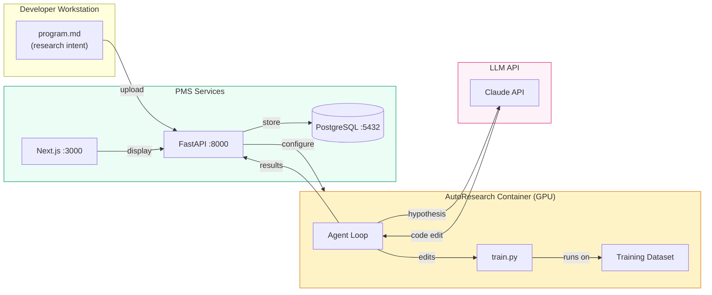

# AutoResearch Setup Guide for PMS Integration

**Document ID:** PMS-EXP-AUTORESEARCH-001
**Version:** 1.0
**Date:** March 12, 2026
**Applies To:** PMS project (all platforms)
**Prerequisites Level:** Intermediate

---

## Table of Contents

1. [Overview](#1-overview)
2. [Prerequisites](#2-prerequisites)
3. [Part A: Install and Configure AutoResearch](#3-part-a-install-and-configure-autoresearch)
4. [Part B: Integrate with PMS Backend](#4-part-b-integrate-with-pms-backend)
5. [Part C: Integrate with PMS Frontend](#5-part-c-integrate-with-pms-frontend)
6. [Part D: Testing and Verification](#6-part-d-testing-and-verification)
7. [Troubleshooting](#7-troubleshooting)
8. [Reference Commands](#8-reference-commands)

---

## 1. Overview

This guide walks you through setting up Karpathy's AutoResearch framework for autonomous ML model optimization within the PMS infrastructure. By the end, you will have:

- A Docker container running the AutoResearch agent loop with GPU access
- FastAPI endpoints for managing experiment runs, programs, and results
- A Next.js dashboard for monitoring experiments and approving model promotions
- A working end-to-end pipeline: write `program.md` → agent optimizes `train.py` → review results → promote model



---

## 2. Prerequisites

### 2.1 Required Software

| Software | Minimum Version | Check Command |
|---|---|---|
| Docker | 24.0+ | `docker --version` |
| NVIDIA Driver | 535+ | `nvidia-smi` |
| NVIDIA Container Toolkit | 1.14+ | `nvidia-ctk --version` |
| Python | 3.11+ | `python3 --version` |
| Git | 2.40+ | `git --version` |
| Node.js | 20+ | `node --version` |
| CUDA Toolkit | 12.x | `nvcc --version` |
| PostgreSQL | 15+ | `psql --version` |

### 2.2 Installation of Prerequisites

**NVIDIA Container Toolkit (if not installed):**

```bash
# Ubuntu/Debian
curl -fsSL https://nvidia.github.io/libnvidia-container/gpgkey | sudo gpg --dearmor -o /usr/share/keyrings/nvidia-container-toolkit-keyring.gpg
curl -s -L https://nvidia.github.io/libnvidia-container/stable/deb/nvidia-container-toolkit.list | \
  sed 's#deb https://#deb [signed-by=/usr/share/keyrings/nvidia-container-toolkit-keyring.gpg] https://#g' | \
  sudo tee /etc/apt/sources.list.d/nvidia-container-toolkit.list
sudo apt-get update && sudo apt-get install -y nvidia-container-toolkit
sudo nvidia-ctk runtime configure --runtime=docker
sudo systemctl restart docker
```

**Verify GPU access in Docker:**

```bash
docker run --rm --gpus all nvidia/cuda:12.4.0-base-ubuntu22.04 nvidia-smi
```

### 2.3 Verify PMS Services

```bash
# Backend health check
curl -s http://localhost:8000/api/health | python3 -m json.tool

# Frontend running
curl -s -o /dev/null -w "%{http_code}" http://localhost:3000

# PostgreSQL connection
psql -h localhost -U pms_user -d pms_db -c "SELECT 1;"
```

**Checkpoint:** All three PMS services respond successfully. GPU is accessible inside Docker containers.

---

## 3. Part A: Install and Configure AutoResearch

### Step 1: Clone the AutoResearch Repository

```bash
cd /opt/pms
git clone https://github.com/karpathy/autoresearch.git
cd autoresearch
```

### Step 2: Create the PMS AutoResearch Dockerfile

```bash
cat > Dockerfile.pms <<'EOF'
FROM nvidia/cuda:12.4.0-devel-ubuntu22.04

ENV DEBIAN_FRONTEND=noninteractive
ENV PYTHONUNBUFFERED=1

RUN apt-get update && apt-get install -y \
    python3.11 python3.11-venv python3-pip git curl \
    && rm -rf /var/lib/apt/lists/*

WORKDIR /app/autoresearch

# Copy autoresearch source
COPY . .

# Install dependencies
RUN python3.11 -m pip install --no-cache-dir -e .

# Create directories for PMS integration
RUN mkdir -p /app/datasets /app/results /app/programs

# Expose metrics endpoint
EXPOSE 9090

ENTRYPOINT ["python3.11"]
CMD ["train.py"]
EOF
```

### Step 3: Build the Docker Image

```bash
docker build -f Dockerfile.pms -t pms-autoresearch:latest .
```

### Step 4: Create the Environment Configuration

```bash
cat > /opt/pms/autoresearch/.env <<'EOF'
# AutoResearch PMS Configuration
ANTHROPIC_API_KEY=sk-ant-xxxxx
AUTORESEARCH_GPU_ID=0
AUTORESEARCH_TIME_BUDGET=300
AUTORESEARCH_MAX_EXPERIMENTS=100
AUTORESEARCH_GIT_BRANCH_PREFIX=autoresearch/pms

# PMS Backend
PMS_API_URL=http://host.docker.internal:8000
PMS_API_KEY=your-pms-api-key

# PostgreSQL (experiment history)
AR_DB_HOST=host.docker.internal
AR_DB_PORT=5432
AR_DB_NAME=pms_db
AR_DB_USER=pms_user
AR_DB_PASSWORD=your-db-password

# Security
AUTORESEARCH_NETWORK_ISOLATION=true
AUTORESEARCH_AUDIT_LOG=/app/results/audit.log
EOF
```

### Step 5: Create a Docker Compose Service

```bash
cat > /opt/pms/docker-compose.autoresearch.yml <<'EOF'
services:
  autoresearch:
    image: pms-autoresearch:latest
    container_name: pms-autoresearch
    deploy:
      resources:
        reservations:
          devices:
            - driver: nvidia
              count: 1
              capabilities: [gpu]
    volumes:
      - ./autoresearch:/app/autoresearch
      - ./datasets:/app/datasets:ro
      - ./results:/app/results
      - ./programs:/app/programs
    env_file:
      - ./autoresearch/.env
    ports:
      - "9090:9090"
    networks:
      - pms-network
    restart: unless-stopped
    # Network isolation: no access to patient API network segment
    extra_hosts:
      - "host.docker.internal:host-gateway"

networks:
  pms-network:
    external: true
EOF
```

### Step 6: Prepare a PMS-Specific `program.md`

```bash
cat > /opt/pms/programs/derm-cds-optimization.md <<'EOF'
# PMS Dermatology CDS Model Optimization Program

## Goal
Optimize the dermatology clinical decision support model for skin lesion
classification accuracy while maintaining inference latency <100ms on
NVIDIA GPU and <500ms on Android (TFLite).

## Constraints
- Do NOT change the model output format (7-class classification)
- Do NOT remove dropout or regularization layers
- Do NOT increase model size beyond 25M parameters (mobile deployment)
- Keep validation metric as primary objective: val_bpb (lower is better)
- All architecture changes must be exportable to ONNX and TFLite

## Areas to Explore
- Learning rate schedules (cosine, warmup, cyclical)
- Optimizer selection (AdamW, Muon, Lion)
- Architecture depth and width trade-offs
- Attention mechanism variations
- Data augmentation strategies in the training loop
- Batch size vs gradient accumulation trade-offs

## Evaluation
- Primary: val_bpb (validation bits per byte) — lower is better
- Secondary: training throughput (samples/second)
- Constraint: model parameter count must stay below 25M
EOF
```

### Step 7: Start AutoResearch

```bash
docker compose -f docker-compose.autoresearch.yml up -d
```

**Checkpoint:** AutoResearch container is running with GPU access. Verify with:

```bash
docker logs pms-autoresearch --tail 20
docker exec pms-autoresearch nvidia-smi
```

---

## 4. Part B: Integrate with PMS Backend

### Step 1: Create the Database Schema

```sql
-- File: migrations/autoresearch_schema.sql

CREATE SCHEMA IF NOT EXISTS autoresearch;

CREATE TABLE autoresearch.programs (
    id UUID PRIMARY KEY DEFAULT gen_random_uuid(),
    name VARCHAR(255) NOT NULL,
    content TEXT NOT NULL,
    model_target VARCHAR(100) NOT NULL,
    created_by VARCHAR(100) NOT NULL,
    created_at TIMESTAMPTZ DEFAULT NOW(),
    updated_at TIMESTAMPTZ DEFAULT NOW()
);

CREATE TABLE autoresearch.runs (
    id UUID PRIMARY KEY DEFAULT gen_random_uuid(),
    program_id UUID REFERENCES autoresearch.programs(id),
    git_branch VARCHAR(255) NOT NULL,
    status VARCHAR(20) DEFAULT 'pending'
        CHECK (status IN ('pending', 'running', 'completed', 'failed', 'cancelled')),
    total_experiments INT DEFAULT 0,
    improvements_found INT DEFAULT 0,
    best_val_bpb FLOAT,
    baseline_val_bpb FLOAT,
    started_at TIMESTAMPTZ,
    completed_at TIMESTAMPTZ,
    created_at TIMESTAMPTZ DEFAULT NOW()
);

CREATE TABLE autoresearch.experiments (
    id UUID PRIMARY KEY DEFAULT gen_random_uuid(),
    run_id UUID REFERENCES autoresearch.runs(id),
    experiment_number INT NOT NULL,
    hypothesis TEXT,
    code_diff TEXT,
    val_bpb FLOAT,
    kept BOOLEAN DEFAULT FALSE,
    duration_seconds INT,
    llm_tokens_used INT,
    created_at TIMESTAMPTZ DEFAULT NOW()
);

CREATE TABLE autoresearch.promotions (
    id UUID PRIMARY KEY DEFAULT gen_random_uuid(),
    run_id UUID REFERENCES autoresearch.runs(id),
    model_name VARCHAR(255) NOT NULL,
    status VARCHAR(20) DEFAULT 'pending'
        CHECK (status IN ('pending', 'approved', 'rejected', 'deployed')),
    requested_by VARCHAR(100),
    approved_by VARCHAR(100),
    approved_at TIMESTAMPTZ,
    security_scan_passed BOOLEAN,
    notes TEXT,
    created_at TIMESTAMPTZ DEFAULT NOW()
);

CREATE INDEX idx_runs_status ON autoresearch.runs(status);
CREATE INDEX idx_experiments_run_id ON autoresearch.experiments(run_id);
CREATE INDEX idx_promotions_status ON autoresearch.promotions(status);
```

Apply the migration:

```bash
psql -h localhost -U pms_user -d pms_db -f migrations/autoresearch_schema.sql
```

### Step 2: Create the AutoResearch Service Module

```python
# File: app/services/autoresearch_service.py

import subprocess
import uuid
from datetime import datetime
from typing import Optional

import httpx
from sqlalchemy import select, update
from sqlalchemy.ext.asyncio import AsyncSession

from app.models.autoresearch import Program, Run, Experiment, Promotion


class AutoResearchService:
    """Manages AutoResearch experiment runs and model promotions."""

    def __init__(self, db: AsyncSession):
        self.db = db
        self.container_name = "pms-autoresearch"

    async def create_program(
        self, name: str, content: str, model_target: str, created_by: str
    ) -> Program:
        program = Program(
            name=name,
            content=content,
            model_target=model_target,
            created_by=created_by,
        )
        self.db.add(program)
        await self.db.commit()
        await self.db.refresh(program)
        return program

    async def start_run(
        self, program_id: uuid.UUID, tag: Optional[str] = None
    ) -> Run:
        program = await self.db.get(Program, program_id)
        if not program:
            raise ValueError(f"Program {program_id} not found")

        branch_tag = tag or f"pms-{datetime.now().strftime('%Y%m%d-%H%M%S')}"
        git_branch = f"autoresearch/{branch_tag}"

        run = Run(
            program_id=program_id,
            git_branch=git_branch,
            status="pending",
            baseline_val_bpb=None,
        )
        self.db.add(run)
        await self.db.commit()
        await self.db.refresh(run)

        # Write program.md to the container
        subprocess.run(
            [
                "docker", "cp",
                f"/opt/pms/programs/{program.name}.md",
                f"{self.container_name}:/app/autoresearch/program.md",
            ],
            check=True,
        )

        # Start the agent loop in the container
        subprocess.Popen(
            [
                "docker", "exec", "-d", self.container_name,
                "python3.11", "train.py",
                "--tag", branch_tag,
            ]
        )

        await self.db.execute(
            update(Run)
            .where(Run.id == run.id)
            .values(status="running", started_at=datetime.utcnow())
        )
        await self.db.commit()

        return run

    async def record_experiment(
        self,
        run_id: uuid.UUID,
        experiment_number: int,
        hypothesis: str,
        code_diff: str,
        val_bpb: float,
        kept: bool,
        duration_seconds: int,
        llm_tokens_used: int,
    ) -> Experiment:
        experiment = Experiment(
            run_id=run_id,
            experiment_number=experiment_number,
            hypothesis=hypothesis,
            code_diff=code_diff,
            val_bpb=val_bpb,
            kept=kept,
            duration_seconds=duration_seconds,
            llm_tokens_used=llm_tokens_used,
        )
        self.db.add(experiment)

        # Update run statistics
        run = await self.db.get(Run, run_id)
        run.total_experiments += 1
        if kept:
            run.improvements_found += 1
            if run.best_val_bpb is None or val_bpb < run.best_val_bpb:
                run.best_val_bpb = val_bpb

        await self.db.commit()
        await self.db.refresh(experiment)
        return experiment

    async def get_run_metrics(self, run_id: uuid.UUID) -> dict:
        run = await self.db.get(Run, run_id)
        experiments = await self.db.execute(
            select(Experiment)
            .where(Experiment.run_id == run_id)
            .order_by(Experiment.experiment_number)
        )
        exp_list = experiments.scalars().all()

        return {
            "run_id": str(run.id),
            "status": run.status,
            "total_experiments": run.total_experiments,
            "improvements_found": run.improvements_found,
            "baseline_val_bpb": run.baseline_val_bpb,
            "best_val_bpb": run.best_val_bpb,
            "improvement_pct": (
                round(
                    (run.baseline_val_bpb - run.best_val_bpb)
                    / run.baseline_val_bpb
                    * 100,
                    2,
                )
                if run.baseline_val_bpb and run.best_val_bpb
                else None
            ),
            "experiments": [
                {
                    "number": e.experiment_number,
                    "hypothesis": e.hypothesis,
                    "val_bpb": e.val_bpb,
                    "kept": e.kept,
                    "duration_seconds": e.duration_seconds,
                }
                for e in exp_list
            ],
        }

    async def request_promotion(
        self, run_id: uuid.UUID, model_name: str, requested_by: str
    ) -> Promotion:
        promotion = Promotion(
            run_id=run_id,
            model_name=model_name,
            status="pending",
            requested_by=requested_by,
        )
        self.db.add(promotion)
        await self.db.commit()
        await self.db.refresh(promotion)
        return promotion

    async def approve_promotion(
        self, promotion_id: uuid.UUID, approved_by: str, security_scan_passed: bool
    ) -> Promotion:
        promotion = await self.db.get(Promotion, promotion_id)
        if not promotion:
            raise ValueError(f"Promotion {promotion_id} not found")
        if not security_scan_passed:
            promotion.status = "rejected"
            promotion.notes = "Security scan failed"
        else:
            promotion.status = "approved"
        promotion.approved_by = approved_by
        promotion.approved_at = datetime.utcnow()
        promotion.security_scan_passed = security_scan_passed
        await self.db.commit()
        await self.db.refresh(promotion)
        return promotion
```

### Step 3: Create the FastAPI Router

```python
# File: app/routers/autoresearch.py

from uuid import UUID

from fastapi import APIRouter, Depends, HTTPException
from pydantic import BaseModel
from sqlalchemy.ext.asyncio import AsyncSession

from app.database import get_db
from app.services.autoresearch_service import AutoResearchService

router = APIRouter(prefix="/api/autoresearch", tags=["autoresearch"])


class ProgramCreate(BaseModel):
    name: str
    content: str
    model_target: str


class RunStart(BaseModel):
    program_id: UUID
    tag: str | None = None


class ExperimentRecord(BaseModel):
    experiment_number: int
    hypothesis: str
    code_diff: str
    val_bpb: float
    kept: bool
    duration_seconds: int
    llm_tokens_used: int


class PromotionRequest(BaseModel):
    model_name: str


class PromotionApproval(BaseModel):
    security_scan_passed: bool


@router.post("/programs")
async def create_program(body: ProgramCreate, db: AsyncSession = Depends(get_db)):
    svc = AutoResearchService(db)
    program = await svc.create_program(
        name=body.name,
        content=body.content,
        model_target=body.model_target,
        created_by="api",
    )
    return {"id": str(program.id), "name": program.name}


@router.post("/runs")
async def start_run(body: RunStart, db: AsyncSession = Depends(get_db)):
    svc = AutoResearchService(db)
    try:
        run = await svc.start_run(body.program_id, body.tag)
        return {"id": str(run.id), "git_branch": run.git_branch, "status": run.status}
    except ValueError as e:
        raise HTTPException(status_code=404, detail=str(e))


@router.get("/runs/{run_id}/metrics")
async def get_run_metrics(run_id: UUID, db: AsyncSession = Depends(get_db)):
    svc = AutoResearchService(db)
    return await svc.get_run_metrics(run_id)


@router.post("/runs/{run_id}/experiments")
async def record_experiment(
    run_id: UUID, body: ExperimentRecord, db: AsyncSession = Depends(get_db)
):
    svc = AutoResearchService(db)
    exp = await svc.record_experiment(
        run_id=run_id,
        experiment_number=body.experiment_number,
        hypothesis=body.hypothesis,
        code_diff=body.code_diff,
        val_bpb=body.val_bpb,
        kept=body.kept,
        duration_seconds=body.duration_seconds,
        llm_tokens_used=body.llm_tokens_used,
    )
    return {"id": str(exp.id), "kept": exp.kept}


@router.post("/runs/{run_id}/promotions")
async def request_promotion(
    run_id: UUID, body: PromotionRequest, db: AsyncSession = Depends(get_db)
):
    svc = AutoResearchService(db)
    promotion = await svc.request_promotion(
        run_id=run_id, model_name=body.model_name, requested_by="api"
    )
    return {"id": str(promotion.id), "status": promotion.status}


@router.post("/promotions/{promotion_id}/approve")
async def approve_promotion(
    promotion_id: UUID, body: PromotionApproval, db: AsyncSession = Depends(get_db)
):
    svc = AutoResearchService(db)
    try:
        promotion = await svc.approve_promotion(
            promotion_id=promotion_id,
            approved_by="api",
            security_scan_passed=body.security_scan_passed,
        )
        return {"id": str(promotion.id), "status": promotion.status}
    except ValueError as e:
        raise HTTPException(status_code=404, detail=str(e))
```

### Step 4: Register the Router

Add to your FastAPI application:

```python
# In app/main.py
from app.routers import autoresearch

app.include_router(autoresearch.router)
```

**Checkpoint:** AutoResearch API endpoints are registered. Verify:

```bash
curl -s http://localhost:8000/openapi.json | python3 -c "
import json, sys
spec = json.load(sys.stdin)
paths = [p for p in spec['paths'] if 'autoresearch' in p]
print(f'AutoResearch endpoints: {len(paths)}')
for p in paths: print(f'  {p}')
"
```

---

## 5. Part C: Integrate with PMS Frontend

### Step 1: Add Environment Variable

```bash
# In .env.local (Next.js)
NEXT_PUBLIC_AUTORESEARCH_API=/api/autoresearch
```

### Step 2: Create the AutoResearch API Client

```typescript
// File: src/lib/autoresearch-client.ts

export interface AutoResearchRun {
  id: string;
  git_branch: string;
  status: "pending" | "running" | "completed" | "failed" | "cancelled";
  total_experiments: number;
  improvements_found: number;
  baseline_val_bpb: number | null;
  best_val_bpb: number | null;
  improvement_pct: number | null;
}

export interface Experiment {
  number: number;
  hypothesis: string;
  val_bpb: number;
  kept: boolean;
  duration_seconds: number;
}

export interface RunMetrics extends AutoResearchRun {
  experiments: Experiment[];
}

const API_BASE = process.env.NEXT_PUBLIC_AUTORESEARCH_API ?? "/api/autoresearch";

export async function createProgram(
  name: string,
  content: string,
  modelTarget: string
) {
  const res = await fetch(`${API_BASE}/programs`, {
    method: "POST",
    headers: { "Content-Type": "application/json" },
    body: JSON.stringify({ name, content, model_target: modelTarget }),
  });
  return res.json();
}

export async function startRun(programId: string, tag?: string) {
  const res = await fetch(`${API_BASE}/runs`, {
    method: "POST",
    headers: { "Content-Type": "application/json" },
    body: JSON.stringify({ program_id: programId, tag }),
  });
  return res.json();
}

export async function getRunMetrics(runId: string): Promise<RunMetrics> {
  const res = await fetch(`${API_BASE}/runs/${runId}/metrics`);
  return res.json();
}

export async function requestPromotion(runId: string, modelName: string) {
  const res = await fetch(`${API_BASE}/runs/${runId}/promotions`, {
    method: "POST",
    headers: { "Content-Type": "application/json" },
    body: JSON.stringify({ model_name: modelName }),
  });
  return res.json();
}
```

### Step 3: Create the Experiment Dashboard Component

```tsx
// File: src/components/autoresearch/ExperimentDashboard.tsx

"use client";

import { useEffect, useState } from "react";
import { getRunMetrics, type RunMetrics } from "@/lib/autoresearch-client";

interface ExperimentDashboardProps {
  runId: string;
  refreshInterval?: number;
}

export function ExperimentDashboard({
  runId,
  refreshInterval = 10000,
}: ExperimentDashboardProps) {
  const [metrics, setMetrics] = useState<RunMetrics | null>(null);
  const [error, setError] = useState<string | null>(null);

  useEffect(() => {
    let active = true;

    async function fetchMetrics() {
      try {
        const data = await getRunMetrics(runId);
        if (active) setMetrics(data);
      } catch (err) {
        if (active) setError("Failed to fetch metrics");
      }
    }

    fetchMetrics();
    const interval = setInterval(fetchMetrics, refreshInterval);
    return () => {
      active = false;
      clearInterval(interval);
    };
  }, [runId, refreshInterval]);

  if (error) return <div className="text-red-600 p-4">{error}</div>;
  if (!metrics) return <div className="p-4">Loading experiment data...</div>;

  const keptExperiments = metrics.experiments.filter((e) => e.kept);

  return (
    <div className="space-y-6">
      {/* Summary Cards */}
      <div className="grid grid-cols-4 gap-4">
        <StatCard
          label="Total Experiments"
          value={metrics.total_experiments}
        />
        <StatCard
          label="Improvements Found"
          value={metrics.improvements_found}
          highlight
        />
        <StatCard
          label="Best val_bpb"
          value={metrics.best_val_bpb?.toFixed(4) ?? "—"}
        />
        <StatCard
          label="Improvement"
          value={
            metrics.improvement_pct
              ? `${metrics.improvement_pct}%`
              : "—"
          }
          highlight={!!metrics.improvement_pct}
        />
      </div>

      {/* Status Badge */}
      <div className="flex items-center gap-2">
        <span className="text-sm font-medium">Status:</span>
        <StatusBadge status={metrics.status} />
        <span className="text-sm text-gray-500 ml-auto">
          Branch: <code>{metrics.git_branch}</code>
        </span>
      </div>

      {/* Experiment Timeline */}
      <div className="border rounded-lg overflow-hidden">
        <table className="w-full text-sm">
          <thead className="bg-gray-50">
            <tr>
              <th className="px-4 py-2 text-left">#</th>
              <th className="px-4 py-2 text-left">Hypothesis</th>
              <th className="px-4 py-2 text-right">val_bpb</th>
              <th className="px-4 py-2 text-center">Kept</th>
              <th className="px-4 py-2 text-right">Duration</th>
            </tr>
          </thead>
          <tbody>
            {metrics.experiments.map((exp) => (
              <tr
                key={exp.number}
                className={exp.kept ? "bg-green-50" : ""}
              >
                <td className="px-4 py-2">{exp.number}</td>
                <td className="px-4 py-2 max-w-md truncate">
                  {exp.hypothesis}
                </td>
                <td className="px-4 py-2 text-right font-mono">
                  {exp.val_bpb.toFixed(4)}
                </td>
                <td className="px-4 py-2 text-center">
                  {exp.kept ? "✓" : "✗"}
                </td>
                <td className="px-4 py-2 text-right">
                  {Math.round(exp.duration_seconds / 60)}m
                </td>
              </tr>
            ))}
          </tbody>
        </table>
      </div>
    </div>
  );
}

function StatCard({
  label,
  value,
  highlight = false,
}: {
  label: string;
  value: string | number;
  highlight?: boolean;
}) {
  return (
    <div className="border rounded-lg p-4">
      <div className="text-sm text-gray-500">{label}</div>
      <div
        className={`text-2xl font-bold ${highlight ? "text-green-600" : ""}`}
      >
        {value}
      </div>
    </div>
  );
}

function StatusBadge({ status }: { status: string }) {
  const colors: Record<string, string> = {
    pending: "bg-gray-100 text-gray-700",
    running: "bg-blue-100 text-blue-700",
    completed: "bg-green-100 text-green-700",
    failed: "bg-red-100 text-red-700",
    cancelled: "bg-yellow-100 text-yellow-700",
  };
  return (
    <span
      className={`px-2 py-1 rounded-full text-xs font-medium ${colors[status] ?? colors.pending}`}
    >
      {status}
    </span>
  );
}
```

### Step 4: Add the Dashboard Page

```tsx
// File: src/app/autoresearch/page.tsx

import { ExperimentDashboard } from "@/components/autoresearch/ExperimentDashboard";

export default function AutoResearchPage() {
  return (
    <div className="container mx-auto p-6">
      <h1 className="text-2xl font-bold mb-6">AutoResearch — Model Optimization</h1>
      <p className="text-gray-600 mb-8">
        Autonomous ML experiment runner powered by Karpathy&apos;s AutoResearch.
        Monitor active runs, review improvements, and promote optimized models.
      </p>
      {/* In production, run ID comes from route params or a run selector */}
      <ExperimentDashboard runId="latest" />
    </div>
  );
}
```

**Checkpoint:** The AutoResearch dashboard page is accessible at `http://localhost:3000/autoresearch`. The API client connects to the FastAPI backend and displays experiment metrics.

---

## 6. Part D: Testing and Verification

### Service Health Checks

```bash
# 1. AutoResearch container is running
docker ps --filter name=pms-autoresearch --format "{{.Status}}"

# 2. GPU is accessible inside container
docker exec pms-autoresearch nvidia-smi --query-gpu=name,memory.total --format=csv

# 3. AutoResearch API endpoints respond
curl -s http://localhost:8000/api/autoresearch/programs | python3 -m json.tool

# 4. Database schema exists
psql -h localhost -U pms_user -d pms_db -c "\dt autoresearch.*"
```

### Functional Test: Create and Start a Run

```bash
# Create a program
PROGRAM_ID=$(curl -s -X POST http://localhost:8000/api/autoresearch/programs \
  -H "Content-Type: application/json" \
  -d '{
    "name": "test-optimization",
    "content": "# Test Program\n\nOptimize learning rate and batch size.",
    "model_target": "derm-cds-v1"
  }' | python3 -c "import json,sys; print(json.load(sys.stdin)['id'])")

echo "Program created: $PROGRAM_ID"

# Start a run
RUN_ID=$(curl -s -X POST http://localhost:8000/api/autoresearch/runs \
  -H "Content-Type: application/json" \
  -d "{\"program_id\": \"$PROGRAM_ID\", \"tag\": \"test-run-001\"}" \
  | python3 -c "import json,sys; print(json.load(sys.stdin)['id'])")

echo "Run started: $RUN_ID"

# Check metrics after a few minutes
sleep 360
curl -s http://localhost:8000/api/autoresearch/runs/$RUN_ID/metrics | python3 -m json.tool
```

### Integration Test: End-to-End Pipeline

```bash
# Verify the full pipeline
echo "=== AutoResearch Integration Test ==="
echo "1. Container status:"
docker inspect pms-autoresearch --format '{{.State.Status}}'

echo "2. API health:"
curl -s -o /dev/null -w "%{http_code}" http://localhost:8000/api/autoresearch/programs

echo "3. Database tables:"
psql -h localhost -U pms_user -d pms_db -c "SELECT COUNT(*) FROM autoresearch.runs;"

echo "4. Frontend accessible:"
curl -s -o /dev/null -w "%{http_code}" http://localhost:3000/autoresearch

echo "=== All checks passed ==="
```

**Checkpoint:** AutoResearch is fully integrated — container runs with GPU, API endpoints respond, database stores experiment history, and the frontend dashboard renders.

---

## 7. Troubleshooting

### GPU Not Detected in Container

**Symptoms:** `nvidia-smi` fails inside the container; training crashes with CUDA errors.

**Solution:**
```bash
# Verify NVIDIA Container Toolkit
nvidia-ctk --version
# Reconfigure Docker runtime
sudo nvidia-ctk runtime configure --runtime=docker
sudo systemctl restart docker
# Test GPU access
docker run --rm --gpus all nvidia/cuda:12.4.0-base-ubuntu22.04 nvidia-smi
```

### LLM API Rate Limiting

**Symptoms:** Agent loop stalls; logs show `429 Too Many Requests` from Anthropic API.

**Solution:**
- Reduce experiment frequency by increasing `AUTORESEARCH_TIME_BUDGET` to 600 seconds
- Use Claude Sonnet 4.6 instead of Opus for lower rate limit impact
- Add exponential backoff in the agent loop configuration

### Out of GPU Memory

**Symptoms:** `CUDA out of memory` errors during training.

**Solution:**
```bash
# Check GPU memory usage
docker exec pms-autoresearch nvidia-smi

# Add memory constraint to program.md:
# "Do NOT increase batch size beyond 32"
# "Model parameter count must stay below 25M"

# Or increase swap:
docker update --memory-swap -1 pms-autoresearch
```

### Database Connection Refused

**Symptoms:** API returns 500 errors; logs show `connection refused` to PostgreSQL.

**Solution:**
```bash
# Verify PostgreSQL is accepting connections
pg_isready -h localhost -p 5432

# Check the container can reach the host
docker exec pms-autoresearch curl -s host.docker.internal:5432 || echo "Port reachable"

# Verify schema exists
psql -h localhost -U pms_user -d pms_db -c "\dn autoresearch"
```

### Port 9090 Already in Use

**Symptoms:** Container fails to start; port binding error.

**Solution:**
```bash
# Find what's using port 9090
lsof -i :9090

# Change the port mapping in docker-compose.autoresearch.yml
# ports:
#   - "9091:9090"
```

---

## 8. Reference Commands

### Daily Development Workflow

```bash
# Start AutoResearch
docker compose -f docker-compose.autoresearch.yml up -d

# Check status
docker logs pms-autoresearch --tail 50

# Stop when done
docker compose -f docker-compose.autoresearch.yml down
```

### Experiment Management

```bash
# List all runs
curl -s http://localhost:8000/api/autoresearch/runs | python3 -m json.tool

# Get metrics for a specific run
curl -s http://localhost:8000/api/autoresearch/runs/{run_id}/metrics | python3 -m json.tool

# Request model promotion
curl -s -X POST http://localhost:8000/api/autoresearch/runs/{run_id}/promotions \
  -H "Content-Type: application/json" \
  -d '{"model_name": "derm-cds-v2-optimized"}'
```

### Monitoring Commands

```bash
# GPU utilization
docker exec pms-autoresearch nvidia-smi --query-gpu=utilization.gpu,memory.used --format=csv -l 5

# Experiment count
psql -h localhost -U pms_user -d pms_db -c \
  "SELECT run_id, COUNT(*), SUM(CASE WHEN kept THEN 1 ELSE 0 END) as improvements FROM autoresearch.experiments GROUP BY run_id;"

# Git branch history (inside container)
docker exec pms-autoresearch git log --oneline -20
```

### Useful URLs

| Resource | URL |
|---|---|
| AutoResearch Dashboard | `http://localhost:3000/autoresearch` |
| API Documentation | `http://localhost:8000/docs#/autoresearch` |
| GPU Monitoring | `http://localhost:9090/metrics` |
| AutoResearch GitHub | `https://github.com/karpathy/autoresearch` |
| program.md Reference | `https://github.com/karpathy/autoresearch/blob/master/program.md` |

---

## Next Steps

After completing setup, proceed to the [AutoResearch Developer Tutorial](84-AutoResearch-Developer-Tutorial.md) to build your first PMS model optimization pipeline end-to-end.

## Resources

- [AutoResearch GitHub Repository](https://github.com/karpathy/autoresearch)
- [AutoResearch program.md](https://github.com/karpathy/autoresearch/blob/master/program.md)
- [AutoResearch MLX Port (Apple Silicon)](https://github.com/trevin-creator/autoresearch-mlx)
- [Getting Started Guide (Medium)](https://medium.com/modelmind/getting-started-with-andrej-karpathys-autoresearch-full-guide-c2f3a80b9ce6)
- [PRD: AutoResearch PMS Integration](84-PRD-AutoResearch-PMS-Integration.md)
- [PRD: ISIC Dermatology CDS (Exp 18)](18-PRD-ISICArchive-PMS-Integration.md)
- [PRD: MedASR Speech Recognition (Exp 07)](07-PRD-MedASR-PMS-Integration.md)
