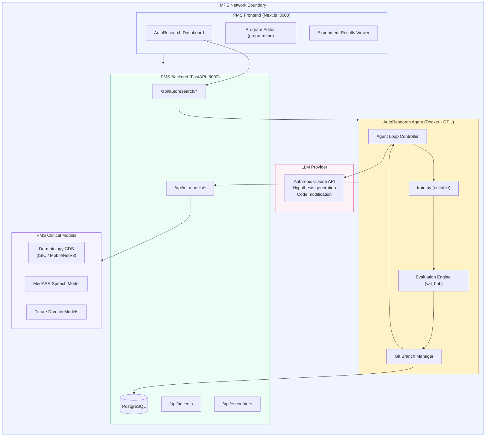

# Product Requirements Document: AutoResearch Integration into Patient Management System (PMS)

**Document ID:** PRD-PMS-AUTORESEARCH-001
**Version:** 1.0
**Date:** March 12, 2026
**Author:** Ammar (CEO, MPS Inc.)
**Status:** Draft

---

## 1. Executive Summary

AutoResearch is an open-source autonomous AI experimentation framework created by Andrej Karpathy that enables AI agents to iteratively run machine learning experiments without human supervision. The system gives an AI agent a training script and a fixed compute budget (typically 5 minutes per experiment), allowing it to read its own source code, form hypotheses for improvement, modify the code, run the experiment, evaluate results, and repeat — potentially running ~100 experiments overnight on a single GPU.

Integrating AutoResearch into the PMS would enable MPS to autonomously optimize the clinical AI models already deployed across the system — including the dermatology CDS model (Experiment 18, ISIC Archive), medical speech recognition fine-tuning (Experiment 07, MedASR), and any future domain-specific models. Instead of manually tuning hyperparameters and architectures, an AutoResearch agent loop would continuously search for better configurations, track improvements via git history, and surface validated gains for human review before promotion to production.

This integration positions MPS at the frontier of self-improving healthcare AI: clinical models that get better overnight, every night, with full auditability and human-in-the-loop governance for HIPAA compliance.

---

## 2. Problem Statement

The current PMS AI pipeline has several bottlenecks related to model optimization and iteration:

- **Manual hyperparameter tuning:** Data scientists spend hours manually adjusting learning rates, batch sizes, architecture depth, and optimizer configurations for clinical models. Each experiment requires human setup, monitoring, and evaluation — limiting throughput to 2-3 experiments per day.
- **Slow model improvement cycles:** The dermatology CDS model (SYS-REQ-0012) and MedASR transcription model require periodic retraining as new data arrives. Each retraining cycle is a manual, multi-day effort with no systematic exploration of the optimization landscape.
- **No overnight experimentation:** GPU resources sit idle outside business hours. There is no mechanism to leverage this idle compute for autonomous model improvement.
- **Inconsistent experiment tracking:** Model experiments are tracked ad-hoc through Jupyter notebooks and spreadsheets. There is no standardized, git-native experiment history that ties code changes to metric improvements.
- **Knowledge loss between iterations:** When a data scientist leaves or context-switches, the rationale behind specific hyperparameter choices is lost. There is no automated institutional memory for what was tried and why.

---

## 3. Proposed Solution

Deploy AutoResearch as an **autonomous model optimization service** within the PMS infrastructure. The system will run as a Docker container with GPU access, connected to the PMS backend via FastAPI endpoints for configuration, monitoring, and result retrieval. A human-in-the-loop approval gate ensures no model changes reach production without clinical validation.

### 3.1 Architecture Overview

### 3.2 Deployment Model

- **Self-hosted Docker container** with NVIDIA GPU passthrough (requires `nvidia-container-toolkit`)
- **Single GPU per AutoResearch instance** — consistent with Karpathy's design philosophy of one GPU, one file, one metric
- **Git-native experiment tracking** — each experiment run creates commits on a feature branch; improvements are kept, regressions are reset
- **No PHI in training data by default** — clinical models are trained on de-identified or synthetic datasets; PHI access requires explicit approval gate
- **LLM API calls contain only code** — the agent sends `train.py` source code to Claude for hypothesis generation; no patient data is transmitted
- **HIPAA compliance envelope:** All operations within MPS network boundary; audit logs for every experiment; model promotion requires human approval

---

## 4. PMS Data Sources

AutoResearch interacts with PMS data indirectly through the model training pipeline:

| API Endpoint | Interaction Type | Purpose |
|---|---|---|
| `/api/patients` | Read (de-identified) | Generate synthetic training datasets for model optimization |
| `/api/encounters` | Read (de-identified) | Encounter metadata for MedASR training corpus curation |
| `/api/prescriptions` | Not directly used | Future: medication interaction model training data |
| `/api/reports` | Write | Publish experiment summaries and model improvement reports |
| `/api/ml-models` | Read/Write | Register optimized models, retrieve baseline configurations |
| `/api/autoresearch` | Read/Write | Manage experiment runs, programs, and approval workflows |

**Important:** AutoResearch does not directly query patient APIs during training. Training datasets are pre-processed, de-identified, and stored in a separate data volume. The `/api/patients` and `/api/encounters` endpoints are used only during dataset preparation, not during the agent loop.

---

## 5. Component/Module Definitions

### 5.1 AutoResearch Agent Service

| Attribute | Detail |
|---|---|
| **Description** | Docker container running the AutoResearch agent loop with GPU access |
| **Input** | `program.md` (human-authored research intent), `train.py` (model training script), training dataset |
| **Output** | Git branch with accumulated improvements, experiment logs, val_bpb metrics |
| **PMS APIs** | `/api/autoresearch/runs`, `/api/ml-models/register` |

### 5.2 Program Manager

| Attribute | Detail |
|---|---|
| **Description** | Web interface for authoring and versioning `program.md` files — the human's research intent |
| **Input** | Natural language research goals, constraints, and evaluation criteria |
| **Output** | Versioned `program.md` committed to the experiment repository |
| **PMS APIs** | `/api/autoresearch/programs` |

### 5.3 Experiment Dashboard

| Attribute | Detail |
|---|---|
| **Description** | Real-time monitoring of running experiments: metrics, code diffs, agent reasoning |
| **Input** | Experiment run ID |
| **Output** | Live val_bpb chart, git diff viewer, agent hypothesis log |
| **PMS APIs** | `/api/autoresearch/runs/{id}/metrics`, `/api/autoresearch/runs/{id}/log` |

### 5.4 Model Promotion Gate

| Attribute | Detail |
|---|---|
| **Description** | Human-in-the-loop approval workflow for promoting optimized models to staging/production |
| **Input** | Experiment run results, metric comparisons, code diff |
| **Output** | Approved/rejected status, promotion to model registry |
| **PMS APIs** | `/api/autoresearch/promotions`, `/api/ml-models/promote` |

### 5.5 Experiment History Store

| Attribute | Detail |
|---|---|
| **Description** | PostgreSQL tables tracking all experiment runs, metrics, hypotheses, and outcomes |
| **Input** | Agent loop events (hypothesis, code change, metric result, keep/discard decision) |
| **Output** | Queryable experiment history for analysis and reporting |
| **PMS APIs** | `/api/autoresearch/history` |

---

## 6. Non-Functional Requirements

### 6.1 Security and HIPAA Compliance

| Requirement | Implementation |
|---|---|
| **PHI isolation** | Training datasets must be de-identified (Safe Harbor or Expert Determination) before use. AutoResearch containers have no network access to patient APIs during training runs |
| **Audit logging** | Every experiment run, code modification, and model promotion is logged with timestamp, actor (agent or human), and rationale |
| **LLM data boundary** | Only `train.py` source code is sent to the LLM API — never training data, patient records, or model weights |
| **Access control** | AutoResearch dashboard requires `ml-admin` role. Model promotion requires `clinical-lead` + `ml-admin` dual approval |
| **Encryption** | Training datasets encrypted at rest (AES-256). All API communication over TLS 1.3 |
| **Code review** | Agent-generated code changes are preserved in git for human review. AI-generated code has ~2.74× more vulnerabilities — all changes require security scan before promotion |

### 6.2 Performance

| Metric | Target |
|---|---|
| Experiments per hour | ≥10 (5-minute time-boxed runs) |
| Experiments per overnight run (8 hours) | ≥80 |
| Dashboard latency | <500ms for metrics refresh |
| Model promotion pipeline | <15 minutes from approval to staging deployment |
| GPU utilization during experiments | >90% |

### 6.3 Infrastructure

| Component | Requirement |
|---|---|
| GPU | NVIDIA GPU with ≥16GB VRAM (A4000, RTX 4090, or A100 recommended) |
| Docker | `nvidia-container-toolkit` for GPU passthrough |
| Storage | ≥100GB for training datasets, experiment checkpoints, and git history |
| Python | 3.11+ with PyTorch 2.9+ |
| Git | Repository per model family for experiment tracking |
| LLM API | Anthropic Claude API key with sufficient rate limits (~12 calls/hour per active run) |

---

## 7. Implementation Phases

### Phase 1: Foundation (Sprints 1-2)

- Deploy AutoResearch Docker container with GPU passthrough
- Configure `program.md` and `train.py` templates for one PMS model (dermatology CDS)
- Implement `/api/autoresearch` FastAPI endpoints for run management
- Set up PostgreSQL schema for experiment history
- Basic CLI-based experiment monitoring

### Phase 2: Core Integration (Sprints 3-4)

- Build Next.js Experiment Dashboard with real-time metrics
- Implement Program Editor for `program.md` authoring in the browser
- Add Model Promotion Gate with dual-approval workflow
- Integrate with existing ML model registry (`/api/ml-models`)
- Extend to MedASR model optimization
- Add security scanning for agent-generated code changes

### Phase 3: Advanced Features (Sprints 5-6)

- Multi-model concurrent experimentation (multiple GPU allocation)
- Scheduled overnight runs with Slack/email notifications
- Experiment comparison and meta-analysis tools
- Synthetic data generation pipeline for training dataset creation
- Integration with n8n (Experiment 34) for workflow automation triggers
- Custom metric support beyond val_bpb (e.g., clinical accuracy, sensitivity/specificity)

---

## 8. Success Metrics

| Metric | Target | Measurement Method |
|---|---|---|
| Model improvement discovery rate | ≥15 validated improvements per 100 experiments | Experiment history analysis |
| Time-to-improvement vs manual tuning | ≥3× faster | Compare agent vs manual experiment velocity |
| GPU utilization (overnight) | >85% | NVIDIA SMI monitoring |
| Model promotion approval rate | >60% of proposed improvements pass clinical review | Promotion gate statistics |
| Data scientist time saved | ≥10 hours/week on hyperparameter tuning | Time tracking comparison |
| Agent-generated code security scan pass rate | >95% | SonarCloud/Snyk scan results |
| Clinical model accuracy improvement | ≥5% relative improvement within first month | Validation set metrics |

---

## 9. Risks and Mitigations

| Risk | Impact | Mitigation |
|---|---|---|
| Agent generates insecure or buggy training code | Model instability or security vulnerabilities | Mandatory security scan before model promotion; sandboxed execution environment; git-native rollback |
| LLM API sends PHI inadvertently | HIPAA violation | Strict network segmentation: AutoResearch container cannot reach patient APIs; code-only LLM prompts; outbound traffic monitoring |
| GPU resource contention with production inference | Degraded clinical model response times | Dedicated GPU for AutoResearch; time-windowed scheduling (overnight only); priority queuing for production inference |
| Overfitting to validation set | Model performs well on metrics but poorly on real clinical data | Hold-out clinical test set not visible to agent; periodic human evaluation on fresh clinical cases |
| High LLM API costs from continuous experimentation | Budget overrun | Per-run API call budget cap; cost dashboard; automatic pause if budget exceeded |
| Agent explores harmful architectures (e.g., removes safety checks) | Clinical safety regression | `program.md` constraints; automated test suite that must pass before metric evaluation; human review of all promoted changes |
| Single-GPU limitation restricts experiment scale | Slow optimization for large models | Phase 3 multi-GPU support; prioritize smallest effective model size; consider autoresearch-mlx for Apple Silicon nodes |

---

## 10. Dependencies

| Dependency | Type | Version/Detail |
|---|---|---|
| AutoResearch | Core framework | Latest from `karpathy/autoresearch` (MIT License) |
| PyTorch | ML runtime | 2.9.1+ with CUDA support |
| NVIDIA GPU + drivers | Hardware | CUDA 12.x, `nvidia-container-toolkit` |
| Anthropic Claude API | LLM provider | Claude Sonnet 4.6 or Opus 4.6 for hypothesis generation |
| Docker | Container runtime | 24.x+ with GPU passthrough |
| PostgreSQL | Experiment history | Existing PMS database (shared or dedicated schema) |
| Git | Experiment tracking | Branch-per-run strategy |
| PMS Backend (FastAPI) | API layer | Existing `:8000` service |
| PMS Frontend (Next.js) | Dashboard UI | Existing `:3000` service |
| SonarCloud / Snyk | Security scanning | Agent-generated code review |

---

## 11. Comparison with Existing Experiments

| Aspect | AutoResearch (Exp 84) | Adaptive Thinking (Exp 08) | OpenClaw (Exp 05) |
|---|---|---|---|
| **Focus** | Autonomous ML model optimization | Adaptive AI reasoning patterns | Agentic workflow automation |
| **Agent type** | Code-modifying research agent | Thinking/reasoning agent | Task execution agent |
| **Output** | Improved model configurations | Better AI responses | Completed clinical workflows |
| **Human role** | Write `program.md`, review promotions | Define thinking patterns | Define skills, approve actions |
| **GPU required** | Yes (training) | No | No |
| **HIPAA scope** | Training data de-identification | Prompt/response filtering | Action-level approval gates |

AutoResearch is **complementary** to both: it optimizes the underlying ML models that power clinical AI features, while Adaptive Thinking and OpenClaw focus on how those models are invoked and orchestrated in clinical workflows. Together, they form a full-stack AI improvement pipeline: AutoResearch makes models smarter, Adaptive Thinking makes reasoning better, and OpenClaw automates the workflows that use them.

---

## 12. Research Sources

### Official Documentation & Repository
- [AutoResearch GitHub Repository](https://github.com/karpathy/autoresearch) — Source code, program.md, train.py, and project README
- [program.md (Research Program)](https://github.com/karpathy/autoresearch/blob/master/program.md) — Human-authored research intent template and agent instructions
- [pyproject.toml](https://github.com/karpathy/autoresearch/blob/master/pyproject.toml) — Dependencies and project metadata

### Architecture & Technical Analysis
- [MarkTechPost: 630-Line Python Tool for Autonomous ML Experiments](https://www.marktechpost.com/2026/03/08/andrej-karpathy-open-sources-autoresearch-a-630-line-python-tool-letting-ai-agents-run-autonomous-ml-experiments-on-single-gpus/) — Technical architecture breakdown and design philosophy
- [Ken Huang: Exploring AutoResearch](https://kenhuangus.substack.com/p/exploring-andrej-karpathys-autoresearch) — Deep-dive into agent loop mechanics and experiment tracking
- [Kingy AI: Minimal Agent Loop](https://kingy.ai/ai/autoresearch-karpathys-minimal-agent-loop-for-autonomous-llm-experimentation/) — Agent loop architecture, git branching strategy, and evaluation metrics

### Ecosystem & Adoption
- [VentureBeat: Hundreds of AI Experiments a Night](https://venturebeat.com/technology/andrej-karpathys-new-open-source-autoresearch-lets-you-run-hundreds-of-ai) — Industry implications and community response
- [Phil Schmid: How AutoResearch Will Change Small Language Models](https://www.philschmid.de/autoresearch) — Impact on SLM adoption and fine-tuning practices
- [Blockchain.news: 11% Faster Time to GPT-2 Benchmark](https://blockchain.news/ainews/karpathy-s-autoresearch-boosts-nanochat-training-11-faster-time-to-gpt-2-benchmark-analysis-and-business-implications) — Quantified results from multi-day autonomous runs

### Security & AI Code Quality
- [OriginX AI: Autonomous AI Agents Crossed a Threshold](https://www.originxai.com/blog/autonomous-ai-agents-karpathy-autoresearch/) — Security considerations for agent-generated code, vulnerability analysis

---

## 13. Appendix: Related Documents

- [AutoResearch Setup Guide](84-AutoResearch-PMS-Developer-Setup-Guide.md)
- [AutoResearch Developer Tutorial](84-AutoResearch-Developer-Tutorial.md)
- [AutoResearch GitHub Repository](https://github.com/karpathy/autoresearch)
- [AutoResearch MLX Port (Apple Silicon)](https://github.com/trevin-creator/autoresearch-mlx)
- [PRD: ISIC Dermatology CDS (Exp 18)](18-PRD-ISICArchive-PMS-Integration.md)
- [PRD: MedASR Speech Recognition (Exp 07)](07-PRD-MedASR-PMS-Integration.md)
- [PRD: Adaptive Thinking (Exp 08)](08-PRD-AdaptiveThinking-PMS-Integration.md)
- [PRD: OpenClaw Agent (Exp 05)](05-PRD-OpenClaw-PMS-Integration.md)
