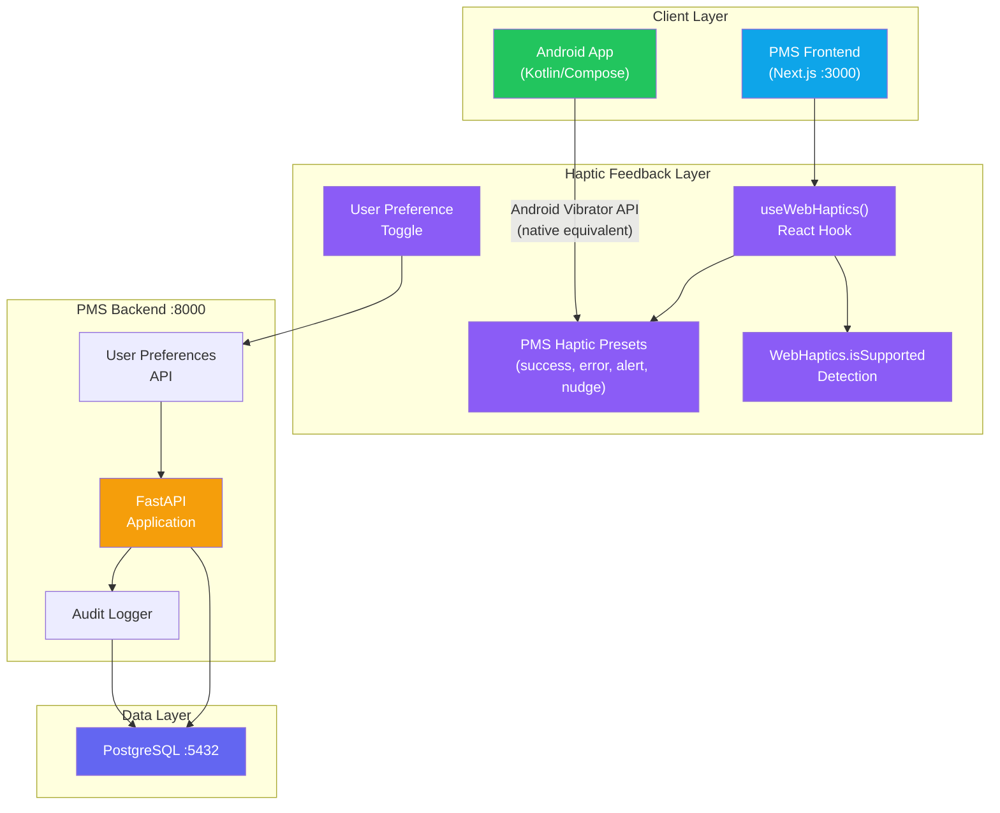

# Product Requirements Document: WebHaptics Integration into Patient Management System (PMS)

**Document ID:** PRD-PMS-WEBHAPTICS-001
**Version:** 1.0
**Date:** March 12, 2026
**Author:** Ammar (CEO, MPS Inc.)
**Status:** Draft

---

## 1. Executive Summary

WebHaptics is a lightweight TypeScript library (npm: `web-haptics`) that wraps the browser's native Vibration API into a clean, framework-agnostic interface for delivering haptic feedback on mobile web applications. It ships with framework-specific hooks for React (`useWebHaptics`), Vue (`useWebHaptics`), and Svelte (`createWebHaptics`), plus a vanilla `WebHaptics` class. The library provides four built-in vibration presets — success, nudge, error, and buzz — and supports fully custom patterns with per-step intensity control, all in a bundle small enough to have zero meaningful impact on page load.

The PMS frontend (Next.js) and Android app serve clinical staff who perform high-frequency, high-consequence actions: confirming medication dispensing, acknowledging critical lab results, approving prescription overrides, and signing encounter notes. Today these actions rely solely on visual feedback (toast notifications, color changes, spinners), which is easily missed in a busy clinic environment where the clinician's eyes are on the patient, not the screen. Integrating WebHaptics into the PMS provides a tactile confirmation channel — a distinct vibration pattern for successful saves, errors, and alerts — that reduces the cognitive load of visually polling for UI state changes.

By adding haptic feedback to critical PMS touchpoints, the system gains: (1) immediate tactile confirmation of safety-critical actions (medication dispense, allergy override), (2) ambient alert escalation that does not require visual attention, (3) improved accessibility for visually impaired clinical staff (studies show 32% better comprehension when haptic feedback complements screen readers), (4) a user-controlled toggle respecting staff preferences, and (5) a consistent haptic vocabulary across all PMS mobile surfaces via shared preset definitions.

## 2. Problem Statement

The PMS faces several UX gaps related to action confirmation and alert awareness in mobile clinical workflows:

- **Silent confirmations**: When a clinician taps "Dispense Medication" or "Sign Encounter Note" on the PMS mobile web or Android app, the only feedback is a brief visual toast or color change. In a noisy, multi-patient environment, staff frequently miss these confirmations and repeat the action — or worse, assume it failed when it succeeded.
- **Alert fatigue through visual-only channels**: Critical lab results, drug interaction warnings, and allergy alerts compete with dozens of other on-screen notifications. Without a distinct sensory channel, high-priority alerts blend into the visual noise.
- **Accessibility gap**: Visually impaired staff using screen readers receive no tactile reinforcement of action outcomes. The PMS currently provides no haptic layer for assistive technology users.
- **Inconsistent mobile experience**: The Android native app can use the platform Vibrator API directly, but the mobile web frontend has no haptic feedback at all, creating an inconsistent experience between platforms.
- **No standardized haptic vocabulary**: Without a shared library of haptic patterns mapped to semantic events (success, error, warning, alert), individual developers would implement ad-hoc vibration calls that vary in duration and meaning.

## 3. Proposed Solution

### 3.1 Architecture Overview

### 3.2 Deployment Model

WebHaptics is a **client-side-only** npm package — no server component, no Docker container, no network calls. It is bundled into the Next.js frontend at build time and executes entirely in the browser using the native `navigator.vibrate()` API. This means:

- **No PHI exposure**: The library never transmits data. Vibration patterns are fired locally on the device.
- **No infrastructure cost**: Zero additional servers, containers, or cloud services.
- **No HIPAA data flow concerns**: Since no patient data passes through or is stored by the library, the HIPAA security envelope is unaffected. The only HIPAA-adjacent consideration is that user preference settings (haptics on/off) are stored in the existing PMS user preferences table, which is already HIPAA-compliant.
- **Browser compatibility**: Works on Android Chrome, Edge, Firefox, Opera, and Samsung Internet. **Does not work on iOS Safari** — Apple does not implement the Vibration API. The PMS must gracefully degrade on iOS (no vibration, visual-only fallback).

## 4. PMS Data Sources

WebHaptics is a presentation-layer technology. It does not consume PMS APIs for data — it responds to the **outcomes** of API calls with tactile feedback. The relevant PMS APIs and the haptic patterns triggered by their responses:

| PMS API | Haptic Trigger Event | Preset |
|---------|---------------------|--------|
| `/api/prescriptions` (POST) | Medication dispensed successfully | `success` (two short taps) |
| `/api/prescriptions` (POST — error) | Drug interaction or allergy conflict detected | `error` (three sharp taps) |
| `/api/encounters` (PUT) | Encounter note signed/saved | `success` |
| `/api/patients` (PUT) | Patient record updated | `nudge` (gentle confirmation) |
| `/api/reports` (GET — critical) | Critical lab result received via WebSocket | `alert` (custom long pattern) |
| `/api/encounters` (conflict) | Concurrent edit conflict detected | `error` |

**User Preferences API** (`/api/users/{id}/preferences`): Stores the user's haptic feedback toggle (enabled/disabled) and intensity preference (low/medium/high). This is the only PMS API that WebHaptics integration writes to.

## 5. Component/Module Definitions

### 5.1 PMS Haptic Preset Registry

**Description**: A TypeScript module defining the PMS-specific haptic vocabulary — a mapping of clinical event types to vibration patterns.

**Input**: Clinical event name (e.g., `"medication-dispensed"`, `"critical-lab-result"`, `"edit-conflict"`)
**Output**: WebHaptics `HapticPreset` object with duration, pause, and intensity values

**PMS APIs Used**: None (static configuration)

### 5.2 `usePmsHaptics` React Hook

**Description**: A wrapper around `useWebHaptics()` that integrates with PMS user preferences (respecting the user's haptic toggle setting) and maps PMS clinical events to the preset registry.

**Input**: Clinical event name
**Output**: Fires the corresponding vibration pattern (or no-op if disabled or unsupported)

**PMS APIs Used**: `/api/users/{id}/preferences` (read user haptic settings on mount)

### 5.3 Haptic Preference Toggle Component

**Description**: A React component rendered in the PMS user settings page, allowing staff to enable/disable haptic feedback and select intensity level.

**Input**: User interaction (toggle switch, intensity slider)
**Output**: Persists preference to PMS backend

**PMS APIs Used**: `/api/users/{id}/preferences` (GET/PUT)

### 5.4 Android Haptic Bridge

**Description**: A Kotlin utility that mirrors the PMS haptic preset registry using Android's native `HapticFeedbackConstants` and `VibrationEffect` API, ensuring the same semantic haptic vocabulary across platforms.

**Input**: Clinical event name
**Output**: Native Android vibration effect

**PMS APIs Used**: `/api/users/{id}/preferences` (read user haptic settings)

## 6. Non-Functional Requirements

### 6.1 Security and HIPAA Compliance

- **No PHI in haptic layer**: WebHaptics processes zero patient data. Vibration patterns are triggered by UI events, not by PHI content. No additional HIPAA controls are required for the library itself.
- **User preference storage**: Haptic preference (on/off, intensity) is stored in the existing `user_preferences` table, which is already encrypted at rest (AES-256) and protected by role-based access control.
- **Audit logging**: Changes to haptic preferences are logged in the existing PMS audit trail (`audit_log` table) for compliance.
- **No network calls**: The library makes zero HTTP requests. All vibration is executed locally via `navigator.vibrate()`.

### 6.2 Performance

| Metric | Target |
|--------|--------|
| Bundle size impact | < 5 KB gzipped (WebHaptics core) |
| Vibration trigger latency | < 10 ms from event to motor activation |
| Graceful degradation | Zero errors on unsupported devices (iOS Safari) |
| Memory overhead | < 1 MB additional heap usage |
| User preference load | < 50 ms (cached in React context after first load) |

### 6.3 Infrastructure

- **No additional infrastructure required**. WebHaptics is bundled into the existing Next.js build.
- **Database**: One new column (`haptic_preferences JSONB`) in the existing `user_preferences` table, or a new row in a key-value preferences store.
- **Android**: Native Kotlin utility added to the existing Android app module — no new dependencies beyond the Android SDK.

## 7. Implementation Phases

### Phase 1: Foundation (Sprint 1 — 1 week)

- Install `web-haptics` in the Next.js frontend
- Create the PMS haptic preset registry (`pms-haptic-presets.ts`)
- Build the `usePmsHaptics` React hook with `isSupported` detection and graceful degradation
- Add haptic preference toggle to user settings page
- Add `haptic_preferences` column to user preferences table
- Write unit tests for preset registry and hook

### Phase 2: Core Clinical Integration (Sprint 2 — 1 week)

- Integrate haptic feedback into medication dispensing workflow (success/error)
- Add haptic feedback to encounter note save/sign actions
- Integrate with WebSocket alerts for critical lab results (Experiment 37)
- Add haptic feedback to concurrent edit conflict detection
- Build Android haptic bridge with matching presets
- End-to-end testing on Android Chrome and Samsung Internet

### Phase 3: Advanced Patterns & Accessibility (Sprint 3 — 1 week)

- Create custom long-pattern haptic presets for escalating alerts (repeated buzz for unacknowledged critical results)
- Integrate with screen reader announcements for dual-channel accessibility
- Add haptic intensity preferences (low/medium/high)
- Performance profiling and bundle size audit
- Documentation and clinical staff training materials

## 8. Success Metrics

| Metric | Target | Measurement Method |
|--------|--------|--------------------|
| Repeated action rate reduction | 30% fewer duplicate dispense/save taps | Analytics event comparison (before/after) |
| Critical alert acknowledgment time | 15% faster response to critical lab results | Timestamp delta: alert fired → acknowledged |
| Staff satisfaction (haptic feedback) | > 4.0/5.0 on usability survey | Post-deployment survey of clinical staff |
| Accessibility improvement | 25% better action comprehension for screen reader users | Accessibility audit with assistive technology users |
| Adoption rate | > 60% of mobile users keep haptics enabled after 30 days | User preference analytics |
| Zero iOS errors | 0 console errors on unsupported devices | Sentry error monitoring |

## 9. Risks and Mitigations

| Risk | Impact | Mitigation |
|------|--------|------------|
| iOS Safari does not support Vibration API | ~45% of mobile users get no haptic feedback | Graceful degradation via `WebHaptics.isSupported` check; visual-only fallback on iOS; document limitation clearly for staff |
| Haptic fatigue from too-frequent vibrations | Staff disable haptics entirely, losing safety benefit | Rate-limit vibrations (max 1 per 500ms); allow per-event granular control; default to critical-only events |
| Inconsistent vibration hardware across Android devices | Haptic patterns feel different on different phones | Use simple, high-contrast patterns (short vs long) rather than subtle intensity differences; test on 3+ device classes |
| Staff distraction in quiet clinical settings | Vibration motor noise may disturb patients | Offer "silent hours" schedule in preferences; ensure vibration durations are short (< 300ms for standard events) |
| Library abandonment or stale maintenance | Dependency risk for a 2.1K-star library | Library is MIT-licensed and wraps a single browser API; if abandoned, fork or replace with 20 lines of direct `navigator.vibrate()` calls |
| Android native vs web haptic inconsistency | Same event feels different on native app vs mobile web | Use the same duration/pattern values in both the WebHaptics preset and Android `VibrationEffect.createWaveform()` |

## 10. Dependencies

| Dependency | Type | Version | Purpose |
|------------|------|---------|---------|
| `web-haptics` | npm package | latest | Core haptic feedback library |
| Browser Vibration API | Web standard | W3C Candidate Rec | Underlying platform capability |
| PMS Frontend (Next.js) | Internal | Current | Host application for React hook |
| PMS Backend (FastAPI) | Internal | Current | User preferences API |
| PostgreSQL | Internal | 15+ | User preferences storage |
| Android SDK | Platform | API 26+ | `VibrationEffect` API (Android 8.0+) |
| Experiment 37 (WebSocket) | Internal | Current | Real-time alert delivery triggering haptic feedback |

## 11. Comparison with Existing Experiments

| Aspect | Exp 85: WebHaptics | Exp 37: WebSocket | Exp 30: ElevenLabs |
|--------|-------------------|-------------------|-------------------|
| **Sensory channel** | Touch (vibration) | Data transport (no direct UX) | Audio (speech/sound) |
| **Purpose** | Confirm actions, escalate alerts via tactile feedback | Real-time bidirectional data sync | Voice readback of clinical data |
| **Infrastructure** | Zero (client-side only) | WebSocket server, Redis pub/sub | Cloud API, audio streaming |
| **HIPAA data exposure** | None — no data processed | PHI in WebSocket messages | PHI in audio content |
| **Complementary to** | WebSocket alerts (tactile channel for WS events) | WebHaptics (triggers haptic on incoming alerts) | WebHaptics (audio + haptic = multi-sensory) |

WebHaptics is highly complementary to Experiment 37 (WebSocket): when a critical lab result arrives via WebSocket, the PMS can fire both a visual notification and a haptic alert simultaneously, creating a multi-channel notification that is harder to miss. Similarly, combining WebHaptics with Experiment 30 (ElevenLabs) enables a triple-channel alert: visual + audio readback + tactile vibration.

## 12. Research Sources

### Official Documentation
- [WebHaptics GitHub Repository](https://github.com/lochie/web-haptics) — Source code, API documentation, framework examples, and preset definitions
- [WebHaptics CSS Script Overview](https://www.cssscript.com/haptic-feedback-web/) — Detailed API reference with constructor options, methods, and custom pattern syntax

### Architecture & Specification
- [MDN Vibration API](https://developer.mozilla.org/en-US/docs/Web/API/Vibration_API) — W3C specification, browser compatibility matrix, and `navigator.vibrate()` reference
- [MDN Navigator.vibrate()](https://developer.mozilla.org/en-US/docs/Web/API/Navigator/vibrate) — Method signature, pattern format, and user activation requirements

### Ecosystem & Adoption
- [WebHaptics NPM Package Overview (Medium)](https://medium.com/@springmusk/web-haptics-the-npm-package-everyones-adding-for-haptic-feedback-4c774f10caaa) — Adoption trends, developer experience, and community reception
- [Haptic Feedback for Web Apps (OpenReplay)](https://blog.openreplay.com/haptic-feedback-for-web-apps-with-the-vibration-api/) — Vibration API patterns and UX best practices

### Alternatives & Comparisons
- [Expo Haptics Documentation](https://docs.expo.dev/versions/latest/sdk/haptics/) — React Native alternative with platform-native haptic engine access
- [Capacitor Haptics Plugin](https://capacitorjs.com/docs/apis/haptics) — Hybrid app haptics with Taptic Engine and Vibrator API support

### Accessibility & UX
- [Beyond Visual: Haptic Feedback on the Web (DEV Community)](https://dev.to/luxonauta/beyond-visual-why-we-should-be-using-more-haptic-feedback-on-the-web-1adg) — Accessibility benefits of haptic feedback (32% comprehension improvement with screen readers)

## 13. Appendix: Related Documents

- [WebHaptics Setup Guide](85-WebHaptics-PMS-Developer-Setup-Guide.md)
- [WebHaptics Developer Tutorial](85-WebHaptics-Developer-Tutorial.md)
- [WebSocket PMS Integration (Experiment 37)](37-PRD-WebSocket-PMS-Integration.md) — Real-time alert delivery that triggers haptic feedback
- [ElevenLabs PMS Integration (Experiment 30)](30-PRD-ElevenLabs-PMS-Integration.md) — Audio channel complementing haptic feedback
- [Official WebHaptics Documentation](https://github.com/lochie/web-haptics)
