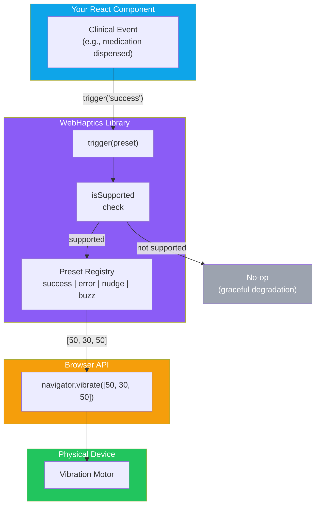
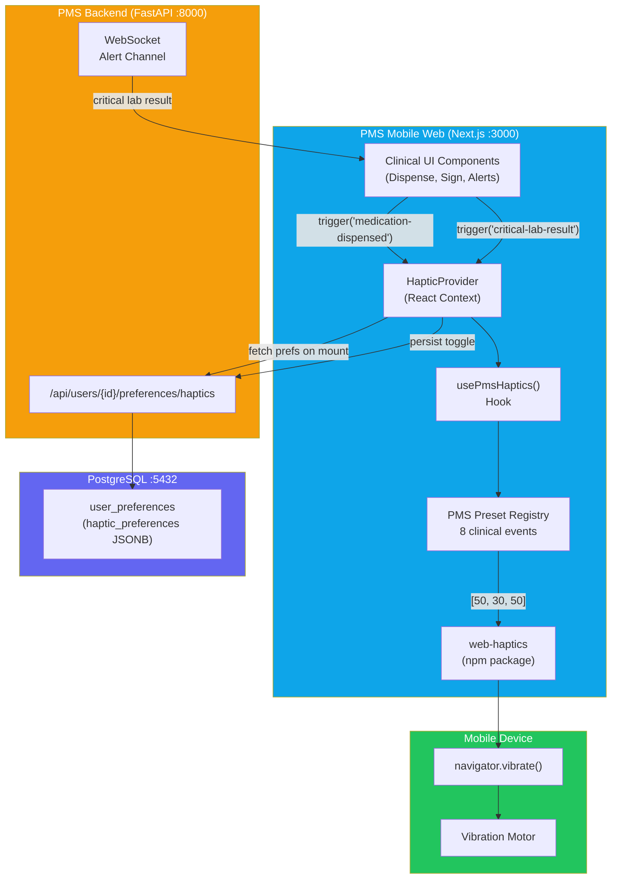

# WebHaptics Developer Onboarding Tutorial

**Welcome to the MPS PMS WebHaptics Integration Team**

This tutorial will take you from zero to building your first haptic feedback integration with the PMS. By the end, you will understand how WebHaptics works, have a running local environment, and have built and tested a custom clinical haptic integration end-to-end.

**Document ID:** PMS-EXP-WEBHAPTICS-002
**Version:** 1.0
**Date:** March 12, 2026
**Applies To:** PMS project (all platforms)
**Prerequisite:** [WebHaptics Setup Guide](85-WebHaptics-PMS-Developer-Setup-Guide.md)
**Estimated time:** 2-3 hours
**Difficulty:** Beginner-friendly

---

## What You Will Learn

1. What problem haptic feedback solves in clinical mobile workflows
2. How the browser Vibration API works under the hood
3. How WebHaptics wraps the Vibration API into a developer-friendly interface
4. How to define PMS-specific haptic presets for clinical events
5. How to build a React hook that integrates with user preferences
6. How to wire haptic feedback into medication dispensing actions
7. How to integrate with WebSocket alerts for critical lab results
8. How to test haptic feedback on Android devices and gracefully degrade on iOS
9. How to evaluate WebHaptics strengths and weaknesses for healthcare use
10. How to debug common haptic feedback issues

---

## Part 1: Understanding WebHaptics (15 min read)

### 1.1 What Problem Does WebHaptics Solve?

Clinical staff in a busy medical practice interact with the PMS on mobile devices — tablets at the point of care, phones during rounds, shared workstations in the pharmacy. When a clinician taps "Dispense Medication," the only confirmation is a brief visual toast notification that disappears in 3 seconds. If the clinician is looking at the patient (as they should be), they miss the confirmation entirely. They may tap again, creating a duplicate action, or assume it failed when it succeeded.

The same problem applies to alerts: a critical potassium level of 6.8 mmol/L arrives via a WebSocket push. The PMS shows a red badge on the lab results tab. But the clinician is in the middle of documenting an encounter and doesn't see the badge for 12 minutes.

**Haptic feedback adds a tactile channel** — a distinct vibration pattern that the clinician feels in their hand, even without looking at the screen. Two quick taps mean "action succeeded." Three sharp taps mean "error — look at the screen." A long escalating buzz means "critical alert — act now." This is the same model that native mobile apps (Messages, payment apps, health apps) have used for years, but applied to the clinical web.

### 1.2 How WebHaptics Works — The Key Pieces



**Concept 1: Vibration Patterns** — The Vibration API accepts an array of numbers: `[vibrate_ms, pause_ms, vibrate_ms, ...]`. For example, `[50, 30, 50]` means "vibrate 50ms, pause 30ms, vibrate 50ms." WebHaptics maps preset names to these patterns.

**Concept 2: Presets** — WebHaptics ships with 4 built-in presets (`success`, `error`, `nudge`, `buzz`). The PMS extends these with clinical-specific presets like `medication-dispensed`, `critical-lab-result`, and `edit-conflict`.

**Concept 3: Graceful Degradation** — `WebHaptics.isSupported` checks if the device has a Vibration API. On unsupported devices (iOS Safari, most desktops), all `trigger()` calls are silently ignored — no errors, no fallbacks, just visual-only behavior.

### 1.3 How WebHaptics Fits with Other PMS Technologies

| Technology | Experiment | Sensory Channel | Relationship to WebHaptics |
|-----------|------------|-----------------|---------------------------|
| WebSocket | Exp 37 | Data transport | Delivers real-time events that trigger haptic patterns |
| ElevenLabs | Exp 30 | Audio (speech) | Audio readback + haptic = dual-channel confirmation |
| Speechmatics Flow | Exp 33 | Audio (voice agent) | Voice interaction + haptic acknowledgment |
| Excalidraw Skill | Exp 40 | Visual (diagrams) | Purely visual — no overlap with haptics |
| n8n Workflows | Exp 34 | Backend automation | Workflow completion events can trigger haptic alerts |
| Docker | Exp 39 | Infrastructure | No direct interaction — haptics are client-side only |

### 1.4 Key Vocabulary

| Term | Meaning |
|------|---------|
| Vibration API | W3C browser API providing `navigator.vibrate()` for device motor control |
| Haptic feedback | Tactile sensation communicated through vibration or touch |
| Preset | A named vibration pattern (e.g., "success" → `[50, 30, 50]`) |
| Pattern | An array of millisecond values alternating between vibrate and pause durations |
| Sticky user activation | Browser requirement that `vibrate()` only works after a real user gesture (tap, click) |
| Graceful degradation | Silently disabling haptics on unsupported devices without errors |
| `useWebHaptics()` | React hook from `web-haptics/react` providing `trigger` and `cancel` methods |
| `usePmsHaptics()` | PMS wrapper hook adding clinical presets and user preference integration |
| `isSupported` | Boolean indicating whether the current device supports the Vibration API |
| Intensity | A 0–1 scale controlling vibration strength (hardware support varies) |
| Debug audio mode | WebHaptics feature replacing vibration with audio tones for desktop testing |
| Cancel | `cancel()` method to stop an active vibration pattern mid-execution |

### 1.5 Our Architecture



---

## Part 2: Environment Verification (15 min)

### 2.1 Checklist

Run each command and confirm the expected output:

1. **Node.js version**:
   ```bash
   node --version
   # Expected: v18.x.x or higher
   ```

2. **WebHaptics installed**:
   ```bash
   cd pms-frontend && npm list web-haptics
   # Expected: web-haptics@x.x.x
   ```

3. **PMS backend running**:
   ```bash
   curl -s http://localhost:8000/health | jq .status
   # Expected: "healthy"
   ```

4. **PMS frontend running**:
   ```bash
   curl -s -o /dev/null -w "%{http_code}" http://localhost:3000
   # Expected: 200
   ```

5. **Haptic preferences API**:
   ```bash
   curl -s http://localhost:8000/api/users/1/preferences/haptics | jq .
   # Expected: {"enabled": true, "intensity": "medium"}
   ```

6. **Preset registry file exists**:
   ```bash
   ls pms-frontend/src/lib/haptics/pms-haptic-presets.ts
   # Expected: file found
   ```

### 2.2 Quick Test

Open `http://localhost:3000` on an Android phone via your local network IP. Open Chrome DevTools (remote debugging via `chrome://inspect`) and run:

```javascript
navigator.vibrate(200);
```

If the phone vibrates for 200ms, your environment is ready.

---

## Part 3: Build Your First Integration (45 min)

### 3.1 What We Are Building

A **medication dispensing confirmation flow** that:
1. Fires a `success` haptic pattern when medication is dispensed
2. Fires an `error` haptic pattern when a drug interaction is detected
3. Respects the user's haptic preference toggle
4. Degrades gracefully on unsupported devices

### 3.2 Create the Preset Registry

If you haven't already done this in the setup guide, create `src/lib/haptics/pms-haptic-presets.ts`:

```typescript
export type PmsHapticEvent =
  | "medication-dispensed"
  | "medication-error"
  | "encounter-saved"
  | "encounter-signed"
  | "critical-lab-result"
  | "edit-conflict"
  | "patient-updated"
  | "alert-acknowledged";

export const PMS_HAPTIC_PRESETS: Record<PmsHapticEvent, { pattern: number[]; description: string }> = {
  "medication-dispensed": {
    pattern: [50, 30, 50],
    description: "Medication successfully dispensed",
  },
  "medication-error": {
    pattern: [80, 40, 80, 40, 80],
    description: "Drug interaction or allergy conflict",
  },
  "encounter-saved": {
    pattern: [30, 20, 30],
    description: "Encounter note saved as draft",
  },
  "encounter-signed": {
    pattern: [50, 30, 50],
    description: "Encounter note signed",
  },
  "critical-lab-result": {
    pattern: [100, 50, 100, 50, 200],
    description: "Critical lab value — urgent",
  },
  "edit-conflict": {
    pattern: [80, 40, 80, 40, 80],
    description: "Concurrent edit conflict",
  },
  "patient-updated": {
    pattern: [40],
    description: "Patient record updated",
  },
  "alert-acknowledged": {
    pattern: [30],
    description: "Alert acknowledged",
  },
};
```

**Checkpoint**: You have a typed registry of 8 clinical haptic events.

### 3.3 Build the React Hook

Create `src/lib/haptics/use-pms-haptics.ts`:

```typescript
"use client";

import { useCallback, useState } from "react";
import { useWebHaptics } from "web-haptics/react";
import { PMS_HAPTIC_PRESETS, type PmsHapticEvent } from "./pms-haptic-presets";

export function usePmsHaptics(options: { enabled?: boolean } = {}) {
  const { trigger: rawTrigger } = useWebHaptics();
  const [isEnabled, setIsEnabled] = useState(options.enabled ?? true);
  const isSupported = typeof navigator !== "undefined" && "vibrate" in navigator;

  const trigger = useCallback(
    (event: PmsHapticEvent) => {
      if (!isEnabled || !isSupported) return;
      const preset = PMS_HAPTIC_PRESETS[event];
      if (preset) rawTrigger(preset.pattern);
    },
    [isEnabled, isSupported, rawTrigger]
  );

  return { trigger, isSupported, isEnabled: isEnabled && isSupported, setEnabled: setIsEnabled };
}
```

**Checkpoint**: You have a hook that fires clinical haptic patterns and respects device support.

### 3.4 Wire into the Dispense Button

In your medication dispensing component (e.g., `src/components/prescriptions/dispense-button.tsx`):

```tsx
"use client";

import { useState } from "react";
import { usePmsHaptics } from "@/lib/haptics/use-pms-haptics";

interface DispenseButtonProps {
  prescriptionId: number;
  medicationName: string;
}

export function DispenseButton({ prescriptionId, medicationName }: DispenseButtonProps) {
  const { trigger } = usePmsHaptics();
  const [status, setStatus] = useState<"idle" | "loading" | "success" | "error">("idle");

  const handleDispense = async () => {
    setStatus("loading");

    try {
      const response = await fetch(`/api/prescriptions/${prescriptionId}/dispense`, {
        method: "POST",
        headers: { "Content-Type": "application/json" },
      });

      if (response.ok) {
        setStatus("success");
        trigger("medication-dispensed"); // Two quick taps
      } else {
        setStatus("error");
        trigger("medication-error");     // Three sharp taps
      }
    } catch {
      setStatus("error");
      trigger("medication-error");
    }
  };

  return (
    <button
      onClick={handleDispense}
      disabled={status === "loading"}
      className={`rounded px-4 py-2 text-sm font-medium ${
        status === "success"
          ? "bg-green-100 text-green-800"
          : status === "error"
          ? "bg-red-100 text-red-800"
          : "bg-blue-600 text-white hover:bg-blue-700"
      }`}
    >
      {status === "loading"
        ? "Dispensing..."
        : status === "success"
        ? `✓ ${medicationName} dispensed`
        : status === "error"
        ? "Dispense failed — tap to retry"
        : `Dispense ${medicationName}`}
    </button>
  );
}
```

**Checkpoint**: Tapping the dispense button on Android Chrome fires a two-tap success vibration or a three-tap error vibration. On desktop/iOS, the button works identically minus the vibration.

### 3.5 Add WebSocket Alert Integration

If you have Experiment 37 (WebSocket) set up, integrate critical lab result haptics:

```tsx
"use client";

import { useEffect } from "react";
import { usePmsHaptics } from "@/lib/haptics/use-pms-haptics";
import { useWebSocket } from "@/hooks/use-websocket"; // from Exp 37

export function CriticalAlertListener({ patientId }: { patientId: number }) {
  const { trigger } = usePmsHaptics();
  const { lastMessage } = useWebSocket(`/ws/alerts/${patientId}`);

  useEffect(() => {
    if (lastMessage?.type === "critical_lab_result") {
      trigger("critical-lab-result"); // Escalating vibration pattern
    }
  }, [lastMessage, trigger]);

  return null; // Headless component — no UI, just haptic side effects
}
```

**Checkpoint**: When a critical lab result arrives via WebSocket, the clinician feels an escalating vibration pattern even if they're not looking at the screen.

### 3.6 Test on a Real Device

1. Find your local network IP: `ifconfig | grep "inet " | grep -v 127.0.0.1`
2. On your Android phone, open Chrome and navigate to `http://<your-ip>:3000`
3. Navigate to the medication dispensing page
4. Tap the "Dispense" button
5. Feel the two-tap success vibration
6. Test with a known error case to feel the three-tap error vibration

---

## Part 4: Evaluating Strengths and Weaknesses (15 min)

### 4.1 Strengths

| Strength | Detail |
|----------|--------|
| **Tiny bundle** | < 5 KB gzipped — negligible impact on page load |
| **Framework hooks** | First-class React, Vue, Svelte support — no manual lifecycle management |
| **Preset system** | Built-in `success`, `error`, `nudge`, `buzz` + full custom pattern support |
| **Graceful degradation** | `isSupported` check — zero errors on unsupported devices |
| **Debug mode** | Audio fallback for desktop testing without a physical device |
| **MIT license** | No licensing concerns for commercial healthcare software |
| **Zero network calls** | No PHI exposure, no HIPAA data flow concerns |
| **User toggle** | Built-in `showSwitch` option; our `HapticProvider` extends this with backend persistence |
| **Cancel support** | `cancel()` stops active vibrations — useful for dismissing alerts |
| **TypeScript** | Full type definitions for all APIs |

### 4.2 Weaknesses

| Weakness | Impact | Workaround |
|----------|--------|------------|
| **No iOS Safari support** | ~45% of mobile users get no haptic feedback | Document limitation; visual-only fallback is the existing behavior |
| **No fine-grained intensity control** | Android Vibration API is binary (on/off) — intensity is ignored on most hardware | Use pattern duration/pauses for perceived intensity differences |
| **Requires user gesture** | `vibrate()` only works after tap/click — cannot fire on page load or from background timers | All PMS haptic triggers are already button clicks or user-initiated actions |
| **Small community** | 2.1K GitHub stars, 4 contributors — risk of abandonment | Library is trivially replaceable (wraps a single API call) |
| **No iOS Taptic Engine access** | Even on iOS native web views, the Taptic Engine is inaccessible from JavaScript | Only native iOS apps can use `UIFeedbackGenerator`; no web workaround |
| **Desktop testing** | Debug audio mode is helpful but not equivalent to real vibration feel | Must test on real Android devices for production validation |

### 4.3 When to Use WebHaptics vs Alternatives

| Scenario | Recommendation |
|----------|---------------|
| Mobile web app (React/Vue/Svelte) needing haptic feedback | **WebHaptics** — designed for this exact use case |
| React Native app | **expo-haptics** or **react-native-haptics** — native APIs, better iOS support |
| Ionic/Capacitor hybrid app | **@capacitor/haptics** — native bridge with Taptic Engine support |
| Simple one-off vibration | Direct `navigator.vibrate()` — no library needed for a single call |
| iOS-critical haptic feedback | Native development only — no web solution exists |
| PMS Android native app | Android `VibrationEffect` API directly — no npm package needed |

### 4.4 HIPAA / Healthcare Considerations

| Area | Assessment |
|------|------------|
| **PHI exposure** | None. WebHaptics processes zero patient data. Vibration patterns are triggered by event names, not PHI content. |
| **Data transmission** | None. All vibration is local to the device via `navigator.vibrate()`. |
| **Audit trail** | Haptic preference changes are logged in the PMS audit trail. Haptic trigger events themselves are not logged (they're ephemeral UI feedback, not clinical actions). |
| **Access control** | Haptic preferences are tied to authenticated user sessions. No additional RBAC needed. |
| **Encryption** | Not applicable — no data at rest or in transit. User preferences stored in the already-encrypted `user_preferences` table. |
| **Risk** | Minimal. The primary risk is clinical staff relying on haptic feedback that isn't available on their device (iOS). Mitigation: always pair haptic feedback with visual feedback as the primary channel. |

---

## Part 5: Debugging Common Issues (15 min read)

### Issue 1: No vibration despite `isSupported: true`

**Symptoms**: `WebHaptics.isSupported` returns `true`, `trigger()` is called, but no physical vibration.

**Cause**: The Vibration API requires "sticky user activation" — the call must originate from a user gesture (click, tap, keyboard event). Calls from `setTimeout`, `setInterval`, `useEffect`, or WebSocket handlers that are not in the direct call stack of a user event will be silently ignored.

**Fix**: For WebSocket alerts, trigger the haptic from the alert's "acknowledge" button click, not from the WebSocket `onmessage` handler directly. However, recent Chrome versions (116+) have relaxed this requirement for sites with user engagement, so test on your target browser version.

### Issue 2: SSR crash — `navigator is not defined`

**Symptoms**: Next.js server-side rendering fails with `ReferenceError: navigator is not defined`.

**Cause**: `navigator` only exists in the browser. WebHaptics or the `isSupported` check runs during SSR.

**Fix**: Guard with `typeof navigator !== "undefined"` (which `usePmsHaptics` already does), or ensure the component using the hook is marked `"use client"`.

### Issue 3: Vibration feels different across Android devices

**Symptoms**: The same `[50, 30, 50]` pattern feels like two distinct taps on a Pixel but one continuous buzz on a Samsung.

**Cause**: Vibration motor hardware varies dramatically across Android devices. Cheaper eccentric rotating mass (ERM) motors have slow spin-up times (~30ms), so short patterns merge together.

**Fix**: Use longer durations (80ms+) for patterns that need to feel distinct. Test on at least 3 device classes (flagship, mid-range, budget).

### Issue 4: Debug audio is playing in production

**Symptoms**: Beeping sounds on desktop browsers in the deployed PMS.

**Cause**: The `debug: true` option was left enabled, which replaces vibration with audio tones on devices without Vibration API support.

**Fix**: Ensure the WebHaptics constructor (or `useWebHaptics()` options) does not set `debug: true` in production. Use an environment variable:
```typescript
useWebHaptics({ debug: process.env.NODE_ENV === "development" });
```

### Issue 5: Haptic feedback fires twice on double-tap

**Symptoms**: A fast double-tap on a button triggers two vibration patterns, which merge into a confusing long buzz.

**Cause**: No debounce on the haptic trigger.

**Fix**: Add a minimum interval between haptic fires in the `usePmsHaptics` hook:
```typescript
const lastTriggerRef = useRef(0);
const trigger = useCallback((event: PmsHapticEvent) => {
  const now = Date.now();
  if (now - lastTriggerRef.current < 500) return; // 500ms debounce
  lastTriggerRef.current = now;
  // ... fire haptic
}, []);
```

---

## Part 6: Practice Exercise (45 min)

### Option A: Encounter Note Signing with Confirmation Loop

Build a component that:
1. Shows an encounter note with a "Sign" button
2. On tap, fires `encounter-signed` haptic and shows a success state
3. If the signing API returns a conflict (another user edited the note), fires `edit-conflict` haptic
4. After conflict, shows a "Reload & Re-sign" button with a `nudge` haptic on reload completion

**Hints**:
- Use the `usePmsHaptics` hook with events `encounter-signed`, `edit-conflict`, and `patient-updated`
- Handle the 409 Conflict HTTP response from `/api/encounters/{id}/sign`

### Option B: Critical Lab Result Alert Banner

Build a component that:
1. Listens for WebSocket messages of type `critical_lab_result`
2. Shows a red alert banner at the top of the page
3. Fires the `critical-lab-result` haptic pattern on arrival
4. Has an "Acknowledge" button that fires `alert-acknowledged` haptic and dismisses the banner
5. If unacknowledged after 60 seconds, fires the pattern again (re-alert)

**Hints**:
- Use `useEffect` with a `setTimeout` for re-alert
- The re-alert vibration should only fire if the user has interacted with the page since the last alert (sticky activation requirement)

### Option C: Haptic Pattern Designer

Build a settings page where clinical staff can:
1. See all 8 PMS haptic presets with their descriptions
2. Tap a "Test" button next to each preset to feel the vibration
3. Customize the vibration pattern for each preset using number inputs
4. Save custom patterns to the user preferences API

**Hints**:
- Render `PMS_HAPTIC_PRESETS` as a list
- Use `navigator.vibrate(pattern)` directly for the "Test" button
- Store custom patterns in the `haptic_preferences` JSONB column

---

## Part 7: Development Workflow and Conventions

### 7.1 File Organization

```
pms-frontend/src/
├── lib/
│   └── haptics/
│       ├── index.ts                    # Barrel export
│       ├── pms-haptic-presets.ts        # Clinical event → vibration pattern registry
│       └── use-pms-haptics.ts           # React hook with preference integration
├── contexts/
│   └── haptic-context.tsx              # HapticProvider with backend persistence
├── components/
│   └── settings/
│       └── haptic-settings.tsx         # User toggle and intensity selector
└── ...
```

### 7.2 Naming Conventions

| Item | Convention | Example |
|------|-----------|---------|
| Haptic event name | kebab-case clinical action | `medication-dispensed` |
| Haptic event type | `PmsHapticEvent` union | `"medication-dispensed" \| "medication-error"` |
| Hook file | `use-{name}.ts` | `use-pms-haptics.ts` |
| Preset registry file | `pms-haptic-presets.ts` | — |
| Context provider | `{Name}Provider` | `HapticProvider` |
| Context hook | `use{Name}Context` | `useHapticContext` |
| Settings component | `{feature}-settings.tsx` | `haptic-settings.tsx` |

### 7.3 PR Checklist

- [ ] All haptic triggers are paired with visual feedback (toast, color change, or status text)
- [ ] `isSupported` check prevents errors on unsupported devices
- [ ] No haptic calls outside user gesture handlers (or documented exception with browser version requirement)
- [ ] Haptic events use the `PmsHapticEvent` type — no raw `navigator.vibrate()` calls in components
- [ ] User preference toggle is respected (no haptics fire when user has disabled them)
- [ ] Tested on at least one Android Chrome device
- [ ] Verified no console errors on desktop Chrome and iOS Safari
- [ ] Bundle size impact verified (< 5 KB gzipped increase)
- [ ] No PHI is passed to or logged by the haptic layer

### 7.4 Security Reminders

1. **Never pass PHI to haptic functions**: Event names are clinical action types (`"medication-dispensed"`), never patient identifiers or medication names.
2. **Audit preference changes**: All changes to haptic preferences must go through the PMS API, which logs to the audit trail.
3. **No external network calls**: WebHaptics makes zero HTTP requests. If you extend the library, do not add analytics or telemetry that could leak device information.
4. **Respect user consent**: The haptic toggle is a user preference, not a system override. Never force haptics on a user who has disabled them.

---

## Part 8: Quick Reference Card

### Key Commands

```bash
# Install
npm install web-haptics

# Check version
npm list web-haptics

# Run frontend
npm run dev

# Test on Android via local network
# Open http://<your-ip>:3000 on Android Chrome
```

### Key Files

| File | Purpose |
|------|---------|
| `src/lib/haptics/pms-haptic-presets.ts` | Clinical event → vibration pattern mapping |
| `src/lib/haptics/use-pms-haptics.ts` | React hook with support detection and preferences |
| `src/lib/haptics/index.ts` | Barrel export |
| `src/contexts/haptic-context.tsx` | Provider with backend preference persistence |
| `src/components/settings/haptic-settings.tsx` | User toggle and intensity control |

### Key APIs

| Method | Purpose | Example |
|--------|---------|---------|
| `trigger(event)` | Fire a clinical haptic pattern | `trigger("medication-dispensed")` |
| `isSupported` | Check device Vibration API support | `if (isSupported) { ... }` |
| `isEnabled` | Check user preference + device support | `if (isEnabled) { ... }` |
| `setEnabled(bool)` | Toggle haptics on/off | `setEnabled(false)` |
| `cancel()` | Stop active vibration | `cancel()` |

### Starter Template

```tsx
"use client";

import { usePmsHaptics } from "@/lib/haptics";

export function MyComponent() {
  const { trigger, isSupported } = usePmsHaptics();

  const handleAction = async () => {
    const res = await fetch("/api/...", { method: "POST" });
    if (res.ok) {
      trigger("medication-dispensed");
    } else {
      trigger("medication-error");
    }
  };

  return (
    <button onClick={handleAction}>
      Do Action {!isSupported && "(no haptics on this device)"}
    </button>
  );
}
```

---

## Next Steps

1. Complete one of the [Practice Exercises](#part-6-practice-exercise-45-min) to solidify your understanding
2. Review the [PRD](85-PRD-WebHaptics-PMS-Integration.md) for the full integration scope and success metrics
3. Integrate haptics with [WebSocket alerts (Experiment 37)](37-PRD-WebSocket-PMS-Integration.md) for real-time critical lab result notifications
4. Explore combining haptics with [ElevenLabs audio (Experiment 30)](30-PRD-ElevenLabs-PMS-Integration.md) for triple-channel alerts (visual + audio + tactile)
5. Test on multiple Android devices (Pixel, Samsung, budget phones) to calibrate vibration patterns for hardware variation
