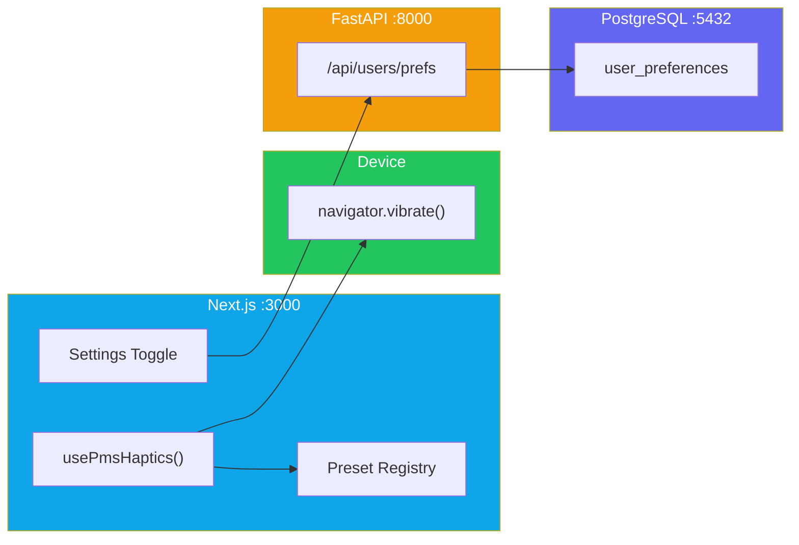

# WebHaptics Setup Guide for PMS Integration

**Document ID:** PMS-EXP-WEBHAPTICS-001
**Version:** 1.0
**Date:** March 12, 2026
**Applies To:** PMS project (all platforms)
**Prerequisites Level:** Beginner

---

## Table of Contents

1. [Overview](#1-overview)
2. [Prerequisites](#2-prerequisites)
3. [Part A: Install and Configure WebHaptics](#3-part-a-install-and-configure-webhaptics)
4. [Part B: Integrate with PMS Backend](#4-part-b-integrate-with-pms-backend)
5. [Part C: Integrate with PMS Frontend](#5-part-c-integrate-with-pms-frontend)
6. [Part D: Testing and Verification](#6-part-d-testing-and-verification)
7. [Troubleshooting](#7-troubleshooting)
8. [Reference Commands](#8-reference-commands)

---

## 1. Overview

This guide walks you through installing the `web-haptics` npm package, creating PMS-specific haptic presets for clinical events, building a `usePmsHaptics` React hook, adding a user preference toggle, and wiring haptic feedback into medication dispensing and encounter workflows.

By the end, you will have:
- WebHaptics installed in the Next.js frontend
- A PMS haptic preset registry mapping clinical events to vibration patterns
- A React hook that respects user preferences and device support
- Haptic feedback firing on medication dispense, encounter save, and critical alerts
- A settings toggle for staff to enable/disable haptics



---

## 2. Prerequisites

### 2.1 Required Software

| Software | Minimum Version | Check Command |
|----------|----------------|---------------|
| Node.js | 18.0+ | `node --version` |
| npm or pnpm | npm 9+ / pnpm 8+ | `npm --version` / `pnpm --version` |
| Python | 3.11+ | `python --version` |
| PostgreSQL | 15+ | `psql --version` |
| Android Chrome (for testing) | 116+ | Check device browser |
| Git | 2.30+ | `git --version` |

### 2.2 Installation of Prerequisites

If you don't have Node.js 18+:

```bash
# macOS (Homebrew)
brew install node@18

# Ubuntu/Debian
curl -fsSL https://deb.nodesource.com/setup_18.x | sudo -E bash -
sudo apt-get install -y nodejs
```

### 2.3 Verify PMS Services

Confirm the PMS backend, frontend, and database are running:

```bash
# Check backend
curl -s http://localhost:8000/health | jq .
# Expected: {"status": "healthy"}

# Check frontend
curl -s -o /dev/null -w "%{http_code}" http://localhost:3000
# Expected: 200

# Check database
psql -h localhost -p 5432 -U pms -d pms_db -c "SELECT 1;"
# Expected: 1
```

---

## 3. Part A: Install and Configure WebHaptics

### Step 1: Install the package

```bash
cd pms-frontend
npm install web-haptics
```

Verify installation:

```bash
npm list web-haptics
# Expected: web-haptics@x.x.x
```

### Step 2: Create the PMS Haptic Preset Registry

Create a new file for PMS-specific haptic presets:

```bash
mkdir -p src/lib/haptics
```

Create `src/lib/haptics/pms-haptic-presets.ts`:

```typescript
/**
 * PMS clinical event haptic presets.
 * Each preset maps a clinical action outcome to a vibration pattern.
 */

export type PmsHapticEvent =
  | "medication-dispensed"
  | "medication-error"
  | "encounter-saved"
  | "encounter-signed"
  | "critical-lab-result"
  | "edit-conflict"
  | "patient-updated"
  | "alert-acknowledged";

export interface PmsHapticPreset {
  name: PmsHapticEvent;
  pattern: number[];      // [vibrate, pause, vibrate, pause, ...] in ms
  description: string;
}

export const PMS_HAPTIC_PRESETS: Record<PmsHapticEvent, PmsHapticPreset> = {
  "medication-dispensed": {
    name: "medication-dispensed",
    pattern: [50, 30, 50],             // Two quick taps — "success"
    description: "Medication successfully dispensed",
  },
  "medication-error": {
    name: "medication-error",
    pattern: [80, 40, 80, 40, 80],     // Three sharp taps — "error"
    description: "Drug interaction or allergy conflict detected",
  },
  "encounter-saved": {
    name: "encounter-saved",
    pattern: [30, 20, 30],             // Gentle double tap — "nudge"
    description: "Encounter note saved as draft",
  },
  "encounter-signed": {
    name: "encounter-signed",
    pattern: [50, 30, 50],             // Firm double tap — "success"
    description: "Encounter note signed and finalized",
  },
  "critical-lab-result": {
    name: "critical-lab-result",
    pattern: [100, 50, 100, 50, 200],  // Escalating pattern — urgent
    description: "Critical lab value received requiring immediate attention",
  },
  "edit-conflict": {
    name: "edit-conflict",
    pattern: [80, 40, 80, 40, 80],     // Three taps — "error"
    description: "Concurrent edit conflict detected on shared record",
  },
  "patient-updated": {
    name: "patient-updated",
    pattern: [40],                      // Single gentle tap — "nudge"
    description: "Patient record updated successfully",
  },
  "alert-acknowledged": {
    name: "alert-acknowledged",
    pattern: [30],                      // Single short tap — confirmation
    description: "Alert acknowledged by clinician",
  },
};
```

### Step 3: Create the `usePmsHaptics` React Hook

Create `src/lib/haptics/use-pms-haptics.ts`:

```typescript
"use client";

import { useCallback, useEffect, useState } from "react";
import { useWebHaptics } from "web-haptics/react";
import { PMS_HAPTIC_PRESETS, type PmsHapticEvent } from "./pms-haptic-presets";

interface UsePmsHapticsOptions {
  /** Override the default enabled state (e.g., from user preferences) */
  enabled?: boolean;
}

interface UsePmsHapticsReturn {
  /** Fire a haptic pattern for a clinical event */
  trigger: (event: PmsHapticEvent) => void;
  /** Whether the device supports haptic feedback */
  isSupported: boolean;
  /** Whether haptics are currently enabled (user preference + device support) */
  isEnabled: boolean;
  /** Toggle haptics on/off */
  setEnabled: (enabled: boolean) => void;
}

export function usePmsHaptics(
  options: UsePmsHapticsOptions = {}
): UsePmsHapticsReturn {
  const { trigger: rawTrigger } = useWebHaptics();
  const [isEnabled, setIsEnabled] = useState(options.enabled ?? true);

  // Check device support
  const isSupported =
    typeof navigator !== "undefined" && "vibrate" in navigator;

  useEffect(() => {
    if (options.enabled !== undefined) {
      setIsEnabled(options.enabled);
    }
  }, [options.enabled]);

  const trigger = useCallback(
    (event: PmsHapticEvent) => {
      if (!isEnabled || !isSupported) return;

      const preset = PMS_HAPTIC_PRESETS[event];
      if (!preset) return;

      rawTrigger(preset.pattern);
    },
    [isEnabled, isSupported, rawTrigger]
  );

  return {
    trigger,
    isSupported,
    isEnabled: isEnabled && isSupported,
    setEnabled,
  };
}
```

### Step 4: Create the barrel export

Create `src/lib/haptics/index.ts`:

```typescript
export { usePmsHaptics } from "./use-pms-haptics";
export { PMS_HAPTIC_PRESETS, type PmsHapticEvent } from "./pms-haptic-presets";
```

**Checkpoint**: You now have WebHaptics installed, a PMS-specific preset registry with 8 clinical event patterns, and a `usePmsHaptics` React hook that handles device detection and user preferences. No vibrations fire yet — that comes in Part C.

---

## 4. Part B: Integrate with PMS Backend

### Step 1: Add haptic preference to user preferences schema

Add a migration for the haptic preferences column:

```sql
-- Migration: add_haptic_preferences.sql
ALTER TABLE user_preferences
ADD COLUMN IF NOT EXISTS haptic_preferences JSONB
DEFAULT '{"enabled": true, "intensity": "medium"}'::jsonb;

COMMENT ON COLUMN user_preferences.haptic_preferences IS
  'User haptic feedback settings: enabled (bool), intensity (low|medium|high)';
```

Run the migration:

```bash
psql -h localhost -p 5432 -U pms -d pms_db -f migrations/add_haptic_preferences.sql
```

### Step 2: Add the FastAPI preference endpoints

Add to the existing user preferences router (e.g., `app/api/routes/user_preferences.py`):

```python
from pydantic import BaseModel, Field
from typing import Literal


class HapticPreferences(BaseModel):
    enabled: bool = Field(default=True, description="Whether haptic feedback is enabled")
    intensity: Literal["low", "medium", "high"] = Field(
        default="medium", description="Vibration intensity level"
    )


@router.get("/users/{user_id}/preferences/haptics", response_model=HapticPreferences)
async def get_haptic_preferences(user_id: int, db: AsyncSession = Depends(get_db)):
    """Get user's haptic feedback preferences."""
    result = await db.execute(
        select(UserPreferences.haptic_preferences).where(
            UserPreferences.user_id == user_id
        )
    )
    prefs = result.scalar_one_or_none()
    if prefs is None:
        return HapticPreferences()
    return HapticPreferences(**prefs)


@router.put("/users/{user_id}/preferences/haptics", response_model=HapticPreferences)
async def update_haptic_preferences(
    user_id: int,
    prefs: HapticPreferences,
    db: AsyncSession = Depends(get_db),
):
    """Update user's haptic feedback preferences."""
    await db.execute(
        update(UserPreferences)
        .where(UserPreferences.user_id == user_id)
        .values(haptic_preferences=prefs.model_dump())
    )
    await db.commit()

    # Audit log the preference change
    await log_audit_event(
        db,
        user_id=user_id,
        action="UPDATE_HAPTIC_PREFERENCES",
        details=prefs.model_dump(),
    )

    return prefs
```

### Step 3: Verify the endpoint

```bash
# Get default preferences
curl -s http://localhost:8000/api/users/1/preferences/haptics | jq .
# Expected: {"enabled": true, "intensity": "medium"}

# Update preferences
curl -s -X PUT http://localhost:8000/api/users/1/preferences/haptics \
  -H "Content-Type: application/json" \
  -d '{"enabled": true, "intensity": "high"}' | jq .
# Expected: {"enabled": true, "intensity": "high"}
```

**Checkpoint**: The backend now stores and serves haptic preferences per user. The audit log records preference changes for HIPAA compliance. The frontend can fetch these preferences on login and use them to configure the `usePmsHaptics` hook.

---

## 5. Part C: Integrate with PMS Frontend

### Step 1: Create the Haptic Preferences Context

Create `src/contexts/haptic-context.tsx`:

```tsx
"use client";

import { createContext, useContext, useEffect, useState, type ReactNode } from "react";
import { usePmsHaptics, type PmsHapticEvent } from "@/lib/haptics";

interface HapticContextValue {
  trigger: (event: PmsHapticEvent) => void;
  isSupported: boolean;
  isEnabled: boolean;
  setEnabled: (enabled: boolean) => void;
  intensity: "low" | "medium" | "high";
  setIntensity: (intensity: "low" | "medium" | "high") => void;
}

const HapticContext = createContext<HapticContextValue | null>(null);

export function HapticProvider({ children, userId }: { children: ReactNode; userId: number }) {
  const [intensity, setIntensity] = useState<"low" | "medium" | "high">("medium");
  const [prefEnabled, setPrefEnabled] = useState(true);

  // Fetch user preferences on mount
  useEffect(() => {
    fetch(`/api/users/${userId}/preferences/haptics`)
      .then((res) => res.json())
      .then((prefs) => {
        setPrefEnabled(prefs.enabled);
        setIntensity(prefs.intensity);
      })
      .catch(() => {
        // Default to enabled on fetch failure — do not block UX
      });
  }, [userId]);

  const haptics = usePmsHaptics({ enabled: prefEnabled });

  const setEnabled = (enabled: boolean) => {
    setPrefEnabled(enabled);
    haptics.setEnabled(enabled);
    // Persist to backend
    fetch(`/api/users/${userId}/preferences/haptics`, {
      method: "PUT",
      headers: { "Content-Type": "application/json" },
      body: JSON.stringify({ enabled, intensity }),
    });
  };

  const updateIntensity = (newIntensity: "low" | "medium" | "high") => {
    setIntensity(newIntensity);
    fetch(`/api/users/${userId}/preferences/haptics`, {
      method: "PUT",
      headers: { "Content-Type": "application/json" },
      body: JSON.stringify({ enabled: prefEnabled, intensity: newIntensity }),
    });
  };

  return (
    <HapticContext.Provider
      value={{
        trigger: haptics.trigger,
        isSupported: haptics.isSupported,
        isEnabled: haptics.isEnabled,
        setEnabled,
        intensity,
        setIntensity: updateIntensity,
      }}
    >
      {children}
    </HapticContext.Provider>
  );
}

export function useHapticContext() {
  const ctx = useContext(HapticContext);
  if (!ctx) throw new Error("useHapticContext must be used within HapticProvider");
  return ctx;
}
```

### Step 2: Add the provider to the app layout

In your root layout or authenticated layout (e.g., `src/app/(authenticated)/layout.tsx`):

```tsx
import { HapticProvider } from "@/contexts/haptic-context";

export default function AuthenticatedLayout({ children }: { children: React.ReactNode }) {
  const userId = getCurrentUserId(); // your existing auth helper

  return (
    <HapticProvider userId={userId}>
      {children}
    </HapticProvider>
  );
}
```

### Step 3: Add haptic feedback to the medication dispense action

In the medication dispensing component:

```tsx
import { useHapticContext } from "@/contexts/haptic-context";

function DispenseMedicationButton({ prescriptionId }: { prescriptionId: number }) {
  const { trigger } = useHapticContext();

  const handleDispense = async () => {
    try {
      const response = await fetch(`/api/prescriptions/${prescriptionId}/dispense`, {
        method: "POST",
      });

      if (response.ok) {
        trigger("medication-dispensed");
        toast.success("Medication dispensed successfully");
      } else {
        const error = await response.json();
        if (error.type === "drug_interaction" || error.type === "allergy_conflict") {
          trigger("medication-error");
        }
        toast.error(error.message);
      }
    } catch {
      trigger("medication-error");
      toast.error("Failed to dispense medication");
    }
  };

  return <Button onClick={handleDispense}>Dispense</Button>;
}
```

### Step 4: Add haptic feedback to encounter save/sign

```tsx
import { useHapticContext } from "@/contexts/haptic-context";

function EncounterActions({ encounterId }: { encounterId: number }) {
  const { trigger } = useHapticContext();

  const handleSave = async () => {
    const res = await fetch(`/api/encounters/${encounterId}`, {
      method: "PUT",
      body: JSON.stringify({ status: "draft" }),
    });
    if (res.ok) trigger("encounter-saved");
  };

  const handleSign = async () => {
    const res = await fetch(`/api/encounters/${encounterId}/sign`, {
      method: "POST",
    });
    if (res.ok) trigger("encounter-signed");
  };

  return (
    <div>
      <Button onClick={handleSave}>Save Draft</Button>
      <Button onClick={handleSign} variant="primary">Sign Note</Button>
    </div>
  );
}
```

### Step 5: Create the haptic settings toggle component

Create `src/components/settings/haptic-settings.tsx`:

```tsx
"use client";

import { useHapticContext } from "@/contexts/haptic-context";

export function HapticSettings() {
  const { isSupported, isEnabled, setEnabled, intensity, setIntensity } =
    useHapticContext();

  if (!isSupported) {
    return (
      <div className="rounded-lg border p-4 text-sm text-muted-foreground">
        Haptic feedback is not available on this device.
        {typeof navigator !== "undefined" && /iPhone|iPad/.test(navigator.userAgent) && (
          <p className="mt-1">iOS Safari does not support the Vibration API.</p>
        )}
      </div>
    );
  }

  return (
    <div className="space-y-4">
      <div className="flex items-center justify-between">
        <label htmlFor="haptic-toggle" className="text-sm font-medium">
          Haptic Feedback
        </label>
        <input
          id="haptic-toggle"
          type="checkbox"
          checked={isEnabled}
          onChange={(e) => setEnabled(e.target.checked)}
          className="h-4 w-4"
        />
      </div>

      {isEnabled && (
        <div>
          <label className="text-sm font-medium">Intensity</label>
          <select
            value={intensity}
            onChange={(e) =>
              setIntensity(e.target.value as "low" | "medium" | "high")
            }
            className="mt-1 block w-full rounded border p-2 text-sm"
          >
            <option value="low">Low</option>
            <option value="medium">Medium</option>
            <option value="high">High</option>
          </select>
        </div>
      )}
    </div>
  );
}
```

**Checkpoint**: The PMS frontend now fires haptic feedback on medication dispense (success/error), encounter save/sign, and exposes a user-controlled settings toggle. Haptics are disabled gracefully on unsupported devices.

---

## 6. Part D: Testing and Verification

### Step 1: Verify WebHaptics installation

```bash
cd pms-frontend
node -e "const { WebHaptics } = require('web-haptics'); console.log('WebHaptics loaded:', typeof WebHaptics === 'function');"
# Expected: WebHaptics loaded: true
```

### Step 2: Run the frontend dev server

```bash
npm run dev
# Navigate to http://localhost:3000 on an Android phone (Chrome)
```

### Step 3: Test haptic presets in browser console

Open Chrome DevTools on an Android device and run:

```javascript
// Check Vibration API support
console.log("Vibration supported:", "vibrate" in navigator);
// Expected: true (on Android Chrome)

// Test raw vibration
navigator.vibrate([50, 30, 50]);
// Expected: Two short taps on the device
```

### Step 4: Test the preference API

```bash
# Get preferences
curl -s http://localhost:8000/api/users/1/preferences/haptics
# Expected: {"enabled": true, "intensity": "medium"}

# Disable haptics
curl -s -X PUT http://localhost:8000/api/users/1/preferences/haptics \
  -H "Content-Type: application/json" \
  -d '{"enabled": false, "intensity": "medium"}'
# Expected: {"enabled": false, "intensity": "medium"}
```

### Step 5: Test graceful degradation on desktop/iOS

Open the PMS frontend on a desktop browser or iOS Safari:

```javascript
// Should be false on desktop/iOS
console.log("Vibration supported:", "vibrate" in navigator);
// Expected: false

// Calling trigger should be a no-op (no errors)
```

### Step 6: Verify no console errors

```bash
# Check Sentry for any WebHaptics-related errors
# or inspect the browser console on both supported and unsupported devices
```

**Checkpoint**: WebHaptics is installed and firing correctly on Android Chrome. The preference API works. Unsupported devices degrade gracefully with no errors. The haptic settings toggle persists preferences to the backend.

---

## 7. Troubleshooting

### No vibration on Android Chrome

**Symptoms**: `navigator.vibrate()` returns `true` but no physical vibration felt.

**Solution**:
1. Check device vibration is not muted in system settings
2. Ensure the call is inside a user gesture handler (click, tap) — the Vibration API requires "sticky user activation"
3. Some devices have "Do Not Disturb" mode that suppresses vibration
4. Try a longer pattern: `navigator.vibrate(500)` — some motors need 50ms+ to be perceptible

### WebHaptics import errors with Next.js

**Symptoms**: `SyntaxError: Cannot use import statement outside a module` or SSR errors.

**Solution**:
1. Ensure `usePmsHaptics` is in a `"use client"` file
2. Add WebHaptics to `transpilePackages` in `next.config.js` if needed:
   ```js
   module.exports = { transpilePackages: ["web-haptics"] };
   ```
3. Use dynamic import if SSR issues persist:
   ```tsx
   const { useWebHaptics } = await import("web-haptics/react");
   ```

### Haptics fire on desktop during development

**Symptoms**: Debug audio plays on desktop (beeping sounds).

**Solution**: WebHaptics has a debug audio mode that replaces vibration with sound on desktop. If you're hearing sounds, check for `debug: true` in the constructor options. Set it to `false` for production:
```typescript
const haptics = new WebHaptics({ debug: false });
```

### User preferences not persisting

**Symptoms**: Haptic toggle resets on page reload.

**Solution**:
1. Check the backend API is reachable: `curl http://localhost:8000/api/users/1/preferences/haptics`
2. Verify the `haptic_preferences` column exists in `user_preferences` table
3. Check browser network tab for failed PUT requests to the preferences endpoint

### iOS Safari — no vibration

**Symptoms**: Haptic feedback does not work on iPhone/iPad.

**Solution**: This is expected behavior. Apple does not implement the Vibration API in any iOS browser. The `WebHaptics.isSupported` check will return `false`, and the `usePmsHaptics` hook will no-op. The settings toggle will show an informational message. No fix is possible on the web — native iOS apps would need to use `UIFeedbackGenerator`.

---

## 8. Reference Commands

### Daily Development Workflow

```bash
# Start frontend with haptics enabled
cd pms-frontend && npm run dev

# Test on Android device via network
# 1. Find your local IP: ifconfig | grep inet
# 2. Open http://<your-ip>:3000 on Android Chrome
# 3. Tap buttons to feel haptic feedback

# Run tests
npm test -- --grep haptic
```

### Management Commands

```bash
# Check WebHaptics version
npm list web-haptics

# Update WebHaptics
npm update web-haptics

# Check bundle size impact
npx next-bundle-analyzer
```

### Useful URLs

| Resource | URL |
|----------|-----|
| PMS Frontend (local) | http://localhost:3000 |
| PMS Backend (local) | http://localhost:8000 |
| User Preferences API | http://localhost:8000/api/users/{id}/preferences/haptics |
| WebHaptics GitHub | https://github.com/lochie/web-haptics |
| WebHaptics Demo Site | https://haptics.lochie.me |
| Vibration API MDN | https://developer.mozilla.org/en-US/docs/Web/API/Vibration_API |
| Browser Compatibility | https://caniuse.com/vibration |

---

## Next Steps

After completing setup, proceed to the [WebHaptics Developer Tutorial](85-WebHaptics-Developer-Tutorial.md) to build your first clinical haptic integration end-to-end, evaluate strengths and weaknesses, and practice debugging common issues.

## Resources

- [WebHaptics GitHub Repository](https://github.com/lochie/web-haptics) — Source code and API reference
- [WebHaptics Demo Site](https://haptics.lochie.me) — Interactive preset demos
- [MDN Vibration API](https://developer.mozilla.org/en-US/docs/Web/API/Vibration_API) — Browser API specification
- [Can I Use: Vibration API](https://caniuse.com/vibration) — Browser compatibility matrix
- [PRD: WebHaptics PMS Integration](85-PRD-WebHaptics-PMS-Integration.md) — Product requirements and architecture
- [WebSocket PMS Integration (Experiment 37)](37-PRD-WebSocket-PMS-Integration.md) — Real-time alert delivery for haptic triggers
